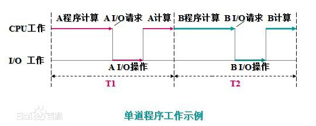

# concurrent programming


## 并发技术发展史

* 穿孔卡片
  * 特点
    * 用户独占整个机器，用户占用率高，资源利用率低
  * 存在的问题
    * CPU与IO（读穿孔卡片、写输出）未分离，CPU利用率低
    * 人工操作穿孔卡片是性能瓶颈


* 联机批处理系统
  * 特点
    * 增加输入机、输出机作为缓存，将人工操作与IO解耦
  * 解决的问题
    * 将人工操作与IO解耦，提升了整体利用率
  * 存在的问题
    * CPU与IO（读输入机、写输出机）未分离，CPU利用率低


* 脱机批处理系统
  * 特点
    * 增加高速磁带作为CPU缓存，将将CPU与IO解耦
  * 解决的问题
    * 减少输入输出的等待时间，增加了CPU的利用率
  * 存在的问题
    * CPU只能执行一道作业，每当发生IO时，CPU处于等待状态


* 多道技术
  * 解决的问题
    * CPU能执行多道作业，每当发生IO时，CPU可以让渡给其他程序使用
  * 意义
    * 多道程序系统的出现，标志着操作系统渐趋成熟的阶段，先后出现了作业调度管理、处理机管理、存储器管理、外部设备管理、文件系统管理等功能
    * 由于多个程序同时在计算机中运行，开始有了空间隔离的概念，只有内存空间的隔离，才能让数据更加安全、稳定
    * 出了空间隔离之外，多道技术还第一次体现了时空复用的特点，遇到IO操作就切换程序，使得cpu的利用率提高了，计算机的工作效率也随之提高





* 多线程技术
  * 多道技术的发展成熟与操作系统的形成密不可分
  * 多道技术在操作系统中即多个程序，即多进程体
  * 多进程存在的问题
    * 切换开销大，数据量和系统调用都更复杂
    * 数据共享和通讯复杂且开销大
    * 使用多进程开发并发程序会造成程序逻辑复杂化
  * 多线程解决的问题
    * 切换开销小、简单
    * 数据共享和通讯开销小、简单
    * 开发并发程序相对多进程容易


* 协程技术
  * 多线程存在的问题
    * 线程仍然有内核态的切换开销
    * 线程同步与死锁处理相对复杂
    * 使用回调实现异步编程相对复杂
    * 妥协方案Future、Promise等封装相对难以理解
  * 协程解决的问题
    * 协程完全在用户态切换，减少了切换开销
    * 部分减少同步与死锁的问题
    * 切换过程对用户透明，用户使用同步代码编写方法，降低了学习成本


## 并发编程概念


### 并发与并行的区别

* 并行
  * 微观概念
  * 多个程序同时执行
  * 需要有多个cpu
* 并发
  * 宏观概念
  * 多个程序只要看起来像同时运行即可
  * CPU运行速度非常快，用户是感受不到切换


### 单核调度算法

* 先来先服务，FCFS（First Come，First Serve）
  * 缺点
    * 短作业长时间得不到执行
* 短作业优先，SJN（Shortest Job Next）
  * 优点
    * 减少了平均等待时间
  * 缺点
    * 长作业可能长时间得不到执行
* 时间片轮转调度，RR（Round Robin）
  * 原理
    * 进程按顺序排队
    * 每个进程执行固定时间片段后，重新加入队尾
  * 优点
    * 减少了平均等待事件
    * 所有进程公平获得执行机会
  * 缺点
    * 切换机制死板，可能导致不必要的切换
    * 可能增加短作业的平均执行时间
* 多级队列调度
  * 原理
    * 结合时间片轮转机制
    * 将进程分为多个队列，优先级依次递减
    * 新创建的进程放入高优先级队列
    * 时间片用完之后，放入低一级队列
  * 缺点
    * 缺少反馈机制，长作业可能得不到执行
* 多级反馈队列调度
  * 原理
    * 在多级队列调度的基础上
    * 长作业主键被移到高优先级的队列


### 进程状态机


## 高层线程模块，threading

* 简介
  * `threading`模块是对底层接口模块`_thread`模块的封装
  * 由于解释器`CPython`实现中的全局解释器锁的存在，同一时刻只有一个线程可以执行Python代码，所以`threading`模块只适用于I/O密集型任务，不适用于计算密集型任务
  * 计算密集型任务可以使用多进程


### 创建线程

* 使用要点
  * `threading.Thread`类代表一个在独立控制线程中的运行的活动
  * 指定活动有两种方式
    * 向构造器传递一个可调用对象，即函数式创建线程
    * 继承`Thread`类，重载`Thread.run`方法，即类式创建线程
  * 继承`Thread`类的注意事项
    * 用户只应该重载`Thread.__init__`方法和`Thread.run`方法
  * 启动线程
    * 必须调用`Thread.start`方法开始线程


* 函数式启动线程示例
  * 函数式创建线程对线，`thread = threading.Thread(target=loop, name='name')`
  * 启动线程，`thread.start()`
  * 阻塞在调用点直到线程结束，`thread.join()`


```python
import threading
import time
import random

def loop(tid):
    for times in range(10):
        sleep_time = random.random()
        time.sleep(sleep_time)
        print('thread {} sleep {}'.format(tid, sleep_time))
    print('thread {} stop'.format(tid))

tl = [threading.Thread(target=loop, name='thread {}'.format(i), args=[i]) for i in range(4)]

[x.start() for x in tl]
[x.join() for x in tl]
print('all thread stoped')
```


* 继承式启动线程

```python
from threading import Thread
class Task(Thread):
    def __init__(self):
        Thread.__init__(self)

    def run(self):
        pass

task = Task()
task.start()
task.join()
```


### 守护线程

* 功能
  * 当一个进程剩下的线程都是守护线程时，整个 Python 程序将会退出


* 设置一个线程为守护线程的两种方式

  * 调用`threading.Thread.setDaemon()`

  * 设置构造函数的参数`daemon`为任意非`None`值，如`threading.Thread(daemon=True)`


* 注意
  * 守护线程在程序关闭时会突然关闭。他们的资源（例如已经打开的文档，数据库事务等等）可能没有被正确释放。
  * 如果你想你的线程正常停止，设置他们成为非守护模式并且使用合适的信号机制，如`Event`
  * 主线程对应Python程序里面初始的控制线程，它不是一个守护线程。


### 全局解释器锁，GIL

* Python的线程虽然是真正的线程，但解释器执行代码时，有一个GIL锁：Global Interpreter Lock，任何Python线程执行前，必须先获得GIL锁
* 每执行100条字节码，解释器就自动释放GIL锁，让别的线程有机会执行
* 这个GIL全局锁实际上把所有线程的执行代码都给上了锁，所以，多线程在Python中只能交替执行，即使100个线程跑在100核CPU上，也只能用到1个核


* 既然有GIL，为什么还需要有线程锁？


### 定时器，Timer

* 什么是Timer
  * 启动一个定时器，延迟一段时间再执行


* 注意事项

  * `threading.Timer`是`threading.Thread`的子类，是线程的一种应用，与同一个线程内的调度器有本质区别

  * 回调是在另一个线程触发，使用资源时需要注意线程安全


* 间隔任务示例

```python
def r():
    print('Time's up')
    t.start()

t = threading.Timer(5, r)
t.start()
```


### 线程间同步（互斥）


#### 原始锁，Lock

* 说明
  * 对低级接口的直接封装

* 功能
  * 只能在一个线程的一个位置获得锁

* 两种状态
  * 锁定
  * 非锁定
* 接口
  * 获取锁
    * `threading.Lock.acquire(blocking=True, timeout=-1)`
    * 当状态为未锁定时，则锁定并返回
    * 当状态为已锁定时，则阻塞直到锁被其他线程释放锁，然后再锁定并返回
  * 释放锁
    * `threading.Lock.release()`
    * 当状态为已锁定时，才能调用
    * 当状态为锁定时，调用会返回`RuntimeError`异常
  * 获取锁定状态
    * `threading.Lock.locked()`


* 普通方式使用锁

```python
lock = threading.Lock()

# 加锁
lock.acquire()

# 捕获异常，避免死锁
try
    # 临界区内容
    pass
finally:
    
    # 释放锁
    lock.release()
```


* 上下文管理器使用锁
  * 异常时自动释放锁

```python
lock = threading.Lock()
with lock:
    # 临界区内容
    pass
```


* 多线程使用锁的示例
  * 不加锁可能会执行超过MAX_COUNT次

```python
"""
多线程竞争加1

启动 MAX_THREAD_NUM 个线程
对 TestThread.Count + 1
直到 TestThread.Count 大于等于 MAX_COUNT
"""

from icecream import ic
import threading


MAX_THREAD_NUM = 100
MAX_COUNT = 1000000


class TestThread(threading.Thread):
    Lock = threading.Lock()
    Count = 0

    def __init__(self, *args, **kwargs) -> None:
        self.local_count = 0
        super().__init__(*args, **kwargs)

    def run(self) -> None:
        while True:
            try:
                # 使用with语句，可以自动处理异常并释放锁
                with TestThread.Lock:

                    # 抛出异常
                    if TestThread.Count >= MAX_COUNT:
                        e_str = f'{self.name} Count 达到最大值退出'
                        raise Exception(e_str)

                    # 自增
                    else:
                        TestThread.Count = TestThread.Count + 1
                        self.local_count = self.local_count + 1

            except Exception:
                break


# 初始化
thread_list = [TestThread(name=f'T-{i}') for i in range(MAX_THREAD_NUM)]

# 启动线程
[t.start() for t in thread_list]

# 阻塞等待所有线程退出
[t.join() for t in thread_list]

# 统计实际自增次数
ic(sum([t.local_count for t in thread_list]))
```


#### 递归锁/重入锁，RLock

* 功能
  * 可以被一个线程多次获取，但不能被不同线程同时获取
* 原理
  * 在内部记录当前锁定的线程和锁定次数（递归等级）
  * 已锁定时，相同线程可以获得锁，并计数
* 状态
  * 锁定，某个线程拥有锁
  * 未锁定，没有线程拥有锁
* RLock对比Lock
  * Lock
    * 优点
      * 性能高，直接对应底层接口
      * 内部机制简单易懂
    * 缺点
      * 在同一线程中，递归获取锁，会导致死锁
      * 对于复杂场景的使用门槛较高
  * RLock
    * 优点
      * 同一线程，可以递归多次获取锁
      * 通过一次封装，降低使用门槛，复杂场景时无需考虑是否已经加过锁
    * 缺点
      * 性能比原始锁差


#### 条件对象，Condition

* 功能
  * 封装了一种编程模型，降低锁的锁定范围，形成一种生产者消费者模型
  * 当生产者满足某个条件后，并通知一个或多个消费者
  * 消费者等待条件满足后，开始工作


* 使用方法
  * 条件对象自身需要受到保护，如果构造函数没有传入，则默认会创建一个递归锁
  * 生产者获得条件对象的递归锁后，可以通知消费者条件改变
  * 消费者获得条件对象的递归锁后，可以等待生产者改变条件，等待期间条件对象会自动释放锁，等待结束条件对象会重新申请锁
  * 也可以生产者消费者合二为一，作为一种对称的、可多次使用的通知机制
  * 如果不使用条件对象封装的`wait()`和`notify()`机制，条件对象会退化为一个递归锁


* 编程模型

```python
# 生产者

# 竞争条件对象
# 此处等同于加锁，notify并不释放锁
with condition:
	# 改变多线程都会使用的临界信息
    pass

	# 通知等待者，即消费者
    condition.notify()
```

```python
# 消费者

# 竞争条件对象
# 此处不等同于加锁，因为wait时会使用消费者、生产者之间一对一的锁，替换保护条件对象临界内容的锁
with condition
	# 查询多线程都会使用的临界信息
    while not 某个条件:
        # 等待
        condition.wait()
        
    # 改变多线程都会使用的临界信息
    pass
    # wait()获得权限后，会重新竞争conditon的保护锁，此处代码相当于加锁状态
```


* 生产者消费者示例

```python
"""
多个工作线程等待任务

生产者生产 PRODUCE_TIMES 批任务
每批随机生产 [1, WORDER_NUM] 个任务
WORDER_NUM 个工作线程等待执行
"""

import time
from icecream import ic
import threading
import random


TASK_LIST = []
WORDER_NUM = 5
PRODUCE_TIMES = 10
STOP_SIGN = False
CONDITION = threading.Condition()


def produce():
    # 生产 PRODUCE_TIMES 批任务后结束生产

    for batch in range(PRODUCE_TIMES):
        # 生产任务（需要1秒）
        time.sleep(1)
        task_num = random.randint(1, WORDER_NUM)

        # 发放任务
        with CONDITION:
            for task_id in range(task_num):
                TASK_LIST.append(f'batch {batch} task {task_id}')
            CONDITION.notify(task_num)
            ic(f'Batch {batch} produce {task_num} tasks')

    STOP_SIGN = True


def consume():
    task = None

    # 获取任务
    with CONDITION:
        CONDITION.wait_for(lambda: len(TASK_LIST))
        task = TASK_LIST.pop()
        print(f'Worker {threading.current_thread().getName()} get {task}')

    # 消费任务（需要1秒）
    time.sleep(1)


class WorkerThread(threading.Thread):
    def run(self) -> None:
        while not STOP_SIGN:
            consume()


# 初始化
thread_list = [WorkerThread(name=f'WORKER-{i}') for i in range(WORDER_NUM)]

# 启动线程
[t.start() for t in thread_list]

# 生产
produce()

# 等待线程结束
[t.join() for t in thread_list]

```


* 注意事项
  * 什么时候需要外部传入锁
    * 当多个条件对象需要共享一个临界区时，用户可以自行传入锁
  * `Conditon.notify(n=1)`和`Condition.notify_all()`的区别
    * 取决于生产者的一次条件改变，需要被几个工作线程所用
    * 由生产者控制需要唤醒的工作线程
  * `Condition.wait(timeout=None)`与`Conditon.wait_for(predicate, timeout=None)`的区别
    * `wait_for`是对`wait`的封装
    * 将用户需要实现的循环等待直到满足某个条件封装在内部


* `wait_for`的使用方法
  * 可以将条件判断封装为一个`Callable`
  * `Callable`满足条件后竞争得到锁，`wait_for`返回前会再次执行`Callable`作为返回值，可以检查`wait_for`的返回值作为 Double Check


#### 信号量，Semaphore

* 功能
  * 信号量表示一个原子的计数器，表示有多少个资源可以被使用
  * 多线程竞争得到一个信号，则信号计数减1
  * 多线程释放一个信号，则信号计数加1
  * 在其他编程语言中，信号量可能对应一个原子的指令，但是在Python中信号量是使用条件变量实现的。即在Python中，信号量是对条件对象的一个特殊使用场景的封装。


#### 有界信号量，BoundedSemaphore

* 功能

  * 对信号量进行检查，避免信号量的当前值超过初始值

  

* 原理
  * 可能由于用户编码错误，多次调用`Semaphore.release(n=1)`，或者传递的参数`n`与实际申请的不符


#### 事件，Event

* 功能
  * 事件表示一个简单的布尔信号，初始状态为`False`，但是内部实现也是基于条件对象
  * 当一个线程调用`threading.Event.wait()`时，进入等待状态
  * 其他线程调用`threading.Event.set()`时，事件状态改变为`True`，同时等待的线程被唤醒


#### 栅栏，Barrier

* 功能
  * 固定数量的线程彼此等待，当所有线程都准备好时，大家同时获得唤醒


* 原理
  * 内部实现也是基于条件对象
  * 所有等待的线程互为生产者消费者


### 线程间通信/消息队列，queue

* 为什么要有queue模块
  * 创造线程概念的初衷就是为了规避进程间通信的不便，所有线程都运行在一个进程内部，原本就是共享所有数据的访问权限
  * 只是为了规避多线程同时访问一个资源，改变数据的一致性，所以需要考虑线程间的同步和互斥
  * queue并非一个考虑性能的数据结构，而是一个简单的消息队列
  * queue模块的实现完全是为了使用方便，所有数据操作都有锁保护数据的一致性，在python进程内部的多线程环境下是完全安全的


* 什么是queue模块

  * queue模块实现了多生产者多消费者的队列

  * queue模块将任务获取和任务完成解耦，实现了消息队列任务重试的基本功能


* queue模块封装的几种队列
  * `class queue.Queue`
    * 实现了队列的基础接口
    * FIFO，First In First Offer，先进先出队列
    * 发布任务，`Queue.put(item, block=True, timeout=None)`
    * 获取任务，`Queue.get(block=True, timeout=None)`
    * 完成任务，`Queue.task_done()`
    * 等待所有任务完成，`Queue.join()`，内部使用条件变量，队列中所有任务完成后，等待者获得通知
  * `class queue.LifoQueue(Queue)`
    * LIFO，Last In First Offer，后进先出队列
  * `class queue.PriorityQueue(Queue)`
    * 优先级队列，值小的任务会被优先消费
    * 发布任务时，任务项为一个元组，`(优先级, 数据)`
    * ==`数据`也会被比较，需要有可比性，如果没有可比性可以自定义一个类包裹，只比较优先级==
    * 内部使用二叉树动态排序
  * `class queue.SimpleQueue`
    * 简化的队列，并不是`queue.Queue`的子类
    * 没有大小限制
    * 没有完成任务接口
    * 没有等待任务完成接口


* queue.Queue 使用示例

```python
import threading, queue
q = queue.Queue()

def worker():
    while True:
        item = q.get()
        q.task_done() # 不调用task_done会导致join()一直阻塞

threading.Thread(target=worker, daemon=True).start()
for item in range(30):
    q.put(item)

q.join() # block until all task_done
```


## 底层线程模块，_thread

* todo


## Linux原生多进程，os.fork

* 原理
  * Unix/Linux提供一个系统调用fork()，调用一次返回两次，操作系统把当前进程复制一份作为子进程


* 父进程如何判断子进程创建成功

  * 子进程永远返回0，父进程返回子进程ID，可以据此在代码中判断当前处于父进程还是子进程

  * 记忆方法
    * 父进程需要获得产生的子进程的ID


* 子进程如何知道自己是谁
  * 子进程永远返回0，
  * 子进程获取自己的进程ID，`os.getpid()`
  * 子进程获取父进程的ID，`getppid()`


```python
#!/usr/bin/python

'Unix/Linux/Mac only'

import os

print('main pid is {}'.format(os.getpid()))
pid = os.fork()

if pid:
    print('main receive child pid is {}'.format(pid))
    print('main pid is {}, ppid is {}'.format(os.getpid(), os.getppid()))
else:
    print('child pid is {}, ppid is {}'.format(os.getpid(), os.getppid()))
```


## 多进程模块，multiprocessing


### 进程，Process

* `multiprocessing`是跨平台的多进程模块
* 使用多进程，不受全局解释器锁限制，适合CPU密集型任务
* `Process` 类代表一个进程对象，与县城`Thread`的接口类似


* 注意事项
  * `multiprocessing`在 windows 上模拟`fork`操作，将对象通过`pickle`序列化后传到子进程，调用失败时需要检查`pickle`操作
  * `multiprocessing`创建进程必须在`if __name__ == '__main__'`之内，用以区分父子进程。因为`multiprocessing`通过`import`而非`fork`实现创建进程。


* 目标函数创建进程
  * 函数也可以是对象的方法

```python
from multiprocessing import Process
import os

# 子进程运行函数
def r():
    print('child process pid is {} ppid is {}'.format(os.getpid(), os.getppid()))

if __name__ == '__main__':
    print('main process pid is {}'.format(os.getpid()))
    # 创建进程对象，target为运行函数，args为运行参数
    pl = [Process(target=r) for i in range(6)]
    [p.start() for p in pl] # 启动子进程
    [p.join() for p in pl] # 等待子进程结束后再继续往下运行，用于进程间同步
```


* 继承类创建进程
  * 继承Process，覆盖Process.run函数
  * Process的属性，包括`__init__`中初始化的属性，会pickle后传递给新进程
  * <https://bugs.python.org/issue8289>

```python
from multiprocessing import Process
import os

class P(Process):
    def run(self):
        print('child process pid is {} ppid is {}'.format(os.getpid(), os.getppid()))

if __name__ == '__main__':
    print('main process pid is {}'.format(os.getpid()))
    pl = [P() for i in range(6)]
    [p.start() for p in pl]
    [p.join() for p in pl]
```


### 进程池，Pool

* 什么是`multiprocessing.Pool`
  * 方法


* 注意事项
  * 超过Pool进程数量的任务会等待进程空闲依次执行


* 常用方法
  * `Pool.apply(func[, args[, kwds]])`
    * 在进程执行方法，阻塞直到完成。
  * `Pool.apply_async(func[, args[ kwds[, callback[, error_callback]]]])`
    * 在进程执行方法，立即返回，使用回调返回结果。
  * `AsyncResult.get([timeout])` 
    * 获取结果，或者等待结果直到超时。
  * `Pool.map(func, iterable[, chunksize])`
    * map的多进程版，阻塞等待结果
    * 返回结果list
    * 默认iterable每个item在一个进程中执行
    * 设置chunksize，则按chunksize分组在不同进程中执行
  * `Pool.map_async(func, iterable[, chunksize[, callback, [, error_callback]]])`
    * map多进程版，异步回调结果
    * 返回MapResult
    * 异步体现在回调，如果从MapResult中获取结果，会阻塞在get
  * apply和apply_async返回multiprocessing.pool.AsyncResult对象，用于获取结果


* apply阻塞示例

```python
from multiprocessing import Pool
import time

def f():
    time.sleep(1)
    return time.time()

if __name__ == '__main__':
    with Pool(5) as p:
        print(p.apply(f))
        print(p.apply(f))
```


* apply_async示例

```python
# 示例1
from multiprocessing import Pool
import os
import time

def r():
    print('child process pid is {} ppid is {}'.format(os.getpid(), os.getppid()))
    time.sleep(1)

if __name__ == '__main__':
    print('main process pid is {}'.format(os.getpid()))

    p = Pool(4)
    [p.apply_async(r) for i in range(5)]
    p.close()
    p.join()

# 示例2
from multiprocessing.pool import Pool
import os, time, random

def long_time_task(name):

    # time.time() # current utc second.millisecond
    # random.randome() # 0 - 1 randome num
    
    start = time.time()
    time.sleep(random.random() * 3)
    end = time.time()
    
    print('Task %s pid %s runs %0.2f seconds' %(name, os.getpid(), (end-start)))
    

if __name__ == '__main__':

    # n默认=cpu核数，第n+1个进程会等到有进程退出才运行，想要同时运行n+1个进程需要设置P(n+1)
    p = Pool(n) 
    for i in range(5):
        p.apply_async(long_time_task, args=(i,))
    
    # Pool对象调用join方法会等待所有子进程执行完毕
    # 先调用close，避免Pool添加新的进程，在调用join
    p.close()
    p.join()
```


* map示例

```python
from multiprocessing import Pool
import time
import os

def f(x):
    time.sleep(1)
    return os.getpid(), os.getppid()

if __name__ == '__main__':
    result = None
    
    with Pool(5) as p:
        # 不设置chunksize，在3个进程中执行
        result = p.map(f, [1, 2, 3])
        
        # 设置chunksize，3个一组，在1个进程中执行
        # result = p.map(f, [1, 2, 3], 3)
        
        type(result) # list
        print(result)
```


* map_async示例

```python
from multiprocessing import Pool
import time
import os

def f(x):
    time.sleep(1)
    return os.getpid(), os.getppid()

if __name__ == '__main__':
    result = None
    
    with Pool(5) as p:
        result = p.map_async(f, [1, 2, 3])
        type(result) # MapResult(AsyncResult)

        # 在此阻塞等待结果
        print(result.get()) 
```


### 子进程，subprocess


* `subprocess.call`，命令式调用

```python
import subprocess
r = subprocess.call(['nslookup', 'www.python.org'])
print('Exit code:', r)
```


* `subprocess.communicate`，持续交互

```python
import subprocess
p = subprocess.Popen(['nslookup'], stdin=subprocess.PIPE, stdout=subprocess.PIPE, stderr=subprocess.PIPE)
output, err = p.communicate(b'set q=mx\npython.org\nexit\n') # 持续输入序列
print(output.decode('utf-8'))
print('Exit code:', p.returncode)
```


### multiprocessing的上下文和启动模式

* `multiprocessing`支持三种启动进程的模式
  * `spawn`（win、mac 默认）
    * 子进程使用新的python解释器
    * 子进程只继承`Process.run()`方法所需的资源
    * 非必须的文件描述符和句柄不会被继承
    * 相对于`fork`和`forkserver`慢很多
    * POSIX和WINDOWS平台都可用
  * `fork`（除 macOS 之外的 POSIX 默认）
    * `os.fork()`产生解释器分叉，子进程与父进程相同
    * 父进程所有资源都被子进程继承
    * 支持 POSIX
    * 在子进程里无法再次`fork`
    * Python 3.14 之后，不再默认
  * `forkserver`
    * 启动服务器进程，父进程连接到服务器请求分叉一个新进程。
    * 没有不必要的资源被继承
    * 在支持通过Unix管道传递文件描述符的 POSIX 平台上可用，如 Linux


* 注意事项
  * 为避免子进程被杀死造成资源泄漏，unix上通过`spawn`和`forkserver`方式启动多进程会同时启动一个资源追踪进程，在所有进程退出后，负责释放泄露的资源。
  * `'spawn'` 和 `'forkserver'` 启动方法在 POSIX 系统上通常不能与 “已冻结” 可执行程序一同使用（例如由 `PyInstaller` 和 `cx_Freeze` 等软件包产生的二进制文件）。 如果代码没有使用线程则可以使用 `'fork'` 启动方法。


* 设置启动方法的方法
  * 主模块中设置默认启动方法
  * 使用上下文对象选择特定启动方法
    * 上下文对象与`multiprocessing`模块具有相同的API，并允许在同一程序中使用多种启动方法


```python
# 主模块中设置默认启动方法

import multiprocessing

if __name__ == '__main__':
    multiprocessing.set_start_method('spawn')
```


```python
# 使用上下文对象选择特定启动方法

import multiprocessing

if __name__ == '__main__':
    ctx = multiprocessing.get_context('spawn')
    ctx.Process(target=foo)
```


### 进程间通信


#### 队列，Queue

* 什么是`multiprocessing.Queue`
  * `multiprocessing.Queue`用于多个进程间通信的队列，多个Process可以同时操作队列，是进程安全、线程安全的
  * `multiprocessing.Queue`内部使用管道Pipe加锁实现
  * 放入`multiprocessing.Queue`的对象，会被一个后台线程用`pickle`序列化


* `multiprocessing.Queue`的接口
  * `multiprocessing.Queue`与`queue.Queue`接口类似，只缺少`Queue.task_done()`功能，使得父类更加简洁，`multiprocessing`模块中另有`multiprocessing.JoinableQueue`类，实现了`Queue.task_done()`功能
  * 创建队列，`multiprocessing.Queue()`
  * 发布任务，`Queue.put(obj, block=True, timeout=None)`
  * 监听任务，`Queue.get(block=True, timeout=None)`
  * 关闭队列，相比`queue.Queue`多了`Queue.join_thread()`和`Queue.close()`接口


* `multiprocessing.Queue`示例

```python
from multiprocessing import Queue
# processwrite.join()
# processread.terminate()

# 示例
from multiprocessing import Process, Queue
import os
import time

def r(q):
    while not q.empty():
        print('Child process {} count {}'.format(os.getpid(), q.get()))
        time.sleep(1)

if __name__ == '__main__':
    print('main process pid is {}'.format(os.getpid()))

    q = Queue()

    pl = [Process(target=r, args=(q,)) for _ in range(100)]
    [p.start() for p in pl]

    for count in range(1000):
        q.put(count)

    [p.join() for p in pl]

    q.close()
    q.join_thread()
```


#### 简单队列，SimpleQueue

* `multiprocessing.SimpleQueue`
  * 一个简化的`multiprocessing.Queue`
  * 发送消息，`SimpleQueue.put(item)`
  * 获取消息，`SimpleQueue.get()`
  * 没有关闭接口


#### 消息队列，JoinableQueue

* 什么是`multiprocessing.JoinableQueue`
  * `multiprocessing.JoinableQueue`是`multiprocessing.Queue`的子类
  * 扩展了`JoinableQueue.task_done()`和`JoinableQueue.join()`功能


* `multiprocessing.JoinableQueue`接口
  * `JoinableQueue.task_down()`
    * 每个每次调用get()、执行完任务后，执行task_down()标记任务完成，join释放
  * `JoinableQueue.join()`
    * 阻塞直到任务完成


#### 管道，Pipe

* 什么是管道
  * 管道是操作系统提供的一种通信机制
  * 管道默认是双工的，既可读，又可写
  * 管道只能用于两个进程间通信


* 内部机制
  * `multiprocessing.Pipe`不同于`os.pipe()`返回的操作系统管道，是独立的封装
  * 在 Linux 平台下，单向管道使用的是操作系统的管道，双向管道底层使用的是`socket`


* 使用要点
  * `Pipe`实际是一个工厂函数，返回两个`multiprocessing.connection.Connection`对象
  * `Pipe`工厂默认是双工的
  * 通过指定参数`Pipe(duplex=True)`，设置管道为单工，返回的两个`Connection`，前一个只读，后一个只写


* 管道使用示例


```python
# 示例
from multiprocessing import Process, Pipe
import os
import time

def r(pipe):
    while True:
        r = pipe.recv()
        print('Child process {} receive {}'.format(os.getpid(), r))
        time.sleep(1)
        pipe.send(r)

if __name__ == '__main__':
    parent_pipe, child_pipe = Pipe()
    
    p = Process(target=r, args=(child_pipe,))
    p.start()

    parent_pipe.send('Hello')
    while True:
        r = parent_pipe.recv()
        print('Main process {} receive {}'.format(os.getpid(), r))
        time.sleep(1)
        parent_pipe.send(r)

    p.join()
```


#### 封装的共享内存，Value、Array

* multiprocessing.Value ，单一，固定类型数据共享

* multiprocessing.Array ，数组，固定类型数据共享


* 在子进程中修改数据示例


```python
from multiprocessing import Process, Value, Array

def f(n, a):
    n.value = 3.1415927
    for i in range(len(a)):
        a[i] = -a[i]

if __name__ == '__main__':
    num = Value('d', 0.0)
    arr = Array('i', range(10))

    p = Process(target=f, args=(num, arr))
    p.start()
    p.join()

    print(num.value)
    print(arr[:])
```


#### ctypes共享内存，sharedctypes

* todo


#### SystemV共享内存，SharedMemory


#### 数据管理器/服务进程，Manager

* 什么是数据管理器/服务进程
  * 由数据管理器，创建并控制一个进程，用于保存 Python 对象
  * 用于进程间或者跨网络进程间共享数据
  * 其他进程使用代理，操作 Python 对象


* 注意事项
  * 效率低、速度慢


* multiprocess.Manager()


* 数据管理器/服务进程支持的数据类型
  * `list`
  * `dict`
  * `multiprocessing.Namespace`
  * `multiprocessing.Queue`
  * `multiprocessing.Value`
  * `multiprocessing.Array`


* 同步原语也算作支持的数据类型
  * `Lock`
  * `RLock`
  * `Semaphore`
  * `BoundedSemaphore`
  * `Condition`
  * `Event`
  * `Barrier`


* 在子进程中修改值示例


```python
from multiprocessing import Process, Manager

def f(d, l):
    d[1] = '1'
    d['2'] = 2
    d[0.25] = None
    l.reverse()

if __name__ == '__main__':
    with Manager() as manager:
        d = manager.dict()
        l = manager.list(range(10))

        p = Process(target=f, args=(d, l))
        p.start()
        p.join()

        print(d)
        print(l)
```


#### 分布式进程的通信

* 实现在另一个进程的数据共享
* 可以实现在远端执行代码，但是两端代码必须使用相同定义
* 可以通过互联网跨服务器共享数据，同步互斥等


##### 示例

* Server


```python
import queue
from multiprocessing.managers import BaseManager

task_queue = queue.Queue()
result_queue = queue.Queue()

class QueueManager(BaseManager):
    pass

# lambda 暂不支持序列化
def get_task_queue(): return task_queue
def get_result_queue():	return result_queue

# 远程执行函数必须可识别
def server_exit():
	return 'exit'

# manager启动监听进程，必须在main中启动
def main():
	QueueManager.register('get_task_queue', callable=get_task_queue)
	QueueManager.register('get_result_queue', callable=get_result_queue)

	manager = QueueManager(address=('127.0.0.1', 5000), authkey=b'abc')
	manager.start()

	# 必须从manager获取托管后的queue
	task = manager.get_task_queue()
	result = manager.get_result_queue()

	while True:
		n = task.get()
		r = n()
		if r == 'exit':
			break;
		result.put(r)

	manager.shutdown()
	print('worker exit.')


if '__main__' == __name__:
	main()
```


* Client


```python
import time, sys, queue, random
from multiprocessing.managers import BaseManager
import functools

class QueueManager(BaseManager):
    pass

QueueManager.register('get_task_queue')
QueueManager.register('get_result_queue')

server_addr = '127.0.0.1'
print('Connect to server %s...' % server_addr)
m = QueueManager(address=(server_addr, 5000), authkey=b'abc')

m.connect()

task = m.get_task_queue()
result = m.get_result_queue()

# 远程函数必须可识别（已定义）
def server_exit():
	return 'exit'

# 发送任务
for i in range(10):
    n = functools.partial(print, 'Hello World!')
    print('Put task %s...' % n)
    task.put(n)
task.put(functools.partial(server_exit))

# 读取结果
for i in range(10):
    r = result.get(timeout=10)
    print('Result: %s' % r)
	
print('master exit.')
```


##### 抽象通用远程任务队列

* remote_queue.py


```python
from multiprocessing.managers import BaseManager
from multiprocessing import Queue

DEFAULT_AUTHKEY = b'password'
GET_TASK_Q_FUNC_NAME = 'get_task_queue'
GET_RESULT_Q_FUNC_NAME = 'get_result_queue'

class RemoteQueueManager(BaseManager):
	pass


class RemoteQueueServer:
	def __init__(self, address, authkey=DEFAULT_AUTHKEY):
		self.address = address
		self.authkey = authkey
		self.__task_queue = Queue()
		self.__result_queue = Queue()
		
		self.__manager = None
		self.__proxy_task_queue = None
		self.__proxy_result_queue = None

	def get_internal_task_queue(self): return self.__task_queue
	def get_internal_result_queue(self): return self.__result_queue

	def start(self):
		RemoteQueueManager.register(GET_TASK_Q_FUNC_NAME, callable=self.get_internal_task_queue)
		RemoteQueueManager.register(GET_RESULT_Q_FUNC_NAME, callable=self.get_internal_result_queue)
			
		self.__manager = RemoteQueueManager(address=self.address, authkey=self.authkey)
		self.__manager.start()
		
		self.__proxy_task_queue = getattr(self.__manager, GET_TASK_Q_FUNC_NAME)()
		self.__proxy_result_queue = getattr(self.__manager, GET_RESULT_Q_FUNC_NAME)()

	def shutdown(self):
		self.__manager.shutdown()
		self.__manager = None
		self.__proxy_task_queue = None
		self.__proxy_result_queue = None
		
	def get_task_queue(self):
		if self.__proxy_task_queue is None:
			self.start()
		return self.__proxy_task_queue
	
	def get_result_queue(self):
		if self.__proxy_result_queue is None:
			self.start()
		return self.__proxy_result_queue


class RemoteQueueClient:
	def __init__(self, address, authkey=DEFAULT_AUTHKEY):
		self.address = address
		self.authkey = authkey
		self.__manager = None 
		self.__proxy_task_queue = None
		self.__proxy_result_queue = None

	def connect(self):
		RemoteQueueManager.register(GET_TASK_Q_FUNC_NAME)
		RemoteQueueManager.register(GET_RESULT_Q_FUNC_NAME)
	
		self.__manager = RemoteQueueManager(address=self.address, authkey=self.authkey)
		self.__manager.connect()

		self.__proxy_task_queue = getattr(self.__manager, GET_TASK_Q_FUNC_NAME)()
		self.__proxy_result_queue = getattr(self.__manager, GET_RESULT_Q_FUNC_NAME)()
		
	def get_task_queue(self):
		if self.__proxy_task_queue is None:
			self.connect()
		return self.__proxy_task_queue
	
	def get_result_queue(self):
		if self.__proxy_result_queue is None:
			self.connect()
		return self.__proxy_result_queue
```


* tasks.py，任务函数


```python
def run():
	print("Hello World!")

def shutdown():
	return 'shutdown'
```


* server.py，监听并执行任务


```python
from remote_queue import RemoteQueueServer

LISTEN_ADDR = 'localhost'
LISTEN_PORT = 9697

# manager启动监听进程，必须在main中启动
def main():
	server = RemoteQueueServer(address=(LISTEN_ADDR, LISTEN_PORT))
	server.start()

	task_queue = server.get_task_queue()
	result_queue = server.get_result_queue()

	while True:
		n = task_queue.get()
		r = n()
		result_queue.put(r)

		if r == 'shutdown':
			break;
			server.shutdown()
			print('worker exit.')

if '__main__' == __name__:
	main()
```


* client.py，连接并发送任务


```python
import functools
from remote_queue import RemoteQueueClient
from tasks import run, shutdown

SERVER_ADDR = '127.0.0.1'
SERVER_PORT = 9697

client = RemoteQueueClient(address=(SERVER_ADDR, SERVER_PORT))
client.connect()

task_queue = client.get_task_queue()
result_queue = client.get_result_queue()

task_queue.put(run)
# print('Put task %s...' % n)

# 远程执行结束函数
task_queue.put(shutdown)
print('client exit.')
```


### 进程间的同步（互斥）

* 为什么需要进程间的同步
  * 由于进程间的数据空间原本就是相互隔离的，所以原生的进程间并不存在同步（互斥）的问题
  * 进程间的通信机制原本就是为了进程间通信才出现的，也不存在同步（互斥）的问题
  * 只有在使用了进程管理器之后，多个进程间存在了共享数据，才需要进程间的同步（互斥）
  * 进程间的同步原语完全复刻了`threading.Thread`模块


* 同步原语
  * 原始锁，`multiprocessing.Lock`
  * 递归锁，`multiprocessing.RLock`
  * 条件变量，`multiprocessing.Condition`
  * 事件，`multiprocessing.Event`
  * 栅栏，`multiprocessing.Barrier`
  * 信号量，`multiprocessing.Semaphore`
  * 有界信号量，`multiprocessing.BoundedSemaphore`


## 未来结果，concurrent.futures

* todo


## 协程


* 什么是协程

  * 又称为微线程、纤程

  * 没有线程切换，比线程效率高

  * 不需要锁机制，没有并发冲突（为了保护数据完整性，有协程互斥机制）


### 生成器提供的协程基础

* 生成器和协程的区别：
  * 生成器，generator
    * 使用yield给出下一个值，结束时raise StopIteration
    * 调用者使用next()获取下一个值
  * 协程，coroutine
    * yield给出当前值，同时使用yield接收下一个输入值
    * 调用者使用send()给协程函数传入参数，同时获取下一个值
    * 调用者使用close()关闭协程函数


```python
def consumer():
    print('[消费者] 第一次send(None)执行倒这里停止，yield返回一个值，但此次并未执行到接受send发出的None。')
    n = yield 'start'
    print('[消费者] 第二次send从这里继续执行，从第一个yield获取到第二个send发出的值"%d"，下一个yield返回"%d"' % (n, n+1))

    while True:
        n = yield n+1
        print('[消费者] 上一个yield收到值"%d", 下一个yield返回值"%d"' % (n, n+1))


def producer(c):
    # 启动协程
    print('[生产者] 首次send(None)执行之前。')
    r = c.send(None)
    print('[生产者] 首次send(None)执行之后，获得yield发出的值"%s".' % r)

    print('[生产者] 第二次send执行之前.')

    # 首次运行
    n = 0
    while n < 5:
        print('[生产者] 发送值"%d"' % n)
        n = c.send(n)
        print('[生产者] 收到值"%d"' % n)
    c.close()


c = consumer()
producer(c)

# 执行结果
'''
[生产者] 首次send(None)执行之前。
[消费者] 第一次send(None)执行倒这里停止，yield返回一个值，但此次并未执行到接受send发出的None。
[生产者] 首次send(None)执行之后，获得yield发出的值"start".
[生产者] 第二次send执行之前.
[生产者] 发送值"0"
[消费者] 第二次send从这里继续执行，从第一个yield获取到第二个send发出的值"0"，下一个yield返回"1"
[生产者] 收到值"1"
[生产者] 发送值"1"
[消费者] 上一个yield收到值"1", 下一个yield返回值"2"
[生产者] 收到值"2"
[生产者] 发送值"2"
[消费者] 上一个yield收到值"2", 下一个yield返回值"3"
[生产者] 收到值"3"
[生产者] 发送值"3"
[消费者] 上一个yield收到值"3", 下一个yield返回值"4"
[生产者] 收到值"4"
[生产者] 发送值"4"
[消费者] 上一个yield收到值"4", 下一个yield返回值"5"
[生产者] 收到值"5"
...
'''
```


### 装饰器版本asyncio（python3.4）

```python
import asyncio

@asyncio.coroutine
def task(i, block_time):
    print('任务%d阻塞之前' % i)
    # 异步调用asyncio.sleep(1)，asyncio.sleep也是coroutine类型
    r = yield from asyncio.sleep(block_time)
    print('任务%d阻塞之后' % i)

# 获取事件循环
loop = asyncio.get_event_loop()
tasks = [task(i, 5-i) for i in range(5)]

# 启动时间循环，执行任务
loop.run_until_complete(asyncio.wait(tasks))
loop.close()
```


### 新版asyncio（>python3.5）

* python3.5引入关键字`async`、`await`
* `async`关键字替换`@asyncio.coroutine`
* `await`关键字替换`yield from`
* asyncio分为高层接口和底层接口，一般程序只需要使用高层接口
* 定义：
  * 可等待对象、awaitable：可以使用await语句调用的对象就是可等待对象
  * 协程函数：使用async def定义的函数
  * 协程对象：调用协程函数所返回的对象
* 可等待对象有三种：
  1. 协程、Coroutine：包括基于生成器@asyncio.coroutine的协程
  2. 任务、Task：用于包装协程用于任务调度，如并行、取消、阻塞运行await
  3. 期程、Future：底层可等待对象，表示异步操作的最终结果，不应该直接使用。


#### 高层asyncio示例，执行Task

```python
import asyncio

async def task(i, block_time):
    print('任务%d阻塞之前' % i)
    # 异步调用asyncio.sleep(1)，asyncio.sleep也是coroutine类型
    await asyncio.sleep(block_time)
    print('任务%d阻塞之后' % i)

async def main():
    tasks = [task(i, 5-i) for i in range(5)]
    l = await asyncio.gather(*tasks)
    for i in l:
        print(i)

asyncio.run(main())
```


#### 底层asyncio示例，生产Future，等待Future完成

* 示例1

```python
import asyncio

async def task_a(future):
    await asyncio.sleep(3)
    future.set_result(True)
    print('task a complete.')

async def task_b(future):
    await asyncio.sleep(1)
    future.set_result(True)
    print('task b complete.')

async def all_task(future):
    loop = asyncio.get_running_loop()
    
    future_task_a = loop.create_future()
    future_task_b = loop.create_future()
    loop.create_task(task_a(future_task_a))
    loop.create_task(task_b(future_task_b))

    # 这里任务B先执行完成，但是按程序逻辑A先得到结果
    rt_task_a = await future_task_a
    print('get a result')
    rt_task_b = await future_task_b
    print('get b result')

    if rt_task_a and rt_task_b:
        future.set_result(True)

async def main():
    loop = asyncio.get_running_loop()
    future_all_task = loop.create_future()
    loop.create_task(all_task(future_all_task))
    rt = await future_all_task
    if rt:
        print('all task success')

if '__main__' == __name__:
	asyncio.run(main())
```


* 示例2

```python
import asyncio

async def task(i, block_time, future):
    print('任务%d阻塞之前' % i)
    # 异步调用asyncio.sleep(1)，asyncio.sleep也是coroutine类型
    await asyncio.sleep(block_time)
    print('任务%d阻塞之后' % i)

    future.set_result(i)


async def main():
    loop = asyncio.get_running_loop()

    future_list = [loop.create_future()  for i in range(5)]

    [loop.create_task(task(i, 5-i, future_list[i])) for i in range(5)]
    
    result_list = [await future for future in future_list]

    [print(f'result: {result}') for result in result_list]

asyncio.run(main())
```


#### 高层接口

* 协程是通过async/await语法进行声明的函数。
* 运行协程有三种方式：
  1. asyncio.run()直接运行，一般用于最高层级的入口点main()
  2. await等待一个协程，一般用于子任务实现。
  3. asyncio.create_task()并发执行多个协程，一般用于任务调度。


##### 程序入口点：asyncio.run()

* `asyncio.run(coroutine, *, debug=False)`
* 在一个线程中只能调用一次
* 负责创建一个新的事件循环，并在运行结束时关闭
* `debug=True`时以调试模式运行


```python
import asyncio
async def main():
    print('hello')
    await asyncio.sleep(1)
    print('world')

# 直接调用main()会生成一个coroutine对象，不会执行
print(main()) # <coroutine object main at 0x00000000>
asyncio.run(main())
```


##### 阻塞执行：await

```python
import asyncio
import time

async def say_after(delay, what):
    await asyncio.sleep(delay)
    print(what)

async def main():
    # 顺序执行main，耗时3秒
    print(f"started at {time.strftime('%X')}")
    # await不能在coroutine以外使用
    await say_after(1, 'hello')
    await say_after(2, 'world')
    print(f"finished at {time.strftime('%X')}")

asyncio.run(main())
```


##### 并发执行：asyncio.create_task()

* 只要在loop中创建了任务，阻塞了就会执行
* `asyncio.create_task(coroutine, *, name=None)`
* 将协程打包为一个Task，返回Task对象
* Task需要在一个loop中执行，或者使用底层接口asyncio.ensure_future()


```python
import asyncio
import time

async def say_after(delay, what):
    await asyncio.sleep(delay)
    print(what)

async def main():
    task1 = asyncio.create_task(say_after(1, 'hello'))
    task2 = asyncio.create_task(say_after(2, 'world'))

    # 并发执行main，耗时2秒
    print(f"started at {time.strftime('%X')}")
    await task1
    await task2
    print(f"finished at {time.strftime('%X')}")
    
    # 只要在loop中创建了任务，阻塞了就会执行
    # 使用await asyncio.sleep()阻塞，Task也会执行
    # 使用asyncio.Queue.join()阻塞，Task也会执行
    await asyncio.sleep(5)

asyncio.run(main())
```


* create_task嵌套执行定时任务示例

```python
import asyncio

async def delay_task():
    await asyncio.sleep(3)
    print('after delay business logic')

async def loop_task():
    # 在Task中运行，通过asynio.sleep出让执行权限，不会阻塞线程
    while True:
        print('loop')
        await asyncio.sleep(1)

async def main_task():
    # 在Task中可以再次创建Task
    print('start loop task')
    asyncio.create_task(loop_task())
    print('start delay task')
    asyncio.create_task(delay_task())

async def main():
    # 创建Task必须在
    asyncio.create_task(main_task())

    while True:
        await asyncio.sleep(3600*24*7)

    # error: asyncio.run中已经调用run_forever，不能再次调用
    # loop.run_forever()

if '__main__' == __name__:
    asyncio.run(main())
```


##### 协程与多线程间同步、调度、通信

```python
import asyncio
from threading import Thread

class WorkThread(Thread):
    def __init__(self, work_loop):
        self.__work_loop = work_loop
        super(WorkThread, self).__init__()

    def run(self):
        asyncio.set_event_loop(self.__work_loop)
        self.__work_loop.run_forever()

    # 未实现停止事件循环的函数
    def stop(self):
        self.__work_loop.call_soon_threadsafe(self.__work_loop.stop)

async def request(main_loop, work_loop):
    print('request!')
    await asyncio.sleep(1)
    asyncio.run_coroutine_threadsafe(response(main_loop, work_loop), main_loop)

async def response(main_loop, work_loop):
    print('response!')
    await asyncio.sleep(1)
    asyncio.run_coroutine_threadsafe(request(main_loop, work_loop), work_loop)

async def main():
    # 携程中可以启动线程
    work_loop = asyncio.new_event_loop()
    work_thread = WorkThread(work_loop)
    work_thread.start()

    # 通过loop将协程交给其他线程的loop执行
    main_loop = asyncio.get_running_loop()
    asyncio.run_coroutine_threadsafe(request(main_loop, work_loop), work_loop)

    while True:
        await asyncio.sleep(3600)

if '__main__' == __name__:
    asyncio.run(main())
```


##### 从外部动态添加任务给事件循环

```python
# 注意事项
# 1. 关于启动通用事件循环
# asyncio.new_event_loop() 与 asyncio.run() 不能同时使用，因为 asyncio.run()中会创建新的event_loop，asyncio.set_event_loop()会被覆盖。
# 2. loop.run_forever()与asyncio.run()都应使用 loop.call_soon_threadsafe(loop.stop) 停止，但是停止asyncio.run() 会抛出异常给外部线程，停止run_forever() 只会打印警告。

# 综上所述应该使用 loop.run_forever() + loop.call_soon_threadsafe(loop.stop

import asyncio

class AsyncTaskExecutor(object):
    def __init__(self):
        self._started = False
        self._stopped = False
        self._stop_sign = False
        self._loop = None

    def started(self):
        return self._started
        
    def stopped(self):
        return self._stopped
    
    def start(self):
        t = threading.Thread(target=asyncio.run, args=[self.main_task()], daemon=True)
        t.start()
        signal.signal(signal.SIGINT, self.stop)
        signal.signal(signal.SIGTERM, self.stop)
    
    def stop(self):
        self._stop_sign = True
        
    def get_loop(self):
        if not self.started():
            raise Exception("Can't get loop before started")
        return self._loop
    
    async def main_task(self):
        try:
            self._loop = asyncio.get_running_loop()
            self._started = True
            
            while not self._stop_sign:
                await asyncio.sleep(1)           
        except Exception as e:
            raise
        finally:
            self._stopped = True

    # coro 和 cb 一般都运行在时间循环中
    # 使用时需要考虑，一般cb并非运行在添加任务的进程
    def run_coro_and_callback(self, coro, cb):
        future = asyncio.run_coroutine_threadsafe(coro, self.get_loop())
        if cb:
            future.add_done_callback(cb)
        return future

    # 阻塞调用线程轮训结果
    # 如果生成任务的线程也需要并发执行，需要另外实现
    # 如，asyncio使用asyncio.sleep实现
    # tkinter使用after实现
    def run_coro_until_complete(self, coro):
        future = asyncio.run_coroutine_threadsafe(coro, self.get_loop())
        while not self.stop_sign:
            try:
                if future.done():
                    return future.result()
                time.sleep(0.5)
            except Exception as e:
                raise

async def p():
    print(f'{threading.currentThread().ident}')

def b(future):
    print(f'{threading.currentThread().ident}')

if '__main__' == __name__:
    e = AsyncTaskExecutor()
    e.start()
    
    while not e.started():
        time.sleep(1)
    
    e.run_coro_and_callback(p(), b)
    
    while True:
        print('l')
        time.sleep(1)
```


##### 使用Future封装异步任务

```python
#!/usr/bin/env python3
# --*-- coding: utf-8 --*--


import asyncio
import logging
from threading import Thread
from threading import Event
from .common import singleton

LOG = logging.getLogger(__package__)


class AsyncTaskExecutor(Thread):
    def __init__(self, *args, **kwargs):
        super.__init__(*args, **kwargs)
        self._start_event = Event()
        self._stop_event = Event()
        self._loop = None

    def get_start_event(self):
        return self._start_event

    def get_stop_event(self):
        return self._stop_event

    def get_loop(self):
        return self._loop

    def run(self):
        LOG.info(f'{self.__class__.__name__} before run')
        self._loop = asyncio.new_event_loop()
        asyncio.set_event_loop(self._loop)
        self._start_event.set()
        self._loop.run_forever()
        self._stop_event.set()
        LOG.info(f'{self.__class__.__name__} after run')

    def stop(self, *args, **kwargs):
        LOG.info(f'{self.__class__.__name__} before stop')
        self._loop.call_soon_threadsafe(self._loop.stop)
        LOG.info(f'{self.__class__.__name__} after stop')

    # to_thread
    def run_coro(self, coro):
        self.get_start_event().wait()
        concurrent_future = asyncio.run_coroutine_threadsafe(coro, self.get_loop())
        return asyncio.wrap_future(concurrent_future)


@singleton
class DefaultAsyncTaskExecutor(AsyncTaskExecutor):
    pass

```


##### 其他接口

* 睡眠：`asyncio.sleep(delay, result=None)`
  * delay指定阻塞秒数
  * result如果不为None会作为结果返回给调用者
* 并发运行：`asyncio.gather(*aws, return_exceptions=False)`
  * 传入多个awaitable
  * 返回一个结果的列表
  * `return_exceptions=False`，异常会立即返回给gahter的调用者
  * `return_exceptions=True`，异常会作为结果返回
* 有超时控制的运行：`asyncio.wait_for(aw, timeout)`
  * 只能传入一个awaitable
* 简单等待并发运行：`asyncio.wait(aws, *, timeout=None, return_when=ALL_COMPLETED)`
  * 传入一个awaitable iterable
  * return_when：
    * ALL_COMPLETED：所有awaitable结束或者取消时返回
    * FIRST_COMPLETED
    * FIRST_EXCEPTION
  * 返回两个参数，已经完成的，挂起的
    `done, pending = await asyncio.wait(aws)`
  * aws不能为coroutine，因为返回done为task，会造成以下错误


```python
async def foo():
    return 42
coro = foo()
done, pending = await asyncio.wait({coro})
coro in done # False, 任务已经被包装成Task
```

* 使用for循环监控运行：`asyncio.as_completed(aws, timeout=None)`
  * 先完成的任务先得到返回结果继续执行


```python
import asyncio

async def task(i, block_time):
    print('任务%d阻塞之前' % i)
    # 异步调用asyncio.sleep(1)，asyncio.sleep也是coroutine类型
    await asyncio.sleep(block_time)
    print('任务%d阻塞之后' % i)
    loop = asyncio.get_running_loop()
    print('loop time:', loop.time())
    return i

async def main():
    tasks = [task(i, 5-i) for i in range(5)]
    for t in asyncio.as_completed(tasks):
        print('task return:', await t)

asyncio.run(main())
```

* 屏蔽取消操作：`asyncio.shield(aw)`
  * `res = await shield(awaitable)`
* 取消任务：`Task.cancel()`，抛出asyncio.CancelledError异常
* 任务结果：`Task.result()`
* 任务回调：`Task.add_done_callback(callback, context=None)`
* 判断协程对象：`asyncio.iscoroutine(obj)`
  * 协程函数执行后生成协程对象
* 判断协程函数：`asyncio.iscoroutinefunction(func)`


##### 协程任务队列

* 先进先出队列：asyncio.Queue
* 优先级队列：asyncio.PriorityQueue
* 后进先出队列：asyncio.LifoQueue


```python
import asyncio
import random
import time

async def worker_coro(name, queue):
    while True:
        # 从队列获取任务
        sleep_for = await queue.get()
        await asyncio.sleep(sleep_for)

        # 通知queue当前任务完成（用于queue同步）
        queue.task_done()
        print(f'{name} has slept for {sleep_for:.2f} seconds')

async def main():
    queue = asyncio.Queue()

    # 创建3个工作协程
    workers = [asyncio.create_task(worker_coro(f'worker-{i}', queue)) for i in range(3)]

    # 随机生成睡眠时间
    total_sleep_time = 0
    for _ in range(20):
        sleep_for = random.uniform(0.05, 1.0)
        total_sleep_time += sleep_for
        # 加入任务队列
        queue.put_nowait(sleep_for)

    started_at = time.monotonic()
    # 使用await阻塞了线程，就会切换到Task开始执行
    await queue.join()
    total_slept_for = time.monotonic() - started_at

    # 关闭协程
    for worker in workers:
        worker.cancel()
        
    # 等待协程结束
    # queue中内容阻塞处理完成，但是Task并未结束
    await asyncio.gather(*workers, return_exceptions=True)

    print('====')
    print(f'3 workers slept in parallel for {total_slept_for:.2f} seconds')
    print(f'total expected sleep time: {total_sleep_time:.2f} seconds')

asyncio.run(main())
```


##### 网络IO

* TCP客户端：`asyncio.open_connection()`
* TCP服务端：`asyncio.start_server()`
* UNIX客户端：`asyncio.open_unix_connection()`
* UNIX服务端：`asyncio.start_unix_server()`
* 读数据：`asyncio.StreamReader`
* 写数据：`asyncio.StreamWriter`

* tcpclient, tcpserver, 协程自连接


```python
import asyncio
from asyncio import FIRST_EXCEPTION

# 服务端
async def tcp_agent_read(reader, addr):
    while 1:
        data = await reader.read(20)
        if data:
            print(f'Server receive from {addr}: {data.decode()!r}')

async def tcp_agent_write(writer):
    count = 0
    while 1:
        message = f'server count {count}.'
        writer.write(message.encode())
        count += 1
        await asyncio.sleep(1)

async def tcp_agent(reader, writer):
    addr = writer.get_extra_info('peername')
    print(f'Accept peer {addr}')

    read_task = asyncio.create_task(tcp_agent_read(reader, addr))
    write_task = asyncio.create_task(tcp_agent_write(writer))

    # 异常则退出
    await asyncio.wait([read_task, write_task], return_when=FIRST_EXCEPTION)

    # 取消任务，退出while循环
    read_task.cancel()
    write_task.cancel()

async def tcp_server():
    server = await asyncio.start_server(tcp_agent, '127.0.0.1', 8888)
    addr = server.sockets[0].getsockname()
    print(f'Serving on {addr}')

    async with server:
        await server.serve_forever()

# 客户端
async def tcp_client_read(reader):
    while 1:
        data = await reader.read(20)
        if data:
            print(f'Client receive: {data.decode()!r}')
    
async def tcp_client_write(writer):
    count = 0
    while 1:
        message = f'client count {count}.'
        writer.write(message.encode())
        count += 1
        await asyncio.sleep(1)

async def tcp_client():
    reader, writer = await asyncio.open_connection('127.0.0.1', 8888)

    task_write = asyncio.create_task(tcp_client_write(writer))
    task_read = asyncio.create_task(tcp_client_read(reader))
    await asyncio.wait([task_write, task_read], return_when=FIRST_EXCEPTION)
    task_write.cancel()
    task_read.cancel()

async def main():
    task_server = asyncio.create_task(tcp_server())
    task_clients = [asyncio.create_task(tcp_client()) for _ in range(2)]
    await asyncio.wait([task_server] + task_clients)

asyncio.run(main())
```


##### 协程同步

* 互斥锁（临界区）：asyncio.Lock()


```python
# with 写法
lock = asyncio.Lock()
async with lock:
    # 临界区

# try 写法
lock = asyncio.Lock()
await lock.acquire()
try:
    # 临界区
finally:
    lock.release()
```


* 互斥量（独占资源）：asyncio.Condition
  * 互斥量必须与互斥锁一起使用
  * asyncio.Condition.acquire()封装了互斥锁

```python
# with 写法
cond = asyncio.Condition()
async with cond:
    await cond.wait()

# try 写法
cond = asyncio.Condition()
# 保护互斥量
await cond.acquire()
try:
    # 第二次等待，等待释放互斥量
    # 线程实现一般为循环（睡眠）等待
    await cond.wait()
finally:
    cond.release()
```


* 信号量（资源计数）：asyncio.Semaphore, BoundedSemaphore

```python
# with 写法
sem = asyncio.Semaphore(10)
async with sem:
    pass

# try 写法
sem = asyncio.Semaphore(10)
await sem.acquire()
try:
    pass
finally:
    sem.release()
```


* 事件：asyncio.Event()
  * 阻塞等待：Event.wait()
  * 发送信号：Event.set()
  * 清空信号：Event.clear()
  * 判断信号：Event.is_set()


```python
import asyncio

async def waiter(event):
    print('waiting for it ...')
    # 阻塞等待事件触发
    await event.wait()
    print('... got it!')

async def main():
    event = asyncio.Event()
    waiter_task = asyncio.create_task(waiter(event))

    # 阻塞1秒后触发事件
    await asyncio.sleep(1)
    event.set()

    # 等待任务结束
    await waiter_task

asyncio.run(main())
```


##### 在线程池中运行IO密集型计算、CPU密集型计算、文件IO、ConsoleIO

* 方法一：使用`loop.run_in_executor()`
* 方法二：python3.9新增`asyncio.to_thread()`
* 比较：
  * `loop.run_in_executor()`返回`concurrent.future`，可以在协程外等待。
  * `asyncio.to_thread()`返回`asyncio.future`，只能在协程内使用。
  * `asyncio.to_thread()`底层使用`loop.run_in_executor()`封装，使用`asyncio.future`包装了`concurrent_future`。
  * `asyncio.to_thread()`只能使用ThreadPoolExecutor作为执行器。
  * `loop.run_in_executor()`可以定制执行器。
  * 自己封装`loop.run_in_executor()`作为执行器具有更大灵活性。可以定制执行器类型。定制返回的future类型。
* 性能：
  * ThreadPoolExecutor执行器，只适用于IO密集型。
  * ThreadPoolExecutor执行器，CPU密集型受GIL锁影响，会阻塞所有线程。应使用ProcessPoolExecutor执行器。
  * ThreadPoolExecutor执行器，CPU密集型不受GIL锁影响扩展，并发性不受GIL锁影响。
* 异步文件读写：
  * 第三方库aiofiles
  * asyncio中文件读写可能会阻塞事件循环
  * 最佳实践应使用线程实现
* 异步输入：
  * 第三方库aioconsole


```python
import asyncio
import concurrent.futures
import time

def synchronized_block(p, block_time):
    time.sleep(block_time)
    return p % block_time

async def async_block(p, block_time):
    time.sleep(block_time)
    return p % block_time

async def main():
    loop = asyncio.get_running_loop()
    awaitables = []

    # 0. block current thread
    awaitables.append(asyncio.create_task(async_block('current thread block %s second', 3)))
    
    # 1. Run in the default loop's executor:
    awaitables.append(loop.run_in_executor(None, synchronized_block, 'default thread pool block %s second', 3))

    # 2. Run in a custom thread pool:
    with concurrent.futures.ThreadPoolExecutor() as pool:
        awaitables.append(loop.run_in_executor(pool, synchronized_block, 'custom thread pool block %s second', 3))

    # 3. Run in a custom process pool:
    # 必须在__main__里运行
    with concurrent.futures.ProcessPoolExecutor() as pool:
        awaitables.append(loop.run_in_executor(pool, synchronized_block, 'custom process pool block %s second', 3))

    print(f"started at {time.strftime('%X')}")
    for coroutine in asyncio.as_completed(awaitables):
        # 最早完成的先返回
        print(await coroutine)
    print(f"finished at {time.strftime('%X')}")
   

if '__main__' == __name__:
    asyncio.run(main())
```


##### 协程调试日志

`logging.getLogger("asyncio").setLevel(logging.WARNING)`


#### 底层接口：事件循环

* 事件循环会运行异步任务、回调任务、网络IO、子进程、OS信号等
* 库、框架编写者可能会用到底层接口，可以更细致地控制事件循环行为。

##### 示例


##### 获取或者创建事件循环

* `asyncio.get_running_loop()`
  * 返回当前线程正在运行的事件循环
  * 没有事件循环则会引发RuntimeError
  * 一般在协程内部、回调内部来使用
* `asyncio.get_event_loop()`
  * 获取事件循环，没有则创建事件循环
  * 一般建议使用asyncio.run()创建事件循环
* `asyncio.set_event_loop(loop)`
* `asyncio.new_event_loop(loop)`


##### 事件循环方法集合，所有事件循环API

* 运行和停止循环
  * `loop.run_until_complete(future)`
    * 运行单个任务，直到完成或future被完成
    * 如果future参数传入coroutine协程，则使用Task包装
    * 返回运行结果或者异常
  * `loop.run_forever()`

    * 运行直到`loop.stop()`被调用。
  * `loop.stop()`
    * 停止事件循环运行
    * 事件循环停止之后可以再次被运行
  * `loop.is_running()`
  * `loop.is_closed()`
  * `loop.close()`
    * 关闭事件循环，不再运行
    * 需要在被调用之前，先调用`loop.stop()`
  * `coroutine loop.shutdown_asyncgens()`
    * 使用aclose()方法，异步关闭所有asynchronous generator对象。
    * 使用asyncio.run()时无需调用这个函数。


```python
try:
    loop.run_forever()
finally:
    loop.run_until_complete(loop.shutdown_asyncgens())
    loop.close()
```


* 调度回调函数
  * 所有回调函数都只支持同步函数
  * `loop.call_soon(callback, *args, context=None)`
    * 立即执行回调函数（在事件循环的下一轮）
    * 返回一个能用来取消回调的asyncio.Handle
  * `loop.call_soon_threadsafe(callback, *args, context=None)`
    * 线程安全版执行回调人讹误，必须从其他线程调用。
  * 如果需要支持命名关键字参数kwargs，可以用functools.partial
* 调度延迟回调函数
  * `loop.call_later(delay, callback, *args, context=None)`
    * 延迟delay秒执行callback，返回一个asyncio.TimerHandle实例，可以用来取消回调
    * delay单位是秒，支持int或者float类型
  * `loop.call_at(when, callback, *args, context=None)`
    * 在绝对事件when执行callback，同样返回asyncio.TimerHandle
    * when是相对loop.time()的时间参考
  * `loop.time()`
    * 返回当前时间，float类型。


* 创建Futures和Tasks
  * `loop.create_future()`
    * 创建一个附加到事件循环中的asyncio.Future对象
  * `loop.create_task(coro, *, name=None)`
    * 安排一个协程执行，返回一个Task对象。
  * `loop.set_task_factory(factory)`
  * `loop.get_task_factory()`
* 创建网络连接
  * 创建TCP连接
  * 创建UDP连接
  * 创建UNIX连接
* 创建网络服务
  * 创建TCP Server
  * 创建Unix Server
  * 连接一个Tcp Socket
* 传输文件
* TLS升级
* 监听文件描述符
* 直接使用socket对象
* DNS
* 使用管道PIPE
* 处理Unix信号
* 在线程或者进程池中执行代码
* 错误处理API
* 调试模式


##### 回调处理

* 调度方法返回的对象， 如`loop.call_soon()`返回`Handle`对象，`loop.call_later()`返回`TimerHandle`对象


##### Server Object，网络服务器对象


##### Event Loop 底层实现（平台区别）


## gevent

* gevent是一个基于greenlet实现的网络库，通过greenlet实现协程
* gevent是对greenlet的高级封装，greenlet遇到io操作的时候就会切换到其他greenlet
* greenlet封装了libevent时间循环的api，可以让开发者在不改变编程习惯的同时，用同步的方式写异步IO的代码


* 动态添加gevent示例

```python
import gevent

count = 0

# 子greenlet任务可以是一次性任务，也可以是死循环，但是死循环需要yield让渡执行权限
def task(count):
    while True:
        print(count)
        gevent.sleep(1)

# 主greenlet循环执行或读取，等待时需要yield出让执行权限
def main():
    global count

    while True:
        count = count + 1
        print("new task count %s" % count)
        new = gevent.spawn(task, count)
        gevent.sleep(1)

if __name__ == "__main__"
    # 启动主调度greenlet
    main = gevent.spawn(main)
    # 等待主调度greenlet执行完毕（死循环）
    main.join()
```


## 上下文变量，contextvars 

* <https://docs.python.org/zh-cn/3/library/contextvars.html>
* contextvars本地变量用于在并发环境中存储上下文变量，类似于threading.local()存储线程本地变量
* 在`contextvars.Context.run`接口中调用的函数可以访问或者修改变量，将内容保存在Context上下文中


* 示例


```python
var = ContextVar('var')
var.set('spam')

def main():
    # 'var' was set to 'spam' before
    # calling 'copy_context()' and 'ctx.run(main)', so:
    # var.get() == ctx[var] == 'spam'

    var.set('ham')

    # Now, after setting 'var' to 'ham':
    # var.get() == ctx[var] == 'ham'

# 返回当前上下文中Context对象的拷贝
ctx = copy_context()

# Any changes that the 'main' function makes to 'var'
# will be contained in 'ctx'.
ctx.run(main)

# The 'main()' function was run in the 'ctx' context,
# so changes to 'var' are contained in it:
# ctx[var] == 'ham'

# However, outside of 'ctx', 'var' is still set to 'spam':
# var.get() == 'spam'
```


* asyncio中原生支持context，每个asyncio.Task中使用自己当前Task的contextvar


```python
import asyncio
import contextvars

client_addr_var = contextvars.ContextVar('client_addr')

def render_goodbye():
    # The address of the currently handled client can be accessed
    # without passing it explicitly to this function.

    client_addr = client_addr_var.get()
    return f'Good bye, client @ {client_addr}\n'.encode()

async def handle_request(reader, writer):
    addr = writer.transport.get_extra_info('socket').getpeername()
    client_addr_var.set(addr)

    # In any code that we call is now possible to get
    # client's address by calling 'client_addr_var.get()'.

    while True:
        line = await reader.readline()
        print(line)
        if not line.strip():
            break
        writer.write(line)

    writer.write(render_goodbye())
    writer.close()

async def main():
    srv = await asyncio.start_server(
        handle_request, '127.0.0.1', 8081)

    async with srv:
        await srv.serve_forever()

asyncio.run(main())

# To test it you can use telnet:
#     telnet 127.0.0.1 8081
```


### ThreadLocal对比contextvars

* to'do

```python
var = threading.local()
```

