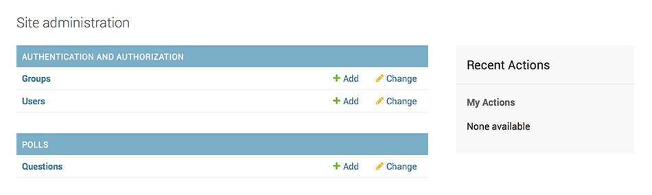

# Django


## 概念

* django是什么
  * 从新闻类站点发展成为通用Web框架
  * 内置对象关系映射
  * 自动化的表结构管理
  * 映射到python的数据查询、操纵接口
  * 自动生成的数据管理后台
  * 优雅的路由、视图映射


* 项目与应用

  * 项目
    * 网站使用的配置、应用的集合。

  * 应用
    * 网站中专门做某事的应用程序。

  * 关系：
    * 一个项目可以包含多个应用。
    * 一个应用可以被多个项目使用。


## 安装

* 安装python
  * 略


* 安装django

```sh
# 安装最新版
pip3 install django

# 安装特定版本
pip3 install django==3.0.8
```

  

* 查看安装版本

```sh
# 查看安装版本
py -3 -m django --version

# 代码获取当前版本
>>> import django
>>> django.get_version()
```


* 创建虚拟环境
```powershell
# powershell 以管理员权限运行，选择Y，激活执行ps脚本权限
# set-executionpolicy remotesigned

# 创建虚拟环境
py -m venv .venv

# 启动虚拟环境
.\.venv\Scripts\activate
.\.venv\Scripts\activate.bat

# 退出虚拟环境
deactivate
```


### VSCode配置

* 自动在当前项目目录创建虚拟环境


* 使用已经存在的环境

```
ctrl + shift + p 
输入 "Python: Select Interpreter"
选择环境
```


## 入门


### 最小视图

* 创建工程

```sh
# 创建项目目录
mkdir mysite

# 使用脚手架创建项目

# 创建项目
# 会自动创建项目名称同名
django-admin startproject 项目名称

# 指定路径，创建项目
django-admin startproject 项目名称 项目所在
```


* 工程结构
  * mysite，项目目录，名称可以随意修改
  * manage.py，集成到当前项目的命令行工具
  * mysite/mysite，纯python包
  * mysite/settings.py，项目配置
  * mysite/url.py，路由配置包
  * mysite/asgi.py，asgi接口入口
  * mysite/wsgi.py，wsgi接口入口

```ini
mysite/
    manage.py
    mysite/
        __init__.py
        settings.py
        urls.py
        asgi.py
        wsgi.py
```


* 默认配置
  * `INSTALLED_APPS`，配置默认启用的应用
    * `django.contrib.admin`，管理员站点
    * `django.contrib.auth`，认证授权系统
    * `django.contrib.contenttypes`，内容类型框架
    * `django.contrib.sessions`，会话框架
    * `django.contrib.messages`，消息框架
    * `django.contrib.staticfiles`，静态文件框架

```python
# project/settings.py

INSTALLED_APPS = [
    'django.contrib.admin',
    'django.contrib.auth',
    'django.contrib.contenttypes',
    'django.contrib.sessions',
    'django.contrib.messages',
    'django.contrib.staticfiles'
]
```


* 启动工程

```sh
# 使用默认配置启动测试服务器
# 127.0.0.1:8000
python manage.py runserver

# 指定端口
python manage.py runserver 80

# 指定IP+端口
python manage.py runserver 0.0.0.0:80
```


* 允许访问的host配置

```py
# website/settings.py
# 默认只允许访问localhost，127.0.0.1

# 允许特定IP访问
ALLOWED_HOSTS = [
    'localhost',
    '127.0.0.1',
    '192.168.4.11'
]

# 允许所有IP访问
ALLOWED_HOSTS = [
    '*'
]
```


* 配置django-admin
  * 默认已经打开django-admin配置
  * 默认使用文件数据库sqlite，无需配置
  * 所以只需
    * 迁移数据库
    * 创建管理员账户

```py
# 迁移数据库
python manage.py migrate

# 创建管理员账户
python manage.py createsuperuser

# 访问 `http://localhost:8000/admin/` 测试
```


* 创建应用

```sh
python manage.py startapp 应用名称
python manage.py startapp polls
```


* 应用目录结构
  * polls，应用目录，在工程目录下，也是一个纯python模块
  * polls/admin.py，该应用使用django-admin的配置
  * polls/apps.py，该应用的配置
  * polls/migrations，该应用的迁移文件保存目录
  * polls/models.py，该应用的模型
  * polls/test.py，该应用的测试用例
  * polls/views.py，该应用的视图

```ini
polls/
    __init__.py
    admin.py
    apps.py
    migrations/
        __init__.py
    models.py
    tests.py
    views.py
```


* 编写应用视图
  * 生成的视图

  ```py
  # polls/views.py
  from django.shortcuts import render
  
  # Create your views here.
  ```
  
  * 修改后的视图
  
  ```py
  # polls/views.py
  from django.http import HttpResponse
  
  def index(request):
      return HttpResponse("Hello, world. You're at the polls index.")
  ```
  
  * 给应用新增urls.py

  ```py
  # polls/urls.py
  from django.urls import path
  from . import views
  
  urlpatterns = [
      path('', views.index, name='index'),
  ]
  ```
  
  * 原始的项目urls.py
  
  ```py
  # website/urls.py
  
  from django.contrib import admin
  from django.urls import path
  
  urlpatterns = [
      path('admin/', admin.site.urls),
  ]
  ```
  
  * 导入应用，修改项目的url.py

  ```py
  # website/urls.py
  from django.urls import include
  
  urlpatterns = [
      path('polls/', include('polls.urls')),
      path('admin/', admin.site.urls),
  ]
  ```

  * 通过`http://IP:PORT/polls/`访问测试视图


### 使用模型

* django默认使用sqlite3作为数据库，无需配置

```py
# website/settings.py

# 默认使用sqlite3配置如下
DATABASES = {
    'default': {
        'ENGINE': 'django.db.backends.sqlite3',
        'NAME': os.path.join(BASE_DIR, 'db.sqlite3'),
    }
}
```


* 在INSTALLED_APPS中添加新应用`polls.apps.PollsConfig`
  * 用于配置项目使用到的APP
  * 数据库迁移时，会自动管理所有项目用到的APP
  * 只需写字符串，django会自动查找项目目录下的python包
  * 可以简写为应用名称`polls`，django会自动查找项目目录下的应用的`apps.py`文件下`AppConfig`的子类

```py
# project/settings.py

INSTALLED_APPS = [
    'polls.apps.PollsConfig'
]

INSTALLED_APPS = [
    'polls'
]


# ./polls/apps.py

from django.apps import AppConfig
class PollsConfig(AppConfig):
    default_auto_field = 'django.db.models.BigAutoField'
    name = 'polls'

```


* 创建数据模型
  * 需求
    * 问题模型
      * 问题描述
      * 发布时间
    * 选项模型
      * 选项描述
      * 得票数
  * 所有模型都是`django.db.models.Model`类的子类
  * 每个模型的`Field`类属性都对应数据库中一个字段
  * 可以在模型类中定义数据库需要的所有信息
  * django会自动跟踪模型类的所有修改，并应用到数据库
  * 如果不自定义主键，django会自动生成主键

```py
# polls/models.py
from django.db import models

# Create your models here.
import datetime
from django.utils import timezone


class Question(models.Model):
    question_text = models.CharField(max_length=200)
    pub_date = models.DateTimeField('date published')
	
    def __str__(self):
        return ' '.join(map(str, [self.id, self.question_text]))
    
    def was_published_recently(self):
        return self.pub_date >= timezone.now() - datetime.timedelta(days=1)


class Choice(models.Model):
    question = models.ForeignKey(Question, on_delete=models.CASCADE)
    choice_text = models.CharField(max_length=200)
    votes = models.IntegerField(default=0)

    def __str__(self):
        return ' '.join(map(str, [self.id, self.choice_text]))


```


* 运行命令修改数据库

```sh
# 发现应用数据库迁移

# 创建迁移（自动检测INSTALLED_APPS）
python manage.py makemigrations

# 给特定应用创建迁移
python manage.py makemigrations polls

# 生成的数据迁移文件
# polls/migrations/0001_initial.py

# 实施数据库迁移
python manage.py migrate

# 查看本次变更的SQL
python manage.py sqlmigrate polls 0001

```


* 使用 django shell 操纵模型

```py
# python manage.py shell

from polls.models import Choice, Question

# 查询所有Question
Question.objects.all()

from django.utils import timezone

# 创建记录
q = Question(question_text="What's new?", pub_date=timezone.now())
q.save()

# 模型默认创建一个id作为主键
q.id

# 查看记录的值
q.question_text
q.pub_date

# 修改记录值
q.question_text = "What's up?"
q.save()

# 查询所有Question
Question.objects.all()

# 使用过滤器
Question.objects.filter(id=1)

# 双下划线使用高级过滤
Question.objects.filter(question_text__startwith='What')

from django.utils import timezone
y = timezone.now().year
Question.objects.get(pub_date__year=y)

# 执行模型方法
q = Question.objects.get(pk=1)
q.was_published_recently()

# 获取外键数据（名称后加 `_set`）
q.choice_set.all()
q.choice_set.count()

# 创建外键数据
q.choice_set.create(choice_text='Not much', votes=0)
q.choice_set.create(choice_text='The sky', votes=0)
```


### 使用Admin管理界面

* 将应用的模型注册到管理应用
  * Question可以直接注册为一个`ModelAdmin`
  * Choice也可以直接注册为`ModelAdmin`，但是实际上Choice是与Question相关的，这样做的话，每添加一个Choice选项，都需要打开一个新的页面，都需要使用外键选择与哪一个Question相关联
  * Choice注册为Question的内联对象，在Question添加、编辑界面内联表单

```py
# polls/admin.py

from django.contrib import admin

# Register your models here.
from .models import Question
from .models import Choice


# 默认写法
# admin.site.register(Question)


# class ChoiceInline(admin.StackedInline):
#     model = Choice


class ChoiceInline(admin.TabularInline):
    model = Choice


class QuestionAdmin(admin.ModelAdmin):
    inlines = [ChoiceInline]


admin.site.register(Question, QuestionAdmin)

```


* 默认生成的模型管理类索引页




* 默认生成的Question list页面


* 默认生成的Question


* Choice的`StackedInline`样式，默认5个，可以修改


* Choice的`TabularInline`样式，默认5个，可以修改


### 自定义视图、URL、HTML模板

* 需求
  * Question索引页面
    * GET接口与页面合一
  * Question结果页面
    * GET接口与页面合一
  * Question投票页面
    * GET响应页面
  * Question投票接口
    * POST投票接口


* 修改应用URL到视图的映射

```py
# polls/urls.py

from django.urls import path
from . import views

# 增加app_name，可以为URL名称添加命名空间
app_name = 'polls'

# 修改前
# 

# 修改后
# ">


urlpatterns = [
    # 示例: /polls/
    path('', views.index, name='index'),
    # 示例: /polls/5/
    path('<int:question_id>/', views.detail, name='detail'),
    # 示例: /polls/5/results/
    path('<int:question_id>/results/', views.results, name='results'),
    # 示例: /polls/5/vote/
    path('<int:question_id>/vote/', views.vote, name='vote')
]
```


* 视图

```py
# 视图简略写法
from django.shortcuts import render
def index(request):
    latest_question_list = Question.objects.order_by('-pub_date')[:5]
    context = {'latest_question_list': latest_question_list}
    
    # django.shortcuts.render 加载渲染模板
    return render(request, 'polls/index.html', context)

# 使用primary_key获取对象，简略写法
from django.shortcuts import get_object_or_404
def detail(request, question_id):
    question = get_object_or_404(Question, pk=question_id)
    return render(request, 'polls/detail.html', {'question': question})

def results(request, question_id):
    return HttpResponse(f"You're looking at the results of question {question_id}.")

def vote(request, question_id):
    return HttpResponse(f"You're voting on question {question_id}.")
```


* 编写模板
  * `project/app/templates/`，django会自动加载应用下templates目录作为模板
  * `project/app/templates/app`，为了避免多个应用模板重名相互覆盖，在templates目录下再建立app目录，再使用模板


* 问题列表页HTML模板

```django
<!-- polls/templates/polls/index.html -->


    <ul>
    
        <li>
            {# 硬编码URL #}
            {# <a href="/polls/{{ question.id }}/">{{ question.question_text }}</a> #}

            {# 通过URL名称 #}
            <a href="">{{ question.question_text }}</a>

        </li>
    
    </ul>

    <p>No polls are available.</p>

```


* 问题详情页HTML模板

```django
<!-- polls/templates/polls/detail.html -->

<form action="" method="post">
    
    <fieldset>
        <legend><h1>{{ question.question_text }}</h1></legend>
        <p><strong>{{ error_message }}</strong></p>
        
            <input type="radio" name="choice" id="choice{{ forloop.counter }}" value="{{ choice.id }}">
            <label for="choice{{ forloop.counter }}">{{ choice.choice_text }}</label><br>
        
    </fieldset>
    <input type="submit" value="Vote">
</form>
```


* 问题投票结果页HTML模板

```django
<!-- polls/templates/polls/results.html -->

<h1>{{ question.question_text }}</h1>

<ul>

    <li>{{ choice.choice_text }} -- {{ choice.votes }} vote{{ choice.votes|pluralize }}</li>

</ul>

<a href="">Vote again?</a>
```


### 使用通用视图

* 使用后端模板时，可以使用通用视图
* 前后端分离时，使用DRF


### 自动化测试

* todo


### 使用静态文件

* todo


### 自定义后台HTML模板

* todo


### 打包Django APP

* todo


## 模型与数据库


### 数据模型，Model


#### 配置

```py
# website/settings.py

# 默认使用sqlite3配置如下
DATABASES = {
    'default': {
        'ENGINE': 'django.db.backends.sqlite3',
        'NAME': os.path.join(BASE_DIR, 'db.sqlite3'),
    }
}

# ENGINE：数据库引擎
'django.db.backends.postgresql'
'django.db.backends.mysql'
'django.db.backends.oracle'

# NAME：数据库名称
# 需要提前创建数据库`create databse dbname`
# 需要具有`create database`权限，测试用。

# USER：用户名
# PASSWORD：密码
# HOST: 地址
```


#### 概览
* 每个Model都继承django.db.models.Model
* Model的每个类属性都对应生成一个数据表的列column
* django可以为Model自动生成所有SQL
* django按照模型定义自动生成数据库表，表名为myapp_mymodel、字段均为小写
* 如果Model未定义主键，django自动为Model添加一个名为id的自增整数作为主键


* 示例
```python
# 定义Model
from django.db import models

class Person(models.Model):
    name = models.CharField(max_length=30)
    age = models.IntegerField()

# 自动生成
CREATE TABLE "myapp_person" (
    "id" integer NOT NULL PRIMARY KEY AUTOINCREMENT,
    "name" varchar(30) NOT NULL,
    'age' integer NOT NULL
);
```


* 发现模型迁移

```python
# 先将模型所在app添加至website站点的settings.INSTALLED_APPS
# 该app应用定义在`py manage.py startapp`时自动生成在`myapp/apps.py`

INSTALLED_APPS += ['myapp.apps.MyappConfig']

# 发现模型迁移
py manage.py makemigrations app
py manage.py makemigrations
```


* 显示迁移记录

```sh
py manage.py showmigrations
py manage.py showmigrations catalog
```


* 显示迁移SQL语句

```sh
py manage.py sqlmigrate myapp 0001
```


* 迁移模型

```sh
py manage.py migrate
```


* sql执行回调函数（钩子函数，包装函数）
* connection.execute_wrapper(wrapper)

```python
# 使用包装函数禁止sql查询
def blocker(*args):
    raise Exception('这里禁止执行sql语句')

def blocker(execute, sql, params, many, context):
    alias = context['connection'].alias
    raise Exception(f'禁止使用数据库{alias}')

from django.db import connection
from django.shortcuts import render
def my_view(request):
    with connection.execute_wrapper(blocker):
        return render(request, 'template.html', {args})


# 使用包装函数记录sql日志
import time
class QueryLogger:
    def __init__(self):
        self.queries = []
    
    def __call__(self, execute, sql, params, many, context)
        current_query = {'sql': sql, 'params': params, 'many': many}
        start = time.monotonic()
        try:
            result = execute(sql, params, many, context)
        except Exception as e:
            current_query['status'] = 'error'
            current_query['exception'] = e
            raise
        else:
            current_query['status'] = 'ok'
            return result
        finally:
            duration = time.monotonic() - start
            current_query['duration'] = duration
            self.queries.append(current_query)

from django.db import connection
ql = QueryLogger()
with connection.execute_wrapper(ql):
    do_queries()

print(ql.queries)
```


* sql历史记录

```
# DEBUG=True时可以通过connection.queries显示sql语句
# 结果为历史SQL语句词典列表：
"""
[{
    'sql': 'SELECT polls_polls.id, polls_polls.question, polls_polls.pub_date FROM polls_polls',
    'time': '0.002'
}]
"""

# 查看sql记录
from django.db import connection
connection.queries

from django.db import connections
connections['db_setting_name'].queries

# 清空sql记录
from django.db import reset_queries
reset_queries()
```

* 清空数据并更新数据表到最新状态
```
py manage.py flush
```


#### 字段，Field
* 字段通用属性
```
null        # 数据库可以为NULL，默认False
blank       # 表单验证可以留空，默认False
choices     # CharField，字符串枚举，为表单提供一个下拉选择框
default     # 默认值或者callable
help_text   # 表单显示，文档显示
primary_key # 主键，默认False
unique      # 唯一性，默认False，会创建unique索引

# choice示例
from django.db import models
class Person(models.Model):
    SIZES = (
        ('枚举值', '说明文字，仅用于显示'),
        ('S', 'Small'),
        ('M', 'Medium'),
        ('L', 'Large'),
    )
    shirt_size = models.CharField(max_length=1, choices=SIZES)

p = Person(shirt_size='L')
p.save()
p.shirt_size
p.get_shirt_size_display() # 显示说明文字

# TextChoices示例
from django.db import models
class Runner(models.Model):
    MedalType = models.TextChoices('MedalType', 'GOLD SILVER BRONZE')
    medal = models.CharField(choices=MedalType.choices, max_length=10)

Runner.MedalType.choices
Runner.MedalType.GOLD
Runner.MedalType.SILVER
Runner.MedalType.BRONZE
```

* 字段类型
```
AutoField               # 自动创建id主键，继承于IntergerField，1 - 2**31-1
BigAutoField            # 1 - 2**63-1
BigInterField           # 2**64，默认控件NumberInput
BinaryField(max_length) # 存储bytes，bytearray，memoryview，默认不可编辑
BooleanField            # 默认控件CheckboxInput, 默认值为None
CharField(max_length)   # 默认控件TextInput，自带MaxLengthValidator
IntegerField            # 2**32，默认控件NumberInput
NullBooleanField        # BooleanField(null=True), 默认控件NullBooleanSelect
PositiveIntegerField    # 0 - 2**31-1
PositiveSmallIntergerField # 0 - 2**15-1
SmallAutoField          # 1 - 2**15-1
SmallIntergerField      # 2**16
TextField()             # 存储不定长大文本，默认控件Textarea
```

* 特殊字段
```
# 浮点数类型

# DecimalField(max_digits, decimal_place)
# 对应python.decimal.Decimal类
# max_digits，整数位数+小数位数
# decimal_place，小数位数
# 自带DecimalValidator
# 默认控件NumberInput

# FloatField
# 对应一个python内置float类型
# 默认控件NumberInput

# 时间类型
DateField               # datetime.date
DateTimeField           # datetime.datetime，默认控件DateTimeInput
DurationField           # python timedelta
TimeField()             # datetime.time

# EmailField
# CharField(max_length=254)
# 自带EmailValidator验证

# FileField(upload_to=None, max_length=100)
# 文件

# ImageField
# 图片

# FilePathField

# GenericIPAddressField(protocal='both', unpack_ipv4=False)
# IPv4/IPv6地址，如'192.0.2.30'，'2a02:42fe::4'
# protocal='both'/'IPv4'/'IPv6'，不区分大小写
# unpack_ipv4=True, protocal='both'时，'::ffff:192.0.2.1'会被转换为'192.0.2.1'

# URLField(max_length=200) CharField子类 
# 含有URLValidator，默认控件URLInput

# UUIDField 
# 继承于CharField(max_length=32)，用于存储Python UUID类型数据
# 用作主键示例（数据库不能自动产生uuid）

import uuid 
from django.db import models
class MyUUIDModel(models.Model):
    id = models.UUIDField(primary_key=True, default=uuid.uuid4, editable=False)

# SlugField
```

* 关联关系
    * 多对一关联，django.db.models.ForeignKey
    * 多对多关联，django.db.models.ManyToManyField
        * 隐式创建，django自动多创建一张关联表
        * 显示创建，可以自定义关联表，可以在关联表中添加自定义字段
    * 一对一关联，django.db.models.OneToOneField


* 多对一关联
    * 在"多"的一方定义外键ForeignKey，保存"一"的一方的主键
    * 一个模型可以自己对自己关联
    * 对自己关联、或者循环依赖时，可以使用字符串替代类名
    * 多对一关联必须指定关联删除时，本记录的操作
* 多对一关联示例：
```
from django.db import models

class Manufacturer(models.Model):
    pass
    
class Car(models.Model):
    manufacturer = models.ForeignKey(
                            'Manufacturer',          # 可以使用字符串代替类
                            on_delete.models.CASCADE,# 必须指定关联删除时操作
                            related_name='all_cars'，# 反向关联名称
                            to_field='id')           # 关联字段，默认会使用pk

# 从Car对象获取关联的Manufacturer
car = Car.objects.get(pk=1)
car.manufacturer    # 对象
car.manufacturer.id # id

# 从Manufacturer对象获取关联的多个Car
# 未定义related_name，自动分配'小写Model名称_set'作为反向关联名称
m = Manufacturer.objects.get(pk=1)
m.car_set.all()
m.car_set.count()
m.car_set.filter()

# 使用related_name
m.all_cars.all()

# 关联项删除时操作
models.CASCADE     # 级联删除
models.PROTECT     # 不允许删除
models.SET_NULL    # 置空，必须设置blank=True, null=True
models.SET_DEFAULT # 设为默认值
models.SET()       # 设为函数结果  
models.DO_NOTHING  # 无操作
```


* 多对多关联
    * 在编辑时统筹的一方添加django.db.models.ManyToManyField
    * 另一方在app被INSTALL时动态产生，无需设置。
    * 手动关联需要指定中间表，设置ManyToManyField.through参数为中间表。
* 多对多关联示例
```
# 自动创建中间表，以下两个模型会产生3个表
from django.db import models

class Person(models.Model):
    name = models.CharField(max_length=128)

class Group(models.Model):
    name = models.CharField(max_length=128)
    members = models.ManyToManyField(Person)

# 手动创建中间表，可以在中间表添加字段
# 需要在中间表添加外键字段，中间表与被关联表是多对一关系
class Person(models.Model):
    name = models.CharField(max_length=128)

class Group(models.Model):
    name = models.CharField(max_length=128)
    members = models.ManyToManyField(Person, through='Membership')

class Membership(models.Model):
    person = models.ForeignKey(Person, on_delete=models.CASCADE)
    group = models.ForeignKey(Group, on_delete=models.CASCADE)
    date_joined = models.DateField()
    invite_reason = models.CharField(max_length=64)
```

* 一对一关联
    * 一个表作为另一个表的扩展
    * OneToOneField默认不会成为扩展表主键，需要手动设置primary_key=True

#### Model Meta选项
* 所有不是字段的信息，都应该定义在Meta子类中
* 为Model设置Meta选项示例：
```
from django.db import models

class Ox(models.Model):
    horn_length = models.IntegerField()

    class Meta:
        ordering = ["horn_length"]
        verbose_name_plural = 'oxen'

abstract = True # 设置为虚基类Model，不实际创建，只用于继承
db_table = 'name' # 手动设置表名
ordering = 'pub_date'  # 排序字段
ordering = '-pub_date' # 逆向排序
ordering = 'pub_date, age' # 多字段排序
permisstions = [('p1', 'p2')] # 添加权限p1, p2
indexes = [models.Index(fields=['col1', 'col2'])] # 添加索引

```

#### Model 方法
* 可以自定义Model方法，实际表现为列字段
```
from django.db import models

class Person(models.Model):
    first_name = models.CharField(max_length=50)
    last_name = models.CharField(max_length=50)
    birth_date = models.DateField()

    def baby_boomer_status(self):
        "Returns the person's baby-boomer status."
        import datetime
        if self.birth_date < datetime.date(1945, 8, 1):
            return "Pre-boomer"
        elif self.birth_date < datetime.date(1965, 1, 1):
            return "Baby boomer"
        else:
            return "Post-boomer"

    @property
    def full_name(self):
        "Returns the person's full name."
        return '%s %s' % (self.first_name, self.last_name)
```

* 重写`__str__()`用于调试、后台管理、关联表字段内容呈现
* 重写`get_absolute_url()`用于后台管理、获取对象展示页面URL

#### Model继承
1. 抽象基类，用于避免重复编码，抽象基类不会生成具体表
2. 多表继承，继承实体Model，会导致隐式创建OneToOneField，一对一关联表。
3. 代理模型，用于对模型增加方法、行为，不改变原模型中的字段

* 抽象基类
    * 抽象基类必须设置Model.Meta.abstract = True
    * 子类会继承抽象基类所有字段，子类可以覆盖override字段，子类可以赋值为None删除字段
    * 子类中未定义Meta会继承父类Meta，如果子类定义了Meta会覆盖父类Meta
    * 可以手动继承父类Meta
    * 需要注意抽象父类中定义的`Meta.db_table`, `related_name`等，继承会导致重名
* 抽象继承示例
```
from django.db import models

class CommonInfo(models.Model):
    name = models.CharField(max_length=100)
    age = models.PositiveIntegerField()
    
    class meta:
        abstract = True

class Student(CommonInfo):
    home_group = models.CharField(max_length=5)
```

* 多表继承
    * 如果继承的基类不是抽象Model，会导致每一层继承产生一张表，所以称做多表继承
    * 多表继承会在子表自动创建一个OneToOneField，用于关联到父表
    * 子表不会继承父表Meta，因为父表Meta已经被使用
    * 父类Meta中`ordering`或`get_latest_by`会应用到子表，可以在子类Meta中屏蔽
* 多表继承示例 
```
from django.db import models

class Place(models.Model):
    name = models.CharField(max_length=50)
    address = models.CharField(max_length=80)
    
class Restaurant(Place):
    serves_hot_dogs = models.BooleanField(default=False)
    serves_pizza = models.BooleanField(default=False)


# 子表隐式创建OneToOneField如下：
place_ptr = models.OneToOneField(
        Place,
        on_delete=models.CASCADE,
        parent_link=True,
        primary_key=True
    )

# 子表对象可以使用父表字段（自动关联OneToOneField）
Place.objects.filter(name="Bob's Cafe")
Restaurant.objects.filter(name="Bob's Cafe")

# 父表对象可以通过关联字段，访问子表对象
# 子表对象不存在时会抛出 Restaurant.DoesNotExist 异常
p = Place.objects.get(id=1)
p.restaurant
```


* 代理模型
    * 设置子类Meta.proxy=True创建代理型继承Model
    * 代理会继承父类管理器，所以查询返回的结果也是父类
    * 父类子类可以通过类构造器进行类型转换
    * 子类会继承父类的模型管理器，查询返回的结果是父类
* 代理模型示例
```
from django.db import models

class Person(models.Model)
    first_name = models.CharField(max_length=30)
    last_name = models.CharField(max_length=30)

class MyPerson(Person):
    class Meta:
        proxy=True
    
    def custom_action(self):
        pass
```

#### 使用包管理复杂Model定义
1. 删除models.py
2. 创建models目录
3. 新建`__init__.py`文件
4. 在`__init__.py` import 所有模型定义

### 查询
<https://docs.djangoproject.com/zh-hans/3.0/topics/db/queries/#>

### 聚合查询
<https://docs.djangoproject.com/zh-hans/3.0/topics/db/aggregation/>

### 执行原生SQL
<https://docs.djangoproject.com/zh-hans/3.0/topics/db/sql/>
* 一般不会建议使用原生SQL，建议在Django ORM框架下寻找解决方案
* 使用原生SQL一定要把用户传入的参数进行转译，避免SQL注入攻击


* 使用模型管理器Manager.raw()执行sql
```
persons = Person.objects.raw('select xx, xx, xx from myapp_talbe')
persons = Person.objects.raw('SELECT * FROM myapp_person WHERE last_name = %s', [arg1])
```


* Django原生接口执行
```
from django.db import connection

with connection.cursor() as cursor:
    cursor.execute('update bar set foo = 1 where baz = %s', [arg1])
    row = cursor.fetchone()
```


* 调用存储过程
```
with connection.cursor() as cursor:
    cursor.callproc('my_procedure', args_list)
```

### 数据库事务
* <https://docs.djangoproject.com/zh-hans/3.0/topics/db/transactions/>
* 管理数据库事务
    * 理解Django默认的事务行为
    * 将事务与HTTP请求相关联
    * 显式的事务控制
* 自动提交
* 事物提交后的操作
* 底层API
* 数据库特殊行为
    * SQLite
    * MySQL
    * PostgreSQL

### 多数据库（一主多从，读写分离）
* <https://docs.djangoproject.com/zh-hans/3.0/topics/db/multi-db/>
* 配置数据库
* 多数据库迁移
* 多数据库自动路由
    * 数据库路由
    * 使用数据库路由
    * 读写分离数据库路由示例
* 手动选择数据库
    * 选择查询数据库
    * 选择存储数据库
    * 选择删除数据库
    * 使用多个数据库管理器Manager 
* 多数据库的局限性
    * 不支持跨数据库的外键
    * contrib中内置的一些模型不支持跨数据库

### 数据库性能优化
* <https://docs.djangoproject.com/zh-hans/3.0/topics/db/optimization/>
* 标准数据库优化技巧
    * 建立索引
    * 使用合适的字段类型
* 在数据库中执行操作，不在python中
    * 使用RawSQl
    * 使用原生SQL
* 使用unique索引检索单个对象
* 提前获取关联对象，避免多次数据库操作
    * QuerySet.select_related()
    * QuerySet.prefetch_related()
* 避免获取不需要的值
    * 避免查询结果对象化
        * QuerySet.values()
        * QuerySet.values_list()
    * 获取记录的部分列，有需要时会触发自动再次查询
        * QuerySet.defer()
        * QuerySet.only()
    * 使用QuerySet.count()获取计数，而不是len(queryset)
    * 使用QuerySet.exists()判断是否存在，而不是`if queryset`
    * <https://docs.djangoproject.com/zh-hans/3.0/topics/db/optimization/#don-t-overuse-count-and-exists>
    * <https://docs.djangoproject.com/zh-hans/3.0/topics/db/optimization/#use-queryset-update-and-delete>
    * 直接使用外键的值
        * `entry.blog.id`比`entry.blog_id`减少一次查询
    * 避免在Meta中设置排序，必要时可以通过order_by()排序
* 批量操作
    * 批量创建
    * 批量更新
    * 批量插入
    * 批量删除


## 处理HTTP请求

### URL调度器
* 理解Django处理Request的过程
    1. Django获取ROOT_URLCONF配置值。
    2. 加载ROOT_URLCONF，获取可用的urlpatterns
    3. 依次遍历规则，直到匹配则退出。提取path_info。
    4. 调用视图View。
    5. 没有视图匹配则返回错误处理视图。
* URLconf值匹配域名之后，参数之前的字符串
    * `https://www.a.com/myapp/` 会忽略域名，只匹配 `myapp/`
    * `https://www.a.com/myapp/?page=3` 会忽略GET参数，只匹配 `myapp/`
    * django与flask不同，django只匹配url不匹配请求方法


* 示例
```
from django.urls import path
from . import views

urlpatterns = [
    path('articles/2003/', view.special_case_2003),
    path('articles/<int:year>', views.year_archive),
    path('articles/<int:year>/<int:month>/', views.month_archive),
    path('articles/<int:year>/<int:month>/<slug:slug>/', view.article_detail)
]

# /articles/2003 不会匹配任何值，因为缺少反斜杠
# /articles/2003/ view.special_case_2003
# /articles/2005/03/ view.month_archive(request, year=2005, month=3)
# /articles/2003/03/building-a-django-site/ view.article_detail(request, year=2003, month=3 slug='building-a-django-site')
```

* 路径转换器
    * str：匹配字符串，遇到`/`截止
    * int：大于等于0的正整数
    * slug：短标签，支持ASCII字母，数字，连字符，下划线
    * uuid：075194d3-6885-417e-a8a8-6c931e272f00，必须加破折号且小写，避免重复
    * path：匹配字符串，遇到`/`不截止


* 自定义路径转换器
    1. 设置regix属性
    2. 实现to_python转换器
    3. 实现to_url转换器
    4. django.urls.register_converter注册
    5. 在django.urls.path中使用
```
class FourDigitYearConverter:
    regex = '[0-9]{4}'
    
    def to_python(self, value):
        return int(value)
        
    def to_url(self, value):
        return '%04d' % value

from django.urls import path, register_converter
from . import converters. views

register_converter(converters.FourDigitYearConverter, 'yyyy')
urlpatterns = [
    path('articles/<yyyy:year>/', views.year_archive),
]
```


* 使用正则表达式re_path
    * 命名正则表达式
    * 未命名正则表达式
    * 正则表达式参数嵌套


* 包含include其他URLconfs
    * django.url.include('app.urls字符串')
    * django.url.include(list)
    * 只传递父级path处理之后剩余的字符串给子path
```
# 包含其他app的URL
from django.urls import include, path
urlpatterns = [
    path('community/', include('aggregator.urls')),
    path('contact/', include('contact.urls')),
]


# 组织本app层级，避免重复
# path0/path10/
# path0/path11/
# path0/path12/

from django.urls import include, path

extra_patterns = [
    path('path10/', view1),
    path('path11/', view1),
    path('path12/', view1),
]

urlpattersn = [
    path('path0/', include(extra)),
]


# 路径转换器，参数的传递
# view1将收到参数arg

from django.urls import include, path

extra_patterns = [
    path('path10/', view1),
]

urlpattersn = [
    path('<str:arg>/path/', include(extra)),
]

```


* 通过path传递额外参数给view
    * path的第三个参数可以传递额外的参数
    * 额外的参数必须是字典
    * 路径转换器与额外参数同名时将被替换
```
# path: /blog/2005/
# view: views.year_archive(request, year=2005, foo='bar') 

from django.urls import path
from . import views

urlpatterns = [
    path('blog/<int:year>/', views.year_archive, {'foo': 'bar'}),
]
```


* URL反向解析
    * 始终动态生成URL可以避免硬编码
    * 必须给URL命名才能实现反向解析
    * 在模板里使用url模板标签反向解析
    * 在Python编码中使用`reverse()`函数反向解析
    * 在Model中使用`get_absolute_url()`反向解析
```
# url模板标签，带参数，反向解析

urlpatterns = [
    path('articles/<int:year>/', views.year_archive, name='aritcles')
]

<a href=""></a>


    <a href=""></a>



# python中url反向解析

from django.http import HttpResponseRedirect
from django.urls import reverse

def redirect_to_year(request):
    year = 2020
    return HttpResponseRedirect(reverse('archive', args=(year, )))

```


* 命名URL的名称空间
```
# include时指定名称空间
# reverse('path0:path00')
# 

from django.urls import include, path
extra_patterns = [
    path('path00/', view1, name='path00'),
]

urlpatterns = [
    path('path0', include(, namespace='path0')
]

# 使用app_name指定名称空间
# reverse('app:path')
# 

app_name = app
urlpatterns = {
    path('path', view, name='path')
}
```


### 编写视图
* 视图示例解析
```
# 接收一个HttpRequest对象
# 返回一个HttpResponse对象

from django.http import HttpResponse 
import datetime

def current_datetime(request):
    now = datetime.datetime.now()
    html = "<html><body>It is now %s</body></html>" % now
    return HttpResponse(html)

# 返回错误
from django.http import HttpResponseNotFound
HttpResponseNotFound('<h1>Page not found</h1>')

# 返回状态吗
from django.http import HttpResponse
HttpResponse(status=404)
```

* 返回错误信息
    * HttpResponseNotFound必须要每次构建错误页面
    * Http404提供一个通用错误处理页面模板
    * 需要创建404.html放置在模板树顶层，DEBUG=Fasle时才会使用
```
from django.http import Http404
raise Http404('Page does not exist.')
```

* 自定义错误视图
    * 自定义错误处理只能定义在根URLconf，否则不会生效
```
# handler404覆盖page_not_found()视图
handler404 = 'misite.views.my_custom_page_not_found_view'

# handler500覆盖server_error()视图
handler500 = 'mysite.views.my_custom_error_view'

# handler403覆盖permission_denied()视图
handler403 = 'mysite.views.my_custom_permission_denied_view'

# handler400覆盖bad_request()视图
handler400 = 'mysite.views.my_custom_bad_request_view'


# 测试
from django.core.exceptions import PermissionDenied
from django.http import HttpResponse
from django.test import SimpleTestCase, override_settings
from django.urls import path

def response_error_handler(request, exception=None):
    return HttpResponse('Error handler content', status=403)

def permission_denied_view(request):
    raise PermissionDenied

urlpatterns = [
    path('403/', permission_denied_view),
]

handler403 = response_error_handler

# ROOT_URLCONF must specify the module that contains handler403 = ...
@override_settings(ROOT_URLCONF=__name__)
class CustomErrorHandlerTests(SimpleTestCase):

    def test_handler_renders_template_response(self):
        response = self.client.get('/403/')
        # Make assertions on the response here. For example:
        self.assertContains(response, 'Error handler content', status_code=403)
```

### 视图装饰器
* 限定允许的HTTP方法
    * 使用`django.views.decorators.http.require_http_methods()`限定HTTP方法
    * 超出限定则返回`django.http.HttpResponseNotAllowed`异常
```
from django.views.decorators.http import require_http_methods
from django.views.decorators.http import require_GET
from django.views.decorators.http import require_POST
from django.views.decorators.http import require_safe

@require_http_methods(['GET', 'POST'])
@require_GET
@require_POST
@require_safe # 包含GET和HEAD，一般应使用require_safe，自动支持HEAD请求
def a_view(request):
    pass
```


* 条件视图处理
    * `django.views.decorators.http.condition(etag_func=None, last_modified_func=None)`
    * `django.views.decorators.http.etag(etag_func)`
    * `django.views.decorators.http.last_modified(last_modified_func)`
* GZip压缩
    * `django.views.decorators.gzip.gzip_page()`
* Vary头
    * `django.views.decorators.vary.vary_on_cookie(func)`
    * `django.views.decorators.vary.vary_on_headers(headers)`
* 缓存
    * `django.views.decorators.cache.cache_control(kwargs)`
    * `django.views.decorators.cache.never_cache(view_func)`

### 文件上传
* 如果有上传的文件，文件保存在`HttpRequest.FILES`里
* `HttpRequest.FILES`是一个保存文件信息的字典
* 必须通过POST方法提交<form>表单，并且必须设置`enctype="multipart/form-data"`
* 多个文件上传提供`HttpRequest.FILES.getlist('file_field')`获取文件列表
* `django.forms.FileField`提供了一个通用Form组件
* `django.forms.FileField`创建的表单数据保存在`request.FILES['file']`中
* 上传图片可以使用`django.forms.ImageField`组件


* 文件上传最简（必要条件）示例
```
# upload.html 
# 上传文件操作至少要需要以下组件
# input组件的name用于提取文件对象
<form 
    enctype="multipart/form-data" 
    action=""
    method="POST">
    
    <input type="file" name='uploadfile'>
    <button type="submit">上传</button>
</form>

# views.py
# 处理文件请求
# 1. 验证POST方法
# 2. 验证request.FILES是否存在，form.enctype="multipart/form-data"并上传了文件
# 3. request.FILES是一个django.core.files.uploadhandler.UploadedFile的子类
# 4. Django内置了两种UploadedFile可以处理存储在本地文件上传
#    文件小于2.5M时保存在内存中，使用InMemoryUploadedFile子类
#    文件大于2.5M时保存在Linux临时文件中，使用TemporaryUploadedFile子类
# 5. 使用UploadedFile.name获取文件名称
# 6. 使用UploadedFile.chunks()处理文件，使用UploadedFile.read()会被大文件阻塞

from django.http import HttpResponse
from .form import UploadFileForm
def file_upload(request):
    # GET方法时返回上传页面
    if 'GET' == request.method:
        return render(request, 'upload.html')
    
    # POST方法时处理上传请求
    elif 'POST' == request.method:

        # uploadfile是input控件的name属性
        # request.FILES['uploadfile']一般是一个InMemoryUploadedFile对象

        f = request.FILES['uploadfile']
        print(type(f))
        print(f.name) # 文件名称
        print(f.size) # 文件大小
        print(f.content_type) # 文件类型

        # 使用用户提供的文件名是不安全的
        with open(f'./{f.name}', 'wb+') as destination:
            # 使用chunks()处理文件
            for chunk in f.chunks():
                destination.write(chunk)

        return HttpResponse('File Form OK!')
```


* 使用Django的Form控件
    * 自定义forms.Form的FileField的属性名称 
    * = form展开后input控件的name属性值
    * = request.FILES['user_file']取值key
    * = form.cleaned_data['user_file']取值key
```
# forms.py
# 在forms.py中定义一个表单

from django import forms
class UploadFileForm(forms.Form):
    user_file = forms.FileField()

# upload.html
# 从forms.FileField展开为模板
<form 
    enctype="multipart/form-data" 
    action=""
    method="POST">
    
    {{ form.user_file }}
    <button type="submit">上传</button>
</form>

"""
{{ form.user_file }} 展开后内容如下，默认名称'file'用于提取文件：
<tr>
    <th>
        <label for="id_file">File:</label>
    </th>
    <td>
        <input type="file" name="user_file" required id="id_file">
    </td>
</tr>
"""

# views.py
from django.http import HttpResponse
from .forms import UploadFileForm
def file_upload(request):
    if 'POST' == request.method:
        form = UploadFileForm(request.POST, request.FILES)
        if form.is_valid():
            # 这里file是UploadFileForm的属性名称
            f = form.cleaned_data['file']
            with open(f'./{f.name}', 'wb+') as destination:
                for chunk in f.chunks():
                    destination.write(chunk)
            return HttpResponse('File Form OK!')
    else:
        # GET方法生成一个空表单
        form = UploadFileForm()

    # 出现任意情况，重新渲染页面
    return render(request, 'upload.html', {'form': form})
```


* 使用Django模型内置的FileField保存文件
    1. 需要首先设置MEDIA_ROOT作为默认保存文件的目录，默认为空，即运行目录
    2. 如果需要得到上传文件的URL则需要设置MEDIA_URL，默认为空，即运行url
    3. 使用`{{ model_obj.file_field_name.url }}`获取文件地址
```
# models.py
class UploadFileModel(models.Model):
    file = models.FileField()

# view.py
f = form.cleaned_data['upload_file']
model = UploadFileModel(file=f)
model.save()
```


* 从models.FileField的模型自动创建forms.FileField
    * 使用django.forms.ModelForm转换Model为Form
    * ModelForm自带save功能，会自动填充Model值并保存
```
# models.py 定义Model
from django.db import models

class UploadFileModel(models.Model):
    file = models.FileField()


# forms.py 使用ModelForm转换Model为Form
from django import forms
from .models import UploadFileModel

class UploadModelForm(forms.ModelForm):
    class Meta:
        model = UploadFileModel
        fields = ['file']


# views.py ModelForm自带保存功能，自动填充关联Model
from django.http import HttpResponse
from .forms import UploadModelForm
def file_upload(request):
    if 'POST' == request.method:
        form = UploadModelForm(request.POST, request.FILES)
        if form.is_valid():
            form.save()
            return HttpResponse('File Form OK!')
    else:
        form = UploadModelForm()
    return render(request, 'upload.html', {'form': form})
```


* 通过一个input组件上传多个文件
```
# form.py 表单定义
from django import forms
class FileFieldForm(forms.Form):
    file_field = forms.FileField(
            widget=forms.ClearableFileInput(
                attrs={'multiple': True}
        ))
        
# views.py
files = request.FILES.getlist('file_field')
for file in files:
    pass
```


* 自定义上传行为（如增加进度条）
<https://docs.djangoproject.com/zh-hans/3.0/ref/files/uploads/#custom-upload-handlers>


### django.shortcuts快捷函数
* django.shortcuts.render
    * `render(request, template_name, context=None, content_type=None, status=None, using=None)`
    * request: HttpRequest
    * template_name: 模板名称
    * context：模板输入参数
    * content_type: HTTP MIME类型，默认'text/html'
    * status：默认200
    * usinng：模板引擎
```
# render写法
from django.shortcuts import render
def view(request):
    return render(request,
                'app/index.html',
                {'foo': 'bar'},
                content_type='application/xhtml+xml')


# HttpResponse写法
from django.http import HttpResponse
from django.template import loader
def view(request):
    template = loader.get_template('app/index.html')
    context = {'foo': 'bar'}
    return HttpResponse(t.render(c, request), content_type='application/xhtml+xml')
```

* django.shortcuts.redirect
    * `redirect(to, *args, permanent=False, **kwargs)`
    * HttpResponseRedierct的快捷写法
    * to: 传入model会调用`Model.get_absolute_url()`
    * to: 传入url名称会调用`reverse()`
    * to: 绝对url，相对url
    * permanent=True：永久重定向，默认False临时重定向
```
# 重定向到model对象
from django.shortcuts import redirect
def view(request):
    obj = MyModel.objects.get(pk)
    return redirect(obj)


# 重定向到url名称
def view(request):
    return redierct('app:index', param)


# 重定向到url
redirect('/path/')
redirect('https://example.com/path/')
```


* `django.shortcuts.get_object_or_404`
    * `get_object_or_404(klass, *args, **kwargs)`
    * 对象不存在时响应Http404，而不是抛出异常DoesNotExist
    * klass：可以是Model, Manager, QuerySet对象
    * kwargs：可以是Model.get()、Manager.filter()的参数
```
# 快捷写法
from django.shortcuts import get_object_or_404
def view(request):
    obj = get_object_or_404(Model, pk=1)


# 完整写法
from django.http import Http404
def view(request):
    try:
        obj = Model.objects.get(pk=1)
    except Model.DoesNotExist:
        raise Http404("")

# 其他示例
queryset = Book.objects.filter(title__startswith='M')
get_object_or_404(queryset, pk=1)

get_object_or_404(Book, title__startwith='M', pk=1)
```


* `django.shortcuts.get_list_or_404`
    * `get_list_or_404(klass, *args, **kargs)`
    * 同`get_object_or_404`
```
# 快捷写法
from django.shortcuts import get_list_or_404
def view(request):
    obj = get_list_or_404(Model, args=args)


# 完整写法
from django.http import Http404
def view(request):
    lst = list(MyModel.objects.filter(args=args))
    if not lst:
        raise Http404("Fail")
```

### 通用视图（基于类的视图）
* <https://docs.djangoproject.com/zh-hans/3.0/ref/class-based-views/>

### 中间件
* 中间件是在全局改变Django输入输出的插件系统
* 例如AuthenticationMiddleware把每个HttpRequest与Session相关联
* 内置中间件文档<https://docs.djangoproject.com/zh-hans/3.0/ref/middleware/>


* 自定义中间件
    * 中间件可以定义成函数形式、类形式
    * get_response是一个链式处理（责任链），可能是一个view，也可能是下个中间件
```
# 函数形式中间件
def simple_middleware(get_response):
    # 启动时配置、初始化，只执行一次

    def middleware(request):
        # 调用视图之前执行
        response = get_response(request)
        # 调用视图之后执行
        
        # 返回一个HttpResponse
        return response

    # 返回一个中间件
    return middleware


# 类形式中间件
class SimpleMiddleware:
    def __init__(self, get_response):
        self.get_response = get_response
        # 启动时配置、初始化，只执行一次
    
    def __call__(self, request):
        # 调用视图之前执行
        respponse = self.get_response(request)
        # 调用视图之后执行
        
        # 返回一个HttpResponse
        return response
```


* 激活中间件
```
# 注册中间件
# project/project/settings.py
MIDDLEWARE = [
    'django.middleware.security.SecurityMiddleware',
]
```


* 中间件顺序与分层
    * 注册顺序即时中间件执行顺序
    * AuthenticationMiddleware依赖SessionMiddleware，必须在Session之后执行


* 基于类的中间件钩子（回调函数）
    * 钩子函数也按注册顺序嵌套执行
    * 处理完视图之后，按注册逆序嵌套执行
    * `process_view(request, view_func, view_args, view_kwargs)`
        * django调用视图前被调用
        * 应当返回一个HttpResponse或者None，返回None则会继续处理请求
        * 这里的view_func是视图处理函数
    * `process_exception(request, exception)`
        * 视图引发异常后被调用
        * 返回HttpResponse或者None，返回None则会执行默认Exception处理
    * `process_template_response()`
        * django调用视图后被调用
        * response是一个TemplateResponse对象


* 处理流式响应
    * StreamingHttpResponse没有content属性，需要与HttpResponse区别处理
```
if response.streaming:
    response.streaming_content = wrap_streaming(response.streaming_content)
else:
    response.content = alter_content(response.content)
```

* 异常处理
    * 中间件遇见异常可以抛出4xx异常，位置异常会转换为500异常。
    * 中间件不需要为get_response处理异常，只需处理自己的功能。


### 如何使用会话session
* django支持匿名会话
* django的session默认在服务器端数据库存储，并且实现了cookie发送和接收
* cookie只包含会话ID，不包含数据本身，除非配置了Cookie作为Session载体

#### 打开会话中间件
```
INSTALLED_APPS = [
    'django.contrib.sessions',
]

MIDDLEWARE = [
    'django.contrib.sessions.middleware.SessionMiddleware',
]

# 建立数据库session表
manage.py migrate
```

#### 配置session引擎
* 默认会话存储引擎是`django.contrib.sessions.models.Session`
* 通过在`proj/proj/settings.py`中配置`SESSION_ENGINE`改变会话存储引擎
* 基于缓存cache的会话
    * 首先要定义缓存
    * 存储引擎为`django.contrib.sessions.backends.cached`，不能持久化
    * 若要持久化可配置引擎`django.contrib.sessions.backends.cached_db`，数据不再缓存中则从数据库中读取
    * 如果配置了多个`CACHES`，则会使用默认cache
    * 如果需要配置非默认cache，则用`SESSION_CACHE_ALIAS`指定
* 基于文件的会话
    * 存储引擎为`django.contrib.sessions.backends.file`
    * 默认文件路径在tempfile.gettempdir()
    * 使用`SESSION_FILE_PATH`指定其他会话文件存储目录
* 基于cookie的会话
    * 存储引擎为`django.contrib.sessions.backends.signed_cookies`
    * cookie是使用`SECRET_KEY`加密的，但若密钥丢失则有安全风险

#### 在视图中使用会话
* 若开启了SessionMiddleware，中间见会自动绑定session到每个HttpRequest
* 在View中使用request.session访问session
* session实现的python字典属性，可按字典标准方法访问
* backends.base.SessionBase是session的基类
```
# SessionBase.__getitem__(key)
fav_color = request.session['fav_color']

# SessionBase.__setitem__(key, value)
request.session['fav_color'] = 'blue'

# SessionBase.__delitem__(key)
del request.session['fav_color']

# SessionBase.__contains__(key)
'fav_color' in request.session

# SessionBase.get(key, default=None)
fav_color = request.session.get('fav_color', 'red')

# SessionBase.pop(key, default=__not_given)
fav_color = request.session.pop('fav_color', 'blue')

# SessionBase.keys()
# SessionBase.items()
# SessionBase.setdefault()
# SessionBase.clear()

# SessionBase.flush()
# 删除当前会话和会话cookie，django.contrib.auth.logout()调用


```


#### 测试cookies设置
#### 在视图外使用会话
#### 保存会话
#### Browser-length会话 vs 持久会话
#### 清除会话存储
#### 配置
#### 会话安全
#### 技术细节
#### 扩展数据库支持的会话引擎

#### URL中的会话ID
* Django会话完全基于cookie，这样更加安全，不会回退到将sessionid存储在url中

## 表单

## 模板

### 模板注释

```django
{# 这是一个单行注释 #}

 
这是一个 多行 注释 

```


## 类视图，通用视图


## 数据库迁移


## 管理文件

### 在模型中使用文件

### File对象

### 文件存储

## 测试


## 用户认证


## 缓存框架


## 条件视图


## 数据签名


## 发送邮件


## 国际化


## 日志


## 分页


## 安全


## 性能优化


## 序列化django对象


## django配置


## 信号系统


## 第三方认证，外部身份验证，REMOTE_USER


## django-admin


## 模板标签和过滤器


## 自定义存储系统

## django部署

## 静态文件管理（图片，js，css）


## 部署静态文件


## 编写数据库迁移语句

