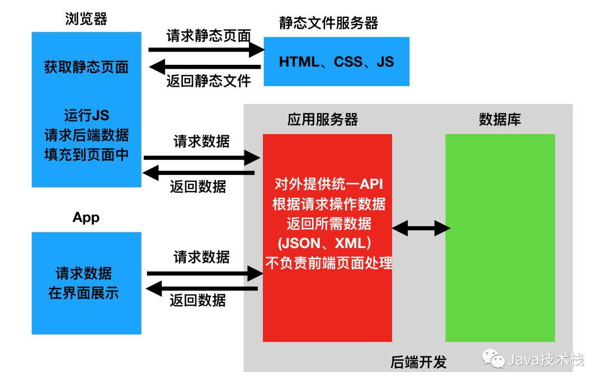

# DRF


## 概念


### 什么是DRF

* DRF，Django REST framework，是建立在Django基础之上的接口开发框架
* 可以快速开发 REST API 接口应用
* 自动生成可浏览的API
* 支持身份验证策略OAuth 1a，OAuth2
* 支持ORM和非ORM数据源的序列化


### 可选包

* PyYAML、uritemplate，模式生成支持
* Markdown，对可浏览API的Markdown支持
* Pygments，对Markdown中的代码支持语法提示
* django-filter，过滤支持
* django-guardian，对象级权限支持


### 什么是前后端分离

* 前后端不分离
  * 数据查询、页面渲染都在后端完成
* 前后端分离
  * 页面渲染在前端完成，后端提供数据接口
* 前后端分离优势
  * 前端可以用浏览器、IOS、Android、小程序、Windows等实现，后端使用相同数据接口





### 什么是restful

* 资源状态转译、表征状态转移
* 把所有数据看成资源、对象
* HTTP的请求动词表明对资源的操作
  * `GET /api/object/`，获取对象列表
  * `POST /api/object/`，创建对象
  * `GET /api/object/id/`，获取对象
  * `DELETE /api/object/id/`，删除对象
  * `PUT /api/object/id/`，修改对象
  * `PATCH /api/object/id/`，修改对象部分信息


### 什么是接口的幂等性

* 客户端发起多次同样请求时，是否对于服务端里面的资源产生不同结果。

* 多次请求，服务端结果一样，则属于幂等接口

* 多次请求，服务端产生结果是不一样的，则属于非幂等接口


### 什么是接口的安全性

* 安全方法是指不修改资源的 HTTP 方法，可以被缓存、对资源无损预加载的方法


| HTTP方法名称 | 是否幂等 | 是否安全 |
| ------------ | -------- | -------- |
| OPTIONS      | Y        | Y        |
| HEAD         | Y        | Y        |
| GET          | Y        | Y        |
| PUT          | Y        | N        |
| DELETE       | Y        | N        |
| POST         | N        | N        |
| PATCH        | N        | N        |


### 什么是序列化和反序列化

* 序列化
  * 将 程序数据 转换为 可传输格式数据
  * 如json、pickle、base64
* 反序列化
  * 将 可传输格式数据 转换成 程序数据


### 什么是CBV、FBV

* CBV，class based view，基于类的视图
  * 继承`django.views.View`类
  * 实现`View.get()`、`View.post()`等方法，View会根据`request.method`调用对应函数
  * 路由映射到`View.as_view()`
* FBV，function based view，基于函数的视图
  * 路由映射到函数
  * 函数中需要自行获取`request.method`，分别处理

```python
@classonlymethod
def as_view(cls, **initkwargs):
    """Main entry point for a request-response process."""
    for key in initkwargs:
        if key in cls.http_method_names:
            raise TypeError(
                "The method name %s is not accepted as a keyword argument "
                "to %s()." % (key, cls.__name__)
            )
        if not hasattr(cls, key):
            raise TypeError(
                "%s() received an invalid keyword %r. as_view "
                "only accepts arguments that are already "
                "attributes of the class." % (cls.__name__, key)
            )

    def view(request, *args, **kwargs):
        # 实例化用户类
        self = cls(**initkwargs)
        
        # 初始化类
        self.setup(request, *args, **kwargs)
        if not hasattr(self, "request"):
            raise AttributeError(
                "%s instance has no 'request' attribute. Did you override "
                "setup() and forget to call super()?" % cls.__name__
            )
            
        # 按request.method将请求分发到函数
        return self.dispatch(request, *args, **kwargs)

    view.view_class = cls
    view.view_initkwargs = initkwargs

    # __name__ and __qualname__ are intentionally left unchanged as
    # view_class should be used to robustly determine the name of the view
    # instead.
    view.__doc__ = cls.__doc__
    view.__module__ = cls.__module__
    view.__annotations__ = cls.dispatch.__annotations__
    # Copy possible attributes set by decorators, e.g. @csrf_exempt, from
    # the dispatch method.
    view.__dict__.update(cls.dispatch.__dict__)

    # Mark the callback if the view class is async.
    if cls.view_is_async:
        markcoroutinefunction(view)

    return view


def dispatch(self, request, *args, **kwargs):
    # Try to dispatch to the right method; if a method doesn't exist,
    # defer to the error handler. Also defer to the error handler if the
    # request method isn't on the approved list.
    if request.method.lower() in self.http_method_names:
        handler = getattr(
            self, request.method.lower(), self.http_method_not_allowed
        )
    else:
        handler = self.http_method_not_allowed
    return handler(request, *args, **kwargs)


def setup(self, request, *args, **kwargs):
    """Initialize attributes shared by all view methods."""
    if hasattr(self, "get") and not hasattr(self, "head"):
        self.head = self.get
    self.request = request
    self.args = args
    self.kwargs = kwargs
```


## 入门示例

* 安装

```sh
pip install djangorestframework
pip install markdown
pip install django-filter
```


* 将 `'rest_framework'` 添加到您的 `INSTALLED_APPS` 中

```py
# project/settings.py

INSTALLED_APPS = [
    ...
    'rest_framework',
]
```


* 为`browsable API`添加登录、注销视图

```py
# project/urls.py

urlpatterns = [
    ...
    path('api-auth/', include('rest_framework.urls'))
]
```


* 在django配置中添加DRF配置

```py
# project/settings.py

# 使用Django的标准权限`django.contrib.auth`
# 或对无权限的用户只读

REST_FRAMEWORK = {
    'DEFAULT_PERMISSION_CLASSES': [
        'rest_framework.permissions.DjangoModelPermissionsOrAnonReadOnly'
    ]
}
```


* 将所需DRF代码先放在urls.py中执行

```py
from django.urls import path, include
from django.contrib.auth.models import User
from rest_framework import routers, serializers, viewsets


# 序列化器
# 定义User对象的API的表现形式
class UserSerializer(serializers.HyperlinkedModelSerializer):
    class Meta:
        model = User
        fields = ['url', 'username', 'email', 'is_staff']

# 视图集合
# 定义视图行为
class UserViewSet(viewsets.ModelViewSet):
    queryset = User.objects.all()
    serializer_class = UserSerializer


# 注册自动路由
router = routers.DefaultRouter()
router.register(r'users', UserViewSet)


# 使用rest_framework.router自动路由
urlpatterns = [
    path('', include(router.urls)),
    path('api-auth/', include('rest_framework.urls', namespace='rest_framework'))
]

# 另一种使用rest_framework.router的方式
urlpatterns = += router.urls
```


## 序列化，Serialization

* 与django表单类似
* 一般放在文件`serializers.py`中


### 序列化器，Serializer

* 定义步骤
  * 需要继承`rest_framework.serializers.Serializer`
  * 定义每个字段，`serializers.IntegerField`
  * 可选实现`Serializer.create()`方法，创建对象，否则`Serializer.save()`无效需要手动创建对象
  * 可选实现`Serializer.update()`方法，修改、更新对象，否则`Serializer.save()`无效需要手动创建对象
  * `Serializer.create()`和`Serializer.update()`必须有返回值

```py
from rest_framework import serializers
from snippets.models import Snippet, LANGUAGE_CHOICES, STYLE_CHOICES


class SnippetSerializer(serializers.Serializer):
    id = serializers.IntegerField(read_only=True)
    title = serializers.CharField(required=False, allow_blank=True, max_length=100)
    code = serializers.CharField(style={'base_template': 'textarea.html'})
    linenos = serializers.BooleanField(required=False)
    language = serializers.ChoiceField(choices=LANGUAGE_CHOICES, default='python')
    style = serializers.ChoiceField(choices=STYLE_CHOICES, default='friendly')

    def create(self, validated_data):
        """
        Create and return a new `Snippet` instance, given the validated data.
        """
        return Snippet.objects.create(**validated_data)

    def update(self, instance, validated_data):
        """
        Update and return an existing `Snippet` instance, given the validated data.
        """
        instance.title = validated_data.get('title', instance.title)
        instance.code = validated_data.get('code', instance.code)
        instance.linenos = validated_data.get('linenos', instance.linenos)
        instance.language = validated_data.get('language', instance.language)
        instance.style = validated_data.get('style', instance.style)
        instance.save()
        return instance
```


* 提供功能
  * 每个字段可以传入校验参数，调用`serializer.is_valid()`实现自动校验
    * `required`，必要
    * `max_length`，最大长度
  * 每个字段可以定义可浏览API的显示模板`style={'base_template': 'textarea.html'}`
  * 调用`Serializer.save()`时，按需自动调用`Serializer.create()`或`Serializer.update()`
  * 批量保存


```py
serializer = SnippetSerializer(data=data)

# 自动校验
serializer.is_valid()

# 获取校验后的数据
serializer.validated_data

# 校验错误原因
serializer.errors

# 保存
serializer.save()

# 批量序列化
serializer = SnippetSerializer(Snippet.objects.all(), many=True)
serializer.data

```


###  模型序列化器，ModelSerializer

* 什么是`ModelSerializer`
  * `Serializer`类似 `django.form.Form`，`ModelSerializer`类似`django.form.ModelForm`，自动根据`Model`生成序列化器


* 定义步骤
  * 需要继承`rest_framework.serializers.ModelSerializer`
  * 使用`Meta.model`参数指定映射的django数据模型
  * 使用`Meta.fields`参数指定映射的字段

```py
class SnippetSerializer(serializers.ModelSerializer):
    class Meta:
        model = Snippet
        fields = ['id', 'title', 'code', 'linenos', 'language', 'style']
```


* 提供功能
  * 自动实现序列化器
  * 自动实现`Serializer.create()`和`Serializer.update()`

```py

# 打印自动生成的序列化器
print(repr(serializer))

# SnippetSerializer():
#    id = IntegerField(label='ID', read_only=True)
#    title = CharField(allow_blank=True, max_length=100, required=False)
#    code = CharField(style={'base_template': 'textarea.html'})
#    linenos = BooleanField(required=False)
#    language = ChoiceField(choices=[('Clipper', 'FoxPro'), ('Cucumber', 'Gherkin'), ('RobotFramework', 'RobotFramework'), ('abap', 'ABAP'), ('ada', 'Ada')...
#    style = ChoiceField(choices=[('autumn', 'autumn'), ('borland', 'borland'), ('bw', 'bw'), ('colorful', 'colorful')...
```


### 使用序列化器的 View 示例

* 一个对象两个 URL
  * 存在两个 GET 方法
  * 一个 GET 对象 list
  * 一个 GET 对象


* 序列化

```py
snippets = Snippet.objects.all()

# 默认参数
serializer = SnippetSerializer(snippets, many=True)

# 指定instance参数
serializer = SnippetSerializer(instance=snippets, many=True)
```


* 反序列化

```py
data = request.data

serializer = SnippetSerializer(data=data)
```


* POST和PUT的区别
  * POST，创建对象，只需要传入`data`
  * PUT，修改对象，需要从数据库中读取全部信息，修改请求修改的部分信息。需要同时传入`instance`和`data`。


* 实现View

```py
urlpatterns = [
    path('snippets/', views.snippet_list),
    path('snippets/<int:pk>/', views.snippet_detail),
]


@csrf_exempt
def snippet_list(request):
    """
    List all code snippets, or create a new snippet.
    """
    if request.method == 'GET':
        snippets = Snippet.objects.all()
        serializer = SnippetSerializer(snippets, many=True)
        return JsonResponse(serializer.data, safe=False)

    elif request.method == 'POST':
        data = JSONParser().parse(request)
        serializer = SnippetSerializer(data=data)
        if serializer.is_valid():
            serializer.save()
            return JsonResponse(serializer.data, status=201)
        return JsonResponse(serializer.errors, status=400)

    
@csrf_exempt
def snippet_detail(request, pk):
    """
    Retrieve, update or delete a code snippet.
    """
    try:
        snippet = Snippet.objects.get(pk=pk)
    except Snippet.DoesNotExist:
        return HttpResponse(status=404)

    if request.method == 'GET':
        serializer = SnippetSerializer(snippet)
        return JsonResponse(serializer.data)

    elif request.method == 'PUT':
        data = JSONParser().parse(request)
        serializer = SnippetSerializer(snippet, data=data)
        if serializer.is_valid():
            serializer.save()
            return JsonResponse(serializer.data)
        return JsonResponse(serializer.errors, status=400)

    elif request.method == 'DELETE':
        snippet.delete()
        return HttpResponse(status=204)

```


## 请求和响应，Requests & Responses


### 新请求对象，Request

* DRF使用了新的`rest_framework.request.Request`类，扩展了原有的`django.HttpRequest`

```py
# django的 request.POST 只处理表单，只对POST方法有效

# DRF的data
# 处理任意数据，对POST、PUT、PATCH方法都有效
# json数据会被解析为dict
# form数据会被解析为QueryDict
request.data

# 正确名称的 request.GET
request.query_params

# 获取django原生的 HttpRequest 对象
request._request
```


### 新响应对象，Response

* DRF的`Response`是`django.HttpResponse`的子类
* `Response` 是 `TemplateResponse` 的一种
* `Response` 采用未渲染的内容并使用内容协商来确定返回给客户端的正确内容类型


* DRF渲染类设置

```py
REST_FRAMEWORK = {
    'DEFAULT_RENDERER_CLASSES': (  # 默认响应渲染类
        'rest_framework.renderers.JSONRenderer',  # json渲染器，返回json数据
        'rest_framework.renderers.BrowsableAPIRenderer',  # 浏览器API渲染器，返回调试界面
    )
}
```


* 原型
  * `data`，为响应准备的序列化处理后的数据
  * `status`，状态码，默认200
  * `template_name`，模板名称，如果使用`HTMLRenderer` 时需指明
  * `headers`，用于存放响应头信息的字典
  * `content_type`，响应数据的Content-Type，通常此参数无需传递，REST framework会根据前端所需类型数据来设置该参数

```py
Response(data, status=None, template_name=None, headers=None, content_type=None)
```


* 使用示例
  * `Response.data`，传给response对象的序列化后，但尚未render处理的数据
  * `Response.status_code`，状态码的数字
  * `Response.content`，经过render处理后的响应数据

```py
# 根据请求的 content type，渲染响应

from rest_framework.response import Response
from rest_framework.decorators import api_view
# from rest_framework.permissions import AllowAny

@api_view(('GET', 'POST'))
# @permission_classes((AllowAny,))
def test(request):
    return Response({1: 2, 3: 4})
```


### 命名状态码，status

```py
import rest_framework
ic(rest_framework.status.HTTP_400_BAD_REQUEST)

from rest_framework import status
ic(status.HTTP_201_CREATED)
```


### 新的视图

* `@api_view`用于FBV
* `APIView`用于CBV
* 改为使用新的`Request`对象
* 对异常进行了处理


### 可浏览性，Browsability

* 由于DRF支持根据类型协商响应，当不指定响应类型时，DRF自动返回HTML页面


### 使用新请求和响应的 View 示例

```py
from rest_framework.response import Response
from rest_framework.decorators import api_view,renderer_classes,permission_classes
from rest_framework.renderers import JSONRenderer, TemplateHTMLRenderer
from rest_framework.permissions import AllowAny

@api_view(('GET', 'POST'))
@renderer_classes((JSONRenderer,))
@permission_classes((AllowAny,))
def test(request):
    return Response({1: 2, 3: 4}, content_type='application/json')


urlpatterns = [
    path('test/', test)
]
```


* 使用新特性的视图

```py
from rest_framework import status
from rest_framework.decorators import api_view
from rest_framework.response import Response
from snippets.models import Snippet
from snippets.serializers import SnippetSerializer


# 装饰器，修改request
@api_view(['GET', 'POST'])
def snippet_list(request):

    # 获取列表
    if request.method == 'GET':
        snippets = Snippet.objects.all()
        
        # 添加 many=True 序列化列表
        serializer = SnippetSerializer(snippets, many=True)
        
        # 使用 rest_framework.response.Response 自动协商格式，无需手动序列化
        return Response(serializer.data)

    # 创建对象
    elif request.method == 'POST':

        # 使用 rest_framework.request.Request.data 无需手动反序列化
        serializer = SnippetSerializer(data=request.data)

        if serializer.is_valid():
            serializer.save()
            return Response(serializer.data, status=status.HTTP_201_CREATED)

        return Response(serializer.errors, status=status.HTTP_400_BAD_REQUEST)


@api_view(['GET', 'PUT', 'DELETE'])
def snippet_detail(request, pk):

    try:
        snippet = Snippet.objects.get(pk=pk)
    except Snippet.DoesNotExist:
        return Response(status=status.HTTP_404_NOT_FOUND)

    # 获取对象
    if request.method == 'GET':
        serializer = SnippetSerializer(snippet)
        return Response(serializer.data)

    # 更新对象
    elif request.method == 'PUT':
        serializer = SnippetSerializer(snippet, data=request.data)
        if serializer.is_valid():
            serializer.save()
            return Response(serializer.data)
        return Response(serializer.errors, status=status.HTTP_400_BAD_REQUEST)

    # 删除对象
    elif request.method == 'DELETE':
        snippet.delete()
        return Response(status=status.HTTP_204_NO_CONTENT)

```


* 支持后缀的URL

```sh
# def snippet_list(request, format=None):
# def snippet_detail(request, pk, format=None):

# 后缀URL
# http http://127.0.0.1:8000/snippets.json  # JSON suffix
# http http://127.0.0.1:8000/snippets.api   # Browsable API suffix

from django.urls import path
from rest_framework.urlpatterns import format_suffix_patterns
from snippets import views

urlpatterns = [
    path('snippets/', views.snippet_list),
    path('snippets/<int:pk>/', views.snippet_detail),
]

urlpatterns = format_suffix_patterns(urlpatterns)
```


* 请求示例

```py
# 默认请求
http http://127.0.0.1:8000/snippets/

# Accept头协商格式
http http://127.0.0.1:8000/snippets/ Accept:application/json  # Request JSON
http http://127.0.0.1:8000/snippets/ Accept:text/html         # Request HTML

# 使用url后缀协商格式
http http://127.0.0.1:8000/snippets.json  # JSON suffix
http http://127.0.0.1:8000/snippets.api   # Browsable API suffix


# post请求时指定 content-type

http --form POST http://127.0.0.1:8000/snippets/ code="print(123)"

'''
{
  "id": 3,
  "title": "",
  "code": "print(123)",
  "linenos": false,
  "language": "python",
  "style": "friendly"
}
'''

# POST using JSON
http --json POST http://127.0.0.1:8000/snippets/ code="print(456)"

'''
{
    "id": 4,
    "title": "",
    "code": "print(456)",
    "linenos": false,
    "language": "python",
    "style": "friendly"
}
'''
```


## 基于类的视图，CBV


### 使用APIView重构View


* 什么是`APIView`
  * `rest_framework.views.APIView`
  * `APIView`继承自`View`
  * 用于替换`django.views.View`


* `APIView`的改进
  * `APIView`重写了`View`的`as_view()`和`dispatch()`
    * 在`initial()`中实现了认证、权限、限流
  * `APIView`传入新的`Request`对象，替代了`django.HttpRequest`对象
    * `Request`对象按`Content Type`解析传入的所有数据为`QueryDict`
    * 通过`request._request`可以取到原生request
  * `APIView`接受视图传入的新的`Response`对象
    * 新的`Response`会按请求的`Accept`响应响应的格式
  * `APIView`捕获了所有异常，自动转换成合适的格式
  * `APIView`重写了`dispatch()`，增加了功能
    * 身份验证，`APIView.authentication_classes`
    * 权限检查，`APIView.permission_classes`
    * 流量控制，`APIView.throttle_classes`


```py
from snippets.models import Snippet
from snippets.serializers import SnippetSerializer
from django.http import Http404
from rest_framework.views import APIView
from rest_framework.response import Response
from rest_framework import status


class SnippetList(APIView):
    """
    List all snippets, or create a new snippet.
    """
    def get(self, request, format=None):
        snippets = Snippet.objects.all()
        serializer = SnippetSerializer(snippets, many=True)
        return Response(serializer.data)

    def post(self, request, format=None):
        serializer = SnippetSerializer(data=request.data)
        if serializer.is_valid():
            serializer.save()
            return Response(serializer.data, status=status.HTTP_201_CREATED)
        return Response(serializer.errors, status=status.HTTP_400_BAD_REQUEST)


class SnippetDetail(APIView):
    """
    Retrieve, update or delete a snippet instance.
    """
    def get_object(self, pk):
        try:
            return Snippet.objects.get(pk=pk)
        except Snippet.DoesNotExist:
            raise Http404

    def get(self, request, pk, format=None):
        snippet = self.get_object(pk)
        serializer = SnippetSerializer(snippet)
        return Response(serializer.data)

    def put(self, request, pk, format=None):
        snippet = self.get_object(pk)
        serializer = SnippetSerializer(snippet, data=request.data)
        if serializer.is_valid():
            serializer.save()
            return Response(serializer.data)
        return Response(serializer.errors, status=status.HTTP_400_BAD_REQUEST)

    def delete(self, request, pk, format=None):
        snippet = self.get_object(pk)
        snippet.delete()
        return Response(status=status.HTTP_204_NO_CONTENT)
    

# 需要修改路由为 APIView.as_view()
# path('snippets/', views.SnippetList.as_view()),
# path('snippets/<int:pk>/', views.SnippetDetail.as_view()),
```


### 通用API视图，GenericAPIView 

* 作用
  * 抽象公共接口
  * DRF基于公共接口，实现mixins和generics
* 公共接口
  * `get_queryset`
  * `get_object`
  * `get_serializer`
  * `get_serializer_class`

```py
class GenericAPIView(views.APIView):
    queryset = None
    serializer_class = None

    def get_queryset(self):
        pass

    def get_object(self):
        pass

    def get_serializer(self, *args, **kwargs):
        pass

    def get_serializer_class(self):
        pass
```


### 抽象混入`rest_framework.mixins`

* 要使用mixin就需要继承`rest_framework.generics.GenericAPIView()`

```py
from snippets.models import Snippet
from snippets.serializers import SnippetSerializer
from rest_framework import mixins
from rest_framework import generics

class SnippetList(mixins.ListModelMixin,
                  mixins.CreateModelMixin,
                  generics.GenericAPIView):
    queryset = Snippet.objects.all()
    serializer_class = SnippetSerializer

    def get(self, request, *args, **kwargs):
        return self.list(request, *args, **kwargs)

    def post(self, request, *args, **kwargs):
        return self.create(request, *args, **kwargs)

    
class SnippetDetail(mixins.RetrieveModelMixin,
                    mixins.UpdateModelMixin,
                    mixins.DestroyModelMixin,
                    generics.GenericAPIView):
    queryset = Snippet.objects.all()
    serializer_class = SnippetSerializer

    def get(self, request, *args, **kwargs):
        return self.retrieve(request, *args, **kwargs)

    def put(self, request, *args, **kwargs):
        return self.update(request, *args, **kwargs)

    def delete(self, request, *args, **kwargs):
        return self.destroy(request, *args, **kwargs)
```


### 抽象视图`rest_framework.generics`

```py
from snippets.models import Snippet
from snippets.serializers import SnippetSerializer
from rest_framework import generics


class SnippetList(generics.ListCreateAPIView):
    queryset = Snippet.objects.all()
    serializer_class = SnippetSerializer


class SnippetDetail(generics.RetrieveUpdateDestroyAPIView):
    queryset = Snippet.objects.all()
    serializer_class = SnippetSerializer
```


## 认证和权限，Authentication & Permissions

* authentication_classes
  * 接收多个认证类
  * 任意一个认证类认证成功，则认证成功
  * 所有认证都未成功，则认证失败
  * 单个认证类认证成功则返回成功、失败则抛出异常，无法认证则返回None，下一个认证类继续认证

* permission_classes
  * 接收多个权限类
  * 所有权限类都返回成功，则成功
  * 任意权限类返回失败，则失败


### 模型中的反向关系使用序列化器

```py
from django.contrib.auth.models import User

class UserSerializer(serializers.ModelSerializer):
    
    # 手动添加反向关系
    snippets = serializers.PrimaryKeyRelatedField(many=True, queryset=Snippet.objects.all())

    class Meta:
        model = User
        fields = ['id', 'username', 'snippets']
```


### 重写`perform_create`添加额外信息

* 修改实例保存的管理方式，并处理传入请求或请求的 URL 中隐含的任何信息

```py
def perform_create(self, serializer):
    serializer.save(owner=self.request.user)
```


### 添加权限到视图


```py
from snippets.models import Snippet
from snippets.serializers import SnippetSerializer
from rest_framework import generics


# 添加权限
from rest_framework import permissions


class SnippetList(generics.ListCreateAPIView):
    queryset = Snippet.objects.all()
    serializer_class = SnippetSerializer
	# 添加权限
    permission_classes = [permissions.IsAuthenticatedOrReadOnly]


class SnippetDetail(generics.RetrieveUpdateDestroyAPIView):
    queryset = Snippet.objects.all()
    serializer_class = SnippetSerializer
    # 添加权限
    permission_classes = [permissions.IsAuthenticatedOrReadOnly]

```


### 添加登录页面到Browable API

```py
from django.urls import path, include

urlpatterns += [
    path('api-auth/', include('rest_framework.urls')),
]
```


### 自定义权限管理

```py
from rest_framework import permissions


class IsOwnerOrReadOnly(permissions.BasePermission):
    """
    Custom permission to only allow owners of an object to edit it.
    """

    def has_object_permission(self, request, view, obj):
        # Read permissions are allowed to any request,
        # so we'll always allow GET, HEAD or OPTIONS requests.
        if request.method in permissions.SAFE_METHODS:
            return True

        # Write permissions are only allowed to the owner of the snippet.
        return obj.owner == request.user


# 修改视图
permission_classes = [permissions.IsAuthenticatedOrReadOnly,
                      IsOwnerOrReadOnly]
```


### 在API中鉴权

```py
http -a admin:password123 POST http://127.0.0.1:8000/snippets/ code="print(789)"

{
    "id": 1,
    "owner": "admin",
    "title": "foo",
    "code": "print(789)",
    "linenos": false,
    "language": "python",
    "style": "friendly"
}
```


## 关系和超链接API，Relationships and hyperlinked


### 使用`rest_framewor.reverse`创建API目录

```py
from rest_framework.decorators import api_view
from rest_framework.response import Response
from rest_framework.reverse import reverse


@api_view(['GET'])
def api_root(request, format=None):
    return Response({
        'users': reverse('user-list', request=request, format=format),
        'snippets': reverse('snippet-list', request=request, format=format)
    })
```


### 超链接字段

* 实体关联的方法
  * 主键关联实体
  * 超链接关联实体
  * 字符串关联实体‘
  * 嵌套实体
  * 自定义


### HyperlinkedModelSerializer

* `HyperlinkedModelSerializer` 与 `ModelSerializer` 的区别：
  * 默认不包含id字段
  * 包含一个url字段，`HyperlinkedIdentityField`
  * 关系使用 `HyperlinkedRelatedField` ，而不是 `PrimaryKeyRelatedField`


### 分页

```py
REST_FRAMEWORK = {
    'DEFAULT_PAGINATION_CLASS': 'rest_framework.pagination.PageNumberPagination',
    'PAGE_SIZE': 10
}
```


## 视图集和路由器，Viewsets & Routers


### 使用ViewSet重构

* 为什么需要ViewSet
  * 由于一个模型需要两个View，为了将两个View合成一个View，ViewSet重写了分发机制
  * `ViewSet.as_view(action)`接受一个映射参数，可以将路由映射到指定类成员函数

```py
from rest_framework import viewsets

class UserViewSet(viewsets.ReadOnlyModelViewSet):
    """
    This viewset automatically provides `list` and `retrieve` actions.
    """
    queryset = User.objects.all()
    serializer_class = UserSerializer

    
from rest_framework.decorators import action
from rest_framework.response import Response
from rest_framework import permissions

class SnippetViewSet(viewsets.ModelViewSet):
    """
    This viewset automatically provides `list`, `create`, `retrieve`,
    `update` and `destroy` actions.

    Additionally we also provide an extra `highlight` action.
    """
    queryset = Snippet.objects.all()
    serializer_class = SnippetSerializer
    permission_classes = [permissions.IsAuthenticatedOrReadOnly,
                          IsOwnerOrReadOnly]

    @action(detail=True, renderer_classes=[renderers.StaticHTMLRenderer])
    def highlight(self, request, *args, **kwargs):
        snippet = self.get_object()
        return Response(snippet.highlighted)

    def perform_create(self, serializer):
        serializer.save(owner=self.request.user)
```


### 使用视图路由

```py
from django.urls import path, include
from rest_framework.routers import DefaultRouter
from snippets import views

# Create a router and register our viewsets with it.
router = DefaultRouter()
router.register(r'snippets', views.SnippetViewSet,basename="snippet")
router.register(r'users', views.UserViewSet,basename="user")

# The API URLs are now determined automatically by the router.
urlpatterns = [
    path('', include(router.urls)),
]
```


## 抽象过程


* 使用`django.views.View`实现接口
  * 使用CBV代替FBV，可以更规范区分HTTP方法

```py
from django.views import View

class BookView(View):
    def dispatch(self, request, *args, **kwargs):
        # 插入公共处理
        return super().dispatch(request, *args, **kwargs)

    def get(self, request):
        return HttpResponse('GET')

    def post(self, request):
        return HttpResponse('POST')

    def delete(self, request):
        return HttpResponse('DELETE')
```


* 使用`rest_framework.views.APIView`替换`django.views.APIView`
  * `APIView`继承自`View`
  * `APIView`重写了`View`的`as_view()`和`dispatch()`
  * `APIView`通过重写`dispatch()`使用了新的`request`对象
    * `rest_framework.request`提前解析了post的json，`django.request`不会解析POST的json
    * 在`initial()`中实现了认证、权限、限流
    * 通过`request._request`可以取到原生request


* 使用`rest_framework.views.APIView`实现接口

```
```


```py
from django.views import View

class BookView(View):
    def dispatch(self, request, *args, **kwargs):
        # 插入公共处理
        return super().dispatch(request, *args, **kwargs)
    
    def get(self, request):
        return HttpResponse('GET')
    
    def post(self, request):
        return HttpResponse('POST')
    
    def delete(self, request):
        return HttpResponse('DELETE')
```


## drf-yasg


## django-filter

