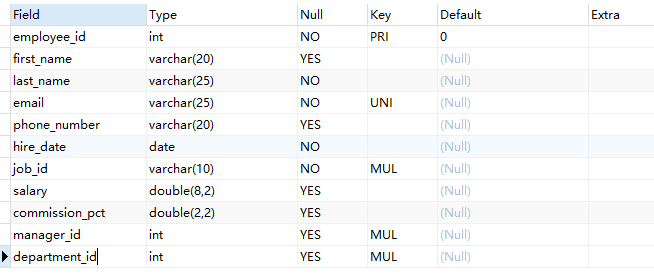
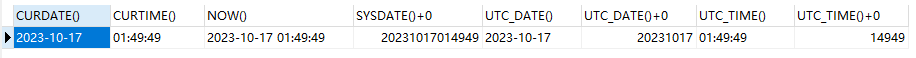
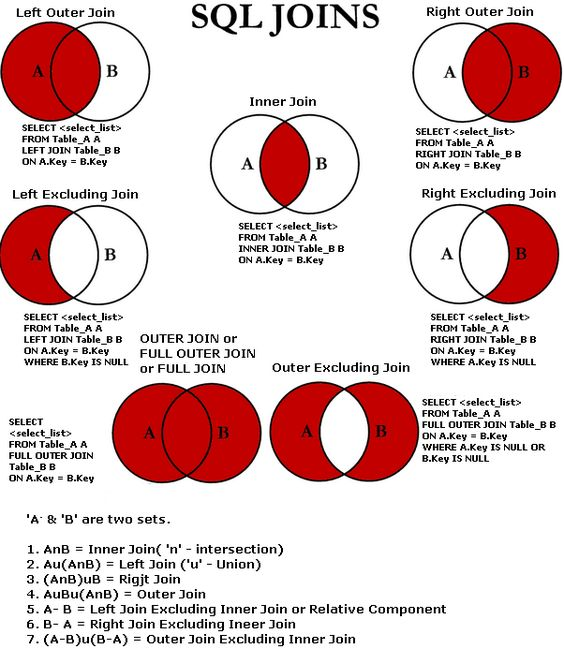
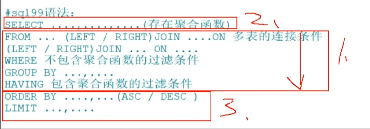

# MySQL


## 数据库入门


### 数据库概念

* 为什么使用数据库
  * 数据持久化，persistence
  * 数据持久化，把内存数据保存在可掉电式存储设备中供之后使用，易于管理、结构化查询


* 数据库相关概念
  * DB，database，数据库
    * 狭义数据库指，按特定格式保存数据的文件
    * 本质是一个文件系统，存储了一系列有组织的数据
  * DBMS，Database Management System，数据库管理系统
    * 是一种操纵和管理数据库的大型软件
    * 用于建立、使用、维护数据库，对数据库进行统一管理和控制
    * 用户通过数据库管理系统访问数据库总表内的数据
  * SQL，Structure Query Language，结构化查询语言
    * 专门用于与数据库通讯的语言
  * DB和DBMS的关系
    * 一个DBMS可以管理多个DB


* 什么是关系型数据库
  * RDBMS
  * 基于行（row）、列（column）保存一种对象的数据
  * 多种对象的数据通过字段值形成强关联关系


* 什么是非关系型数据库
  * 一般基于键值存储数据，查询速度快
  * 放弃了对象间的强关联关系，提高了性能
  * 非关系型数据库有多种


* 非关系型数据库分类
  * 键值型数据库，如内存缓存
    * Redis
  * 文档型数据库，如JSON文档、XML文档
    * MongoDB
    * CouchDB
  * 搜索引擎数据库，倒排索引
    * Solr
    * Elasticsearch
    * Splunk
  * 列数据库，降低系统IO、适用于分布式文件系统
    * HBase
  * 图数据库，存储图形关系
    * Neo4J
    * InfoGrid


* RDBMS优势
  * 支持复杂查询
  * 支持事务


### MySQL版本选择

* 纵向版本
  * 背景：MySQL从5.7版本直接跳到了8.0版本
  * 主流：Mysql5.7
  * 推广：Mysql8.0.34
  * 版本选择:  <https://zhuanlan.zhihu.com/p/144457223>


* 横向版本
  * MySQL Community Server，社区版本
    * 开源免费，无技术支持
  * MySQL Enterprise Edition，企业版本
    * 付费，技术支持
  * MySQL Cluster，集群版本
    * 开源免费，集群
  * MySQL Cluster CGE，高级集群版
    * 付费，集群，技术支持


### 客户端

* 官方客户端

  * MySQL Workbench，GUI客户端

  * MySQL Workbench OSS，社区版

  * MySQL WorkbenchSE，企业版

* 客户端比较

  * MySQL Workbench
    * 支持数据建模，ER图
  * phpMyAdmin
    * 支持
  * Navicat Preminum
    * 多数据库通用
    * 收费
  * SQLyog
    * 收费
  * dbeaver
    * 支持NoSQL等多种数据库
    * 需要安装Java


### docker安装

```bash
docker run --name mysql8 -e MYSQL_ROOT_PASSWORD=123456 -d  -p 3306:3306 mysql
```


### Linux rpm安装

```bash
# 下载yum源配置
wget http://dev.mysql.com/get/mysql-community-release-el7-5.noarch.rpm

# 安装yum源
rpm -Uvh *.rpm

# 安装mysql
sudo yum install mysql-community-server
```


### CentOS yum安装

```sh
```


### 查看版本

* 命令行查看版本

```sh
mysql --version;
mysql -V;
```

* SQL函数查看版本

```mysql
select version();
```


### 启停服务

```sh
# centos6
service mysqld start
service mysqld status
service mysqld stop

# centos7
systemctl start mysqld 
systemctl status mysqld 
systemctl stop mysqld 

# windows
net start mysql80
net stop mysql80
```


### 命令行连接

* `-h`，服务地址，不指定为localhost
* `-P`，服务端口，不指定为3306
* `-u`，登录用户，不指定为root
* `-p`，登录密码，留空为交互式输入，在命令行中输入会产生warning

```sh
# 参数和参数值之间可以挨着
# -p和密码之间必须挨着，或者留空交互式输入
mysql -h 主机 -P 端口 -u 用户名 -p密码

# 本机可以默认值登录
mysql -p
```


### 退出连接

```mysql
# 退出
exit
quit
# ctrl + c
```


### 远程连接权限配置

* 数据库默认只允许root用户在localhost连接
* mysql8.0升级了默认的鉴权方法，如果要适配旧的客户端，需要改为旧的鉴权方法

```mysql
# < mysql 8.0 允许远程连接
GRANT ALL PRIVILEGES ON *.* TO 'root'@'%' IDENTIFIED BY 'passwd' with grant option;


# > mysql 8.0 允许远程连接，加密规则改变，通过mysql_native_password恢复

# 创建用户
CREATE USER 'root'@'%' IDENTIFIED BY 'passwd'; 

# 将 所有数据库.所有表 赋权给 用户@所有连接host
GRANT ALL ON *.* TO 'root'@'%'; 

# 修改鉴权方式
ALTER USER 'root'@'%' IDENTIFIED WITH mysql_native_password BY 'passwd';

# 刷新全新啊
FLUSH PRIVILEGES;
```


### 配置文件


```ini
# 配置文件位置
/etc/my.cnf

# 数据文件位置
/var/lib/mysql/

# 修改默认存储位置
[mysqld]
datadir=/var/lib/mysql

# 修改默认日志位置
[mysqld_safe]
log-error=/var/log/mysqld.log

# 修改数据库默认编码
character set atin1;
collation latin1_swedish_ci;
```


### 字符集配置

* 一个数据表有两个字符相关配置
  * character，或character set，字符集，即支持的编码规则
  * collation，字符之间的排列规则


* 默认字符集

  * mysql5.7以前，默认字符集是`Latin1`，只支持欧洲语言字符集

  * mysql8.0及之后，默认的字符集为`utf8mb4`，支持4字节UTF-8编码的字符集，能够表示世界上几乎所有的字符


* utf8mb4 是什么

  * utf8扩展

  * 5.5.3起支持

  * 支持emoji


* 表和字段的字符集
  * mysql支持给表设置默认字符集和排序规则
  * mysql支持给字段指定字符集和排序规则，但一般不建议这么做
  * 可以修改表的默认字符集并转换所有列，但一般不建议这么做


```mysql
# 显示所有字符集
show character set;

# 显示数据库环境变量
show variables like 'character_set%' / '%char%';
show variables like 'collation%';

# 创建数据库时指定字符集
create database 数据库名 
  default character set utf8
  default collate utf8_general_ci;

# 修改数据库字符集
alter database 数据库名 
  character set utf8 
  collate utf8_general_ci;

```


* 运行时修改字符集（不建议）

```mysql
# 修改客户端使用的字符集
set character_set_client=utf8;

# 修改当前连接使用的字符集
set character_set_connection=utf8;

# 修改返回给客户端的结果集的字符集
set character_set_results=utf8;

# 修改当前数据库的默认字符集
set character_set_database=utf8;

# 修改当前数据库的默认校对规则
set collation_database=utf8_general_ci;
```


* 配置文件修改字符集

```ini
# /etc/my.cnf

# 客户端字符集配置

# [mysql]
[client]
default-character-set=utf8mb4


# 服务端字符集配置

[mysqld]
default-storage-engine = INNODB
character-set-server = utf8mb4
collation-server = utf8mb4_general_ci

[mysqld]
init-connect='SET NAMES utf8'
```


## SQL入门


### 概念

* SQL，Structured Query Language，结构化查询语言
* 是访问和处理数据库的标准计算机语言
* 由IBM上世纪70年代开发出来
* 美国国家标准化组织，ANSI标准
  * SQL-86
  * SQL-89
  * SQL-92，淘汰标准
  * SQL-99，现行标准
* 各厂商数据库的SQL在细节上存在兼容性问题


### 分类

* SQL语言分类
  * 管饭分为三类
    * DDL，数据定义语言
    * DML，数据操作语言
    * DCL，数据控制语言

  * 其他细化分类
    * DQL，数据查询语言，将SELECT从DML中拆分出来
    * TCL，事务控制语言，将事务从DCL中拆分出来


* DDL，Data Definition Languages，数据定义语言
  * 定义数据库、表、视图、索引等
    * CREATE
  * 创建、删除、修改数据库和数据表
    * ALTER
    * DROP
    * RENAME
    * TRUNCATE


* DML，Data Manipulation Language，数据操作语言
  * 增删改查
    * INSERT
    * DELETE
    * UPDATE
    * SELECT


* DCL，Data Control Language，数据控制语言
  * 定义数据库、表、字段、用户的访问权限和安全级别
    * GRANT
    * REVOKE
  * 事务提交、回滚
    * COMMIT
    * ROLLBACK
    * SAVEPOINT


* DQL，Data Query Language，数据查询语言
  * 由于数据查询比较重要，查询可能单独拎出来作为DQL


* TCL，Transaction Control Language，事务控制语言
  * COMMIT、ROLLBACK


### 语法规则和规范

* 语法规则
  * SQL可以卸载一行或多行。为了提高可读性，各子句分行写，必要时使用缩进。
  * 命令以`;`结束分隔
  * `\g`或`\G`在命令行中可以将列显示转换为行显示
  * 关键字不能被缩写也不能分行
  * 必须保证所有的括号、单引号、双引号成对
  * 必须使用英文半角输入方式
  * 字符串类型和日期类型的数据规范使用单引号，兼容双引号
  * 数字可以使用单引号
  * 列的别名使用双引号，不建议省略AS关键字，兼容单引号
  * SQL不区分大小写，但是操作系统区分大小写（DBMS使用操作系统的文件系统）


* 命名规则
  * 库名、表名不超过30个字符，变量名不超过29个字符
  * 只能使用[A-Z, a-z, 0-9, _ ] 共63个字符
  * 最好不要包含空格
  * 最好不要和关键字重复，重复了需要使用``包裹
  * 多个表中相同字段，名称和类型最好保持一致


* 注释
  * `#`开头，单行注释
  * `--`开头，单行注释
  * `/* */`包裹，多行注释，不能嵌套


* 规范
  * MySQL在windows环境下是大小写不敏感的
  * MySQL在Linux环境下是大小写敏感的
    * 数据库名、表名、表的别名、变量名是严格区分大小写的
    * 关键字、函数名、列名（或字段名）、列的别名（字段的别名）是忽略大小写的
  * 建议
    * 数据库名、表名、表别名、字段名、字段别名等都小写
    * SQL关键字、函数名、绑定变量等都大写


### 默认数据库

* information_schema
  * 服务器系统信息，如数据库名称、数据表名称、字段名称、存取权限、数据文件所在文件夹、系统文件夹

* performance_schema
  * 性能数据

* sys
  * 服务器性能指标，供系统管理员和开发人员监控

* mysql
  * 运行所需的系统信息
  * 数据文件夹
  * 字符集
  * 约束检查


### 常用管理命令

```sh
# 设置密码
/user/bin/mysqladmin -u root password 'new-password'

# 安全初始化
mysql_secure_installation

# 创建用户
create user yingxuanxuan identified by "password";

# 删除用户
drop user yingxuanxuan;

# 删除HOST
drop user 'jeffrey'@'localhost';

# 重命名用户
rename user yingxuanxuan to yingxuanxuan2；

# 修改当前用户密码
set password = password("passwd");

# 修改指定用户密码：
set password for username = password("passwd");

# 修改权限

# 权限层级：
# 1.全局
# 2.数据库
# 3.表
# 4.列
# 5.子程序

grant all privileges on 数据库.表 to 用户名@主机 identified by 密码；

# 删除权限
revoke all privileges from username;

# 生效权限
flush privileges;

# 备份
mysqlddump -u root -p 数据库名称 > 备份文件.sql

# 恢复
mysql -u root -p 数据库名称 < 备份文件.sql

# 查看权限
show grants for root@'localhost';

# 列显示查询结果 \G
select * from mysql.user where user='test'and host='127.0.0.1'\G;

# 结果导出到文件：
select * from xxx INTO  OUTFILE 'xxx/xx'

# 查看数据引擎：
show engines;

# 修改数据表引擎
# MyISAM不支持事务，InnoDB支持事务。
alter table person type=INNODB;
```


### 列出所有数据库

```mysql
show databases;
```


### 创建数据库

```mysql
create database 数据库名;

create database test;
```


### 删除数据库

```mysql
drop database 数据库名;
drop database test;
```


### 查看数据库创建信息

```mysql
show create database 数据库名;

show create database 数据库名\G
show create database test\G
```


### 使用数据库

```mysql
use 数据库名;

use test;
```


### 列出所有数据表

```mysql
# 列出当前数据库的所有表
# use 数据库;
show tables;

# 列数指定数据库所有数据表
show tables from db;
```


### 创建数据表

```mysql
# 创建表
# 最后一个字段定义后没有逗号

create table 表名(
	字段名 数据类型,
    字段名 数据类型
);

create table student(
	id int,
	name varchar(20)
);
```


### 查看表中所有数据

```mysql
select * from 数据库表名称;
select * from sutdent;
```


### 添加记录

```mysql
insert into 表名 values(值列表);

# 添加两条记录
# 需要提前设置字符集支持中文

insert into student values(1, '张三');
insert into student values(2, '李四');
```


### 查看创建表的语句，建表语句

```mysql
show create table 表名称;
show create table student;

show create table 表名称\G
show create table student\G
```


### 查看表结构，行列显示

```mysql
describe 表名;

describe employees;


# 简写
desc employees;
```





* Field，字段名称
* Type，字段类型
* Null，该列是否可以存储NULL值
* Key，该列是否已编制索引
  * PRI表示该列是表主键的一部分
  * UNI表示该列是UNIQUE索引的一部分
  * MUL表示在列中某个给定值允许出现多次

* Default，表示该列是否有默认值，如果有，那么值是多少
* Extra，表示可以获取的与给定列有关的附加信息，例如AUTO_INCREMENT等


### 删除表格

```mysql
drop table 表名称;

drop table student;
```


### 导入数据

```mysql
# 在mysql中执行

source 文件路径;
```


### 伪表关键字，DUAL

* 为了让所有SELECT语句都有FROM子句，构造一个无意义无数据的表

```mysql
SELECT 1 + 1， 3 * 2；
```


## 数据查询语言，DQL

* DQL, Data Query Language 


### 基础查询，SELECT

```mysql
# 查询所有列
select * 
from departments;

# 查询指定列（按指定顺序显示）
select department_id,department_name 
from departments;

# 查询常量值
select 100;
select 'str';

# 查询表达式
select 100 % 98;

# 查询函数
select version();

# 别名
select expression as short; # as
select expression short; # 空格

# 去重 distinct， 仅针对单行
select department_id from departments;
select distinct department_id from employees;

# 字符串拼接
select '100'+90; # 190 其中一个为数值，尝试将字符串转为数值
select 'abc'+90; # 90 转换失败则为0
select null + 90; # null 其中一个为null，则结果为null
select '100' + '90'; # 190
select concat('100', '90', null); # null，其中一个为null则结果null
select concat('100', '90', IFNULL(null, '零');
select CONCAT('100', '90', 80); # '1009080'

# 字段中存在NULL字段会导致字符串拼接后整体为NULL
select concat(`first_name`, ',', `last_name`, ',', ifnull(`commission_pct`, '0')) from employees;

# ifnull
ifnull(var) # 返回1, 0
ifnull(var, 'str') # 返回str，原值
```


### 条件查询，WHERE

```mysql
# 简单条件运算符
< # 小于
> # 大于
= # 等于
<> # 不等于 !=

select * 
from employees 
where salary > 12000;

select last_name, department_id 
from employees 
where department_id <> 90;

# 逻辑运算符
and # &&
or # ||
not # !

select last_name, salary, commission_pct 
from employees 
where salary >= 10000 
and salary <=120000;

select * 
from employees 
where department_id < 90 
or department_id > 110 
or salary > 150000;

select * 
from employees 
where not(department_id >= 90 and department_id <= 110) 
or salary > 150000;

# 模糊查询
like
between and
in
is null
is not null

## like 
% # 任意多个字符
_ # 任意单个字符
\ # 默认转译字符
escape '$' # 自定义转义字符为$

select * from employees where last_name like '%a%';
select last_name, salary from employees where last_name like '____n_l%';
select last_name from employees where last_name like '_\_%';
select last_name from employees where last_name like '_$_%' escape '$';

## like 新版本可以匹配数值型
select * from department_id like '1__';

## between and, 包含临界值，大于等于且小于等于，值不能颠倒
select * from employees where employee_id between 100 and 120;
select * from employees where employee_id not between 100 and 120;

## in，值类型必须统一或兼容 * in中不能带通配符
select last_name, job_id from employees where job_id in('IT_PROT', 'AD_VP', 'AD_PRES');

## is null, is not null, 不能用等号或不等号判断null
select last_name, commission_pct from employees where commission_pct is null;

## <=> 安全等于，可以用于比较null，但是可读性较低
select last_name, commission_pct from employees where commission_pct <=> null;
```


### 排序查询，ORDER BY

* 排序关键字
  * ASC，ascend，升序
  * DESC，descend，降序
  * 默认升序，ASC可以省略不写


```mysql
# 语法
SELECT 字段列表
FROM 表名
[WHERE 条件列表]
ORDER BY 排序条件 [ASC 或 DESC]

# 降序
select * 
from employees 
order by salary desc;

# 升序
select *
from employees
order by salary;

```


* 使用计算后的值排序

```mysql
# 使用别名排序
select *, salary*12*(1+ifnull(commission_pct, 0)) as S
from employees
order by salary*12*(1+ifnull(commission_pct, 0)) desc;

select *, salary*12*(1+ifnull(commission_pct, 0)) as S 
from employees
order by S desc;

# 字符长度 length()
select * 
from employees
order by length(last_name);
```


* 多列排序
  * 第一列有相同值时，才生效第二列排序

```mysql
select * 
from employees 
order by salary asc, employee_id desc;
```


### 单行函数


#### 数值函数

* `ABS(x)`，绝对值
* `SIGN(x)`，符号，整数返回1，负数返回-1，0返回0
* `PI()`，圆周率
* `CEIL(x)`，`CEILING(X)`，上取整
* `FLOOR(x)`，下取整
* `ROUND(x)`，四舍五入，保留整数
* `ROUND(x, y)`，四舍五入，保留y位小数
* `TRUNCATE(x, y)`，截断小数，保留y位小数
* `LEAST(e1, e2, e3...)`，求最小值
* `GREATEST(e1, e2, e3...)`，求最大值
* `MOD(x, y)`，求余数，x % y
* `RAND()`，随机数
* `RADN(x)`，固定种子调用求伪随机数，种子相同随机结果相同
* `SQRT(x)`，求平方根，负数返回NULL


```mysql
# round() 四舍五入，仅考虑1位小数
select round(1.500001); # 2
select round(1.499999); # 1

# ceil() 向上取证，大于等于该参数的最小整数
select cell(1.002) # 2
select cell(1.000) # 1
select cell(-1.02) # -1

# floor() 向下取整
select floor(0.9); # 0
select floor(-0.8); # -1

# truncate() 截断，小数点后保留n位
select truncate(1.1234, 1) # 1.1

# mod() 取余
select mod(10, -3); # 1
select mod(-10, -3); # -1

# rand() 0-1随机小数
```


#### 角度与弧度函数

* `RADIANS(x)`，角度转弧度
* `DEGREES(x)`，弧度转角度

```mysql
SELECT RADIANS(30);
# 0.5235987755982988

SELECT RADIANS(60);
# 1.0471975511965976

SELECT RADIANS(90);
# 1.5707963267948966

SELECT DEGREES(2*PI())
# 360

SELECT DEGREES(RADIANS(90));
# 90
```


#### 三角函数

* 参数或结果为弧度
* `SIN(x)`，正弦，x为弧度
* `ASIN(x)`，`-1 < x < 1`，不在范围内结果为NULL
* `COS(x)`，余弦
* `ACOS(x)`，反余弦
* `TAN(x)`，正切
* `ATAN(x)`，反正切
* `ATAN2(m, n)`，返回两个参数的反正切值
* `COT(x)`，余切


#### 指数与对数

* `POW(x, y)`，`POWER(x, y)`，求x的y次方
* `EXP(x)`，返回e的x次方，e是自然常数
* `LN(x)`，`LOG(x)`，返回以e为敌的x的对数
* `LOG10(x)`，返回以10为底的x的对数
* `LOG2(x)`，返回以2为底的x的对数


#### 进制间转换

* `BIN(x)`，返回x的二进制编码
* `HEX(x)`，返回x的十六进制编码
* `OCT(x)`，返回x的八进制编码
* `CONV(x, f1, f2)`，返回f1进制转f2进制


#### 字符串函数

* `ASCII(s)`，返回s中第一个字符的ASCII码值
* `CHAR_LENGTH(s)`，`CHARACTER_LENGTH(s)`，返回字符数
* `LENGTH(s)`， 返回占用字节数，和字符集有关
* `CONCAT(s1,s2,...,sn)`， 连接为一个字符串
* `CONCAT_WS(x,s1,s2,...,sn)`，相当于`x.join(s1, s2, ..., sn)`
* `INSERT(str, idx, len, replacestr)`，从第idx位置开始，len个字符长的子串，替换为replacestr
* `REPLACE(str, a, b)`，用b串替换字符串中所有的a串
* `UPPER(s)`，`UCASE(s)`， 转成大写字母
* `LOWER(s)`，`LCASE(s)`，转成小写字母
* `LEFT(str,n)`，返回最左边的n个字符
* `RIGHT(str,n)`，返回最右边的n个字符
* `LPAD(str, len, pad)`，用pad对str最左边进行填充，直到str的长度为len个字符
* `RPAD(str ,len, pad)`，用pad对str最右边进行填充，直到str的长度为len个字符
* `LTRIM(s)`，去掉左侧的空白
* `RTRIM(s)`，去掉右侧的空白
* `TRIM(s)`，去掉前后空白
* `TRIM(s1 FROM s)`，去掉前后的s1
* `TRIM(LEADING s1 FROM s)`，去掉开始处的s1
* `TRIM(TRAILING s1 FROM s)`，去掉结尾处的s1
* `REPEAT(str, n)`，返回str重复n次的结果
* `SPACE(n)`，返回n个空格
* `STRCMP(s1,s2)`，比较字符串s1,s2的ASCII码值的大小
* `SUBSTR(s,index,len)`，`SUBSTRING(s,n,len)`，`MID(s,n,len)`，返回从index位置len个字符
* `LOCATE(substr,str)`，`POSITION(substr IN str)`，`INSTR(str,substr)`，返回字符串substr在字符串str中首次出现的位置，未找到，返回0
* `ELT(m,s1,s2,…,sn)`，返回指定位置的字符串，如果m=1，则返回s1，如果m=2，则返回s2，如
  果m=n，则返回sn
* `FIELD(s,s1,s2,…,sn)`，返回字符串s在字符串列表中第一次出现的位置
* `FIND_IN_SET(s1,s2)`，返回字符串s1在字符串s2中出现的位置。其中，字符串s2是一个以逗号分
  隔的字符串
* `REVERSE(s)`，返回s反转后的字符串
* `NULLIF(value1,value2)`，比较两个字符串，如果value1与value2相等，则返回NULL，否则返回
  value1


```mysql
# length() # 字符串长度
length('e') # 英文字符占1个字节
length('中') # 中文占3个字节
show variables like '%char%'; # utf8

# concat() # 拼接字符串
select concat(last_name, '_', first_name)

# upper() lower() # 大小写转换
select UPPER('abc');
select lower('ABC');

# substr() substring() # 截取字符串
select substr('12345678', 7); # 78，从1开始计数截取到结束
select substr('12345678', 2，3); # 234，从2开始截取3个字符

# instr() # 查询子串位置
select instr('12345678', '678'); # 6
select instr('12345678', '90'); # 找不到返回0

# trim() # 清除空格或指定字符
select trim('    123    '); # 123
select trim('a' from 'aaaa123aaaa') # 123

# lpad(), rpad() # 左右填充
select lpad('a', 3, '*'); # **a
select rpad('a', 3, '*'); # a**

# replace() 替换
select replace('abc****abc*****abc', 'abc', '123'); # 所有都会被替换

```


#### 日期和时间函数


##### 获取日期、时间

* `CURDATE()`，`CURRENT_DATE()`，返回当前日期，只包含年、月、日
* `CURTIME()`，`CURRENT_TIME()`，返回当前时间，只包含时、分、秒
* `NOW()`，`SYSDATE()`，`CURRENT_TIMESTAMP()`，`LOCALTIME()`，`LOCALTIMESTAMP()`，返回当前系统日期和时间
* `UTC_DATE()`，返回UTC（世界标准时间）日期
* `UTC_TIME()`，返回UTC（世界标准时间）时间





```mysql
# now() 当前日期时间
select now(); # 2020-06-10 22:41:13

# curdate() 当前日期
select curdate(); # 2020-06-10

# curtime() 当前时间
select curtime(); # 22:41:13

# year() month() monthname() day() hour() minute() second()
select year(now());
select year('2008-1-3');
select month(now());

# str_to_date() # 字符串转换日期

%Y # 四位年
%y # 2位年
%m # 2位月
%c # 1-2位月
%d # 日
%H # 2位小时
%h # 1-2位小时
%i
%s # 秒
select str_to_date('1998-3-2', '%Y-%c-%d');

# date_format() # 日期转字符串


# datediff() # 日期差
select datediff(now(), '1995-1-1');

```


##### 日期与时间戳转换

* `UNIX_TIMESTAMP()`，以UNIX时间戳的形式返回当前时间。`SELECT UNIX_TIMESTAMP()` 1634348884
* `UNIX_TIMESTAMP(date)`，将时间date以UNIX时间戳的形式返回。
* `FROM_UNIXTIME(timestamp)`，将UNIX时间戳的时间转换为普通格式的时间

```mysql
SELECT UNIX_TIMESTAMP('2011-11-11 11:11:11');
SELECT FROM_UNIXTIME(1576380910);
```


##### 获取月份、星期、星期数、天数等函数

* `YEAR(date)`，`MONTH(date)`，`DAY(date)`，返回具体的日期值
* `HOUR(time)`，`MINUTE(time)`，`SECOND(time)`，返回具体的时间值
* `MONTHNAME(date)`，返回月份：January，...
* `DAYNAME(date)`，返回星期几：MONDAY，TUESDAY.....SUNDAY
* `WEEKDAY(date)`，返回周几，注意，周1是0，周2是1，。。。周日是6
* `QUARTER(date)`，返回日期对应的季度，范围为1～4
* `WEEK(date)`，WEEKOFYEAR(date) 返回一年中的第几周
* `DAYOFYEAR(date)`，返回日期是一年中的第几天
* `DAYOFMONTH(date)`，返回日期位于所在月份的第几天
* `DAYOFWEEK(date)`，返回周几，注意：周日是1，周一是2，。。。周六是7


##### 提取日期特定部分

* `EXTRACT(type FROM date)`，返回指定日期中特定的部分，type指定返回的值

```mysql
SELECT EXTRACT(MINUTE FROM NOW()),EXTRACT( WEEK FROM NOW()),
EXTRACT( QUARTER FROM NOW()),EXTRACT( MINUTE_SECOND FROM NOW())
FROM DUAL;
```


##### 时间和秒转换

* `TIME_TO_SEC(time)`，将 time 转化为秒并返回结果值。转化的公式为： 小时*3600+分钟
  *60+秒
* `SEC_TO_TIME(seconds)`，将 seconds 描述转化为包含小时、分钟和秒的时间


##### 计算时间和日期


##### 日期的格式化与解析


#### 流程控制函数

```mysql
# if函数
select if(10>5, 'large', 'small');
select if(commission_pct is null, 'no', 'yes');

# case，switch case
case 字段或表达式
when 常量1 then 值或者语句1;
when 常量2 then 值或者语句2;
else 值或者语句2;
end;

select salary, department_Id,
case department_id
when 30 then salary*1.1
when 40 then salary*1.2
when 50 then salary*1.3
else salary
end as new_salary
from employees;

# case，多重if
case
when 条件1 then 值或者语句1
when 条件2 then 值或者语句2
...
else  值或者语句2
end;

select salary,
case
when salary>20000 then 'A'
when salary>15000 then 'B'
when salary>10000 then 'C'
else 'D'
end as s
from employees;
```


#### 加密与解密函数

* `PASSWORD(str)`，返回字符串str的加密版本，41位长的字符串。加密结果 不可
  逆 ，常用于用户的密码加密
* `MD5(str)`，返回字符串str的md5加密后的值，也是一种加密方式。若参数为
  NULL，则会返回NULL
* `SHA(str)`，从原明文密码str计算并返回加密后的密码字符串，当参数为NULL时，返回NULL。 SHA加密算法比MD5更加安全 。
* `ENCODE(value,password_seed)`，返回使用password_seed作为加密密码加密value
* `DECODE(value,password_seed)`，返回使用password_seed作为加密密码解密value

```mysql
select password('word'); # 字符加密
select md5('word');
```


#### MySQL系统信息函数

* `VERSION()`，返回当前MySQL的版本号
* `CONNECTION_ID()`，返回当前MySQL服务器的连接数
* `DATABASE()`，`SCHEMA()`，返回MySQL命令行当前所在的数据库
* `USER()`，`CURRENT_USER()`，`SYSTEM_USER()`，`SESSION_USER()`，返回当前连接MySQL的用户名，返回结果格式为“主机名@用户名”
* `CHARSET(value)`，返回字符串value自变量的字符集
* `COLLATION(value)`，返回字符串value的比较规则

```mysql
select version();
select database();
select user(); # root
```


#### 其他函数

* `FORMAT(value,n)`，返回对数字value进行格式化后的结果数据。n表示 四舍五入 后保留
  到小数点后n位
* `CONV(value,from,to)`，将value的值进行不同进制之间的转换
* `INET_ATON(ipvalue)`，将以点分隔的IP地址转化为一个数字
* `INET_NTOA(value)`，将数字形式的IP地址转化为以点分隔的IP地址
* `BENCHMARK(n,expr)`，将表达式expr重复执行n次。用于测试MySQL处理expr表达式所耗费
  的时间
* `CONVERT(value USING char_code)`，将value所使用的字符编码修改为char_code


### 聚合函数

* 一般结合group by分组后使用
* 又称分组函数，统计函数，组函数


#### 求和，SUM

* 仅支持数值类型数据
* 会自动过滤NULL

```mysql
# sum，支持数值类型，null不参与运算
select sum(salary) from employees;
```


#### 平均值，AVG

* 仅支持数值类型数据
* 分子和分母都会自动过滤NULL，`AGV = SUM / COUNT`

```mysql
# avg，支持数值类型，null忽略，平均除数也忽略
select avg(salary) from employees;
```


* 含NULL值的平均值计算

```mysql
# 求平均奖金率，有些奖金率为NULL
# 不能直接使用AVG

SELECT SUM(commission_pct) / COUNT(IFNULL(commission_pct, 0));
FROM employees;

SELECT AGV(IFNULL(commision_pct, 0))
FROM employees;
```


#### 最大值，MAX

* 支持任意类型数据，可排序即可

```mysql
# max，支持字符型和日期型，可以比较大小就支持，忽略null值
select max(salary) from employees;
```


#### 最小值，MIN

* 支持任意类型数据，可排序即可

```mysql
# min
select min(salary) from employees;
```


#### 计数，COUNT

* `count(expr)`，可以统计不为空的记录数

```mysql
# 不指定列计数
select count(*) from employees; # MYISAN 效率最高
select count(1) from employees; # MYISAN INNODB 效率相同

# 指定列，忽略null值计数
select count(salary) from employees; # 判断是否为NULL
```

* 比较用`count(*)`，`count(1)`，`count(列名)`
  * 对于MyISAM引擎的表是没有区别的。这种引擎内部有一计数器在维护着行数。
  * Innodb引擎的表用`count(*)`,`count(1)`直接读行数，复杂度是O(n)，因为innodb真的要去数一遍。但好于具体的count(列名)。
* 能不能使用`count(列名)`替换`count(*)`
  * 不要使用`count(列名)`来替代 `count(*)` ， `count(*)`是 SQL92 定义的标准统计行数的语法，跟数
    据库无关，跟 NULL 和非 NULL 无关。
  * `count(*)`会统计值为 NULL 的行，而`count(列名)`不会统计此列为 NULL 值的行。


#### 结合去重，DISTINCT

```mysql
# distinct
select count(distinct salary) from employees;
select sum(distinct salary) from employees;
```


#### 一次查询多次使用

```mysql
select sum(salary), avg(salary), max(salary), min(salary), count(salary) 
from employees;
```


### 分组查询，GROUP BY

* 一般结合聚合函数使用


#### 按分组函数分组

```mysql
# 格式
select group_function()
from table
[where condition]
[group by group_by_expression]
[order by ]

# 每个工种最高工资
select max(salary), job_id 
from employees 
group by job_id;

# 每个位置部门个数
select count(*), location_id 
from departments 
group by location_id;

# 每个部门的平均工资
select AVG(salary), department_id 
from employees 
group by department_id;

# 有奖金的每个领导手下的员工的最高工资
select max(salary), manager_id 
from employees 
where commission_pct is not null 
group by manager_id;
```

select的字段必须在group by字段之内，否则没有意义

```mysql
# 错误语句，一个分组内无法选出一个有意义的id值
# select id from tt group by name, age;

# 正确语句
select min(id) from tt group by name, age;
```


#### 过滤分组后的信息，having

* 不能在 WHERE 子句中使用聚合函数


* WHERE对比HAVING
  * WHERE
    * 先筛选数据再关联，执行效率高
    * 不能使用分组中的计算函数进行筛选
  * HAVING
    * 可以使用分组中的计算函数
    * 在最后的结果集中进行筛选，执行效率较低


* 使用原则
  * 包含分组统计函数的条件用 HAVING，普通条件用 WHERE。这样，我们就既利用了 WHERE 条件的高效快速，又发挥了 HAVING 可以使用包含分组统计函数的查询条件的优点。


```mysql
## 哪个部门的员工个数大于2

## 临时表
select count(*), department_id 
from employees 
group by department_id;

## having 条件筛选组
select count(*), department_id 
from employees 
group by department_id
having count(*) > 2;

## 查询每个工种有奖金的员工的最高工资大于12000的工种编号和最高工资
select max(salary) as max_salary , job_id 
from employees 
where commission_pct is not null 
group by job_id 
having max_salary > 12000;

## having子句
从原始表中筛选放在where里
从生成表中筛选放在having里
```


#### 按表达式或函数分组

```mysql
# 查询名字长度分组，查询员工的个数，筛选个数大于5的组
select count(*), length(last_name) 
from employees 
group by length(last_name) 
having count(*) > 5;
```


#### 按多个字段分组

```mysql
# 查询每个部门每个工种的员工的平均工资
select avg(salary), department_id, job_id 
from employees 
group by job_id, department_id;
```


#### 增加总分组，WITH ROLLUP

* 例如下面语句会多一行全体平均工资

```mysql
SELECT department_id,AVG(salary)
FROM employees
WHERE department_id > 80
GROUP BY department_id WITH ROLLUP;
```

* ==当使用ROLLUP时，不能同时使用ORDER BY子句进行结果排序，即ROLLUP和ORDER BY是互相排斥
  的。==


### 多表查询，SQL92

* 什么是多表查询
  * 多个有关联的表联合查询得出结果


* 什么是笛卡尔积或交叉连接
  * 假设两个集合，两个集合的所有可能的组合就是笛卡尔积
  * `FROM`语句中导入多个表，但不在`WHERE`语句中加入限制条件，就会产生笛卡尔积

```mysql
SELECT table1.column, table2.column
FROM table1, table2;
```


* 连接注意事项

  * n表连接至少需要n-1个连接条件

  * 多表连接顺序没有要求

  * 一般需要为表起别名


* 连接分类
    * 按连接条件分为
        * 等值连接
            * 连接条件为等式
        * 非等值连接
            * 连接条件为非等式，例如`WHERE e.salary BETWEEN j.lowest_sal AND j.highest_sal;`
    * 按是否与自身连接分为
        * 自连接
        * 非自连接
    * 按是否显示全表分为
        * 内连接
        * 外连接


* 内连接
    * `JOIN`，`INNER JOIN`，`CROSS JOIN`不带条件都为笛卡尔积，带条件都为内连接


* 外连接分为
    * 左外连接，`LEFT JOIN`，`LEFT OUTER JOIN`，左边是主表，主表全显示，附表无匹配则`NULL`
    * 右外连接，`RIGHT JOIN`，`RIGHT OUTER JOIN`，右边是主表，主表全显示，附表无匹配则`NULL`
    * 全外连接，`FULL JOIN`，`OUTER JOIN`，`FULL OUTER JOIN`，左右表都全显示，无匹配则`NULL`





* MYSQL的SQL92的连接

  * MYSQL的SQL92中不支持`JOIN`关键字，多表查询必须添加限定条件

  * MYSQL的SQL92通过`WHERE`条件，只能支持内连接

```mysql
SELECT table1.column, table2.column
FROM table1, table2
WHERE table1.column1 = table2.column2;  #连接条件

SELECT last_name, department_name
FROM employees, departments
WHERE employees.department_id = departments.department_id;
```


* SQL92标准外连接（Oracle）
  * 左外连接在右表条件加加号

```mysql
# 左外连接
SELECT last_name,department_name
FROM employees ,departments
WHERE employees.department_id = departments.department_id(+);

# 右外连接
SELECT last_name,department_name
FROM employees ,departments
WHERE employees.department_id(+) = departments.department_id;
```


* MYSQL不支持全外连接
  * 使用`UNION`连接左右外连接，去重，性能差
  * 使用`UNION ALL`不去重

```mysql
SELECT employee_id,last_name,department_name
FROM employees e LEFT JOIN departments d
ON e.`department_id` = d.`department_id`
WHERE d.`department_id` IS NULL
UNION ALL  #没有去重操作，效率高
SELECT employee_id,last_name,department_name
FROM employees e RIGHT JOIN departments d
ON e.`department_id` = d.`department_id`;
```


#### 等值连接示例

```mysql
select beauty.id, beauty.name, boys.boyName 
from beauty, boys 
where beauty.boyfriend_id = boys.id;

select last_name, department_name 
from employees,departments 
where employees.department_id = departments.department_id;

# 为表起别名，提高简洁度，去除歧义
select e.last_name, e.job_id, j.job_title 
from employees as e, jobs as j 
where e.job_id = j.job_id

# 等值连接加筛选
select e.last_name, d.department_name 
from employees as e, departments as d 
where e.department_id = d.department_id 
and e.commission_pct is not null;

select department_name, city
from departments as d, locations as l
where d.location_id = l.location_id 
and city like '_o%';

# 等值连接加分组
select count(*), city
from departments as d, locations as l
where d.location_id = l.location_id
group by city;

select d.department_name, d.manager_id, min(salary)
from departments as d, employees as e
where d.department_id = e.department_id
and commission_pct is not null
group by d.department_name, d.manager_id;

# 等值连接加排序
select job_title, count(*)
from employees as e, jobs as j
where e.job_id = j.job_id
group by job_title
order by count(*) desc;

# 三表连接
select last_name, department_name, city
from employees as e, departments as d, locations l
where e.department_id=d.department_id
and d.location_id=l.location_id
and city like 's%';
```


#### 非等值连接示例

```mysql
# 员工的工资和工资级别
select salary, grade_level
from employees as e, job_grades as g
where salary between g.lowest_sal and g.highest_sal;
```


#### 自连接示例

```mysql
# 员工和领导名称，领导本身在员工表中

select e.employee_id, e.last_name, e.manager_id, m.last_name as manager_last_name
from employees as e, employees as m
where e.manager_id = m.employee_id;
```


### 多表查询，SQL99

* 自然连接
  * 自动使用两张表中名称相同的字段等值连接

```mysql
SELECT employee_id,last_name,department_name
FROM employees e NATURAL JOIN departments d;
```


* USING连接
  * 使用指定字段名称连接

```mysql
SELECT employee_id,last_name,department_name
FROM employees e 
JOIN departments d
USING (department_id);
```


#### 内连接-等值连接

```mysql
select last_name, department_name
from employees as e
inner join departments d
on e.department_id = d.department_id;

select last_name, job_title
from employees as e
inner join jobs as j
on e.job_id = j.job_id
where e.last_name like '%e%';

select city, count(*)
from departments as d
inner join locations as l
on d.location_id = l.location_id
group by city
having count(*) > 3;

select d.department_name, count(*)
from employees as e
inner join departments as d
on e.department_id = d.department_id
group by e.department_id
order by count(*) desc;

select last_name, department_name, job_title
from employees as e
inner join departments as d on e.department_id= d.department_id
inner join jobs as j on e.job_id = j.job_id
order by department_name desc;
```


#### 内连接-非等值连接

```mysql
select salary, grade_level
from employees as e
inner join job_grades as g
on e.salary between g.lowest_sal and g.highest_sal;

select count(*), grade_level
from employees as e
join job_grades as g
on e.salary between d.lowest_sal and g.highest_sal
group by grade_level
having count(*) > 20
order by grade_level desc;
```


#### 内连接-自连接

```mysql
select e.last_name, m.last_name
from employees as e
inner join employees as m
on e.manager_id = m.employee_id;

select e.last_name, m.last_name
from employees as e
inner join employees as m
on e.manager_id = m.employee_id
where e.last_name like '%k%';
```


#### 外连接

```mysql
select *
from beauty as b
left outer join boys as bo
on b.boyfriend_id = bo.id;

select *
from beauty as b
left outer join boys as bo
on b.boyfriend_id = bo.id
where bo.id is null;

select *
from boys as bo
left outer join beauty as b
on b.boyfriend_id = bo.id
where b.id is null;

select d.*
from departments as d
left outer join employees as e
on d.department_id = e.department_id
where e.employee_id is null;
```


#### 全外连接 - 不支持

```mysql
select b.*, bo.*
from beauty as b
full outer join boys as bo
on b.boyfriend_id = bo.id;
```


#### 交叉连接 - 笛卡尔乘积

```mysql
select b.*, bo.*
from beauty as b
cross join boys as bo;
```


### 子查询

* 按出现位置分类
    * select后：仅支持标量子查询
    * from后：支持表子查询
    * where和having后：
        * 标量子查询（单行），搭配 >, <, =, <>, >=, <=使用
        * 列子查询（多行），搭配 in/not in, any/some, all使用
        * 行子查询
    * exists后（相关子查询）：支持表子查询
* 按结果集的行列数不同
    * 标量子查询（结果集只有一行一列）
    * 列子查询（结果集只有一列多行）
    * 行子查询（结果集有一行多列）
    * 表子查询（结果集多行多列）


#### 标量子查询

```mysql
select *
from employees as e
where salary > (
  select salary
  from employees
  where last_name = 'Abel'
)

select last_name, job_id, salary
from employees
where job_id = (
  select job_id
  from employees
  where employee_id = 141
) and salary > (
  select salary
  from employees
  where employee_id = 143
);

select *
from employees
where salary=(
  select min(salary)
  from employees
);

select min(salary), department_id
from employees
group by department_id
having min(salary) > (
  select min(salary)
  from employees
  where department_id = 50
);


```


#### 列子查询（多行子查询）

```mysql
select last_name
from employees
where department_id in (
  select distinct department_id
  from departments
  where location_id in (1400, 1700)
);


select last_name, employee_Id, job_id, salary
from employees
where salary < any (
  select max(salary)
  from employees
  where job_id = 'IT_PROG'
) and job_id <> 'IT_PROG';
```


#### 行子查询（一行多列，或者多行多列）

* 一般不用，有其他等价形式
```mysql
select *
from employees
where (employee_id, salary) = (
  select min(employee_id), max(salary)
  from employees
);

# 等价子查询
select *
from employees
where employee_id = (
  select min(employee_id)
  from employees
) and salary = (
  select max(salary)
  from employees
);
```


#### select子查询，子查询必须一行一列

```mysql
select d.*,(
  select count(*)
  from employees as e
  where e.department_id = d.department_id)
from departments as d;


select (
  select department_name
  from departments as d
  inner join employees as e
  on d.department_id = e.department_id
  where e.employee_id = 102
) as d;
```


#### from子查询

```mysql
select avg_dep.*, g.grade_level
from (
  select avg(salary) as avg_sal, department_id
  from employees
  group by department_id
) as avg_dep
inner join job_grades as g
on avg_dep.avg_sal between lowest_sal and highest_sal;

```


#### exists子查询，相关子查询

```mysql
# 有值则显示1
select exists (
  select employee_id from employees
);

# 无值显示0
select exists (
  select employee_id from employees where employee_id = 30000
);

# 相关子查询
select department_name
from departments as d
where exists(
  select *
  from employees as e
  where e.department_id = d.department_id
);

# 等价于where in子查询
select department_name
from departments as d
where d.department_id in (
  select distinct department_id
  from employees
);
```


### 限制条数（分页），LIMIT

* 用途
  * 分页
  * 当明确知道结果只有一条时，提高查询、传输效率


* 格式

```mysql
# 方法一
LIMIT [偏移,] 行数

# 前10条
LIMIT 0, 10

# 前10条，省略偏移
LIMIT 10

# 方法二
LIMIT 行数 OFFSET 偏移


#完整格式
select 查询列表
from 表
join type 表 on 条件
where 条件
group by 条件
having 条件
order by 排序字段
limit 偏移量, 限制量 # 索引从0开始
# limit (page - 1)*size, size
```


* 分页

```mysql
# 分页公式
(页数 - 1) * 页尺寸, 页尺寸
```


* 示例

```mysql
select * from employees limit 0, 5;
select * from employees limit 5; # offset省略

select * from employees limit 10, 15;

select *
from employees
where commission_pct is not null
order by salary desc
limit 10;
```


### SQL执行顺序

* 助记方法




```mysql
# 执行顺序 
from -> where -> group -> having -> select -> distinct -> order by -> limit -> union
```


* 根据执行顺序，select中的别名可以在order by中使用，不能在where中使用


### 联合查询，合并查询，union

* 多条处查询结果合并

* 合并不同表
* 可以拆分
* 列数必须相同
* union # 去重联合
* union all # 不去重联合
```mysql
# 拆分前
select * from employees where email like '%a%' or department_id > 90;

# 拆分后
(select * from employees where email like '%a%') union
(select * from employees where department_id > 90);
```


## 数据操纵语言，DML

* Data Manipaulation Language 


### 插入，insert

* 可以为空的字段可以不写
* 有默认值的字段可以不写
* 列的顺序可以颠倒

```mysql
# 格式1
insert into 表名(列1，列1) values(值1, 值2);

# 格式1，省略字段（按定义顺序）
insert into 表名 values (值1, 值2)

# 单行插入示例
insert into beauty(id, name, sex, borndate, phone, photo, boyfriend_id)
value(13, 'tangyixing', 'f', '1990-4-23', '18999999999', null, 2);

# 多行插入示例
insert into beauty(id, name, sex, borndate, phone, photo, boyfriend_id)
value(14, 'tangyixing', 'f', '1990-4-23', '18999999999', null, 2),
value(15, 'tangyixing', 'f', '1990-4-23', '18999999999', null, 2),
value(16, 'tangyixing', 'f', '1990-4-23', '18999999999', null, 2);

# 插入结合子查询
insert into beauty(id, NAME, phone)
select 26, 'songqian', '188';

# 插入多行结合子查询
insert into beauty
select 14, 'tangyixing', 'f', '1990-4-23', '18999999999', null, 2 union
select 15, 'tangyixing', 'f', '1990-4-23', '18999999999', null, 2 union
select 16, 'tangyixing', 'f', '1990-4-23', '18999999999', null, 2;

# 格式2
insert into 表名
set 列1=值, 列2=值, ...

# 插入示例
insert into beauty
set id=19, name='liutao', phone = '999';

```


### 修改，update

* 不加条件是全表修改
* 加上条件是匹配的修改

```mysql
# 修改单表
update 表名
set 列=值, 列=值, ...
where 筛选条件

update beauty
set phone='13888888888'
where name='tangyixing';

# 修改多表
## 92语法
update 表1 别名, 表2 别名
set 列=值
where 连接条件
and 筛选条件

## 99语法
update 表1 别名
inner | left | right join 表2 别名
on 连接条件
set 列=值
where 条件

update boys as bo
inner join beauty as b
on bo.id = b.boyfriend_id
set b.phone = '114'
where bo.boyname = '张无忌';

update boys as bo
right join beauty as b
on bo.id=b.boyfriend_id
set b.boyfriend_id=2
where bo.id is null;
```


### 删除，delete

* 不加条件是全表删除
* 加上条件是匹配的删除
```mysql
# 方法1
delete from 表名
where 条件;

## 单表删除
delete from beauty 
where phone like '%9';

## 多表删除，级联删除
delete from 表1，表2
where 条件;


## 限制单条删除
delete from beauty 
where phone like '%9'
limit 1

### sql92
delete 别名
from 表1, 表2
where 连接条件
and 筛选条件;

### sql99
delete 表1, 表2
from 表1
inner | left | right | join 表2
on 连接条件
where 筛选条件;

```


### 清空，truncate

* truncate和delete的区别
  * truncate 清空数据表，不能加条件
  * truncate效率高
  * truncate可以置零自增长的值
  * truncate删除没有返回值
  * truncate删除不能回滚，delete可以回滚

```mysql
truncate table 表名;
```


### 删除、修改表时，不允许从表内查询数据

```mysql
# 错误
# delete from tt where id not in (select min(id) from tt group by name, age);

# 正确，先将子查询保存成临时表t
delete from tt where id not in (select id from (select min(id) as id from tt group by name, age) as t)
```


## 关系型数据库设计规范

* 介绍
  * 一个数据库包含多个表，表名唯一
  * 每个表定义数据在表中存储的数据和数据类型，类似于编程语言的类


* E-R，entity-relationship，实体-联系模型
  * 实体集，class，对应数据库中的一个表，table
  * 实体，instance，对应数据表中一行，row，也称为记录，record
  * 属性，attribute，对应数据表中一列，column，也称为一个字段，field


* 表的关联关系，relationship
  * 一对一，one-to-one
    * 例如：学生基础信息、学生详细信息
  * 一对多，one-to-many
    * 例如：客户-订单，一个客户拥有多个订单，一个订单一般不对应多个客户
    * 例如：商品分类-商品，一个分类包含多种商品，一个商品一般属于一个分类
  * 多对多，many-to-many
    * 需要第三张表记录关联关系
    * 例如：班级-课程，一个班级上多个课程，一个课程被多个班级上
    * 例如：产品-订单，产品、订单、订单明细（一个订单包含多个产品，一个产品被包含在多个订单中）
  * 自关联，self reference
    * 例如：员工-主管，主管也是员工


## 数据定义语言，DDL

* DDL, Data Define Language


### 数据库管理


#### 创建数据库

```mysql
create database 数据库名称;
create database if not exists 数据库名称;
```


#### 删除数据库

```mysql
drop database name;
drop database if exists name;
```


#### 修改数据库

```mysql
# 修改数据库字符集
alter database name character set utf8mb4;

# 修改数据库（可能造成问题）
# rename database old to new; 
# 直接修改文件夹名称
```


### 数据表管理


#### 创建表

```mysql
# 创建表前检查表是否存在
create table if not exists ...;

# 创建表格式
create table 表名
(
    列名 类型(长度) 约束,
    列名 类型(长度) 约束,
    列名 类型(长度) 约束
);

# 示例

# 注意：创建表前创建数据库
create database test;
# 注意：创建表前切换到数据库
use test;
create table if not exists book (
  id int,
  bname varchar(20),
  price double,
  authorId int,
  publishdate datetime
);

# 查看表定义
desc book;

create table author (
  id int,
  au_name varchar(20),
  nation varchar(10)
);

desc author;
```


#### 查看表定义

```mysql
desc 表名;
```

<div align="left">
<figure><figcaption></figcaption></figure>
</div>


#### 修改表

```mysql
# 修改表
alter talbe 表名 add | drop | modify | change column 列名 类型 约束;

# 修改列名
alter table book change column old_col new_col [new_type];

# 修改列的类型或约束
alter talbe book modify column pubdate timestamp;

# 添加新列，默认末尾
alter talbe table_name add column new_col_name double;

# 添加新列到指定位置
alter talbe table_name add column new_col_name double [first|after 列名];

# 删除列
alter table author drop column annual;

# 修改表名
alter table old_table_name rename [to] new_table_name;
```


#### 删除表

```mysql
drop table book_author;
drop table if exists table_name;
```


#### 复制表

```mysql
# 只复制表结构
create table copy_table like raw_table;

# 复制表结构+部分内容
create table copy_table
select * from author
where 条件;

# 只复制部分列
create table copy_table
select 列1, 列2
from raw_table;
where 0;
```


### 常见数据类型

* 数值型
    * 整形
    * 小数
        * 浮点型
        * 定点型
* 字符型
    * 短文本：char、varchar
    * 长文本：text、blob（二进制）
* 日期型


#### 整形 

```mysql
Tinyint # 1字节
Smallint # 2字节
Mediumint # 3字节
Int、Integer # 4字节
Bigint # 8字节

create table tab_int(
    t1 int(8) zerofill,
    t2 int unsigned
);
```
* 超出的值取临界值
* int(8) zerofill，8为默认长度，不足8位填充补0


#### 浮点型
```mysql
float(M, D) # 4字节
double(M, D) # 8字节
DEC(M, D) # M+2字节， 默认精度是 DEC(10, 0)
DECIMAL(M, D) 
```

* M: 整数部分+小数部分的位数，超出的话取整数最大+小数最大
* D：小数部分的位数

#### 字符型
* 较短的文本char(最长字符数）、varchar（最长字符数）  
* 短二进制binary、varbinary
* 较长的文本text、blob

| 类型    | 写法       | M的意思    | 特点     | 空间耗费 | 效率   |
| ------- | ---------- | ---------- | -------- | -------- | ------ |
| char    | char(M/1)  | 最大字符数 | 固定长度 | 浪费空间 | 效率高 |
| varchar | varchar(M) | 最大字符数 | 可变长度 | 节省空间 | 效率低 |


#### 枚举类型
```mysql
create table tab_char (
    c1 enum('a', 'b', 'c')
);

insert into tab_char values('a');
insert into tab_char values('A'); # 自动转换为小写
insert into tab_char values('m'); # 超出
```

#### set类型
```mysql
create table tab_set (
    c1 set('a', 'b', 'c', 'd');
);

insert into tab_set values('a');
insert into tab_set values('A,B')
insert into tab_set values('a,c,d');
```

#### 日期
| 类型      | 空间            | 最小值              | 最大值              |
| --------- | --------------- | ------------------- | ------------------- |
| date      | 4字节，只有日期 | 1000-01-01          | 9999-12-31          |
| datetime  | 8字节           | 1000-01-01 00:00:00 | 9999-12-31 23:59:59 |
| time      | 3字节，只有时间 | -838:59:59          | 838:59:59           |
| timestamp | 4字节           | 19700101080001      | 2038（受时区影响）  |
| year      | 1字节           | 1901                | 2155                |

```mysql
CREATE TABLE tab_data(
	t1 DATETIME,
	t2 TIMESTAMP
);

INSERT INTO tab_data VALUES(NOW(), NOW());
SELECT * FROM tab_data;
SHOW VARIABLES LIKE 'time_zone';
SET time_zone = '+9:00';
```

### 约束
* not null # 非空，字段不能为空
* default # 默认值
* primary key # 主键约束，非空，唯一
* unique # 唯一
* check # 检查约束，mysql不支持
* foreign key # 外键，限制两个表的关系


| 类型        | 唯一性 | 是否可以为空 | 一个表中可以有多少个 | 是否允许组合 |
| ----------- | ------ | ------------ | -------------------- | ------------ |
| primary key | 是     | 否           | 1个                  | 允许，不推荐 |
| unique      | 是     | 是           | 多个                 | 允许，不推荐 |

#### 列级约束
* foreign key references约束无效
```mysql
CREATE TABLE stuinfo(
	id INT PRIMARY KEY,
	stuName VARCHAR(20) NOT NULL,
	gender CHAR(1) CHECK(gender='男' OR gender='女'),
	seat INT UNIQUE,
	age INT DEFAULT 18,
	majorId INT REFERENCES major(id)
);

CREATE TABLE major(
	id INT PRIMARY KEY,
	majorName VARCHAR(20)
);
```


#### 表级约束
* 一般只写foreign key约束
* foreign key在主表中必须为主键
* 先建立主表，再建立从表
* 先插入主表，再建立从表
* 先删除从表，在删除主表
```mysql
# 命名
CREATE TABLE stuinfo(
	id INT,
	stuname VARCHAR(20),
	gender CHAR(1),
	seat INT,
	age INT,
	majorid INT,
	CONSTRAINT pk PRIMARY KEY(id),
	CONSTRAINT uq UNIQUE(seat),
	CONSTRAINT ck CHECK(gender='男' OR gender='女'),
	CONSTRAINT fk_stuinfo_major FOREIGN KEY(majorid) REFERENCES major(id)
);

# 匿名（系统自动生成）
CREATE TABLE stuinfo(
	id INT,
	stuname VARCHAR(20),
	gender CHAR(1),
	seat INT,
	age INT,
	majorid INT,
	PRIMARY KEY(id),
	UNIQUE(seat),
	CHECK(gender='男' OR gender='女'),
	FOREIGN KEY(majorid) REFERENCES major(id)
);
```

#### 修改表时添加约束
```mysql
CREATE TABLE stuinfo(
	id INT,
	stuname VARCHAR(20),
	gender CHAR(1),
	seat INT,
	age INT,
	majorid INT
);

# 添加约束
ALTER TABLE stuinfo MODIFY COLUMN stuname VARCHAR(20) NOT NULL;
ALTER TABLE stuinfo MODIFY COLUMN age INT DEFAULT 18;
ALTER TABLE stuinfo MODIFY COLUMN id INT PRIMARY KEY;
ALTER TABLE stuinfo ADD PRIMARY KEY(id);
ALTER TABLE stuinfo MODIFY COLUMN seat INT UNIQUE;
ALTER TABLE stuinfo ADD UNIQUE(seat);
ALTER TABLE stuinfo ADD CONSTRAINT fk_stuinfo_majorid FOREIGN KEY(majorid) REFERENCES major(id);

# 删除约束
ALTER TABLE stuinfo MODIFY COLUMN stuname VARCHAR(20) NULL;
ALTER TABLE stuinfo MODIFY COLUMN age INT;
ALTER TABLE stuinfo DROP PRIMARY KEY;
ALTER TABLE stuinfo DROP INDEX seat;
ALTER TABLE stuinfo DROP FOREIGN KEY;
```

### 标识列，自增长列, AUTO_INCREMENT
* 一个表只能有一个自增长列
* 自增长列必须是key
* 类型只能是数值型，int，float，double

```mysql
# 创建表时设置
CREATE TABLE tab_identity(
	id INT PRIMARY KEY AUTO_INCREMENT;
	NAME VARCHAR(20)
);

# 插入方式
INSERT INTO tab_identity VALUES(NULL, 'john');
INSERT INTO tab_identity(NAME) VALUES('lucy');

# 修改步长
SHOW VARIABLES LIKE '%auto_increment%';
SET auto_increment_increment=3;
```


## 事务控制语言，TCL

* TCL，Transaction Contral Language


### 存储引擎
* innodb
* myisam # 5.5之前，不支持事务
* memory

```mysql
# 显示所有支持存储引擎
SHOW ENGINES;
```

### 事务属性ACID，四大特性
* Atomicity，原子性，不可再分，都执行或者都不执行
* Consistency，一致性，数据从一个一致状态切换到另一个一致状态，准确、完整、可靠
* Isolation，隔离性，事务不受其他事务干扰
* Durability，持久性，事务操作永久改变数据库数据

### 事务创建
* 隐式事务，没有明显开始和结束标记，如insert、update、delete
    * `show variable like 'atocommit'`，默认每条语句都是一条事务
* 显式事务，有明显的结束和开启标记
    * `set autocommit=0`
    * `start transaction`(可选)
    * `commit;` # 提交 
* `rollback;` # 回滚
* `savepoint;` # 设置保存点

```mysql
SET autocommit=0;
START TRANSACTION;
UPDATE account SET balance = 500 WHERE username='A';
UPDATE account SET balance = 1500 WHERE username='B';
COMMIT;


set autocommit=0;
start transaction;
delete ...;
savepoint a;   # 设置回滚点
delete ...;  
rollback to a; # 回滚到保存点
```

### 多事务并发,隔离级别
* 脏读        # 读到其他事务没有被提交的数据
* 不可重复读  # 读取后数据被更新
* 幻读        # 读到其他数据未提交的新插入数据


* read-uncommited   # 可能造成脏读，不可重复读，幻读
* read-commited     # 可能造成不可重复读，幻读
* repeatedable-read # 可能造成幻读
* serializable      # 数据一致


* mysql默认repeatedable read
* oracle支持read commited和serializable，默认为read commited

```mysql
# 查看隔离级别
select @@tx_isolation;

# 设置当前session隔离界别
set session transaction isolation level read uncommited;

# 设置全局隔离级别
set global transaction isolation level read commited;
```

### 事务delete、truncate区别
* delete可以回滚
* trancate不能回滚

## 视图，虚拟表

* mysql5.1版本新增  
* 重用sql语句
* 简化sql查询
* 保护（隐藏数据）


* 功能示例
```mysql
# 原版查询
select stuname, majorname
from stuinfo as s
inner join major as m 
on s.majorid = m.id
where s.stuname like 'xx';

# 创建视图
create view v1
as 
select stuname, majorname
from stuinfo as s
inner join major as 
on s.majorid = m.id;
# 从视图查询
select * from v1 where stuname like 'xx';

# 修改视图1
create or replace view name
as
select ...;

# 修改视图2
alter view name
as 
select ..;

# 删除视图
drop view v1, v2, r3;

# 查看视图
desc v1;
show create view v1;

```

### 更新视图中的数据
1. 默认可以更新到原始表
2. 含有分组函数、distinct、group by、having、union、常量、join、where子表、涉及多表都不能更新。
3. 组合字段不能更新
4. 字段不含原表必选项等不能更新
5. 一般不使用

## 变量
* 系统变量
    * 全局变量，数据库全局
    * 会话变量，当前连接
* 自定义变量
    * 用户变量，session中有效
    * 局部变量，begin end中有效

### 系统变量
```mysql
show variables; # 默认session变量
show global variables;  # 全局变量
show session variables; # 会话变量
show variable like '%xxx%';
show global variable like '%xxx%';

# 查询具体变量
select @@系统变量名;
select @@global.系统变量名;

set global 系统变量名 = 值;
set @@global.系统变量名 = 值;
```

### 自定义变量-用户变量
```mysql
# 声明并初始化
set @var=val;
set @var:=val;
select @var:=val;
select col into var from table;

# 查看值
select @var


set @m=1;
set @n=2;
set @sum=@m+@n;
select @sum;

```

### 自定义变量-局部变量
```mysql
# 声明
declare var value;

# 声明并赋值
set var=value;
set var=:value;
select @var:=value;
select col into var from table;

# 查看
select var
```

## 存储过程
* 提高重用性
* 简化操作
* 提高性能，预编译

### 创建
* 参数格式：参数模式 参数名 参数类型
* 参数模式：IN / OUT / INOUT
* BEGIN END：只有一句语句则可以省略BEGIN END
* 存储过程体中必须分号结束
* DELIMITER $ 设置结束标记
* CALL调用

```mysql
CREATE PROCEDURE pro_name(var) 
BEGIN
	expression;
END
```

#### 空参列表
```mysql
DELIMITER $

CREATE PROCEDURE mypl1()
	INSERT INTO admin(usernmae, `password`)
	VALUES('john1', '0000'), ('lily', '0000');
END $

CALL myp1()$
```

#### IN模式参数
```mysql
DELIMITER $

CREATE PROCEDURE myp2(IN beautyName VARCHAR(20))
BEGIN
	SELECT bo.*
	FROM boys AS bo
	RIGHT JOIN beauty AS b
	ON bo.id = b.boyfriend_id
	WHERE b.name= beautyName;
END $

CALL myp2('柳岩') $


CREATE PROCEDURE myp3(IN username VARCHAR(20), IN PASSWORD VARCHAR(20))
BEGIN
	DECLARE result VARCHAR(20) DEFAULT '';
	
	SELECT COUNT(*) INTO result
	FROM admin
	WHERE admin.username = username
	AND admin.passwd = PASSWORD;
	
	SELECT IF(result>0, 'success', 'fail');
END $

CALL myp3('name', 'passwd') $
```

#### out模式参数
```mysql
CREATE PROCEDURE myp4(IN beautyName VARCHAR(20), OUT boyname VARCHAR(20))
BEGIN
	SELECT bo.boyName INTO boyName
	FROM boys AS bo
	INNER JOIN beauty AS b
	ON bo.id=b.boyfriend_id
	WHERE b.name = beautyName;
END $

SET @bname$
CALL myp4('xxx', @bname) $
SELECT  @bname$
```


#### inout模式参数
```mysql
a,b翻倍并返回

CREATE PROCEDURE myp8(INOUT a INT, INOUT b INT)
BEGIN
	SET a = a*2;
	SET b = b*2;
END $

SET @m=10$
SET @n=20$
CALL myp8(@m, @n)$
```

### 删除，一次只能删除一个
```mysql
drop procedcure mypname;
```

### 查看存储过程
```mysql
show create procedure mypname;
```


## 自定义函数

* 存储过程可以不返回值
* 函数只能有一个返回值
* 函数必须有return语句
* 函数参数不需要IN/OUT/INOUT

### 创建
```mysql
create function 函数名(参数列表) returns 返回类型
begin
    函数体
end
```

### 调用
```mysql
select 函数名(参数列表)
```

### 查看
```mysql
show create function myf3;
```

### 删除
```mysql
drop function myf3;
```

### 示例
```mysql
CREATE FUNCTION myf1() RETURNS INT
BEGIN
	DECLARE c INT DEFAULT 0;

	SELECT COUNT(*) INTO c
	FROM employees;
	RETURN c;
END $

SELECT myf1()$
```


## 流程控制结构
### if函数
```mysql
if (表达式1， 表达式2， 表达式3)
如果表达式1城里，返回表达式2的值，否则返回表达式3的值
```

### case

#### 值判断
```mysql
case 变量|表达式|字段
when 要判断的值 then 返回的值
when 要判断的值 then 返回的值
when 要判断的值 then 返回的值
else 返回值n
end
```

```mysql
case 变量|表达式|字段
when 要判断的值 then 语句;
when 要判断的值 then 语句;
when 要判断的值 then 语句;
else 语句;
end case;
```

#### 条件判断
```mysql
case
when 条件 then 返回
when 条件 then 返回
when 条件 then 返回
else 返回值n
end
```

```mysql
case
when 条件 then 语句;
when 条件 then 语句;
when 条件 then 语句;
else 语句n;
end case;w
```

### if结构（只能用在BEGIN END中）
```mysql
if 条件1 then 语句1;
elseif 条件2 then 语句2;
else 语句n
end if;
```

### 循环
* while loop repeat
* iterate类似于continue
* leave类似于break

```mysql
while 循环条件 do
    语句;
end while;

标签:while 循环条件 do
    语句;
end while 标签;
```

```mysql
标签:loop
    语句
end loop 标签;
```

```mysql
标签:repeat

until 结束循环的条件
end repeat 标签;
```

## mysql架构介绍
### mysql介绍
* mysql内核
* sql优化工程师
* mysql服务器的优化
* 各种参数常量设定
* 查询优化语句
* 主从复制
* 软硬件升级
* 容灾备份
* sql编程

### mysql linux安装
```mysql
# 检查是否安装
rpm -qa | grep mysql

# rpm安装
yum install autoconf # 解决 perl 依赖
sudo rpm -ivh MySQL-server-5.6.48-1.el7.x86_64.rpm --force --nodeps
sudo rpm -ivh MySQL-client-5.6.48-1.el7.x86_64.rpm --force --nodeps

yum erase postfix
yum erase mariadb-libs
sudo rpm -ivh mysql-community-common-8.0.20-1.el7.x86_64.rpm
sudo rpm -ivh mysql-community-libs-8.0.20-1.el7.x86_64.rpm
sudo rpm -ivh mysql-community-client-8.0.20-1.el7.x86_64.rpm
sudo rpm -ivh mysql-community-server-8.0.20-1.el7.x86_64.rpm

# repo安装（慢）
wget https://dev.mysql.com/get/mysql80-community-release-el7-3.noarch.rpm
rpm -ivh mysql80-community-release-el7-3.noarch.rpm
yum install mysql-community-client mysql-community-server

# 用户/用户组
cat /etc/passwd | grep mysql
cat /etc/group | grep mysql

# 查看版本
mysqladmin --version

# 启动
systemctl status mysqld
systemctl start mysqld
systemctl enable mysqld

# 管理员初始化（从日志中查找默认密码）
sudo grep 'temporary password' /var/log/mysqld.log

# 修改密码
mysql -uroot -p
alter user 'root'@'localhost' identified by 'passwd';
```

### mysql配置
```mysql
# 默认路径
/var/lib/mysql # 数据库文件存放路径
/usr/share/mysql # 默认配置文件目录
/usr/bin # 相关命令
/etc/init.d/mysql # 启停脚本

# 查询默认字符集（mysql8.0默认utf8mb4）
show variables like '%char%';

# 修改字符配置
[client]
default-character-set=utf8

[mysqld]
port=3306
socket=/var/lib/mysql/mysql.sock
character_set_server=utf8
character_set_client=utf8
collation-server=utf8_general_ci

[mysql]
default-character-set=utf8
```
* log-bin # 二进制日志文件，用于主从复制
* log-err # 记录严重警告、错误、重启信息，默认关系
* log # 查询日志
* /var/lib/mysql # 数据文件
* frm文件 # 存放表结构
* myd文件 # 数据文件
* myi文件 # 索引文件

### mysql逻辑架构
```mysql
Connectors -> Connection pool -> SQL Interface -> Storage Engines-> Files&Logs
                              -> Parser
                              -> Optimizer
                              -> Caches & Buffers
```

### mysql存储引擎
```mysql
show engines;
show variables like '%storage_engine%';
```

| 对比     | MyISAM             | InnoDB             |
| -------- | ------------------ | ------------------ |
| 主外键   | 不支持             | 支持               |
| 事务     | 不支持             | 支持               |
| 行表锁   | 表锁，不适合高并发 | 行锁，适合高并发   |
| 缓存     | 只缓存索引         | 缓存索引和真实数据 |
| 表空间   | 小                 | 大                 |
| 关注点   | 性能               | 事务               |
| 默认安装 | 安装               | 安装               |

* Percona Server 开发 XtraDB存储引擎，性能更好
* MariaDB扩展提供XtraDB存储引擎
* AliSql、AliRedis

## 索引优化分析
### 性能问题，执行时间，等待时间
1. 查询语句问题
2. 索引失效问题（单值索引，复合索引）
3. 关联查询join太多
4. 服务器调优、参数设置、缓存设置

### 常见通用的join查询
* 手写顺序: select->from->join->on->where->group->having->distinct->order->limit
* 执行顺序: from->on->join->where->group->having->select->distinct->order->limit


* inner join # 交集
* left join # 交集 + 左表
* right join # 交集 + 右表
* left join where right is null # 左表
* right join where left is null # 右表
* full outer join # 全连接
* full outer join where right is null or left is null # 全连接去除交集

### 索引简介
* 提高查询效率的数据结构
* 排好序用于快速查找
* 索引本身也很大，以文件形式存储在磁盘上
* 索引优势
    * 索引提高检索效率，降低IO成本
    * 降低排序成本，降低CPU消耗
* 索引劣势
    * 降低更新表效率，insert、update、delete
    * 占用硬盘空间
    * 需要反复优化
* 索引分类
    * 单值索引，只包含单列的索引
    * 唯一索引，列值必须唯一，但允许有空值
    * 复合索引，一个索引包含多个列
* 基本语法
```mysql
# 创建索引
create [unique] index indexName on mytable(columnname(length))
alter mytable add [unique] index [indexName] on (columname(length))

# 查看
show index from tbl_emp

# 删除
drop index [indexName] on talbe;

# 使用alter创建索引的四种方法
## 添加一个主键，索引值必须唯一且不能为null
alter table tbl_name add primary key(column_list);
## 创建索引的值必须唯一，但可以包含null
alter table tbl_name add unique index_name(column_list);
## 添加普通索引，索引值可能重复
alter table tbl_name add index index_name(column_list);
## 全文索引
alter table tbl_name add fulltext index_name(column_list);
```

#### 索引结构
* Btree
* Hash
* full-text
* R-True

#### 哪些情况需要建立索引
1. 主键自动建立索引
2. 频繁查询的字段
3. 外键字段建立索引
4. 频繁更新的字段不适合建立索引
5. where条件里用不到的字段不创建索引
6. 高并发下倾向创建组合索引
7. 查询中的排序字段适合建立索引，提高排序速度
8. 查询中统计或者分组的字段，提高分组速度

#### 哪些情况不要建立索引
1. 表记录太少不建立索引
2. 经常增删改的表不要建立索引
3. 重复、分布平均的字段值不建立索引

### 性能分析
#### MySql Query Optimizer
* Mysql自带查询优化器

#### MySQL常见瓶颈
* cpu瓶颈：数据装入内存或从磁盘上读取数据
* IO瓶颈：装入数据远大于内存容量
* 服务器性能瓶颈

#### Explain
* 模拟执行select过程
* 功能：
    * 表的读取顺序
    * 数据读取操作的操作类型
    * 哪些索引可以使用
    * 哪些索引被实际使用
    * 表之间的引用
    * 每张表有多少行被优化器查询
* 分析
    * 使用方法：`explain select * from table;`
    * `\G`竖版显示
    * id
        * id相同则从上到下执行
        * id不同则值越大优先级越高
        * id有相同有不同，先按优先级，再按顺序执行
    * select_type
        * simple：简单查询，不包含子查询、union
        * primary：包含任何复杂查询，最外层查询为primary
        * subquery：子查询 
        * derived: 衍生表，临时表
        * union: 第二个select出现在union之后，标记为union，union包含在from子句的子查询中，外则select则被标记为derived
        * union result：从union表获取的结果
    * table
    * type，优化到range、ref级别
        * system > const > eq_ref > ref > range > index > all
        * system：只有一行记录，const类型特例
        * const：通过索引一次就找到，比较primary key或者unique能找到唯一记录
        * eq_ref：唯一性索引扫描
        * ref：非唯一性索引扫描，索引访问后返回多条记录，复合索引只使用部分
        * range：between，<, >, in, 开始于索引的某一点，结束与某一点
        * index：全索引扫描，通常比all快，例如select id
        * all: 全表扫描，例如select *
    * possible_keys：所有涉及到的索引
    * key：实际使用的索引，覆盖索引不显示
    * ken_len：索引字段的最大可能长度
    * ref：索引的哪一列被实际使用
    * row：估计读取行数，越少越好
    * extra：其他重要信息
        * using filesort：无法利用索引排序，文件排序
        * using temporary: 产生了临时表
        * using index：select命中索引，避免访问数据行
        * using where：where条件命中索引，避免访问数据行
        * using join buffer
        * impossible where
        * select tables optimized away
        * distinct

### 索引优化
#### 单表
#### 双表
* 左连接右表加索引
* 右连接左表加索引

#### 三表
* 三表同两表

#### 避免索引失效
1. 全值匹配我最爱
2. 最佳左前缀法则：多值索引只能按顺序访问，第一个字段不能少，中间字段不能越过
3. 不在索引列上做任何操作（计算、函数、（自动or手动）类型转换），会导致索引失效而转向全表扫描
4. 存储引擎不能使用索引中范围条件右边的列
5. 尽量使用覆盖索引（只访问索引的查询（索引列和查询列一致）），减少select *
6. mysql在使用不等于的时候无法使用索引会导致全表扫描
7. is null，is not null也无法使用索引（设计时避免空值）
8. like以通配符开头(如'%abc..')mysql索引失效会变成全表扫描
9. 字符串不加单引号索引失效（造成隐式类型转换）
10. 少用or，用它来连接时会索引失效
11. 总结：


## 查询截取分析
1. 慢查询的开启和捕获
2. explain+慢SQL分析
3. show profile查询SQL在Mysql服务器里面的执行细节和生命周期
4. SQL数据库服务器的参数调优

### 查询优化

#### 小表驱动大表（外层循环少）
* A > B: select * from A where id in (select id from B)
* A < B: select * from A where exists (select 1 from B where B.id == A.id)

#### Order by尽量使用index排序，避免使用Filesort
1. Order by多字段排序要按照index顺序，也不能越过字段排序
2. Oder by 字段排序方式相同效率高，字段排序顺序不同会索引失效，影响性能
3. 避免使用select *,节省缓冲区
4. 增大sort_buffer_size
5. 增大max_length_for_sort_data, 避免超长时增加磁盘IO


### 慢查询日志

1. 默认不开启慢查询日志，调优时手动打开
2. 日志位置：`show variables like '%show_query_log%'`
3. 临时开启：`set global show_query_log = 1`
4. 配置开启：
```mysql
[mysqld]
slow_query_log=1
slow_query_log_file=path
log_query_time=3
log_output=FILE
```
5. 慢时间阈值（默认10秒）：`show global variables like 'long_query_time%'`
6. 设置阈值：`set global long_query_time=3; `
7. 模拟慢查询：`select sleep(4)`
8. 慢查询个数：`show global status like '%Slow_queries%'`
9. 批量分析脚本：`mysqldumpslow -s -r -t 10 /var/lib/mysql/log.log`


### 批量插入测试数据


### show profile
* 分析资源消耗
* 测量SQL调优
* 默认关闭，仅储存15条记录
* 使用方法：
    * 需要mysql版本支持
    * 打开`set profiling=on`
    * 查看是否打开`show variables like 'profiling'`
    * 使用：`show prifile`
* 分析
    * `show prifile cpu, block io for query ID`
    * 异常1：converting HEAP to MyISAM，内存不够使用磁盘
    * 异常2：creating tmp table，创建临时表
    * 异常3：copying to tmp table on disk，内存中临时表复制到磁盘
    * 异常4：locked

### 全局查询日志

## mysql锁机制


### 行锁
### 表锁
### 页锁

### 优化
```mysql
show open tables

```


## 主从复制

1. slave会从master读取binlog
* 每个slave只有一个master
* 每个slave只能有一个唯一的服务器ID
* 


### 配置方法

1. mysql版本一致且以服务运行
2. 主从配置在[mysqld]
    * 主：
    * 从：
