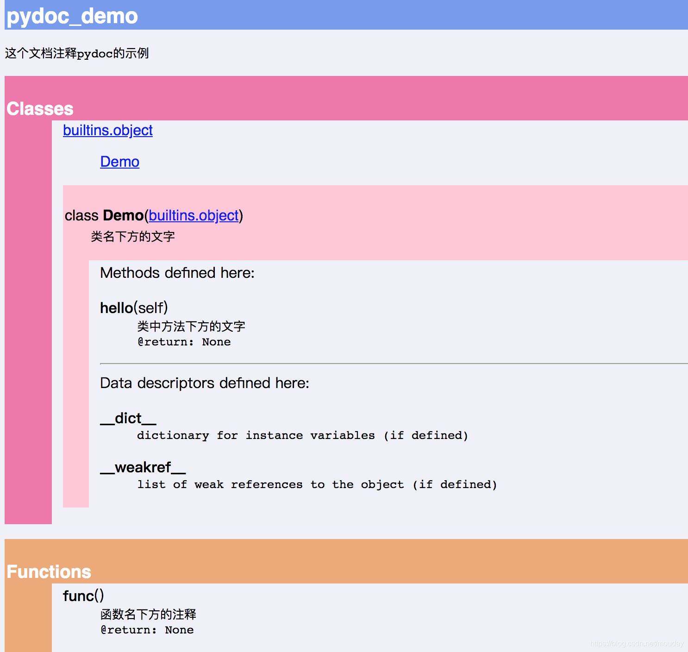

# Python

## Markdown示例

* 1
* 1
  * 2
    * 3
      * 4
        * 5


- [x] 已完成
- [ ] 未完成

**加粗**  `**加粗**`

*斜体*  `*斜体*`

<u>下划线</u> `<u>下划线</u>`

`代码`

==高亮== `==高亮==`

<!--注释-->


## 安装与设置

### Windows下安装Python
* 下载地址：<https://www.python.org/downloads/> 
* 安装注意事项
  * 勾选“Add Python 3.8 to PATH”添加环境变量，否则需要手动添加
  * 勾选“Install launcher for all user"为所有用户安装，否则会安装到用户目录


### Linux编译安装Python

* OSX和Linux操作系统自带Python。
* Linux下很多软件依赖Python2运行，所以可能默认安装。
* 安装新版本Python时应重新编译，避免与操作系统自带版本冲突。
* 软件仓库中可能有Python3版本可以与内置Python2同时安装，但是软件仓库中的Python3版本可能比较落后，无法选择较新的版本。

```bash
# 下载
wget https://www.python.org/ftp/python/3.8.0/Python-3.8.0.tgz

# 解压到当前目录
tar -xf Python-3.8.0.tgz

# 切换到目录
cd Python-3.8.0

# 安装编译依赖
yum install gcc-c++ pcre pcre-devel zlib zlib-devel openssl openssl-devel -y
yum install libffi-devel

# 创建安装目录
mkdir /usr/Python-3.8.0

# 配置
./configure --prefix=/usr/Python-3.8.0

# 编译初始化
make

# 安装
make install

# 软连接
ln -s /usr/Python-3.8.0/bin/python3 /usr/bin/python3
ln -s /usr/Python-3.8.0/bin/pip3 /usr/bin/pip3
```

### 常见Python解释器
* CPython，官方、默认C语言解释器
* IPython，交互式解释器，只是一个CPython外挂，提供额外的交互功能和插件
* PyPy，JIT动态编译解释器，将多次循环的代码编译为机器码
* cython，将Python代码编译为机器码运行
* Jython，Python的Java运行环境解释器
* IronPython，Python的.Net运行环境解释器

### 版本
* windows可以同时安装python2，python3
* windows会自动根据脚本声明判断调用版本，默认调用python3
* 使用启动器py，通过命令`py -2`，`py -3`，`py -3.7`指定使用特定版本
* 使用启动器py，通过命令`py --list`查看当前已安装的版本
* 使用`pip`，`pip3`指定软件安装在哪个版本的Pyhton下
* 使用`sys.version`打印版本
* 使用`sys.version_info`判断版本
* 操作系统环境下使用命令`python --version`获取版本号

### easy_install

* 低版本中默认安装easy_install，pip需要手动安装
* 高版本中默认安装pip，easy_intall需要手动安装

```bash
easy_install <package_name>
easy_install "<package_name>==<version>"
easy_install -U "<package_name>=<version>"
```

#### easy_install 镜像加速
```bash
echo '[easy_install]  
index_url=http://mirrors.aliyun.com/pypi/simple/  
pip:~/.pip/pip.conf' > ~/.pydistutils.cfg  
```

### pip
```shell
# 低版本安装pip
easy_install pip

# 安装最新版本
pip install package

# 限定安装版本
pip install package==version
pip install package>=version
pip install package<=version
pip install package>version
pip install package<version
pip install package>version, package<version

# 通过报错列出所有可安装版本
pip install DBUtils==

# 更换已安装版本，高版本不适配
pip install DBUtils==1.4

# 卸载
pip uninstall package_name

# 显示包信息
pip show package

# 按关键字搜索包
pip search keyword

# 列出所有已安装的包
pip list

# 从requirements.txt文件配置环境
pip install -r requirements.txt

# 生成requirements.txt文件
pip freeze > requirements.txt

# 单次更换镜像源
pip install numpy -i https://pypi.tuna.tsinghua.edu.cn/simple --trusted-host pypi.tuna.tsinghua.edu.cn

pip install --upgrade package_name==version
```

#### setuptools
* setuptools是python模块打包工具，可以生成egg包用于安装或发布到PyPI
* easy_install实际上是setuptools中自带的命令

```sh
sudo python setup.py install
```


#### 修改pip到国内镜像库

* 配置文件修改pip配置
* 路径`~/pip/pip.ini`

```ini
[global]
index-url=http://mirrors.aliyun.com/pypi/simple/

[install]
trusted-host=mirrors.aliyun.com
```

* 命令修改pip配置
```bash
pip config --global list
pip config --global get global.index-url
pip config --user get global.index-url
pip config --global set global.index-url https://mirrors.aliyun.com/pypi/simple/
pip config --global unset install.trusted-host

pip config --user list
pip config --site list
```

### 预编译
* python不支持预编译
* 使用`__debug__`标记，在调用`python -O -OO` 时，`__debug__`为`False`，解释器会忽略`if __debug__`的表达式

### 编译

```sh
import py_compile # 编译文件
import compileall # 编译目录
python -O -m py_compile file.py
```

### virtualenv和venv

* virtualenv和venv用来创建独立的 Python 虚拟环境的工具，可以将每个项目与其他项目独立开来，互不影响，解决了依赖包版本冲突的问题
* venv 不是 virtualenv 发展而来的，而是 Python 3.3 之后标准库内置的一个新模块，用来替代 virtualenv。venv 的设计参考了 virtualenv 的用法，但是简化了一些功能，比如不支持指定 Python 版本和继承父环境的包
* virtualenv支持Python2和Python3，而 venv 只支持 Python 3.3 以上版本
* venv 是 Python 标准库内置的模块，而 virtualenv 需要额外安装

#### virtualenv

```bash
# 安装vitualenv
# yum install python-pip
pip install virtualenv

# 创建虚拟环境
virtualenv -p /usr/local/bin/python3.4 py34env

# 从默认python创建虚拟环境（不复制已经安装的第三方库）
virtualenv --no-site-packages venv

# 激活虚拟环境
source py34env/bin/activate

# 退出虚拟环境
deactivate
```

#### venv

```sh
# 创建虚拟环境
python3 -m venv 项目目录

# 带系统包创建虚拟环境
python3 -m venv --system-site-packages 项目目录

# 激活虚拟环境
source 项目目录/bin/activate

# bat版本
./项目目录/bin/activate.bat
# powershell版本
./项目目录/Activate.ps1

# 进入虚拟环境后，提示符前面会有一个（项目目录）

# 退出虚拟环境
deactivate

# 导出依赖
pip freeze > requirements.txt

# 安装依赖
pip install -r requirements.txt
```

### 脚本标识
```python
#!/usr/bin/env python3    # linux下选择执行python的版本
#!/usr/bin/env python3.5  # linux下选择执行python的版本
# -*- coding: utf-8 -*-   # python2下指定coding编码，-*-仅为了美观
```

### VSCode远程运行、交叉编译
1. 安装Chinese插件
2. 安装remote-ssh插件
3. 配置Host，User即可
4. 输入密码登陆后，可以远程运行、编辑远程文件、远程调试
5. 需要在远端安装Python插件，Pylint插件

## 基础入门

* Python是一种高级语言，C语言更接近机器逻辑，Python更接近人的思维
* Python是解释型语言，执行时不用提前编译，所以执行速度慢，效率低
* Python是著名的“龟叔”Guido van Rossum在1989年圣诞节期间，为了打发无聊的圣诞节而编写的一个编程语言，第一个版本发行于1991年
* Python内建大量库，被称为“batteries included”，减少重复工作
* Python社区还构建Pypi，支持大量第三方库，减少重复开发


### 语言特性
* 大小写敏感，大小视为不同变量  
* 语句以冒号`:`结尾时，所有连续后行缩进四个空格视为一个代码块  
* 缩进统一规范为4个空格符号

### 输入输出
```python
# 输出原型
# print(*objects, sep=' ', end='\n', file=None, flush=False)
# file=None 时输出到 sys.stdout

# 输出示例
print('a')
print('a', 'b') # 每个逗号会输出一个空格
print('a', 'b', sep=';') # a;b （默认为空格）
print('a', 'b', end=';') # a b;（默认为\n，替换后不换行）

# 输入原型
x = input()
x = input("提示信息")

# 暂停屏幕，避免cmd关闭
os.system("pause")
```

### 注释
```python
# 行尾注释

'单行注释（单引号）'
"单行注释（双引号）"

'''
多行注释（三个单引号）
'''

"""
多行注释（三个双引号）
"""

```

### 获取帮助，help(obj)，dir(obj)

* help显示帮助信息
* dir列出对象的属性和方法

### 导出文档、pydoc

* pydoc可以自动提取python程序中的注释
* pydoc内置web server可以展示python所有文档注释

* pydoc可以导出py注释为纯文本
* pydoc可以导出py注释为html

#### pydoc服务器

* 在自建工程目录下启动pydoc就可以看到该工程的文档
* 不在工程目录下会看到python内置模块的文档

```sh
# 启动pydoc服务器
python3 -m pydoc -p 端口号

# 自动选择端口
python3 -m pydoc -p 端口号
```

#### pydoc导出文档

* func或class==下方有多行注释==则展示多行注释，没有多行注释才会展示==上方井号注释==
* func或class==下方使用井号注释不会被提取==
* 模块顶部有多行注释则展示多行注释，没有多行注释才会展示井号注释

```sh
# 导出为纯文本 > 管道
python3 -m pydoc doc.txt

# 导出为html格式 -w
python3 -m pydoc -w pythondir
python3 -m pydoc -w pythonfile
```

#### pydoc导出文档示例

示例代码

```py
# -*- coding: utf-8 -*-

# @Date    : 2018-10-30
# @Author  : Peng Shiyu

"""
这个文档注释pydoc的示例
"""

# 函数名上方的文字
def func():
    """
    函数名下方的注释
    @return: None
    """
    print("hello")


# 类名上方的文字
class Demo():
    """
    类名下方的文字
    """

    # 类中方法上方的文字
    def hello(self):
        """
        类中方法下方的文字
        @return: None
        """
        print("hello")
```

纯文本

```
Help on module pydoc_demo:

NAME
    pydoc_demo - 这个文档注释pydoc的示例

CLASSES
    builtins.object
        Demo
    
    class Demo(builtins.object)
     |  类名下方的文字
     |  
     |  Methods defined here:
     |  
     |  hello(self)
     |      类中方法下方的文字
     |      @return: None
     |  
     |  ----------------------------------------------------------------------
     |  Data descriptors defined here:
     |  
     |  __dict__
     |      dictionary for instance variables (if defined)
     |  
     |  __weakref__
     |      list of weak references to the object (if defined)

FUNCTIONS
    func()
        函数名下方的注释
        @return: None

FILE
   /demo/pydoc_demo.py
```

html



### 传值传址引用

* python传递不可变对象时，传递值
* python传递可变对象时，传递引用
* ==其实，python所有参数都是传递值，只不过python中的不可变对象指向相同地址，改变不可变对象会指向新值的地址，而改变可变对象不会改变对象地址==

### 数据类型

#### 整数

* Python2整数区分int和long，Python3中只有int一种类型

```python
# 整数没有大小限制  

# 十进制数
1
100
-8080 # 负数
0 # 0

# 二进制数 Binary Number
0b111 # 7，二进制以0b为前缀
0B111 # 7

# 八进制数 Octal Number
# python2 中以 0为前缀
# python3 中以 0o为前缀
0o111 # 9，八进制以0o为前缀

# 十六进制数
0xff # 十六进制以0x为前缀

```

#### 浮点数

* 浮点数超过一定范围为inf，无穷大
* inf优点，可以参与浮点数计算，计算时无需特殊处理
* inf缺点，json中没有该类型，存储或暴露接口时需要特殊处理

```python
# 浮点数示例
1.23
3.14
-9.01
1.23e19 # 科学计数法表示1.23x10^9
1.2e-5 # 科学计数法表示1.2x10^-5

# 使用方法
float('inf')
float('-inf')

import math
math.inf
-math.inf
```

#### 字符串

* 使用单引号，或双引号括起来的文本
* 三个单引号或者三个双引号可以输入多行文本 
* 字符串为不可变对象，`'abc'.replace('a', 'A') `替换字符后返回的是新字符串而非修改

```python
'abc'
"abc"

# 三引号可以跨行定义字符串，并且可以省略换行符号 \n
'''
abc
'''
```

##### 转义字符

```python
# 不转译
# 字符引号前带r，意为raw，不转译字符串内容
r' '
r" "
r''' '''

# 反斜杠
\\

# 单引号
\'

# 双引号
\"

# 制表符
\t # table

# 换行
\n # newline
```

##### 编码

* unicode ， 2-4字节定长编码，python字符串统一使用unicode  
* utf-8 ， 变长字节编码 1-6，用于保存与传输  
* ascii ， 英文一字节编码，是utf8的子集  
* GB2312 ， 中文两字节编码  

```python
ord('A') # 65 获取unicode字符的十进制整数表示  
ord('AB') # 错误，只能输入单个字符
ord('中') # 20013
chr('66') #  把十进制编码转换为unicode字符  
'\u4e2d\u6587' # str类型字符串，'中文'unicode字符串表示方法
  
b'str' # bytes类型字节流，每个字符只占一个字节  
   
'str'.encode('ascii') # 将unicode字符串编码为ascii bytes, 中文不能编码为ascii bytes，转换会报错  
'str'.encode('utf-8') # 将unicode字符串编码为utf-8 bytes  
  
b'str'.decode('ascii') # 将bytes按ascii解码为unicode  
b'str'.decode('utf-8') # 将bytes按utf-8解码为unicode  
b'str'.decode(''utf-8', errors='ignore') # 忽略错误解码  
b'\xe4\xb8\xad\xe6\x96\x87'.decode('utf-8') # 中文unicode str
  
len('str') # unicode字符个数，显示字符数  
len(b'str') # bytes流长度，显示字节数  
  
'unicode'.encode('gb2312') #编码为gb2312流  
b'gb2312'.decode('gb2312') #解码gb2312流  

# 兼容python2指定程序文档编码为utf-8  
# -*- coding: utf-8 -*-
```

##### 格式化

```python
'str %s %d' % ('str', 0) # 参数为tuple  
'str %s' % 'str' # 只有一个格式化占位符时，括号可以省略  
%d # 整数  
%f # 浮点数  
%s # 字符串，可以显示任何数据，通用占位符，任何数据类型会显示为字符串  
%x # 十六进制整数  
%% # 转译%字符  
%2d # 用空格补齐整型参数
%02d # 用0补齐整型参数
```

##### 新式格式化输出format

```python
# 'str'.format(args1, args2)，字符串的函数格式化方法  

friends = ['john', 'pat', 'gary', 'michael']
for i, name in enumerate(friends):
    # 'str{关键字参数1},{关键字参数2}'.format(
    # 关键字参数1=x, 关键字参数2=y)
    print ("iteration {iteration} is {name}".format(iteration=i, name=name))

    # 可变（个数）参数
    print("first{0} is second{1}".format(iteration, name)
    
# 显示17.1，格式化输出浮点数，保留1位小数
'{1:.1f}'.format(17.125) 
```

##### 字符串方法

```python
# 反转
str[::-1]

# 对齐
str.rjust(width, fill) # 右填充
str.ljust(width, fill) # 左填充
str.center(width, fill) # 居中填充
str.zfill(width) # 0补齐
str.strip([chars])

str.lstrip([chars])
str.rstrip([chars])

# 查找
str.find(sub, start, end) # -1
str.index(sub, start, end) # 未找到会抛出ValueError
newstr = str.replace(old, new)
str.endswith(suffix, start, end)
str.startswith(suffix, start, end)

str.rfind()
str.lfind()
str.rindex()
str.lindex()

# 拼接
str.join(iterable) # ''.join(),' '.join(), ','.join()
str.split(sep=None) # 默认空格分割
# sep=None: 连续的空格会被视为单个分隔符，其结果将不包含开头或末尾的空字符串
# sep=' ': 连续的空格会被视为多个个分隔符

# 字符串常量
import string
string.ascii_letters # ascii_lowercase + ascii_uppercase
string.ascii_lowercase # a_z
string.ascii_uppercase # A_Z
string.digits # 0_9
string.hexdigits # 0_F
string.octdigits # 0_7
string.punctuation # 标点符号
string.whitespace # 空格、指标、回车、换行、进纸、纵向制表符
string.printable # digits + ascii_letters + punctuation + whitespace

# 字符串判断
str.isalnum() # alpha + num
str.isalpha() # 字母

str.isdecimal() # 数字
str.isdigit() # 数字
str.isnumeric() # 数字

str.islower() # 全小写，可以带空格，标点符号
str.isupper() # 全大写，可以带空格，标点符号
str.istitle() # 首字母大写，可以带空格，标点符号
str.isspace() # 空白

# 大小写转换
str.upper() # 全部转大写
str.lower() # 全部转小写
str.capitalize() # 首字母大写
str.title() # 每个单词首字母大写
```

#### 布尔值

* 布尔值包括是否`True`和`False`，首字母必须大写
* 布尔值可以进行逻辑运算，包括与、或、非`and`,`or`,`not`

#### 空值，None

* Python中空值含义为：什么都不是，不等于0

#### 复数

```python
v = 1 + 5j
type(v) # <class 'complex'>
```

### 变量

* 变量命名

  * 变量名必须是大小写英文（Unicode字符也合法）、数字和下划线的组合，且不能用数字开头
  * 变量名是大小写敏感的
  * 不能使用关键字和保留字当变量名，如def等
* 变量特性

  * 等号左侧自动创建变量  
  * python传递不可变对象时，传递值

  * python传递可变对象时，传递引用

  * Python是动态语言，变量类型可以动态改变不会报错
* PEP8命名规范

  * 变量使用小写单词，下划线连接
  * 一个下划线开头为保护变量
  * 两个下划线开头为私有变量
  * 两个下划线开头和结尾为系统保留变量


```python
a = 1 # 定义变量a
t_007 = 'T007' # 定义变量t_007
Answer = True # 定义变量Answer

a = 1 # 动态语言变量没有类型
a = 'abc' # 改变变量a的类型不会报错

# 查看关键字
import keyword
print(keyword.kwlist)

# 删除变量
del a
```

### 常量

* Python中无法定义常量，无法保证常量不能被改变  
* 常量习惯上所有字母都大写

###  类型转换

#### int 转 byte

```python
# int.to_bytes(self, /, length, byteorder, *, signed=False)

int(1).to_bytes(length=2)
int(1).to_bytes(length=2, byteorder='big', signed=True)
```

#### byte 转 int

```python
int(b'1') # 1
int('1') # 1
int(1) # 1
```

#### float 转 int

```python
# 直接截取整数部分
int(123) # 123
int(123.123) # 123
int(123.987) # 123
int(-123.123) # -123
int(-123.987) # -123
```

#### 取小数部分

```python
math.modf(1) # (0.0, 1.0)
```

#### 专题：round 在 python2  python3 中的区别

```python
# round - python2
# 四舍五入
round(4) # 4.0
round(-4) # -4.0

# round - python3
# 四舍六入五均分，小数点前一位是奇数则进1，小数点前是偶数则舍去
round(1) # 1
round(1.5) # 2
round(2.5) # 2
round(-1.5) # 2
round(-2.5) # 2
```

### 运算符

* 运算符按优先级排序

| 运算符 | 描述 |
| ----- | ---- |
| `[]` `[:]`        | 下标，切片       |
| `**`              | 指数            |
| `~` `+` `-`       | 按位取反, 正负号  |
| `*` `/` `%` `//`  | 乘，除，模，整除  |
| `+` `-`           | 加，减          |
| `>>` `<<`         | 右移，左移       |
| `&`               | 按位与          |
| `^` `|`           | 按位异或，按位或  |
| `<=` `<` `>` `>=` | 小于等于，小于，大于，大于等于 |
| `==` `!=`        | 等于，不等于                 |
| `is` `is not`    | 身份运算符                  |
| `in` `not in`    | 成员运算符                  |
| `not` `or` `and` | 逻辑运算符                  |
| `=` `+=` `-=` `*=` `/=` `%=` `//=` `**=` `&=` `|=` `^=` `>>=` `<<=` | 赋值运算符|

#### 逻辑运算 

```python
# 比较运算会产生布尔值结果
3 > 2 # 值为True
3 > 5 # 值为False

True and True # 值为True
True and False # 值为False
False and False # 值为False

True or True # 值为True
True or False # 值为True
False or False # 值为False

not True # 值为False
not False # 值为True

1 and 2 # 2
0 or 1  # 1，0为非真值，所以取后值
1 or 2  # 1，1为真值，所以取真值
not 2   # False
1 and 2 or 3 # 2
```

#### 位运算

```python
& # 位与
| # 位或
^ # 异或
~ # 按位取反
<< # 左移n位
>> # 右移n位
```

#### 除运算

```python
9/3 = 3.0 # python3中除法为精确除，结果为浮点数
          # 9/3 = 3 python2中为整除
9//3 = 3 # 整除，地板除（取整）
```

#### 取余运算符

* python负数取余结果与C Java JS不同

```python
N % m = r
10%3 = 1 # 余数

# python取余算法
r = N - floor(N / m) * m

# 负数取余示例（0 - 6）表示周一到周日
0 % 7 = 0
(6 + 1) % 7 = 0 # 周日的下一天是周一
(0 - 1) % 7 = 6 # 周一的前一天是周日

# 比较C Java取余算法
r = N - int(N / m) * m

# 如果得到负数，还需要做判断
'result < 0 ? result + 7 : result;'

(0 - 1) % 7 = -1
'由于-1 < 0，-1 + 7 = 6，所以周一的前一天是周天'
```

#### python三目运算符

```result_true if condition else result_false```

### 内置数据类型
#### 数组，list
* list是一种有序集合
* list可以动态删除或添加  
```python
# 定义一个空list
l = []

# 定义并初始化一个list
l = ['a','b','c']

# 定义一个空list，list以一个list为初始化参数
l = list([])

# 获取list的长度
len(l)

# 空list长度为0
len([])

# 空list布尔值为False
bool([])

# 越界保护最后一个Index是 len(list)-1
l[0]==l[-3] # True
l[1]==l[-2] # True
l[2]==l[-1] # True
l[3]==l[-4] # throw IndexError 数组越界会产生IndexErrror异常  

# 添加元素到末尾
list.append('')

# 插入元素到位置index
list.insert(index, '')

# 续接另一个list，dict不能重复所以为update
list.extend(list)

# 查找元素index，不存在则raise ValueError
list.index('item')

# 统计元素个数
list.count('item')

# 按值删除元素
list.remove(item)

# 清空列表
list.clear()

# 删除末尾（默认index=-1）
list.pop()

# 删除index位置的元素
list.pop(index)

# 排序
list.sort(key=None，reverse=False)

# 逆序
list.reverse()
```

* 链表合并

```python
l1 = [1]
l2 = [2]

# 运算符合并
l1 += l2

# 拆包运算符合并
[*l1, *l2]

# set去重合并
list(set(l1+l2))

# list.extend合并
l1.extend(l2)
```

#### 元祖，tuple
* tuple初始化之后不能修改
* tuple元素变量可以修改，变量名称不变
* 能用tuple就不用list，可以减少程序错误
```python
# 定义一个空tuple
t = ()

# 定义两个元素的tuple
t = (a,b)

# 定义单元素tuple，加逗号避免解释歧义括号被忽略
t = (a,)
# 错误定义，1两边括号将被视为优先级运算符
t = (1)

a = list()
b = list()
t = (a,b) # a，b变量名称不变，但是a，b内容可变

t = tuple([]) # 定义一个空tuple，tuple接受一个list为参数

# 字典相加等于新字典
a = (1,)
b = (2,)
c = a + b # (1, 2)
```

#### 字典，dict
* 字典类型全称dictionary，等同于其他语言的map
* dict使用键-值（key-value）方式存储，内部使用Hash查找，速度快
* Hash值的key不能为可变对象

```python
# 定义一个空dict
d = {}

# 定义并初始化dict
d = {'key1':value1, 'key2':value2}
d = dict([('t1', 1), ('t2', 2), ('t3', 3)])
d = dict(t1=1, t2=2, t3=3)

# 使用key引用数值
dict['key1']

# key存在时修改，key不存在时插入
dict['key1'] = newvalue

# key不存在时会报错
dict['unknown']

# key不存在
dict.get('key') # 默认不存在返回None
dict.get('key', -1) # 不存在则返回-1

# 判断是否存在，返回True或False
'key2' in dict
'key1' not in dict

# 获取key list
list(dict)

# 获取key迭代器
iter(dict)

# 获取逆序key迭代器
reversed(dict)

# 获取键迭代器
dict.keys()

# 获取值迭代器
dict.values()

# 获取键值tuple迭代器
dict.items()

# 删除，不存在则报错
dict.pop('key')
del d[key]

# 删除，不存在则返回None
dict.pop('key', 'None')

# 清空字典
dict.clear()

# 合并字典
dict.update(dict)
```

#### 集合，set
##### 概念
* set等同于数学概念set，无序，无重复元素  
* set会去掉重复元素  
* set中不能放入可变元素如list，tuple可以   
##### 创建
```python
# 需要提供一个list或tuple作为输入
s = set([1,2,3])
s = ({1, 2, 3})

s # {1, 2, 3} # 默认打印会使用花括号显示

# 字符串初始化会拆分成字符
s = set("abc")
s # {'a', 'b', 'c'}
```

##### 修改
```python
# 添加元素
# 可以重复添加，但是不改变set
set.add(newkey)

# 删除元素
# 不存在则raise KeyError
set.remove(oldkey)

# 删除元素
set.pop()

# 删除元素
# 不存在不抛出异常
set.discard(elem)

# 合并其他set、list、tuple、str
# key不能重复所以是update，list为extend
set.update(*others)

# 清空
set.clear()
```

#####  运算，差，交集，并集，与非
```python
set3 = set1 & set2 # 求交集
set4 = set1 | set2 # 求并集，结果是一个新set
set5 = set1 - set2 # 差集
set6 = set1 ^ set2 # 在a，b中不同时存在（与非）

set1 <= set2 # 子集
set1 < set2 # 真子集
set1 >= set2
set1 > set2

x in set1 # 是否成员
x not in set1 
```

##### 对象使用set专题
* set是按对象地址去重的，不是按值去重的，按值去重要实现 `__eq__` 用于比较
* 实现 `__hash__` 用于字典哈希（set实际上是dict的key部分）
```python
class A:
    def __init__(self):
        self.a = None

    def __eq__(self, x):
        '''
        set是按对象地址去重的，不是按值去重的，按值去重要实现 __eq__ 用于比较
        '''
        return self.a == x.a
        
    def __hash__(self):
        '''
        实现 __hash__ 用于字典哈希（set实际上是dict的key部分）
        '''
        return hash(self.a)

class B:
    def __init__(self):
        self.b = None

a1 = A()
a2 = A()
a1.a = 1
a2.a = 1

b1 = B()
b2 = B()
b1.b = 1
b2.b = 1

print({a1, a2}) # {<__main__.A object at 0x00000178410F6AF0>}
print({b1, b2}) # {<__main__.B object at 0x0000017841553700>, <__main__.B object at 0x00000178415537C0>}
```

### 条件判断

* python没有switch case语句
* 以变量作为条件，当x是非零、非空字符串、非空list等，条件为真True，否则为False

```python
# if
if 条件:
    语句块

# if else
if 条件:
    语句块1
else:
    语句块2

# if elif
# elif 是 else if 的缩写
if 条件1:
    语句块1
elif 条件2: 
    语句块2
else if 条件3:
    语句块3
else:
    语句块4

```

### 循环/迭代

#### for in 循环
```python
# 循环Iterable对象
for x in list/tuple/range:
    expression
else:  # Executed because no break in for 
    # 循环结束时才执行，可以使用for的迭代器
    # 没有break时才执行
    expression

# 为循环添加索引index    
for i, name in enumerate(friends):
    expression

# 0次循环也会进入else分支，但是此事i还未声明，不可以使用
for i in range(0):
    pass
else:
    print(f'1 {i}') # Exception i 还未被定义
```

#### range生成器
```python
list(range(2)) # 值为[0,1]
range(3, 1, -1) # [3, 2]
```

#### while循环
```python
while condition1:
    expression1

else: # Executed because no break in for
    # 条件为False时才执行
    # 没有break时才执行
    expression
```

#### bread语句，continue语句

* 使用continue跳过本次循环

* 使用break跳出本层循环

#### 遍历dict

```python
for key in dict:
    pass
for key in dict.keys():
    pass

for value in dict.values():
    pass
for key, value in dict.items():
    pass
```

#### 遍历字符串
```python
for char in str:
    pass
```

#### 判断对象是否可迭代
```python
isinstance(object, Iterable)
```

#### 用enumerate将 迭代 转换成 (index，value)形式的tuple
```python
for key,value in enumerate(list/str/tuple/set/...):
```

## 函数

### 调用函数

#### 内置函数
```python
# 执行语句（python代码）
exec('cmd')

# 求表达式的值（python表达式）
eval('expression')

# 数学函数
abs(x) # 求绝对值，复数complex返回大小
round(x) # 四舍五入
max(1,2,3...n) # 取最大值
max(list) # 取list中最大值
min(iterator) # 取最小值
pow(2, 3) # 2 ** 3

# 逻辑
all(iterable) # 全True则返回True，否则返回False
any(iterable) # 有一个True则返回True，否则返回False

# 迭代器
iter()
next()
enumerate() # 生成索引
reversed() # 反转顺序，可用于遍历
sorted() # 排序，可用于遍历

callable(object) # 判断是否是可调用类，__call__()
setattr() # 设置属性
delattr(object, name) = del object.name # 删除属性

dir(object) # 列出所有属性
dir() # 列出当前环境所有属性

# 数值，字符转换
oct(char) # 字符->数值
chr(int) # 数值->字符

# 数值进制转换
bin(x) # 返回整数的二进制字符串'0b000000'
oct(10) # 八进制
hex(int) # 整型转十六进制字符串

# 数据类型转换
int(str) # 字符串转数字
int(float) # 浮点数取整
int(str, 2) # 二进制字符串转int
int(str, 8)
int(str, 16)

float(str) # 字符串转浮点数
bool(1) # True
bool('') # False

str(object) # 转字符串
repr(object) # 转机器字符串，repr()返回的非ascii字符使用\x\u\U转译
ascii(object) # 返回对象的ascii表示字符串
```

#### zip函数专题

* 每个Iterable取一个，知道最短的耗尽

```python
a = [1, 2, 3]
b = [4, 5, 6]
c = [7, 8, 9]

# 合成
z = zip(a, b, c)    
print(z)            # <zip object>
l = list(z)         
print(l)            # [(1, 2, 3), (4, 5, 6), (7, 8, 9)]
d = dict(zip(a, b)) 
print(d)            # {1:4, 2:5, 3:5}

# 合成
t = ((1, 4, 7), (2, 5, 8), (3, 6, 9))
o, p, q = zip(*t)
print(o)            
print(p)
print(q)

# 合并列表相邻项
a = [1, 2, 3, 4, 5, 6]
l = list(zip(a[::2], a[1::2]))
print(l)           # [(1, 2), (3, 4), (5, 6)]


l = [
    [1, 2],
    [3, 4]
]

# 矩阵左旋
l_new = list(zip(*l))[::-1]
print(l_new)       # [
                   # [2, 4],
                   # [1, 3]
                   #      ]

# 矩阵右旋
l_new = list(zip(*reversed(l)))
print(l_new)      # [
                  # [3, 1],
                  # [4, 2]
                  # ]
```

#### math模块

```python
# 导入模块
import math

# 上取整
math.ceil(x)

# 下取整
math.floor(x)

# e的n次幂
math.exp(x)

# 以math.e为底
math.log(x)

# 自定义以n为底
math.log(x, n)

# 以2为底
math.log2(x)

# 以10为底
math.log10(x)

# 根号
math.sqrt(x)

# 数学常量
math.pi
math.e
```

#### random模块

* 理解random.seed(int)
  * seed相同，会产生相同的随机数
  * 上一个随机会作为seed，产生下一个随机数
  * 不使用seed，每次程序运行，会产生相同随机数

```python
# 导入模块
import random

# 随机0-1整数，[0,1)
random.random()

# 随机整数，[start, stop]
random.randint(start, stop)

# 随机范围整数，[start, stop)
random.randrange(stop)
random.randrange(start, stop)
random.randrange(start, stop, step)

# 随机小数，[x, y]
random.uniform(x, y) 

# 随机在序列或集合中选择一项
random.choice([1, 2, 3])

# 打乱序列
random.shuffle(list)
```

#### 函数帮助
```python
help(函数名称) # 返回函数用法和参数需求
```

#### 函数名称实质是一个变量
```python
a = abs
a(-1) # 使用变量a调用函数
```

### 定义函数

#### 定义空函数
```python
def fucname():
    pass # 使用pass空语句避免报错
```

#### 返回值
* 只能返回单个值  
* 没有返回值时，函数执行完毕返回None  
* 函数内执行到return语句则执行完毕

```python
# 不写return语句也返回None
return

# 返回None
return None

# 返回单个值
return a

# 多个返回值（本质仍然是单一值tuple）
return (a, b, c)

# 语法上省略括号，实质仍然是返回tuple
return a, b, c # 返回tuple(a,b,c)
```

```python
# 获取多个返回值
x, y, z = foo() # 获取返回值
```


### 函数的参数

* 定义函数的时候，我们把参数的名字和位置确定下来，函数的接口定义就完成了。对于函数的调用者来说，只需要知道如何传递正确的参数，以及函数将返回什么样的值就够了，函数内部的复杂逻辑被封装起来，调用者无需了解。
* Python的函数定义非常简单，但灵活度却非常大。除了正常定义的必选参数外，还可以使用默认参数、可变参数和关键字参数，使得函数定义出来的接口，不但能处理复杂的参数，还可以简化调用者的代码。

#### 位置参数
* 调用时，按照顺序依次传入函数
```python

def power(x):
    return x*x

power(5)


def power(x, n)
    s = 1
    while n > 0:
        n = n - 1
        s = s * x
    return s
    
power(5, 3)
```

#### 默认参数
* 可以给参数设置默认值，降低函数的使用难度，同时不失去函数的抽象功能  
* 必选参数必须在前，默认参数在后  
* 当函数有多个参数时，把变化大的参数放前面，变化小的参数放后面，变化越小的参数越适合设置默认值
```python
def fuc(a, b=3, c=4):
    pass

fuc(1) # 只提供一个参数  
fuc(1, 2) # 提供两个参数，第三个参数使用默认值  
fuc(2, c=5) # 提供两个参数，跨默认值传参  
```

#### 默认参数避免使用可变值  
防止参数默认值可变错误   
def fuc(l=[]) ， list 会累积，导致多次调用返回结果改变  
参数默认值可变会导致多线程冲突  

#### 可变参数（传入不定个数参数）
```python
# 定义
def fuc(*input):
    pass

# 使用方法
fuc(1,2,3,4)
fuc(*[1,2,3,4]) #对list，tuple取*可以变为多个参数
```

#### 关键字参数（任意关键字）
```python
def fuc(**kw):
    pass

def fuc(arg1, arg2, **kw)
    pass

# kw = {"key":value, "key":value}
fuc(**kw) #对dict取**可以变为关键字参数

# 使用前需要对关键字是否存在进行检查
def person(name, age, **kw):
    if 'city' in kw:
        pass
    if 'job' in kw:
        pass
```

#### 命名关键字参数
* 可以限制传入的参数名，避免任意关键字参数的检查
* 可以为命名关键字参数设置默认值，调用时可以省略传入
```python
# *参数后为命名关键字参数
def fuc1(*, key1, key2): # 只允许名字为key1， key2的关键字参数
    pass

def fuc2(arg1, *, key1, key2):
    pass

# 前面有一个可变参数，就不用加入*参数了
def fuc3(arg1, *arg2, key1, key2): 
    pass

# 调用命名关键字参数时，必须使用参数名传参
# 区别于跨默认值传参时，使用参数名传入默认参数
fuc3(arg1, key1=x, key2=y)
```

#### 参数组合顺序
必选参数->默认参数->可变参数/命名关键字参数->关键字参数


#### 尾递归优化避免栈溢出
* 递归函数的优点是逻辑清晰，实现符合人思维方式
* 理论上所有递归函数都可以用循环实现
* 尾递归在函数返回的时候，调用函数自身，但是return语句中不能包含表达式
* 尾递归可以让编译器识别（python不支持），帮助实现递归优化，无论执行多少次只占用一个栈

```python
# 阶乘 n!=1x2x3.....xn

# 递归写法
# 由于返回值中含有变量无法立即计算，必须先暂存进调用栈，知道n为1时开始计算
def fact(n):
    if n == 1:
        return 1
    return n * fact(n - 1)
    
# 尾递归优化
# num - 1 和 num*product在调用前就会被计算
def fact(n):
    return fact_iter(n, 1)

def fact_iter(num, product):
    if num == 1:
        return product
    return fact_iter(num - 1, num*product)
```

#### 修改递归最大深度
```python
sys.setrecursionlimit(100000)
```

### 函数重载

* 重载定义：
    * 静态语言编译时，函数参数个数、类型不同编译为不同函数，是为重载。函数名称只在编译前使用。
    * python不支持重载，python调用函数，只寻找相同函数名称，不判断参数个数，不识别参数类型。
* 解决方法：
    * 重载1：根据函数参数个数不同，可以通过设置参数默认值实现逻辑。
    * 重载2：根据函数参数类型不同，可以通过判断参数类型实现逻辑。


## Python高级特性

### 切片

```python
list[0:3] # 取[0, 3) 即0, 1, 2
list[:3] # 取[0, 3)
list[1:3]
list[0:-1] # 取0到倒数第二个字符

del l[0]
del l[2:4]
del l[:]

# 倒数切片只能省略末尾值，0为正数值
list[-2:] # 取[-2, 0) 即-2, -1
list[-2:-1] # -2，不包含-1值，也不能写0

list[start:end:2] #每两个取一个
list[::5] #每五个取一个
list[:] #复制一个list

tuple[::] #tuple也可以用切片操作，切片后返回新tuple
str[::] #str也可以切片，切片后返回新str
```

#### 切片回写（可以写回入参）
```python
l[:] = new_l
```

### 迭代

```python
# dict默认迭代key
for key in dict:
    pass

# dict迭代value
for value in dict.values():
    pass

# dict迭代key, value
for k, v in dict.items():
    pass

# 迭代list
for item in list:
    pass

# 迭代str
for word in str:
    pass

# 判断是否为可迭代对象
from collections.abc import Iterable:
isinstance(str, Iterable)
isinstance(list, Iterable)
isinstance(999, Iterable) # 整数不可迭代

# 迭代下标index，可使用enumerate函数将list变成index-value对
for index, value in enumerate(list):
    pass
    
# 迭代tuple
for x, y in [(1,1), (2,2), (3,3)]:
    pass
```

### 列表生成式，列表推导式 List Comprehensions

```python
[x*x for x in range(1, 11)] -> [1, 4, 9, 16, 25, 36, 49, 64, 81, 100]
```

#### 最常用自然数列表生成式
* range返回生成器，需要list显示化生成器
```python
list(range(1, 100))  # [x for x in range(1, 100)]
```

#### 带筛选的列表生成式，这个if是筛选条件不能加else
```python
[x*x for x in range(1, 11) if x % 2 == 0] -> [4, 16, 36, 64, 100]
```

#### 双层列表生成式（全排列）
```python
[m + n for m in 'ab' for n in 'xy']
```

#### 获取当前位置文件列表
```python
[d for d in os.listdir('.')]
```

#### 双变量列表生成式
```python
[key + ':' +value for key, value in dict.items()]
```

#### 列表生成式迭代执行函数
```python
[str.lower() for str in strlist]
```

#### 列表生成式中用于筛选、过滤的if不带else
```python
[x for x in range(1, 11) if x%2 == 0] # [2, 4, 6, 8, 10]
```

#### 列表生成式中用于表达式的if必须带else，不然不是完整语句
```python
[x if x % 2 == 0 else -x for x in range(1,11)]
```

### 集合推导式
```python
{x for x in range(5)}
```

### 字典推导式
```python
{x:x for x in range(5)}
```

### 生成器

* 一边循环一边计算的机制称为生成器，generator
* 调用生成器仅返回一个generator对象，并不执行或返回任何值
* 生成器通过next()函数获取下一个返回值，没有更多元素时抛出StopIteration错误
* 使用for循环不会抛出StopIteration
* for循环无法取到生成器return的返回值，只能通过StopIteration.Value取值

#### 列表生成式表达式变生成器
```python
generator=(x*x for x in range(10))
for n in generator:
    print(n)

generator.next()
```

#### 用yield函数变生成器
```python
def func():
    for x in range(10):
        print(x*x)
def gene():
    for x in range(10):
        yield x*x #遇到yield就中断

for x in gene:
    expression

gene.next()
```

### 迭代器

* 凡是可作用于for循环的对象都是Iterable类型  
* 凡是可作用于next()函数的对象都是Iterator类型，它们表示一个惰性计算的序列  
* 集合数据类型如list、dict、str, tuple, set等是Iterable但不是Iterator，不过可以通过iter()函数获得一个Iterator对象    
```python
# 迭代器
iter(list)
next(it)

# 示例
it = iter(list)
while True:
    try:
        x = next(it) 
    except StopIteration: # 没有元素时next抛出StopIteration
        break

# 类
class IterClass:
    def __iter__(self):
        self.a = 1
        return self

    def __next__(self):
        if self.a < 20:
            x = self.a
            self.a += 1
            return x
        else:
            raise StopIteration

from collections.abc import Iterable
isinstance([], Iterable) # True
isinstance({}, Iterable) # True
isinstance('abc', Iterable) # True
isinstance((x forx in range(10), Iterable) # True
isinstance(100, Iterable) # False

from collections.abc import Iterator
isinstance((x for x in range(10), Iterator) # True
isinstance([], Iterator) # False
isinstance({}, Iterator) # False
isinstance('abc', Iterator) # False

# iter函数
isinstance(iter([]), Iterator) # True
isinstance(iter('abc'), Iterator) # True


```

## 函数式编程 Functional Programming

* 把复杂任务分解成简单的任务，这种设计方式叫做面向过程的程序设计。
* 函数是面向过程程序设计的基本单元。
* 纯函数式编程不允许使用变量，所以python不是纯函数式编程语言  
* python中函数名既是一个变量，变量可以指向函数

### 高阶函数 Higher-order function（将函数作为变量）

```python
def newfuc(functionname):
    return functionname(0)
```

#### map()
map函数接收两个参数，一个是函数，一个是Iterable
```python
map(function, Iterable)
r = map(abs, range(-10,0)) 

# map计算结果是一个Iterator惰性序列，需要使用list()列表化时才会计算结果
list(r)
```

#### reduce()
* reduce接收两个参数，第一个参数是一个函数，第二个参数是一个序列
* reduce把参数1的函数作用在参数2序列上，参数1函数必须接收两个参数
* reduce把参数2中的两个元素进行计算，将结果和下一个元素传入参数1函数继续进行计算
* reduce(f, [x1, x2, x3, x4]) = f(f(f(x1, x2), x3), x4)
* reduce(fuction, sequence[, initial]) reduce可以接受一个序列初始值
```python
# 利用reduce求和
from functools import reduce
def add(x, y):
    return x + y
reduce(add, range(1,10,2))


# 利用map，reduce把str转换为int
def fn(x, y):
    return x*10 + y

digits = {str(x):x for x in range(0, 10)}
def char2num(s):
    return digits[s]

reduce(fn, map(char2num, '13579')
```


#### filter(function, Iterable)
* 根据function返回True，False筛选Iterable
* filter的返回值是一个Iterator
```python
# 筛选奇数
def is_odd(n):
    return n % 2 == 1
list(filter(is_odd, range(10)))

# 筛选空字符串
def not_empty(s):
    return s and s.strip()
list(filter(not_empty, ['A', '', 'B', None, 'C', '  ')))

# 筛选回数，如22 33 191 2332
def is_palindrome(n):
    return  str(n)==str(n)[::-1]
list(filter(is_palindrome, range(1, 1000)))
```

#### sorted(list)
sorted(list, key=function) ， 使用key函数处理后再比较大小
sorted(list, reverse=Ture) ， 逆向排序
```python
# 字符串排序
sorted([]) # 默认大写在前，小写在后
sorted([], key=str.lower) # 忽略大小写排序
sorted([], key=str.lower, reverse=True) # 忽略大小写逆向排序
```

#### 高级排序，sorted
```python
from operator import itemgetter, attrgetter, methodcaller

sorted(list, key=itemgetter(2)) # 第三个元素
sorted(list, key=attrgetter('age') # 属性
sorted(list, key=methodcaller('method')) # 方法

```

### 标准操作符函数operator模块

* operator库是所有操作符的函数形式

```python
# operator.attrgetter

# operator.itemgetter
l = [a, b, c]
func = itemgetter(2)
func(l) # c
func = itemgetter(0, 1, 2)
func(l) # (a, b, c)

# operator.methodcaller

```

#### operator操作符函数对照表：

| Operation | Syntax | Function |
| --------- | ------ | -------- |
| Addition  | `a + b` | `add(a, b)` |
| Concatenation | `seq1 + seq2` | `concat(seq1, seq2)` |
| Containment Test | `obj in seq` | `contains(seq, obj)`  |
| Division | `a / b` | `truediv(a, b)` |
| Division | `a // b` | `floordiv(a, b)` |
| Bitwise And | `a & b` | `and_(a, b)` |
| Bitwise Exclusive Or  | `a ^ b`             | `xor(a, b)`                         |
| Bitwise Inversion     | `~ a`               | `invert(a)`                         |
| Bitwise Or            | `a | b`             | `or_(a, b)`                         |
| Exponentiation        | `a ** b`            | `pow(a, b)`                         |
| Identity              | `a is b`            | `is_(a, b)`                         |
| Identity              | `a is not b`        | `is_not(a, b)`                      |
| Indexed Assignment    | `obj[k] = v`        | `setitem(obj, k, v)`                |
| Indexed Deletion      | `del obj[k]`        | `delitem(obj, k)`                   |
| Indexing              | `obj[k]`            | `getitem(obj, k)`                   |
| Left Shift            | `a << b`            | `lshift(a, b)`                      |
| Modulo                | `a % b`             | `mod(a, b)`                         |
| Multiplication        | `a * b`             | `mul(a, b)`                         |
| Matrix Multiplication | `a @ b`             | `matmul(a, b)`                      |
| Negation (Arithmetic) | `- a`               | `neg(a)`                            |
| Negation (Logical)    | `not a`             | `not_(a)`                           |
| Positive              | `+ a`               | `pos(a)`                            |
| Right Shift           | `a >> b`            | `rshift(a, b)`                      |
| Slice Assignment      | `seq[i:j] = values` | `setitem(seq, slice(i, j), values)` |
| Slice Deletion        | `del seq[i:j]`      | `delitem(seq, slice(i, j))`         |
| Slicing               | `seq[i:j]`          | `getitem(seq, slice(i, j))`         |
| String Formatting     | `s % obj`           | `mod(s, obj)`                       |
| Subtraction           | `a - b`             | `sub(a, b)`                         |
| Truth Test            | `obj`               | `truth(obj)`                        |
| Ordering              | `a < b`             | `lt(a, b)`                          |
| Ordering              | `a <= b`            | `le(a, b)`                          |
| Equality              | `a == b`            | `eq(a, b)`                          |
| Difference            | `a != b`            | `ne(a, b)`                          |
| Ordering              | `a >= b`            | `ge(a, b)`                          |
| Ordering              | `a > b`             | `gt(a, b)`                          |
|                       |                     |                                     |
|                       | `a += b`            | `iadd(a, b)`                        |
|                       | `a &= b`            | `iand(a, b)`                        |
|                       | `a += b`            | `iconcat(a, b)`                     |
|                       | `a //= b`           | `ifloordiv(a, b)`                   |
|                       | `a <<= b`           | `ilshift(a, b)`                     |
|                       | `a %= b`            | `imod(a, b)`                        |
|                       | `a *= b`            | `imul(a, b)`                        |
|                       | `a @= b`            | `imatmul(a, b)`                     |
|                       | `a |= b`            | `ior(a, b)`                         |
|                       | `a **= b`           | `ipow(a, b)`                        |
|                       | `a >>= b`           | `irshift(a, b)`                     |
|                       | `a -= b`            | `isub(a, b)`                        |
|                       | `a /= b`            | `itruediv(a, b)`                    |
|                       | `a ^= b`            | `ixor(a, b)`                        |

### 函数作为返回值

两次返回的函数不相等
```python
# 正常求和函数
def calc_sum(*args):
    ax = 0
    for n in args:
        ax = ax + n
    return ax

# 函数作为返回值
def lazy_sum(*args):
    def sum():
        ax = 0
        for n in args:
            ax = ax + n
        return ax
    return sum

# 执行后只返回一个函数，不执行结果
f = lazy_sum(1,2,3,4,5)

# 将返回值作为函数执行后才返回结果
f()

# 两次执行返回的函数并不相同，值不一定相同（与实现相关）
f1 = lazy_sum(1,2,3,4,5)
f2 = lazy_sum(1,2,3,4,5)
f1 == f2 # False
```

### 闭包

* 返回函数不要引用任何可能会变化的变量，因为函数先返回后计算，函数计算时循环变量已经是最大值  
```python
def createCounter():
    c = 0
    def counter():
        nonlocal c
        c = c+1
        return c
    return counter
    
counter = createCounter()
counter() # 1
counter() # 2
counter() # 3
```

#### 闭包中的自由变量
* 闭包使用了外层函数的变量，外层函数的局部变量作用域被延伸，变成了自由变量
* 子函数被执行时就会更新自由变量，而不会因不存在而报错
* python3中新增了nonlocal关键字，就可以改变父层变量，python2中只能使用global全局变量
```python
?
```

#### nonlocal
* nonlocal是 Python3 新增的作用域关键词
* Python对闭包的支持一直不是很完美，在 Python2 中，闭包函数可以读取到父级函数的变量，但是无法修改变量的值，为此，我们经常要把变量声明为global全局变量，但是这样就打破了闭包的性质。为了解决这个问题，Python3 引入了nonlocal，如上例代码，我们使用声明了nonlocal n之后，就可以正常操作。

* 示例：
```python
?
```

#### global
* 全局变量、外层变量，可以在内层使用，但是不能修改。
* 使用前声明 global var, nonlocal var.

```python
# 全局变量只要在调用前定义就可以
def func():
    print(s) # 只使用不修改的情况，可以不声明global
             # 如果要修改的话，必须声明global
             # ，否则，虽然不报错，但是修改的是局部变量
s = 'Hi'
func()

# 但是在函数内定义的变量会覆盖全局变量
def func():
    s = 'Hello' # 这里的s是新的局部变量，而不是修改全局变量
    print(s)
s = 'Hi'
func()

# 这种情况会报错，因为认为s是一个局部变量，这里先使用后定义了
def func():
    print(s)
    s = 'Hello'
s = 'Hi'
func()

# 声明了global之后，才认为是一个全局变量
def func():
    global s
    print(s)
    s = 'Hello'
s = 'Hi'
func()
```


### 匿名函数
```python
lambda var: expression
lambda var1, var2, expression
```

```python
# lambda x: x * x
def f(x):
    return x*x
```

### 装饰器
* 不修改函数的定义，在代码运行期间动态增加功能的方式，称之为“装饰器”（Decorator）

#### 装饰器工具
```python
# 函数的__name__属性
def now():
    print('2020-1-1')
f = now
now.__name__ # 'now'
f.__name__ # 'now'

# 装饰器工具帮助装饰器统一修改名称
# wrapper.__name__ = func.__name__
```

#### 无参数装饰器
```python
import functools # 修改函数名称
def log(func): # 函数名作为入参
    @functools.wraps(func)
    def wrapper(*args, **kw):
        print('call %s():' % fuc.__name__) # 对函数行为的装饰
        return func(*args, **kw) # 实际调用函数
    return wrapper # 返回装饰过的函数
```

#### 带参数装饰器
```python
import functools
def log(text): # 装饰器的入参
    def decorator(func): # 函数名作为入参
        @functools.wraps(func)
        def wrapper(*args, **kw):
            print('%s %s():' % (text, func.__name__))
            return func(*args, **kw) # 实际调用函数
        return wrapper # 返回装饰过的函数
    return decorator # 返回装饰器
```

#### 使用装饰器
```python
@log
def f():
    pass

@log('execute')
def f():
    pass
```

#### 使用装饰器装饰class

* 装饰器参数就是一个类，cls
* 可以修改类的创建方式
* 可以修改类的`__new__`方法，`__init__`方法等

```python

```

#### 使用装饰器装饰function，但是返回值是class，就需要为class实现`__call__`方法

```python

```

#### 使用类装饰函数

```python

```

#### 使用类装饰类

```python
https://blog.csdn.net/xiemanr/article/details/72510885
```

### 偏函数（固定某些参数）

```python
# 一般固定常用参数的方法
int('12345') # base=10
int('12345', base=8)
int('12345', base=16)
int('12345', base=2)

def int2(x, base=2)
    return int(x, base)

# 使用functools实现常用参数固定
import functools
int2=functools.partial(int, base=2)
```

### 回调函数

```python
import time

# lambda
c1 = lambda: 'c1'

# function
def c2():
	return 'c2'

# instance
class A:
	def __init__(self):
		self.tmp = 'c3_0'

	def __call__(self):
		self.tmp = 'c3_1' if 'c3_0' == self.tmp else 'c3_0'
		return self.tmp

c3 = A()

# instance function
class B:
        def __init__(self):
                self.tmp = 'c4_0'

        def run(self):
                self.tmp = 'c4_1' if 'c4_0' == self.tmp else 'c4_0'
                return self.tmp

c4 = B()

def callback_loop(callback):
	for _ in range(5):
		print(callback())
		time.sleep(0.5)

def test():
	callback_loop(c1)
	callback_loop(c2)
	callback_loop(c3)
	callback_loop(c4.run)

if '__main__' == __name__:
        test()

```

### with语句
使用with语句可以在退出语句block时，保证执行清理语句，避免大段嵌套try...finally...

#### 使用with语句
```python
with object(args) as rename:
    pass
```

#### 自定义with语句（上下文管理器 context_manager）
```python
class Closing:
    def __enter__(self):
        # 也可以返回其他对象
        return self
    def __exit__(self, exception_type, exception_value, exception_traceback):
        # 清理语句

        if exception_traceback is None:
            # 无Exception
        else:
            # 也可以不返回（None）
            return False
```

#### 使用contextmanager自定义with语句（上下文管理器 context_manager）
```python
from contextlib import contextmanager

@contextmanager
def closing():
    # __enter__部分的内容
    yield object # 使用yield返回值
    # __exit__ 部分的内容
```

#### 使用nested 避免with语句嵌套
```python
with A() as X:
    with B() as Y:
        with C() as Z:
            # with-body

# 使用nested可以写成：
with nested(A(), B(), C()) as (X, Y, Z):
    # with-body
```

#### asyncio with
##### 实现异步with
```python
if PY_35:
    @asyncio.coroutine
    def __aenter__(self):
        return self

    @asyncio.coroutine
    def __aexit__(self, exc_type, exc_val, exc_tb):
        self.close()

    async def __aenter_(self):
        return self

    async def __aexit__(self, exc_type, exc_val, exc_tb):
        self.close()
```

##### 使用异步with
```python
async with Closing() as c:
    # aync with body
```

### functools模块
```python

```

### itertools模块

```python

```

## 模块

### 模块/包定义
* 模块：一个`.py`文件就是一个模块  
* 模块可以提高代码的可维护性
* 模块可以提高代码的可复用性
* 模块可以避免函数名和变量名冲突，即不同模块中变量名、函数名可重复，但是也应当避免与系统函数、变量名称冲突    
* 包：一个目录下存在一个空`__init__.py`就是一个包  
* 包可以避免模块名称冲突，但是应当避免与系统包名称冲突   
* `__init__.py`文件可以是一个空文件，也可以执行代码  

## 使用模块
* 模块注释：一个模块的第一个字符串是文档注释` __doc__`

* 引用模块：import sys

* 引用模块：import tkinter.messagebox

* 引用对象：from tkinter import messagebox

* 引用上一级模块：

```python
# 建立__init__.py; 将目录变成python包

# 方法1：从顶层目录引用
import sys; 
sys.path.append(".."); 

# 方法2：从本目录的相对路径引用
from . import *;  # 本层包
from .. import *; # 上一层包
from .xxx import *; # 上一层包
```

* 模块属性作用域：使用前置` _`  ` __` 表示不应该被使用的内部属性


```python
#!/usr/bin/env python3
# -*- coding:utf-8 -*-

' 这是一个模块的文档注释，任何模块的第一个字符串都被视为模块的文档注释 '

__author__ = '模块作者'

import sys # 使用sys模块

def test():
    args = sys.argv
    if len(args) == 1:
        print('Hello, world!')
    elif len(args) == 2:
        print('Hello, %s' % args[1])
    else:
        print('Too many arguments')

# 导入模块时，模块名称不等于__main__
# 仅当执行该模块时，模块名称__name__等于__main__
if __name__ == '__main__':
    test()
```

### 从目录启动程序专题

```python
# 目录中如果包含__main__.py文件，就可以使用
# python -m pkg 或  python pkg 启动程序

# python -m pkg 是当做module启动，启动时先查找__init__.py，检测是不是包
# python pkg 是当做目录启动，启动时也可以不存在__init__.py，会查找__main__.py
# python pkg 启动时，不明确pkg是不是包，所以没有包含路径，需要sys.path.append

# 示例
# pkg/
# pkg/__init__.py
def main():
	print('main')
# pkg/__main__.py
import sys
import os
if not __package__:
	## 使用python -m pkg 调用时，__package__ == pkg
	## 使用python pkg 调用时，__package__ == ''
	## 使用__main__.py 调用是，__package__ == None
	path = os.path.join(os.path.dirname(__file__), os.pardir)
	sys.path.insert(0, path)

import pkg
## 这里不需要再写__name__ == '__main__'，因为就在__main__.py 中
pkj.main()
```

### 安装第三方模块
* 安装第三方模块：`pip install Pillow` 会自动从pypi.python.org下载

#### 集成安装发行版
* Anaconda: <https://www.anaconda.com/>  
* 优点是不需要考虑第三方包之间的版本兼容性

### 模块搜索路径
* 模块搜索路径：sys.path
* 添加模块路径方法：sys.path.append('path')
* 在运行环境中设置环境变量PYTHONPATH

## 面向对象编程 
* 面向对象编程（Object Oriented Programming）简称OOP，把计算机程序视为一系列对象的集合，每个对象接收其他对象发来的消息，并处理消息。计算机程序的执行就是一系列消息在各个对象之间传递。
* OOP把对象作为程序的基本单元，一个对象包含了数据和操作数据的函数。
* 数据封装、继承、多态是面向对象的三大特点

### 类和实例

#### 定义类
* 类是创建实例的模板，而实例是具体的对象，各个实例拥有的数据都相互独立。
* 类的方法是与实例绑定的函数，和普通函数不同，类方法可以直接访问实例的数据。
* 通过在实例上调用方法，可以直接操作对象内部的数据，无需知道方法内的实现细节。
* 和静态语言不同，Python允许实例创建后绑定数据和方法。
```python
class Students(object): # 默认继承object
    pass
```

#### 创建对象
```python
var = ClassName() # 类名() 创建对象
```

#### 静态绑定属性
```python
class Students(object):
    # 类方法的第一个参数永远是self
    def __init__(self, name, score):
        self.name=name
        self.score=score

# 根据__init__传入创建对象的参数，self不需要传入
a = Student('name', score)
```

#### 动态绑定属性
* 不能对内置类型动态绑定
```python
# 对象a，class Student，不包含属性age，可以在创建后动态添加
a.age = ''
```

* 可以通过import从外部包引入类的属性方法
```python
# external.py
def func(self):
    print('I'm a member function.')

# test.py
class A:
    from external import func

a = A()
a.func()
```

#### 类的属性、方法的访问限制
* 私有变量：在属性名称和方法名称前加两个下划线`_`
* 保护变量：在属性名称和方法名称前加一个下划线`_`
* 特殊变量（系统变量）：前后各加两个下划线`_`

```python
# 私有变量被系统改写了名称，不要再通过变量名访问属性
class Student(object):
    def __init__(self, name):
        # __name被解析器修改成_Student__name（依赖解释器实现）
        self.__name = name

a = Student('name')
a.__name # 错误
a.__Student_name # 不能这样用，依赖解释器实现
a.__name = 'new_name' # 无语法错误，但是对象的`__name`值未改变
```


#### 类函数、静态函数、实例函数，类方法、静态方法，实例方法
* 类函数必须传入一个参数cls，用classmethod修饰
* classmethod，主要用做构造函数，返回一个cls()或者`__new__()`
* 实例函数必须传入一个参数self，实例化之后才能调用
* 静态函数不必须传入参数，使用staticmethod修饰
```python
class Test:
    
    @classmethod
    def cl(cls):
        print('class method')

    @staticmethod
    def st():
        print('static method')

    def ins(self):
        print('instance method')


Test.cl()
Test.st()
Test().ins()
```

### 继承与多态

#### 继承
* 子类Subclass，基类、父类、超类Base class，Super class

```python
# 虚基类
from abc import ABC, ABCMeta, abstractmethod

class MyABC(ABC):
    pass
    
class MyABC(metaclass=ABCMeta):
    @abstractmethod
    def fun():
        pass
        
    @abstractclassmethod
    def fun():
        pass

    @abstractstaticmethod
    def fun():
        pass
        
    @abstractproperty
    def fun():
        pass

# 基类，父类
class Animal(object):
    def run(self):
        print('Animal is running...')

# 子类，子类继承父类的两种初始化方法
class Dog(Animal):
    def __init__(self):
        super(Dog, self).__init__()

class Cat(Animal):
    def __init__(self):
        Animal.__init__(self)

# 子类继承了父类方法
dog = Dog()
dog.run() # Animal is running

cat = Cat()
cat.run() # 调用父类方法
```

#### 多态
* 覆盖父类函数，运行是总调用子类方法，子类不存在该方法再调用父类方法
* 只要是同一个父类，调用方只管调用，不管细节
```python
# 覆盖父类方法
class Dog(Animal):
    def run(self):
        print('Dog is running...')

class Cat(Animal):
    def run(self):
        print('Cat is running...')

dog = Dog()
dog.run() # Dog is running...
cat = Cat()
cat.run() # Cat is running...
```
* 子类的实例既是子类，又是父类
* isinstance可以将所有父类一网打尽
```python
# 判断继承关系
isinstance(object, class)

isinstance([], list) # True
isinstance(Animal(), Animal) # True
isinstance(Dog(), Dog) # True

# Dog的实例也是Animal类型
isinstance(Dog(), Animal) # True

# Animal的实例不是Dog
isinstance(Animal(), Dog) # False

# 在一系列类型中判断类型
isinstance([], (list, tuple)) # True

# 判断A是否是B的子类
# 判断继承关系
issubclass(A, B)
```

#### 动态语言的鸭子类型
* 看起来像鸭子，走起路来像鸭子，那他就可以被看作是鸭子
* 动态语言调用方法不检查类型，传入参数不限制类型，只要存在相同方法就可以

#### 重复继承（实体类抽象化）
```python
from abc import ABC, abstractmethod

class Abstract(ABC):
    @abstractmethod
    def run(self): pass

class Specific(Abstract):
    def run(self):
        print('Specific')

# 允许重复继承ABC
# 允许对实体类的子类使用 @abstractmethod
class Abstract2(Specific, ABC):
    @abstractmethod
    def run(self): pass

class Specific2(Abstract2):
    def run(self):
        pass
    
    def test(self):
        print('test')

t1 = Specific2()
# 必须实现run才能运行test
t1.test()

t2 = Specific()
t2.run()

# 再次继承ABC后不允许实例化
t3 = Abstract2()
```

#### 动态修改类属性
```python
class A:
    def a(self):
        print('a')

    def b(self):
        print('b')

    # 复制一个成员函数    
    o = a
    
    __str__ = __repr__

# 在类外复制成员函数
A.p = A.b

class B(A):
    # 在子类中复制
    x = A.a
    y = A.b

a = A()
a.a()
a.b()
a.o()
a.p()

b = B()
b.a()
b.b()
b.x()
b.y()
```

### 获取对象信息

#### 获取对象类型，type()
```python
# 获取class类型
type(object) # <class 'type'>
type(123) # <class 'int'>
type('str') # <class 'str'>
type(None) # <type(None) 'NoneType'>

# 获取函数类型
type(abs) # <class 'builtin_function_or_method'>

# 自定义类归属于__main__
type(a) # <class '__main__.Animal'>

# type返回class类型
type(123) == type(456) # True
type(123) == int # True

type('abc')==type('123') # True
type('abc')==str # True

# types模块定义的常量
import types
def func():
    pass

type(func)==types.FunctionType # True
type(abs)==types.BuiltinFunctionType # True
type(lambda x:x)==types.LambdaType # True
type((x for x in range(10)))==types.GeneratorType # True

# 注意：自定义成员函数类型为 types.MethodType
```

#### 获取所有属性方法，dir()
```python
# 返回一个list，包含输入对象的所有属性和方法
dir(str)

# 其中__xx__的属性和方法是Python内置，有特殊用途，如__len__方法
len('ABC') # 内部调用__len__字段
'ABC'.__len__() # 和len('ABC')等价

# 自定义类实现__len__方法，可使用len()方法获取长度
class Dog(object):
    def __len__(self):
        return 100
len(Dog()) # 100
```

#### 判断类实例，isinstance()

```python
if not isinstance(x, (int, float)):
    raise TypeError('message')
```

#### 判断子类，issubclass()

```python
# 判断继承关系
issubclass(A, B)
```

#### 使用`__dict__`获取 属性-对象 dict

* 使用`dir()`侧重于获取对象所有属性、方法、文档等

* `dir()`返回的属性是字符串，无法使用`type()`判断类型

* 使用`obj.__dict__`侧重于获取 属性-对象 的字典，属性是一个字符串，对象如果是函数可以直接调用，这些用dir()是无法实现的

* 类和对象有各自的`__dict__`，这样可以区分对象创建后新增的属性还是类中新增的属性

```python
# 获取模块的属性字典
MODULE.__dict__

# 获取对象的属性字典__dict__
self.__dict__
obj.__dict__

# 获取类的属性字典__dict__
A.__dict__
```

#### 使用python attr方法操作属性

```python
hasattr(obj, 'x')
getattr(obj, 'x')
getattr(obj, 'x', default)
setattr(obj, 'x', 19)

class MyObj(object):
    def __init__(self):
        self.x = 9
    def power(self):
        return self.x * self.*
obj = MyObj()

hasattr(obj, 'x') # True
hasattr(obj, 'y') # False
setattr(obj, 'y', 19) # 设置属性y，并设置默认值
hasattr(obj, 'y') # True
getattr(obj, 'y') # 19

getattr(obj, 'z') # AttributeError
getattr(obj, 'z', 404) # 404

hasattr(obj, 'power') # True
# getattr获取函数属性时，返回的是一个函数对象，可以直接执行
fn = getattr(obj, 'power')
fn() # 81
```

### 实例属性和类属性

#### 类变量与成员变量
```python
class Class(object):
    VALUE1 = 100
    def __init__(self):
        VALUE2 = 100
    def function(self):
        VALUE3 = 100
```
* 其中VALUE1是类变量，可以从类名访问，也可以从对象访问（对象优先级大于类）
* 对类修改类变量，会改变类变量的值，并影响新创建对象
* 对对象修改类变量，不会改变类变量的值，但会改变对象的值（其实是对象动态绑定了一个新变量）
* 其中VALUE2是成员变量，只能从对象访问
* 其中VALUE3是不是成员变量，因为没有在`__init__`中创建，只能从对象访问

### 类专有方法
```python
__init__ # 构造函数
__call__ # 函数调用
__len__ # 获得长度
__repr__ # 打印，转换
__eq__ # 类相等，==

__del__ # 析构函数，释放对象时使用

__setitem__ # 按照索引赋值
__getitem__ # 按照索引获取值

__cmp__ # 比较运算
__add__ # 加运算
__sub__ # 减运算
__mul__ # 乘运算
__truediv__ # 除运算
__mod__ # 求余运算
__pow__ # 乘方
```

## 面向对象高级编程

### 专题：获取模块中的函数对象

* 获取当前运行的模块句柄需要使用 `sys.modules[__name__]`
* 模块的属性dict，使用`__dict__`获取，使用dir只能获取到字符
* 模块同样支持 getattr setattr hasattr

```python
import inspect
import sys
import types

''' 超级牛逼的代码 '''

def func(self):
    print('func')
    
class A:
    def main(self):
    
        ''' 将所有全局函数添加到类函数 '''
        # 难点1：获取MODULE句柄
        # 难点2：判断函数类型需要使用对象__dict__，使用dir() 取到字符串无效，使用MODULE.__dict__  或者 inspect.getmembers(MODULE)
        # 难点3：将全局函数添加进类需要使用 setattr
        # 难点4：需要使用 types.MethodType 将函数对象转换为类成员
        
        MODULE = sys.modules[__name__]
        # member_list = inspect.getmembers(MODULE)
        member_list = MODULE.__dict__

        for attr, obj in member_list.items():
            if type(obj) == types.FunctionType: # inspect.isfunction(obj): 效果相同
                setattr(self, attr, types.MethodType(obj, self))
                print('add fun success.')
        self.func()

        print('-'*40 + '模块dict' + '-'*40)
        print(MODULE.__dict__)
        print('-'*40 + '对象dict' + '-'*40)
        print(self.__dict__)
        print('-'*40 + '类dict' + '-'*40)
        print(A.__dict__)

if __name__ == '__main__':
    A().main()
```

#### 动态导入模块，importlib

* importlib可以动态导入模块
* 使用pyinstaller编译成exe之后，可以执行外部py文件
* pyinstaller不会自动打包importlib动态加载所需的库，需要手动import一次或者在pyinstaller中配置
* 如果代码被修改，需要重新导入，必须使用importlib.realod(package)
* 示例

```python
# 导入并加载指定子类

# 获取启动目录
BIN_PATH = None
if getattr(sys, 'frozen', False):
    BIN_PATH = os.path.dirname(sys.executable)  # exe启动目录
elif __file__:
    BIN_PATH = os.path.dirname(__file__)        # 文件启动目录

# 获取动态加载目录
CUSTOM_PATH = os.path.join(BIN_PATH, 'custom')

# 动态加载目录到PATH
sys.path.append(CUSTOM_PATH)

# 查找文件
file_list = os.listdir(CUSTOM_PATH)
for file in file_list:
	name, ext = importlib.import_module

```

* API

```python
importlib.import_module(name, package=None)

# 可以添加到path，导入其他顶级模块
sys.path.append(PATH)

# name，指定包名或文件名、包目录名，可以带后缀
# name可以是相对包名，如'..a'，也可以是绝对包名'pkg.pkg_a'
# 若name是相对包名，则必须要指定package作为锚点，如'pkg.pkg_a'

# 模块导入概念

# 顶层模块：
# 直接被运行的模块，如__main__
# 顶层模块不存在层次结构，所以找不到相对路径，不能再导入同级模块

# 绝对导入：
# 绝对导入只能导入自身子模块，或和他顶层模块同级别的模块及其子模块
# 导入自身子模块：本身必须是模块，from root.trunc import leaf
# 导入顶层同级模块：import xxx

# 相对导入：
# 一个模块必须有包结构才能相对导入
# 相对导入只能导入顶层模块内部的模块

```


### python内置函数`locals()`、`globals()`

* locals()和globals()是python的两个内置函数，可以通过字典的方式访问局部变量和全局变量

* 通过这个特性可以使用字符串访问全局变量和局部变量

* locals()返回局部变量的一个副本，对副本修改不影响原数据

* globals()与locals()相反，globals()返回全局字典对象，对字典修改会影响原数据

```python
# 使用示例
locals()['funcname']()
globals()['funcname']()

# 详解
d = locals() # 返回一个字典
f = d['funcname'] # 返回一个属性对应的对象，此处为一个函数对象
f() # 执行函数
```

### 专题：通过字符串调用函数
```python
from operator import methodcaller

class B:
    def func(self):    
        print('B.func')

class A:
    def __init__(self):
        self.test = B()

    def func(self):
        print('a.func')

    def main(self):
        # methodcaller('func')(self.test) # 代替括号操作符
        # exec("self.test.func()") # 无返回值，仅执行，需要返回值需要设置一个变量
        # eval("self.test.func()") # 可获取返回值
        
a = A()
a.main()

```

### 专题：给对象动态绑定属性（包括函数）

```python
class Student(object):
    pass

# 给实例绑定属性（对其他实例无效）
s = Student()
s.name = 'name' # 动态绑定属性
s.name # 'name'

# 给实例绑定方法（对其他实例无效）
def set_age(self, age):
    self.age = age

from types import MethodType
s.setage = MethodType(set_age, s) # 动态绑定方法
s.setage(0)
s.age

# 如果属性名称也是一个计算所得的字符串
# 配合setattr可以写出更复杂的动态绑定方法，如下
setattr(s, 'setage', MethodType(set_age, s))

# 给类绑定方法（对后续实例有效）
def set_score(self, score):
    self.score = score
Student.set_score = set_score # 动态绑定方法

# 动态添加类方法也需要使用 @classmethod 装饰器

# 动态添加静态方法也需要使用 @staticmethod 装饰器
```

#### 使用`__slots__`限制属性方法的添加（对子类无效）
* 子类也定义`__slot__`则仅允许子类slot+父类slot

```python
class Student(object):
    __slots__=('name', 'age') # 限制进允许绑定name、age属性

s = Student()
s.name = 'name' # ok
s.age = 25 # ok
s.score = 99 # AttributeError
```

### 使用@property设置属性

#### set、get、参数检查
```python
class Student(object):
    def get_score(self):
        return self._score
        
    def set_score(self, value):
        if not isinstance(value, int):
            raise ValueError('score must be a integer!')
        if value < 0 or value > 100:
            raise ValueError('score must between 0 ~ 100!')
        self._score = value
```

#### @property装饰器
```python
class Student(object):
    @property # getter，并创建@score.setter装饰器
    def score(self):
        return self._score

    @score.setter # setter
    def score(self, value):
        if not isinstance(value, int):
            raise ValueError('score must be an interger')
        if value < 0 or value > 100:
            raise ValueError('score must between 0 ~ 100!')
        self._score = value
```

### 多重继承

#### 多重继承
* 多重继承避免多层分类，如蝙蝠属于哺乳动物，但会飞
```python
# 动物
class Animal(object):
    pass
    
# 哺乳动物（可能会飞）
class Mammal(Animal):
    pass

# 鸟类（不一定会飞）
class Bird(Animal):
    pass

class Dog(Mammal)
    pass

class Bat(Mammal):
    pass

class Parrort(Bird):
    pass

class Ostrich(Bird):
    pass

# 功能类
class Runnable(object):
    def run(self):
        print('Running...')

class Flyable(object):
    def fly(self):
        print('Flying...')

# 多重继承
class Dog(Mammal, Runnable):
    pass

class Bat(Mammal, Flyable):
    pass
```

#### MixIn
* MixIn类似接口，用在功能性父类
* 一个子类主要继承一个类，其他功能性继承MixIn

#### 定制类
```python
# __slots__() # 限制属性
# __len__() # 定义长度获取，使class能作用于len()函数 

# __str__() # 定义序列化，是class能作用于str，print  
# __repr__() # 定义开发序列化，交互式式命令行下直接显示

class Student(object):
    def __init__(self, name):
        self.name = name
    # 字符化显示
    def __str__(self):
        return 'Student object (name: %s)' % self.name
    # 调试显示
    __repr__ = __str__

# __iter__()
# __next__() # 返回迭代对象
# 斐波那契函数
class Fib(object):
    def __init__(self):
        self.a, self.b = 0, 1
    
    # 返回迭代对象
    def __iter__(self):
        return self
    
    # 返回下一个值
    def __next__(self):
        self.a, self.b = self.b, self.a + self.b
        
        # 异常退出条件
        if self.a > 100000:
            raise StopIteration()
        
        # 返回下一个值
        return self.a

# __getitem__() # 类list下标提取
# __setitem__()
# __delitem__()

# 简易版斐波那契函数__getitem__()
class Fib(object):
    def __getitem__(self, n):
        a, b = 1, 1
        for x in range(n):
            a, b = b, a + b
        return a
f = Fib()
f[0] # 1
f[1] # 1

# 处理切片，传入slice类对象
class Fib(object):
    def __getitem__(self, n):
        if isinstance(n, int):
            a, b = 1, 1
            for x in range(n):
                a, b = b, a + b
            return a

        # 未处理step，所以结果错误
        # 也未处理dict['key']取值等
        if isinstance(n, slice):
            start = n.start
            stop = n.stop
            if start is None:
                start = 0
            a, b = 1, 1
            L = []
            for x in range(stop):
                if x >= start:
                    L.append(a)
                a, b = b, a + b
            return L


# __getattr__ # 动态返回属性，在未找到属性的情况下会在__getattr__中寻找
class O(object):
    def __getattr__(self, attr):
        return attr

# __call__ # 可调用类，用callable()判断是否可调用
'例如类型转换int(), str(), float()等'
```

#### 枚举类
##### 自增值Enum，默认从1开始计数
```python
from enum import Enum
Month = Enum('Month', 
    ('Jan', 'Feb', 'Mar', 'Apr', 'May', 'Jun', 
    'Jul', 'Aus', 'Sep', 'Oct', 'Nov', 'Dec'))
    
for name, member in Month.__members__.items():
    print(name, '=>', member, ',', member,value) # value自动从1开始
```

##### 自定义枚举类
```python
from enum import Enum, unique
@unique
class Weekday(Enum)
    Sum = 0
    Mon = 1
    Tue = 2
    Wed = 3
    Thu = 4
    Fri = 5
    Sat = 6

Weekday.Mon
Weekday.Tue
Weekday['Tue']
Weekday.Tue.value
Weekday(1) # Weekday.Mon
Weekday(7) # ValueError
Weekday.__members__.items()
[(Sum, Weekday.Sum)]
```

#### 使用元类
##### type()定义类
* 由于动态语言特性，python的类和方法都是运行时动态创建的
* type函数可以查看一个类型或变量的类型
* type同时是所有class的类型，例如type(type(str))的类型就是type
* type可以用于创建类型
```python
'hello.py'
class Hello(object):
    def hello(self, name='world'):
        print('Hello, %s.' % name)

# 使用type探测类型
from hello import Hello
type(Hello) # <class 'type'>
type(h) # <class 'hello.Hello'>

# 使用type创建类
def fn(self, name='world')
    print('Hello, %s.' % name)
Hello = type('Hello', (object,), dict(hello=fn)

h = Hello()
# type参数1：class名称
# type参数2：继承的父类集合，tuple类型
# type参数3：class的方法名称与函数绑定
```

##### metaclass元类
* 根据定义创建类
* 一般来说mateclass类名总是以Metaclass结尾
* Metaclass需要继承type
```python
# 为MyList类动态添加add方法
class ListMetaclass(type):
    def __new__(cls, name, bases, attrs):
        attrs['add'] = lambda self, value: self.append(value)
        return type.__new__(cls, name, bases, attrs)

# __new__参数1：当前准备创建的类的对象
# __new__参数2：类的名字
# __new__参数3：类继承的父类集合
# __new__参数4：类的方法集合

class MyList(list, metaclass=ListMetaclass):
    pass
L = MyList()
L.add(1)
```

##### metaclass用途
* ORM（Object Relational Mapping）对象关系映射
* 数据库字段根据定义动态生成
```python
# Metaclass用途展示
class User(Model):
    # 定义数据库的列，Metaclass自动生成类的操作
    id = IntegerField('id')
    name = StringField('username')
    email = StringField('email')
    password = StringField('password')

u = User(id=12345, name='name', email='email@email.com', password='pwd')
u.save()

# 定义字段基类
class Field(object):
    def __init__(self, name, column_type):
        self.name = name
        self.column_type = column_type
    def __str__(self)
        return '<%s:%s>' % (self.__class__.__name__, self.name)

# 实现字段子类
class StringField(Field):
    def __init__(self, name):
        super(StringField, self).__init__(name, 'varchar(100)')

class IntegerField(Field):
    def __init__(self, name):
        super(IntegerField, self).__init__(name, 'bigint')

# 定义Model元类
class ModelMetaclass(type):
    def __new__(cls, name, bases, attrs):
        # 未定义子类就初始化Model则直接返回
        if name=='Model':
            return type.__new__(cls, name, bases, attrs)
        print('Found model: %s' % name)
        mappings = dict()
        for k, v in attrs.items():
            if isinstance(v, Field):
                print('Found mapping: %s ==> %s' % (k, v))
                mappings[k] = v
        # 把class中的类属性删除
        for k in mappings.keys():
            attrs.pop(k)
        
        # 保存属性和列的映射关系
        attrs['__mappings__'] = mappings
        
        # 保存数据库表名，简化直接等于类名
        attrs['__table__'] = name
        return type.__new__cls, name, bases, attrs)

# 定义Model基类
class Model(dict, metaclass=ModelMetaclass):
    def __init__(self, **kw):
        super(Model, self).__init__(**kw)
    
    # 数据库对象字段取值
    def __get_sttr__(self, key):
        try:
            return self[key]
        except KeyError:
            raise AttributeError(r"'Model' object has no attribute '%s'" % key)

    # 数据库对象字段赋值
    def __setattr__(self, key, value):
        self[key] = value

    # 模拟写入数据库
    def save(self):
        fields = []
        params = []
        args = []
        for k, v in self.__mappings__.items():
            fields.append(v.name)
            params.append('?') # 字段值隐藏
            args.append(getattr(self, k, None))
        sql = 'insert into %s (%s) values (%s)' % (self.__table__, ','.join(fields), ','.join(params))
        print('SQL: %s' % sql)
        print('ARGS: %s' % str(args))
```

## 内存管理

### 变量与对象

* 变量通过变量指针指向具体对象的内存空间
* 每个对象都包含一个头部信息，类型标识符和引用计数
* 变量没有类型，对象有类型
* `id()`用于返回对象的内存地址
* python中常量都仅保存一份，赋值是将指针指向内存地址，而不是改变变量的值
```python
a = 123
b = a
id(a) == id(b) # True
id(123) == id(a) # True
b = 456
id(a) == id(b) # False
```
* 使用is进行引用所指判断，is是用来判断两个引用所指的对象是否相同。
```python
# 整数（常量）
a = 1
b = 1
a is b # True

# 字符串（常量）
a = 'str'
b = 'str'
a is b # True

# 列表（非常量）
a = []
b = []
a is b # False
```

### python内存管理技术

* python分层管理内存分配
* Layer3: 对象缓冲池，缓存较小int，较短string，bool，immutable如tuple
* Layer2: python内存池（< 256字节）避免性能问题和内存碎片
* Layer1: python底层封装内存分配（> 256字节，malloc分配，free释放）
* Layer0: 操作系统内存分配


#### 引用计数

##### 获取对象引用计数
```python
import sys
a = 123456789
sys.getrefcount(a)
```

##### 引用计数的增加和减少
```python
import sys
a = 123456789

# 增加引用计数：参数计算一个临时引用，所以结果是2
sys.getrefcount(a) # 2

# 常量本身 + 作为参数，结果为2
sys.getrefcount('123456789') # 2

# 增加引用计数：变量赋值给变量（引用传递）
b = a
sys.getrefount(b)

# 增加引用计数：新变量
c = 123456789

# 增加引用计数：作为容器元素
l = [c]

# 引用计数减少：对象的别名（变量）被显示销毁
del a

# 引用计数减少：对象的别名（变量）被赋值给其他对象（覆盖）
b = None
b = 'new'

# 引用计数减少：从容器中删除，或容器本身删除
l.remove(c)
del l

# 引用计数减少：离开作用域
def foo():
    a = 123456789
```

#### 垃圾回收原理

* 垃圾回收分为：
    * 引用计数为0。
    * 垃圾收集，标记清除，分代回收。

#### 引用计数
* 当引用为0时，调用`object.__del__()`清除对象。

#### 标记清除（针对循环引用）

#### 垃圾回收过程
1. 分配对象 - 取消分配对象 > 700次：启动垃圾0代回收，回收后依然存活放入1代
2. 每10次0代回收，启动一次1代回收，回收后任然存活，放入2代
3. 每10次1代回收，启动一次2代回收。
4. 2代回收中发现循环引用为`不可到达`对象，自动释放。

#### 获取回收阈值
```python
import gc
gc.get_threshold()
```

#### 手动垃圾回收
```python
import gc
gc.collect()
```

### 内存泄漏

#### 循环引用造成内存泄漏
* 循环引用回收缓慢，如对象内含较大对象，会造成事实上的内存泄漏
```python
class Test:
    def __init__(self):
        pass

t = Test()
t.test = t # 循环引用
```

#### 使用弱引用（weakref)
* weakref.ref()只返回一个获取引用对象的方法，需要执行函数才能获取值
```python
import weakref

class Test:
    def __init__(self):
        pass

t = Test()
t.test = weakref.ref(t)
t.test() # t的值
```

* 使用property封装，简化使用方法
```python
import weakref

class Test:
    def __init__(self):
        self._test = None
    
    @property
    def test(self):
        return None if self._test else self._test()
    
    @test.setter
    def test(self, v):
        sel._test = weakref.ref(v)
```

#### 循环引用对象定义`object.__del__`
* 循环引用对象定义`object.__del__`会造成内存泄漏。
* python会放弃释放定义了`object.__del__()`的对象，放入gc.garbage列表。

#### 内存泄漏检测工具
* objgraph
* tracemalloc
* pympler


## 错误调试和测试
为避免复杂错误状态和函数正常结果混在一起，造成调用者大量判断代码和逐级错误上报，一般高级语言都内置try异常机制。

### try
```python
try:
    10/0
except ZeroDivisionError as e:
    pass
except (ValueError, Exception) as e:  # Catch多个Exception
    pass
else:
    pass
finally:
    pass
```

#### Exception基类BaseException

* BaseException是所有异常的基类
* 错误类型继承关系:<https://docs.python.org/3/library/exceptions.html#exception-hierarchy>  
* raise Exception时抛出类还是抛出对象都是对的，抛出类时会自动生成无参数对象。一般约定无参数时抛出类，有参数时抛出对象。

```python
BaseException
 +-- SystemExit
 +-- KeyboardInterrupt
 +-- GeneratorExit
 +-- Exception
      +-- StopIteration
      +-- StopAsyncIteration
      +-- ArithmeticError
      |    +-- FloatingPointError
      |    +-- OverflowError
      |    +-- ZeroDivisionError
      +-- AssertionError
      +-- AttributeError
      +-- BufferError
      +-- EOFError
      +-- ImportError
      |    +-- ModuleNotFoundError
      +-- LookupError
      |    +-- IndexError
      |    +-- KeyError
      +-- MemoryError
      +-- NameError
      |    +-- UnboundLocalError
      +-- OSError
      |    +-- BlockingIOError
      |    +-- ChildProcessError
      |    +-- ConnectionError
      |    |    +-- BrokenPipeError
      |    |    +-- ConnectionAbortedError
      |    |    +-- ConnectionRefusedError
      |    |    +-- ConnectionResetError
      |    +-- FileExistsError
      |    +-- FileNotFoundError
      |    +-- InterruptedError
      |    +-- IsADirectoryError
      |    +-- NotADirectoryError
      |    +-- PermissionError
      |    +-- ProcessLookupError
      |    +-- TimeoutError
      +-- ReferenceError
      +-- RuntimeError
      |    +-- NotImplementedError
      |    +-- RecursionError
      +-- SyntaxError
      |    +-- IndentationError
      |         +-- TabError
      +-- SystemError
      +-- TypeError
      +-- ValueError
      |    +-- UnicodeError
      |         +-- UnicodeDecodeError
      |         +-- UnicodeEncodeError
      |         +-- UnicodeTranslateError
      +-- Warning
           +-- DeprecationWarning
           +-- PendingDeprecationWarning
           +-- RuntimeWarning
           +-- SyntaxWarning
           +-- UserWarning
           +-- FutureWarning
           +-- ImportWarning
           +-- UnicodeWarning
           +-- BytesWarning
           +-- ResourceWarning
```

#### 抛出错误
* 当错误无法解决时，主动抛出exception，让调用者去处理
* raise不带任何参数，可以抛出原exception
```python
class FooError(ValueError):
    pass

raise FooError('msg')
raise FooError # 抛出无需参数类会自动生成对象

raise
```

#### 打印调用栈

```python
import traceback

try:
	1/0
exeption Exception, e:
	print(e)
	# 直接打印，可以接受参数输出到IO
	traceback.print_exc()
	# format返回字符串
	traceback.format_exc()
```

### 日志 logging

* 直接使用logging打印日志会只使用默认root logger
* root logger默认会输出到stdout打印到屏幕
* 默认日志级别为warning

#### 简单使用示例

```python
import logging 

# 直接使用logging会创建一个root logger
logging.exception(e)
logging.info(msg, *args, **kwargs)
logging.warning(msg, *args, **kwargs)
logging.warn() # 弃用
logging.error(msg, *args, **kwargs)
logging.critical(msg, *args, **kwargs)

# 默认root logger格式为
'WARNING:root:message'

# 设置root logger日志级别
logging.basicConfig(level=logging.INFO)

# 设置filename会导致root logger输出到文件
logging.basicConfig(filename='root.log', level=logging.DEBUG)
```

#### 高级日志使用

* Logger记录器，一个程序可以有多个Logger，用于分模块细化控制日志
* Handler处理器，用于日志处理，可以将日志发送到网络、写文件、输出到屏幕等
* Filter过滤器，可以过滤哪些日志需要输出
* 一个Logger可以有多个Handler，同时将日志记录到多个位置
* 一个Handler可以有多个Filter
* Formatter格式适配器，可以控制日志输出格式

* API：


```python
# 配置logger对象
logger.setLevel(logging.DEBUG) # 每个logger都可以独立设置级别
logger.addHandler(handler)
logger.removeHandler(handler)

# 配置handler对象
handler.setFormatter(formatter)
handler.setLevle(logging.DEBUG)
handler.addFilter(filter)
handler.removeFilter(filter)

# 配置Formatter对象
formatter = logging.Formatter(fmt=None, datefmt=None)
fmt     # 格式化字符串
datefmt # 时间格式字符串，默认为 '2020-01-01 11:11:11,111'

# 最佳实践
# 区分进程线程，时间简短、易读、包含毫秒
# 日志以前字符串长度基本固定
# 函数，文件，行号边长参数显示在最后
fmt = '''
p=%(process)d|
t=%(thread)d|
%(asctime)s.%(msecs)03d|
%(levelname)s|
%(message)s|
%(funcName)s|
%(filename)s(%(lineno)d)
'''
datefmt = '%Y%m%d.%H:%M:%S'
formatter = logging.Formatter(fmt=fmt, datefmt=datefmt)

# logging模块支持三种使用dict、文件、tcp方式动态改变配置
logging.basicConfig()  # 代码配置
logging.fileConfig()   # 读取文件配置
logging.dictConfig()   # 字典配置
logging.listen()       # 监听网络配置

# basicConfig参数
'filename' # 使用FileHandler输出到指定文件，默认StreamHandler输出到stdio
'filemode' # 打开文件mode，默认为'a'
'format'   # 格式
'datefmt'  # 日期格式
'level'    # root logger日志级别
'stream'   # 输出到指定流，与FileHanler互斥

# format格式

'''
%(levelname)s  # 日志级别名
%(funcName)s   # 打印日志的当前函数
%(lineno)d     # 打印日志的当前行号
%(asctime)s    # 打印日志的时间，不包含毫秒
%(msecs)d      # 毫秒，Millisecond
%(thread)d	   # 线程ID
%(process)d    # 打印进程ID
%(message)s    # 日志

%(threadName)s  # 线程名
%(processName)s # 进程名
%(module)s      # 文件名，不包含后缀
%(name)s        # logger名称
%(levelno)s     # 日志级别值
%(pathname)s    # 打印当前执行程序的路径
%(filename)s    # 打印当前执行程序名称
'''

# datefmt，修改后会失去毫秒，可以使用format中的
time.strftime


# 日志级别定义
CRITICAL 50
ERROR 40
WARNING 30
INFO 20
DEBUG 10
NOTSET 0
```

##### 高级使用示例


#### 应用程序的logging的做法
```
1. 对于主模块, 直接对root logger做logger输出设置. 这样所有模块都会按照root logger的设置进行log 输出. 
2. 所有模块, 包括主模块, 都应使用`logging.getLogger(__name__)`来获得logger实例, 使用`getLogger(__name__)`获得的logger, 输出的日志能体现出模块的命名空间. 主模块getLogger()调用应放在logging初始化之后. 
3. 对于非主模块,不应做logger的初始化配置, 也不应该在模块级上调用getLogger(), 而应该在function中或者class中来调用getLogger(). 
理由是: 最主要的原因是, log配置应该是主模块的特权. 还有一个理由是, 我们的主module往往是先import非主module, 然后再用logging.config.fileConfig()做初始化, 而fileConfig()缺省会disable已存在的所有logger, 也就是说非主模块级别的那些logger都被禁掉了, 也就无法再用来记日志. 
4. 在主模块和非主模块推荐, 都应该使用logger.info()和logger.debug()来记日志, 不推荐使用logging.info()和logging.debug()这样的方法, 后者是用的是root logger, 所有模块都用root, 就无法区分日志是由哪个模块产生的了.
5. 推荐使用 cloghandler.py 的 ConcurrentRotatingFileHandler. 
   而不是FileHandler 和RotatingFileHandler 和TimedRotatingFileHandler .  
   理由是 FileHandler, 单文件日志缺点比较多.  
   而 RotatingFileHandler的问题是, 在windows下当文件大小到达max时, logging操作会报错, 新log有时候就记不进去了. 另外如果多个程序往同一个log文件写, RotatingFileHandler也会报错的, cloghandler.py没这个问题. 


   而TimedRotatingFileHandler的问题是, 在windows下, 如果log文件在23:59正在被写入, logging操作也会报错, 无法进行log文件重命名, 新log有时候就记不进去了. 当然这个几率要比RotatingFileHandler失败几率小.  

  参考 http://pydoc.net/Python/cloud/2.3.9/cloud.util.cloghandler.cloghandler/
6. 长log的format, 我使用的是, 
   说明: 前面加上####, 这样log parser容易分开不同的log记录. 分隔符使用|而不是逗号, 因为时间串中会包含个逗号的.
   formatter = logging.Formatter(fmt='####%(asctime)s|pid=%(process)d|tid=%(thread)d|%(name)s|%(levelname)s|%(message)s')
   短log的format, 我使用的是, 
   shortFormatter = logging.Formatter(fmt='####%(asctime)s|%(name)s|%(levelname)s|%(message)s', datefmt="%H:%M:%S")
7. 关于应用程序如何合并第3方类库的log输出, 比如合并SqlAlchemy的日志. 
   基本不用特别在意, 只要我们的程序设置了root logger, 应用程序和SqlAlchemy的日志自然会合并输出在root logger的handler中. 
```

#### 获取函数名称的方法
```python
# 函数外部获取函数名称
print(func.__name__)

# 函数内部获取函数名称
import sys
def func():
    print(sys._getframe().f_code.co_name)

# 类名称
print(class.name)

# 当前类名称
class TestClass:
    def __init__(self):
        print(self.class.name)

# 当前运行类方法名称
# 同函数

# 使用inspect模块获取当前运行的函数名
# 支持类方法和函数
import inspect

def get_func_name():
    return inspect.stack()[1][3]

def test_func():
    print(get_func_name())

class TestClass:
    def __init__(self):
        print(get_func_name())
```

### assert
* assert不同于print，可以在优化版中不执行assert
```python
assert 1!=0, '1 is not 0'
# 关闭assert
python3 -0 err.py
```

### pdb

#### 参数启动法
python3 -m pdb err.py

#### 编程启动法
import pdb
pdb.set_trace() ，设置断点

### 单元测试

#### 编程启动法
```python
import unitest
class TestDict(unitest.TestCase):
    def setUp(self): #测试前工作
        pass

    def tearDown(self): #测试后工作
        pass

    def test_functionname(self): #必须以test开头才认为是测试函数
        self.assertEqual(value1, value2)
        with self.assertRaise(KeyError): #测试是否抛出异常
            value=d.empty

if __name__ == '__main__':
    unitest.main()
```

#### 命令参数启动法：
```bash
python3 -m unittest test.py
```

### 文档测试
* 可以用...省略异常时产生的大量输出
```python
def abs(n)
    '''
    >>> abs(1)
    1
    >>> abs(-1)
    1
    '''
    return n if n>=0 else (-n)

class Dict(dict):
    '''
    doc
    >>>d1=Dict()
    >>>d1
    d1
    '''
    def __init__(self, **kw):
        pass

if __name__=='__main__':
    import doctest
    doctest.testmod()
```

## IO

### 二进制编码

```python
import codecs
codecs.open("lol","w","utf-8")
```

### 读文件
* 以文本读方式打开后，读取到的内容是str对象
```python
f = open('/root/test.txt', 'r') # 打开文件文件
f = open('/root/test.txt', 'rb') # 打开二进制文件
f = open('/root/test.txt', 'r', encoding='gbk') # 指定编码打开文本
f = open('/root/test.txt', 'r', encoding='gbk', errors='ignore') # 忽略错误打开
f.read() # 读取全部
f.read(size) # 读取size长度的内容
f.readline() # 读取一行
f.readlines() # 读取所有行，返回行list
f.close() # 关闭

# 为保证异常后能关闭文件，必须要判断异常
try:
    f = open('/path/to/file', 'r')
    print(f.read()
finally:
    if f:
        f.close()

# 简约写法
with open('/root/test.txt', 'r') as f:  # 打开文件，自动关闭
    f.read()
```

### 写文件
```python
f = open('/root/test.txt', 'w')
f = open('/root/test.txt', 'w', encoding='utf-8') #指定写文件编码
f.write('Hello, world!')
f.close()
with open('/root/test.txt', 'w') as f: #打开文件，自动关闭
    f.write('Hello, world!')
```

### IO
* io模块提供了Python用于处理各种I/O类型的重要工具
* I/O类型包括文本I/O、二进制I/O、原始I/O，不同类型不能混淆，不然会引发错误。
* I/O、流、类文件对象是相同概念。
* I/O的操作类型有只读、只写、读写、随机访问、仅顺序访问等。
* 使用`open`方法可以获得文件描述符，以文件方式操作内存或文件。
* 使用`socket.makefile`方法可以获得文件描述符，以文件方式操作socket。

#### StringIO、str buffer、文本I/O
* 使用open方法`open(path, 'r', encoding='utf-8')`获得的就是文本流
* 使用`socket.makefile(mode='r')`获取文本流
* StringIO底层是TextIOBase
```python
from io import StringIO
f = StringIO()
f = StringIO('Init text\n\n')
f.write(' ')
f.getvalue() # 获取全部内容str
f.readline() # 按行读取
```

#### BytesIO、bytes buffer、二进制I/O、缓冲I/O
* 使用open方法`open(path, 'rb')`获得的就是字节流
* 使用`socket.makefile(mode='rb')`获取字节流
* BytesIO底层是BufferedIOBase
```python
from io import BytesIO
f = BytesIO()
f.write('中文'.encode('utf-8')) #写入内容
f.getvalue()
f.read() #返回bytes
```

#### 原始流、原始I/O、非缓冲I/O
* 原始流底层使用RawIOBase
* 通过设置`buffering=0`获得原始流`open(path, 'rb', buffering=0)`
* 一般很少使用直接使用原始流

#### 系统IO，TextIOBase
* sys.stdin
* sys.stdout
* sys.stderr


* 示例
```python
import sys

for i in range(10):
    sys.stdout.write(f'{i}')
sys.stdout.flush()
```


#### 性能分析
* BytesIO会对读写操作进行区块缓存，无论操作系统是否支持
* StringIO是原生Unicode内存容器。
* TextIO自动进行编、解码转换，性能低。
* FileIO是线程安全的，封装的操作系统操作也是线程安全的。
* 二进制缓冲对象BufferedReader等使用锁保护内部结构。
* TextIOWrapper不是线程安全的。
* 二进制缓冲对象BufferedReader等不可重入的。


#### 类继承关系
* IOBase(abc.ABC)      ， 定义流基本接口，不支持的接口抛出UnsupportedOperation


* RawIOBase(IOBase)    ， 原始流抽象类，实现将字节读取和写入流
* TextIOBase(IOBase)   ， 文本流，自动处理字符串编码、解码


* FileIO(RawIOBase)         ， 实现计算机文件系统接口
* BufferedIOBase(RawIOBase) ， 缓冲流


* BufferedWriter(BufferedIOBase)
* BufferedReader(BufferedIOBase)
* BufferedRWPair(BufferedIOBase)
* BufferedRandom(BufferedIOBase)
* BytesIO(BufferedIOBase)


* StringIO(TextIOBase)
* TextIOWrapper(BufferedIOBase, TextIOBase)

### 文件与目录

#### OS模块

```python
import os
os.name # posix/nt
os.uname() # *nix only
os.environ #操作系统环境变量
os.environ.get('PATH', '') #从dict中获取参数内容

# 获取绝对路径，所有相对路径都可以转为绝对路径
os.path.abspath('.')

# 判断是绝对路径还是相对路径
os.path.isabs(path)

# 获取相对路径，（相对start，start默认为工作目录)
os.path.relpath('d:/')
os.path.relpath('d:\\')
os.path.relpath(path)
os.path.relpath(path, start)
os.path.relpath('c:\\windows', 'c:\\')

# 路径拼接
os.path.join('/root/dir', 'filename') 

# 返回（目录, 文件名）或（目录所在目录，目录名）
os.path.split('/root/filename') 

# 返回（文件路径, 后缀名）
os.path.splitext('/root/filename.txt') 

# 获取文件名或目录名
os.path.basename(path)

# 获取目录（路径）
os.path.dirname(path)

# 创建目录
# 如果目录已经存在，则抛出异常FileExistsError。
os.mkdir('/root/newdir') 
os.mkdir(path, mode=0o777, *, dir_fd=None)

# 递归目录创建函数，路径中哪一层不存在，则自动创建。
# 如果exist_ok是False（默认），当要创建的目录已经存在，会抛出一个OSError。
os.makedirs(name, mode=0o777, exist_ok=False)

# 删除目录
os.rmdir('/root/newdir')

# 删除文件
os.remove('filepath') 

# 重命名
os.rename('oldname', 'newname') 

# 列出文件
os.listdir('.') 

# 判断目录
os.path.isdir('path')

# 判断文件
os.path.isfile('path')

# 判断文件存在
os.path.exists(FILE)

os.unlink(FILE)

# 当前工作目录，程序启动时所在的目录
os.getcwd()

# 切换工作目录
os.chdir('/root')

# 执行系统命令
os.system('mkdir xxx')
```

#### shutil（补充os模块）
```python
import shutil # 
shutil.copyfile('from', 'to') # 复制文件
shutil.move('from', 'to') # 移动
```

#### 获取当前文件位置、运行位置专题
```python
os.getcwd() # 获取当前工作目录路径，绝对路径，current work dir
sys.path[0] # 文件当前工作目录路径，绝对路径
sys.argv[0] # 模块所在路径
            # python x.py，会显示绝对路径
            # ./x.py，会显示相对路径
__file__    # 文件所在路径
            # python x.py, 会显示绝对路径
            # ./x.py，会显示绝对路径
os.path.abspath(__file__)  # 绝对路径
os.path.realpath(__file__) # 绝对路径
os.path.split(os.path.realpath(__file__)) # tuple(dir, filename)

```

#### 遍历目录下所有文件专题

```python
# os.walk
# 递归遍历所有子目录
for root, dirs, files in os.walk(dir_path):
    print(root)  # 当前目录路径
    print(dirs)  # 当前路径下所有子目录
    print(files) # 当前路径下所有非目录子文件

# os.listdir()
# 返回指定路径下所有文件和文件夹列表
for file in os.listdir(dir_path):
    print(file)
    
# 判断后缀名
name, ext = os.path.splitext(filename)
print(name) # 文件名
print(ext)  # 后缀名 '.txt' 带个点

# 判断文件类型
import os
if os.path.isdir(path):
    print "it's a directory"
elif os.path.isfile(path):
    print "it's a normal file"
else:
    print "it's a special file(socket,FIFO,device file)"

# 判断文件大小
import os
os.path.getsize(path)


```

### 序列化

```python
* 序列化是将内存中的数据存储到磁盘上，在Python叫pickling，在其他语言中有serialization,marshalling,flattening等。
* 反之叫做unpickling
import pickle
pickle.dumps(dict) #序列化成bytes
pickle.dump(dict, file) #序列化到文件
pickle.loads(bytes) #反序列化
pickle.load(file) #从文件反序列化
```

### JSON
* json是比xml更快的，独立于各编程语言的通用对象序列化标准
* json的根，只能是dict或者list
```python
# JSON类型对应表
{} # dict
[] # list
"string" # str
1234.56 # int or float
true/false # True/False
null # None
```

#### 将python对象序列化成json
```python
# json.dumps
import json
d = dict(name='Bob', age=20, score=88)
json.dumps(d) # 字符串'{"age": 20, "score": 88, "name":"Bob"}'

# json.loads
json_str = '{"age": 20, "score": 88, "name":"Bob"}'
json.loads(json_str) # dict对象：{'age':20, 'score':88, 'name':'Bob'}
```

```python
import json
json.dumps(dict) #返回str JSON字符串
json.dump(dict, file) #序列化到文件
json.loads(json_str) #反序列化
json.dumps(object, default=function) #自定义序列化函数
json.dumps(object, default=lambda obj: obj.__dict__)) #万能序列化
json.loads(json_str, object_hook=function) #自定义反序列化函数

import json
with open('data.txt','w')as outfile:
    json.dump(data.__dict__, outfile, ensure_ascii=False)
```

#### dict与class相互转换，方便json与class互转
```python
class DictAsClass(dict):
	# 限制属性内容，必须使用self.ATTRIBUTE才能访问到子类定义的ATTRIBUTE
    ATTRIBUTE = []

    def __init__(self, **kwargs):
        if self.ATTRIBUTE:
            for key in kwargs.keys():
                if key not in self.ATTRIBUTE:
                    raise AttributeError('Illegal attributes, not in ATTRIBUTE')

        for k, v in kwargs.items():
            if isinstance(v, dict):
                kwargs[k] = DictAsClass(**v)

        super(DictAsClass, self).__init__(**kwargs)

    def get(self, key, default=None):
        if key in self:
            return self[key]
        else:
            if default:
                return default
            else:
                raise AttributeError('Attribute no exist.')

    def __getattr__(self, key):
        try:
            return self[key]
        except KeyError:
            raise AttributeError('Attribute no exist.')

    def __setattr__(self, key, value):
        if self.ATTRIBUTE:
            if key not in self.ATTRIBUTE:
                raise AttributeError('Illegal attributes, not in ATTRIBUTE')        
        self[key] = value

class ClassToDict:
    def __iter__(self):
        return iter(self.__dict__.items())

class A(ClassToDict):
    def __init__(self):
        self.x = 1
        self.y = 2
        self.z = 3

class B(DictAsClass):
    ATTRIBUTE = ['x', 'y', 'z']

a = A()
print(dict(a))

b = B(**dict(a))
print(b.x)
print(b.y)
print(b.z)
print(b.get(a, 1))
```

## 进程与线程

### fork多进程（Linux only）
* Unix/Linux提供一个系统调用fork()，调用一次返回两次，操作系统把当前进程复制一份作为子进程
* 子进程永远返回0，父进程返回子进程ID，可以据此在代码中判断当前处于父进程还是子进程
* 父进程需要记录每个子进程的ID
* 子进程需要调用getppid()就可以拿到父进程的ID

```python
#!/usr/bin/python

'Unix/Linux/Mac only'

import os

print('main pid is {}'.format(os.getpid()))
pid = os.fork()

if pid:
    print('main receive child pid is {}'.format(pid))
    print('main pid is {}, ppid is {}'.format(os.getpid(), os.getppid()))
else:
    print('child pid is {}, ppid is {}'.format(os.getpid(), os.getppid()))
```

### multiprocessing.Process多进程
* multiprocessing是跨平台通用的多进程模块
* multiprocessing在windows上模拟fork操作，将对象通过pickle序列化后传到子进程，调用失败时需要检查pickle操作
* Process 类代表一个进程对象

#### 创建进程（target函数式）
```python
from multiprocessing import Process
import os

# 子进程运行函数
def r():
    print('child process pid is {} ppid is {}'.format(os.getpid(), os.getppid()))

if __name__ == '__main__':
    print('main process pid is {}'.format(os.getpid()))
    # 创建进程对象，target为运行函数，args为运行参数
    pl = [Process(target=r) for i in range(6)]
    [p.start() for p in pl] # 启动子进程
    [p.join() for p in pl] # 等待子进程结束后再继续往下运行，用于进程间同步
```

#### 创建进程进程（继承Process式，覆盖Process.run函数）
* Process的属性，包括`__init__`中初始化的属性，会pickle后传递给新进程
* <https://bugs.python.org/issue8289>
```python
from multiprocessing import Process
import os

class P(Process):
    def run(self):
        print('child process pid is {} ppid is {}'.format(os.getpid(), os.getppid()))

if __name__ == '__main__':
    print('main process pid is {}'.format(os.getpid()))
    pl = [P() for i in range(6)]
    [p.start() for p in pl]
    [p.join() for p in pl]
```

### multiprocessing.Pool多进程（进程池）
* 超过Pool进程数量的任务会等待进程空闲依次执行

#### 方法
* `Pool.apply(func[, args[, kwds]])`
    * 在进程执行方法，阻塞直到完成。
* `Pool.apply_async(func[, args[ kwds[, callback[, error_callback]]]])`
    * 在进程执行方法，立即返回，使用回调返回结果。
* `AsyncResult.get([timeout])` 
    * 获取结果，或者等待结果直到超时。
* `Pool.map(func, iterable[, chunksize])`
    * map的多进程版，阻塞等待结果
    * 返回结果list
    * 默认iterable每个item在一个进程中执行
    * 设置chunksize，则按chunksize分组在不同进程中执行
* `Pool.map_async(func, iterable[, chunksize[, callback, [, error_callback]]])`
    * map多进程版，异步回调结果
    * 返回MapResult
    * 异步体现在回调，如果从MapResult中获取结果，会阻塞在get
* apply和apply_async返回multiprocessing.pool.AsyncResult对象，用于获取结果


#### apply阻塞示例
```python
from multiprocessing import Pool
import time

def f():
    time.sleep(1)
    return time.time()

if __name__ == '__main__':
    with Pool(5) as p:
        print(p.apply(f))
        print(p.apply(f))
```

#### apply_async示例
```python
# 示例1
from multiprocessing import Pool
import os
import time

def r():
    print('child process pid is {} ppid is {}'.format(os.getpid(), os.getppid()))
    time.sleep(1)

if __name__ == '__main__':
    print('main process pid is {}'.format(os.getpid()))

    p = Pool(4)
    [p.apply_async(r) for i in range(5)]
    p.close()
    p.join()

# 示例2
from multiprocessing.pool import Pool
import os, time, random

def long_time_task(name):

    # time.time() # current utc second.millisecond
    # random.randome() # 0 - 1 randome num
    
    start = time.time()
    time.sleep(random.random() * 3)
    end = time.time()
    
    print('Task %s pid %s runs %0.2f seconds' %(name, os.getpid(), (end-start)))
    

if __name__ == '__main__':

    # n默认=cpu核数，第n+1个进程会等到有进程退出才运行，想要同时运行n+1个进程需要设置P(n+1)
    p = Pool(n) 
    for i in range(5):
        p.apply_async(long_time_task, args=(i,))
    
    # Pool对象调用join方法会等待所有子进程执行完毕
    # 先调用close，避免Pool添加新的进程，在调用join
    p.close()
    p.join()
```

#### map示例
```python
from multiprocessing import Pool
import time
import os

def f(x):
    time.sleep(1)
    return os.getpid(), os.getppid()

if __name__ == '__main__':
    result = None
    
    with Pool(5) as p:
        # 不设置chunksize，在3个进程中执行
        result = p.map(f, [1, 2, 3])
        
        # 设置chunksize，3个一组，在1个进程中执行
        # result = p.map(f, [1, 2, 3], 3)
        
        type(result) # list
        print(result)
```

#### map_async示例
```python
from multiprocessing import Pool
import time
import os

def f(x):
    time.sleep(1)
    return os.getpid(), os.getppid()

if __name__ == '__main__':
    result = None
    
    with Pool(5) as p:
        result = p.map_async(f, [1, 2, 3])
        type(result) # MapResult(AsyncResult)

        # 在此阻塞等待结果
        print(result.get()) 
```

### multiprocessing理论
* multiprocessing支持三种启动进程的方法：
    * spawn：
        * 只继承run()方法所需的资源
        * 文件描述符和句柄不会被继承
        * 启动新python解释器
        * 相对于fork或者forkserver慢
        * 支持unix和win
        * win上默认，mac默认
    * fork
        * os.fork()产生解释器分叉，子进程与父进程相同
        * 父进程所有资源都被子进程继承
        * 只支持unix
        * unix上默认
    * forkserver
        * 启动服务器进程，父进程连接到服务器请求分叉一个新进程。
        * 没有不必要的资源被继承
        * 支持unix
        * 支持通过unix管道传递文件描述符
    * 为避免子进程被杀死造成资源泄漏，unix上通过spawn和forkserver方式启动多进程会同时启动一个资源追踪进程，在所有进程退出后，负责释放泄露的资源。
* 设置启动方法的方法：


* 主模块中设置默认启动方法：


```python
import multiprocessing

if __name__ == '__main__':
    multiprocessing.set_start_method('spawn')
```


* 使用上下文对象选择特定启动方法：


```python
import multiprocessing

if __name__ == '__main__':
    ctx = multiprocessing.get_context('spawn')
    ctx.Process(target=foo)
```


### subprocess调用进程作为子进程

#### subprocess.call（命令式调用）
```python
import subprocess
r = subprocess.call(['nslookup', 'www.python.org'])
print('Exit code:', r)
```

#### subprocess.communicate（持续交互）
```python
import subprocess
p = subprocess.Popen(['nslookup'], stdin=subprocess.PIPE, stdout=subprocess.PIPE, stderr=subprocess.PIPE)
output, err = p.communicate(b'set q=mx\npython.org\nexit\n') # 持续输入序列
print(output.decode('utf-8'))
print('Exit code:', p.returncode)
```

### 进程间通信

#### multiprocessing.Queue进程间通信
* 用于多个进程间通信
* 多个Process可以Put、Get同一个Queue
* Queue是单向的，只有一个方向的管道，如果需要交换多种信息，需要区分类型或者建立多个Queue
* Queue内部使用管道Pipe加锁实现
* multiprocessing.Queue是进程安全、线程安全的
* api
    * `multiprocessing.Queue([maxsize])`
    * `Queue.empty()`
    * `Queue.put(obj[, block=True[, timeout=None]])`
        * 阻塞直到放入队列
    * `Queue.put_nowait(obj)`
        * `Queue.put(obj, False)`
    * `Queue.get([block=True[, timeout=None]])`
    * `Queue.get_nowait()`
        * `Queue.get(False)`

```python
from multiprocessing import Queue
# processwrite.join()
# processread.terminate()

# 示例
from multiprocessing import Process, Queue
import os
import time

def r(q):
    while not q.empty():
        print('Child process {} count {}'.format(os.getpid(), q.get()))
        time.sleep(1)

if __name__ == '__main__':
    print('main process pid is {}'.format(os.getpid()))

    q = Queue()

    pl = [Process(target=r, args=(q,)) for _ in range(100)]
    [p.start() for p in pl]

    for count in range(1000):
        q.put(count)

    [p.join() for p in pl]

    q.close()
    q.join_thread()
```

##### multiprocessing.SimpleQueue
* 一个简化的Queue
* `SimpleQueue.empty()`
* `SimpleQueue.get()`
* `SimpleQueue.put(item)`

##### multiprocessing.JoinableQueue([maxsize])
* 是Queue的子类
* `JoinableQueue.task_down()`
    * 每个每次调用get()、执行完任务后，执行task_down()标记任务完成，join释放
* `JoinableQueue.join()`
    * 阻塞直到任务完成

#### multiprocessing.Pipe进程间通信
* 两个进程间通信
* Pipe是双向管道
* 多进程同时读、同时写需要加锁
* Pipe返回两个multiprocessing.connection.Connection对象
```python
# 示例
from multiprocessing import Process, Pipe
import os
import time

def r(pipe):
    while True:
        r = pipe.recv()
        print('Child process {} receive {}'.format(os.getpid(), r))
        time.sleep(1)
        pipe.send(r)

if __name__ == '__main__':
    parent_pipe, child_pipe = Pipe()
    
    p = Process(target=r, args=(child_pipe,))
    p.start()

    parent_pipe.send('Hello')
    while True:
        r = parent_pipe.recv()
        print('Main process {} receive {}'.format(os.getpid(), r))
        time.sleep(1)
        parent_pipe.send(r)

    p.join()
```

#### 进程锁
* multiprocessing.Lock
* Lock.acquire(block=True, timeout=None)
* Lock.release()

#### 共享内存
* multiprocessing.Value ， 单一，固定类型数据共享
* multiprocessing.Array ， 数组，固定类型数据共享
* multiprocessing.sharedctypes ， 共享c数据类型
* 在子进程中修改数据示例：
```python
from multiprocessing import Process, Value, Array

def f(n, a):
    n.value = 3.1415927
    for i in range(len(a)):
        a[i] = -a[i]

if __name__ == '__main__':
    num = Value('d', 0.0)
    arr = Array('i', range(10))

    p = Process(target=f, args=(num, arr))
    p.start()
    p.join()

    print(num.value)
    print(arr[:])
```

#### 服务进程，管理器
* multiprocess.Manager()
* 用于进程间或者跨网络进程间共享数据
* 支持类型：
    * list
    * dict
    * Namespace
    * Lock
    * RLock
    * Semaphore
    * BoundedSemaphore
    * Condition
    * Event
    * Barrier
    * Queue
    * Value
    * Array
* 在子进程中修改值示例
```python
from multiprocessing import Process, Manager

def f(d, l):
    d[1] = '1'
    d['2'] = 2
    d[0.25] = None
    l.reverse()

if __name__ == '__main__':
    with Manager() as manager:
        d = manager.dict()
        l = manager.list(range(10))

        p = Process(target=f, args=(d, l))
        p.start()
        p.join()

        print(d)
        print(l)
```


### 分布式进程，multiprocessing.managers
* 实现在另一个进程的数据共享
* 可以实现在远端执行代码，但是两端代码必须使用相同定义
* 可以通过互联网跨服务器共享数据，同步互斥等

#### 示例
* Server
```python
import queue
from multiprocessing.managers import BaseManager

task_queue = queue.Queue()
result_queue = queue.Queue()

class QueueManager(BaseManager):
    pass

# lambda 暂不支持序列化
def get_task_queue(): return task_queue
def get_result_queue():	return result_queue

# 远程执行函数必须可识别
def server_exit():
	return 'exit'

# manager启动监听进程，必须在main中启动
def main():
	QueueManager.register('get_task_queue', callable=get_task_queue)
	QueueManager.register('get_result_queue', callable=get_result_queue)

	manager = QueueManager(address=('127.0.0.1', 5000), authkey=b'abc')
	manager.start()

	# 必须从manager获取托管后的queue
	task = manager.get_task_queue()
	result = manager.get_result_queue()

	while True:
		n = task.get()
		r = n()
		if r == 'exit':
			break;
		result.put(r)

	manager.shutdown()
	print('worker exit.')


if '__main__' == __name__:
	main()
```

* Client
```python
import time, sys, queue, random
from multiprocessing.managers import BaseManager
import functools

class QueueManager(BaseManager):
    pass

QueueManager.register('get_task_queue')
QueueManager.register('get_result_queue')

server_addr = '127.0.0.1'
print('Connect to server %s...' % server_addr)
m = QueueManager(address=(server_addr, 5000), authkey=b'abc')

m.connect()

task = m.get_task_queue()
result = m.get_result_queue()

# 远程函数必须可识别（已定义）
def server_exit():
	return 'exit'

# 发送任务
for i in range(10):
    n = functools.partial(print, 'Hello World!')
    print('Put task %s...' % n)
    task.put(n)
task.put(functools.partial(server_exit))

# 读取结果
for i in range(10):
    r = result.get(timeout=10)
    print('Result: %s' % r)
	
print('master exit.')
```

#### 抽象通用远程任务队列
* remote_queue.py
```python
from multiprocessing.managers import BaseManager
from multiprocessing import Queue

DEFAULT_AUTHKEY = b'password'
GET_TASK_Q_FUNC_NAME = 'get_task_queue'
GET_RESULT_Q_FUNC_NAME = 'get_result_queue'

class RemoteQueueManager(BaseManager):
	pass


class RemoteQueueServer:
	def __init__(self, address, authkey=DEFAULT_AUTHKEY):
		self.address = address
		self.authkey = authkey
		self.__task_queue = Queue()
		self.__result_queue = Queue()
		
		self.__manager = None
		self.__proxy_task_queue = None
		self.__proxy_result_queue = None

	def get_internal_task_queue(self): return self.__task_queue
	def get_internal_result_queue(self): return self.__result_queue

	def start(self):
		RemoteQueueManager.register(GET_TASK_Q_FUNC_NAME, callable=self.get_internal_task_queue)
		RemoteQueueManager.register(GET_RESULT_Q_FUNC_NAME, callable=self.get_internal_result_queue)
			
		self.__manager = RemoteQueueManager(address=self.address, authkey=self.authkey)
		self.__manager.start()
		
		self.__proxy_task_queue = getattr(self.__manager, GET_TASK_Q_FUNC_NAME)()
		self.__proxy_result_queue = getattr(self.__manager, GET_RESULT_Q_FUNC_NAME)()

	def shutdown(self):
		self.__manager.shutdown()
		self.__manager = None
		self.__proxy_task_queue = None
		self.__proxy_result_queue = None
		
	def get_task_queue(self):
		if self.__proxy_task_queue is None:
			self.start()
		return self.__proxy_task_queue
	
	def get_result_queue(self):
		if self.__proxy_result_queue is None:
			self.start()
		return self.__proxy_result_queue


class RemoteQueueClient:
	def __init__(self, address, authkey=DEFAULT_AUTHKEY):
		self.address = address
		self.authkey = authkey
		self.__manager = None 
		self.__proxy_task_queue = None
		self.__proxy_result_queue = None

	def connect(self):
		RemoteQueueManager.register(GET_TASK_Q_FUNC_NAME)
		RemoteQueueManager.register(GET_RESULT_Q_FUNC_NAME)
	
		self.__manager = RemoteQueueManager(address=self.address, authkey=self.authkey)
		self.__manager.connect()

		self.__proxy_task_queue = getattr(self.__manager, GET_TASK_Q_FUNC_NAME)()
		self.__proxy_result_queue = getattr(self.__manager, GET_RESULT_Q_FUNC_NAME)()
		
	def get_task_queue(self):
		if self.__proxy_task_queue is None:
			self.connect()
		return self.__proxy_task_queue
	
	def get_result_queue(self):
		if self.__proxy_result_queue is None:
			self.connect()
		return self.__proxy_result_queue
```

* tasks.py，任务函数
```python
def run():
	print("Hello World!")

def shutdown():
	return 'shutdown'
```

* server.py，监听并执行任务
```python
from remote_queue import RemoteQueueServer

LISTEN_ADDR = 'localhost'
LISTEN_PORT = 9697

# manager启动监听进程，必须在main中启动
def main():
	server = RemoteQueueServer(address=(LISTEN_ADDR, LISTEN_PORT))
	server.start()

	task_queue = server.get_task_queue()
	result_queue = server.get_result_queue()

	while True:
		n = task_queue.get()
		r = n()
		result_queue.put(r)

		if r == 'shutdown':
			break;
			server.shutdown()
			print('worker exit.')

if '__main__' == __name__:
	main()
```

* client.py，连接并发送任务
```python
import functools
from remote_queue import RemoteQueueClient
from tasks import run, shutdown

SERVER_ADDR = '127.0.0.1'
SERVER_PORT = 9697

client = RemoteQueueClient(address=(SERVER_ADDR, SERVER_PORT))
client.connect()

task_queue = client.get_task_queue()
result_queue = client.get_result_queue()

task_queue.put(run)
# print('Put task %s...' % n)

# 远程执行结束函数
task_queue.put(shutdown)
print('client exit.')
```


### threading高级线程

#### 函数式启动线程
```python
# thread方法
import threading # 导入
thread = threading.Thread(target=loop, name='name') # 创建
thread.start() # 启动
thread.join()  # 等待
threading.current_thread().name # 名字

# 示例
import threading
import time
import random

def loop(tid):
    for times in range(10):
        sleep_time = random.random()
        time.sleep(sleep_time)
        print('thread {} sleep {}'.format(tid, sleep_time))
    print('thread {} stop'.format(tid))

tl = [threading.Thread(target=loop, name='thread {}'.format(i), args=[i]) for i in range(4)]

[x.start() for x in tl]
[x.join() for x in tl]
print('all thread stoped')
```

#### 继承式启动线程
```python
from threading import Thread
class Task(Thread):
    def __init__(self)
        Thread.__init__(self)

    def run(self):
        pass

task = Task()
task.start()
task.join()

# 锁示例
import threading
import time
import random

class T(threading.Thread):
    lock = threading.Lock() # 类成员或者全局成员
    
    def __init__(self, tid):
        threading.Thread.__init__(self)
        self.tid = tid

    def run(self):
        for times in range(10):
            sleep_time = random.random()
            time.sleep(sleep_time)
            self.lock_print('thread {} sleep {}'.format(self.tid, sleep_time))
        self.lock_print('thread {} stop'.format(self.tid))

    def lock_print(self, *args, **kw):
        with self.lock:
            print(*args, **kw)


tl = [T(i) for i in range(4)]
[t.start() for t in tl]
[t.join() for t in tl]

print('all thread stoped')
```

#### Lock
```python
lock = threading.Lock()
lock.acquire()
lock.release()

with lock:
    pass
```

#### ThreadLocal
var = threading.local()

#### python多线程多核利用率问题
因为Python的线程虽然是真正的线程，但解释器执行代码时，有一个GIL锁：Global Interpreter Lock，任何Python线程执行前，必须先获得GIL锁，然后，每执行100条字节码，解释器就自动释放GIL锁，让别的线程有机会执行。这个GIL全局锁实际上把所有线程的执行代码都给上了锁，所以，多线程在Python中只能交替执行，即使100个线程跑在100核CPU上，也只能用到1个核。

#### threading.Timer
* threading.Timer是Thread的子类
```python
class threading.Timer(interval, function, args=None, kwargs=None)
Timer.start()
Timer.cancel()

# 示例
def r():
    print('Time's up')
    t.start()

t = threading.Timer(5, r)
t.start()
```

#### 线程间通信 queue.Queue，可多线程读，多线程写，无需加锁
```python
import threading, queue
q = queue.Queue()

def worker():
    while True:
        item = q.get()
        q.task_done() # 不调用task_done会导致join()一直阻塞

threading.Thread(target=worker, daemon=True).start()
for item in range(30):
    q.put(item)

q.join() # block until all task_done
```

### ` _thread`低级线程
略

### 延迟（定时任务）处理调度

#### 循环sleep检查

```python
import time

def timer(n):
    while 1:
        print(time.time())
        time.sleep(n)

timer(2)
```

#### threading.Timer回调（Timer是一个新线程）
```python
import time
import threading

def timer(n):
    print(time.time())
    t = threading.Timer(n, timer, (n,))
    t.start()

timer(2)
```

#### sched模块（线程内定时任务）
* 初始化：scheduler(时间函数=time.time, 睡眠函数=time.sleep)
* 在绝对时间执行一个任务：scheduler.enterabs(绝对时间, 优先级, 回调, 参数)
* 在相对时间执行一个任务：scheduler.enter(相对时间, 优先级, 回调, 参数)
* 开始执行：scheduler.run()
* enter一次只执行一次任务，没有任务时scheduler.run()退出
```python
import time
import sched

scheduler = None

def timer(sleep_time, priority):
    global scheduler

    print('timer', sleep_time, ': ', time.time())
    scheduler.enter(sleep_time, priority, timer, (sleep_time, priority))
    
scheduler = sched.scheduler()
scheduler.enter(1, 0, timer, (1, 0))
scheduler.enter(2, 0, timer, (2, 0))
scheduler.run()
```

#### 第三方库 APScheduler
* 持久化任务
* 以daemon方式运行
* 支持crontab类型的任务
* `pip install apscheduler`

##### 协程调度示例，定制一次性触发器示例

```python
from apscheduler.schedulers.asyncio import AsyncIOScheduler
from apscheduler.triggers.base import BaseTrigger

# 定制一次性触发器
class OnceNowTrigger(BaseTrigger):
    def __init__(self):
        self._triggered = False

    def get_next_fire_time(self, previous_fire_time, now):
        if self._triggered:
            return None
        else:
            self._triggered = True
            return now

# 异步任务处理
class AsyncTaskExecutor(object):
    def __init__(self):
        self._scheduler = None
    
    def running(self):
        return self._scheduler and self._scheduler.running
    
    def start(self):
        t = threading.Thread(target=asyncio.run, args=[self.main_task()], daemon=True)
        t.start()
        signal.signal(signal.SIGINT, self.stop)
        signal.signal(signal.SIGTERM, self.stop)    
    
    def stop(self):
        if self._scheduler:
            self._scheduler.remove_all_jobs()
            self._scheduler.shutdown()
    
    async def main_task(self):
        self._scheduler = AsyncIOScheduler()
        self._scheduler.start()
        
        while True:
            await asyncio.sleep(1)
    
    def add_job(self, async_func):
        return self._scheduler.add_job(async_func, OnceNowTrigger())
    
    def remove_job(self, job):
        self._scheduler.remove_job(job.id)
```


## contextvars 上下文变量

* <https://docs.python.org/zh-cn/3/library/contextvars.html>
* contextvars本地变量用于在并发环境中存储上下文变量，类似于threading.local()存储线程本地变量
* 在`contextvars.Context.run`接口中调用的函数可以访问或者修改变量，将内容保存在Context上下文中
    * 示例


```python
var = ContextVar('var')
var.set('spam')

def main():
    # 'var' was set to 'spam' before
    # calling 'copy_context()' and 'ctx.run(main)', so:
    # var.get() == ctx[var] == 'spam'

    var.set('ham')

    # Now, after setting 'var' to 'ham':
    # var.get() == ctx[var] == 'ham'

# 返回当前上下文中Context对象的拷贝
ctx = copy_context()

# Any changes that the 'main' function makes to 'var'
# will be contained in 'ctx'.
ctx.run(main)

# The 'main()' function was run in the 'ctx' context,
# so changes to 'var' are contained in it:
# ctx[var] == 'ham'

# However, outside of 'ctx', 'var' is still set to 'spam':
# var.get() == 'spam'
```


* asyncio中原生支持context，每个asyncio.Task中使用自己当前Task的contextvar


```python
import asyncio
import contextvars

client_addr_var = contextvars.ContextVar('client_addr')

def render_goodbye():
    # The address of the currently handled client can be accessed
    # without passing it explicitly to this function.

    client_addr = client_addr_var.get()
    return f'Good bye, client @ {client_addr}\n'.encode()

async def handle_request(reader, writer):
    addr = writer.transport.get_extra_info('socket').getpeername()
    client_addr_var.set(addr)

    # In any code that we call is now possible to get
    # client's address by calling 'client_addr_var.get()'.

    while True:
        line = await reader.readline()
        print(line)
        if not line.strip():
            break
        writer.write(line)

    writer.write(render_goodbye())
    writer.close()

async def main():
    srv = await asyncio.start_server(
        handle_request, '127.0.0.1', 8081)

    async with srv:
        await srv.serve_forever()

asyncio.run(main())

# To test it you can use telnet:
#     telnet 127.0.0.1 8081
```

## 协程、异步IO

### 协程、Coroutine
* 又称为微线程、纤程
* 没有线程切换，比线程效率高
* 不需要锁机制，没有并发冲突（为了保护数据完整性，有协程互斥机制）

#### yield 实现协程
* 生成器和协程的区别：
    * 生成器，generator
        * 使用yield给出下一个值，结束时raise StopIteration
        * 调用者使用next()获取下一个值
    * 协程，coroutine
        * yield给出当前值，同时使用yield接收下一个输入值
        * 调用者使用send()给协程函数传入参数，同时获取下一个值
        * 调用者使用close()关闭协程函数

```python
def consumer():
    print('[消费者] 第一次send(None)执行倒这里停止，yield返回一个值，但此次并未执行到接受send发出的None。')
    n = yield 'start'
    print('[消费者] 第二次send从这里继续执行，从第一个yield获取到第二个send发出的值"%d"，下一个yield返回"%d"' % (n, n+1))

    while True:
        n = yield n+1
        print('[消费者] 上一个yield收到值"%d", 下一个yield返回值"%d"' % (n, n+1))


def producer(c):
    # 启动协程
    print('[生产者] 首次send(None)执行之前。')
    r = c.send(None)
    print('[生产者] 首次send(None)执行之后，获得yield发出的值"%s".' % r)

    print('[生产者] 第二次send执行之前.')

    # 首次运行
    n = 0
    while n < 5:
        print('[生产者] 发送值"%d"' % n)
        n = c.send(n)
        print('[生产者] 收到值"%d"' % n)
    c.close()


c = consumer()
producer(c)

# 执行结果
'''
[生产者] 首次send(None)执行之前。
[消费者] 第一次send(None)执行倒这里停止，yield返回一个值，但此次并未执行到接受send发出的None。
[生产者] 首次send(None)执行之后，获得yield发出的值"start".
[生产者] 第二次send执行之前.
[生产者] 发送值"0"
[消费者] 第二次send从这里继续执行，从第一个yield获取到第二个send发出的值"0"，下一个yield返回"1"
[生产者] 收到值"1"
[生产者] 发送值"1"
[消费者] 上一个yield收到值"1", 下一个yield返回值"2"
[生产者] 收到值"2"
[生产者] 发送值"2"
[消费者] 上一个yield收到值"2", 下一个yield返回值"3"
[生产者] 收到值"3"
[生产者] 发送值"3"
[消费者] 上一个yield收到值"3", 下一个yield返回值"4"
[生产者] 收到值"4"
[生产者] 发送值"4"
[消费者] 上一个yield收到值"4", 下一个yield返回值"5"
[生产者] 收到值"5"
...
'''
```

### python3.4：装饰器版本asyncio

```python
import asyncio

@asyncio.coroutine
def task(i, block_time):
    print('任务%d阻塞之前' % i)
    # 异步调用asyncio.sleep(1)，asyncio.sleep也是coroutine类型
    r = yield from asyncio.sleep(block_time)
    print('任务%d阻塞之后' % i)

# 获取事件循环
loop = asyncio.get_event_loop()
tasks = [task(i, 5-i) for i in range(5)]

# 启动时间循环，执行任务
loop.run_until_complete(asyncio.wait(tasks))
loop.close()
```

### gevent
* gevent是一个基于greenlet实现的网络库，通过greenlet实现协程
* gevent是对greenlet的高级封装，greenlet遇到io操作的时候就会切换到其他greenlet
* greenlet封装了libevent时间循环的api，可以让开发者在不改变编程习惯的同时，用同步的方式写异步IO的代码

#### 动态添加gevent示例
```python
import gevent

count = 0

# 子greenlet任务可以是一次性任务，也可以是死循环，但是死循环需要yield让渡执行权限
def task(count):
    while True:
        print(count)
        gevent.sleep(1)

# 主greenlet循环执行或读取，等待时需要yield出让执行权限
def main():
    global count

    while True:
        count = count + 1
        print("new task count %s" % count)
        new = gevent.spawn(task, count)
        gevent.sleep(1)

if __name__ == "__main__"
    # 启动主调度greenlet
    main = gevent.spawn(main)
    # 等待主调度greenlet执行完毕（死循环）
    main.join()
```

### python3.5以上版本的asyncio

* python3.5引入关键字`async`、`await`
* `async`关键字替换`@asyncio.coroutine`
* `await`关键字替换`yield from`
* asyncio分为高层接口和底层接口，一般程序只需要使用高层接口
* 定义：
    * 可等待对象、awaitable：可以使用await语句调用的对象就是可等待对象
    * 协程函数：使用async def定义的函数
    * 协程对象：调用协程函数所返回的对象
* 可等待对象有三种：
    1. 协程、Coroutine：包括基于生成器@asyncio.coroutine的协程
    2. 任务、Task：用于包装协程用于任务调度，如并行、取消、阻塞运行await
    3. 期程、Future：底层可等待对象，表示异步操作的最终结果，不应该直接使用。

#### 高层asyncio示例，执行Task
```python
import asyncio

async def task(i, block_time):
    print('任务%d阻塞之前' % i)
    # 异步调用asyncio.sleep(1)，asyncio.sleep也是coroutine类型
    await asyncio.sleep(block_time)
    print('任务%d阻塞之后' % i)

async def main():
    tasks = [task(i, 5-i) for i in range(5)]
    l = await asyncio.gather(*tasks)
    for i in l:
        print(i)

asyncio.run(main())
```

#### 底层asyncio示例，生产Future，等待Future完成
* 示例1
```python
import asyncio

async def task_a(future):
    await asyncio.sleep(3)
    future.set_result(True)
    print('task a complete.')

async def task_b(future):
    await asyncio.sleep(1)
    future.set_result(True)
    print('task b complete.')

async def all_task(future):
    loop = asyncio.get_running_loop()
    
    future_task_a = loop.create_future()
    future_task_b = loop.create_future()
    loop.create_task(task_a(future_task_a))
    loop.create_task(task_b(future_task_b))

    # 这里任务B先执行完成，但是按程序逻辑A先得到结果
    rt_task_a = await future_task_a
    print('get a result')
    rt_task_b = await future_task_b
    print('get b result')

    if rt_task_a and rt_task_b:
        future.set_result(True)

async def main():
    loop = asyncio.get_running_loop()
    future_all_task = loop.create_future()
    loop.create_task(all_task(future_all_task))
    rt = await future_all_task
    if rt:
        print('all task success')

if '__main__' == __name__:
	asyncio.run(main())
```

* 示例2
```python
import asyncio

async def task(i, block_time, future):
    print('任务%d阻塞之前' % i)
    # 异步调用asyncio.sleep(1)，asyncio.sleep也是coroutine类型
    await asyncio.sleep(block_time)
    print('任务%d阻塞之后' % i)

    future.set_result(i)


async def main():
    loop = asyncio.get_running_loop()

    future_list = [loop.create_future()  for i in range(5)]

    [loop.create_task(task(i, 5-i, future_list[i])) for i in range(5)]
    
    result_list = [await future for future in future_list]

    [print(f'result: {result}') for result in result_list]

asyncio.run(main())
```

#### 高层接口

* 协程是通过async/await语法进行声明的函数。
* 运行协程有三种方式：
    1. asyncio.run()直接运行，一般用于最高层级的入口点main()
    2. await等待一个协程，一般用于子任务实现。
    3. asyncio.create_task()并发执行多个协程，一般用于任务调度。

##### 程序入口点：asyncio.run()

* `asyncio.run(coroutine, *, debug=False)`
* 在一个线程中只能调用一次
* 负责创建一个新的事件循环，并在运行结束时关闭
* `debug=True`时以调试模式运行


```python
import asyncio
async def main():
    print('hello')
    await asyncio.sleep(1)
    print('world')

# 直接调用main()会生成一个coroutine对象，不会执行
print(main()) # <coroutine object main at 0x00000000>
asyncio.run(main())
```

##### 阻塞执行：await
```python
import asyncio
import time

async def say_after(delay, what):
    await asyncio.sleep(delay)
    print(what)

async def main():
    # 顺序执行main，耗时3秒
    print(f"started at {time.strftime('%X')}")
    # await不能在coroutine以外使用
    await say_after(1, 'hello')
    await say_after(2, 'world')
    print(f"finished at {time.strftime('%X')}")

asyncio.run(main())
```

##### 并发执行：asyncio.create_task()
* 只要在loop中创建了任务，阻塞了就会执行
* `asyncio.create_task(coroutine, *, name=None)`
* 将协程打包为一个Task，返回Task对象
* Task需要在一个loop中执行，或者使用底层接口asyncio.ensure_future()


```python
import asyncio
import time

async def say_after(delay, what):
    await asyncio.sleep(delay)
    print(what)

async def main():
    task1 = asyncio.create_task(say_after(1, 'hello'))
    task2 = asyncio.create_task(say_after(2, 'world'))

    # 并发执行main，耗时2秒
    print(f"started at {time.strftime('%X')}")
    await task1
    await task2
    print(f"finished at {time.strftime('%X')}")
    
    # 只要在loop中创建了任务，阻塞了就会执行
    # 使用await asyncio.sleep()阻塞，Task也会执行
    # 使用asyncio.Queue.join()阻塞，Task也会执行
    await asyncio.sleep(5)

asyncio.run(main())
```
* create_task嵌套执行定时任务示例
```python
import asyncio

async def delay_task():
    await asyncio.sleep(3)
    print('after delay business logic')

async def loop_task():
    # 在Task中运行，通过asynio.sleep出让执行权限，不会阻塞线程
    while True:
        print('loop')
        await asyncio.sleep(1)

async def main_task():
    # 在Task中可以再次创建Task
    print('start loop task')
    asyncio.create_task(loop_task())
    print('start delay task')
    asyncio.create_task(delay_task())

async def main():
    # 创建Task必须在
    asyncio.create_task(main_task())

    while True:
        await asyncio.sleep(3600*24*7)

    # error: asyncio.run中已经调用run_forever，不能再次调用
    # loop.run_forever()

if '__main__' == __name__:
    asyncio.run(main())
```

##### 协程与多线程间同步、调度、通信

```python
import asyncio
from threading import Thread

class WorkThread(Thread):
    def __init__(self, work_loop):
        self.__work_loop = work_loop
        super(WorkThread, self).__init__()

    def run(self):
        asyncio.set_event_loop(self.__work_loop)
        self.__work_loop.run_forever()

    # 未实现停止事件循环的函数
    def stop(self):
        self.__work_loop.call_soon_threadsafe(self.__work_loop.stop)

async def request(main_loop, work_loop):
    print('request!')
    await asyncio.sleep(1)
    asyncio.run_coroutine_threadsafe(response(main_loop, work_loop), main_loop)

async def response(main_loop, work_loop):
    print('response!')
    await asyncio.sleep(1)
    asyncio.run_coroutine_threadsafe(request(main_loop, work_loop), work_loop)

async def main():
    # 携程中可以启动线程
    work_loop = asyncio.new_event_loop()
    work_thread = WorkThread(work_loop)
    work_thread.start()

    # 通过loop将协程交给其他线程的loop执行
    main_loop = asyncio.get_running_loop()
    asyncio.run_coroutine_threadsafe(request(main_loop, work_loop), work_loop)

    while True:
        await asyncio.sleep(3600)

if '__main__' == __name__:
    asyncio.run(main())
```

##### 从外部动态添加任务给事件循环

```python
# 注意事项
# 1. 关于启动通用事件循环
# asyncio.new_event_loop() 与 asyncio.run() 不能同时使用，因为 asyncio.run()中会创建新的event_loop，asyncio.set_event_loop()会被覆盖。
# 2. loop.run_forever()与asyncio.run()都应使用 loop.call_soon_threadsafe(loop.stop) 停止，但是停止asyncio.run() 会抛出异常给外部线程，停止run_forever() 只会打印警告。

# 综上所述应该使用 loop.run_forever() + loop.call_soon_threadsafe(loop.stop

import asyncio

class AsyncTaskExecutor(object):
    def __init__(self):
        self._started = False
        self._stopped = False
        self._stop_sign = False
        self._loop = None

    def started(self):
        return self._started
        
    def stopped(self):
        return self._stopped
    
    def start(self):
        t = threading.Thread(target=asyncio.run, args=[self.main_task()], daemon=True)
        t.start()
        signal.signal(signal.SIGINT, self.stop)
        signal.signal(signal.SIGTERM, self.stop)
    
    def stop(self):
        self._stop_sign = True
        
    def get_loop(self):
        if not self.started():
            raise Exception("Can't get loop before started")
        return self._loop
    
    async def main_task(self):
        try:
            self._loop = asyncio.get_running_loop()
            self._started = True
            
            while not self._stop_sign:
                await asyncio.sleep(1)           
        except Exception as e:
            raise
        finally:
            self._stopped = True

    # coro 和 cb 一般都运行在时间循环中
    # 使用时需要考虑，一般cb并非运行在添加任务的进程
    def run_coro_and_callback(self, coro, cb):
        future = asyncio.run_coroutine_threadsafe(coro, self.get_loop())
        if cb:
            future.add_done_callback(cb)
        return future

    # 阻塞调用线程轮训结果
    # 如果生成任务的线程也需要并发执行，需要另外实现
    # 如，asyncio使用asyncio.sleep实现
    # tkinter使用after实现
    def run_coro_until_complete(self, coro):
        future = asyncio.run_coroutine_threadsafe(coro, self.get_loop())
        while not self.stop_sign:
            try:
                if future.done():
                    return future.result()
                time.sleep(0.5)
            except Exception as e:
                raise

async def p():
    print(f'{threading.currentThread().ident}')

def b(future):
    print(f'{threading.currentThread().ident}')

if '__main__' == __name__:
    e = AsyncTaskExecutor()
    e.start()
    
    while not e.started():
        time.sleep(1)
    
    e.run_coro_and_callback(p(), b)
    
    while True:
        print('l')
        time.sleep(1)
```

##### 使用Future封装异步任务

```python
#!/usr/bin/env python3
# --*-- coding: utf-8 --*--


import asyncio
import logging
from threading import Thread
from threading import Event
from .common import singleton

LOG = logging.getLogger(__package__)


class AsyncTaskExecutor(Thread):
    def __init__(self, *args, **kwargs):
        super.__init__(*args, **kwargs)
        self._start_event = Event()
        self._stop_event = Event()
        self._loop = None

    def get_start_event(self):
        return self._start_event

    def get_stop_event(self):
        return self._stop_event

    def get_loop(self):
        return self._loop

    def run(self):
        LOG.info(f'{self.__class__.__name__} before run')
        self._loop = asyncio.new_event_loop()
        asyncio.set_event_loop(self._loop)
        self._start_event.set()
        self._loop.run_forever()
        self._stop_event.set()
        LOG.info(f'{self.__class__.__name__} after run')

    def stop(self, *args, **kwargs):
        LOG.info(f'{self.__class__.__name__} before stop')
        self._loop.call_soon_threadsafe(self._loop.stop)
        LOG.info(f'{self.__class__.__name__} after stop')

    # to_thread
    def run_coro(self, coro):
        self.get_start_event().wait()
        concurrent_future = asyncio.run_coroutine_threadsafe(coro, self.get_loop())
        return asyncio.wrap_future(concurrent_future)


@singleton
class DefaultAsyncTaskExecutor(AsyncTaskExecutor):
    pass

```


##### 其他接口

* 睡眠：`asyncio.sleep(delay, result=None)`
    * delay指定阻塞秒数
    * result如果不为None会作为结果返回给调用者
* 并发运行：`asyncio.gather(*aws, return_exceptions=False)`
    * 传入多个awaitable
    * 返回一个结果的列表
    * `return_exceptions=False`，异常会立即返回给gahter的调用者
    * `return_exceptions=True`，异常会作为结果返回
* 有超时控制的运行：`asyncio.wait_for(aw, timeout)`
  
    * 只能传入一个awaitable
* 简单等待并发运行：`asyncio.wait(aws, *, timeout=None, return_when=ALL_COMPLETED)`
    * 传入一个awaitable iterable
    * return_when：
        * ALL_COMPLETED：所有awaitable结束或者取消时返回
        * FIRST_COMPLETED
        * FIRST_EXCEPTION
    * 返回两个参数，已经完成的，挂起的
        `done, pending = await asyncio.wait(aws)`
    * aws不能为coroutine，因为返回done为task，会造成以下错误


```python
async def foo():
    return 42
coro = foo()
done, pending = await asyncio.wait({coro})
coro in done # False, 任务已经被包装成Task
```

* 使用for循环监控运行：`asyncio.as_completed(aws, timeout=None)`
    * 先完成的任务先得到返回结果继续执行


```python
import asyncio

async def task(i, block_time):
    print('任务%d阻塞之前' % i)
    # 异步调用asyncio.sleep(1)，asyncio.sleep也是coroutine类型
    await asyncio.sleep(block_time)
    print('任务%d阻塞之后' % i)
    loop = asyncio.get_running_loop()
    print('loop time:', loop.time())
    return i

async def main():
    tasks = [task(i, 5-i) for i in range(5)]
    for t in asyncio.as_completed(tasks):
        print('task return:', await t)

asyncio.run(main())
```

* 屏蔽取消操作：`asyncio.shield(aw)`
  
    * `res = await shield(awaitable)`
* 取消任务：`Task.cancel()`，抛出asyncio.CancelledError异常
* 任务结果：`Task.result()`
* 任务回调：`Task.add_done_callback(callback, context=None)`
* 判断协程对象：`asyncio.iscoroutine(obj)`
  
    * 协程函数执行后生成协程对象
* 判断协程函数：`asyncio.iscoroutinefunction(func)`

##### 协程任务队列

* 先进先出队列：asyncio.Queue
* 优先级队列：asyncio.PriorityQueue
* 后进先出队列：asyncio.LifoQueue


```python
import asyncio
import random
import time

async def worker_coro(name, queue):
    while True:
        # 从队列获取任务
        sleep_for = await queue.get()
        await asyncio.sleep(sleep_for)

        # 通知queue当前任务完成（用于queue同步）
        queue.task_done()
        print(f'{name} has slept for {sleep_for:.2f} seconds')

async def main():
    queue = asyncio.Queue()

    # 创建3个工作协程
    workers = [asyncio.create_task(worker_coro(f'worker-{i}', queue)) for i in range(3)]

    # 随机生成睡眠时间
    total_sleep_time = 0
    for _ in range(20):
        sleep_for = random.uniform(0.05, 1.0)
        total_sleep_time += sleep_for
        # 加入任务队列
        queue.put_nowait(sleep_for)

    started_at = time.monotonic()
    # 使用await阻塞了线程，就会切换到Task开始执行
    await queue.join()
    total_slept_for = time.monotonic() - started_at

    # 关闭协程
    for worker in workers:
        worker.cancel()
        
    # 等待协程结束
    # queue中内容阻塞处理完成，但是Task并未结束
    await asyncio.gather(*workers, return_exceptions=True)

    print('====')
    print(f'3 workers slept in parallel for {total_slept_for:.2f} seconds')
    print(f'total expected sleep time: {total_sleep_time:.2f} seconds')

asyncio.run(main())
```

##### 网络IO
* TCP客户端：`asyncio.open_connection()`
* TCP服务端：`asyncio.start_server()`
* UNIX客户端：`asyncio.open_unix_connection()`
* UNIX服务端：`asyncio.start_unix_server()`
* 读数据：`asyncio.StreamReader`
* 写数据：`asyncio.StreamWriter`

* tcpclient, tcpserver, 协程自连接
```python
import asyncio
from asyncio import FIRST_EXCEPTION

# 服务端
async def tcp_agent_read(reader, addr):
    while 1:
        data = await reader.read(20)
        if data:
            print(f'Server receive from {addr}: {data.decode()!r}')

async def tcp_agent_write(writer):
    count = 0
    while 1:
        message = f'server count {count}.'
        writer.write(message.encode())
        count += 1
        await asyncio.sleep(1)

async def tcp_agent(reader, writer):
    addr = writer.get_extra_info('peername')
    print(f'Accept peer {addr}')

    read_task = asyncio.create_task(tcp_agent_read(reader, addr))
    write_task = asyncio.create_task(tcp_agent_write(writer))

    # 异常则退出
    await asyncio.wait([read_task, write_task], return_when=FIRST_EXCEPTION)

    # 取消任务，退出while循环
    read_task.cancel()
    write_task.cancel()

async def tcp_server():
    server = await asyncio.start_server(tcp_agent, '127.0.0.1', 8888)
    addr = server.sockets[0].getsockname()
    print(f'Serving on {addr}')

    async with server:
        await server.serve_forever()

# 客户端
async def tcp_client_read(reader):
    while 1:
        data = await reader.read(20)
        if data:
            print(f'Client receive: {data.decode()!r}')
    
async def tcp_client_write(writer):
    count = 0
    while 1:
        message = f'client count {count}.'
        writer.write(message.encode())
        count += 1
        await asyncio.sleep(1)

async def tcp_client():
    reader, writer = await asyncio.open_connection('127.0.0.1', 8888)

    task_write = asyncio.create_task(tcp_client_write(writer))
    task_read = asyncio.create_task(tcp_client_read(reader))
    await asyncio.wait([task_write, task_read], return_when=FIRST_EXCEPTION)
    task_write.cancel()
    task_read.cancel()

async def main():
    task_server = asyncio.create_task(tcp_server())
    task_clients = [asyncio.create_task(tcp_client()) for _ in range(2)]
    await asyncio.wait([task_server] + task_clients)

asyncio.run(main())
```

##### 协程同步
* 互斥锁（临界区）：asyncio.Lock()


```python
# with 写法
lock = asyncio.Lock()
async with lock:
    # 临界区

# try 写法
lock = asyncio.Lock()
await lock.acquire()
try:
    # 临界区
finally:
    lock.release()
```

* 互斥量（独占资源）：asyncio.Condition
    * 互斥量必须与互斥锁一起使用
    * asyncio.Condition.acquire()封装了互斥锁

```python
# with 写法
cond = asyncio.Condition()
async with cond:
    await cond.wait()

# try 写法
cond = asyncio.Condition()
# 保护互斥量
await cond.acquire()
try:
    # 第二次等待，等待释放互斥量
    # 线程实现一般为循环（睡眠）等待
    await cond.wait()
finally:
    cond.release()
```

* 信号量（资源计数）：asyncio.Semaphore, BoundedSemaphore
```python
# with 写法
sem = asyncio.Semaphore(10)
async with sem:
    pass

# try 写法
sem = asyncio.Semaphore(10)
await sem.acquire()
try:
    pass
finally:
    sem.release()
```

* 事件：asyncio.Event()
    * 阻塞等待：Event.wait()
    * 发送信号：Event.set()
    * 清空信号：Event.clear()
    * 判断信号：Event.is_set()


```python
import asyncio

async def waiter(event):
    print('waiting for it ...')
    # 阻塞等待事件触发
    await event.wait()
    print('... got it!')

async def main():
    event = asyncio.Event()
    waiter_task = asyncio.create_task(waiter(event))

    # 阻塞1秒后触发事件
    await asyncio.sleep(1)
    event.set()

    # 等待任务结束
    await waiter_task

asyncio.run(main())
```

##### 在线程池中运行IO密集型计算、CPU密集型计算、文件IO、ConsoleIO

* 方法一：使用`loop.run_in_executor()`
* 方法二：python3.9新增`asyncio.to_thread()`
* 比较：
    * `loop.run_in_executor()`返回`concurrent.future`，可以在协程外等待。
    * `asyncio.to_thread()`返回`asyncio.future`，只能在协程内使用。
    * `asyncio.to_thread()`底层使用`loop.run_in_executor()`封装，使用`asyncio.future`包装了`concurrent_future`。
    * `asyncio.to_thread()`只能使用ThreadPoolExecutor作为执行器。
    * `loop.run_in_executor()`可以定制执行器。
    * 自己封装`loop.run_in_executor()`作为执行器具有更大灵活性。可以定制执行器类型。定制返回的future类型。
* 性能：
    * ThreadPoolExecutor执行器，只适用于IO密集型。
    * ThreadPoolExecutor执行器，CPU密集型受GIL锁影响，会阻塞所有线程。应使用ProcessPoolExecutor执行器。
    * ThreadPoolExecutor执行器，CPU密集型不受GIL锁影响扩展，并发性不受GIL锁影响。
* 异步文件读写：
    * 第三方库aiofiles
    * asyncio中文件读写可能会阻塞事件循环
    * 最佳实践应使用线程实现
* 异步输入：
    * 第三方库aioconsole


```python
import asyncio
import concurrent.futures
import time

def synchronized_block(p, block_time):
    time.sleep(block_time)
    return p % block_time

async def async_block(p, block_time):
    time.sleep(block_time)
    return p % block_time

async def main():
    loop = asyncio.get_running_loop()
    awaitables = []

    # 0. block current thread
    awaitables.append(asyncio.create_task(async_block('current thread block %s second', 3)))
    
    # 1. Run in the default loop's executor:
    awaitables.append(loop.run_in_executor(None, synchronized_block, 'default thread pool block %s second', 3))

    # 2. Run in a custom thread pool:
    with concurrent.futures.ThreadPoolExecutor() as pool:
        awaitables.append(loop.run_in_executor(pool, synchronized_block, 'custom thread pool block %s second', 3))

    # 3. Run in a custom process pool:
    # 必须在__main__里运行
    with concurrent.futures.ProcessPoolExecutor() as pool:
        awaitables.append(loop.run_in_executor(pool, synchronized_block, 'custom process pool block %s second', 3))

    print(f"started at {time.strftime('%X')}")
    for coroutine in asyncio.as_completed(awaitables):
        # 最早完成的先返回
        print(await coroutine)
    print(f"finished at {time.strftime('%X')}")
   

if '__main__' == __name__:
    asyncio.run(main())
```

##### 协程调试日志
`logging.getLogger("asyncio").setLevel(logging.WARNING)`


#### 底层接口：事件循环

* 事件循环会运行异步任务、回调任务、网络IO、子进程、OS信号等
* 库、框架编写者可能会用到底层接口，可以更细致地控制事件循环行为。

##### 示例


##### 获取或者创建事件循环
* `asyncio.get_running_loop()`
    * 返回当前线程正在运行的事件循环
    * 没有事件循环则会引发RuntimeError
    * 一般在协程内部、回调内部来使用
* `asyncio.get_event_loop()`
    * 获取事件循环，没有则创建事件循环
    * 一般建议使用asyncio.run()创建事件循环
* `asyncio.set_event_loop(loop)`
* `asyncio.new_event_loop(loop)`

##### 事件循环方法集合，所有事件循环API
* 运行和停止循环
    * `loop.run_until_complete(future)`
        * 运行单个任务，直到完成或future被完成
        * 如果future参数传入coroutine协程，则使用Task包装
        * 返回运行结果或者异常
    * `loop.run_forever()`
      
        * 运行直到`loop.stop()`被调用。
    * `loop.stop()`
        * 停止事件循环运行
        * 事件循环停止之后可以再次被运行
    * `loop.is_running()`
    * `loop.is_closed()`
    * `loop.close()`
        * 关闭事件循环，不再运行
        * 需要在被调用之前，先调用`loop.stop()`
    * `coroutine loop.shutdown_asyncgens()`
        * 使用aclose()方法，异步关闭所有asynchronous generator对象。
        * 使用asyncio.run()时无需调用这个函数。


```python
try:
    loop.run_forever()
finally:
    loop.run_until_complete(loop.shutdown_asyncgens())
    loop.close()
```


* 调度回调函数
    * 所有回调函数都只支持同步函数
    * `loop.call_soon(callback, *args, context=None)`
        * 立即执行回调函数（在事件循环的下一轮）
        * 返回一个能用来取消回调的asyncio.Handle
    * `loop.call_soon_threadsafe(callback, *args, context=None)`
        * 线程安全版执行回调人讹误，必须从其他线程调用。
    * 如果需要支持命名关键字参数kwargs，可以用functools.partial
* 调度延迟回调函数
    * `loop.call_later(delay, callback, *args, context=None)`
        * 延迟delay秒执行callback，返回一个asyncio.TimerHandle实例，可以用来取消回调
        * delay单位是秒，支持int或者float类型
    * `loop.call_at(when, callback, *args, context=None)`
        * 在绝对事件when执行callback，同样返回asyncio.TimerHandle
        * when是相对loop.time()的时间参考
    * `loop.time()`
        * 返回当前时间，float类型。


* 创建Futures和Tasks
    * `loop.create_future()`
        * 创建一个附加到事件循环中的asyncio.Future对象
    * `loop.create_task(coro, *, name=None)`
        * 安排一个协程执行，返回一个Task对象。
    * `loop.set_task_factory(factory)`
    * `loop.get_task_factory()`
* 创建网络连接
    * 创建TCP连接
    * 创建UDP连接
    * 创建UNIX连接
* 创建网络服务
    * 创建TCP Server
    * 创建Unix Server
    * 连接一个Tcp Socket
* 传输文件
* TLS升级
* 监听文件描述符
* 直接使用socket对象
* DNS
* 使用管道PIPE
* 处理Unix信号
* 在线程或者进程池中执行代码
* 错误处理API
* 调试模式

##### 回调处理

* 调度方法返回的对象， 如`loop.call_soon()`返回`Handle`对象，`loop.call_later()`返回`TimerHandle`对象

##### Server Object，网络服务器对象

##### Event Loop 底层实现（平台区别）


## 正则表达式

```python
\d # 数字  
\w # 数字orWord  
\s # 空白字符(空格，Tab)  
\- # 转译-  
\, # 转译,  
\; # 转译;  
. # 任意字符  
* # 0-n个字符  
? # 0-1个字符  
+ # 1-n个字符  
{n} # n个字符  
{n,m} # n-m个字符 * 逗号后面不能有空格  
{n,} # n到无线个  
[0-9a-zA-Z] # 范围内所有字符  
[a|A] # a或A  
^ # 行首  
$ # 行尾  
r'' # 正则表达式字符串  
```


```python
import re
re.match(r'') # 匹配则返回Match对象  
re.compile(r'').match() # 编译
re.split(r'\s+\,\;', 'a b  c') # 切分字符串
m = re.match(r'(1)(2)(3)', 'rawstr') # 括号分组
m.group(0) = rawstr
m.group(1) = 1
m.group(2) = 2
m.group(3) = 3
m.groups() = ('1', '2', '3')
```


```python
+ # 默认贪婪匹配  
+? # 非贪婪匹配   
```

### match fullmatch search
* match 只匹配开头，后面有其他字符也匹配
* search 搜索整个字符串，前后有其他字符也匹配
* fullmatch 必须全部字符串匹配


## 类型标注

* 类型标注不影响程序执行，只会被第三方工具所使用

### 基本格式

```python
def greeting(name: str) -> str:
    return 'Hello' + name
```

### 类型别名

* 可以重命名类型，用于缩短泛型嵌套


* 示例1，将泛型重命名


```python
from typing import List
Vector = List[float]

def scale(scalar: float, vector: Vector) -> Vector:
    return [scalar * num for num in vector]

new_vector = scale(2.0, [1.0, -4.2, 5.4])
```


* 示例2，避免泛型嵌套


```python
from typing import Dict, Tuple, Sequence

ConnectionOptions = Dict[str, str]
Address = Tuple[str, int]
Server = Tuple[Address, ConnectionOptions]

# 简化后
def broadcast_message(message: str, servers: Sequence[Server]) -> None:
    pass
    
# 简化前
def broadcast_message(
    message: str, 
    servers: Sequence[Tuple[Tuple[str, int], Dict[str, str]]) -> None:
    pass
```


### NewType静态检查

* NewType在静态检查时，创建一个等同于子类的的类型，用于分别相同类型，发现Bug


* 使用NewType创建类型在运行时无效，完全等效于原始类型
* NewType创建的类型在运行时，等效于一个函数，返回原类型原值
* 使用NewType创建类型用于静态检查，父类传入会导致检查失败


```python
from typing import NewType

UserId = NewType('UserId', int)

def get_user_name(user_id: UserId) -> str:
    pass

# 静态检查成功
user_a = get_user_name(UserId(42351)) 

# 静态检查失败，int类型无法匹配子类UserId
user_b = get_user_name(-1)
```


* NewType操作完全等效于原类型，运行结果也一定为原类型


```python
# 返回int而不是UserId
output = UserId(2222) + UserId(3333)
```

* NewType仅可用于静态检查，不能在运行时当作类型继承


```python
# 继承失败，因为UserId运行时是一个函数
class AdminUserId(UserId): pass 
```


### 自定义泛型

* typing已将内部容器类型扩展为支持泛型，使用[]符号限定内容类型


```python
from typing import Mapping, Sequence

def notify_by_email(employees: Sequence[Employee],
                    overrides: Mapping[str, str]) -> None
    pass
```


* 使用typing.TypeVar参数化泛型


```python
from typing import Sequence, TypeVar

T = TypeVar('T') # 如不指定，则匹配任意类型，相当于Any
T = TypeVar('T', int) # 错误，至少两个类型
T = TypeVar('T', float, int) # float 或 Int
```


* 自定义泛型类型，继承typing.Generic
* Generic的每个参数类型必须是不同的，如Generic[T, T]无效


```python
from typing import TypeVar, Generic
from logging import Logger

T = TypeVar('T')

class LoggeredVar(Generic[T]):
    def __init__(self, value: T, name: str, logger: Logger) -> None:
        self.name = name
        self.logger = logger
        self.value = value
    
    def set(self, new: T) -> None
        self.log('Set ' + repr(self.value))
        self.value = new
    
    def get(self) -> T:
        self.log('Get ' + repr(self.value))
        return self.value
    
    def log(self, message: str) -> None:
        self.logger.info('%s: %s', self.name, message)

from typing import Iterable
def zero_all_vars(vars: Iterable[LoggedVar[int]]) -> None:
    for var in vars:
        var.set(0)
```

### 特殊类型

#### Callable
* 格式：`Callable[[Type1, Type2], ReturnType]`
* 省略入参列表：`Callable[..., ReturnType]`


```python
from typing import Callable

def feeder(get_next_item: Callable[[], str]) -> None:
    pass
    
def async_query(on_success: Callable[[int], None], 
                on_error: Callable[int, Exception], None]) -> None:
    pass
```

#### Any，所有类型

#### NoReturn

```python
from typing import NoReturn

def stop() -> NoReturn:
    raise RuntimeError
```

#### Union，并集
* Union[X, Y]，要么X类型，要么Y类型

#### Optional[X]
* X或者None

#### Literal，字面量
* 若不定义枚举类型，可以使用Literal限定字面量，限定字符串


```python
from typing import Literal

MODE = Literal['r', 'rb', 'w', 'wb']
def open_helper(file: str, mode: MODE) -> str:
    pass
    
open_helper('path', 'r') # 正确
open_helper('path', 'a') # 错误
```

#### typing.AnyStr
* 允许任何类型的字符串
* 但是不允许混合
* AnyStr = TypeVar('AnyStr', str, bytes)


```python
def concat(a: AnyStr, b: AnyStr) -> AnyStr:
    return a+b

concat(u'foo', u'bar')
concat(b'foo', b'bar')
concat(u'foo', b'bar') # 错误
```

#### typing.ClassVar
* 限定变量指向类


```python
class Starship:
    stats: ClassVar[Dict[str, int]] = {} # 类
    damage: int = 10                     # 对象
```

#### typing.Final
* 声明变量不可再被赋值


```python
MAX_SIZE: Final = 9000
MAX_SIZE += 1 # 错误

class Connection:
    TIMEOUT: Final[int] = 10

class FastConnector(Connection):
    TIMEOUT = 1 # 错误
```

#### @typing.overload
#### @typing.final 不可继承，可以修饰函数、类
#### @typing.no_type_check 不检查类型
#### @typing.no_type_check_decorator
#### @typing.type_check_only 仅用于静态检查，运行时无效
#### @typing.runtime_checkable


### 内置类型的泛型版本

#### list
* Sequence，一般用来标注参数类型，可以容纳子类
* List，一般用来标注返回类型

#### dict
* Mapping，一般用来标注参数类型
* Dict，一般用来标注返回类型

#### Tuple
* Tuple[int, float, str] 限定tuple内类型为int, float, str

#### 其他
* Iterable(Generic[T_co]) -> collections.abc.Iterable
* Iterator(Iterable[T_co]) -> collections.abc.Iterator
* Reversible(Iterable[T_co]) -> collections.abc.Reversible
* Container(Generic[T_co]) -> collections.abc.Container
* Hashable -> collections.abc.Hashable
* Sized -> collections.abc.Sized
* Collection(Sized, Iterable[T], Container[T]) -> collections.abc.Collection
* AbstractSet(Sized, Collection[T_co]) -> collections.abc.Set
* MutableSet(AbstractSet[T]) -> collections.abc.MutableSet
* Mapping(Sized, Collection[KT], )


### 专题：lambda表达式类型标注

```python
from typing import Callable

func: Callable[[str, str], int] = lambda var1, var2: var1.index(var2)
```


## 常用内建模块

### datetime
* datetime是Python处理日期和时间的标准库
* datetime需要时区信息才能确定一个时间
* timestamp与时区无关


```python
# datetime模块中包含datetime类
from datetime import datetime

# datetime对象
type(datetime.now()) # datetime.datetime类型的对象
datetime.now() # 结果：datetime.datetime(2020, 5, 17, 22, 13, 7, 803796)

# datetime标准字符串化
str(datetime.now()) # 2015-05-18 16:28:07.123456

# 创建指定日期的datetime对象
datetime(2015, 4, 19, 12, 20) # new datetime
datetime(year, month, day[, hour[, minute[, second[, microsecond[, tzinfo]]]]])

# timestamp
# python中使用浮点数，整数部分表示秒
# 其他语言中可能用整数，单位是毫秒，差1000倍
datetime.now().timestamp() # 1589725358.914703
datetime.fromtimestamp(1589725358.914703) # datetime对象
datetime.utcfromtimestamp(1589725358.914703) # utc时间

# str转换为datetime
day = datetime.strptime('2020-01-01 20:20:20', '%Y-%m-%d %H:%M:%S')

# datetime转换为str，格式化输入输出
datetime.now().strftime('%Y-%m-%d, %H:%M:%S')

# datetime加减运算，运算结果仍然为datetime对象
from datetime import datetime, timedelta
now = datetime.now()
now + timedelta(hours=10)
now - timedelta(days=1)
now + timedelta(days=2, hours=12)

# 本地时间转换为UTC时间，时区对象tzinfo
from datetime import timezone
tz_utc_8 = timezone(timedelta(hours=8)) # 创建时区
now = datetime.now()
dt = now.replace(tzinfo=tz_utc_8) # 强制替换时区

# 时区转换
# 获取UTC时间并设置时区为UTC+0:00
utc_dt = datetime.utcnow().replace(tzinfo=timezone.utc)
utc_dt # 2015-05-18 09:05:12.377316+00:00

# astimezone() 转换时区
bj_dt = utc_dt.astimezone(timezone(timedelta(hours=8)))
bj_dt # 2015-05-18 17:05:12.377316+08:00
```

### collections

* collections是Python内建的一个集合模块，提供许多有用的集合类

#### namedtuple
* 命名tuple可以使tuple具有名称、含义
* 可以用属性而不是索引访问tuple
* 定义class可以达到相同效果，但是太麻烦


```python
from collections import namedtuple

# 坐标示例

Point = namedtuple('Point', ['x', 'y'])
# 初始化tuple
p = Point(1, 2)
# 通过属性名称而非下标访问tuple
p.x
p.y
# namedtuple是tuple的子类
isinstance(p, Point) # True
isinstance(p, tuple) # True

# 圆示例
Circle = nametuple('Circle', ['x', 'y', 'r'])
```

#### deque
* list是线性存储，按索引访问元素快，插入和删除元素慢，量大时效率低
* deque是为了高性能实现插入和删除操作的双向列表，适合用于队列和栈
* deque除了实现list的append()和pop()外，还支持appendleft()和popleft()，这样就可以非常高效地往头部添加或删除元素


```python
from collections import deque
q = deque(['a', 'b', 'c'])
q.append('x')
q.appendleft('y')
q # deque(['y', 'a', 'b', 'c', 'x'])
```

#### defaultdict
* 普通dict key不存在时抛出KeyError，可以使用get避免，但是每次都要设置返回值
* default可以为key不存在时，返回特定默认值


```python
from collections import defaultdict
dd = defaultdict(lambda: 'N/A')
dd['key1'] = 'abc'
dd['key2'] # 返回'N/A'，不抛出KeyError
```

#### OrderedDict
* dict key是无序的
* 使用OrderedDict可以保持Key的顺序
* OrderedDict按Key的插入顺序排列，而不是Key本身


```python
from collections import OrderedDict
d = dict([('a',1), ('b', 2), ('c', 3)])

od = OrderedDict([('a', 1), ('b', 2), ('c', 3)])

# FIFO先进先出，老化删除Dict
from collection import OrderedDict
class LastUpdatedOrderedDict(OrderedDict):
    def __init__(self, capacity):
        super(LastUpdatedOrderedDict, self).__init__()
        self._capacity = capacity
    
    def __setitem__(self, key, value):
        containsKey = 1 if key in self else 0
        if len(self) - containsKey >= self._capacity:
            last = self.popitem(last=False)
            print('remove:', last)
        if containsKey:
            del self[key]
            print('set:', (key, value))
        else:
            print('add:', (key, value))
        OrderedDict.__setitem__(self, key, value)
```

#### ChainMap
* 组合多个dict，合并查找
* 例如参数通过多途径输入，可以合并环境变量，本地变量，参数输入


```python
from collections import ChainMap
import os, argparse

# 默认参数
defaults = {
    'color': 'red',
    'user': 'guest'
}

# 解析命令行参数
parser = argparse.ArgumentParser()
parser.add_argument('-u', '--user')
parser.add_argument('-c', '--color')
namespace = parser.parse_args()
command_line_args = {k: v for k, v in vars(namespace).items() if v}

# ChainMap，按有限顺序排序
combind = ChainMap(command_line_args, os.environ, defaults)

print('color=%s' % combined['color'])
print('user=%s' % combined['user'])

"""
$ python3 user_chainmap.py
color=red
user=guest

$ user = admin color=gree python3 user_chainmap.py -u bob
color=green
user=bob
"""
```

#### Counter
* Counter是dict的子类，用于按key计数

```python
# Counter可以统计字符的出现个数

# Counter会对传入的Iterable进行以下操作
# for ch in 'programming':
#    c[ch] = c[ch] + 1

from collections import Counter
c = Counter('programming')
c # Counter({'g':2, 'm':2, 'r':2, 'a':1, 'i':1, 'o':1， 'n':1, 'p':1})

c.update('hello')
c # Counter({'r':2, 'o':2, 'g':2, 'm':2, 'l':2, 'p':1, 'a':1, 'i':1, 'n':1, 'h':1, 'e':1})
```

### base64
* Base64是一种用64个字符来表示任意二进制数据的方法
* Base64的64个字符`['A',...,'Z','a',...,'z','0',...,'9','+','/']`
* 64是2的6次方，所以一个Base64字符只能表示6个比特
* 3个字节一次处理`3*8=24`个比特，分为4组，4个Base64字符占用4个字节，比原二进制输出长度增加33%，但可以明文显示。
* 消除了不可显示的控制字符

```python
import base64
base64.b64encode(b'abcd efg') # 'YWJjZCBlZmc='
base64.b64decode(b'YWJjZCBlZmc=')

# 加号、斜杠URL冲突，替换为减号和下划线
base64.b64encode(b'xxx')
base64.urlsafe_b64encode(b'xxx')
base64.urlsafe_b64decode('xxx')
```

* 重要：因为等号会与URL、Cookie冲突，有的Base64编码会把等号去掉，恢复时需考虑Base64编码长度是4的倍数，恢复等号

### struct
* python缺少bytes等二进制数据的处理能力
* `> <`大于号小于号表示大端数据、小端数据
* `I H `等表示数据类型

```python
import struct

# 将数据按大端4字节无符号整数的bytes
struct.pack('>I', 10241111) # b`\x33\x3333`

# 按大端顺序将bytes解析成4字节无符号整数、2字节无符号整数
struct.unpack('>IH', b''\xf0\xf0\xf0\xf0\x80\x80') # (4042322160, 32896)

# 解析Bmp文件
s = b'\x42\x4d\x38\x8c\x0a\x00\x00\x00\x00\x00\x36\x00\x00\x00\x28\x00\x00\x00\x80\x02\x00\x00\x68\x01\x00\x00\x01\x00\x18\x00'

# 小端序
前两个字节：位图类型'BM' windows位图、'BA'os/2位图
4字节整数：位图大小
4字节整数：保留位，均为0
4字节整数：实际图像的偏移量
4字节整数：Header的字节数
4字节整数：图像宽度
4字节整数：图像高度
2字节整数：始终为1
2字节整数：颜色数

struct.unpack('<ccIIIIIIHH', s) # （b'B', b'M', 691256, 0, 54, 40, 640, 360, 1, 24）
```

### hashlib
* hashlib库提供了常见的摘要算法，如MD5，SHA1等
* MD5生成结果固定是一个128bit字节，通常用一个32位的16进制字符串表示
* SHA1计算结果是一个160bit字节，通常用一个40位的16进制字符串表示
* SHA256、SHA512更安全，长度更长，但是更慢
* 用于密码保存、防篡改

```python
import hashlib

# 计算md5
md5 = hashlib.md5()
# md5.update没有返回值，哈希值保存在md5对象中
md5.update('how to use md5 in python hashlib?'.encode('utf-8')) 
print(md5.hexdigest()) # d26a53750bc40b38b65a520292f69306

# 大量数据计算md5
md5.update('python hashlib?'.encode('utf-8'))

# sha1
sha1 = hashlib.sha1()
sha1.update('xx'.encode('utf-8'))
sha1.update('xx'.encode('utf-8'))
sha1.hexdigest()
```

* 常用密码hash值为固定值，容易被彩虹表比对，可以在系统时为密码加盐（salt)
* 盐值一般也为固定值，可以将用户名也一起进行hash计算，可以避免不同用户hash值相同

### hmac
* hmac实现固定hash加盐算法
* hmac输入参数均为bytes，输出与原始算法相同

```python
import hmac
message = b'xxx'
key = b'key' # 可以将username也动态添加进去
h = hmac.new(key, message, digestmod='MD5')
h.hexdigest()
```

### itertools
* 提供用于迭代对象的函数


```python
import itertools

# count无限迭代自然数
natuals = itertools.count(1)
for n in natuals:
    print(n) # 1, 2, 3, ...

# cycle无限迭代序列（如字符串）
cs = itertools.cycle('ABC')
for c in cs:
    print(c) # A B C A B C ...
    
# repeat重复有限次
ns = itertools.repeat('A', 3)
for n in as:
    print(n) # A A A

# takewhile通过条件判断，截取一个有限的序列
natuals = itertools.count(1)
ns = itertools.takewhile(lambda x: x < 10, natuals)
list(ns) # [1, 2, ... 10]

# chain，串联两个迭代对象
for c in itertools.chain('ABC', 'XYZ'):
    print(c)

# groupby()，将迭代器中*相邻的**重复的*元素挑出来放在一起
for key, group in itertools.groupby('AAABBBCCAAA'):
    print(key, list(group))
'''
A ['A', 'A', 'A']
B ['B', 'B', 'B']
C ['C', 'C']
A ['A', 'A', 'A']
'''

# 自定义比较函数
for key, group in itertools.groupby('AaaBBbcCAAa', lambda c: c.upper)
    print(key, list(group))
'''
A ['A', 'a', 'a']
B ['B', 'B', 'b']
C ['c', 'C']
A ['A', 'A', 'a']
'''

# 计算圆周率
def pi(N):
    return sum([(-1) ** (n - 1) * 4 / (n * 2 - 1) for n in itertools.takewhile(lambda i: i <= N, itertools.count(1))])
```

### contextlib
* 为实现上下文管理提供库

#### contextmanager
* contextmanager这个decorator接受一个generator，用yield语句把with ... as var的变量输出出去


```python
# 原语句
try:
    f = open('/path', 'r')
    r.read()
finally:
    if f:
        f.close

# with修改后语句
with open('/path', 'r') as f:
    r.read()

# __enter__ __exit__ 上下文管理
class Query(object)
    def __init__(self, name):
        self.name = name
        
    def __enter__(self):
        print('Begin')
        return self
        
    def __exit__(self, exc_type, exc_value, traceback)
        if exc_type:
            print('Error')
        else:
            print('End')

with Query('Bob') as q:
    q.query()

# 使用contextmanager装饰器简化__enter__, __exit__
# @contextmanager这个decorator接受一个generator，用yield语句把with ... as var的变量输出出去
from contextlib imporot contextmanager

# 正常编写类
class Query(object):
    def __init__(self, name):
        self.name = name
    
    def query(self):
        print('Query info about %s...' % self.name)

# 简化上下文实现
@contextmanager
def cereate_query(name):
    print('Begin')
    q = Query(name)
    yield q
    print('End')

with create_query('Bob') as q:
    q.query()

# 用contextmanager实现为文本添加xml标签
@contextmanager
def tag(name):
    print("<%s>" % name)
    yield
    print("</%s>" % name)

with tag("h1")
    print("hello")
    print("world")
"""
<h1>
hello
world
</h1>
"""
```

#### closing
* 可以把任意对象变温上下文对象，并支持with语句
* 如果一个对象没有实现上下文，就不能使用with语句，这时可以用closing来吧该对象变为上下文对象


```python
from contextlib import closing
from urllib.request import urlopen

with closing(urlopen('https://www.python.org')) as page:
    for line in page:
        print(line)

# closing内部实现
@contextmanager
def closing(thing):
    try:
        yield thing
    finally:
        thing.closing()
```

### urllib
* urllib的request模块可以非常方便地抓取URL内容，发送HTTP请求，接收HTTP响应

#### Get
```python
from urllib import request

with request.urlopen('https://www.baidu.com') as f:
    data = f.read()
    print('Status:', f.status, f.reason)
    for k, v in f.getheaders():
        print('%s: %s' % (k, v))
    print('Data:', data.decode('utf-8'))

# 构造Request
req = request.Request('http://www.baidu.com')
req.add_header('User-Agent', 'Mozilla/6.0 (iPhone; CPU iPhone OS 8_0 like Mac OS X) AppleWebKit/536.26 (KHTML, like Gecko) Version/8.0 Mobile/10A5376e Safari/8536.25')
with request.urlopen(req) as f:
    pass
```

#### Post
```python
from urllib import request, parse

print('Login to weibo.cn...')
email = input('Email: ')
passwd = input('Password: ')
login_data = parse.urlencode([
    ('username', email),
    ('password', passwd),
    ('entry', 'mweibo'),
    ('client_id', ''),
    ('savestate', '1'),
    ('ec', ''),
    ('pagerefer', 'https://passport.weibo.vn/signin/welcom?entry=mweibo&r=http%3A%2F%2Fm.weibo.cn%2F')
])

req = request.Request('https://passport.weibo.vn/sso/login')
req.add_header('Origin', 'https://passport.weibo.cn')
req.add_header('User-Agent', 'Mozilla/6.0 (iPhone; CPU iPhone OS 8_0 like Mac OS X) AppleWebKit/536.26 (KHTML, like Gecko) Version/8.0 Mobile/10A5376e Safari/8536.25')
req.add_header('Referer', 'https://passport.weibo.cn/signin/login?entry=mweibo&res=wel&wm=3349&r=http%3A%2F%2Fm.weibo.cn%2F')

with request.urlopen(req, data=login_data.encode('utf-8')) as f:
    print('Status:', f.status, f.reason)
    for k, v in f.getheaders():
        print('%s: %s' % (k, v))
    print('Data:', f.read().decode('utf-8'))

```

#### Handler
* 通过Proxy访问网站
```python
proxy_handler = urllib.request.ProxyHandler({'http': 'http://www.example.com:3128/'})
proxy_auth_handler = urllib.request.ProxyBasicAuthHandler()
proxy_auth_handler.add_password('realm', 'host', 'username', 'password')
opener = urllib.request.build_opener(proxy_handler, proxy_auth_handler)
with opener.open('http://www.example.com/login.html') as f:
    pass
```

#### python3 urllib  python2 urllib2兼容
```python
try:  
    # python3  
    from urllib.request import Request, urlopen     
from urllib.parse import urlencode   
except ImportError:  
    # python2  
    from urllib2 import Request, urlopen  
    from urllib import urlencode  
```

### XML

#### XML


### HTMLParser

* HTML本质上是XML自己，但是语法没有XML严格，所以不能用标准的DOM或SAX来解析HTML
* HTMLParser就为了方便HTML解析

### zipfile

#### 压缩文件
import zlib
import zipfile
with zipfile.ZipFile('./x.zip', 'w', zipfile.ZIP_DEFLATED) as z:
    z.write('./file.txt')

### sqlite3
```python
import sqlite3

# 不存在则自动创建
conn = sqlite3.connect('sql.db')
cursor = conn.cursor()
cursor.execute('drop table if exists user')
cursor.execute('create table user (id varchar(20) primary key, name varchar(20))')
cursor.execute("insert into user (id, name) values ('1', 'yingxuanxuan')")
# 插入行数
cursor.rowcount
cursor.close()
# 提交事务
conn.commit()
conn.close()

conn = sqlite3.connect('sql.db')
cursor = conn.cursor()
cursor.execute('select * from user where id=?', ('1',))
values = cursor.fetchall()
print(values)
cursor.close()
conn.close()
```

### uuid
uuid

### hashlib
hashlib

## 网络编程

### 理论
* IPC，InterProcess Communation，进程间通信
* socket是最流行的一种跨平台IPC机制，在同一个系统下可能会有更高效的方式
* socket作为BSC Unix操作系统的一部分在伯克利诞生，称为因特网的基础。
* 创建套接字的方法：
    * 客户端：
        1. 创建一个类型的socket，`s = socket(AF_INET, SOCKET_STREAM)`。
        2. 连接服务端地址，自动分配地址，`s.connect(('www.python.com', 80))`。
    * 服务端：
        1. 创建一个类型的socket，`s = socket(AF_INET, SOCKET_STREAM)`。
        2. 绑定一个地址端口，`s.bind((socket.gethostname(), 80))`。
        3. 创建监听队列，默认最大声容量5个`s.listen()`。
    * 绑定地址：
        1. `socket.gethostname()`。获取本机名称，极端情况下才可能是网址。
        2. `s.bind(('localhost', 80))`。本机。
        3. `s.bind(('127.0.0.1', 80))`。本机。
        4. `s.bind(('0.0.0.0', 80)`。任意地址。
        5. `s.bind(('', 80)`。任意地址。
    * 服务端多连接处理方式:
        1. 使用线程处理新连接。
        2. 使用非阻塞方式轮询处理新连接。
        3. 使用select多路复用处理新连接。
    * 易错点、重点、要点：
        1. socket并未规定连接如何开始对话，需要自定设计。
        2. send只将内容写入缓冲区。如果想立即发送，需要调用flush。
        3. recv如果返回长度0（空数据串），则表示对端已经关闭。返回负数为阻塞，返回正数为数据，否则阻塞。
        4. send和recv可能只完成部分传输就返回，尤其在高负载的情况下。
        5. 断开连接之前应该调用`socket.shutdown()`，一般都会忽略。
        6. python垃圾回收时会自动调用`socket.close()`，但是如果不手动关闭可能导致对端被阻塞。
    * 四种消息结构：
        1. 消息具有固定长度。
        2. 消息有分界点，如换行、'\0'。
        3. 消息头规定了长度。
        4. 以关闭连接为消息结束。
    * 二进制流问题：
        * 要注意传输到网络的数序使用网络字节序。
            * n：network
            * h：host
            * s：16位short
            * l：32位long
            * ntohl, htonl, ntohs, htons
        * ascii可以使用1个字节存储，也有可能使用4字节存储，如果使用'\0'作为分界符，可能导致长度变化。
    * 阻塞与非阻塞：
        * 设置为非阻塞模式：socket.setblocking(False)
        * 影响函数：send、recv、connect、accept

### 底层接口 socket

#### 套接字编程指南
<https://docs.python.org/zh-cn/3/howto/sockets.html>

#### TCP
* 简单TCPClient


```python
import socket

s = socket.socket(socket.AF_INET, socket.SOCK_STREAM) # AF_INET, IPv4，面向流的TCP协议, AF_INET6, IPv6
s.connect(('www.baidu.com', 80)) # 阻塞连接
s.send(b'GET / HTTP/1.1\r\nHost: www.baidu.com\r\nConnection: close\r\n\r\n') # 阻塞发送

buffer = []
while True:
    # 读数据长度
    d = s.recv(1024) # 阻塞读
    if d:
        buffer.append(d)
    else:
        break
data = b''.join(buffer)

# 关闭连接
s.close()
```

* 简单TCPServer


```python
import socket

def tcplink(sock, addr):
    print('Accept new connection from %s:%s...' % addr)
    sock.send(b'Success!')
    while True:
        data = sock.recv(1024)
        time.sleep(1)
        if not data or data.decode('utf-8') == 'exit':
            break
        sock.send(('Hello, %s' % data.decode('utf-8')).decode('utf-8'))
    sock.close()
    print('Connection from %s:%s closed.' % addr)

s = socket.socket(socket.AF_INET, socket.SOCK_STREAM)
# 绑定IP、端口，1024以下端口需要管理员权限
s.bind(('0.0.0.0', 10086)
s.listen(5) # 监听
print('Waiting for connection...')
while True:
    # 接收连接，阻塞
    sock, addr = s.accept()
    t = threading.Thread(target=tcplink, args=(sock, addr))
    t.start()
```

* 带数据结构的TCPServer


```python
import socket
from threading import Thread
import time

class T(Thread):
    def __init__(self, client_socket, addr):
        self.client_socket = client_socket
        self.addr = addr
        self.data = b''
        Thread.__init__(self)

    def try_read(self, data):
        self.data = self.data + data

        l = self.data.split(sep=b',')
        if len(l) > 1:
            for i in range(len(l) - 1):
                self.client_socket.send(l[i]+b',')
                print('get data {}'.format(l[i]))
            self.data = l[-1]

    def run(self):
        while True:
            try:
                data = self.client_socket.recv(128)
                self.try_read(data)
                time.sleep(1)
            except Exception:
                break

IP = '0.0.0.0'
PORT = 888
ss = socket.socket(socket.AF_INET, socket.SOCK_STREAM)
ss.bind((IP, PORT))
ss.listen(5)

while True:
    print('Listening on {}:{}'.format(IP, PORT))
    client_socket, addr = ss.accept()
    print('Accept {}'.format(addr))

    client_socket.send(b'Hello,World,Bye,Bye,Yingxuan')
    
    t = T(client_socket, addr)
    t.start()
```

* 带数据结构TCPClient


```python
#!/usr/bin/python3

import socket
import sys
import time

IP='192.168.4.11'
PORT=888

buffer = b''

def try_read(socket, data):
        global buffer
        buffer = buffer + data
        l = buffer.split(sep=b',')
        if len(l) > 1:
                for i in range(len(l)-1):
                        socket.send(l[i] + b',')
                        print('get data {}'.format(l[i]))
                buffer = l[-1]

s = socket.socket(socket.AF_INET, socket.SOCK_STREAM)
s.connect((IP, PORT))

while True:
        receive_data = s.recv(128)
        try_read(s, receive_data)
        time.sleep(1)
```

#### UDP
* UDP无绑定，不会新建一个client_socket
* UDP数据不保证顺序，不保证完整


* UDPServer示例


```python
s = socket.socket(socket.AF_INET, socket.SOCK_DGRAM)
s.bind(('127.0.0.1', 10086))
print('Bind UDP on 10086...')
while True:
    data, addr = s.recvfrom(1024)
    print('Received from %s:%s.' % addr)
    s.sendto(b'Hello, %s' % data, addr)
```

* UDPClient示例


```python
s = socket.socket(socket.AF_INET, socket.SOCK_DGRAM)
for data in [b'a', b'b', b'c']:
    s.sendto(data, ('127.0.0.1', 9999)
    print(s.recv(1024).decode('utf-8'))
s.close()
```


#### API
* python的socket是Unix系统调用和套接字接口的直译
* python读写操作封装了IO缓冲，较c接口更加高级
* 套接字地址与协议族相关
    * AF_UNIX为一个路径字符串
    * AF_INET为一个host, port的tuple，host是域名或者IPv4字符串，port是一个整数
        * ''代表INADDR_ANY
        * '<broadcast>'代表INADDR_BROADCAST
    * AF_INET6地址为(host, port, flowinfo, scopid)
* 其他支持的协议族还有：
    * AF_NETLINK
    * AF_TIPC，TIPC协议
    * AF_CAN
    * PF_SYSTEM
    * AF_BLUETOOTH，蓝牙通讯
    * AF_ALG，Linux连接内核加密算法
    * AF_VSOCK，虚拟机通讯
    * AF_PACKET，网卡底层接口
    * AF_QIPCRTR，高通平台协处理器通信
* 异常：
    * socket.error，OSError别名，已弃用
    * socket.herror，地址错误
    * socket.gaierror
    * socket.timeout，超时异常
* socket辅助API


```python
# socket构造函数定义
socket(family=AF_INET, type=SOCK_STREAM, proto=0, fileno=None)

# 使用SOCK_NONBLOCK标志位
socket(AF_INET, SOCK_STREAM | SOCK_NONBLOCK)

socketpair([family[, type[, proto]]])
# 返回一对已经连接的socket
# 默认类型为AF_UNIX，如果不支持则返回AF_INET
# 示例：
import socket
s1, s2 = socket.socketpair()
s1.send(b'xxx\n')
print(s2.recv(10))

create_connection(address[, timeout[, source_address]])
# 高级connect方法，TCP连接便捷方法
# 会自动解析dns
# 同时支持IPv4、IPv6

create_server(address, *, family=AF_INET, blocklog=None, reuse_port=False, dualstack_ipv6=False)
# 高级server方法，TCP监听便捷方法
# family只能设置为AF_INET或AF_INET6
# backlog是listen方法的参数


socket.gethostbyname(hostname)    # 主机名称转IP
socket.gethostbyname_ex(hostname) # 支持别名列表和IP列表
socket.gethostname()              # 获取当前主机名称
socket.sethostname(hostname)      # 设置当前主机名称，无权限会抛出异常
socket.getprotobyname('icmp')     # 根据协议名称获取常量定义
socket.getservbyport(port)

socket.inet_aton(ip_string)       # '1.1.1.1' 转 int
socket.inet_ntoa(packed_ip)       # int 转 '1.1.1.1'，不支持ipv6
socket.inet_pton                  # 支持ipv6
socket.inet_ntop                  # 支持ipv6
```

* socket对象API


```python
socket.accept()
socket.bind(address)
socket.close()                    # close()与with语句等效
socket.connect(address)
socket.connect_ex()
socket.detach()
socket.fileno()
socket.get_inheritable()          # 判断进程是否可以继承socket
socket.getpeername()              # 对端地址
socket.getsockname()              # 本端地址
socket.getblocking()              # 判断是否阻塞
socket.gettimeout()               # 0为非阻塞
socket.listen([backlog])          # 参数为等待队列，0为默认值
socket.makefile(mode='r', buffering=None, *, encoding=None, errors=None, newline=None)
socket.recv(bufsize[, flags])     # 返回数据
socket.recvfrom(bufsize[, flags]) # 返回数据、地址tuple
socket.send(bytes[, flags])       # 发送
socket.sendall(bytes[, flags)     # 全部发送，可能多次send，成功返回None
socket.sendto(bytes, address)     # 发送到地址，udp使用
socket.sendto(bytes, flags, address)
socket.sendfile(file, offset=0, count=None) # 发送文件，可指定长度
socket.setblocking(flag)          # flag = True/False
socket.settimeout(value)          # value = 0.0 非阻塞， None 阻塞
socket.shutdown(how)              # how=SHUT_RD不接收/SHUT_WR不发送/SHUT_RDWR
socket.share(process_id)          # 为进程复制socket
socket.family                     # 协议族，AddressFamily.AF_UNIX
socket.type                       # 类型，SocketKind.SOCK_STREAM
socket.proto                      # 协议，0
```


### 网络通信框架 socketserver
* <https://docs.python.org/zh-cn/3/library/socketserver.html>
* 该模块提供了以下方便使用的高级类：
    * 任务类：BaseRequestHandler
        * StreamRequestHandler(BaseRequestHandler)
        * DatagramRequestHandler(BaseRequestHandler)
    * 服务端类：BaseServer
        * TCPServer(BaseServer)
        * UDPServer(TCPServer)
        * UnixStreamServer(TCPServer)
        * UnixDatagramServer(UDPServer)
        * 需要注意这里继承关系为了实现方便，比较混乱
    * 并发MixIn类：
        * ForkingMixIn
        * ThreadingMixIn
        * 必须放在第一继承位置，不然方法会被覆盖。
    * 快捷集成类：
        * ForkingTCPServer
        * ForkingUDPServer
        * ThreadingTCPServer
        * ThreadingUDPServer
    * 该模块将创建一个Server类简化为：
        1. 创建服务端对象server
        2. 调用server.serve_forever()
        3. 如果不使用with语句，则应该手动调用server.server_close()
        * 原服务端循环阻塞在accept，被封装在server.serve_forever()。
        * 使用MinIn类继承可快速实现并发处理连接请求
    * 该模块将处理client消息简化为实现一个BaseRequestHandler.handle方法


#### API
```python
# 同步Server类默认会绑定和监听，除非设置bind_and_activate=False
TCPServer(server_address, RequestHandlerClass, bind_and_activate=True)
UDPServer(server_address, RequestHandlerClass, bind_and_activate=True)
UnixStreamServer(server_address, RequestHandlerClass, bind_and_activate=True)
UnixDatagramServer(server_address, RequestHandlerClass, bind_and_activate=True)

# 异步MixIn类默认会在server_close()时阻塞等待线程、进程退出
ForkingMixIn.server_close()
ThreadingMixIn.server_close()

# 通过设置 block_on_close=False 停止阻塞
ForkingMixIn.block_on_close = False # 3.7版本之后支持
ThreadingMixIn.block_on_close = False

# 通过设置 daemon_threads=True 启动监控线程，等待线程退出再退出Server。
ThreadingMixIn.daemon_threads = True 

# 基类定义
BaseServer(server_address, RequestHandlerClass):

BaseServer.fineno()           # 返回Linux文件句柄

BaseServer.handle_request() 
# handle_request() 依次调用 get_request(), verify_request(), process_request()
# 如果用户实现handle()抛出异常，则会调用 handle_error()
# 如果 timeout 超时，则会调用 handle_timeout()，然后返回

BaseServer.serve_forever(poll_interval=0.5)
# poll_interval是阻塞间隔时长，设置后会忽略timeout设置
# serve_forever()会阻塞直到显式调用shutdown()方法
# service_actions()会在server_forever()每次循环中调用，如ForkingMixIn.service_actions()清除僵尸进程。

BaseServer.service_actions()
BaseServer.shutdown()         # 必须在另一个线程调用，不然会出现死锁
BaseServer.server_close()     # 清理server
BaseServer.address_family     # AF_INET or AF_UNIX
BaseServer.socket_type        # SOCK_STREAM or SOCK_DGRAM
BaseServer.socket             # server socket
BaseServer.allow_reuse_address# 默认False
BaseServer.request_queue_size # listen 队列长度
BaseServer.timeout            # 超时

BaseServer.finish_request(request, client_address)
BaseServer.get_request()
BaseServer.handle_error(request, client_address)
BaseServer.handle_timeout()
BaseServer.process_request(request, client_address)
BaseServer.server_activate()
BaseServer.server_bind()
BaseServer.verify_request(request, client_address)


# Handler类
BaseRequestHandler()
BaseRequestHandler.setup()   # handle()调用前执行初始化
BaseRequestHandler.finish()  # socket清理前执行

BaseRequestHandler.handle()
BaseRequestHandler.request        # 获取request对象
BaseRequestHandler.client_address # 获取客户端地址
BaseRequestHandler.server         # 获取server对象

StreamRequestHandler()
DatagramRequestHandler()
# 实现了setup()和finish()方法。
# 提供了self.rfile，self.wfile可以使用读写方法访问
# rfile，wfile是io.BufferedIOBase对象
```

#### TCP示例
* TCP服务端
```python
import socketserver

class MyHandler(socketserver.BaseRequestHandler):
    def handle(self):
        self.data = self.request.recv(1024).strip()
        print("{} wrote:".format(self.client_address[0]))
        print(self.data)
        self.request.sendall(self.data.upper())

# 阻塞方式实现服务端
from socketserver import TCPServer

# 并发快捷类服务端
from socketserver import ThreadingTCPServer
from socketserver import ForkingTCPServer

# MinIn类实现服务端
from socketserver import ThreadingMixIn, TCPServer, ForkingMixIn
class MyThreadingTCPServer(ThreadingMixIn, TCPServer):
    pass

class MyForkingTCPServer(ForkingMixIn, TCPServer):
    pass

if __name__ == "__main__":
    HOST, PORT = "localhost", 9999

    # with TCPServer((HOST, PORT), MyHandler) as server:
    #     server.serve_forever()

    # with ThreadingTCPServer((HOST, PORT), MyHandler) as server:
    #     server.serve_forever()

    # with MyThreadingTCPServer((HOST, PORT), MyHandler) as server:
    #     server.serve_forever()

    # with ForkingTCPServer((HOST, PORT), MyHandler) as server:
    #     server.serve_forever()

    with MyForkingTCPServer((HOST, PORT), MyHandler) as server:
        server.serve_forever()
```

* TCP客户端
```python
import socket
import sys

HOST, PORT = "localhost", 9999
data = " ".join(sys.argv[1:])

# Create a socket (SOCK_STREAM means a TCP socket)
with socket.socket(socket.AF_INET, socket.SOCK_STREAM) as sock:
    # Connect to server and send data
    sock.connect((HOST, PORT))
    sock.sendall(bytes(data + "\n", "utf-8"))

    # Receive data from the server and shut down
    received = str(sock.recv(1024), "utf-8")

print("Sent:     {}".format(data))
print("Received: {}".format(received))
```

#### UDP示例
* UDP服务端


```python
import socketserver

class MyHandler(socketserver.BaseRequestHandler):
    def handle(self):
        data = self.request[0].strip()
        socket = self.request[1]
        print("{} wrote:".format(self.client_address[0]))
        print(data)
        socket.sendto(data.upper(), self.client_address)

# 阻塞方式实现服务端
from socketserver import UDPServer

# 并发快捷类服务端
from socketserver import ThreadingUDPServer
from socketserver import ForkingUDPServer

# MinIn类实现服务端
from socketserver import ThreadingMixIn, UDPServer, ForkingMixIn
class MyThreadingUDPServer(ThreadingMixIn, UDPServer):
    pass

class MyForkingUDPServer(ForkingMixIn, UDPServer):
    pass

if __name__ == "__main__":
    HOST, PORT = "localhost", 9999

    with UDPServer((HOST, PORT), MyHandler) as server:
        server.serve_forever()

    with ThreadingUDPServer((HOST, PORT), MyHandler) as server:
        server.serve_forever()

    with ForkingUDPServer((HOST, PORT), MyHandler) as server:
        server.serve_forever()

    with MyThreadingUDPServer((HOST, PORT), MyHandler) as server:
        server.serve_forever()

    with MyForkingUDPServer((HOST, PORT), MyHandler) as server:
        server.serve_forever()
```

* UDP客户端
```python
import socket
import sys

HOST, PORT = "localhost", 9999
data = " ".join(sys.argv[1:])

# SOCK_DGRAM is the socket type to use for UDP sockets
sock = socket.socket(socket.AF_INET, socket.SOCK_DGRAM)

# As you can see, there is no connect() call; UDP has no connections.
# Instead, data is directly sent to the recipient via sendto().
sock.sendto(bytes(data + "\n", "utf-8"), (HOST, PORT))
received = str(sock.recv(1024), "utf-8")

print("Sent:     {}".format(data))
print("Received: {}".format(received))
```


#### Unix示例
* Unix服务端
```python
import socketserver

class MyHandler(socketserver.BaseRequestHandler):
    def handle(self):
        self.data = self.request.recv(1024).strip()
        # print("{} wrote:".format(self.client_address[0]))
        print(self.data)
        self.request.sendall(self.data.upper())

# 阻塞方式实现服务端
from socketserver import UnixStreamServer

# MinIn类实现服务端
from socketserver import ThreadingMixIn
class MyThreadingUnixStreamServer(ThreadingMixIn, UnixStreamServer):
    pass

from socketserver import ForkingMixIn
class MyForkingUnixStreamServer(ForkingMixIn, UnixStreamServer):
    pass

if __name__ == "__main__":
    FILE = './test.sock'

    import os
    if os.path.exists(FILE):
        os.unlink(FILE)

    # with UnixStreamServer(FILE, MyHandler) as server:
    #     server.serve_forever()

    # with MyThreadingUnixStreamServer(FILE, MyHandler) as server:
    #     server.serve_forever()

    with MyForkingUnixStreamServer(FILE, MyHandler) as server:
        server.serve_forever()
```

* Unix客户端
```python
import socket
import sys

FILE = './test.sock'
data = " ".join(sys.argv[1:])

with socket.socket(socket.AF_UNIX, socket.SOCK_STREAM) as sock:
    sock.connect(FILE)
    sock.sendall(bytes(data+'\n', 'utf-8'))
    received = str(sock.recv(1024), 'utf-8')
```

### 多路复用低级API，select


### 多路复用高级API，selector
* selectors是操作系统级操作的高级封装
* BaseSelector各种多路复用方法的抽象基类
* DefaultSelector是本平台最高效的实现
* BaseSelector子类
    * SelectSelector(BaseSelector)
    * PollSelector(BaseSelector)
    * EpollSelector(BaseSelector) ， 会使用一个文件描述符，用fileno()获取
    * DevpollSelector(BaseSelector)， 会使用一个文件描述符，用fileno()获取
    * KqueueSelector(BaseSelector)，会使用一个文件描述符，用fileno()获取
* 事件标记
    * selectors.EVENT_READ
    * selectors.EVENT_WRITE
* selectors.SelectorKey(namedtuple)
    * fileobj ， 文件对象
    * fd      ， 文件描述符
    * events  ， 等待的方法
    * data
* BaseSelector方法
    * BaseSelector.register(fileobj, events, data=None) -> SelectorKey
    * BaseSelector.unregister(fileobj) -> SelectorKey
    * BaseSelector.modify(fileobj, events, data=None) -> SelectorKey
    * BaseSelector.select(timeout=None)
        * 返回一个(key, events)的list
        * timeout <= 0 无阻塞
        * timeout > 0  阻塞最大时间，单位秒
        * timeout = None 阻塞直到有数据到达
    * BaseSelector.close()
    * BaseSelector.get_key(fileobj) 
    * BaseSelector.get_map()

```python
import selectors
import socket

sel = selectors.DefaultSelector()

def accept(sock, mask):
    conn, addr = sock.accept()  # Should be ready
    print('accepted', conn, 'from', addr)
    conn.setblocking(False)
    sel.register(conn, selectors.EVENT_READ, read)

def read(conn, mask):
    data = conn.recv(1000)  # Should be ready
    if data:
        print('echoing', repr(data), 'to', conn)
        conn.send(data)  # Hope it won't block
    else:
        print('closing', conn)
        sel.unregister(conn)
        conn.close()

sock = socket.socket()
sock.bind(('localhost', 1234))
sock.listen(100)
sock.setblocking(False)
sel.register(sock, selectors.EVENT_READ, accept)

while True:
    events = sel.select()
    for key, mask in events:
        callback = key.data
        callback(key.fileobj, mask)
```


## Web开发

### WSGI
* 200，成功
* 3xx，重定向
* 4xx，请求错误
* 5xx，服务器错误
* WSGI接口：Web Server Gateway Interface

```python
def application(environ, start_response):
    start_response('200 OK', [('Content-Type', 'text/html')])  #返回HEAD
    return [b'<h1>Hello, web!</h1>'] #返回BODY
```

#### WSGI服务器
```python
from wsgiref.simple_server import make_server
httpd = make_server('', 8000, application)
httpd.serve_forever()
```

## ctypes

* python与c代码直接交互有两种方式
  * 通过ctypes调用编译好的动态链接库
  * 使用Python/C API，按Python规定的接口编写c代码，这种方式可以在C中调用Python

### ctypes介绍

* ctypes是Python的一个内置模块
* ctypes可以让Python代码与C语言的动态链接库（DLL）或共享库交互
* 它提供了一些与C兼容的数据类型，并可以自动将Python类型转换为C类型，或者反过来
* 使用ctypes模块，可以在Python中调用C语言编写的函数，或者在C语言中调用Python编写的函数

### windows系统提供了哪些动态链接库

- Kernel32.dll：提供内核级的功能，如内存管理、进程和线程操作、同步等。
- User32.dll：提供用户界面的功能，如窗口管理、消息处理、菜单、对话框等。
- GDI32.dll：提供图形设备接口的功能，如绘图、字体、颜色、位图等。
- 其他

### linux系统提供了哪些动态链接库

- libc.so：提供C标准库的功能，如字符串处理、内存分配、数学函数等。
- libm.so：提供数学库的功能，如三角函数、对数函数、随机数生成等。
- libpthread.so：提供线程库的功能，如线程创建、同步、调度等。
- 其他

### 示例：MessageBox 弹出消息窗口

```python
# Styles取值
0 # OK
1 # OK | Cancel
2 # Abort | Retry | Ignore
3 # Yes | No | Cancel
4 # Yes | No
5 # Retry | No 
6 # Cancel | Try Again | Continue

import ctypes
ctypes.windll.user32.MessageBoxA(0, "Your text", "Your title", 1)

import ctypes  # An included library with Python install.
def Mbox(title, text, style):
    ctypes.windll.user32.MessageBoxA(0, text, title, style)

Mbox('Your title', 'Your text', 1)
```
