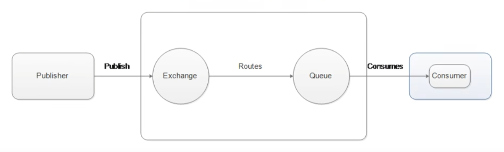

# RabbitMQ

## 基本概念

* MQ
  * Message Queue，消息队列
  * 在消息传输过程中保存消息的容器
  * 多用于分布式系统之间进行通信
  * 发送发称为生产者、接收方称为消费者
  * FIFO，First in first out，先进先出的队列


* MQ优势
  * 应用解耦
    * 系统耦合的问题
      * 单点故障，容错性低
      * 扩展性差，可维护性差
  * 异步提速
    * 异步执行耗时任务，立即返回接口给用户
    * 耗时任务执行器，依次执行耗时任务，也可以提高执行效率
  * 流量削峰
    * 将请求缓存依次处理，避免超过系统峰值造成崩溃，时间换空间


* MQ劣势
  * 系统可用性降低
    * 系统外部依赖越多，系统稳定性越差
  * 系统复杂度提高
    * 同步变异步引入以下问题
      * 重复消费问题
      * 消息丢失问题
      * 消息顺序问题
  * 一致性问题复杂
    * 异常失败场景下，数据处于中间状态，不一致


* MQ的使用条件
  * 生产者不需要从消费者获得反馈
  * 允许短暂的不一致性
  * 通过解耦、提速、削峰获得收益大于MQ的开发运维成本


* 常见MQ对比
  * kafka
    * 一般用于大数据
    * 吞吐量大
    * 能够保证所有消息被消费且被消费一次
    * 常用于日志收集


* AMQP协议介绍
  * Advanced Message Queuing Protocol，高级消息队列协议
  * 应用层网络协议
  * 面向消息中间件设计的开发标准





* AMQP概念

  * Publisher和Consumer是生产者消费者模型
  * 生产者消费者模型中的队列，进一步拆分
  * Exchange交换机，接收消息
  * Routes路由器，路由消息
  * Queue队列，保存消息


* RabbitMQ介绍
  * 基于AMQP协议开发的消息队列产品
  * 使用Erlang语言开发


* RabbitMQ概念

  * RabbitMQ在AMQP协议的基础上，进一步拆分出概念
  * channel，复用一个生产者消费者的管道
  * Virtual Host，分区管理队列内部的消息


* RabbitMQ概念详解
  * Broker，接收和分发消息的应用，RabbitMQ Server就是Message Broker
  * Virtual host：处于多用户和安全因素设计，把AMQP的基本组件划分到一个组内，每个用户只能使用自己的vhost，拥有用户独立的exchange / queue
  * Connection：publisher / consumer 和broker之间的TCP连接
  * Channel：为了避免一个消息建立一个tcp链接、也避免一种消息建立一个tcp连接，在Connection内部划分成channel，如果支持多线程，那么每个thread使用各自的channel
  * Exchange：消息到达broker首先进入Exchange，根据routing key，按规则分发到不同queue中去
  * Queue：消息最终被送到这里等待consumer取走
  * Binding：exchange和queue之间的虚拟连接，包含routing key和分发规则


* RabbitMQ的工作模式
  * 简单模式，Hello World
    * 一个生产者，一个消费者，一个队列。生产者将消息发送到队列，消费者从队列中接收消息
  * 工作队列模式，work queues
    * 在简单模式的基础上，多个消费者，竞争处理消息
    * 多个工作进程，并发提高处理效率
  * 发布订阅模式，Publish/Subscribe
    * 在简单模式的基础上，定义多个队列
    * 根据Exchange交换机的不同类型，不同消费者使用不同队列
    * 没有符合Exchange分发规则的消息，那么消息会丢失
  * 路由模式，Routing
    * 在发布订阅模式的基础上，指定路由规则，按规则分发
    * 由Exchange根据routing key分发至不同队列
  * 主题模式，Topics
    * 在路由模式的基础上，使用通配符`*`匹配routing key
  * RPC远程调用模式


## 安装配置

### docker安装

* 默认包不带管理插件，需要使用rabbitmq:3-management标签

* 队列端口 5672

* 管理端口 15672

* 默认账户/密码 guest@guest

```sh
docker run -d --hostname my-rabbit --name some-rabbit -p 5672:5672 -p 15672:15672 rabbitmq:3-management
```


### 使用

* 添加用户
* 添加vhost
* 添加权限


### 管理命令

```sh
# 创建账号
rabbitmqctl add_user 用户名 密码

# 设置用户角色
rabbitmqctl set_user_tags 用户名 administrator

# 设置用户权限
# 对vhost设置 配置 写 读 的权限
rabbitmqctl set_permissions [-p <vhostpath>] <user> <conf> <write> <read>
rabbitmqctl set_permissions -p "/" admin ".*" ".*" ".*"

# 列出所有用户和角色
rabbitmqctl list_users

# 列出所有交换机

# 列出所有队列

# 列出所有绑定
rabbitmqctl list_bingdings
```


### Python Pika

* 安装
  * `pip install pika`
* 安装或升级
  * `pip install pika --upgrade`

* 连接器

  * pika.BlockingConnection：这是一种同步的连接方式，它会阻塞当前线程，直到RabbitMQ返回响应。这种方式比较简单易用，适合一些简单的场景和脚本。

  * pika.SelectConnection：这是一种异步的连接方式，它会使用select模块来监听和处理RabbitMQ的事件。这种方式比较高效和灵活，适合一些复杂的场景和应用。

  * pika.AsyncioConnection：这是一种异步的连接方式，它会使用asyncio模块来实现协程和事件循环。这种方式只适用于Python 3，它可以利用async/await语法来简化异步编程。

  * pika.TornadoConnection：这是一种异步的连接方式，它会使用Tornado框架来实现异步I/O和Web服务。这种方式可以方便地在Tornado应用中使用RabbitMQ。

  * pika.LibevConnection：这是一种异步的连接方式，它会使用libev库来实现高性能的事件循环。这种方式可以提供更好的性能和可移植性。

* 注意事项
  * 对相同队列设置不同参数将会报错
  * 对相同交换机设置不同参数将会报错


## 工作模式


### 简单模式，Hello World

* 生产者步骤
  * 创建连接工厂 ConnectionFactory
  * 设置工厂参数
  * 创建连接 Connection
  * 创建频道 Channel
  * 创建队列 Queue
  * 发送消息 basic_publish


* 消费者步骤
  * 创建连接工厂 ConnectionFactory
  * 设置工厂参数
  * 创建连接 Connection
  * 创建频道 Channel
  * 创建队列 Queue
  * 接收消息 basic_consume


* 队列参数
  * queue，队列名称
  * durable，是否持久化
  * exclusive，是否独占，只有一个消费者监听这个队列，Connection关闭时删除队列
  * autoDelete，没有Consumer自动删除
  * arguments：参数


* 消费参数
  * queue，队列名称
  * autoAck，是否自动确认
  * callback，回调对象


* 生产者示例
  * 简单模式下，routing_key必须和队列名称一致
  * `exchange=''`，代表默认交换机

```py
#!/usr/bin/env python

# pip3 install pika
import pika

# 配置
param = pika.ConnectionParameters(host='192.168.4.101', port=5672)

# 创建连接
# connection = pika.BlockingConnection(param)

# 关闭连接
# connection.close()

with pika.BlockingConnection(param) as connection:

    # 获取频道
    channel = connection.channel()

    # 声明队列
    # 队列不存在会自动创建
    channel.queue_declare(queue='hello')

    # 发送消息
    # 默认交换机
    # 队列名与routing key相同
    for i in range(1000):
        msg = f'Hello World {i}!'
        channel.basic_publish(exchange='', routing_key='hello', body=msg)
        print(f'Sent {msg}')
```

* 消费者示例

```py
#!/usr/bin/env python
import pika

# 连接到本地的 RabbitMQ 服务器
connection = pika.BlockingConnection(
    pika.ConnectionParameters(host='localhost'))
channel = connection.channel()

# 声明一个名为 hello 的队列
channel.queue_declare(queue='hello')

# 定义一个回调函数，用于处理收到的消息
def callback(ch, method, properties, body):
    print(" [x] Received %r" % body)

# 告诉 RabbitMQ 使用 callback 函数来接收 hello 队列中的消息
channel.basic_consume(
    queue='hello', on_message_callback=callback, auto_ack=True)

print(' [*] Waiting for messages. To exit press CTRL+C')
# 开始接收消息，并进入无限循环，等待消息到来
channel.start_consuming()

```


### 工作队列模式，Work queues

* 在简单模式下，启动多个消费者即是工作队列模式
* 多个消费者是竞争一个队列内的任务，不会重复消费
* 分发策略
  * 默认不论消息处理快慢，消息都会均匀分发消息给所有worker，默认`prefetch_count=0`
  * 设置`prefetch_count`参数，可以按消费速度分发，`channel.basic_qos(prefetch_count=1)`

* ACK
  * 默认所有消息都需要ACK，`channel.basic_ack(delivery_tag=method.delivery_tag)`
  * 设置`auto_ack=True`，修改为自动确认模式，`channel.basic_consume(auto_ack=True)`


* 确认超时
  * 如果手动ACK，那么长时间未确认的消息会被再次消费，默认时长为30分钟
  * 配置在rabbitmq.config中的comsumer_timeout配置


* 默认分发
  * 条件
    * 生产者一次性发送10条消息到一个队列
    * 两个消费者监听同一个队列，竞争消息，prefetch_count保持默认值，
    * 消费者1消费速度慢，`time.sleep(1)`，消费者2正常消费，不sleep
  * 结论
    * ==虽然消费者1实际消费速度慢（打印慢），但是两个消费者都能收到5调消息，rabbitmq将消息均匀分发给两个消费者==
* 生产者代码

```py
import pika

# 配置
param = pika.ConnectionParameters(host='192.168.4.101', port=5672)

with pika.BlockingConnection(param) as connection:
    # 获取频道
    channel = connection.channel()

    # 声明交换机
    channel.exchange_declare(exchange='e')

    # 声明队列
    channel.queue_declare(queue='q')

    # 绑定队列和交换机
    channel.queue_bind(queue='q', exchange='e')

    # 发送10条消息
    for i in range(10):
        rt = channel.basic_publish(exchange='e', routing_key='q', body=f'{i}')
```

* 消费者代码

```py
import sys
import time
import pika

# 配置
param = pika.ConnectionParameters(host='192.168.4.101', port=5672)

# 消费者名称
consumer = sys.argv[1]

# 收到消息回调
def callback(ch, method, properties, body):
    if consumer == 'c1':
        time.sleep(1)

    print(f'{consumer} received {body}')
    ch.basic_ack(delivery_tag=method.delivery_tag)


with pika.BlockingConnection(param) as connection:

    # 获取频道
    channel = connection.channel()

    # 声明队列
    channel.queue_declare(queue='q')

    # 监听队列
    channel.basic_consume(queue='q', on_message_callback=callback)

    # 阻塞等待消息
    print(f'{consumer} waiting for messages. To exit press CTRL+C')
    channel.start_consuming()
```


* 按消费速度分发

  * 条件
    * 生产者一次性发送10条消息到一个队列
    * 两个消费者监听同一个队列，竞争消息，==prefetch_count设为1==，
    * 消费者1消费速度慢，`time.sleep(1)`，消费者2正常消费，不sleep

  * 结论
    * ==消费者1实际消费速度慢（打印慢），只能收到1条消息==
    * ==消费者2实际消费速度快，消费了9条消息==
  * 注意
    * ==`auto_ack=True`时，prefetch_count无效，因为消费者收到消息后立即自动回复了ACK，rabbitmq感知不到消费者的处理速度==

* 生产者代码

  * 与默认分发相同

* 消费者代码

```py
import sys
import time
import pika

# 配置
param = pika.ConnectionParameters(host='192.168.4.101', port=5672)

# 消费者名称
consumer = sys.argv[1]

# 收到消息回调
def callback(ch, method, properties, body):
    if consumer == 'c1':
        time.sleep(1)

    print(f'{consumer} received {body}')
    ch.basic_ack(delivery_tag=method.delivery_tag)


with pika.BlockingConnection(param) as connection:

    # 获取频道
    channel = connection.channel()

    # 给频道设置prefetch_count
    channel.basic_qos(prefetch_count=1)

    # 声明队列
    channel.queue_declare(queue='q')

    # 监听队列
    channel.basic_consume(queue='q', on_message_callback=callback)

    # 阻塞等待消息
    print(f'{consumer} waiting for messages. To exit press CTRL+C')
    channel.start_consuming()
```


### 订阅模式，Publish/Subscribe

* 订阅模式概念
  * Exchange有三种类型
    * `fanout`，广播，将消息交给所有绑定到交换机的队列
    * `direct`，定向，把消息交给符合指定`routing key`的队列
    * `topic`，通配符，把消息交给符合routing pattern（路由模式）的队列
    * `headers`，标题头
  * 多个消费者使用各自的队列，收到交换机分发给队列的消息
  * 此处发布订阅模式特指交换机是广播`fanout`类型，多个队列收到一个交换机分发的相同消息
  * `fanout`模式下会忽略`routing key`


* 生产者特殊步骤
  * 创建交换机
    * `channel.exchangeDeclare('pubsub')`
  * ==设置交换机的类型为`fanout`==
    * `channel.exchange_declare('pubsub', exchange_type='fanout')`
  * 生产者不创建队列，只负责发送


* 消费者特殊步骤

  * ==每个消费者创建自己的匿名队列，消费者关闭时自动销毁==
    * 创建匿名队列，`result = channel.queue_declare(queue='', exclusive=True)`
    * 从匿名队列获取队列名称，`queue_name = result.method.queue`

  * ==消费端和生产端绑定相同交换机即可==
    * `channel.queue_bind(exchange='pubsub', queue=queue_name)`


* 生产者示例代码

```py
import time
import pika

# 配置
param = pika.ConnectionParameters(host='192.168.4.101', port=5672)

with pika.BlockingConnection(param) as connection:

    # 获取频道
    channel = connection.channel()

    # 声明交换机
    channel.exchange_declare('pubsub', exchange_type='fanout')

    # 发送消息
    count = 1
    while True:
        msg = f'Pub/Sub {count} !'
        channel.basic_publish(exchange='pubsub', routing_key='', body=msg)
        print(f'Publisher sent {msg}')
        time.sleep(1)
        count += 1

```

* 消费者示例

```py
import pika

# 配置
param = pika.ConnectionParameters(host='192.168.4.101', port=5672)

# 收到消息回调
def callback(ch, method, properties, body):
    print(f'Consumer received {body}')


with pika.BlockingConnection(param) as connection:

    # 获取频道
    channel = connection.channel()

    # 获取交换机
    channel.exchange_declare(exchange='pubsub', exchange_type='fanout')

    # 声明队列
    result = channel.queue_declare(queue='', exclusive=True)
    queue_name = result.method.queue

    # 绑定
    channel.queue_bind(exchange='pubsub', queue=queue_name)

    # 监听队列
    channel.basic_consume(queue=queue_name, on_message_callback=callback, auto_ack=True)

    # 阻塞等待消息
    print(f'Queue {queue_name} waiting for messages. To exit press CTRL+C')
    channel.start_consuming()

```


### 路由模式，Routing

* 原理
  * 在发布订阅模式的基础上，有选择地订阅内容
  * 将交换机设置为`direct`定向交换
  * 消费者将想要监听的`routing key`绑定到自己的队列
  * 一个队列可以绑定多个`routing key`


* 生产者
  * 随机生产一个级别的日志

```py
import random
import time
import pika

# 配置
param = pika.ConnectionParameters(host='192.168.4.101', port=5672)
severity_list = ["FATAL", "ERROR", "WARN", "INFO", "DEBUG", "TRACE"]

with pika.BlockingConnection(param) as connection:

    # 获取频道
    channel = connection.channel()

    # 声明交换机
    channel.exchange_declare('log', exchange_type='direct')

    # 发送消息
    count = 1
    while True:
        severity = random.choice(severity_list)
        msg = f'Message {count}, severity {severity}!'
        channel.basic_publish(exchange='log', routing_key=severity, body=msg)
        print(f'Publisher sent {msg}')
        time.sleep(1)
        count += 1

```


* 消费者
  * 按命令行参数监听一个或多个级别的参数
  * 消费者生成自己的队列，多次绑定`routing key`

```py
import pika
import sys

# 配置
param = pika.ConnectionParameters(host='192.168.4.101', port=5672)

# 日志级别
severity_list = ["FATAL", "ERROR", "WARN", "INFO", "DEBUG", "TRACE"]


# 收到消息回调
def callback(ch, method, properties, body):
    print(f'Consumer received {body}')


with pika.BlockingConnection(param) as connection:

    # 获取频道
    channel = connection.channel()

    # 获取交换机
    channel.exchange_declare(exchange='log', exchange_type='direct')

    # 声明队列
    result = channel.queue_declare(queue='', exclusive=True)
    queue_name = result.method.queue

    # 多次绑定
    for key in sys.argv[1:]:
        if key not in severity_list:
            raise Exception("参数不合法")
        else:
            channel.queue_bind(queue=queue_name, exchange='log', routing_key=key)

    # 监听队列
    channel.basic_consume(queue=queue_name, on_message_callback=callback, auto_ack=True)

    # 阻塞等待消息
    print(f'Queue {queue_name} waiting for messages. To exit press CTRL+C')
    channel.start_consuming()

```


### 主题模式，Topics

* 原理
  * 在路由模式的基础上，使用通配符匹配`routing key`
* Topic的routing key限制
  * 长度不能超过255
  * 必须由点分离
  * 使用`*`star，代替一个单词，`*.a.*`
  * 使用`#`hash，代替零个或多个单词，`a.#`

* 特殊
  * 当不使用`*`，`#`时，等同于路由模式
  * 当只使用`#`时，等同于`fanout`模式


### RPC模式，Publisher Confirms

* 略


## 高级特性

### 生产端可靠投递

* 消息投递的路径
  * producer -> broker -> exchange -> queue -> consumer
* 保证消息投递可靠性的两种模式
  * 确认模式，confirm
    * 到达exchange后，返回一个confirmCallback，通知接收成功还是失败
    * 需要开启确认模式
      * 设置ConnectionFactory的publisher-confirms="true"
  * 退回模式，return
    * exchange到queue失败时，返回一个returnCallback，通知失败
    * 需要设置Exchange处理失败消息的方式
      * 丢弃
      * returnCallback


* 此外还有事务模式，但性能较差
  * 设置channel为transaction模式，txSelect()
  * 提交事务，txCommit()
  * 回滚事务，txRollback()


* 确认模式代码示例

```py
# 开启确认模式
channel.confirm_delivery()
# 添加监听
channel.add_on_return_callback(lambda ch, method, properties, body: print("消息发送失败"))
channel.add_on_ack_callback(lambda ch, method: print("消息发送成功"))
```


* 


### 消费端可靠消费，ACK

* 概念
  * ack，Acknowledge，确认
* 消费端有三种确认方式
  * 自动确认，`acknowledge="none"`
    * 一旦消费端收到消息，则自动确认
  * 手动确认，`acknowledge="manual"`
    * 消费端业务处理成功，则置为成功，`channel.basicAck()`
    * 消费端业务处理失败，则置为失败，`channel.basicNack()`
    * 未处理完的消息放回原队列，才能下次继续处理，`requeue=true`
  * 根据异常情况确认，acknowledge="auto"，这种方式使用麻烦


### 消费端限流，Qos

* 概念
  * 限流只跟消费端有关
* 限流方法
  * ack手动确认
  * perfetch，消费端每次从mq拉取一条消息，直到手动确认消费完毕后，才会拉取下一条消息的数量
  * prefetch设置为合理的数量


### 消息存活时间，TTL

* 概念
  * TTL，Time To Live，存活时间，过期时间
  * 当消息到达存活时间后，还没有被消费，会被自动删除
* 设置过期时间有两种方式
  * 对消息设置过期时间，expiration参数，单位毫秒
  * 对Queue设置过期时间，x-message-ttl参数，单位毫秒
  * 两者都设置时，以时间短的为准


### 死信队列，DLX

* 概念
  * DLX，Dead Letter Exchange，死信交换机
  * 死信消息会被重新发送到另一个交换机，这个交换机就是DLX
  * 消息死亡后，如果该队列绑定了一个死信交换机，则会重新发送到死信交换机，死信交换机可以再绑定另一个队列
* 消息成为死信的三种情况
  * 消息队列长度达到限制
  * 消费者拒绝消费消息，basicNack/basicReject并且不把消息放入原目标队列，`requeue=false`
  * TTL到期未被消费
* 队列绑定死信交换机的方式
  * 给队列设置死信绑定的交换机，参数`x-dead-letter-exchange`
  * 给队列设置死信发送时的`routing key`，参数`x-dead-letter-routing-key`


###  延迟队列

* 概念
  * 消息达到指定时间后，才会被消费
  * RabbitMQ并未提供延迟队列功能，可以通过TTL+死信队列组合实现
* 使用场景
  * 下单后30分钟未支付，取消订单
  * 新用户注册成功7天后，发送短信问候
* 为什么不使用轮询数据库


### 日志监控

* 默认日志存放路径
  * `/var/log/rabbitmq/rabbit@xxx.log`
* 后台监控
  * 端口15
* 控制台
  * `rabbitmqctl list_vhosts`
  * `rabbitmqctl list_users`


### 消息可靠性分析与追踪

* 有两个消息追踪的插件
  * firehose
  * rabbitmq_tracing
* firehost
  * 安装后会生成一个名为`amq.rabbitmq.trace`的交换机，交换机会发送两种消息
  * 生产者发送，exchange收到的消息，routing key为`publish.交换机名称`
  * 消费者从queue上获得的消息，routing key为`publish.队列名称`
  * 打开插件，`rabbitmqctl trace_on`
  * 关闭插件，`rabbitmqctl trace_off`
* rabbitmq_tracing比firehost多一个gui界面
  * 查看插件，`rabbitmq-plugins list`
  * 启用插件，`rabbitmq-plugins enable rabbitmq_tracing`
  * 关闭插件，`rabbitmq-plugins disable rabbitmq_tracing`


### 匿名队列

* 概念
  * 特殊场景下， 可能需要每次连接的新消息都放在一个新队列
  * 定义队列时，名称留空，rabbitmq会自动生成一个匿名队列
  * 设置参数`exclusive=True`，消费者连接断开时会删除队列
  * `result = channel.queue_declare(queue='', exclusive=True)`


### 管理


## 应用

### 提升消息可靠性

* 如何保证消息的可靠性
  * 持久化
    * exchange持久化
    * queue持久化
    * message持久化
  * 生产方需要确认
  * 消费方需要确认
  * Broker高可用


* 消息补偿机制
  * 生产者发送消息后（Q1），延迟一段时间再出发一个检查事件（Q3）
  * 消费者消费完消息之后，将消息保存到数据库（MDB），中间可用队列缓冲（Q2）
  * 延迟检查服务，接收延迟检查事件，触发补偿检查，如果事件未被消费则再次触发生产者流程
  * 定时检查服务，定时对比DB和MDB，避免延迟发送消息也失败


### 消息持久化

* 如何保证持久化
  * 消息持久化：这是指将消息标记为持久的，这样RabbitMQ会将它们写入磁盘，而不是只保存在内存中。要实现消息持久化，需要满足以下条件：
    * 队列必须是持久的，即在创建队列时设置`durable`属性为true
    * 消息必须是持久的，即在发送消息时设置`delivery_mode`属性为2
    * 消费者必须确认收到消息，即在创建消费者时设置`auto_ack`属性为false，并在处理完消息后调用`basic_ack`方法
  * 队列持久化：这是指将队列的元数据（如名称、绑定、参数等）保存到磁盘上，这样RabbitMQ重启后可以恢复队列的状态。要实现队列持久化，需要在创建队列时设置durable属性为true。
  * 交换器持久化：这是指将交换器的元数据（如名称、类型、参数等）保存到磁盘上，这样RabbitMQ重启后可以恢复交换器的状态。要实现交换器持久化，需要在创建交换器时设置durable属性为true。


* 持久化时机
  * 当消息被发送到一个持久化的交换器时，RabbitMQ会将消息写入内存缓冲区，并尝试将其刷新到磁盘。如果缓冲区满了或者超过了一定时间间隔（默认为5秒），RabbitMQ会强制将缓冲区中的消息写入磁盘。
  * 当消息被路由到一个持久化的队列时，RabbitMQ会将消息写入内存缓冲区，并尝试将其刷新到磁盘。如果缓冲区满了或者超过了一定时间间隔（默认为5秒），RabbitMQ会强制将缓冲区中的消息写入磁盘。
  * 当队列或交换器被创建或修改时，RabbitMQ会将它们的元数据写入内存缓冲区，并尝试将其刷新到磁盘。如果缓冲区满了或者超过了一定时间间隔（默认为5秒），RabbitMQ会强制将缓冲区中的元数据写入磁盘。


* 消息持久化代码示例（生产者）

```py
#!/usr/bin/env python
import pika
import pika.spec

# 配置
param = pika.ConnectionParameters(host='192.168.4.101', port=5672)

with pika.BlockingConnection(param) as connection:
    # 获取频道
    channel = connection.channel()

    # 声明交换机
    channel.exchange_declare(exchange='e', durable=True)

    # 声明队列
    channel.queue_declare(queue='q', durable=True)

    # 绑定队列和交换机
    channel.queue_bind(queue='q', exchange='e')

    # 发送10条消息
    for i in range(10):
        rt = channel.basic_publish(exchange='e', routing_key='q', body=f'{i}', 
                                properties=pika.BasicProperties(
                                    delivery_mode=pika.spec.PERSISTENT_DELIVERY_MODE
                                ))


```


### 保障消息幂等性

* 什么是幂等性
  * 一次和多次请求某一个资源，对资源本身应该具有相同的结果	
* 乐观锁解决幂等性
  * 消息携带版本号
  * 操作数据库时，检查版本号，避免多次消费


## 集群

* rabbitmq支持集群配置
* 队列默认不同步，需要配置队列同步
* rabbitmq不支持统一对外封装，需要使用HAProxy反向代理统一对外封装集群
* HAProxy访问失败后，不再重试节点


