# Redis

## 简介

* Redis是Remote Dictionary Server的缩写，远程字典服务
* 诞生与2009年
* 使用C语言编写
* 基于内存
* 单线程，所有命令串行
* Redis是键值对存储的NoSQL数据库
* NoSQL是非关系型数据库，也可以理解成Not only SQL
* 用于缓存一些经常用到的数据，提高读写速度

### redis优点

* 速度快
  * 基于内存
  * IO多路复用、网络是IO密集型不是CPU密集型
  * C语言、代码质量好
* 支持多种数据类型，多种数据类型指的是值类型，键类型只有字符串
  * 字符串，String，“abc”
  * 哈希，Hash，{key: "value"}
  * 列表，List，[1, 2, 3]
  * 集合，Set，{A, B, C}
  * 有序集合，Zset（SortedSet），{A: 1, B: 2, C: 3}
  * GEO，{A: (120.3, 30.5)}
  * BitMap，0101010111010100
  * HyperLog，0101010111010100
* 可选持久化
  * RDB，Redis Database Backup file，将Redis在内存中的数据库记录定时dump到磁盘
  * AOF，Append Only File，将Redis的操作日志以追加的方式写入文件
* 支持多种编程语言
* 分布式、高可用、主从、集群、分片集群

### SQL与NoSQL比较

* 结构化，Structured

  * SQL是结构化的，对数据有格式的要求，有表、数据类型、约束、外键关系
  * NoSQL对结构没有强约束，约束的类型取决于NoSQL的类型
    * 键值型，要求键值格式，如Redis
    * 文档型，要求json格式，如MongoDB
    * 图数据库，要求关系，如Neo4j
    * 列数据库，要求列类型，如HBase

* 关系，Relational

  * SQL有强关系约束，可以节约数据存储空间、保持数据一致性
  * NoSQL没有强关系约束，需要用户（程序员）自己维护数据关系

* 查询方式

  * 使用标准化SQL语句，关系型数据库都可以使用通用的查询语言
  * 各种NoSQL根据自身类型定义
    * redis，键值
    * mongodb，JavaScript函数调用
    * elasticsearch，Restfull请求

* 事务特性

  * SQL会保证ACID特性

    * 原子性，atomicity，或称不可分割性
    * 一致性，consistency
    * 隔离性，isolation，又称独立性
    * 持久性，durability

  * NoSQL无事务，只能保持基本一致，满足BASE特性

    * BASE理论是一种对分布式系统中数据一致性的弱化要求

    * 它是对CAP理论中一致性（C）和可用性（A）进行权衡的结果

    * 源于提出者自己在大规模分布式系统上实践的总结，其核心思想是无法做到强一致性，但每个应用都可以根据自身的特点，采用适当方式达到最终一致性。

    * BASE理论是由三个词组的首字母缩写组成的，即：

      - 基本可用（Basically Available）：指分布式系统在出现故障时，仍然可以保证对外提供满足基本需求的服务，但是可能无法保证所有功能都可用。

      - 软状态（Soft State）：指分布式系统中的数据存在中间状态，并且允许在不影响系统整体可用性的情况下，使数据达到最终一致性。

      - 最终一致性（Eventually Consistent）：指分布式系统中所有的数据副本，在经过一段时间的同步后，最终能够达到一致的状态。

* 存储方式

  * SQL基于磁盘
  * NoSQL一般基于内存

* 扩展性

  * SQL表设计完成之后一般只能垂直扩展，没有考虑水平扩展性
  * NoSQL设计之初就考虑水平扩展

* 使用场景

  * SQL
    * 数据结构固定
    * 对数据安全性、一致性要求高
  * NoSQL
    * 数据结构不固定
    * 对一致性、安全性要求不高
    * 对性能要求高

### 应用场景

* 缓存

* 数据共享
* 购物车
* 消息队列
* 计数器
* 限流缓存数据
  * 热点数据的特点，高频读、低频写
  * 用户信息、优惠券过期时间、验证码过期时间、session、token
* 计数器
  * 帖子的浏览数，视频播放次数，评论次数，点赞次数
* 消息队列
  * 秒杀系统
* 社交网路
  * 粉丝、共同好友（可能认识的人），兴趣爱好（推荐商品）
* 排行榜
  * 有序集合
* 发布订阅
  * 粉丝关注
  * 消息通知

## 安装

### docker安装

```sh
# 启动redis，不支持永久存储
docker run --name some-redis -d redis

# 启动redis启动定时存储
docker run --name some-redis -d redis redis-server --save 60 1 --loglevel warning

# 在docker中运行redis-cli
docker run -it --network some-network --rm redis redis-cli -h some-redis
```


### centos安装

```sh
# 安装第三方库
yum install epel
yum install redis
```

## 组件介绍

* redis-server
* reids-sentinel # 监视器，监视、故障转移
* redis-cli # 命令行客户端
* redis-benchmark # 性能测试工具
* redis-check-aof redis-check-dump # 故障修复

## redis客户端

* 自带redis-cli
* RedisInsight，官方UI，提供性能监控、统计分析、图形操作界面、命令行terminal

```bash
# 连接redis-server
redis-cli -h host -p port -a password

# 在bash中测试连通性
redis-cli ping
```

## 配置

配置文件：/etc/redis.conf

```sh
# 守护模式，默认为no
daemonize yes

# 日志级别
loglevel 

# pidfile
pidfile /var/run/redis/redis.pid

# 日志文件，默认为空，不记录日志
logfile /var/log/redis/redis.log

# 日志产生在dir目录
logfile redis.log

# 持久化文件名
dbfilename dump.rdb

# 工作目录，持久化文件路径
dir /var/lib/redis

# 绑定监听IP，127.0.0.1
bind 0.0.0.0

# 端口
port 6379

# 设置密码，无用户名  
requirepass password 

# 数据库数量
databases 16

# redis能够使用的最大内存
maxmemory 512mb
```

开机自启动，/etc/systemd/system/redis.service

```sh
[unit]
Description=redis-server
After=network.target

[Service]
Type=forking
ExecStart=/usr/local/bin/redis-server /usr/local/src/redis-6.2.6/redis.conf
PrivateTmp=true

[Install]
WantedBy=multi-user.target

# systemctl reload
# systemctl start redis
# systemctl status redis
# systemctl enable redis
```

## 系统命令

### 快捷键-命令补全，tab

* 同bash

### 测试连通性，ping

```bash
# 命令式
redis-cli ping

# 交互式
redis-cli
ping

# 参数
-h <hostname>  # 默认localhost
-p <port>      # 默认6379
-a <password>  # 默认无
```

### 清空数据库，flushdb

* flushdb清空当前数据库
* flushall清空全部数据库

### 查看当前数据库信息，info

```markdown
> info
# Server
redis_version:7.0.12
redis_git_sha1:00000000
redis_git_dirty:0
redis_build_id:e9d5a718c4613a7a
redis_mode:standalone
os:Linux 5.15.90.1-microsoft-standard-WSL2 x86_64
arch_bits:64
monotonic_clock:POSIX clock_gettime
multiplexing_api:epoll
atomicvar_api:c11-builtin
gcc_version:12.2.0
process_id:1
process_supervised:no
run_id:4bfa0b4f80e88f8a13ba02bcb2e08c457b011369
tcp_port:6379
server_time_usec:1693626783447660
uptime_in_seconds:859071
uptime_in_days:9
hz:10
configured_hz:10
lru_clock:15905183
executable:/data/redis-server
config_file:
io_threads_active:0

# Clients
connected_clients:3
cluster_connections:0
maxclients:10000
client_recent_max_input_buffer:20480
client_recent_max_output_buffer:0
blocked_clients:0
tracking_clients:0
clients_in_timeout_table:0

# Memory
used_memory:1534112
used_memory_human:1.46M
used_memory_rss:14610432
used_memory_rss_human:13.93M
used_memory_peak:1573320
used_memory_peak_human:1.50M
used_memory_peak_perc:97.51%
used_memory_overhead:867904
used_memory_startup:862208
used_memory_dataset:666208
used_memory_dataset_perc:99.15%
allocator_allocated:1641152
allocator_active:2080768
allocator_resident:5496832
total_system_memory:16731009024
total_system_memory_human:15.58G
used_memory_lua:31744
used_memory_vm_eval:31744
used_memory_lua_human:31.00K
used_memory_scripts_eval:0
number_of_cached_scripts:0
number_of_functions:0
number_of_libraries:0
used_memory_vm_functions:32768
used_memory_vm_total:64512
used_memory_vm_total_human:63.00K
used_memory_functions:184
used_memory_scripts:184
used_memory_scripts_human:184B
maxmemory:0
maxmemory_human:0B
maxmemory_policy:noeviction
allocator_frag_ratio:1.27
allocator_frag_bytes:439616
allocator_rss_ratio:2.64
allocator_rss_bytes:3416064
rss_overhead_ratio:2.66
rss_overhead_bytes:9113600
mem_fragmentation_ratio:9.66
mem_fragmentation_bytes:13098616
mem_not_counted_for_evict:0
mem_replication_backlog:0
mem_total_replication_buffers:0
mem_clients_slaves:0
mem_clients_normal:5400
mem_cluster_links:0
mem_aof_buffer:0
mem_allocator:jemalloc-5.2.1
active_defrag_running:0
lazyfree_pending_objects:0
lazyfreed_objects:0

# Persistence
loading:0
async_loading:0
current_cow_peak:0
current_cow_size:0
current_cow_size_age:0
current_fork_perc:0.00
current_save_keys_processed:0
current_save_keys_total:0
rdb_changes_since_last_save:28
rdb_bgsave_in_progress:0
rdb_last_save_time:1693623830
rdb_last_bgsave_status:ok
rdb_last_bgsave_time_sec:0
rdb_current_bgsave_time_sec:-1
rdb_saves:3
rdb_last_cow_size:225280
rdb_last_load_keys_expired:0
rdb_last_load_keys_loaded:5
aof_enabled:0
aof_rewrite_in_progress:0
aof_rewrite_scheduled:0
aof_last_rewrite_time_sec:-1
aof_current_rewrite_time_sec:-1
aof_last_bgrewrite_status:ok
aof_rewrites:0
aof_rewrites_consecutive_failures:0
aof_last_write_status:ok
aof_last_cow_size:0
module_fork_in_progress:0
module_fork_last_cow_size:0

# Stats
total_connections_received:5
total_commands_processed:977
instantaneous_ops_per_sec:0
total_net_input_bytes:19650
total_net_output_bytes:3366703
total_net_repl_input_bytes:0
total_net_repl_output_bytes:0
instantaneous_input_kbps:0.00
instantaneous_output_kbps:0.00
instantaneous_input_repl_kbps:0.00
instantaneous_output_repl_kbps:0.00
rejected_connections:0
sync_full:0
sync_partial_ok:0
sync_partial_err:0
expired_keys:1
expired_stale_perc:0.00
expired_time_cap_reached_count:0
expire_cycle_cpu_milliseconds:12159
evicted_keys:0
evicted_clients:0
total_eviction_exceeded_time:0
current_eviction_exceeded_time:0
keyspace_hits:161
keyspace_misses:1
pubsub_channels:0
pubsub_patterns:0
pubsubshard_channels:0
latest_fork_usec:2174
total_forks:3
migrate_cached_sockets:0
slave_expires_tracked_keys:0
active_defrag_hits:0
active_defrag_misses:0
active_defrag_key_hits:0
active_defrag_key_misses:0
total_active_defrag_time:0
current_active_defrag_time:0
tracking_total_keys:0
tracking_total_items:0
tracking_total_prefixes:0
unexpected_error_replies:0
total_error_replies:11
dump_payload_sanitizations:0
total_reads_processed:811
total_writes_processed:808
io_threaded_reads_processed:0
io_threaded_writes_processed:0
reply_buffer_shrinks:647
reply_buffer_expands:653

# Replication
role:master
connected_slaves:0
master_failover_state:no-failover
master_replid:31f07ef71b8621d70a9431b3491ef3f65922720a
master_replid2:0000000000000000000000000000000000000000
master_repl_offset:0
second_repl_offset:-1
repl_backlog_active:0
repl_backlog_size:1048576
repl_backlog_first_byte_offset:0
repl_backlog_histlen:0

# CPU
used_cpu_sys:534.714320
used_cpu_user:504.752517
used_cpu_sys_children:0.020097
used_cpu_user_children:0.011331
used_cpu_sys_main_thread:534.710562
used_cpu_user_main_thread:504.744356

# Modules

# Errorstats
errorstat_ERR:count=11

# Cluster
cluster_enabled:0

# Keyspace
db0:keys=2,expires=0,avg_ttl=0
```

### 切换数据库，select

* 默认16个数据库
* id为0到15
* 默认在0号库

```sh
# 切换数据库
select dbid
```

* 非0号数据库，命令行提示符不同

<div align="left">
    <figure>
    	
        <figcaption></figcaption>
    </figure>
</div>
### 清屏，clear

```sh
clear
```

### 指定用户名密码，auth

```sh
auth username password
auth password
```

### 获取帮助，help

```sh
# 查看通用命令
help @generic

# 获取string类型帮助
help @string

# 获取命令帮助
help keys
```

### 层级键

* redis不分表，使用层级键可以区分两种表中相同的键
* 使用冒号隔开，如`项目:业务:类型:id`


## 键操作

### 查询匹配键，keys

* 星号匹配任意长度字符
* 问号匹配1个字符
* [ab]匹配a或者b
* [a-b]匹配a到b
* [^a]匹配非a

```sh
# 查询匹配键
keys pattern


# 查询所有键
keys *


# 示例
> KEYS *
1) "count"
2) "bit"


# 查询以a开头的键
keys a*


# 查询以a结尾的键
keys *a


# 查询包含a的键
keys *a*


# 示例
> keys c*
1) "count"

> keys *t
1) "count"
2) "bit"

```

### 判断键是否存在，exists

* 存在返回整数1
* 不存在返回整数0

```sh
# 是否存在key
exists key
exists key1 key2 key3

# 示例
> exists count
(integer) 1
```

### 查看键对应值的数据类型，type

```sh
# 查看值的数据类型
type key

# 示例
> type count
"string"
```

### 查看键对应值的底层存储类型，object encoding

```sh
object encoding key

> object encoding num
"int"
```


### 删除键，del

```sh
# 删除键
del k1

# 删除多个键
del k1 k2 k3

# 示例，返回删除的数量
del k1 k2 k3 k4
(integer) 3
```

### 查询有效期，ttl

* time to live的缩写
* `ttl=-1`代表永久有效
* `ttl=-2`代表已经删除

```bash
# 查询剩余有效期
ttl key

# 示例
ttl key
(integer) 10
```

### 设置有效期，expire

* 单位秒

```sh
ex key 5
expire key 5

# 示例
expire key 5
(integer) 1
```

### 重命名键，rename

```sh
# 重命名
rename k1 k2
```

## 字符串，string

### 存取键值，set、get

* set成功返回字符串"OK"

```sh
# 不加引号默认是字符串
> set key value
"OK"

> get key
"value"   

# 等同于 set key value
# 已存在key可以重新赋值
> set key "value"
"OK"


> get key
"value"   

# 不支持数字
> set key 23
"OK"

> get key
"23"
```

### 不可重新赋值，setnx

* 特性

  * 已存在的值再次赋值失败（返回整数0）

  * setnx，set if not exists

  * setnx成功返回整数1

  * setnx失败返回整数0

* 使用场景

  * 分布式锁
    * 加锁setnx key user1
    * 解锁del key
    * 等待setnx key user2

```sh
# 设置失败，一般两次都会使用setnx

> setnx key2 value
(integer) 1

> setnx key2 value
(integer) 0


# set之后setnx会失败

> set key1 value
"OK"

> setnx key1 value
(integer) 0


# setnx之后set会成功

> setnx kk value
(integer) 1

> set kk value
"OK"

```

### 设置过期键，setex

* 特性
  * n秒后自动删除键
  * 过期后取值返回`(nil)`
* 使用场景
  * 优惠券过期
  * 验证码过期

```sh
# 设置带过期时间的键值
> setex key expire_seconds value
"OK"

# 过期时间内取
> get key
"value"

# 过期时间后取
> get key
(nil)
```

### 追加字符串，append

* 特性
  * 追加字符串
  * ==返回总长度==
  * 最大512M

* 使用场景
  * 长字符串存储

```sh
# append之前已存在的key

> set key 123
"OK"

> append key 456
(integer) 6

> get key
"123456"


# append之前不存在的key

> append key 123
(integer) 3

> append key 456
(integer) 6

> get key
"123456"


# 命令行加空格

> append key 123
(integer) 3

> append key " 456"
(integer) 7

> get key
"123 456"
```

### 批量存取键值，mset、mget

```sh
# 批量存
> mset key1 value1 key2 value2 key3 value3
"OK"

# 批量取
> mget key1 key2 key3
1) "value1"
2) "value2"
3) "value3"
```

### 自增自减，incr、decr、incrby

* 特性
  * 只能对数字字符串操作，非整数字符串报错
  * 返回当前值
* incr，整数增加1
* decr，整数减少1
* incrby，整数增加给定值
* decrby，整数减去给定值
* incrbyfloat，浮点数增加给定值
* decrbyfloat，浮点数减去给定值

```bash
# 键不存在时，直接incr，返回当前值1

> incr count
(integer) 1

> get count
"1"

> incr count
(integer) 2


# 键存在时，使用incr，自增1

> set count 0
"OK"

> incr count
(integer) 1

> incr count
(integer) 2


# incr非整数字符串

> set key value
"OK"

> incr key
"ERR value is not an integer or out of range"


# 键不存在时，直接decr，返回当前值-1

> decr count
(integer) -1

> decr count 
(integer) -2


# incrby 增加给定值

> incrby count 2
(integer) 2

> incrby count 2
(integer) 4


# decrby 减去给定值
> decrby count 2
(integer) -2

> decrby count 2
(integer) -4
```

### 比特流操作，setbit、getbit

* 特性
  * 空比特位补0
  * offset是从左向右偏移
  * bitcount，数比特为1的数
  * bitpos，查找第一个bit为1的位置

```bash
# 设1
setbit key offset 1

# 设0
setbit key offset 0

# 获取
getbit key offset 

# 数比特为1的数，默认为0
bitcount key


# 空比特位补0

> setbit bit 20 1
(integer) 0

> get bit
"\x00\x00\b"


```


## 哈希，Hash

* 特性
  * 元素必须是字符串

* 设置，hset，hash set

```js
// 哈希概念结构
// 为区别redis键和hash内部键，hash内部键称为field
键key: {
    域field：值value,
}
```


### 设置键域的值，hset

```sh
# 设置一个域值
hset key field value

# 替换域值
hset key field new_value

# 设置多个域值
hset key field1 value1 field2 value2
```

### 获取键域的值，hget

```sh
> hset key field1 value1 field2 value2 field3 value3
(integer) 3

# 获取成功
> hget key field2
"value2"

# 获取的域不存在
> hget key field4
(nil)

# 获取的键不存在
> hget key1 field1
(nil)
```

### 获取键的全部阈值，hgetall

```sh
> hset key field1 value1 field2 value2 field3 value3
(integer) 3

> hgetall key
1) "field1"
2) "value1"
3) "field2"
4) "value2"
5) "field3"
6) "value3"
```

### 获取键的全部域，hkeys

```sh
hkeys key
```

### 获取键的全部值，hvals

```sh
> hset key field1 value1 field2 value2 field3 value3
(integer) 3

> hvals key
1) "value1"
2) "value2"
3) "value3"
```

### 批量设置域值，hmset

```sh
> hset key field1 value1 field2 value2 field3 value3
"OK"
```

### 批量获取域值，hmget

```sh
> hset key field1 value1 field2 value2 field3 value3
(integer) 3

> hmget key field1 field2
1) "value1"
2) "value2"
```

### 删除键域，hdel

```sh
hdel key field
```

### 判断键域是否存在，hexists

```sh
hexists key field
```

### 属性自增自减，hincr，hdecr

```sh
# 自增1
hincr key field

# 自减1
hdecr key field

# 自增多
hincrby key field number

# 自减多
hdecr key field number
```


### 哈希不可重新赋值，hsetnx

```sh
hsetnx key field value
```

## 列表，List

* 特性
  * 也称为数组
  * 列表元素只能是字符串
  * 有序
  * 链表结构，可以快速插入删除
* 左入队，lpush，left push
* 右入队，rpush，right push
* 切片，lrange，list range，==start、end前后都包==
* 插入，linsert，list insert，==可选before、after==
* 长度，llen，list len
* 设置，lset，list set
* 查看，lindex，list index
* 左出队，lpop，left pop
* 右出队，rpop，right pop
* 删除，lrem，list remove，==按值删==
* 清理，ltrim，list trim，==从两头删==
* 阻塞出队，blpop、block left pop

### 入队，lpush，rpush

```sh
# 左插（依次从左边插入）
lpush key value1 value2 value3
# ["value3", "value2", "value1"]

# 右插
rpush key value1 value2 value3
# ["value1", "value2", "value3"]
```

### 获取切片，lrange

```sh
# 切片
lrange key start end

# 获取list中所有值
lrange key 0 -1

# 示例
> lpush key 1 2 3
(integer) 3

> lrange key 0 -1
1) "3"
2) "2"
3) "1"
```

### 按位置获取值，lindex

```sh
# 获取位置index的值
lindex key index
```

### 匹配并插入，linsert

```sh
# 匹配并在后方插入
linsert key after search_value new_value
# 匹配并在前方插入
linsert key before search_value new_value

# 示例
> rpush key 1 2 3
(integer) 3

> linsert key after 2 8
(integer) 4

> lrange key 0 -1
1) "1"
2) "2"
3) "8"
4) "3"

> linsert key before 2 8
(integer) 5

> lrange key 0 -1
1) "1"
2) "8"
3) "2"
4) "8"
5) "3"

> lindex key 3
"8"

```

### 获取长度，llen

```sh
# 获取长度
llen key
```

### 按索引位置修改，lset

```bash
# 修改
lset key index value
```

### 出队，lpop、rpop

```sh
# 出队
lpop key
rpop key
```

### 删除匹配，lrem

* count==0，删除所有value匹配的成员

* count > 0，从左边删除count个值

* count < 0，从右边删除count个值

```sh
# 删除匹配
lrem key count value

# 删除中间示例
> rpush key 0 1 2 3 4 0 5 6 7 8 0
(integer) 11

> lrem key 0 0 # 删除所有0
(integer) 3

> lrange key 0 -1
1) "1"
2) "2"
3) "3"
4) "4"
5) "5"
6) "6"
7) "7"
8) "8"

> del key
(integer) 1

> rpush key 0 1 2 3 4 0 5 6 7 8 0
(integer) 11

> lrem key 1 0 # 从左匹配，删除1个0
(integer) 1

> lrange key 0 -1
1) "1"
2) "2"
3) "3"
4) "4"
5) "0"
6) "5"
7) "6"
8) "7"
9) "8"
10) "0"

> del key
(integer) 1

> rpush key 0 1 2 3 4 0 5 6 7 8 0
(integer) 11

> lrem key -1 0 # 从右匹配，删除1个0
(integer) 1

> lrange key 0 -1
1) "0"
2) "1"
3) "2"
4) "3"
5) "4"
6) "0"
7) "5"
8) "6"
9) "7"
10) "8"
```

### 删除两头，ltrim

```sh
# 删除两头
ltrim key start end

# 删除两头示例
> rpush key 1 2 3 4 5
(integer) 5

> ltrim key 1 3
"OK"

> lrange key 0 -1
1) "2"
2) "3"
3) "4"
```

### 阻塞出队，blpop、brpop

* 在没有元素时会等待指定时间，而不是直接返回nil

```sh
```

## 集合，Set

* 特性
  * 去重，不可重复
  * 无序
  * 查找快
  * 支持并交叉

```sh
```

### 添加，sadd

```sh
sadd key value
sadd key value1 value2 value3

# 示例
> sadd key m1 m2 m3
(integer) 3
```

### 获取所有，smembers

```sh
smembers key
```

### 随机出列n个元素，spop

```sh
spop key # 默认count=1
spop key count=1
spop key count=2
```

### 获取总个数，scard

```sh
scard key
```

### 删除指定值，srem

```sh
srem key value
srem key value1 value2

# 示例
> srem key m1 m2
(integer) 2
```

### 交叉并，sinter、sdiff、sunion

```sh
sinter key1 key2 key3
sdiff key1 key2 key3
sunion key1 key2 key3
```

### 判断是否在集合内，sismember

```sh
sismember key member
```

## 有序集合，Zset，SortedSet

* ==去重并根据score权重值排序==
* 其他同set
* 反转排序在z后面加rev

### 添加，zadd

* 如果已经存在，则会更新score值

```sh
zadd key score member
zadd key score1 member1 score2 member2 score3 member3
```

### 根据score区间获取成员，zrange，zrangebyscore

```sh
# 按score值从小到大排序，获取指定score值区间成员
zrangebyscore key min max

# 按score值从大到小排序，获取指定score值区间成员
zrevrangebyscore key min max

# 按score值从小到大排序，获取指定索引区间
zrange key start stop

# 按score值从大到小排序，获取指定索引区间
zrevrange key start stop

# 按score值从小到大排序，获取全部
zrange key 0 -1
```

### 获取集合长度，zcard

```sh
zcard key
```

### 按成员获取权重，zscore

```sh
zscore key memeber
```

### 成员在集合中的排名，zrank，zrevrank

```sh
zrank key member
```

### 统计score区间的所有成员数量，zcount

```sh
zcount key min_score max_score
```

### 给指定成员增减权重值，zincrby

```sh
zincrby key increment member
zdecrby key decrement member
```

### 删除成员，zrem

```sh
zrem key member
zrem key member1 member2 memeber3
```

### 删除指定数量的成员，zpopmin、zpopmax

```sh
# 删除最低的
zpopmin key
zpopmin key count
```

### 并交差，zdiff、zinter、zunion

```sh
zdiff
zinter
zunion
```

* 

## python操作redis

### redis-py，官方

- **Redis-Py**：Redis-Py是一个用于Python的Redis客户端库，它提供了一些基本的功能和数据结构，例如字符串、列表、集合、有序集合、哈希等。 Redis-Py还可以通过扩展模块来支持一些高级的功能和数据结构，例如：
  - **Redis-Lock**：Redis-Lock是一个基于Redis-Py的分布式锁模块，它可以实现可重入锁、公平锁、读写锁等。
  - **Redis-Bloom**：Redis-Bloom是一个基于Redis-Py的布隆过滤器模块，它可以实现概率型集合、计数型集合、拓扑型集合等。
  - **RQ**：RQ是一个基于Redis-Py的任务队列模块，它可以实现异步任务、延迟任务、定时任务等。
  - **GeoRedis**：GeoRedis是一个基于Redis-Py的地理空间索引模块，它可以实现地理位置存储、查询、距离计算等。


#### 安装

```sh
# 主库
pip install redis

# 编译加速
pip install redis[hiredis]
```

#### 连接

* 单连接

```py
import redis

r = redis.Redis(host='192.168.4.101', port='6379')

r.flushdb() # True
r.set('key', 'value') # True
r.get('key') # b'value'
```

* 连接池

```sh
import redis

pool = redis.ConnectionPool(host='127.0.0.1', port=6379)
r = redis.Redis(connection_pool=pool)
r.set('bar', 'Foo')
r.get('bar')
```

#### hash与json映射

* 字典存入字典取出
* 但是==整数取回时会变成字符串==

```sh
r.hset('user-session:123', mapping={
    'name': 'John',
    "surname": 'Smith',
    "company": 'Redis',
    "age": 29
})
# True

r.hgetall('user-session:123')
# {'surname': 'Smith', 'name': 'John', 'company': 'Redis', 'age': '29'}
```

## Java操作redis

* Jedis类似redis-py，提供了原生接口的封装
* SprintDataJson封装了自动序列化工具，可以将对象存入Redis
* 对象存入Redis会有类标识，浪费内存空间，可以手动使用Json序列化

## 案例

### 短信验证码登录用户会话，Session

* 发送流程（登录&注册）
  * 使用五元组建立用户Session
  * 将手机号和生成的验证码保存到数据库
  * 发送短信验证码
* 验证流程（登录&注册）
  * 验证手机号和短信验证码
  * 已注册的手机号，进入登录成功流程，转到原页面或首页
  * 未注册的手机号，进入登录成功流程，转到注册流程
* 注册流程
  * 补充其他信息
* 登录成功流程
  * 登录成功，将用户与Session相关联
* 鉴权拦截url
  * 校验token得到用户
  * 根据用户角色判断是否有权限访问当前url
* Redis用途
  * ==多个WebServer共享Session，以token为key保存用户信息，hash==
  * ==以手机号为key获取验证码，string==

#### 发送流程

* 用户
  * 输入手机号
  * 点击发送验证码
* 前端
  * 校验手机号合法性
  * 向后端发送手机号和发送验证码请求
  * 限制重复发送时间
* 后端
  * 校验手机号合法性
  * 限制重复发送时间
  * 将session标识、手机号、验证码、生成时间保存到数据库

#### 验证流程

* 用户
  * 已经输入手机号
  * 补充输入验证码
  * 点击校验（登录）
* 前端
  * 校验手机号、验证码合法性
  * 向后端发送手机号和验证码
* 后端
  * 校验手机号和验证码合法性
  * 限制重试时间及次数
  * 校验session标识、手机号、验证码

#### 登录成功流程

* 前端
  * 记录token
  * 切到原页面或首页
* 后端
  * 将用户和Session相关联
  * 给前端返回token

#### 注册流程

* 用户
  * 输入补充信息或跳过
* 前端
  * 切到补充信息页面
  * 补充成功后切到原页面或首页
* 后端
  * 将用户补充信息记录到数据库

#### 鉴权拦截url

* 前端
  * 所有请求携带token
* 后端
  * 根据token获取session


### 缓存，Cache

* 适合读多写少场景
  * 商户
  * 商品
  * 用户
  * 商户类型
  * 商品类型
  * 用户角色
* 读写性能较直接读写高
* 缓存的作用
  * 降低后端负载
  * 提高读写效率，降低响应时间
* 缓存的成本
  * 数据一致性降低，缓存中存在过时数据
  * 代码逻辑复杂度提高，维护成本提高
  * 增加组件，提高了运维成本


#### 缓存的基本流程


#### 缓存更新策略


##### 内存淘汰

* redis内存超过上限时自动删除，下次查询时更新到缓存
* 不一致概率大
* 淘汰哪些数据不可控


##### 超时淘汰

* 设置ttl超时淘汰，下次查询时更新到缓存
* 不一致概率大
* 淘汰最老数据


##### 主动更新

* 修改数据库时，主动更新缓存，不存在时更新到缓存
* 不一致概率小
* 主动删除不一致的旧数据
* 一般还需要配合超时淘汰，提高内存使用率


##### ==主动更新策略——Cache Aside Pattern==

* 编写业务逻辑，更新数据库时同时更新缓存
* 可靠性高
* 实现简单
* 一致性可控


##### 主动更新策略——Read/Write Through Pattern

* 将缓存和数据库整合成一个服务，对外暴露接口，对调用者透明
* 没有通用库
* 实现复杂


##### 主动更新策略——Write Behind Caching Pattern

* 调用者只操作缓存，由其他服务异步将缓存持久化到数据库，对调用者透明

* 效率高
* 不可靠


##### 主动更新问题——删除缓存还是更新缓存

* 修改数据时更新缓存，每次更新数据库都会更新缓存，可能多次无效更新缓存
* ==删除缓存下次使用时更新==


##### 主动更新问题——保证缓存和数据库更新的原子性

* 单体系统，将缓存操作和数据库操作放在一个数据库事务中
* 分布式系统，利用TCC等分布式事务方案
* 分布式事务方案
  * 2PC（两阶段提交）：2PC是一种基于XA协议的分布式事务方案，它将事务的提交过程分为两个阶段：准备阶段和提交阶段。在准备阶段，事务协调者（TM）向所有的事务参与者（RM）发送准备请求，要求它们执行本地事务并锁定资源，然后等待它们的响应。如果所有的参与者都返回成功，那么进入提交阶段；否则，进入回滚阶段。在提交阶段，TM向所有的参与者发送提交请求，要求它们释放资源并结束事务，然后等待它们的响应。如果所有的参与者都返回成功，那么整个分布式事务完成；否则，TM会重试或人工干预。
  * 3PC（三阶段提交）：3PC是对2PC的改进，它将事务的提交过程分为三个阶段：准备阶段、预提交阶段和提交阶段。在准备阶段，TM向所有的参与者发送准备请求，要求它们执行本地事务并锁定资源，然后等待它们的响应。如果所有的参与者都返回成功，那么进入预提交阶段；否则，进入回滚阶段。在预提交阶段，TM向所有的参与者发送预提交请求，并等待它们的响应。如果所有的参与者都返回成功，那么进入提交阶段；否则，进入回滚阶段。在提交阶段，TM向所有的参与者发送提交请求，并等待它们的响应。如果所有的参与者都返回成功，那么整个分布式事务完成；否则，TM会重试或人工干预。3PC相比2PC增加了一个预提交阶段，可以缩短资源锁定时间，并引入超时机制来处理网络故障。
  * TCC（Try-Confirm-Cancel）：TCC是一种基于补偿机制的分布式事务方案，它要求每个参与者实现三个操作：Try、Confirm和Cancel。Try操作用于检查和预留业务资源；Confirm操作用于确认并使用业务资源；Cancel操作用于取消并释放业务资源。TM首先发起所有参与者的Try操作，如果任何一个参与者失败或超时，TM就会发起所有参与者的Cancel操作；如果所有参与者成功，TM就会发起所有参与者的Confirm操作。TCC相比2PC和3PC不需要锁定资源，并且可以根据业务逻辑灵活地实现补偿操作。
  * SAGA（长事务）：SAGA是一种基于事件驱动和补偿机制的分布式事务方案，它将一个长时间运行的事务拆分为多个子事务，并定义每个子事务对应的补偿操作。每个子事务执行后会向消息队列发送一个事件通知其他子事务继续执行或回滚。如果任何一个子事务失败或超时，消息队列就会触发之前已完成子事务的补偿操作来回滚整个长事务。SAGA相比TCC不需要TM来协调参与者，而是通过消息队列来实现异步和解耦的通信。


##### 主动更新问题——先操作缓存还是先操作数据库

* 先删缓存，再操作数据库
  * 多线程时，删除缓存后数据库更新成功前，可能存在其他线程将旧数据再次更新到缓存
  * 因为数据库操作耗时较长，所以发生概率较大
* ==先操作数据库，再删缓存==
  * 多线程时，可能存在其他线程未命中缓存，从数据库读取到旧数据，将旧数据更新到缓存
  * 因为更新缓存速度较快，期间发生数据被修改的概率较低


#### 缓存穿透

* 概念
  * 缓存穿透指的是，客户端请求的数据在缓存和数据库中都不存在
* 问题
  * 可能会被故意利用，导致数据库压力过大
* 解决
  * ==缓存空对象==
    * 将不存在的id和空值存入redis，下次访问将无法穿透到数据库
    * 可能造成内存消耗
    * 可能导致短期不一致，用户查询到null
  * ==布隆过滤==
    * 在客户端和服务器之间加一层过滤，不存在的数据直接反回不存在
    * 布隆过滤器利用哈希算法，以很小的内存，判断key是否存在
  * 增强id复杂度，避免被猜测id
  * 做好数据的基础格式校验
  * 加强用户权限校验
  * 做好热点参数的限流


#### 缓存雪崩

* 概念
  * 同一时段，大量的缓存key同时失效，或服务器宕机，导致大量访问数据库
* 问题
  * 数据库压力过大导致服务器宕机
* 解决
  * 给不同的key添加随机ttl，批量导入可能导致ttl相同，过期时间相同
  * 用redis集群提高服务的可用性，哨兵监控替代
  * 给缓存业务添加降级限流策略，如检测到redis服务失败，立即返回失败，而非访问数据库
  * 给业务添加多级缓存，例如nginx缓存


#### 缓存击穿

* 概念
  * 也称热点key问题，被高并发访问并且缓存重建业务较复杂的key突然失效，导致大量访问数据库
* 问题
  * 热点key可能因ttl过期或其他原因失效
  * 数据库压力过大导致服务器宕机
* 解决
  * 互斥锁
    * 只有获取锁的线程才能访问数据库
    * 未获取锁的线程，休眠后重试
  * 逻辑过期
    * 不设置ttl，使用字段过期时间代替
    * 查询时判断缓存是否过期
    * 过期则使用新线程构建缓存
    * 未过期则返回旧数据


#### 缓存库封装

* 将任意对象json化，存储在string中，并可以设置ttl
* 将任意对象json化，存储在string中，并可以维护逻辑过期，解决缓存击穿问题
* 根据key查询缓存，并将json反序列化为对象，利用缓存空值解决缓存穿透问题
* 根据key查询缓存，并将json反序列化为对象，并维护逻辑过期，解决缓存击穿问题


### 分布式全局唯一ID

* 概念
  * 使用数据库自增，id规律性太明显，容易被外部猜测
  * 受单表数据量的限制
  * 分布式无法共享
* 问题
  * 唯一性，独立于数据库
  * 高可用，集群
  * 高性能
  * 递增型，如UUID无法递增
  * 安全性，非单调自增，如数字只能连续自增
* ID设计方案
  * 共8字节，64比特，long型
  * 符号位1bit，永远为0
  * 时间戳31bit，秒
  * 序列号32bit，秒内计数器，保存在redis
* redis key方案
  * 考虑id数量溢出，按业务使用不同key
  * 考虑时间范围内id溢出，按日期使用不同key
  * ID标识 : 业务标识 : 日标识 


### 秒杀


#### 秒杀下单基本业务

* 关键业务需求
  * 需要判断秒杀开始和结束时间
  * 需要检测库存是否充足
  * 负责条件则下单成功


#### 乐观锁解决超卖

* 概念
  * 并发条件下，可能出现超卖，库存为负

* 解决方案
  * 悲观锁
    * 认为线程安全一定会发生
    * 在操作之前先获取锁
    * 所有线程串行执行
  * ==乐观锁==
    * 认为线程安全问题不一定会发生
    * 不加线程锁
    * ==更新数据时判断是否有其他线程修改过数据==
    * 没有修改过才更新
    * ==已经修改过则重试或返回异常==

* 乐观锁的两种方案
  * 版本号法
    * 给数据加版本号，修改则加1
    * 更新时检测版本号
  * CAS法，Campare And Swap
    * 假设数据每次都会变化
    * 将数据本身当做版本号
    * 更新时检测数据是否有变化


#### 乐观锁失败率高问题

* ==秒杀场景下乐观锁失败率高问题==

  * 概念
    * 虽然保证了数据安全，但是可能导致大量业务失败，因为数据一致在变化

  * 解决方案
    * 降低CAS条件，从业务角度检测是否有必要返回失败
      * ==库存大于0时，即使数据变化，也无需返回失败==

* 非库存场景下乐观锁失败率高的问题

  * 概念
    * 非库存场景下，或者只能使用版本号法，不能使用判断库存大于0的方法解决失败率高的问题
  * 解决方案
    * 使用分段锁，分段加锁或者将数据放在多个表当中，在多个表中分别秒杀


#### 单进程秒杀限制一人一单，锁

* 一个用户一单问题
  * 问题
    * 秒杀需要限制同一用户只能下一单，乐观锁只能解决超卖问题
  * 解决方案
    * 单用户不并发场景下，下单前查询订单表中同用户同商品是否存在，使用数据库限制同一用户只下一单，可以限制多用户重复下单
* 单用户并发，幻读问题
  * 问题
    * 单用户在并发场景下，事务隔离级别低时存在幻读，可能重复下单
  * 解决方案
    * 对单用户加锁，解决单用户并发问题
* 单用户并发，集群并发问题
  * 问题
    * 单用户在集群场景下，不受单实例的锁限制，无法保证一人一单
  * 解决方案
    * 多个实例使用分布式锁
    * 单实例内部多线程也是用分布式锁


#### 使用Redis优化秒杀

* redis提高超卖问题性能
  * 记录库存信息到redis
* reids提高一人一单性能
  * 将下过单的用户放进redisset
* 集群并发原子性
  * 多指令操作使用lua脚本，保证原子性
* 异步化
  * 将用户信息放入消息队列
  * 后端异步处理
  * 处理完成后异步反馈


### 分布式锁

* 概念
  * 分布式系统或集群下多进程可见并互斥的锁
* 需求
  * 多进程可见
  * 互斥
  * 高可用
  * 高并发
  * 安全性（异常、死锁保护）


#### 分布式锁方案比较


* MySQL
  * 性能依赖MySQL本身性能，性能略低
* Redis
  * 可用性需要集群保障
  * 安全性需要设置合适的超时释放时间，有风险


#### zookeeper简介

* ZooKeeper是一个开源的分布式协调服务，它可以为分布式应用程序提供一致性、可靠性和高性能的数据管理和服务发现功能。
* ZooKeeper的核心是一个分层的数据结构，类似于一个文件系统，它将数据存储在一系列的节点（ZNode）中，每个节点都有一个唯一的路径和一些元数据。ZooKeeper提供了一些原子性的操作来创建、删除、更新和监视节点的数据和状态。
* ZooKeeper的主要特点有：
  * 高可用性：ZooKeeper采用了主从（Leader-Follower）模式，将多个服务器组成一个集群，其中一个服务器充当Leader，负责处理客户端的请求和协调Follower的状态；其他服务器充当Follower，负责复制Leader的数据和选举新的Leader。这样可以保证在部分服务器出现故障时，仍然可以对外提供服务。
  * 强一致性：ZooKeeper保证了所有的服务器在任何时刻都有相同的数据视图，也就是说，任何一个服务器都可以响应客户端的请求，并返回最新的数据。为了实现这一点，ZooKeeper使用了一种叫做Zab（ZooKeeper Atomic Broadcast）的协议，它可以保证Leader和Follower之间的数据同步，并在发生网络分区或者服务器故障时，能够正确地选举新的Leader。
  * 顺序性：ZooKeeper保证了客户端对同一个节点的操作是按照发送顺序执行的，并且每个操作都有一个全局唯一的时间戳（zxid），用于标识操作的先后顺序。这样可以避免并发操作导致的数据不一致问题。


#### redis实现分布式锁

* 获取锁原理
  * `setnx lock owner`，使用setnx特性保证互斥
  * 使用key当做锁名
  * 使用value记录当前锁的所有者
* 释放锁原理
  * 主动释放，`del lock`
  * 超时释放，异常情况下`expire lock time-length`
* `创建锁`与`设置超时`两条Redis指令原子性问题
  * 问题
    * setnx之后可能未设置expire，两条指令无法保证原子性，必须使用一条指令实现
  * 解决方案
    * `set lock owner ex time-length nx`


#### redis分布式锁误删问题


* 误删问题
  * 问题
    * 线程1阻塞时间超过了设置的redis expire时间，导致线程2抢到锁
    * 线程1业务完成后，释放锁未校验owner，删除线程2的锁，导致线程3抢到锁
  * 解决方案
    * 释放锁时校验owner可以解决第二个问题
* 锁标识重复问题
  * 问题
    * 使用进程内线程id作为锁标识，集群场景下可能重复
  * 解决方案
    * 使用uuid作为锁标识
    * 可以另外加上线程-进程-worker-节点号作为信息补充


* `获取判断锁标识`与`删除锁`两条Redis指令的原子性问题
  * 问题
    * 判断锁标识和删除锁是两条指令，不具备原子性
    * 线程1获取锁标识指令执行完之后，键可能达到超时时间
    * 线程1继续执行指令可能会误删除线程2设置的新锁
  * 解决方案
    * 不存在一条Redis指令能完成这两条指令
    * 使用Lua脚本可以将两条指令组装成一条指令

Lua脚本

```lua
-- 原子释放Lua脚本

-- Lua数组下标从1开始
-- KEYS关键字可以取到redis key参数
-- ARGV关键字可以取到redis 其余参数
-- redis.call可以调用redis接口
-- redis可以将执行结果返回给redis

local id = redis.call('get', KEYS[1])
if (id == ARGV[1]) then
    return redis.call('del', KEYS[1])
end
return 0
```

Redis执行

```sh
# redis执行原子lua脚本

# help @scripting 获取执行lua脚本帮助信息
# eval 可以执行Lua脚本
# 1表示key参数的个数是1
# lock_name，lock_id是入参

eval "local id = redis.call('get', KEYS[1]) \
if (id == ARGV[1]) then \
    return redis.call('del', KEYS[1]) \
end \
return 0"  1 lock_name lock_id
```


#### 改进分布式锁

* 其他问题
  * 不可重入，同一个线程无法多次获取通一把锁
  * 不可重试，没有重试机制，一次失败就返回false
  * 超时释放，如果超时时间设置不合适，或者系统波动、资源回收，都有可能异常释放锁
  * 主从一致问题，主从切换时，由于同步延迟，可能导致新的主节点找不到锁
* 什么是可冲入锁
  * 锁的可重入性是指一个线程在获取到一个锁之后，可以再次获取到同一个锁，而不会被阻塞或者出错。这样可以避免死锁和递归调用的问题。
  * Python中的threading模块提供了RLock类来实现可重入锁

* 成熟库
  * Java：Redisson——RLock
  * Python：redis-py —— Redis-Lock
* 解决可重入问题
  * 使用hash结构记录锁标识和重入次数
  * 获取锁时，owner是自己时，增加锁计数
  * 释放锁时，锁计数减1，计数为0时删除锁
  * 使用Lua脚本保证操作原子性
* 解决不可重试问题
  * 在等待时间内不断尝试或通知重试
  * 释放锁时，发布锁释放消息
  * 获取锁时，订阅释放锁的消息，直到超时
* 解决超时释放问题
  * 超时续约
  * 获取锁时，使用看门狗定时更新有效期
  * 释放锁时，结束看门狗，释放锁
* 解决主从一致性问题
  * multiLock，连锁
  * 从多个节点中都获取到锁时，才认为获取到锁
  * 每个节点单独实现主从切换


### 消息队列

* redis提供了三种方式实现消息队列
  * list结构，基于list结构模拟消息队列
  * PubSub，基本的点对点消息模型
  * Stream，完善的消息队列模型
* list消息队列
  * 解决方案
    * lpush结合rpop实现，或者rpush结合lpop实现
    * rpop和lpop是非阻塞的，队列中没有消息时会返回null
    * brpop和blpop是阻塞的，没有消息时会阻塞等待
  * 优点
    * 利用redis的持久化机制，可以实现低水平的持久化
  * 缺点
    * 无法避免消息丢失，崩溃时未处理完的数据无法再次处理
    * 一个消息只能消费一次，出队后无法被其他消费者处理
* PubSub
  * 基本命令
    * 订阅一个或者多个频道，subscribe 频道1 频道2 。。。
    * 订阅字符匹配的频道，psubscribe 频* 
    * 向一个频道发送消息，publish 频道 消息
  * 原理
    * 简单的发布订阅中转站，收到生产者消息，转发给所有在线的消费者
  * 优点
    * 支持多生产者、多消费者
  * 缺点
    * 不支持数据持久化，从redis持久化机制角度
    * 监听断开则消息丢失，从PubSub机制角度也不支持
    * 无法避免消息丢失，崩溃时未处理完的数据无法再次处理
    * 消息堆积有上限，超出时消息丢失
* Streams
  * 解决方案
    * Redis5.0新引入的数据类型


### Streams消息队列

#### 基本命令


* 基本命令
  * 发布消息，xadd
  * 读取消息，xread
  * 创建消费者组，xgroup create
  * 删除消费者组，xgroup destory
  * 添加消费者，xgroup createconsumer
  * 删除消费者，xgroup delconsumer
  * 消费者组读取消息，xreadgroup group group_name consumer 
  * 消费者组确认消息，xack
  * 消费者组未确认消息，xpending
* 消费者组功能
  * xreadgroup消费者不存在会自动创建消费者
  * xreadgroup设置noack参数，无需手动ack
  * id符号
    * 大于号，下一个未消费的消息
    * 0，pending-list中所有未ack的消息


#### 单消费者，xread

* 原理

  * 类似PubSub，转发生产者的消息给所有在线的消费者
  * 区别是保存在队列中，供非xread方式进一步处理

* 优点

  * 消息可回溯，永久保存在队列中
  * 一个消息可以被多个消费者读取
  * 可以阻塞读取

* 缺点

  * 有消息漏读的风险，只能收到监听时的消息，处理时和不监听时的消息会略过

    

#### 消费者组，Consumer Group

* 原理
  * 同一组内的消费者是竞争关系，只有一个消费者会收到消息
  * 不同组的消费者是平等订阅关系，所有消费者都会收到消息
  * 消费者组有已处理消息的标记，可以从标记之后处理消息，保证每一条消息都被消费
  * 已接收的消息会变成pending状态，存入pending-list中，处理完成消费者标记为xack从pending-list移除
* 优点
  * 支持消费者组，可避免消息漏读
  * 有消费标记，可以保证每个消息至少被处理一次


### 点赞，Like

* 需求
  * 一个用户只能给一个文章点赞一次
  * 再次点赞支持取消
  * 用户浏览已经点赞过的文章时，要高亮显示（用户阅读文章信息需要包含是否点赞字段）
* 解决方案
  * 使用数据库表保存点赞信息
  * 使用Redis Set保存点赞用户，避免重复点赞
  * 使用Redis String保存点赞数量，避免重复统计


### 最早点赞

* 需求
  * 按点赞次序，显示前5个点赞
  * 支持简单点赞需求
* 解决方案
  * 使用数据库保存点赞信息
  * 使用Redis Zset保存点赞用户，点赞时间作为score
* 为解决问题
  * 用户信息并未保存在Redis 库中，还需要在数据库中查询
  * SQL IN语句无法保证次序，需要`ORDER BY FIELD('id', 1, 2, 3)`


### 最多排行榜


### 用户关注

* 需求
  * 关注、取关接口
  * 判断关注、取关接口
  * 用户的关注列表
* 解决方案
  * 在数据库中实现一张关注关系表
  * 每个用户的关注信息保存在一个set中


### 共同关注

* 需求
  * 显示当前登录用户与当前浏览用户的共同关注
* 解决方案
  * 求两个用户关注列表set的交集


### 推送，Feed流

* 获取信息的方式
  * 传统模式，用户查找信息
  * Feed模式，系统将信息推送给用户
    * 主动给用户提供内容，占用用户注意力
* Feed模式
  * 时间线模式，timeline
    * 按内容发布时间顺序展示关注账号的内容，常用于好友、关注
    * 优点
      * 信息全面
      * 实现简单
    * 缺点
      * 获取信息效率低
      * 用户粘度低
  * 智能排序模式
    * 对内容做过滤，优先用户感兴趣的内容，剔除或劣后低质量、不感兴趣的内容
    * 优点
      * 获取信息效率高
      * 用户粘度高
      * 容易沉迷
    * 缺点
      * 对算法要求高
* Feed实现方案
  * 拉模式，也叫读扩散
    * 方案
      * 每个用户都有一个发件箱、一个收件箱
      * 每个用户发出的消息，放在自己的发件箱中
      * 需要阅读消息的客户，从所有关注的发件箱中拉取到自己的收件箱中
    * 优点
      * 用户读取时才扩展数据，是惰性的，有效时才动作的，节省内存
    * 缺点
      * 延迟高
      * 实现复杂
  * 推模式，也叫写扩散
    * 方案
      * 每个用户只设一个收件箱
      * 用户发送一个消息时，推送到所有粉丝的收件箱
    * 优点
      * 延迟低，发送者发出消息之后，所有接受者立刻就能获取到
      * 实现简单
    * 缺点
      * 大V有较多粉丝的情况下，可能会推送大量无效数据给僵尸粉
  * 推拉混合模式，也叫读写混合模式
    * 方案
      * 将发送者分为大V和普通两种
      * 将粉丝分为普通粉丝和活跃粉丝两种
      * 一般用户对所有粉丝使用推模式
      * 大V对普通粉丝使用拉模式
      * 大V对活跃粉丝使用推模式
    * 优点
      * 一般用户获取信息延迟低
      * 大V对僵尸粉使用拉模式，避免推送大量无效数据给僵尸粉
    * 缺点
      * 实现特别复杂
  * 建议
    * 一般用户量使用推送模式
    * 千万用户或存在热点用户，使用推拉集合模式


### 滚动分页

* 需求
  * 首次访问获取第一页内容
  * 上划内容到底部获取下一页内容
  * 刷新或者下拉，从最新内容开始获取
* 问题
  * 获取到的推送内容被不断更新，按传统分页模式，新插入的数据会造成分页位移
* 解决方案
  * 使用Redis Sorted Set保存数据，使用时间戳作为score
  * 用户获取时，记录当前获取到的时间戳，逐步向早前消息位移
  * Sorted Set 有 LIMIT参数


### 位置附近，GEO

* 介绍
  * Geolocation
  * Redis 3.2
  * 每个地理空间信息包含经度（longitude）、纬度（latitude）、值（member）
* 基础命令
  * geoadd，添加一个地理空间信息
  * geodist，计算两点之间距离
  * geohash，将指定member的坐标转为hash字符串形式返回
  * geopos，返回指定member的坐标
  * georadius，6.2版本及之前，指定圆心、半径，找到圆内包含的所有member，并按照与圆心距离排序
  * geosearch，6.2版本及之后，指定圆或者矩形内搜索所有member，并按照与指定点之间距离排序
  * geosearchstore，将geosearch搜索的结果存储到一个指定key中


### 签到

* 需求
  * 每次签到，一条表记录，可以实现记录每次签到详细时间时间点
  * 每个月的签到，一条表记录，每天是否签到占用一个bit，可以大量缩减数据量
  * 需要统计连续签到天数
* Bitmap
  * 在redis中，使用字符串类型存储Bitmap
* Bitmap基本操作
  * setbit，向指定offset存入0或1
  * getbit，从指定offset读取bit
  * bitcount，统计bitmap中值为1的bit数量
  * bitfield，查询、修改、自增，offset的比特位
  * bitfield_ro，获取bit数据，并以十进制形式返回
  * bitop，将多个bitmap的结果做位运算
  * bitpos，查找bitmap中范围内0或者1出现的位置
* 解决方案
  * 


### UV统计，HyperLogLog用法

* 概念
  * UV，Unique Visitor，也叫独立访客量，1天内多次访问只记录一次
  * PV，Page View，页面访问量或者点击量，用户多次访问记录多次
* Hyperloglog
  * Hyperloglog，HLL，是从Loglog算法派生的概率算法，用于确定非常大的集合的基数，而不用存储其所有值
  * Hyperloglog，是基于string结构实现的，单个HLL内存永远小于16kb，测量概率有0.81%的误差
  * 向HLL中插入重复元素，只记录一次
* Hyperloglog基本操作
  * pfadd
  * pfcount

​	

### KV缓存


### 定时任务


## 分布式缓存

* 单点Redis存在的问题
  * 内存数据可能丢失
    * Redis数据持久化
  * 并发能力有限
    * 主从集群，读写分离
  * 存储空间有限
    * 分片集群，利用插槽机制实现动态扩容
  * 故障无法自动恢复
    * 哨兵自动检测、自动恢复


### 持久化

* 持久化机制有两种
  * RDB，Redis Database Backup file，Redis数据备份文件，也叫做Redis数据快照
  * AOF，Append Only File，追加文件
  * 实际使用时，往往会结合两者一起使用


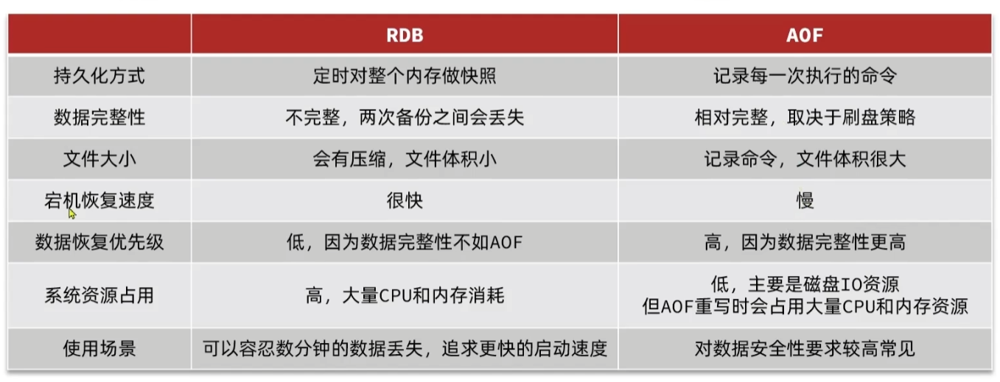


#### RDB

* 原理

  * 定时将内存中所有数据都记录到磁盘中，Redis实例故障重启后，从磁盘读取恢复到内存
  * redis-server在关闭时会自动保存rdb
  * 后台rdb，底层使用fork机制，共享主进程的内存

* copy-on-write技术

  * 当主进程执行读操作时，访问共享内存
  * 当主进程执行写操作时，会拷贝一份数据，执行写操作
  * 极端情况下，可能会导致rdb期间内存翻倍，所以要预留一些内存资源

* 指令

  * 在redis-cli中执行save命令，会阻塞主进程，影响数据读写
  * 在redis-cli中执行bgsave命令，会在后台进程存储数据，不会阻塞主进程

* 缺点

  rdb在redis.conf相关配置：

```sh
# 保存时机

# 900秒内，至少有1个key被修改，则执行bgsave
save 900 1

# 300秒内，至少有10个key被修改，则执行bgsave
save 300 10

# 60秒内，至少有10000个key被修改，则执行bgsave
save 60 10000

# 禁用rdb
save ""


# 是否压缩，建议不开启
rdbcompression no

# rdb文件名称
dbfilename dump.rdb

# rdb保存路径，默认在redis-server运行目录
dir ./

```


#### AOF

* 原理
  * Redis处理的每一个==写==命令都会记录在AOF文件，可以看做是命令的日志文件
  * `appendfsync always`由主进程完成写磁盘，安全性高性能差
  * `appendfsync everysec`主进程只放入缓冲区，其他线程写如磁盘
* AOF重写机制
  * 对同一个key的多次操作，只有最后一次有效
  * 执行命令`bgrewriteaof`可以在后台重写AOF
  * 有效降低AOF文件的大小

* 配置

```sh
# 开启AOF，默认no
appendonly yes

# AOF文件名
appendfilename "appendonly.aof"


# 保存时机

# 每一个写命令执行
appendfsync always

# 先放入缓冲区，每秒执行一次（默认）
appendfsync everysec

# 先放入缓冲区，由操作系统决定
appendfsync no
```


### 主从

* 概念
  * 单节点Redis并发能力有上限，搭建主从集群，实现读写分离，可以扩展Redis的并发能力
  * master / slave，slave也叫做replica
  * 从节点不能写入数据

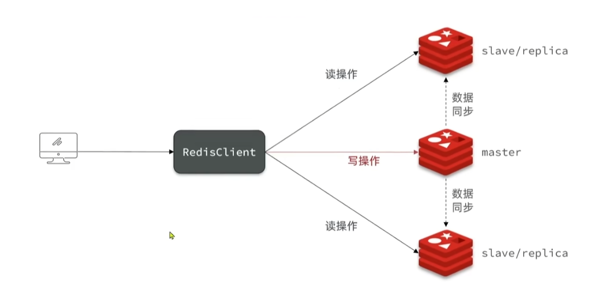

* 配置
  * 打开RDB、关闭AOF
  * 复制三份配置
  * 三份配置设置不同端口
  * 三份配置设置不同RDB文件保存位置
  * 三份配置添加`replica-announce-ip 当前IP地址`配置
  * 从节点配置`slaveof 主节点IP 主节点端口`
  * 或在从节点执行 `slaveof 主节点IP 主节点端口`
* 查看主从配置信息
  * 执行`info replication`
  * role，角色
* 数据同步原理
  * 做全量同步
    * 从节点请求同步，主节点根据repl id判断是第一次同步，则拒绝增量同步，执行全量同步
    * 主节点生成数据版本号发送给从节点
    * 主节点会执行bgsave生成rdb发送给从节点
    * 新命令存储到repl_baklog，发送repl_baklog给从节点
  * 增量同步
    * 仓节点请求同步，主节点根据repl id判断不是第一次同步，则执行增量同步
    * 主节点发送repl_baklog中从节点offset之后的数据给从节点
    * 如果从节点断开时间过久，导致repl_baklog中offset之后的数据已经被覆盖，那么只能再次做全量同步
* 优化全量同步的性能
  * 在master配置中开启无磁盘复制，避免磁盘读写，`repl-diskless-sync yes`
  * 减少单节点Redis内存占用
  * 提高repl_baklog大小，避免全量同步
  * 提高故障恢复时间，避免全量同步
  * 链式主从同步，由部分从节点作为数据源，向其他从节点进行数据同步，`slaveof 从节点IP 从节点端口`
* 如何解决主从同步延迟造成的数据不一致
  * ==强一致性读==：强一致性读是指，在从节点读取数据之前，先向主节点发送一个同步命令（SYNC），让主节点将最新的数据发送给从节点，并等待从节点完成数据载入后再返回结果。这样可以保证从节点总是读到最新的数据，但是会增加网络开销和延迟，并降低并发性能。
  * ==使用读写分离策略==：读写分离策略是指，在设计业务逻辑时，区分哪些数据需要强一致性，哪些数据可以容忍一定的延迟。对于需要强一致性的数据，可以在主节点进行读写操作；对于可以容忍一定延迟的数据，可以在从节点进行只读操作。这样可以减少不必要的同步开销，并提高系统的吞吐量和响应速度。


### 哨兵

* 简单主从存在的问题
  * 固定master存在单点故障可能
  * 哨兵监控（看门狗），也存在单点故障可能
* 哨兵功能
  * 哨兵，Sentinel
  * 哨兵不断检查master和slave是否按预期工作
  * 哨兵检测到，master故障，会将一个slave提升为master
  * 哨兵会将故障恢复后的主从信息，主动推送给redis客户端
* 哨兵原理
  * 基于心跳机制监测服务
    * 哨兵节点发现某节点未在规定时间响应，则认为实例主观下线
    * 超过指定数量（quorum）的sentinel都认为该实例主观下线，则该示例客观下线
    * quorum最好超过实例数量的一半
  * 新master选举原理
    * 排除断开master超过指定值（down-after-milliseconds*10)的slave节点
    * 选举最小slave-priority值的从节点
    * slave-priority为0则不参与选举
    * 如果未选出，则选举offset值最大的节点，越大说明数据越新
    * 如果未选出，则选举id小的节点
  * 故障恢复流程
    * 哨兵给选举的slave发送`slaveof no one`命令，slave会称为master
    * 哨兵给其余slave发送`slaveof 新masterIP 新master端口`
    * 哨兵将故障节点标记为slave，当故障节点恢复后，自动成为slave节点
* 哨兵配置
  * 哨兵也需要多个实例形成集群


* 哨兵配置文件

```sh
# 哨兵端口
port 27001 

# 哨兵声明ip，避免多个IP引起混乱
sentinel announce-ip 声明IP

# 集群配置
sentinel monitor 集群名称 masterIP masterPort quorum数量

# 断开时间
# 默认为30秒
# 判断主节点主观下线所需的时间长度
sentinel down-after-milliseconds 集群名称 毫秒

# 故障转移最大时间
# 默认为3分钟
# 如果在这个时间内，Sentinel没有完成故障转移，那么故障转移将会被取消或者重试
sentinel failover-timeout 集群名称 毫秒
```


* python使用哨兵

```py
# 安装
# pip install redis
# pip install redis-py-sentinel


# 导入模块
from redis.sentinel import Sentinel

# 创建哨兵对象，指定哨兵节点的地址和端口
sentinel = Sentinel([('localhost', 26379), ('localhost', 26380), ('localhost', 26381)])

# 获取主节点的连接对象
master = sentinel.master_for('mymaster', socket_timeout=0.1)

# 获取从节点的连接对象
slave = sentinel.slave_for('mymaster', socket_timeout=0.1)

# 在主节点上执行写操作
master.set('foo', 'bar')

# 在从节点上执行读操作
slave.get('foo')


```


### 分片集群

* 概念
  * 集群中有多个master，每个master保存不同数据
  * 每个master可以有多个slave，组成主从结构
  * master之间彼此监测，不需要哨兵


#### 搭建分片集群

* 分片集群redis-server配置

```sh
# 集群端口
port 6379

# 开启集群
cluster-enabled yes

# 集群配置文件名称（生成地址）
cluster-config-file /tmp/6379/nodes.conf

# 节点心跳失败的超时时间
cluster-node-timeout 5000

# 持久化文件存放位置
dir /tmp/6379

# 绑定地址
bind 0.0.0.0

# 后台运行
daemonize yes

# 注册IP
replica-announce-ip 192.168.150.101

# 保护模式
protected-mode no

# 数据库数量
databases 1

# 日志
logfile /tmp/6379/run.log
```


* 启动集群

```sh
# 启动集群

# 根据单Master对应从节点数量，推算集群结构
# master配1个从节点，集群内有6个节点，则三主三从
redis-cli --cluser create --cluster-replicas 单Master对应从节点数量 节点IP:节点Port 节点IP:节点Port

# 查看集群信息
redis-cli -p 7001 cluster nodes


```


#### 散列插槽（hash slot）

* 介绍
  * Redis自动将master节点映射到0~16383工16384个插槽上
  * 集群信息中可以看到分配结果
* 原理
  * redis根据数据key的CRC16算法得到一个hash值，然后对16384取余，余数为所属slot
  * 如果key中包含`{}`且当中有一个有效字符，则使用`{}`中的内容计算哈希值
  * 连接其中一个节点存入数据，集群内部会对数据进行路由


#### 集群伸缩

* 添加节点
  * 新增配置并启动redis-server
  * `redis-cli add-node 新IP:新Port 旧IP:旧Port`，旧IP、Port是为了找到集群
* 重新分片
  * `redis-cli --cluster reshard 任意节点IP:任意节点Port`，任意节点IP、Port是为了找到集群
* 删除节点
  * 


#### 故障转移

* 介绍
  * 集群虽然没有哨兵，但是有故障转移
* 手动故障转移
  * 在需要维护的节点执行 `cluster failover`
* 原理
  * 默认按下图流程执行
  * 使用force参数，可以忽略offset校验
  * 使用takeover参数，可以忽略全部流程

​	

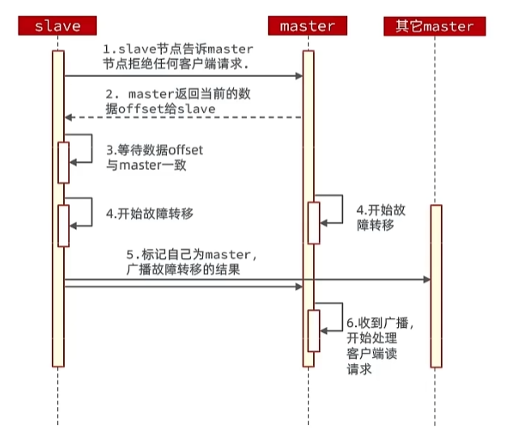


#### python使用分片集群

```python
# 安装
# pip install redis-py-cluster


# 导入模块
from rediscluster import RedisCluster

# 创建分片集群对象，指定启动节点的地址和端口
startup_nodes = [
    {'host': '127.0.0.1', 'port': 7000},
    {'host': '127.0.0.1', 'port': 7001},
    {'host': '127.0.0.1', 'port': 7002},
]

rc = RedisCluster(startup_nodes=startup_nodes, decode_responses=True)

# 在分片集群上执行操作
rc.set('foo', 'bar') # 写入数据
print(rc.get('foo')) # 读取数据

```


### 多级缓存

* NGINX负载均衡
  * NGINX集群部署，并使用一个NGINX作为反向代理分发请求
* NGINX本地缓存
  * 在NGINX中实现本地缓存功能
  * OpenResty提供shard dict，在nginx多个worker之间共享数据，实现缓存功能
* OpenResty分发和Redis缓存前置
  * 使用OpenResty工具，Lua编写业务逻辑，访问Redis，未命中才访问进程
  * ==OpenResty可以根据url中的字段对tomcat做一次逻辑分发，使缓存均匀分布在进程中==
* 进程缓存
  * 各种语言的缓存库

* 缓存预热
  * 冷启动是Redis并没有缓存，需要做一次缓存预热
  * 缓存预热需要根据统计信息，只预热热点数据
* 缓存同步策略
  * 设置有效期：到期自动删除，再次查询时更新
    * 优点：简单，方便
    * 缺点：时效性差，缓存过期之前可能不一致
    * 场景：更新频率较低，时效性要求低的业务
  * 同步双写：在修改数据库的同时，直接修改缓存
    * 优势：时效性强，缓存与数据库强一致
    * 缺点：有代码侵入，耦合度高
    * 场景：对一致性、时效性要求较高的缓存数据
  * 异步通知：修改数据库时发送事件通知，相关服务监听到通知后，修改缓存数据
    * 优势：低耦合，可以同时通知多个缓存服务
    * 缺点：时效性一般，可能存在中间不一致状态
    * 场景：时效性要求一般，有多个服务需要同步
* 监听mysql binlog，发送异步通知
  * Cancal会在数据表中记录当前读取的offset
  * cancal进程、集群监听数据库或表
  * 使用cancal-client连接cancal，当监听表，insert、update、delete时，cancal-client自动回调处理函数


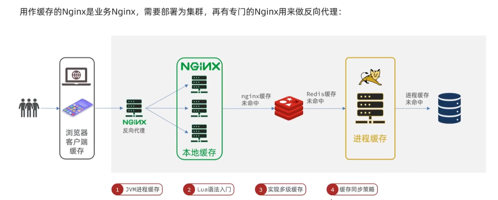


#### binlog监听

* MySQL的binlog是什么

> MySQL的binlog是一种用于记录数据库表结构变更以及表数据修改的二进制日志，它只会记录表的变更操作，但不会记录select和show这种查询操作
>
> * 作用
>
>   - **数据恢复**：可以通过binlog来恢复被误删或者损坏的数据，或者回滚到某个时间点的数据状态
>
>   - **主从复制**：可以通过binlog来实现主从复制，即主节点将binlog传给从节点，从节点接收后执行binlog中的事件，从而保持与主节点的数据一致性
>
>   - **审计**：可以通过binlog来进行审计，判断是否对数据库进行了注入攻击或者非法操作
>
> * 特点
>
>   - **二进制格式**：binlog是以二进制格式存储的，不易于人类阅读，需要使用mysqlbinlog工具来查看或者转换为文本格式
>
>   - **事件形式**：binlog中记录的是对数据库的各种修改操作，用来记录修改操作的数据结构是Log event。不同的修改操作对应不同的Log event类型，如Query event、Row event、Xid event等
>
>   - **异步模式**：binlog是异步写入的，即主节点在执行写操作后，并不会等待从节点完成数据同步，而是直接返回给客户端。这样可以提高性能，但也可能导致主从数据不一致或者丢失
>
>   - **可配置性**：binlog可以通过一些参数来配置，如binlog_format、expire_logs_days、max_binlog_size等。这些参数可以影响binlog的记录模式、清理时间、文件大小等

* 触发器和binlog的区别和联系

> 触发器和binlog都是MySQL中的一种功能，但它们的作用和实现方式不同。
>
> 触发器是一种在数据库中定义的特殊的存储过程，它可以在某个表上的某个事件（如插入、更新或删除）发生时自动执行一些操作1。触发器的目的是为了实现业务逻辑或数据完整性的检查。
>
> binlog是一种用于记录数据库表结构变更以及表数据修改的二进制日志，它只会记录表的变更操作，但不会记录select和show这种查询操作2。binlog的目的是为了实现数据恢复或主从复制。
>
> * 联系：
>
>   * 触发器本身也会产生binlog，因为触发器执行的操作也会修改表的数据。
>
>   * 触发器可以根据binlog_format参数的设置来决定使用基于语句（STATEMENT）还是基于行（ROW）的方式来记录binlog。
>
> * 区别：
>
>   * 触发器是由用户自定义的，可以根据业务需求来编写触发器的逻辑；binlog是由系统自动生成的，用户不能直接修改或控制binlog的内容。
>
>   * 触发器是在表级别上定义的，每个表可以有多个触发器，每个触发器可以对应不同的事件和时机；binlog是在数据库级别上记录的，每个数据库只有一个binlog文件，记录所有表的变更操作。
>
>   * 触发器可以访问或修改其他表的数据，甚至可以调用其他存储过程或函数；binlog只能记录当前表的数据变化，不能涉及其他表或对象。

* Python监听binlog

> 使用mysql-replication模块：mysql-replication是一个用于Python的MySQL binlog解析和复制模块，它可以通过BinLogStreamReader类来创建一个binlog流对象，并通过指定一些参数来过滤或控制监听的事件

```py
# 导入模块
from pymysqlreplication import BinLogStreamReader
from pymysqlreplication.row_event import DeleteRowsEvent, UpdateRowsEvent, WriteRowsEvent

# 创建binlog流对象，指定连接信息和过滤条件
stream = BinLogStreamReader(
    connection_settings = {"host": "127.0.0.1", "port": 3306, "user": "root", "passwd": "123456"},
    server_id = 1, # 伪装成从节点的ID，必须唯一
    blocking = True, # 是否阻塞等待后续事件
    resume_stream = True, # 是否从最新位置开始读取
    only_events = [DeleteRowsEvent, UpdateRowsEvent, WriteRowsEvent], # 只监听增删改操作
    only_schemas = ["test"], # 只监听test数据库
    ignored_tables = ["log"] # 忽略log表
)

# 遍历binlog流中的事件
for event in stream:
    # 打印事件类型和时间戳
    print(event.event_type, event.timestamp)
    # 遍历事件中的行数据
    for row in event.rows:
        # 打印行数据的变化情况
        if isinstance(event, DeleteRowsEvent):
            print("删除了一行数据：", row["values"])
        elif isinstance(event, UpdateRowsEvent):
            print("更新了一行数据：", row["before_values"], "->", row["after_values"])
        elif isinstance(event, WriteRowsEvent):
            print("插入了一行数据：", row["values"])

# 关闭binlog流对象
stream.close()

```

* MySQL提供的监听binlog的接口

> * MySQL Replication Listener Library：这是一个用于C/C++的库，它可以让开发者通过编程的方式来访问和解析binlog，从而实现数据同步、分析或恢复等功能。这个库提供了一些类和函数来创建和管理binlog监听器（listener），并处理binlog事件（event）。
> * mysqlbinlog：这是一个用于命令行的工具，它可以让用户通过指定参数来读取和解析binlog，从而实现数据恢复或审计等功能3。这个工具提供了一些选项来控制输出格式、过滤条件、起止位置等。
> * mysqlbinlogapi：这是一个用于Python的模块，它可以让用户通过调用API来读取和解析binlog，从而实现数据同步、分析或恢复等功能。这个模块提供了一些类和方法来创建和管理binlog连接（connection），并处理binlog事件（event）。


## 最佳实践

### Redis键值设计


#### 键设计

* 遵循基本格式，`业务名称:数据名称:id`
  * 可读性强
  * 避免key冲突
  * 方便管理
* 长度不超过44字节
  * 底层存储方式包括int、embstr、raw三种
  * 小于44个字节时使用embstr，可以连续存储
* 不包含特殊字符


#### 超大数据

* BigKey
  * 数据量大，例如超过5MB的String
  * 成员数多，例如ZSET的成员数量为1w
  * 成员数据量大，例如Hash的成员总大小100MB
* 建议
  * 单个key的value小于10KB
  * 对于集合类型的key，建议元素数量小于1000
* BigKey危害
  * 网络阻塞，少量QPS就可能导致带宽使用率被占满，导致Redis实例、物理机变慢
  * 数据倾斜，数据分片、内存占用不均衡
  * Redis阻塞，对hash、list、zset等做运算耗时较长
  * CPU压力， BigKey序列化和反序列化导致CPU使用率飙升

* 分析BigKey
  * redis-cli --bigkeys
    * 信息不太完整
  * 在线scan扫描
    * 利用strlen、hlen判断key长度
    * scan可以渐进扫描，不要使用keys*
  * RDB快照分析
    * Redis-Rdb-Tools
  * 监控进出网络数据
* 处理BigKey
  * 异步删除
    * Redis4.0以后支持unlink异步删除，不阻塞主线程
    * Redis4.0以前，使用hscan、sscan、zscan等扫描删除
  * 字段打散
    * 如json存储，user:1 '{"name": "Jack", "age": 21}'
    * 打散为string，user:1:name   user:1:age
    * 打散为hash，user:1 {"name": "Jack", "age": 21}
  * hash
    * hash的field超过500时，会使用哈希表而不是ZipList，内存占用较多
    * 可以通过hash-max-ziplist-entries修改上限
    * hash打散key，如`key:分区ID`存储100个field


### 批处理

* 批处理优点
  * 批处理可以更高效的处理，减少网络通信延迟
* 批处理缺点
  * 一次性处理过多数据，可能造成redis阻塞
* 批处理命令
  * string使用mset
  * hash使用hmset
  * set使用sadd
* pipeline管道
  * 一次性发送任意命令
  * 多个命令之间不具备原子性
* 集群批处理
  * pipeline的key必须在一个插槽中，如果在不同插槽中会导致执行失败
  * 先区分slot再分别pipeline
  * 使用`{}`hash tag，相同hash tag一定在一个slot中


### 服务端优化


#### 持久化配置

* 缓存Redis实例尽量不要开持久化功能
* 建议关闭RDB，使用AOF
* 利用脚本定期在slave节点做RDB
* aof的rewrite会使用大量cpu，应避免频繁bgrewrite
  * `auto-aof-rewrite-percentage 100`
  * `auto-aof-rewrite-min-size 64mb`
* 避免aof在rewrite期间做aof
  * rewrite期间aof会导致阻塞
  * `no-appendfsync-on-rewrite=yes`


#### 服务器配置

* 内存配置需要给RDB for和AOF rewrite预留足够控件
* 单个Redis示例内存不要太大，如4G、8G、加快fork速度，减少主动同步、数据迁移压力
* 不要与CPU密集型应用部署在一起
* 不要与高硬盘负载应用部署在一起


#### 慢查询

* 慢查询配置
  * `slowlog-log-slower-than`慢查询阈值，单位微妙，默认10000，建议1000
  * `slowlog-max-len`慢查询日志长度，默认128，建议1000
* 慢查询命令
  * `slowlog len`查询慢查询日志长度
  * `slowlog get n`读取n条慢查询日志
  * `slowlog reset`清空慢查询列表


#### 安全配置

* Redis设置密码
* 使用rename-command禁止线上使用：keys、flushall、flushdb、config set等命令
* bind限制外网网卡
* 开启防火墙
* 禁止root账户启动Redis
* 不使用默认端口


#### 内存管理

* info memory
* memory help，redis自带内存工具
* memory key
* memory doctor 


### 集群优化

* 集群节点不能多于1000，相互通信会占用带宽
* 单物理机中不能运行太多redis实例
* cluster-node-timeout要合适
* 集群下不能跨slot使用lua和事务


## 底层原理


### 数据结构

#### 动态字符串SDS

* 概念
  * 字符串是Redis的基础，Key或者Member都是字符串
  * 为什么Redis不适用C语言中的字符串
    * 获取字符串长度需要通过计算
    * 非二进制安全，不支持在字符串中间存在数值0
    * 不可修改
  * SDS
    * Redis构建的字符串结构
    * Simple Dynamic String，简单动态字符串
* SDS内存分配机制
  * 小于1M时，空间翻倍+1
  * 大于1M时，增加1M + 1
  * 内存预分配，减少向内核申请内存的次数
* SDS优势
  * 获取字符串长度时间复杂度为1
  * 支持动态扩容
  * 减少内存分配次数
  * 二进制安全


```c
// 定义SDS结构体
struct sdshdr8 {
    // 记录buf数组中已使用字节的数量
    // 等于SDS所保存字符串的长度
    uint8_t len;

    // 记录buf数组中未使用字节的数量
    uint8_t alloc;

    // 类型标识，用第3-7位来表示类型，其余位未使用
    unsigned char flags;

    // 字节数组，用于保存字符串
    char buf[];
};
```


#### IntSet集合

* 概念
  * IntSet是Set的其中一种实现方式
  * 基于整数数组实现
* 优化
  * 长度可变
  * 有序
  * 根据元素的大小自动调整编码方式，以节省内存空间
  * 利用二分查找算法快速地判断一个元素是否存在于集合中，或者找到一个元素的插入位置
  * 可以保证集合中不会出现重复的元素
  * 不满足条件时Redis会使用哈希表（dict）作为Set数据类型的底层实现
* 失效条件
  * 元素个数不超过set-max-intset-entries配置项的值，默认为512
* 元素扩容算法
  * 倒序讲内部元素一次复制到新位置
  * 正序会被覆盖


```c
typedef struct intset {
    // 记录集合中元素的编码方式，有三种可能：
    // INTSET_ENC_INT16（2字节）
    // INTSET_ENC_INT32（4字节）
    // INTSET_ENC_INT64（8字节）
    uint32_t encoding;

    // 记录集合中元素的个数
    uint32_t length;

    // 一个柔性数组，用于存储集合中的元素，按照从小到大的顺序排列
    int8_t contents[];
} intset;
```


#### Dict字典

* 概念
  * 字典、哈希表
* 组成结构
  * 哈希表，DictHashTable
  * 哈希节点，DictEntry
  * 字典，Dict
* 优化
  * 掩码 = 表大小 - 1，使用与运算求哈希值比取余快
  * 根据负载因子自动扩容收缩，负载因子 = 已用 / 容量
    * 大于等于1，闲时扩容
    * 大于5，立即扩容
    * 小于0.1时，收缩
  * 为了不阻塞主线程，rehash是渐进式完成的
* rehash过程
  * 计算新的大小
    * 扩容到 第一个大于等于 `已使用 + 1` 的 `2**n`
    * 收缩到 第一个大于等于 `已使用 + 1` 的 `2**n`
  * 按照新的大小申请空间
  * 重新构建哈希表


#### ZipList压缩链表

* 优化
  * 省略指针，节约了指针内存
  * 特殊的双端列表
  * 内存连续
  * 环形使用内存
  * Item或Entry不固定大小，节约内存
* Entry内部构造
  * 保存前一个节点的长度
  * 编码属性
  * 节点类型

* 问题
  * 增删数据可能造成连续更新


#### QuickList

* 超出ZipList最佳上限时，使用QuickList
* QuickList中的每一个节点都是ZipList

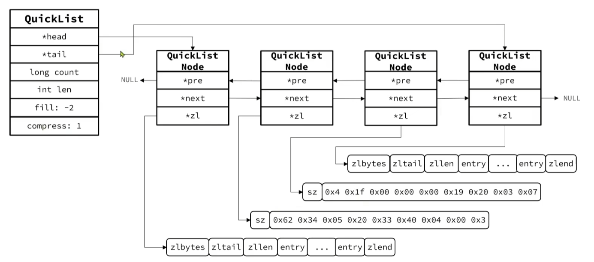


#### SkipList跳表

* QuickList问题
  * QuickList从中间查询效率很低
* SkipList改进
  * 元素按照升序排列存储
  * 节点可能包含多个指针
  * 指针跨度可以不同，是1到32的随机数
  * 增删改查效率与红黑树基本一致，实现却更加简单


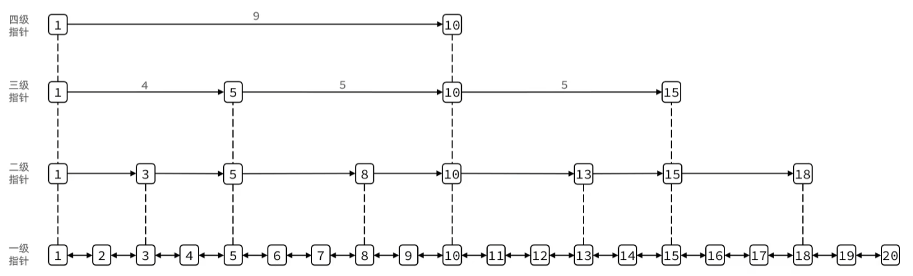


#### RedisObject

* 封装以上所有数据结构

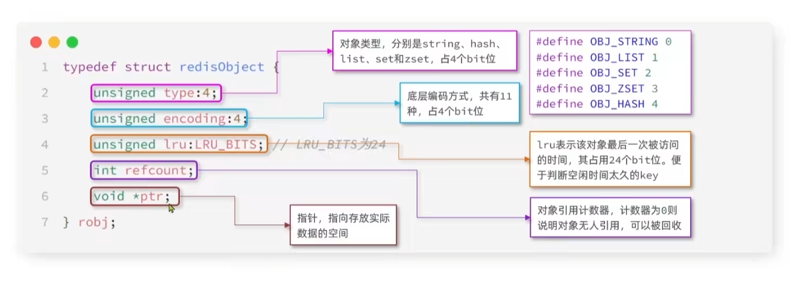

* 编码类型

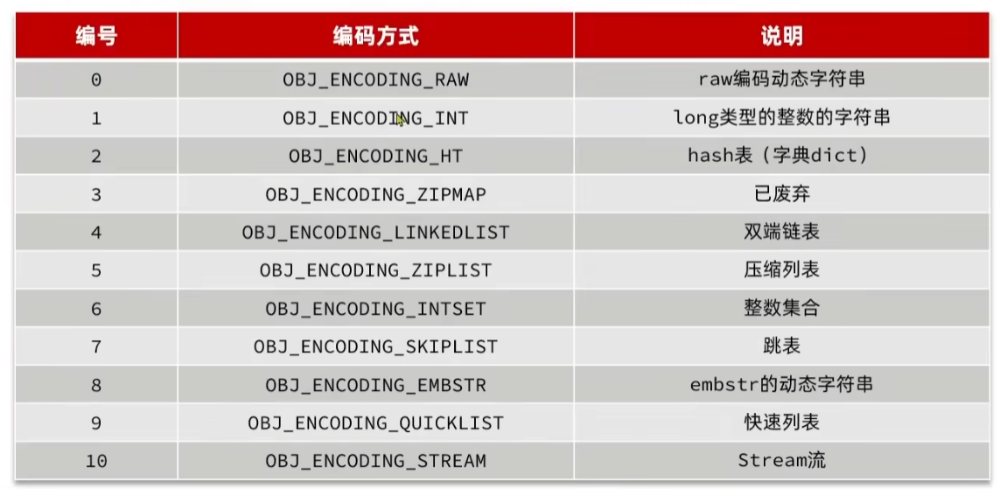

* 数据类型与编码类型对应关系

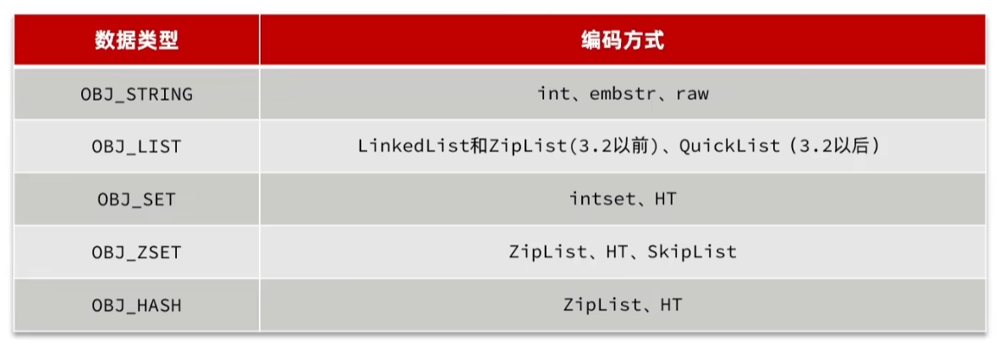

#### 五种数据类型

* string
  * 基本编码方式是RAW，即SDS
  * 小于等于44字节时，使用EMBSTR，字符串SDS与RedisObject合为一个整体，一起申请内存
  * 存储的字符串是整数时，保存为INT，直接存储在RedisObject的指针位

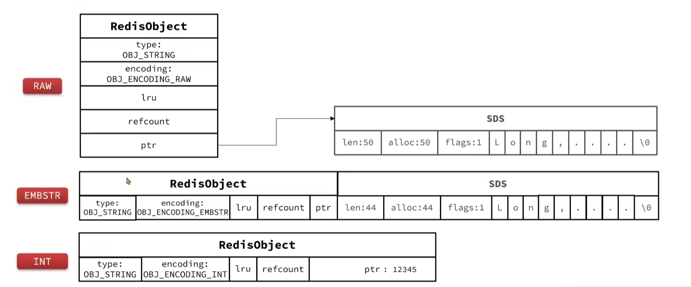


* List
  * LinkedList，普通链表，内存占用高，内存碎片多
  * ZipList，压缩列表，内存占用地，存储上限低
  * QuickList，LinkedList + ZipList，可以从双端访问，内存占用较低，包含多个ZipList


* Set
  * 所有元素都是整数，且元素数量不超过`set-max-intset-entries`是使用IntSet
  * 其余采用HashTable Dict，使用key存储member，value为NULL


* Zset
  * 默认使用ZipList结构来节省内存
    * 元素数量小于`zset_max_ziplist_entries`，默认128
    * 每个元素都小于`zset_max_ziplist_value`，默认64
  * 结合SkipList和HT（Dict）
    * SkipList排序，并存储score和element
    * HT键值存储，快速查找
    * 内存占用大


* Hash
  * 默认采用ZipList节省内存
    * 元素数量小于`hash-max-ziplist-entries`，默认512
    * 任意元素超过`hash-max-ziplist-value`，默认64字节
  * 使用Zset Dict部分的代码


### 网络模型

* 什么是内核空间和用户空间
  * 操作系统内核本身也是程序
  * 操作系统内核本身也需要消耗系统资源
  * 为了避免用户应用导致冲突和崩溃，进程的寻址空间区分了内核控件和用户空间，程序指令也区分了权限
* 什么是内核态和用户态
  * 用户空间只能执行受限的命令（Ring3），而且不能直接调用系统资源，必须通过内核接口访问
  * 内核空间可以执行特权命令（Ring0），调用一切系统资源
  * 程序运行在内核空间时，称做内核态
  * 程序运行在用户空间时，称做用户态
  * 程序运行时在两个状态间切换
* IO程序内核态用户态切换示例
  * 写数据到设备，需要将用户缓冲数据COPY到内核缓冲区，然后写入设备
  * 从设备读数据，需要从设备读取数据到内核缓冲区，然后COPY到用户缓冲区
* 以读取数据为例，读取数据分为两阶段
  * 内核等待数据
  * 将数据从内核控件copy到用户空间

* 《UNIX网络编程》总结的5中IO模型
  * 阻塞IO，Blocking IO
    * 用户进程在两阶段都处于阻塞状态
  * 非阻塞IO，Nonblocking IO
    * 等待数据的阶段是非阻塞的
    * COPY数据的阶段是阻塞的
  * IO多路复用，IO Multiplexing
    * 本质上是使用非阻塞IO的一种框架
    * 类似于收银员让想好的顾客先点餐，没想好的在一边想
  * 信号驱动IO，Signal Driven IO
    * 注册信号处理回调给内核
    * 内核回调，用户读取数据
    * 缺点
      * 信号较多时，信号队列可能溢出
      * 内核与用户空间信号交互性能较低
  * 异步IO，Asynchronous
    * 内核完成两阶段读取后，再返回给用户态执行
    * 缺点
      * 内核压力过大时，用户态需要主动限流，限流实现较为复杂

* 其中IO多路复用有三种形式
  * select
  * poll
  * epoll
* epoll改进点
  * select和poll只会通知用户进程有fd就绪，但是需要用户进程逐个遍历FD来确认
  * epoll会直接通知用户进程FD就绪，并把FD写入用户空间
* 操作系统的IO是同步和异步异步
  * IO操作是同步还是异步，主要看第二阶段，即内核空间与用户空间的COPY过程是同步还是异步
  * 操作系统的5中IO模型，只有异步IO是异步的


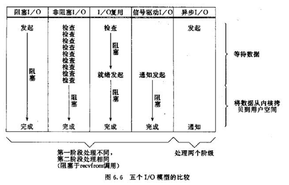


#### IO多路复用，IO Multiplexing

* select
  * 最早实现
  * 将需要监听的fd_set传给内核
  * 内核将fd_set中可以读取的fd标记为移除，保留未读取的返回给用户空间，并返回可以读取的个数
  * 用户需要自己根据标记位，查找哪个fd可以读取
  * 由于fd_set的标记为为1024个比特位，所以只能监听1024个fd

* poll
  * 将需要监听的监听数组、事件传给内核
  * 理论上监听数组大小没有限制
  * 实际性能没有太大提升

* epoll

  * 红黑树保存需要监听的fd
  * 链表记录就绪的fd
  * 使用时需要创建一个eventpoll结构体，用户可以进行增删改
  * 用户调用epoll_wait等待，有就绪事件或超时时，内核将就绪数量和fd返回给用户
  * 性能巨大提升
  * 监听数量没有限制

* epoll有两种事件通知方式

  * LT，LevelTriggered，会重复通知多次，直至数据处理完成
    * LT模式是默认的处理方式
    * 但是重复通知性能较差

  * ET，EdgeTriggered，只会通知一次，不管数据是否处理完成
    * 使用相对复杂
    * 性能好

* 使用ET模式

  * 方法1：如果数据未读完，用户手动将未读完的数据记录在就绪数组中
  * 方法2：使用非阻塞方法读取fd，直到处理完成


#### Redis线程

* Redis是单线程还是多线程
  * 核心命令处理是单线程的
  * 整个Redis是多线程的
    * Redis 4.0 引入多线程，异步处理耗时较长的命令，如unlink
    * Redis 6.0 在核心网络模型（IO多路复用部分）中引入多线程
    * 注意bgsave是多进程不是多线程
* 为什么使用单线程
  * 除持久化外，纯内存操作非常快，性能瓶颈是网络延迟而不是执行速度，因此多线程并不会带来巨大的性能提升
  * 多线程会导致上下文切换，带来不必要的开销
  * 多线程需要考虑线程安全，复杂度增高，锁使用不当可能会降低性能


#### Redis网络模型


#### RESP协议


#### 基于Socket自定义Redis客户端


### 内存回收

#### 过期策略

* 惰性删除，访问时判断是否删除
* 周期删除，redis事件循环前调用定时任务
* 慢删除
* 快删除


#### 淘汰策略

* 任何命令之前都会检查内存
