# Redis

## 简介

* Redis是Remote Dictionary Server的缩写，远程字典服务
* 诞生与2009年
* 使用C语言编写
* 基于内存
* 单线程，所有命令串行
* Redis是键值对存储的NoSQL数据库
* NoSQL是非关系型数据库，也可以理解成Not only SQL
* 用于缓存一些经常用到的数据，提高读写速度

### redis优点

* 速度快
  * 基于内存
  * IO多路复用、网络是IO密集型不是CPU密集型
  * C语言、代码质量好
* 支持多种数据类型，多种数据类型指的是值类型，键类型只有字符串
  * 字符串，String，“abc”
  * 哈希，Hash，{key: "value"}
  * 列表，List，[1, 2, 3]
  * 集合，Set，{A, B, C}
  * 有序集合，Zset（SortedSet），{A: 1, B: 2, C: 3}
  * GEO，{A: (120.3, 30.5)}
  * BitMap，0101010111010100
  * HyperLog，0101010111010100
* 可选持久化
  * RDB，Redis Database Backup file，将Redis在内存中的数据库记录定时dump到磁盘
  * AOF，Append Only File，将Redis的操作日志以追加的方式写入文件
* 支持多种编程语言
* 分布式、高可用、主从、集群、分片集群

### SQL与NoSQL比较

* 结构化，Structured

  * SQL是结构化的，对数据有格式的要求，有表、数据类型、约束、外键关系
  * NoSQL对结构没有强约束，约束的类型取决于NoSQL的类型
    * 键值型，要求键值格式，如Redis
    * 文档型，要求json格式，如MongoDB
    * 图数据库，要求关系，如Neo4j
    * 列数据库，要求列类型，如HBase

* 关系，Relational

  * SQL有强关系约束，可以节约数据存储空间、保持数据一致性
  * NoSQL没有强关系约束，需要用户（程序员）自己维护数据关系

* 查询方式

  * 使用标准化SQL语句，关系型数据库都可以使用通用的查询语言
  * 各种NoSQL根据自身类型定义
    * redis，键值
    * mongodb，JavaScript函数调用
    * elasticsearch，Restfull请求

* 事务特性

  * SQL会保证ACID特性

    * 原子性，atomicity，或称不可分割性
    * 一致性，consistency
    * 隔离性，isolation，又称独立性
    * 持久性，durability

  * NoSQL无事务，只能保持基本一致，满足BASE特性

    * BASE理论是一种对分布式系统中数据一致性的弱化要求

    * 它是对CAP理论中一致性（C）和可用性（A）进行权衡的结果

    * 源于提出者自己在大规模分布式系统上实践的总结，其核心思想是无法做到强一致性，但每个应用都可以根据自身的特点，采用适当方式达到最终一致性。

    * BASE理论是由三个词组的首字母缩写组成的，即：

      - 基本可用（Basically Available）：指分布式系统在出现故障时，仍然可以保证对外提供满足基本需求的服务，但是可能无法保证所有功能都可用。

      - 软状态（Soft State）：指分布式系统中的数据存在中间状态，并且允许在不影响系统整体可用性的情况下，使数据达到最终一致性。

      - 最终一致性（Eventually Consistent）：指分布式系统中所有的数据副本，在经过一段时间的同步后，最终能够达到一致的状态。

* 存储方式

  * SQL基于磁盘
  * NoSQL一般基于内存

* 扩展性

  * SQL表设计完成之后一般只能垂直扩展，没有考虑水平扩展性
  * NoSQL设计之初就考虑水平扩展

* 使用场景

  * SQL
    * 数据结构固定
    * 对数据安全性、一致性要求高
  * NoSQL
    * 数据结构不固定
    * 对一致性、安全性要求不高
    * 对性能要求高

### 应用场景

* 缓存

* 数据共享
* 购物车
* 消息队列
* 计数器
* 限流缓存数据
  * 热点数据的特点，高频读、低频写
  * 用户信息、优惠券过期时间、验证码过期时间、session、token
* 计数器
  * 帖子的浏览数，视频播放次数，评论次数，点赞次数
* 消息队列
  * 秒杀系统
* 社交网路
  * 粉丝、共同好友（可能认识的人），兴趣爱好（推荐商品）
* 排行榜
  * 有序集合
* 发布订阅
  * 粉丝关注
  * 消息通知

## 安装

### docker安装

```sh
# 启动redis，不支持永久存储
docker run --name some-redis -d redis

# 启动redis启动定时存储
docker run --name some-redis -d redis redis-server --save 60 1 --loglevel warning

# 在docker中运行redis-cli
docker run -it --network some-network --rm redis redis-cli -h some-redis
```


### centos安装

```sh
# 安装第三方库
yum install epel
yum install redis
```

## 组件介绍

* redis-server
* reids-sentinel # 监视器，监视、故障转移
* redis-cli # 命令行客户端
* redis-benchmark # 性能测试工具
* redis-check-aof redis-check-dump # 故障修复

## redis客户端

* 自带redis-cli
* RedisInsight，官方UI，提供性能监控、统计分析、图形操作界面、命令行terminal

```bash
# 连接redis-server
redis-cli -h host -p port -a password

# 在bash中测试连通性
redis-cli ping
```

## 配置

配置文件：/etc/redis.conf

```sh
# 守护模式，默认为no
daemonize yes

# 日志级别
loglevel 

# pidfile
pidfile /var/run/redis/redis.pid

# 日志文件，默认为空，不记录日志
logfile /var/log/redis/redis.log

# 日志产生在dir目录
logfile redis.log

# 持久化文件名
dbfilename dump.rdb

# 工作目录，持久化文件路径
dir /var/lib/redis

# 绑定监听IP，127.0.0.1
bind 0.0.0.0

# 端口
port 6379

# 设置密码，无用户名  
requirepass password 

# 数据库数量
databases 16

# redis能够使用的最大内存
maxmemory 512mb
```

开机自启动，/etc/systemd/system/redis.service

```sh
[unit]
Description=redis-server
After=network.target

[Service]
Type=forking
ExecStart=/usr/local/bin/redis-server /usr/local/src/redis-6.2.6/redis.conf
PrivateTmp=true

[Install]
WantedBy=multi-user.target

# systemctl reload
# systemctl start redis
# systemctl status redis
# systemctl enable redis
```

## 系统命令

### 快捷键-命令补全，tab

* 同bash

### 测试连通性，ping

```bash
# 命令式
redis-cli ping

# 交互式
redis-cli
ping

# 参数
-h <hostname>  # 默认localhost
-p <port>      # 默认6379
-a <password>  # 默认无
```

### 清空数据库，flushdb

* flushdb清空当前数据库
* flushall清空全部数据库

### 查看当前数据库信息，info

```markdown
> info
# Server
redis_version:7.0.12
redis_git_sha1:00000000
redis_git_dirty:0
redis_build_id:e9d5a718c4613a7a
redis_mode:standalone
os:Linux 5.15.90.1-microsoft-standard-WSL2 x86_64
arch_bits:64
monotonic_clock:POSIX clock_gettime
multiplexing_api:epoll
atomicvar_api:c11-builtin
gcc_version:12.2.0
process_id:1
process_supervised:no
run_id:4bfa0b4f80e88f8a13ba02bcb2e08c457b011369
tcp_port:6379
server_time_usec:1693626783447660
uptime_in_seconds:859071
uptime_in_days:9
hz:10
configured_hz:10
lru_clock:15905183
executable:/data/redis-server
config_file:
io_threads_active:0

# Clients
connected_clients:3
cluster_connections:0
maxclients:10000
client_recent_max_input_buffer:20480
client_recent_max_output_buffer:0
blocked_clients:0
tracking_clients:0
clients_in_timeout_table:0

# Memory
used_memory:1534112
used_memory_human:1.46M
used_memory_rss:14610432
used_memory_rss_human:13.93M
used_memory_peak:1573320
used_memory_peak_human:1.50M
used_memory_peak_perc:97.51%
used_memory_overhead:867904
used_memory_startup:862208
used_memory_dataset:666208
used_memory_dataset_perc:99.15%
allocator_allocated:1641152
allocator_active:2080768
allocator_resident:5496832
total_system_memory:16731009024
total_system_memory_human:15.58G
used_memory_lua:31744
used_memory_vm_eval:31744
used_memory_lua_human:31.00K
used_memory_scripts_eval:0
number_of_cached_scripts:0
number_of_functions:0
number_of_libraries:0
used_memory_vm_functions:32768
used_memory_vm_total:64512
used_memory_vm_total_human:63.00K
used_memory_functions:184
used_memory_scripts:184
used_memory_scripts_human:184B
maxmemory:0
maxmemory_human:0B
maxmemory_policy:noeviction
allocator_frag_ratio:1.27
allocator_frag_bytes:439616
allocator_rss_ratio:2.64
allocator_rss_bytes:3416064
rss_overhead_ratio:2.66
rss_overhead_bytes:9113600
mem_fragmentation_ratio:9.66
mem_fragmentation_bytes:13098616
mem_not_counted_for_evict:0
mem_replication_backlog:0
mem_total_replication_buffers:0
mem_clients_slaves:0
mem_clients_normal:5400
mem_cluster_links:0
mem_aof_buffer:0
mem_allocator:jemalloc-5.2.1
active_defrag_running:0
lazyfree_pending_objects:0
lazyfreed_objects:0

# Persistence
loading:0
async_loading:0
current_cow_peak:0
current_cow_size:0
current_cow_size_age:0
current_fork_perc:0.00
current_save_keys_processed:0
current_save_keys_total:0
rdb_changes_since_last_save:28
rdb_bgsave_in_progress:0
rdb_last_save_time:1693623830
rdb_last_bgsave_status:ok
rdb_last_bgsave_time_sec:0
rdb_current_bgsave_time_sec:-1
rdb_saves:3
rdb_last_cow_size:225280
rdb_last_load_keys_expired:0
rdb_last_load_keys_loaded:5
aof_enabled:0
aof_rewrite_in_progress:0
aof_rewrite_scheduled:0
aof_last_rewrite_time_sec:-1
aof_current_rewrite_time_sec:-1
aof_last_bgrewrite_status:ok
aof_rewrites:0
aof_rewrites_consecutive_failures:0
aof_last_write_status:ok
aof_last_cow_size:0
module_fork_in_progress:0
module_fork_last_cow_size:0

# Stats
total_connections_received:5
total_commands_processed:977
instantaneous_ops_per_sec:0
total_net_input_bytes:19650
total_net_output_bytes:3366703
total_net_repl_input_bytes:0
total_net_repl_output_bytes:0
instantaneous_input_kbps:0.00
instantaneous_output_kbps:0.00
instantaneous_input_repl_kbps:0.00
instantaneous_output_repl_kbps:0.00
rejected_connections:0
sync_full:0
sync_partial_ok:0
sync_partial_err:0
expired_keys:1
expired_stale_perc:0.00
expired_time_cap_reached_count:0
expire_cycle_cpu_milliseconds:12159
evicted_keys:0
evicted_clients:0
total_eviction_exceeded_time:0
current_eviction_exceeded_time:0
keyspace_hits:161
keyspace_misses:1
pubsub_channels:0
pubsub_patterns:0
pubsubshard_channels:0
latest_fork_usec:2174
total_forks:3
migrate_cached_sockets:0
slave_expires_tracked_keys:0
active_defrag_hits:0
active_defrag_misses:0
active_defrag_key_hits:0
active_defrag_key_misses:0
total_active_defrag_time:0
current_active_defrag_time:0
tracking_total_keys:0
tracking_total_items:0
tracking_total_prefixes:0
unexpected_error_replies:0
total_error_replies:11
dump_payload_sanitizations:0
total_reads_processed:811
total_writes_processed:808
io_threaded_reads_processed:0
io_threaded_writes_processed:0
reply_buffer_shrinks:647
reply_buffer_expands:653

# Replication
role:master
connected_slaves:0
master_failover_state:no-failover
master_replid:31f07ef71b8621d70a9431b3491ef3f65922720a
master_replid2:0000000000000000000000000000000000000000
master_repl_offset:0
second_repl_offset:-1
repl_backlog_active:0
repl_backlog_size:1048576
repl_backlog_first_byte_offset:0
repl_backlog_histlen:0

# CPU
used_cpu_sys:534.714320
used_cpu_user:504.752517
used_cpu_sys_children:0.020097
used_cpu_user_children:0.011331
used_cpu_sys_main_thread:534.710562
used_cpu_user_main_thread:504.744356

# Modules

# Errorstats
errorstat_ERR:count=11

# Cluster
cluster_enabled:0

# Keyspace
db0:keys=2,expires=0,avg_ttl=0
```

### 切换数据库，select

* 默认16个数据库
* id为0到15
* 默认在0号库

```sh
# 切换数据库
select dbid
```

* 非0号数据库，命令行提示符不同

<div align="left">
    <figure>
    	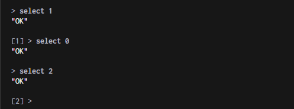
        <figcaption></figcaption>
    </figure>
</div>
### 清屏，clear

```sh
clear
```

### 指定用户名密码，auth

```sh
auth username password
auth password
```

### 获取帮助，help

```sh
# 查看通用命令
help @generic

# 获取string类型帮助
help @string

# 获取命令帮助
help keys
```

### 层级键

* redis不分表，使用层级键可以区分两种表中相同的键
* 使用冒号隔开，如`项目:业务:类型:id`

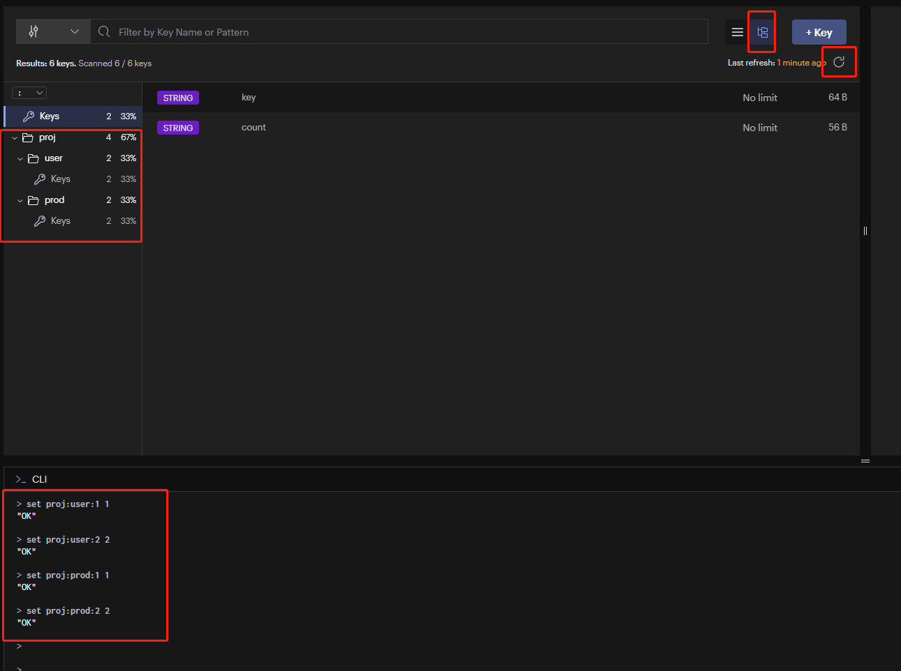


## 键操作

### 查询匹配键，keys

* 星号匹配任意长度字符
* 问号匹配1个字符
* [ab]匹配a或者b
* [a-b]匹配a到b
* [^a]匹配非a

```sh
# 查询匹配键
keys pattern


# 查询所有键
keys *


# 示例
> KEYS *
1) "count"
2) "bit"


# 查询以a开头的键
keys a*


# 查询以a结尾的键
keys *a


# 查询包含a的键
keys *a*


# 示例
> keys c*
1) "count"

> keys *t
1) "count"
2) "bit"

```

### 判断键是否存在，exists

* 存在返回整数1
* 不存在返回整数0

```sh
# 是否存在key
exists key
exists key1 key2 key3

# 示例
> exists count
(integer) 1
```

### 判断键对应值的数据类型，type

```sh
# 查看值的数据类型
type key

# 示例
> type count
"string"
```

### 删除键，del

```sh
# 删除键
del k1

# 删除多个键
del k1 k2 k3

# 示例，返回删除的数量
del k1 k2 k3 k4
(integer) 3
```

### 查询有效期，ttl

* time to live的缩写
* `ttl=-1`代表永久有效
* `ttl=-2`代表已经删除

```bash
# 查询剩余有效期
ttl key

# 示例
ttl key
(integer) 10
```

### 设置有效期，expire

* 单位秒

```sh
ex key 5
expire key 5

# 示例
expire key 5
(integer) 1
```

### 重命名键，rename

```sh
# 重命名
rename k1 k2
```

## 字符串，string

### 存取键值，set、get

* set成功返回字符串"OK"

```sh
# 不加引号默认是字符串
> set key value
"OK"

> get key
"value"   

# 等同于 set key value
# 已存在key可以重新赋值
> set key "value"
"OK"


> get key
"value"   

# 不支持数字
> set key 23
"OK"

> get key
"23"
```

### 不可重新赋值，setnx

* 特性

  * 已存在的值再次赋值失败（返回整数0）

  * setnx，set if not exists

  * setnx成功返回整数1

  * setnx失败返回整数0

* 使用场景

  * 分布式锁
    * 加锁setnx key user1
    * 解锁del key
    * 等待setnx key user2

```sh
# 设置失败，一般两次都会使用setnx

> setnx key2 value
(integer) 1

> setnx key2 value
(integer) 0


# set之后setnx会失败

> set key1 value
"OK"

> setnx key1 value
(integer) 0


# setnx之后set会成功

> setnx kk value
(integer) 1

> set kk value
"OK"

```

### 设置过期键，setex

* 特性
  * n秒后自动删除键
  * 过期后取值返回`(nil)`
* 使用场景
  * 优惠券过期
  * 验证码过期

```sh
# 设置带过期时间的键值
> setex key expire_seconds value
"OK"

# 过期时间内取
> get key
"value"

# 过期时间后取
> get key
(nil)
```

### 追加字符串，append

* 特性
  * 追加字符串
  * ==返回总长度==
  * 最大512M

* 使用场景
  * 长字符串存储

```sh
# append之前已存在的key

> set key 123
"OK"

> append key 456
(integer) 6

> get key
"123456"


# append之前不存在的key

> append key 123
(integer) 3

> append key 456
(integer) 6

> get key
"123456"


# 命令行加空格

> append key 123
(integer) 3

> append key " 456"
(integer) 7

> get key
"123 456"
```

### 批量存取键值，mset、mget

```sh
# 批量存
> mset key1 value1 key2 value2 key3 value3
"OK"

# 批量取
> mget key1 key2 key3
1) "value1"
2) "value2"
3) "value3"
```

### 自增自减，incr、decr、incrby

* 特性
  * 只能对数字字符串操作，非整数字符串报错
  * 返回当前值
* incr，整数增加1
* decr，整数减少1
* incrby，整数增加给定值
* decrby，整数减去给定值
* incrbyfloat，浮点数增加给定值
* decrbyfloat，浮点数减去给定值

```bash
# 键不存在时，直接incr，返回当前值1

> incr count
(integer) 1

> get count
"1"

> incr count
(integer) 2


# 键存在时，使用incr，自增1

> set count 0
"OK"

> incr count
(integer) 1

> incr count
(integer) 2


# incr非整数字符串

> set key value
"OK"

> incr key
"ERR value is not an integer or out of range"


# 键不存在时，直接decr，返回当前值-1

> decr count
(integer) -1

> decr count 
(integer) -2


# incrby 增加给定值

> incrby count 2
(integer) 2

> incrby count 2
(integer) 4


# decrby 减去给定值
> decrby count 2
(integer) -2

> decrby count 2
(integer) -4
```

### 比特流操作，setbit、getbit

* 特性
  * 空比特位补0
  * offset是从左向右偏移
  * bitcount，数比特为1的数
  * bitpos，查找第一个bit为1的位置

```bash
# 设1
setbit key offset 1

# 设0
setbit key offset 0

# 获取
getbit key offset 

# 数比特为1的数，默认为0
bitcount key


# 空比特位补0

> setbit bit 20 1
(integer) 0

> get bit
"\x00\x00\b"


```


## 哈希，Hash

* 特性
  * 元素必须是字符串

* 设置，hset，hash set

```js
// 哈希概念结构
// 为区别redis键和hash内部键，hash内部键称为field
键key: {
    域field：值value,
}
```

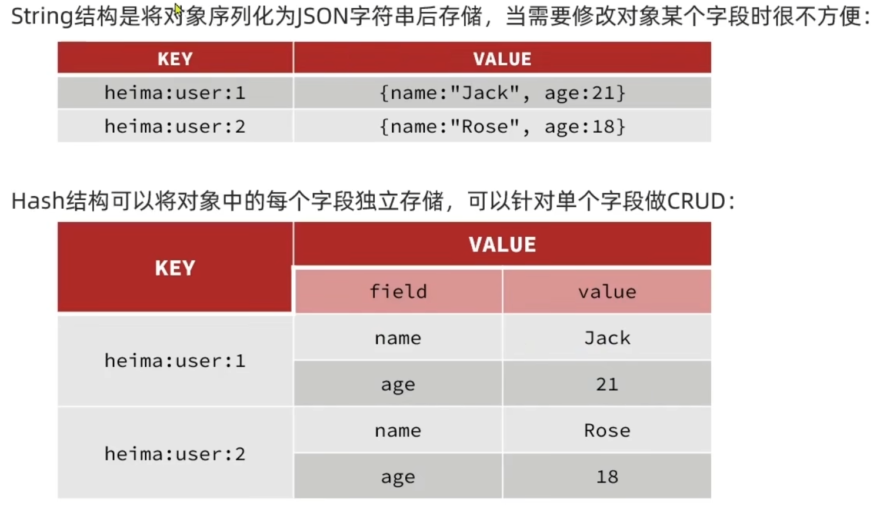

### 设置键域的值，hset

```sh
# 设置一个域值
hset key field value

# 替换域值
hset key field new_value

# 设置多个域值
hset key field1 value1 field2 value2
```

### 获取键域的值，hget

```sh
> hset key field1 value1 field2 value2 field3 value3
(integer) 3

# 获取成功
> hget key field2
"value2"

# 获取的域不存在
> hget key field4
(nil)

# 获取的键不存在
> hget key1 field1
(nil)
```

### 获取键的全部阈值，hgetall

```sh
> hset key field1 value1 field2 value2 field3 value3
(integer) 3

> hgetall key
1) "field1"
2) "value1"
3) "field2"
4) "value2"
5) "field3"
6) "value3"
```

### 获取键的全部域，hkeys

```sh
hkeys key
```

### 获取键的全部值，hvals

```sh
> hset key field1 value1 field2 value2 field3 value3
(integer) 3

> hvals key
1) "value1"
2) "value2"
3) "value3"
```

### 批量设置域值，hmset

```sh
> hset key field1 value1 field2 value2 field3 value3
"OK"
```

### 批量获取域值，hmget

```sh
> hset key field1 value1 field2 value2 field3 value3
(integer) 3

> hmget key field1 field2
1) "value1"
2) "value2"
```

### 删除键域，hdel

```sh
hdel key field
```

### 判断键域是否存在，hexists

```sh
hexists key field
```

### 属性自增自减，hincr，hdecr

```sh
# 自增1
hincr key field

# 自减1
hdecr key field

# 自增多
hincrby key field number

# 自减多
hdecr key field number
```


### 哈希不可重新赋值，hsetnx

```sh
hsetnx key field value
```

## 列表，List

* 特性
  * 也称为数组
  * 列表元素只能是字符串
  * 有序
  * 链表结构，可以快速插入删除
* 左入队，lpush，left push
* 右入队，rpush，right push
* 切片，lrange，list range，==start、end前后都包==
* 插入，linsert，list insert，==可选before、after==
* 长度，llen，list len
* 设置，lset，list set
* 查看，lindex，list index
* 左出队，lpop，left pop
* 右出队，rpop，right pop
* 删除，lrem，list remove，==按值删==
* 清理，ltrim，list trim，==从两头删==
* 阻塞出队，blpop、block left pop

### 入队，lpush，rpush

```sh
# 左插（依次从左边插入）
lpush key value1 value2 value3
# ["value3", "value2", "value1"]

# 右插
rpush key value1 value2 value3
# ["value1", "value2", "value3"]
```

### 获取切片，lrange

```sh
# 切片
lrange key start end

# 获取list中所有值
lrange key 0 -1

# 示例
> lpush key 1 2 3
(integer) 3

> lrange key 0 -1
1) "3"
2) "2"
3) "1"
```

### 按位置获取值，lindex

```sh
# 获取位置index的值
lindex key index
```

### 匹配并插入，linsert

```sh
# 匹配并在后方插入
linsert key after search_value new_value
# 匹配并在前方插入
linsert key before search_value new_value

# 示例
> rpush key 1 2 3
(integer) 3

> linsert key after 2 8
(integer) 4

> lrange key 0 -1
1) "1"
2) "2"
3) "8"
4) "3"

> linsert key before 2 8
(integer) 5

> lrange key 0 -1
1) "1"
2) "8"
3) "2"
4) "8"
5) "3"

> lindex key 3
"8"

```

### 获取长度，llen

```sh
# 获取长度
llen key
```

### 按索引位置修改，lset

```bash
# 修改
lset key index value
```

### 出队，lpop、rpop

```sh
# 出队
lpop key
rpop key
```

### 删除匹配，lrem

* count==0，删除所有value匹配的成员

* count > 0，从左边删除count个值

* count < 0，从右边删除count个值

```sh
# 删除匹配
lrem key count value

# 删除中间示例
> rpush key 0 1 2 3 4 0 5 6 7 8 0
(integer) 11

> lrem key 0 0 # 删除所有0
(integer) 3

> lrange key 0 -1
1) "1"
2) "2"
3) "3"
4) "4"
5) "5"
6) "6"
7) "7"
8) "8"

> del key
(integer) 1

> rpush key 0 1 2 3 4 0 5 6 7 8 0
(integer) 11

> lrem key 1 0 # 从左匹配，删除1个0
(integer) 1

> lrange key 0 -1
1) "1"
2) "2"
3) "3"
4) "4"
5) "0"
6) "5"
7) "6"
8) "7"
9) "8"
10) "0"

> del key
(integer) 1

> rpush key 0 1 2 3 4 0 5 6 7 8 0
(integer) 11

> lrem key -1 0 # 从右匹配，删除1个0
(integer) 1

> lrange key 0 -1
1) "0"
2) "1"
3) "2"
4) "3"
5) "4"
6) "0"
7) "5"
8) "6"
9) "7"
10) "8"
```

### 删除两头，ltrim

```sh
# 删除两头
ltrim key start end

# 删除两头示例
> rpush key 1 2 3 4 5
(integer) 5

> ltrim key 1 3
"OK"

> lrange key 0 -1
1) "2"
2) "3"
3) "4"
```

### 阻塞出队，blpop、brpop

* 在没有元素时会等待指定时间，而不是直接返回nil

```sh
```

## 集合，Set

* 特性
  * 去重，不可重复
  * 无序
  * 查找快
  * 支持并交叉

```sh
```

### 添加，sadd

```sh
sadd key value
sadd key value1 value2 value3

# 示例
> sadd key m1 m2 m3
(integer) 3
```

### 获取所有，smembers

```sh
smembers key
```

### 随机出列n个元素，spop

```sh
spop key # 默认count=1
spop key count=1
spop key count=2
```

### 获取总个数，scard

```sh
scard key
```

### 删除指定值，srem

```sh
srem key value
srem key value1 value2

# 示例
> srem key m1 m2
(integer) 2
```

### 交叉并，sinter、sdiff、sunion

```sh
sinter key1 key2 key3
sdiff key1 key2 key3
sunion key1 key2 key3
```

### 判断是否在集合内，sismember

```sh
sismember key member
```

## 有序集合，Zset，SortedSet

* ==去重并根据score权重值排序==
* 其他同set
* 反转排序在z后面加rev

### 添加，zadd

* 如果已经存在，则会更新score值

```sh
zadd key score member
zadd key score1 member1 score2 member2 score3 member3
```

### 根据score区间获取成员，zrange，zrangebyscore

```sh
# 按score值从小到大排序，获取指定score值区间成员
zrangebyscore key min max

# 按score值从大到小排序，获取指定score值区间成员
zrevrangebyscore key min max

# 按score值从小到大排序，获取指定索引区间
zrange key start stop

# 按score值从大到小排序，获取指定索引区间
zrevrange key start stop

# 按score值从小到大排序，获取全部
zrange key 0 -1
```

### 获取集合长度，zcard

```sh
zcard key
```

### 按成员获取权重，zscore

```sh
zscore key memeber
```

### 成员在集合中的排名，zrank，zrevrank

```sh
zrank key member
```

### 统计score区间的所有成员数量，zcount

```sh
zcount key min_score max_score
```

### 给指定成员增减权重值，zincrby

```sh
zincrby key increment member
zdecrby key decrement member
```

### 删除成员，zrem

```sh
zrem key member
zrem key member1 member2 memeber3
```

### 删除指定数量的成员，zpopmin、zpopmax

```sh
# 删除最低的
zpopmin key
zpopmin key count
```

### 并交差，zdiff、zinter、zunion

```sh
zdiff
zinter
zunion
```

* 

## python操作redis

### redis-py，官方

- **Redis-Py**：Redis-Py是一个用于Python的Redis客户端库，它提供了一些基本的功能和数据结构，例如字符串、列表、集合、有序集合、哈希等。 Redis-Py还可以通过扩展模块来支持一些高级的功能和数据结构，例如：
  - **Redis-Lock**：Redis-Lock是一个基于Redis-Py的分布式锁模块，它可以实现可重入锁、公平锁、读写锁等。
  - **Redis-Bloom**：Redis-Bloom是一个基于Redis-Py的布隆过滤器模块，它可以实现概率型集合、计数型集合、拓扑型集合等。
  - **RQ**：RQ是一个基于Redis-Py的任务队列模块，它可以实现异步任务、延迟任务、定时任务等。
  - **GeoRedis**：GeoRedis是一个基于Redis-Py的地理空间索引模块，它可以实现地理位置存储、查询、距离计算等。


#### 安装

```sh
# 主库
pip install redis

# 编译加速
pip install redis[hiredis]
```

#### 连接

* 单连接

```py
import redis

r = redis.Redis(host='192.168.4.101', port='6379')

r.flushdb() # True
r.set('key', 'value') # True
r.get('key') # b'value'
```

* 连接池

```sh
import redis

pool = redis.ConnectionPool(host='127.0.0.1', port=6379)
r = redis.Redis(connection_pool=pool)
r.set('bar', 'Foo')
r.get('bar')
```

#### hash与json映射

* 字典存入字典取出
* 但是==整数取回时会变成字符串==

```sh
r.hset('user-session:123', mapping={
    'name': 'John',
    "surname": 'Smith',
    "company": 'Redis',
    "age": 29
})
# True

r.hgetall('user-session:123')
# {'surname': 'Smith', 'name': 'John', 'company': 'Redis', 'age': '29'}
```

## Java操作redis

* Jedis类似redis-py，提供了原生接口的封装
* SprintDataJson封装了自动序列化工具，可以将对象存入Redis
* 对象存入Redis会有类标识，浪费内存空间，可以手动使用Json序列化

## 案例

### 短信验证码登录用户会话，Session

* 发送流程（登录&注册）
  * 使用五元组建立用户Session
  * 将手机号和生成的验证码保存到数据库
  * 发送短信验证码
* 验证流程（登录&注册）
  * 验证手机号和短信验证码
  * 已注册的手机号，进入登录成功流程，转到原页面或首页
  * 未注册的手机号，进入登录成功流程，转到注册流程
* 注册流程
  * 补充其他信息
* 登录成功流程
  * 登录成功，将用户与Session相关联
* 鉴权拦截url
  * 校验token得到用户
  * 根据用户角色判断是否有权限访问当前url
* Redis用途
  * ==多个WebServer共享Session，以token为key保存用户信息，hash==
  * ==以手机号为key获取验证码，string==

#### 发送流程

* 用户
  * 输入手机号
  * 点击发送验证码
* 前端
  * 校验手机号合法性
  * 向后端发送手机号和发送验证码请求
  * 限制重复发送时间
* 后端
  * 校验手机号合法性
  * 限制重复发送时间
  * 将session标识、手机号、验证码、生成时间保存到数据库

#### 验证流程

* 用户
  * 已经输入手机号
  * 补充输入验证码
  * 点击校验（登录）
* 前端
  * 校验手机号、验证码合法性
  * 向后端发送手机号和验证码
* 后端
  * 校验手机号和验证码合法性
  * 限制重试时间及次数
  * 校验session标识、手机号、验证码

#### 登录成功流程

* 前端
  * 记录token
  * 切到原页面或首页
* 后端
  * 将用户和Session相关联
  * 给前端返回token

#### 注册流程

* 用户
  * 输入补充信息或跳过
* 前端
  * 切到补充信息页面
  * 补充成功后切到原页面或首页
* 后端
  * 将用户补充信息记录到数据库

#### 鉴权拦截url

* 前端
  * 所有请求携带token
* 后端
  * 根据token获取session


### 缓存，Cache

* 适合读多写少场景
  * 商户
  * 商品
  * 用户
  * 商户类型
  * 商品类型
  * 用户角色
* 读写性能较直接读写高
* 缓存的作用
  * 降低后端负载
  * 提高读写效率，降低响应时间
* 缓存的成本
  * 数据一致性降低，缓存中存在过时数据
  * 代码逻辑复杂度提高，维护成本提高
  * 增加组件，提高了运维成本


#### 缓存的基本流程

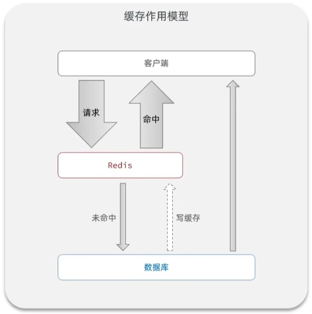

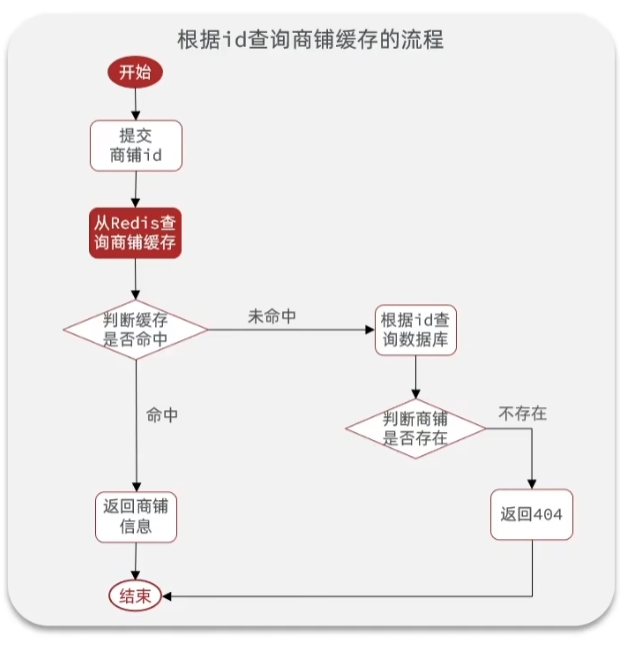

#### 缓存更新策略


##### 内存淘汰

* redis内存超过上限时自动删除，下次查询时更新到缓存
* 不一致概率大
* 淘汰哪些数据不可控


##### 超时淘汰

* 设置ttl超时淘汰，下次查询时更新到缓存
* 不一致概率大
* 淘汰最老数据


##### 主动更新

* 修改数据库时，主动更新缓存，不存在时更新到缓存
* 不一致概率小
* 主动删除不一致的旧数据
* 一般还需要配合超时淘汰，提高内存使用率


##### ==主动更新策略——Cache Aside Pattern==

* 编写业务逻辑，更新数据库时同时更新缓存
* 可靠性高
* 实现简单
* 一致性可控


##### 主动更新策略——Read/Write Through Pattern

* 将缓存和数据库整合成一个服务，对外暴露接口，对调用者透明
* 没有通用库
* 实现复杂


##### 主动更新策略——Write Behind Caching Pattern

* 调用者只操作缓存，由其他服务异步将缓存持久化到数据库，对调用者透明

* 效率高
* 不可靠


##### 主动更新问题——删除缓存还是更新缓存

* 修改数据时更新缓存，每次更新数据库都会更新缓存，可能多次无效更新缓存
* ==删除缓存下次使用时更新==


##### 主动更新问题——保证缓存和数据库更新的原子性

* 单体系统，将缓存操作和数据库操作放在一个数据库事务中
* 分布式系统，利用TCC等分布式事务方案
* 分布式事务方案
  * 2PC（两阶段提交）：2PC是一种基于XA协议的分布式事务方案，它将事务的提交过程分为两个阶段：准备阶段和提交阶段。在准备阶段，事务协调者（TM）向所有的事务参与者（RM）发送准备请求，要求它们执行本地事务并锁定资源，然后等待它们的响应。如果所有的参与者都返回成功，那么进入提交阶段；否则，进入回滚阶段。在提交阶段，TM向所有的参与者发送提交请求，要求它们释放资源并结束事务，然后等待它们的响应。如果所有的参与者都返回成功，那么整个分布式事务完成；否则，TM会重试或人工干预。
  * 3PC（三阶段提交）：3PC是对2PC的改进，它将事务的提交过程分为三个阶段：准备阶段、预提交阶段和提交阶段。在准备阶段，TM向所有的参与者发送准备请求，要求它们执行本地事务并锁定资源，然后等待它们的响应。如果所有的参与者都返回成功，那么进入预提交阶段；否则，进入回滚阶段。在预提交阶段，TM向所有的参与者发送预提交请求，并等待它们的响应。如果所有的参与者都返回成功，那么进入提交阶段；否则，进入回滚阶段。在提交阶段，TM向所有的参与者发送提交请求，并等待它们的响应。如果所有的参与者都返回成功，那么整个分布式事务完成；否则，TM会重试或人工干预。3PC相比2PC增加了一个预提交阶段，可以缩短资源锁定时间，并引入超时机制来处理网络故障。
  * TCC（Try-Confirm-Cancel）：TCC是一种基于补偿机制的分布式事务方案，它要求每个参与者实现三个操作：Try、Confirm和Cancel。Try操作用于检查和预留业务资源；Confirm操作用于确认并使用业务资源；Cancel操作用于取消并释放业务资源。TM首先发起所有参与者的Try操作，如果任何一个参与者失败或超时，TM就会发起所有参与者的Cancel操作；如果所有参与者成功，TM就会发起所有参与者的Confirm操作。TCC相比2PC和3PC不需要锁定资源，并且可以根据业务逻辑灵活地实现补偿操作。
  * SAGA（长事务）：SAGA是一种基于事件驱动和补偿机制的分布式事务方案，它将一个长时间运行的事务拆分为多个子事务，并定义每个子事务对应的补偿操作。每个子事务执行后会向消息队列发送一个事件通知其他子事务继续执行或回滚。如果任何一个子事务失败或超时，消息队列就会触发之前已完成子事务的补偿操作来回滚整个长事务。SAGA相比TCC不需要TM来协调参与者，而是通过消息队列来实现异步和解耦的通信。


##### 主动更新问题——先操作缓存还是先操作数据库

* 先删缓存，再操作数据库
  * 多线程时，删除缓存后数据库更新成功前，可能存在其他线程将旧数据再次更新到缓存
  * 因为数据库操作耗时较长，所以发生概率较大
* ==先操作数据库，再删缓存==
  * 多线程时，可能存在其他线程未命中缓存，从数据库读取到旧数据，将旧数据更新到缓存
  * 因为更新缓存速度较快，期间发生数据被修改的概率较低


#### 缓存穿透

* 概念
  * 缓存穿透指的是，客户端请求的数据在缓存和数据库中都不存在
* 问题
  * 可能会被故意利用，导致数据库压力过大
* 解决
  * ==缓存空对象==
    * 将不存在的id和空值存入redis，下次访问将无法穿透到数据库
    * 可能造成内存消耗
    * 可能导致短期不一致，用户查询到null
  * ==布隆过滤==
    * 在客户端和服务器之间加一层过滤，不存在的数据直接反回不存在
    * 布隆过滤器利用哈希算法，以很小的内存，判断key是否存在
  * 增强id复杂度，避免被猜测id
  * 做好数据的基础格式校验
  * 加强用户权限校验
  * 做好热点参数的限流


#### 缓存雪崩

* 概念
  * 同一时段，大量的缓存key同时失效，或服务器宕机，导致大量访问数据库
* 问题
  * 数据库压力过大导致服务器宕机
* 解决
  * 给不同的key添加随机ttl，批量导入可能导致ttl相同，过期时间相同
  * 用redis集群提高服务的可用性，哨兵监控替代
  * 给缓存业务添加降级限流策略，如检测到redis服务失败，立即返回失败，而非访问数据库
  * 给业务添加多级缓存，例如nginx缓存


#### 缓存击穿

* 概念
  * 也称热点key问题，被高并发访问并且缓存重建业务较复杂的key突然失效，导致大量访问数据库
* 问题
  * 热点key可能因ttl过期或其他原因失效
  * 数据库压力过大导致服务器宕机
* 解决
  * 互斥锁
    * 只有获取锁的线程才能访问数据库
    * 未获取锁的线程，休眠后重试
  * 逻辑过期
    * 不设置ttl，使用字段过期时间代替
    * 查询时判断缓存是否过期
    * 过期则使用新线程构建缓存
    * 未过期则返回旧数据

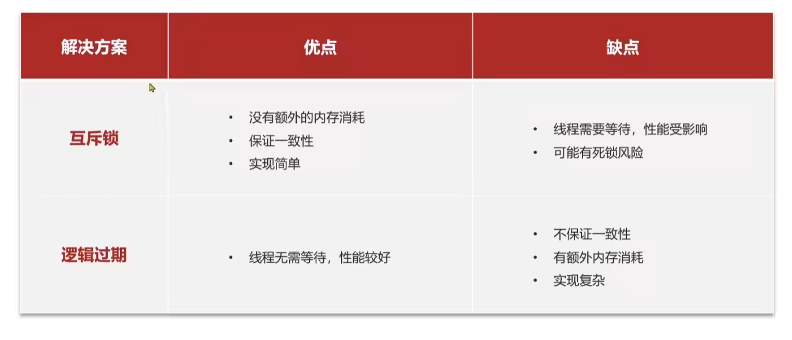


#### 缓存库封装

* 将任意对象json化，存储在string中，并可以设置ttl
* 将任意对象json化，存储在string中，并可以维护逻辑过期，解决缓存击穿问题
* 根据key查询缓存，并将json反序列化为对象，利用缓存空值解决缓存穿透问题
* 根据key查询缓存，并将json反序列化为对象，并维护逻辑过期，解决缓存击穿问题


### 分布式全局唯一ID

* 概念
  * 使用数据库自增，id规律性太明显，容易被外部猜测
  * 受单表数据量的限制
  * 分布式无法共享
* 问题
  * 唯一性，独立于数据库
  * 高可用，集群
  * 高性能
  * 递增型，如UUID无法递增
  * 安全性，非单调自增，如数字只能连续自增
* ID设计方案
  * 共8字节，64比特，long型
  * 符号位1bit，永远为0
  * 时间戳31bit，秒
  * 序列号32bit，秒内计数器，保存在redis
* redis key方案
  * 考虑id数量溢出，按业务使用不同key
  * 考虑时间范围内id溢出，按日期使用不同key
  * ID标识 : 业务标识 : 日标识 


### 秒杀


#### 秒杀下单基本业务

* 关键业务需求
  * 需要判断秒杀开始和结束时间
  * 需要检测库存是否充足
  * 负责条件则下单成功


#### 乐观锁解决超卖

* 概念
  * 并发条件下，可能出现超卖，库存为负

* 解决方案
  * 悲观锁
    * 认为线程安全一定会发生
    * 在操作之前先获取锁
    * 所有线程串行执行
  * ==乐观锁==
    * 认为线程安全问题不一定会发生
    * 不加线程锁
    * ==更新数据时判断是否有其他线程修改过数据==
    * 没有修改过才更新
    * ==已经修改过则重试或返回异常==

* 乐观锁的两种方案
  * 版本号法
    * 给数据加版本号，修改则加1
    * 更新时检测版本号
  * CAS法，Campare And Swap
    * 假设数据每次都会变化
    * 将数据本身当做版本号
    * 更新时检测数据是否有变化


#### 乐观锁失败率高问题

* ==秒杀场景下乐观锁失败率高问题==

  * 概念
    * 虽然保证了数据安全，但是可能导致大量业务失败，因为数据一致在变化

  * 解决方案
    * 降低CAS条件，从业务角度检测是否有必要返回失败
      * ==库存大于0时，即使数据变化，也无需返回失败==

* 非库存场景下乐观锁失败率高的问题

  * 概念
    * 非库存场景下，或者只能使用版本号法，不能使用判断库存大于0的方法解决失败率高的问题
  * 解决方案
    * 使用分段锁，分段加锁或者将数据放在多个表当中，在多个表中分别秒杀


#### 单进程秒杀限制一人一单，锁

* 一个用户一单问题
  * 问题
    * 秒杀需要限制同一用户只能下一单，乐观锁只能解决超卖问题
  * 解决方案
    * 单用户不并发场景下，下单前查询订单表中同用户同商品是否存在，使用数据库限制同一用户只下一单，可以限制多用户重复下单
* 单用户并发，幻读问题
  * 问题
    * 单用户在并发场景下，事务隔离级别低时存在幻读，可能重复下单
  * 解决方案
    * 对单用户加锁，解决单用户并发问题
* 单用户并发，集群并发问题
  * 问题
    * 单用户在集群场景下，不受单实例的锁限制，无法保证一人一单
  * 解决方案
    * 多个实例使用分布式锁
    * 单实例内部多线程也是用分布式锁


#### 使用Redis优化秒杀

* redis提高超卖问题性能
  * 记录库存信息到redis
* reids提高一人一单性能
  * 将下过单的用户放进redisset
* 集群并发原子性
  * 多指令操作使用lua脚本，保证原子性
* 异步化
  * 将用户信息放入消息队列
  * 后端异步处理
  * 处理完成后异步反馈


### 分布式锁

* 概念
  * 分布式系统或集群下多进程可见并互斥的锁
* 需求
  * 多进程可见
  * 互斥
  * 高可用
  * 高并发
  * 安全性（异常、死锁保护）


#### 分布式锁方案比较

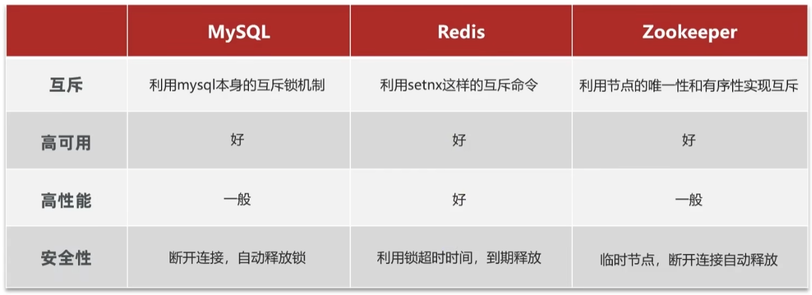

* MySQL
  * 性能依赖MySQL本身性能，性能略低
* Redis
  * 可用性需要集群保障
  * 安全性需要设置合适的超时释放时间，有风险


#### zookeeper简介

* ZooKeeper是一个开源的分布式协调服务，它可以为分布式应用程序提供一致性、可靠性和高性能的数据管理和服务发现功能。
* ZooKeeper的核心是一个分层的数据结构，类似于一个文件系统，它将数据存储在一系列的节点（ZNode）中，每个节点都有一个唯一的路径和一些元数据。ZooKeeper提供了一些原子性的操作来创建、删除、更新和监视节点的数据和状态。
* ZooKeeper的主要特点有：
  * 高可用性：ZooKeeper采用了主从（Leader-Follower）模式，将多个服务器组成一个集群，其中一个服务器充当Leader，负责处理客户端的请求和协调Follower的状态；其他服务器充当Follower，负责复制Leader的数据和选举新的Leader。这样可以保证在部分服务器出现故障时，仍然可以对外提供服务。
  * 强一致性：ZooKeeper保证了所有的服务器在任何时刻都有相同的数据视图，也就是说，任何一个服务器都可以响应客户端的请求，并返回最新的数据。为了实现这一点，ZooKeeper使用了一种叫做Zab（ZooKeeper Atomic Broadcast）的协议，它可以保证Leader和Follower之间的数据同步，并在发生网络分区或者服务器故障时，能够正确地选举新的Leader。
  * 顺序性：ZooKeeper保证了客户端对同一个节点的操作是按照发送顺序执行的，并且每个操作都有一个全局唯一的时间戳（zxid），用于标识操作的先后顺序。这样可以避免并发操作导致的数据不一致问题。


#### redis实现分布式锁

* 获取锁原理
  * `setnx lock owner`，使用setnx特性保证互斥
  * 使用key当做锁名
  * 使用value记录当前锁的所有者
* 释放锁原理
  * 主动释放，`del lock`
  * 超时释放，异常情况下`expire lock time-length`
* `创建锁`与`设置超时`两条Redis指令原子性问题
  * 问题
    * setnx之后可能未设置expire，两条指令无法保证原子性，必须使用一条指令实现
  * 解决方案
    * `set lock owner ex time-length nx`


#### redis分布式锁误删问题

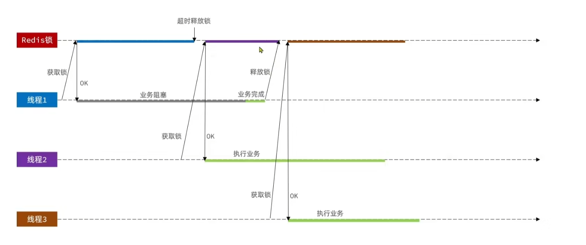

* 误删问题
  * 问题
    * 线程1阻塞时间超过了设置的redis expire时间，导致线程2抢到锁
    * 线程1业务完成后，释放锁未校验owner，删除线程2的锁，导致线程3抢到锁
  * 解决方案
    * 释放锁时校验owner可以解决第二个问题
* 锁标识重复问题
  * 问题
    * 使用进程内线程id作为锁标识，集群场景下可能重复
  * 解决方案
    * 使用uuid作为锁标识
    * 可以另外加上线程-进程-worker-节点号作为信息补充

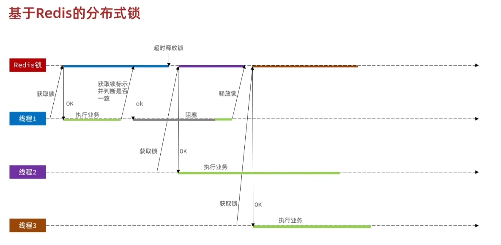

* `获取判断锁标识`与`删除锁`两条Redis指令的原子性问题
  * 问题
    * 判断锁标识和删除锁是两条指令，不具备原子性
    * 线程1获取锁标识指令执行完之后，键可能达到超时时间
    * 线程1继续执行指令可能会误删除线程2设置的新锁
  * 解决方案
    * 不存在一条Redis指令能完成这两条指令
    * 使用Lua脚本可以将两条指令组装成一条指令

Lua脚本

```lua
-- 原子释放Lua脚本

-- Lua数组下标从1开始
-- KEYS关键字可以取到redis key参数
-- ARGV关键字可以取到redis 其余参数
-- redis.call可以调用redis接口
-- redis可以将执行结果返回给redis

local id = redis.call('get', KEYS[1])
if (id == ARGV[1]) then
    return redis.call('del', KEYS[1])
end
return 0
```

Redis执行

```sh
# redis执行原子lua脚本

# help @scripting 获取执行lua脚本帮助信息
# eval 可以执行Lua脚本
# 1表示key参数的个数是1
# lock_name，lock_id是入参

eval "local id = redis.call('get', KEYS[1]) \
if (id == ARGV[1]) then \
    return redis.call('del', KEYS[1]) \
end \
return 0"  1 lock_name lock_id
```


#### 改进分布式锁

* 其他问题
  * 不可重入，同一个线程无法多次获取通一把锁
  * 不可重试，没有重试机制，一次失败就返回false
  * 超时释放，如果超时时间设置不合适，或者系统波动、资源回收，都有可能异常释放锁
  * 主从一致问题，主从切换时，由于同步延迟，可能导致新的主节点找不到锁
* 什么是可冲入锁
  * 锁的可重入性是指一个线程在获取到一个锁之后，可以再次获取到同一个锁，而不会被阻塞或者出错。这样可以避免死锁和递归调用的问题。
  * Python中的threading模块提供了RLock类来实现可重入锁

* 成熟库
  * Java：Redisson——RLock
  * Python：redis-py —— Redis-Lock
* 解决可重入问题
  * 使用hash结构记录锁标识和重入次数
  * 获取锁时，owner是自己时，增加锁计数
  * 释放锁时，锁计数减1，计数为0时删除锁
  * 使用Lua脚本保证操作原子性
* 解决不可重试问题
  * 在等待时间内不断尝试或通知重试
  * 释放锁时，发布锁释放消息
  * 获取锁时，订阅释放锁的消息，直到超时
* 解决超时释放问题
  * 超时续约
  * 获取锁时，使用看门狗定时更新有效期
  * 释放锁时，结束看门狗，释放锁
* 解决主从一致性问题
  * multiLock，连锁
  * 从多个节点中都获取到锁时，才认为获取到锁
  * 每个节点单独实现主从切换


### 消息队列

* redis提供了三种方式实现消息队列
  * list结构，基于list结构模拟消息队列
  * PubSub，基本的点对点消息模型
  * Stream，完善的消息队列模型
* list消息队列
  * 解决方案
    * lpush结合rpop实现，或者rpush结合lpop实现
    * rpop和lpop是非阻塞的，队列中没有消息时会返回null
    * brpop和blpop是阻塞的，没有消息时会阻塞等待
  * 优点
    * 利用redis的持久化机制，可以实现低水平的持久化
  * 缺点
    * 无法避免消息丢失，崩溃时未处理完的数据无法再次处理
    * 一个消息只能消费一次，出队后无法被其他消费者处理
* PubSub
  * 解决方案
    * 订阅一个或者多个频道，subscribe 频道1 频道2 。。。
    * 订阅字符匹配的频道，psubscribe 频* 
    * 向一个频道发送消息，publish 频道 消息
  * 优点
    * 支持多生产者、多消费者
  * 缺点
    * 不支持数据持久化，从redis持久化机制角度
    * 监听断开则消息丢失，从PubSub机制角度也不支持
    * 无法避免消息丢失，崩溃时未处理完的数据无法再次处理
    * 消息堆积有上限，超出时消息丢失
* Streams
  * 解决方案
    * Redis5.0新引入的数据类型


### Streams消息队列

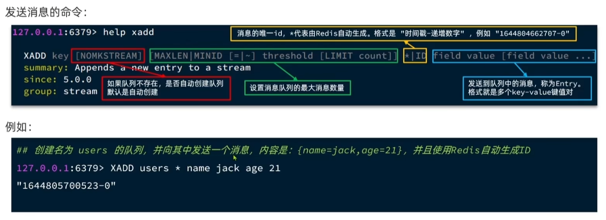

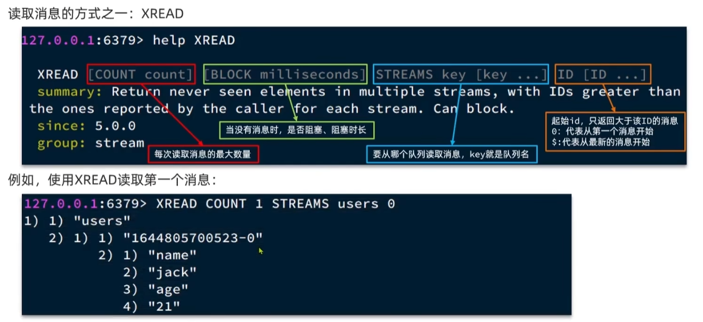

### 社交关注


### 位置附近


### 签到


### UV统计


### KV缓存


### 分布式锁

```
# 原子性，在一条指令中设置nx、ex
redis.set('key', '', nx=True, ex=10)
```


### 延迟队列，生产消费


### 订阅发布


### 定时任务


