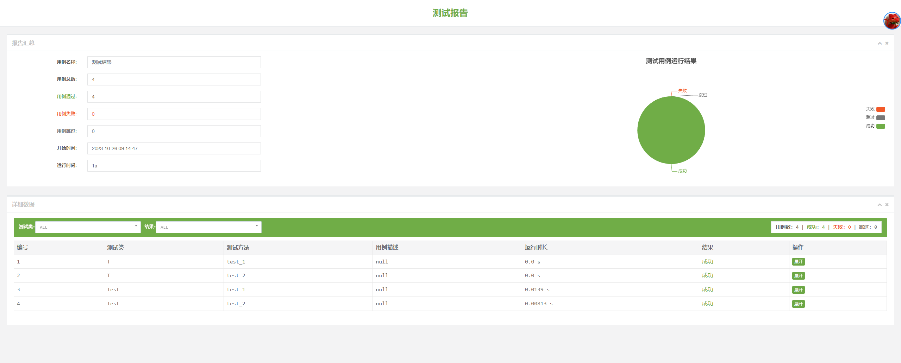
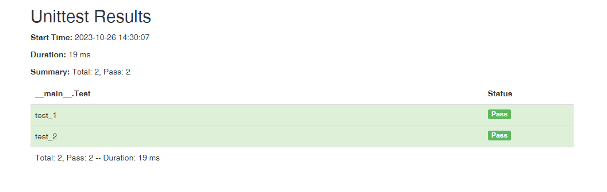

# unittest, pytest


## 概念

* 测试夹具，Test Fixture
  * 开展测试所需的准备、清理等相关工作
  * 如，创建临时数据库、临时目录、启动服务进程等


* 测试用例，Test Case
  * 一个独立的测试单元，检查特定输入的结果


* 测试套件（测试集），Test Suite
  * 一系列测试用例


* 测试运行器，Test Runner
  * 用于执行测试、输出测试结果的组件


## unittest


### 入门示例

* 实现要点
  * 新建以`test_`开头的python文件
  * 继承`unittest.TestCase`实现测试用例
  * 在`test_`开头的方法中实现测试方法
  * 在`test_`开头的方法中使用`self.assertEqual(actual, expected)`校验测试结果
  * 调用`unittest.main()`，自动执行所有测试用例及其中的测试方法


* 示例代码

```py
import unittest


class TestStringMethods(unittest.TestCase):

    def test_upper(self):
        self.assertEqual('foo'.upper(), 'FOO')

    def test_isupper(self):
        self.assertTrue('FOO'.isupper())
        self.assertFalse('Foo'.isupper())

    def test_split(self):
        s = 'hello world'
        self.assertEqual(s.split(), ['hello', 'world'])

        # 测试split的输入不是字符串时，能否抛出异常`TypeError`
        with self.assertRaises(TypeError):
            s.split(2)


if __name__ == '__main__':
    unittest.main()
```


* 运行

```sh
python test.py
```


* 示例代码输出

```
----------------------------------------------------------------------
Ran 3 tests in 0.003s

OK
```


### 运行测试


#### 运行测试

```sh
python test.py
```


#### 生成详细运行报告

```sh
python test.py -v
```


#### 运行当前目录下所有测试

* 自动查找所有python包

```sh
# 切换到所在目录

# 运行
python -m unittest

# 或
python -m unittest discover
```


#### 运行特定测试

* 特定python包名

```sh
python -m unittest module1 module2
```


#### 运行特定测试、特定用例

```sh
python -m unittest module.TestClass
```


#### 运行特定测试、特定用例、特定方法

```sh
python -m unittest module.TestClass.test_method
```


#### 运行特定测试程序

```sh
python -m unittest tests/test.py
```


### 运行参数


#### 控制输入输出

* `unittest`默认会输出到标准输出
* 指定`-b`或`--buffer`参数
  * 测试成功输出会被丢弃
  * 测试失败才会输出，错误会被加入到测试失败信息

```sh
python -m unittest -b
python -m unittest --buffer
```


#### 添加运行参数的方法

* 命令行中指定参数

```sh
python test.py -v

# 或
python -m unittest -v
```


* 使用`sys.argv`增加参数

```py
sys.args # 
sys.argv.append('-v')
```


* 设置参数

```py
unittest.main(verbosity=1)
```


#### 生成详细测试报告

* 运行时增加`-v`参数

```sh
python test.py -v
python test.py --verbose
```


* 效果

```
test_isupper (__main__.TestStringMethods.test_isupper) ... ok
test_split (__main__.TestStringMethods.test_split) ... ok
test_upper (__main__.TestStringMethods.test_upper) ... ok

----------------------------------------------------------------------
Ran 3 tests in 0.001s

OK
```


#### 出现第一个错误或故障时停止

```sh
python -m unittest -f
python -m unittest --failfast
```


#### 指定程序顶级目录

* 需要明确`discover`模式

```sh
python -m unittest discover -t 项目目录
python -m unittest discover --top-level-directory 项目目录
```


#### 指定测试用例目录

* 需要明确`discover`模式

```sh
python -m unittest discover -s 测试用例所在目录
python -m unittest discover --start-directory 测试用例所在目录
```


#### 匹配特定测试文件（python模块）

* 需要明确`discover`模式
* 默认匹配`test*.py`

```sh
python -m unittest discover -p "*_test.py"
python -m unittest discover --pattern "*_test.py"
```


#### 匹配特定名称用例

* `-k`


#### 错误时显示局部变量

* `--locals`


#### 显示n个最慢的测试用例

* `n=0`时会输出全部测试用例

```sh
python -m unittest --durations 10
```


### 组织测试代码


#### 新开发测试用例，TestCase

* 使用要点
  * 继承`unittest.TestCase`
  * 测试方法使用`def test_*(self)`模式
  * 校验数据使用`TestCase.assert*()`的内置方法
  * `def setUP(self)`，每个测试方法前执行
  * `def tearDown(self)`，每个测试方法后执行


#### 集成旧测试用例，FunctionTestCase

* 什么是
  * 可以将用`assert`实现的测试代码集成到unittest


* 使用要点
  * 使用`unittest.FunctionTestCase`包装测试函数
  * 使用参数`setUp`指定测试函数前置操作
  * 使用参数`tearDown`指定测试函数后置操作


* 旧测试用例

```py
def testSomething():
    something = makeSomething()
    assert something.name is not None
    # ...
```


* 包装旧测试用例的示例

```py
testcase = unittest.FunctionTestCase(testSomething,
                                     setUp=makeSomethingDB,
                                     tearDown=deleteSomethingDB)
```


#### 测试套件，TestSuit

* 默认`unittest.main()`会自动收集所有`TestCase`作为一个测试套件


* 使用要点
  * 实例化测试用例，并命名
  * 实例化测试套件，并将测试用例加入测试套件
  * 实例化测试运行器，并运行测试套件

```py
def suite():
    suite = unittest.TestSuite()
    suite.addTest(WidgetTestCase('test_default_widget_size'))
    suite.addTest(WidgetTestCase('test_widget_resize'))
    return suite

if __name__ == '__main__':
    runner = unittest.TextTestRunner()
    runner.run(suite())
```


#### 加载器，TestLoader

* 通过类名加载

```py
suite = unittest.TestSuite()
loader = unittest.TestLoader()

from test_module import MyTestCase
suite.addTest(loader.loadTestsFromTestCase(MyTestCase))
```


* 通过模块自动加载

```py
suite = unittest.TestSuite()
loader = unittest.TestLoader()

import test_module
suite.addTest(loader.loadTestsFromModule(test_module))
```


* 自动发现（通过目录自动加载）

```python
suite = unittest.TestSuite()
loader = unittest.TestLoader()

import test_module
suite.addTest(loader.discover(r'C:\project\test', pattern='test*.py'))
```


* 自动发现（命令行）

```sh
python -m unittest discover --start-directory "C:\project\test" --pattern "*_test.py"
```


* 默认自动发现加载器

```python
suite = unittest.defaultTestLoader.discover(r'C:\project\test')
```


#### 运行器，TestRunner

* 匹配


### 测试报告


#### 默认文本测试报告

```py
import unittest

suite = unittest.defaultTestLoader.discover('.')

with open('output.txt', 'w', encoding='utf-8') as f:
    runner = unittest.TextTestRunner(stream=f, verbosity=2)
    runner.run(suite)

```


#### BeautifulReport

* 测试结果输出为网页

```sh
pip install BeautifulReport
```

```py
import unittest
from BeautifulReport import BeautifulReport

suite = unittest.defaultTestLoader.discover('.')

runner = BeautifulReport(suite)
runner.report(description='测试结果')

```




#### html-testRunner

```sh
pip install html-testRunner
```

```py
import unittest
from HtmlTestRunner import HTMLTestRunner

suite = unittest.defaultTestLoader.discover('.')

runner = HTMLTestRunner()
runner.run(suite)

```





### 测试夹具，Test Fixture


#### 方法级别测试夹具

* 什么是
  * 每个测试方法前后执行


* 实现要点
  * 继承`unittest.TestCase`
  * 方法前置，实现对象方法`self.setUp()`
  * 方法后置，实现对象方法`self.tearDown()`


* 示例

```py
import unittest
from icecream import ic


class Test(unittest.TestCase):
    @classmethod
    def setUpClass(cls) -> None:
        ic('测试用例前执行')
        return super().setUpClass()

    @classmethod
    def tearDownClass(cls) -> None:
        ic('测试用例后执行')
        return super().tearDownClass()
    
    def setUp(self):
        ic('每个方法前执行')
        return super().setUp()

    def tearDown(self):
        ic('每个方法后执行')
        return super().tearDown()

    def test_1(self):
        ic('第一个测试方法')
        self.assertEqual(1, 1)

    def test_2(self):
        ic('第二个测试方法')
        self.assertEqual(2, 2)

```


* 运行输出

```py
PS D:\test\test_icecream> python -m unittest -v test_1
ic| '测试用例前执行'
test_1 (test_1.Test) ... 
ic| '每个方法前执行'
ic| '第一个测试方法'
ic| '每个方法后执行'
ok
test_2 (test_1.Test) ... 
ic| '每个方法前执行'
ic| '第二个测试方法'
ic| '每个方法后执行'
ok
ic| '测试用例后执行'

----------------------------------------------------------------------
Ran 2 tests in 0.793s

OK
```


#### 类级别的测试夹具

* 什么是
  * 整个测试用例前后执行


* 实现要点
  * 继承`unittest.TestCase`
  * 类前置，实现类方法`cls.setUpClass(cls)`
  * 类后置，实现类方法`cls.tearDownClass(cls)`


* 代码片段

```py
class Test(unittest.TestCase):
    @classmethod
    def setUpClass(cls) -> None:
        ic('测试用例前执行')
        return super().setUpClass()

    @classmethod
    def tearDownClass(cls) -> None:
        ic('测试用例后执行')
        return super().tearDownClass()
    
```


#### 模块级别的测试夹具


### 跳过测试和预期失败


#### 跳过测试

* 跳过方法

```py
class MyTestCase(unittest.TestCase):

    @unittest.skip("demonstrating skipping")
    def test_nothing(self):
        self.fail("shouldn't happen")
```


* 跳过用例（类）

```py
@unittest.skip("showing class skipping")
class MySkippedTestCase(unittest.TestCase):
    def test_not_run(self):
        pass
```


#### 条件跳过

```py
class MyTestCase(unittest.TestCase):
    @unittest.skipIf(mylib.__version__ < (1, 3),
                     "not supported in this library version")
    def test_format(self):
        # Tests that work for only a certain version of the library.
        pass

    @unittest.skipUnless(sys.platform.startswith("win"), "requires Windows")
    def test_windows_support(self):
        # windows specific testing code
        pass
```


#### 手动跳过

```py
class MyTestCase(unittest.TestCase):
    def test_maybe_skipped(self):
        if not external_resource_available():
            self.skipTest("external resource not available")
        # test code that depends on the external resource
        pass
```


#### 编写跳过装饰器

```py
def skipUnlessHasattr(obj, attr):
    if hasattr(obj, attr):
        return lambda func: func
    return unittest.skip("{!r} doesn't have {!r}".format(obj, attr))
```


#### 预期失败

* 测试方法失败或报错，则认为测试成功

```py
class ExpectedFailureTestCase(unittest.TestCase):
    @unittest.expectedFailure
    def test_fail(self):
        self.assertEqual(1, 0, "broken")
```


### 拆分测试方法为子测试

* 作用
  * 避免子测试整体失败，无法判断是在哪一次迭代失败

```py
class NumbersTest(unittest.TestCase):

    def test_even(self):
        """
        Test that numbers between 0 and 5 are all even.
        """
        for i in range(0, 6):
            with self.subTest(i=i):
                self.assertEqual(i % 2, 0)
```


### 断言

| 检查对象                                        | 方法                       | 原型                                                         |
| ----------------------------------------------- | -------------------------- | ------------------------------------------------------------ |
| a == b                                          | assertEqual(a, b)          | assertEqual(first, second, msg=None)                         |
| a != b                                          | assertNotEqual(a, b)       | assertNotEqual(first, second, msg=None)                      |
| bool(x) is True                                 | assertTrue(x)              | assertTrue(expr, msg=None)                                   |
| bool(x) is False                                | assertFalse(x)             | assertFalse(expr, msg=None)                                  |
| a is b                                          | assertIs(a, b)             | assertIs(first, second, msg=None)                            |
| a is not b                                      | assertIsNot(a, b)          | assertIsNot(first, second, msg=None)                         |
| x is None                                       | assertIsNone(x)            | assertIsNone(expr, msg=None)                                 |
| x is not None                                   | assertIsNotNone(x)         | assertIsNotNone(expr, msg=None)                              |
| a in b                                          | assertIn(a, b)             | assertIn(member, container, msg=None)                        |
| a not in b                                      | assertNotIn(a, b)          | assertNotIn(member, container, msg=None)                     |
| isinstance(a, b)                                | assertIsInstance(a, b)     | assertIsInstance(obj, cls, msg=None)                         |
| not isinstance(a, b)                            | assertNotIsInstance(a, b)  | assertNotIsInstance(obj, cls, msg=None)                      |
|                                                 |                            |                                                              |
| round(a-b, 7) == 0                              | assertAlmostEqual(a, b)    | assertAlmostEqual(first, second, places=7, msg=None, delta=None) |
| round(a-b, 7) != 0                              | assertNotAlmostEqual(a, b) | assertNotAlmostEqual(first, second, places=7, msg=None, delta=None) |
| a > b                                           | assertGreater(a, b)        | assertGreater(first, second, msg=None)                       |
| a >= b                                          | assertGreaterEqual(a, b)   | assertGreaterEqual(first, second, msg=None)                  |
| a < b                                           | assertLess(a, b)           | assertLess(first, second, msg=None)                          |
| a <= b                                          | assertLessEqual(a, b)      | assertLessEqual(first, second, msg=None)                     |
| r.search(s)                                     | assertRegex(s, r)          | assertRegex(text, regex, msg=None)                           |
| not r.search(s)                                 | assertNotRegex(s, r)       | assertNotRegex(text, regex, msg=None)                        |
| a 和 b 具有同样数量的相同元素，无论其顺序如何。 | assertCountEqual(a, b)     | assertCountEqual(first, second, msg=None)                    |


* assertEqual自动选取的比较方法
  * 一般不需要直接调用

| 检查对象 | 方法                       | 原型                                                        |
| -------- | -------------------------- | ----------------------------------------------------------- |
| 字符串   | assertMultiLineEqual(a, b) | assertMultiLineEqual(first, second, msg=None)               |
| 序列     | assertSequenceEqual(a, b)  | assertSequenceEqual(first, second, msg=None, seq_type=None) |
| 列表     | assertListEqual(a, b)      | assertListEqual(first, second, msg=None)                    |
| 元组     | assertTupleEqual(a, b)     | assertTupleEqual(first, second, msg=None)                   |
| 集合     | assertSetEqual(a, b)       | assertSetEqual(first, second, msg=None)                     |
| 字典     | assertDictEqual(a, b)      | assertDictEqual(first, second, msg=None)                    |


### 异常、警告、日志

| 检查对象                                                     | 方法                                          | 原型                                             |
| ------------------------------------------------------------ | --------------------------------------------- | ------------------------------------------------ |
| fun(*args, **kwds) 引发了 exc                                | assertRaises(exc, fun, *args, **kwds)         | assertRaises(exception, *, msg=None)             |
| fun(*args, **kwds) 引发了 exc 并且消息可与正则表达式 r 相匹配 | assertRaisesRegex(exc, r, fun, *args, **kwds) | assertRaisesRegex(exception, regex, *, msg=None) |
| fun(*args, **kwds) 引发了 warn                               | assertWarns(warn, fun, *args, **kwds)         | assertWarns(warning, *, msg=None)                |
| fun(*args, **kwds) 引发了 warn 并且消息可与正则表达式 r 相匹配 | assertWarnsRegex(warn, r, fun, *args, **kwds) | assertWarnsRegex(warning, regex, *, msg=None)    |
| with 代码块在 logger 上使用了最小的 level 级别写入日志       | assertLogs(logger, level)                     | assertLogs(logger=None, level=None)              |
| with 代码块没有在logger 上使用最小的 level 级别写入日志      | assertNoLogs(logger, level)                   | assertNoLogs(logger=None, level=None)            |


### asyncio测试

* 使用要点
  * 继承`IsolatedAsyncioTestCase`
  * 方法前异步，`asyncSetUp(self)`
  * 方法后异步，`asyncTearDown(self)`
  * 异步测试方法

```py
from unittest import IsolatedAsyncioTestCase

events = []


class Test(IsolatedAsyncioTestCase):

    def setUp(self):
        events.append("setUp")

    async def asyncSetUp(self):
        self._async_connection = await AsyncConnection()
        events.append("asyncSetUp")

    async def test_response(self):
        events.append("test_response")
        response = await self._async_connection.get("https://example.com")
        self.assertEqual(response.status_code, 200)
        self.addAsyncCleanup(self.on_cleanup)

    def tearDown(self):
        events.append("tearDown")

    async def asyncTearDown(self):
        await self._async_connection.close()
        events.append("asyncTearDown")

    async def on_cleanup(self):
        events.append("cleanup")


if __name__ == "__main__":
    unittest.main()
```


## unittestreport

* 功能
  * HTML测试报告
  * 失败用例重运行
  * 发送测试结果及报告到邮箱
  * 数据驱动测试
  * 测试结果钉钉通知、企业微信推送
