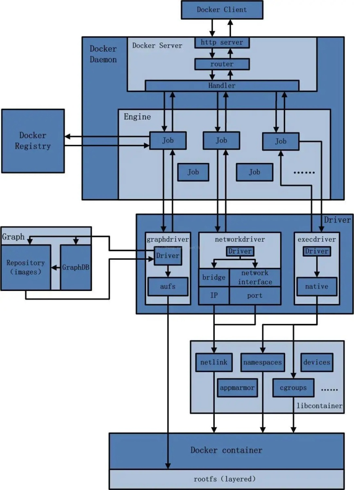
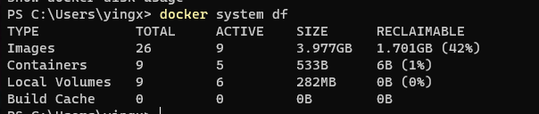
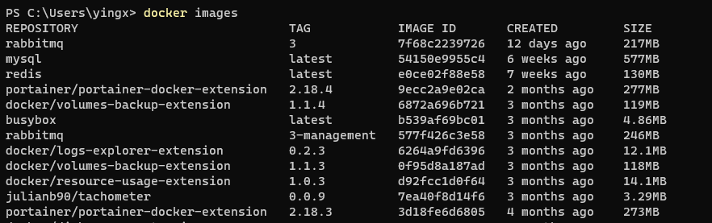
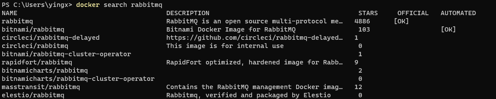
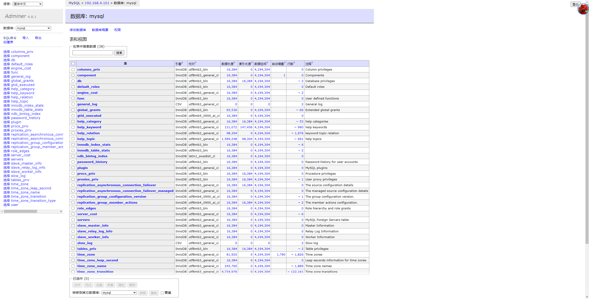
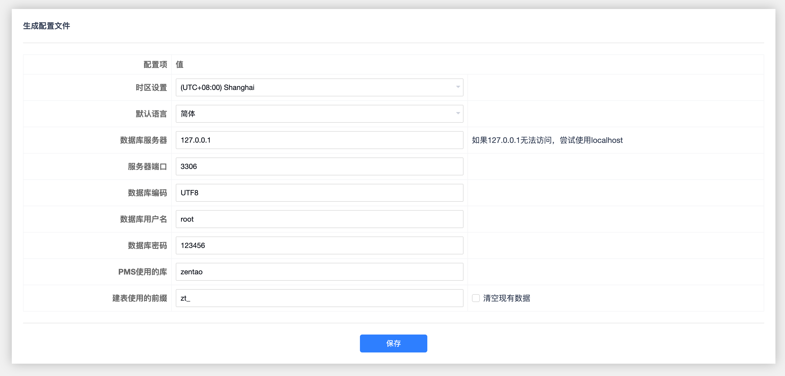

# docker


## 概念


### 物理机的缺点

* 安装操作系统慢
* 软件部署慢
* 硬件成本高
* 硬件资源浪费，使用不充分
* 难以迁移，扩展，可能有兼容性问题
* 可能被硬件限制


### 虚拟机的优点

* 可以预置操作系统
* 可以预置软件
* 硬件成本略低
* 资源利用率略高
* 略容易迁移、扩展
* 基本不受硬件限制


### 虚拟机的缺点

* 资源占用大，虚拟机操作系统浪费资源
* 资源分配不灵活
* 启动慢，需要启动一个操作系统
* 冗余步骤多


### 容器的优点

* 容器直接运行在宿主机的内核上，可以共享宿主机资源
* 基本保持宿主机性能
* 容器比虚拟机占用资源少，可以并行更多数量
* 启动快，只需要运行一个程序
* 容器不需要硬件虚拟化支持
* 体积小迁移容易，迁移快
* 开发、测试、运行环境一致，减少兼容性问题


### Linux容器

* Linux Container，LXC
* 隔离的进程环境


### docker版本

* 17.03后分为CE版、EE版本
* CE, Community Edition
* EE, Enterprise Edition


### docker简介

* 源码 + 配置 + 环境 + 版本 全部一致打包封装，任何地方运行环境全部一致
* 使用go语言开发


### docker的组件

* 核心组件
  * Repository，仓库，保存、管理镜像的服务器
  * Image，镜像，打包的应用程序、配置、依赖、运行环境
  * Container，容器，运行的资源和环境，从Image实例化而来

* 其他概念
  * Docker Daemon，后台服务，包括
    * Docker Server，与用户接口进行通讯，控制Docker雨欣
    * Docker Engine，任务管理
  * Docker Client，用户接口
  * rootfs(layered)，迷你版操作系统





### 镜像

* 概念
  * 镜像是分层的
  * 使用联合文件系统UnionFS
  * 镜像层都是只读的，只有容器是可写的
  * 镜像的最顶层称为容器层
* UnionFS，联合文件系统
  * 将修改提交为一层
  * 层层叠加继承
* 为什么使用分层结构
  * 底层微缩操作系统多个镜像可以复用


## 安装配置


### CentOS yum安装

```sh
# 卸载旧版本
yum remove docker \
                docker-client \
                docker-client-latest \
                docker-common \
                docker-latest \
                docker-latest-logrotate \
                docker-logrotate \
                docker-engine

# 安装依赖
yum install -y yum-utils device-mapper-persistent-data lvm2
 
# 添加官方repo
yum-config-manager --add-repo https://download.docker.com/linux/centos/docker-ce.repo

# 添加阿里云repo
yum-config-manager --add-repo http://mirrors.aliyun.com/docker-ce/linux/centos/docker-ce.repo

# 解决centos8 container版本冲突
yum install docker-ce docker-ce-cli containerd.io --nobest

# 安装Docker Engine-Community
sudo yum install docker-ce docker-ce-cli containerd.io
```


### 镜像加速

* 需要在阿里云申请加速器地址
* 修改配置文件使用加速器，`/etc/docker/daemon.json`

```sh
# 配置文件

mkdir -p /etc/docker
tee /etc/docker/daemon.json <<-'EOF'
{
    "registry-mirrors": ["https://aa25jngu.mirror.aliyuncs.com"]
}
EOF
systemctl daemon-reload
systemctl restart docker
```


### 启动

```sh
# 启动
systemctl start docker

# 查看当前状态
systemctl status docker

# 测试命令，Hello World
# 本地不存在该镜像，会从docker hub下载
docker run hello-world
```


## 系统


### 查看版本

```sh
docker version
docker info
```


### 获取帮助

```sh
# 整体帮助
docker --help

# 子命令帮助
docker 子命令 --help

# 子命令帮助示例
docker cp   --help
docker diff --help
```


### 查看使用的系统空间

```sh
docker system df
```




### 清除所有已终止的容器

```sh
# 清除所有已终止的容器
docker container prune
```


### 查看所有端口映射

```sh
docker port container_id
```


### 动态监控

```sh
docker stats
```


## 镜像

* 概念
  * REPOSIGORY，镜像仓库
  * TAG，标签版本号
  * IMAGE ID，镜像ID，类似UUID
  * CREATED，创建时间
  * SIZE，镜像大小


* 标签，TAG
  * 一般使用 `REPOSIGORY:TAG`，会获取到最新的镜像
  * 不指定`TAG`，那么`TAG`是`latest`，如`ubuntu:latest`


### 列出本地镜像，docker images

```sh
docker images

# 不截断image id
docker images --no-trunc 

# 只显示image id
docker images -q

# 显示全部镜像，包括中间层
docker images -a
```




### 搜索远程镜像，docker search

* 默认搜索，<https://hub.docker.com>

```sh
docker search reponame

# 显示详细信息
docker search --no-trunc reponame

# 过滤star数30以上
docker search -s 30 reponame

# 限制搜索数量
docker search --limit 5 redis
```




### 拉取远程镜像，docker pull

```sh
docker pull Repo
docker pull Repo:Tag

# 不加标签等同于latest
docker pull nginx
docker pull nginx:latest

docker pull mysql:5.6
```


### 删除本地镜像，docker rmi

```sh
# 按仓库名称删除
docker rmi hello-world

# 按镜像名称删除
docker rmi 7f68c2239726

# 按仓库名称 + TAG删除
docker rmi hello-world:latest

# 删除多个
docker rmi redis rabbitmq hello-world:latest

# 强制删除
docker rmi -f hello-world

# 强制删除所有镜像
docker rmi -f ${docker images -qa}
```


### 修改镜像，docker commit

* 更新镜像并保存

```sh
# 交互式进入容器
# docker run -t -i ubuntu:15.10 /bin/bash

# 在容器内改变容器
# apt-get update

# 提交修改
docker commit -m="comment" -a="author" container_id user/repo:tag
```


### 创建镜像，docker build

* Dockerfile
  * docker指令必须大写

```dockerfile
FROM ubuntu
MAINTAINER author "email@email.com"

RUN /bin/echo 'root:passwd' | chpasswd
RUN useradd user
RUN /bin/echo 'user:passwd' | chpasswd
RUN /bin/echo -e "LANG=\"en_US.UTF-8\"" > /etc/default/local
EXPOSE 22
EXPOSE 80
CMD /usr/sbin/sshd -D

```

* 构建镜像
  * `-t`，指定名称

```sh
docker build -t user/repo:tag [Dockerfile Dir]
```


### 虚悬镜像

* 什么是
  * 仓库名、标签都是<none>的镜像
  * dangling image
* 怎样产生的
  * 虚悬镜像一般是因为构建或拉取新的镜像时，旧的镜像被取消了标签，而新的镜像使用了相同的标签
  * 如tag`latest`


* 过滤本地虚悬镜像

```sh
docker image ls -f dangling=true
```


* 删除所有本地虚悬镜像

```sh
docker rmi $(docker images -q -f dangling=true)
```


* 产生虚悬镜像的一种方式

```sh
# 不指定repo:tag
docker build
```


## 容器


### 启动容器，docker run

* 常用参数
  * `--name="容器名称"`，为容器实例指定一个名称
  * `-d`，daemon，后台运行容器并返回容器ID 
  * `-i`，interactive，以交互模式运行容器
  * `-t`，terminal，为容器重新分配一个伪终端
  * `-p 分配端口:容器内端口`，将容器内的端口映射到外部
  * `-p 分配IP:分配端口:容器内端口`，将容器内的端口映射到外部指定IP
  * `--restart`，重启模式
    * `--restart=no`，容器退出时不重启，==默认==
    * `--restart=on-failure`，容器退出状态非0，则自动重启
    * `--restart=on-failure:次数`，容器退出状态非0则重启，指定次数未能重启成功则放弃，==最佳实践==
    * `--restart=always`，总是重启
    * `--restart=unless-stopped`，总是重启，除非人为停止，==最佳实践==

​	

* 伪终端
  * 不分配伪终端，无法接收用户输入，只能查看容器输出
  * 分配伪终端可以看到命令颜色变化


* 启动命令
  * `/bin/bash`指示启动容器后启动bash shell
  * 如果启动容器不指定启动命令，容器会执行dockerfile中指定的命令，`CMD ["/bin/bash"]`

```sh
# 获取镜像
docker pull ubuntu

# 启动容器
docker run -it ubuntu /bin/bash
```


### 命令模式

```
docker run ubuntu:15.10 /bin/echo "Hello World"
```


### 交互模式

* 进入交互模式

```sh
# 交互模式运行容器
docker run -it ubuntu:15.10 /bin/bash

docker run -i -t ubuntu:15.10 /bin/bash
```


* 容器停止，退出交互模式
  * 在容器终端中按下组合键`Ctrl + c`退出容器

```sh
# 容器停止
exit
```


* 容器不停止，退出交互模式
  * 在容器终端中按下组合键`Ctrl + p + q`退出容器


### 后台模式

* 概念
  * daemon
  * 也可以叫做服务模式
  * 工作任务不退出docker容器不退出
  * 后台模式容器中必须有前台进程，否则立即退出


* 为什么后台模式容器中必须有前台进程
  * 容器并不是虚拟机，而是利用 Linux 的 cgroup 和 namespace 隔离的，在宿主机上本质是个隔离的进程。
  * 容器默认会把容器内部第一个进程，也就是 pid=1 的程序作为容器是否正在运行的依据，如果容器中 pid = 1 的进程挂了，那么容器便会直接退出。
  * 如果容器运行的命令不是那些一直挂起的命令（比如运行 ping，sleep），就是会自动退出的。
  * 如果没有前台进程，那么实际运行完 docker run 命令后，会处于退出状态，即 exited。


```sh
# 示例shell程序
while true; do echo hello world; sleep 1; done 

# 前台运行
docker run ubuntu:15.10 /bin/sh -c "while true; do echo hello world; sleep 1; done"

# 后台运行 -d，返回一个容器ID
docker run -d ubuntu:15.10 /bin/sh -c "while true; do echo hello world; sleep 1; done"
```


### 附着与分离，docker attach

* 作用
  * 将本地标准输入、输出和错误流附加到正在运行的容器中，这样就可以查看或控制容器中的进程。


* 交互模式和非交互模式下的区别
  * 交互模式下使用`docker attach`，可以在容器内输入命令、与系统进行交互，就像在本地终端中一样
  * 非交互模式下使用`docker attach`，只能查看容器中的输出，不能输入任何命令


* 注意事项：
  * docker attach 命令只能显示容器中 ENTRYPOINT/CMD 进程的输出，如果容器中没有这样的进程，那么您可能看不到任何输出
  * 可以从不同的终端同时多次附加到同一个容器进程，但是如果您使用 exit 命令退出，那么容器会停止运行
  * 如果想退出容器但不想容器停止运行，那么您可以使用 `CTRL-p` `CTRL-q` 组合键从容器中分离
  * 如果想停止容器，那么您可以使用 `CTRL + c` 组合键发送 `SIGKILL` 信号到容器。


```sh
# 交互式后台运行ubuntu bash
docker run -itd --name name ubuntu /bin/bash

# 附着到容器 
docker attach 容器ID
```


### 在容器中执行新命令，docker exec

* 与`docker attach`的区别
  * `docker attach`只能附加到容器中的主进程，也就是容器启动命令的终端，不会启动新的进程
  * `docker attach`如果使用 exit 命令退出，会导致容器停止运行，如果想退出而不停止容器，可以使用 `CTRL-p CTRL-q`组合键
  * `docker exec` 是在运行的容器上创建新的进程执行命令，不影响容器的主进程
  * `docker exec`可以在容器中打开新的终端，也可以直接执行单个命令，并将输出打印到当前终端
  * `docker exec`可以使用 `-it` 参数来指定交互模式和伪终端，也可以使用 `-d` 参数来在后台执行命令
  * `docker exec`使用 exit 命令退出，不会导致容器停止运行，只会结束当前进程
* 参数
  * `-itd`参数与`docker run`相同

```sh
# 在容器中执行新命令
docker exec -it 容器ID /bin/bash
docker exec -itd 容器ID /bin/bash
```


### 查看所有容器，docker ps

* 常用参数
  * `-a`， all，包含历史容器
  * `-q`，quiet，只显示容器编号
  * `-n`，只显示最近n个创建的容器
  * `-l`，显示最近创建的容器

```sh
# 查看所有容器
docker ps

# 查看所有容器
docker ps -a 
```


### 查看容器内进程，docker top

* 不同于top命令，一次性打印

```sh
docker top 容器ID
docker top d35aad423212
```


### 查看容器信息，docker inspect

```sh
docker inspect 容器ID
```


###  查看容器输出，docker logs

```sh
# 查看容器输出（一次性打印已输出）
docker logs d35aad423212

# 动态查看容器日志
# -f 动态输出内容
docker logs -f container_id
```


### 启动已经停止的容器，docker start

```sh
# 重新启动已经停止的docker
docker start container_id
```


### 停止已经启动的容器，docker stop

```sh
# 停止容器
docker stop container_id
```


### 强制停止已经启动的容器，docker kill

```sh
# 杀死容器
docker kill container_id
```


### 重启已经启动的容器，docker restart

```sh
# 重启容器
docker restart container_id
```


### 删除容器，docker rm

* 不能删除正在运行的容器

```sh
# 删除容器
docker rm 容器ID

# 删除所有容器
docker rm -f $(docker ps -a -q)

# 删除所有容器
docker ps -q -a | xargs docker rm -f
```


### 复制文件，docker cp

* 在宿主机和容器之间复制文件

```sh
# 从宿主机复制文件到容器
docker cp <宿主机文件路径> <容器名>:<容器文件路径>

# 从容器复制文件到宿主机
docker cp <容器名>:<容器文件路径> <宿主机文件路径>

# 从宿主机复制一个配置文件到容器的 /etc 目录下
docker cp /home/user/myapp.conf myapp:/etc

# 从容器复制一个日志文件到宿主机的 /var/log 目录下
docker cp myapp:/var/log/myapp.log /var/log
```


### 导入导出，docker export

* 为什么需要导入导出
  * 镜像只能在仓库之间传递
  * 导入导出可以将镜像保存成文件形式
* 导入导出镜像的缺点
  * 导出的镜像文件会将所有依赖层都打包，而镜像层只保存变化部分
  * 镜像的一些信息会丢失，如标签（tag）、仓库（repository）和摘要（digest）

```sh

# 导出容器
docker export container_id > ubuntu.tar

# 导入镜像，并设置仓库和标签
docker import myapp.tar myapp:latest

# 使用管道导入镜像
cat ubuntu.tar | docker import - test/ubuntu:v1
```


### 其他

```
# 映射端口到本地 -P
docker pull training/webapp  # 载入镜像
docker run -d -P training/webapp python app.py

# 查看容器端口
docker port container_id

# 无权限时添加权限
--privileged=true
```


## 仓库管理

* 命名空间
  * 一个用户的所有仓库所在的域
* 仓库
  * 存放相同功能镜像不同版本


### 发布镜像到阿里云

```sh
# 登录
docker login --username=yingxuanxuan@hotmail.com registry.cn-shanghai.aliyuncs.com

# 登出
docker logout 

# 拉取镜像
docker pull registry.cn-shanghai.aliyuncs.com/daniel-hub/nginx-docker:tag

# 推送镜像
# 推送镜像前，先给本地镜像打tag
docker tag 本地镜像ID registry.cn-shanghai.aliyuncs.com/daniel-hub/仓库:tag
docker push registry.cn-shanghai.aliyuncs.com/daniel-hub/仓库:tag
```


### 私有仓库，Docker Registry

* 注意
  * 本地docker默认不支持非https，需要修改配置


* 本地docker配置，`/etc/docker/daemon.json`

```json
{
    "insecure-registries": ["192.168.111.162:5000"]
}
```


```sh
# 在docker中部署registry
docker run -d -p 5000:5000 --restart always --name registry registry:2

# 从默认仓库拉取镜像
docker pull ubuntu

# 推送到私有仓库
docker tag ubuntu localhost:5000/ubuntu
docker push localhost:5000/ubuntu
```


* 查看Registry中的所有Repo

```sh
curl -XGET http://127.0.0.1/5000/v2/_catalog
```


## 数据卷

* 概念
  * 独立于镜像的容器层
  * 数据持久化
  * 可以在容器之间共享或重用数据
  * 卷中的更改可以直接在容器内实时生效

* 目录创建
  * docker会自动创建不存在的目录

* 只读挂载
  * `-v 宿主机路径:容器路径:ro`
  * `ro`，read only


```sh
# 默认读写映射
docker run -it -v /local/path:/docker/path image

# 默认只读映射
docker run -it -v /local/path:/docker/path:ro image

```


### 提升容器卷权限

* 访问数据卷出现`cannot open directory .: Permission denied`错误，需要提权
* 在挂载目录时增加参数`--privileged=true`
* 这个参数是用来启动一个特权容器的，它可以让容器内的 root 用户拥有真正的 root 权限，可以访问主机的所有设备和文件系统，也可以执行一些需要较高权限的操作，比如 mount、启动其他容器等。这个参数通常用于测试、网络和存储方面的应用程序

```sh
docker run -d -p 5000:5000 -v /path/from/:/path/to/ --privileged=true registry
```


### 查看挂载

```sh
docker inspect

# "Mounts": [
#	{
#		"Type": "bind",
#		"Source": "/tmp/host_data",
#		"Destination": "/tmp/docker_data",
#		"Mode": " ",
#		"RW": true,
#		"Propagation": "rprivate"
#	}
# ]
```


### 数据卷继承，--volumes-from

```sh
# 数据卷继承
docker run -it --name dc01 zzyy/centos
docker run -it --name dc02 --volumes-from dc01 zzyy/centos
docker run -it --name dc03 --volumes-from dc01 dc02 zzyy/centos
```


## 网络

* docker服务启动后，会生成一个虚拟网卡`docker0`
* 在docker内部，这个网络叫做`bridge`
* 容器和宿主机之间都通过`docker0`，也就是`bridge`通信


### 容器的网络模式

* bridge

  * 为每一个容器分配、设置IP等，并将容器连接到docker0

  * 默认是bridge模式，且IP不固定，每次启动停止后都有可能变化
  * 默认bridge模式下，没有DNS服务，所以不能通过容器名称相互访问


* host
  * ==只支持Linux，其他系统无效==
  * 容器不虚拟自己的网卡，使用宿主机的IP和端口，端口重复会递增

* none
  * 容器有独立的Network namespace，但没有进行任何设置


* container

  * 容器不虚拟自己的网卡，而是和一个指定的容器共享IP和端口

  * 两个镜像暴露的端口相同，使用这种模式会导致冲突

  * 共享容器关闭后，网络也会消失


```sh
# 使用自定义网桥
docker run -d --network my_network 镜像

# 使用其他容器的网络
docker run -d --network:container:容器ID 镜像
docker run -d --network:container:容器名称 镜像
```


### 容器使用自定义网络

* 默认网络在同一网段都是通的，但是`ping 容器名`不通
* 将容器加入同一自建网络后，可以`ping 容器名`

```sh
# 创建网络
docker network create net_name

# 容器使用网络
docker run -d -p 8081:8080 --network net_name --name 容器名1 tomcat
docker run -d -p 8082:8080 --network net_name --name 容器名2 tomcat

# 容器1中测试
ping 容器名2

# 容器2中测试
ping 容器名1
```


### 查看网络，docker network ls

```sh
docker network ls
```


### 查看具体网络，docker network inspect

```sh
docker network inspect net_name
```


### 创建网络，docker network create

* 默认创建的是网桥网络

```sh
docker network create net_name
```


### 删除网络，docker network rm

```sh
docker network rm net_name
```


### 与宿主机共享网络

* `docker run --net host`参数是用来指定容器使用host模式的网络，即和宿主机共用一个Network Namespace，不会为容器创建独立的网络栈
* 使用host模式的容器可以直接使用宿主机的IP地址和端口与外界通信，不需要进行NAT转换或端口映射，网络性能比较好，但是也会导致网络隔离性不好，容器之间和宿主机之间没有隔离，容易发生端口冲突
* 使用host模式的容器适合一些对网络性能要求高或者需要访问宿主机上其他应用的场景，比如测试、监控、日志等


### 连接容器间的网络，--link

* 淘汰


### 网桥端口映射，-p

```sh
# 小p，指定端口映射
docker run -ti -d --name my-nginx -p 8088:80 docker.io/nginx

# 大P，随机选择一个宿主机端口映射
docker run -ti -d --name my-nginx2 -P docker.io/nginx
```


#### 查看端口映射

```sh
docker ps
docker port 容器ID
docker port 容器名称
docker inspect 容器ID
docker inspect 容器名称
```


#### 绑定指定宿主机IP映射

* 不设置IP则默认绑定到`0.0.0.0:8888`

```sh
docker run -ti -d --name my-nginx3 -p 127.0.0.1:8888:80 docker.io/nginx 
```


#### 指定通信协议

```sh
docker run -ti -d --name my-nginx5 -p 8099:80/tcp docker.io/nginx
docker run -ti -d --name my-nginx6 -p 192.168.10.214:8077:80/udp docker.io/nginx 
```


#### 多重绑定

* 多次使用`-p`参数指定相同容器端口

```sh
docker run -ti -d --name my-nginx8 -p 192.168.10.214:7777:80 -p 127.0.0.1:7788:80 docker.io/nginx 
```


#### Dockerfile对映射的影响

* Dockerfile中使用EXPOSE，那么外部只能映射这些指定的内部端口
* Dockerfile中没有使用EXPOSE，那么外部可以随便映射内部端口

```

# 配置DNS
/etc/docker/daemon.json
{
    "dns" : [
        "144.144.144.144",
        "8.8.8.8"
    ]
}
sudo systemctl restart docker


```


## Dockerfile

* 概念
  * 构建镜像的文本文件
* 特点
  * 每条指令都会创建一个新的镜像层，并对镜像进行提交
* 要求
  * 指令必须大写
  * 指令后至少一个参数
  * 顺序执行
  * 使用#号注释
  * 默认的Dockerfile名称`Dockerfile`，D要大写，非默认需要参数修改
  * 由于每条RUN都会创建一个新的镜像层，建议RUN后指令换行，一次执行多条指令
* 镜像构建步骤
  * 编写Dockerfile
  * `docker build`
* 构建原理
  * 基于基础镜像运行一个容器
  * 执行一条指令修改容器
  * 提交这个镜像
  * 再运行新镜像新容器
  * 重复这个过程直到结束


### 基础镜像，FROM

```dockerfile
FROM 基础镜像

# 如
FROM image
FROM centos

# 不需要基础镜像
FROM scratch
```


### 维护者的姓名和邮箱，MAINTAINER

```
MAINTAINER yingxuanxuan <yingxuanxuan@hotmail.com>
```


### 复制文件，ADD

* 会自动处理URL、解压缩tar压缩包

```dockerfile

ADD jdk-8u171-linux-x64.tar.gz /usr/local
ADD apache-tomcat-9.0.8.tar.gz /usr/local
```


### 复制文件，COPY

* 只复制
* 源文件可以是文件，也可以是目录

```dockerfile
COPY src dst
COPY ["src", "dst"]
COPY c.txt /usr/local/cincontainer.txt
```


### 执行shell指令，RUN

```dockerfile
# 格式一
RUN ./test.php dev offline

# 格式二
RUN ["可执行文件", "参数1", "参数2"]
RUN ["./test.php", "dev", "offline"]
```


### 默认工作目录，WORKDIR

* 创建容器后，终端的默认目录

```dockerfile
WORKDIR /usr/local/tomcat
WORKDIR $CATALINA_HOME
```


### 执行用户，USER

* 指定以什么用户执行容器
* 默认root

```dockerfile
USER root
```


### 暴露端口，EXPOSE

* 可以暴露多个端口

```dockerfile
EXPOSE 8080
```


### 映射数据卷，VOLUME

```dockerfile
VOLUME
```


### 环境变量，ENV

```dockerfile
ENV CATALINA_HOME /usr/local/tomecat
ENV PATH $CATALINA_HOME/bin:$PATH
```


### 启动后执行命令，CMD

* 多个CMD命令只有最后一个生效

* `docker run`命令会覆盖CMD
* 如果有ENTRYPOINT，那么CMD退化为参数

```dockerfile
# 格式一
CMD catalina.sh run

# 格式二
CMD ["catalina.sh", "run"]
```


### 启动后执行命令，ENTRYPOINT

* 如果有ENTRYPOINT，那么CMD退化为参数
* `ENTRYPOINT "<CMD"`
* 一般只有变参才会使用CMD

```dockerfile
# 定参
ENTRYPOINT ["nginx", "-c"]

# 变参
CMD ["/etc/nginx/nginx.conf"]
```


* 变参使用-c传参

```sh
# 不传参时执行
docker run nginx:test -c /etc/nginx/nginx.conf

# 传参时执行
docker run nginx:test -c /etc/nginx/new.conf
```


### 被继承时执行，ONBUILD

```dockerfile
ONBUILD RUN echo "Onbuild running"
```


### 编译Dockerfile

* `-f Dockerfile`，指定Dockerfile名称，默认名称`Dockerfile`

```sh
docker build -t user/repo:tag [Dockerfile Dir]

# 例如
docker build -t centosjava8:1.5 .
```


### 查看构建历史

```sh
docker history image_ID
```


## 容器编排，Docker-Compose

* 什么是Docker-Compose
  * 是Docker官方的开源项目
  * 实现对Docker容器集群的快速编排
  * 使用yaml配置文件，`docker-compose.yml`
  * 定义多个容器之间的调用关系，类似于systemd的依赖关系，称为项目，project
  * 同时启动关闭
* 核心概念
  * docker-compose.yml
  * 服务，service，即容器
  * 工程，project，即docker-compose.yml定义的完整的业务单元
* `docker stack deploy`区别和联系
  * docker-compose是一个Python项目，用于解析docker-compose.yml文件，并使用Docker API来操作容器。docker-compose更适合于开发和测试场景，因为它支持build指令，可以现场创建镜像
  * docker stack deploy是一个Docker引擎内置的命令，用于部署Swarm集群中的服务。docker stack deploy更适合于生产部署场景，因为它支持deploy指令，可以指定服务的副本数、资源限制、重启策略等
  * docker-compose和docker stack deploy都可以处理版本号为3的docker-compose.yml文件，但docker stack deploy不支持版本号为2的文件。另外，docker stack deploy会忽略一些Swarm场景下不支持的配置指令，如links和network_mode
  * 


### 安装

* docker desktop自带docker-compose

```sh
# 下载到指定目录
curl -L "https://地址" -o /usr/local/bin/docker-compose

# 赋权
chmod +x /usr/local/bin/docker-compose

# 查看版本，测试是否安装成功
docker-compose --version
```


### 启动部署

```sh
docker-compose up
```


### 常用命令

```sh
# 查看帮助
docker-compose -h

# 启动所有docker-compose服务
docker-compose up

# 启动所有docker-compose服务并后台运行
docker-compose up -d

# 停止并删除容器、网络、卷、镜像
docker-compose down

# 运行yml定义的服务id
docker-compose exec yml_service_id

# 查看yml所有容器
docker-compose ps

# 查看yum所有容器进程
docker-compose top

# 查看容器日志
docker-compose logs yml_service_id

# 检查配置
docker-compose config

# 检查配置，有问题才输出
docker-compose config -q

# 重启服务
docker-compose restart

# 启动服务
docker-compose start

# 停止服务
docker-compose stop
```


### yaml

```yaml
# yaml 配置实例
version: '3'

services:

  # 一个服务
  web:
    # 使用的容器
    image: web
  
    # 环境变量
	environment:
	  MYSQL_ROOT_PASSWORD: '123456'

    # 端口映射
    ports:
    - "5000:5000"
    
    # 卷映射
    volumes:
    - .:/code
    - logvolume01:/var/log
    
    # 使用的网络
    networks:
      - my_network
      
    # 依赖的服务
    depends_on:
      - redis

   # 另一个服务
   redis:
    image: redis


# 新建网络
networks:
  my_network

# 新建卷
volumes:
  logvolume01: {}
```


## Portainer

### 部署

```sh
docker run
-d
-p 8000:8000
-p 9000:9000
--name portainer
--restart=always
-v /var/run/docker.sock:/var/run.docker.sock
-v portainer_data:/data
portainer/portainer-ce:latest
```


## CIG

* 什么是CIG
  * CAdvisor，监控收集
  * InfluxDB，存储数据
  * Granfana，展示图表
* CIG原理
  * CAdvisor默认存储2分钟的数据，而且只是针对单物理机
  * CAdvisor提供数据集成接口，InfluxDB，Redis，Kafka，Elasticsearch等
  * InfluxDB，时序数据库
  * Grafana


### 部署

* docker-compose.yml


### 类似Granfana的产品

* Grafana是一个开源的数据可视化和监控工具，它可以连接多种数据源，如Prometheus、Elasticsearch、InfluxDB等，来创建和共享仪表板、图表和报告。它主要用于时序数据的分析和展示，适合用于云计算、物联网、运维等领域

* 除了Grafana之外，还有一些其他的数据可视化和监控工具，它们也有各自的特点和优势。以下是一些常见的Grafana替代品：

  - Monitor in a Box：这是一个基于Docker的开源工具，它可以快速部署一个完整的监控系统，包括Prometheus、Grafana、Alertmanager、Node Exporter等组件。它可以帮助您监控您的服务器、容器、应用程序和服务的性能和状态。

  - netdata：这是一个实时的性能和健康监测工具，它可以收集和展示您的系统和应用程序的各种指标，如CPU、内存、磁盘、网络、进程等。它有一个简单而美观的Web界面，也可以与Grafana等其他工具集成。

  - Prometheus：这是一个开源的时序数据库和监控系统，它可以收集和存储您的系统和应用程序的指标数据，并提供强大的查询语言和警报功能。它是Grafana的主要数据源之一，也可以与其他工具协作。

  - Kibana：这是一个开源的数据分析和可视化平台，它主要用于探索、可视化和构建基于Elasticsearch的日志数据的仪表板。它也支持地理空间数据、机器学习、安全分析等功能。

  - Knowi：这是一个商业化的数据分析和可视化平台，它可以连接多种数据源，如SQL数据库、NoSQL数据库、REST API等，并提供自然语言查询、机器学习、预测分析等功能。它也可以与Slack、PagerDuty等工具集成，提供实时警报和通知。

  - Splunk：这是一个商业化的数据平台，它可以收集、索引和分析各种类型的机器数据，如日志、指标、事件等，并提供搜索、监控、仪表板、报告等功能。它也支持大数据分析、安全情报、IT运维等领域。


### zabbix 和 prometheus 有什么区别和联系

* Zabbix和Prometheus都是开源的监控系统，它们可以收集、存储、展示和告警各种类型的监控数据，如硬件、操作系统、网络、应用程序等。它们都有自己的优点和缺点，适用于不同的场景和需求。以下是我搜索到的一些关于它们的对比：

  - Zabbix是一个成熟的企业级监控系统，它提供了一个完整的Web界面，可以方便地进行配置、管理和维护。它支持多种数据采集方式，如Zabbix Agent、SNMP、IPMI等，以及自定义脚本和插件。它使用关系型数据库（如MySQL或PostgreSQL）来存储数据，支持分布式部署和高可用性

  - Prometheus是一个新兴的云原生监控系统，它基于时序数据库（TSDB）来存储数据，具有高性能和高扩展性。它主要使用HTTP协议来采集数据，通过各种Exporter来适配不同的监控对象，也支持自定义指标和服务发现。它使用类似SQL的查询语言（PromQL）来处理数据，并提供了Alertmanager来进行告警管理

* 区别和联系：

  - 数据存储：Prometheus使用TSDB来存储数据，相比关系型数据库，它可以节省更多的存储空间，并提高查询效率。Zabbix使用关系型数据库来存储数据，相比TSDB，它可以更好地支持历史数据的分析和报表。Zabbix也开始尝试支持TSDB作为后端的数据存储

  - 数据采集：Zabbix支持多种数据采集方式，可以覆盖更多的监控对象和场景。Prometheus主要使用HTTP协议来采集数据，需要依赖Exporter来适配不同的监控对象，但也更加适合云计算和微服务的环境

  - 数据处理：Prometheus使用PromQL来处理数据，这是一种强大而灵活的查询语言，可以进行各种复杂的运算和聚合。Zabbix使用内置的函数和表达式来处理数据，相比PromQL，它更加简单而直观

  - 数据展示：Zabbix提供了一个完善而美观的Web界面，可以创建和共享各种图形、图表和仪表盘。Prometheus提供了一个基础而简洁的Web界面，主要用于查询和调试。通常需要使用Grafana等第三方工具来进行数据可视化

  - 数据告警：Zabbix使用触发器（Trigger）来定义告警规则，可以根据不同的指标和条件来触发告警，并支持宏变量来实现动态阈值。Prometheus使用Alertmanager来管理告警规则，可以根据不同的标签（Label）来分组、路由和沉默告警，并支持模板化告警信息

* 总结
  * 综合来看，Zabbix更加适合用于本地计算机或者传统架构的监控，它提供了一个一站式的监控解决方案，但也可能存在性能、扩展性和灵活性方面的问题。Prometheus更加适合用于云计算或者云原生架构的监控，它提供了一个高性能、高扩展性和高灵活性的监控解决方案，但也需要更多的配置和集成工作。


## 案例

### python

#### 将自己的代码构建成镜像

* dockerfile

```dockerfile
# 基于镜像`python:3`
FROM python:3

# 工作目录`/usr/src/app`
WORKDIR /usr/src/app

# 复制依赖文件到工作目录
COPY requirements.txt ./

# 运行命令
RUN pip install --no-cache-dir -r requirements.txt

# 复制当前目录`.`，到工作目录`.`
COPY . .

CMD [ "python", "./your-daemon-or-script.py" ]
```

* 构建命令
  * `-t my-python-app`，给镜像指定一个名称
  * `-t image_name:tag`，可以同时指定tag，不指定tag默认是`latest`

```sh
# 构建镜像`my-python-app`
docker build -t my-python-app .

# 运行
docker run -it --rm --name my-running-app my-python-app
```

#### 使用容器运行当前目录的python文件

* `-v "$PWD":/usr/src/myapp`， 将当前目录映射到镜像中的`/usr/src/myapp`目录
* `-w /usr/src/myapp`，启动容器后，进入`/usr/src/myapp`目录
* `python:3`，使用仓库名为`python`的，tag为`3`的镜像
* `python my-script.py`，在容器中执行命令`python my-script.py`

```sh
docker run -it \
--rm \
--name run-my-script \
-v "$PWD":/usr/src/myapp \
-w /usr/src/myapp \
python:3 \
python my-script.py
```


### mysql

* 编码
  * mysql5.7及以前默认编码是拉丁、要修改为utf8mb4


#### 快速启动

* `--name mysql1 `，指定名称
* `-e MYSQL_ROOT_PASSWORD=123456`，指定环境变量
* `-d`，后台启动
* `--restart=unless-stopped`，总是重启，除非人为停止
* `--network my_network`，使用自定义网络，网络名称`my_network`，容器间可以使用容器名称相互访问
* `--character-set-server=utf8mb4`，给mysql进程设置字符集
* `--collation-server=utf8mb4_unicode_ci`，给mysql进程设置字符集顺序

```sh
# 创建自定义网桥，可以通过容器名称相互访问
docker network create my_network

# 运行容器
docker run 
--name mysql8
-e MYSQL_ROOT_PASSWORD=123456 
-d 
-p 3306:3306
--restart=unless-stopped
mysql
--character-set-server=utf8mb4 
--collation-server=utf8mb4_unicode_ci

# 运行mysql8
# 默认utf8mb4字符集
docker run --name mysql8 -e MYSQL_ROOT_PASSWORD=123456 -p 3306:3306 -d --restart=unless-stopped mysql

# 运行mysql5
docker run --name mysql5 -e MYSQL_ROOT_PASSWORD=123456 -p 3306:3306 -d --restart=unless-stopped mysql:5 --character-set-server=utf8mb4 --collation-server=utf8mb4_unicode_ci

```


#### Oracle Linux 镜像安装软件

* mysql使用oracle linux作为基础镜像，没有使用yum或apt作为包管理工具
* 可以使用`microdnf`安装软件


#### 使用容器内的默认客户端

* 新建容器访问自定义网络
  * 必须使用新建的自定义网络才能使用容器名称相互访问

```sh
docker run -it --rm --network my_network  mysql mysql -h容器名称 -u用户名 -p
docker run -it --rm --network my_network  mysql mysql -h 容器IP -u用户名 -p
```

* 新建容器访通过网桥路由到宿主机外部网络

```sh
docker run -it --rm mysql mysql -h外部网址 -u用户名 -p
docker run -it --rm mysql mysql -h 外部IP -u用户名 -p
```


#### 配置项
```sh
# 指定密码
MYSQL_ROOT_PASSWORD=passwd

# 允许空密码
MYSQL_ALLOW_EMPTY_PASSWORD=1

# 随机密码，可从日志中获取
MYSQL_RANDOM_ROOT_PASSWORD=1

# 启动时创建的数据库名称
MYSQL_DATABASE=mydb

# 启动时创建的用户和密码
MYSQL_USER=username
MYSQL_PASSWORD=password

# 目录配置
/etc/mysql/conf.d # 用户自定义配置
/var/lib/mysql # 数据
/logs # 日志

# 配置/etc/mysql/conf.d
# [client]
# default_character_set=utf8
# [mysqld]
# collation_server = utf8_general_ci
# character_set_server = utf8

```


#### 启动并登陆

```sh
# 启动
docker run
-p 8888:3306 
--privileged=true
--name mysql
--restart=unless-stopped
-v /var/mysql/conf:/etc/mysql/conf.d
-v /var/mysql/logs:/logs
-v /var/mysql/data:/var/lib/mysql
-e MYSQL_ROOT_PASSWORD=passwd
-d 
mysql
    
# 执行命令行
docker exec -it container_Id /bin/bash

# 在容器内执行
mysql -uroot -p
```


#### C/S分别启动

```sh
# 创建网络连接
docker network create -d bridge dock_net

# 服务端启动
docker run -p 3306:3306 --name mysql_server --network dock_net 
-v /var/mysql/conf:/etc/mysql/conf.d 
-v /var/mysql/logs:/logs 
-v /var/mysql/data:/var/lib/mysql 
-e MYSQL_ROOT_PASSWORD=passwd 
-d mysql 

# 客户端启动
docker run --network dock_net -it --rm mysql mysql -hmysql_server -uroot -ppasswd
```


#### 主从配置

* 说明
  * 3307主服务器
  * 3308从服务器


* 主服务器配置

```ini
# /mysql/master/conf/
[mysqld]

# 设置server_id，网内唯一
server_id=101

# 指定不需要同步的数据库名称
binlog-ignore-db=mysql

# 开启二进制日志功能
log-bin=my-mysql-bin

# 设置二进制日志使用内存大小（事务）
binlog_cache_size=1M

# 设置使用的二进制日志格式（mixed | statement | row）
binlog_format=mixed

# 二进制日志过期清理时间。默认值为0，表示不自动清理
expire_logs_days=7

# 跳过主从复制中遇到的所有错误或指定类型的错误，避免slave端复制中断
# 如：1062错误是指一些主键重复，1032错误是因为主从数据不一致
slave_skip_errors=1062
```


* 启动主服务器

```sh
docker run 
-p 3307:3306 
--name mysql-master
-v /mysql/master/log:/var/log/mysql
-v /mysql/master/data:/var/lib/mysql
-v /mysql/master/conf:/etc/mysql
-e MYSQL_ROOT_PASSWORD=root
-d mysql:5.7
```


* 在主服务器上创建数据同步用户

```mysql
create user 'slave'@'%' identified by '123456';
grant replication slave, replication client on *.* to 'slave'@'%';
```


* 从服务器配置

```ini
# /mysql/slave/conf/
[mysqld]

# 设置server_id，网内唯一
server_id=102

# 指定不需要同步的数据库名称
binlog-ignore-db=mysql

# 开启二进制日志功能
log-bin=my-mysql-slave1-bin

# 设置二进制日志使用内存大小（事务）
binlog_cache_size=1M

# 设置使用的二进制日志格式（mixed | statement | row）
binlog_format=mixed

# 二进制日志过期清理时间。默认值为0，表示不自动清理
expire_logs_days=7

# 跳过主从复制中遇到的所有错误或指定类型的错误，避免slave端复制中断
# 如：1062错误是指一些主键重复，1032错误是因为主从数据不一致
slave_skip_errors=1062

# 日志中继
relay_log=mall-mysql-relay-bin

# 将复制时间写进自己的二进制日志
log_slave_updates=1

# slave设置为只读（具有super权限的用户除外）
read_only=1
```


* 启动从服务器

```sh
docker run 
-p 3308:3306 
--name mysql-slave
-v /mysql/slave/log:/var/log/mysql
-v /mysql/slave/data:/var/lib/mysql
-v /mysql/slave/conf:/etc/mysql
-e MYSQL_ROOT_PASSWORD=root
-d mysql:5.7
```


* 在主服务器上执行，获取当前同步状态

```mysql
show master status;
```


* 在从服务器上配置同步

```mysql
change master to master_host='IP', master_user='slave', master_password='123456', master_port=3307, master_log_file='my-mysql-bin.000001', master_log_pos=617, master_connect_retry=30;
```


* 在从服务器上执行，获取当前同步状态

```mysql
show master status \G;
```


### mysql-workbench

* 默认端口
  * http，3000
  * https，3001

```sh
docker pull linuxserver/mysql-workbench

docker run
--name mysql-workbench
-d
-p 3000:3000
linuxserver/mysql-workbench

docker run -d --name mysql-workbench -p 3000:3000 linuxserver/mysql-workbench
```


### adminer

```sh
docker run --name adminer -p 3305:8080 -d --restart=unless-stopped adminer
```




### redis


#### 配置项

* 允许外部连接
  * 删除`redis.conf`中`bind 127.0.0.1`
* 关闭守护模式
  * 修改`redis.conf`中`daemonize no`，默认yes


#### 使用配置文件启动redis

```sh
docker run 
-d
-p 6379:6379
--name myredis
--privileged=true
-v /app/redis/redis.conf:/etc/redis/redis.conf
-v /app/redis/data:/data
redis
redis-server /etc/redis/redis/conf

```


#### 集群配置

* 使用redis存储2亿条数据
  * 单服务器不能满足性能条件
  * 可以采用集群方式
* 集群配置方案
  * 哈希槽、三主三从


* 启动6个redis docker容器

```sh
docker run
-d
--name redis-node-1
--net host
--privileged=true
-v /redis/share/redis-node-1:/data
redis
--cluster-enalbed yes
--appendonly yes
-- port 6381

docker run -d --name redis-node-1 --net host --privileged=true -v /redis/share/redis-node-1:/data redis --cluster-enabled yes --appendonly yes -- port 6381
docker run -d --name redis-node-2 --net host --privileged=true -v /redis/share/redis-node-2:/data redis --cluster-enabled yes --appendonly yes -- port 6382
docker run -d --name redis-node-3 --net host --privileged=true -v /redis/share/redis-node-3:/data redis --cluster-enabled yes --appendonly yes -- port 6383
docker run -d --name redis-node-4 --net host --privileged=true -v /redis/share/redis-node-4:/data redis --cluster-enabled yes --appendonly yes -- port 6384
docker run -d --name redis-node-5 --net host --privileged=true -v /redis/share/redis-node-5:/data redis --cluster-enabled yes --appendonly yes -- port 6385
docker run -d --name redis-node-6 --net host --privileged=true -v /redis/share/redis-node-6:/data redis --cluster-enalbed yes --appendonly yes -- port 6386
```


* 构建集群关系

```sh
# 进入任意容器
docker exec -it redis-node-1 /bin/bash

# 构建集群
redis-cli 
--cluster 
create IP:6381 IP:6382 IP:6383 IP:6384 IP:6385 IP:6386 
--cluster-replicas 1
```


* 查看集群状态

```sh
# 进入任意容器
docker exec -it redis-node-1 /bin/bash

# 查看集群状态
cluster info
cluster nodes
ckuster check
```


* 集群路由测试
  * 默认登录方式，如果key不属于该节点，则报错
  * 使用`redis-cli -c`参数，可以开启集群路由

```sh
redis-cli -p 6381 -c
```


* 三主三从，扩容，四主四从
  * 新增主节点需要填写主节点分配的分片数、主节点的节点号
  * 每个主节点都会匀一点数据给新节点
  * 新增主节点时，就可以重新分配，没有备份节点

```sh
# 检查集群
# redis-cli --cluster check IP:6381

# 启动容器
docker run -d --name redis-node-7 --net host --privileged=true -v /redis/share/redis-node-7:/data redis --cluster-enalbed yes --appendonly yes -- port 6387
docker run -d --name redis-node-8 --net host --privileged=true -v /redis/share/redis-node-8:/data redis --cluster-enalbed yes --appendonly yes -- port 6388

# 进入容器7
# 加入集群
docker exec -it redis-node-7 /bin/bash
redis-cli --cluster add-node IP:6387 IP:6381
exit

# 检查集群
# redis-cli --cluster check IP:6381

# 重新分配槽号
# 在任意节点执行
redis-cli --cluster reshard IP:6381
# 填写分配分槽数
# 填写节点号
# 每个主节点都会匀一点数据给新节点


# 检查集群
# redis-cli --cluster check IP:6381

# 进入容器8
# 加入集群
# 设置主节点
docker exec -it redis-node-8 /bin/bash
redis-cli --cluster add-node IP:6388 IP:6381
--cluster-slave --cluster-master-id 6387id
exit

# 检查集群
# redis-cli --cluster check IP:6381
```


* 四主四从，缩容，三主三从

```sh
# 删除从机8
docker exec -it redis-node-1 /bin/bash
redis-cli --cluster del-node IP:6388 6388id

# 重新分配槽号
redis-cli --cluster reshared IP:6381
# 填写接收节点的ID
# 填写缩容节点的ID1
# 填写缩容节点的ID2
# 填写缩容节点的ID3
# 输入done结束

# 删除主机7
docker exec -it redis-node-1 /bin/bash
redis-cli --cluster del-node IP:6387 6387id
```


### redisinsight

```sh
docker pull redislabs/redisinsight
```


### postgresql


### pgadmin


### rabbitmq

* 默认端口5672
* 默认管理端口15672
* 默认镜像不带管理界面，管理界面需要使用标签`rabbitmq:3-management`
* 默认vhost是`/`r
* 管理界面密码可以通过环境变量配置，默认是`guest/guest`

```sh
docker run --name rabbitmq -p 5672:5672 -p 15672:15672 -d --restart=unless-stopped rabbitmq:3-management

# VHOST 环境变量
RABBITMQ_DEFAULT_VHOST=my_vhost
```


### httpbin

```sh
docker run -d --restart=unless-stopped -p 5555:80 kong/httpbin
```


### 禅道





```sh
sudo docker pull hub.zentao.net/app/zentao:18.5 

sudo docker run \
--name [容器名] \
-p [主机端口]:80 \
--network=[网络驱动名] \
--ip [容器IP] \
--mac-address [mac地址] \
-v [主机禅道目录]:/data \
-e MYSQL_INTERNAL=true \
-d hub.zentao.net/app/zentao:[镜像标签] 
```


