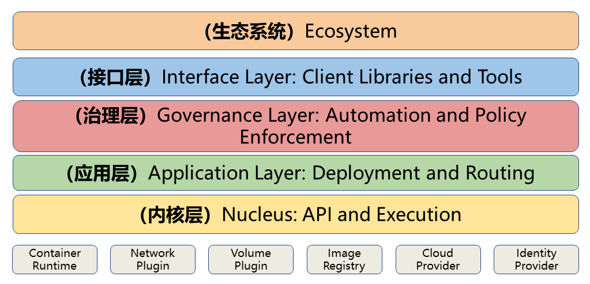

# K8S

## 介绍

* 什么是K8S
  * 开源
  * 管理多个主机上容器的应用
  * 目标是让部署容器化应用简单、高效
  * 提供了应用部署、规划、更新、维护的机制


* 历史
  * Kubernetes含义为舵手、飞行员
  * k8s原因是k、s之间有8个字幕
  * k8s源于google使用十几年的borg系统经验，基于最新技术发展而来


* 为什么需要K8S
  * Docker只能解决一台机器下的问题
  * 已经成为实际标准
  * 微服务、云原生的基础


* 应用部署方式的演进
  * 传统部署，应用直接部署在服务器
    * 人工参与多
    * 脚本不灵活
    * 应用间不隔离
    * 硬件利用率低
  * 虚拟机部署
    * 解决了环境隔离
    * 虚拟机过重，资源占用率高
    * 仍然存在人工参与多和流程繁琐的问题
  * 容器化部署
    * 实现了轻量级资源隔离
  * K8S部署
    * 实现了容器管理
    * 监听容器自动修复
    * 检测流量弹性伸缩
    * 服务发现、负载均衡
    * 机密和配置管理
    * 存储编排
    * 批处理任务


* 企业级容器调度平台
  * Apache Mesos
    * 简介
      * 分布式调度系统内核
      * 早于Docker产生
      * 主/从结构工作模式，主节点分配任务，从节点上的Executor执行任务
      * 使用Zookeeper给主节点提供服务注册、服务发现功能
      * 通过Framework Marathon提供容器调度的能力
    * 优势
      * 经过了时间的检验
      * 支持容器化和非容器化的工作服在
      * 支持应用的健康检查
      * 开放的架构
      * 支持多个框架和多个调度器，通过不同Framework可以运行Haddop/Spark/MPI等
      * 支持超大型规模的节点管理，5W+
  * Docker Swarm
    * 简介
      * Docker官方开发的调度框架
      * 每个节点（Node）对应一个代理（Agent）
      * Swarm控制代理还行任务，拉取和运行不同的镜像
    * 优势
      * 支持标准Docker API
      * 与Docker无缝集成
      * 小数量服务器简单易上手
  * Google Kubernetes


## 核心概念


### borg系统架构

* Cell，系统核心
  * BorgMaster，主服务器节点
  * Borglet，从服务器节点
  * scheduler，调度器
* borgcfg、command-line tools、web browsers，外部接口


### K8S系统架构

* kubectl，用户客户端
* Master，主节点
  * APIServer，核心内外接口
  * authentication、authorization，身份认证授权
  * Scheduler，调度器
  * Controller manager，控制管理器
* Node，从节点
  * docker，容器环境
  * kubelet，管理代理
  * proxy，负载代理


* K8S系统架构特点

  * 基于主从架构

  * 从节点只执行任务

  * 主节点负责调度

  * 通过配置主节点也可以执行任务

  * api-server管理所有接口，所有节点都通过api-server管理


### K8S组件


#### 控制面板组件，Master

* etcd，键值类型存储的分布式数据库，提供了基于Raft算法实现自主的集群高可用
* kube-apiserver，基于REST风格的开放k8s接口服务
* kube-controller-manager，管理k8s中的各种资源的控制器
* cloud-controller-manager，第三方云平台控制器
* kube-scheduler，根据算法将Pod调用到更合适的节点上


#### 节点组件

* kubelet，负责Pod生命周期、存储、网络
* kube-proxy，网络代理、Service服务发现、4层负载均衡
* container runtime，容器运行环境，容器支持Docker、containerd、CRI-O
* Pod，一个Pod包含多个容器，一个节点包含多个Pod


#### 附加组件

* kube-dns，为整个集群提供DNS服务
* Ingress Controller，为外部网络访问接口
* Prometheus、Heapster，监控，二选一
* Dashboard，GUI控制台
* Federation，跨可用区的集群
* Fluentd-elasticsearch，日志收集、存储


### K8S分层架构




* 生态系统
  * 基于K8S开发的应用，如上一节`附加组件`中的应用

* 接口层
  * 所有应用都调用接口层

* 管理层
  * 系统度量
    * 基础设置
    * 容器
    * 网络
  * 自动化
    * 自动扩展
    * 动态Provision等
  * 策略管理
    * RBAC
    * Auota
    * PSP
    * NetworkPolicy

* 应用层
  * 部署
    * 无状态应用
    * 有状态应用
    * 批处理任务
    * 集群应用等
  * 路由
    * 服务发现
    * DNS解析

* 核心层
  * 对外
    * 提供API构建的高层应用
  * 对内
    * 提供插件式应用执行环境


### 服务的分类

* 按状态分类
  * 有状态，如redis、mysql
    * 即运行依赖数据的服务
    * 新实例需要数据迁移、数据恢复
  * 无状态，如nginx


### 资源和对象

* 什么是资源
  * k8s一切皆资源，相当于Java中的类
  * 所有内容都被抽象为资源，如Pod、Service、Node都是资源


* 什么是对象
  * 对象是资源的实例，是持久化的实体，如某个Pod、某个Service、某个Node
  * k8s使用这些实体去表示整个集群的状态


* 创建对象
  * 通过核心的 Kubernetes API 创建、修改、删除对象，即 Api Server 组件提供的接口
  * 命令行工具 kubectl 是 Kubernetes API 的实现
  * 也可以通过描述对象的属性，使用文件创建对象，如 JSON 和 YAML


* 对象的归约（Spec）和状态（Status）
  * 归约描述了对象的期望状态（Desired State），如副本数保持3
  * 状态表示对象的实际状态，由k8s自动维护


### 资源的分类

* 资源分类
  * 元数据型
  * 集群级
  * 命名空间


* 为什么分类资源
  * 区分应用可以使用的资源范围
  * 元空间相当于全局变量，所有应用均可以使用
  * 集群相当于线程本地变量，集群内部可以使用
  * 命名空间相当于局部变量，只有命名空间内部可以使用


* 元数据型
  * Horizontal Pod Autoscaler（HPA）
    * Pod 自动扩容，可以根据 CPU 使用率或自定义指标（metrics）自动对 Pod 进行扩/缩容。
  * PodTemplate
    * Pod Template 是关于 Pod 的定义，控制器通过 Pod Template 信息来创建 Pod。
  * LimitRange
    * 可以对集群内 Request 和 Limits 的配置做一个全局的统一的限制，相当于批量设置了某一个范围内（某个命名空间）的 Pod 的资源使用限制。


* 集群级
  * Namespace，即在集群内划分出的空间
  * Node，物理节点，由k8s管理
  * ClusterRole，一组权限的集合
  * ClusterRoleBinding，将 Subject 绑定到 ClusterRole


* ==命名空间级==

  * 工作负载型

    * Pod
      * 两种使用方式
        * 一个 Pod 中只运行一个容器。"one-container-per-pod" 是 Kubernetes 中最常见的使用方式。此时，您可以认为 Pod 容器组是该容器的 wrapper，Kubernetes 通过 Pod 管理容器，而不是直接管理容器。
        * 一个 Pod 中运行多个需要互相协作的容器。您可以将多个紧密耦合、共享资源且始终在一起运行的容器编排在同一个 Pod 中
      * Pod副本
        * 一个pod被复制成多份，每一份称为副本
      * 控制器
        * 控制器是为了保持Pod状态的一种Pod
        * 无状态服务控制器
          * ReplicationController（RC）	
            * 已被RS替代
            * 控制容器数量伸缩
          * ReplicaSet（RS）
            * 使用新的Label和Selector机制
            * RC只能对一个POD起作用，RS可以对多个POD起作用
          * Deployment
            * Deployment对RS再次封装，提供了更丰富的部署相关的功能
            * 自动创建RS / Pod
            * 滚动升级/回滚
            * 平滑扩容/缩容
            * 暂停和恢复
        * 有状态服务控制器，StatefulSet
          * 主要特点
            * 稳定的持久化存储
              * Pod 重新调度后还是能访问到相同的持久化数据，基于 PVC 来实现
            * 稳定的网络标志
              * Pod 重新调度后其 PodName 和 HostName 不变，基于 Headless Service
            * 有序部署，有序扩容
              * Pod 是有顺序的，在部署或者扩展的时候要依据定义的顺序依次依次进行（即从 0到 N-1，在下一个Pod 运行之前所有之前的 Pod 必须都是 Running 和 Ready 状态），基于 init containers 来实现
            * 有序收缩，有序删除
              * 即从 N-1 到 0
          * 组成
            * Headless Service，相当于POD间的DNS服务
            * volumeClaimTemplate，创建持久化卷的模板
          * 域名
            * StatefulSet 中每个 Pod 的 DNS 格式为 `statefulSetName-{0..N-1}.serviceName.namespace.svc.cluster.local`
              * serviceName 为 Headless Service 的名字
              * 0..N-1 为 Pod 所在的序号，从 0 开始到 N-1
              * statefulSetName 为 StatefulSet 的名字
              * namespace 为服务所在的 namespace，Headless Servic 和 StatefulSet 必须在相同的 namespace
              * .cluster.local 为 Cluster Domain
          * 注意事项
            * 所有Pod的Volume必须使用PersistentVolume或者是管理员事先创建好
            * 为了保证数据安全，删除StatefulSet时不会删除Volume
            * StatefulSet 需要一个 Headless Service 来定义 DNS domain，需要在 StatefulSet 之前创建好
        * 守护进程控制器，DaemonSet
          * DaemonSet 为每个匹配的 Node 上都运行守护进程（容器副本）
          * 常用来部署一些集群的日志、监控或者其他系统管理应用。典型的应用包括：
            - 日志收集，比如 fluentd，logstash 等
            - 系统监控，比如 Prometheus Node Exporter，collectd，New Relic agent，Ganglia gmond 等
            - 系统程序，比如 kube-proxy, kube-dns, glusterd, ceph 等
        * 任务/定时任务控制器
          * Job
          * CronJob

  * 服务发现

    * Service
      * “Service” 简写 “svc”。Pod 不能直接提供给外网访问，而是应该使用 service。Service 就是把 Pod 暴露出来提供服务，Service 才是真正的“服务”，它的中文名就叫“服务”。
      * 可以说 Service 是一个应用服务的抽象，定义了 Pod 逻辑集合和访问这个 Pod 集合的策略。Service 代理 Pod 集合，对外表现为一个访问入口，访问该入口的请求将经过负载均衡，转发到后端 Pod 中的容器。
    * Ingress
      * Ingress 可以提供外网访问 Service 的能力。可以把某个请求地址映射、路由到特定的 service。
      * ingress 需要配合 ingress controller 一起使用才能发挥作用，ingress 只是相当于路由规则的集合而已，真正实现路由功能的，是 Ingress Controller，ingress controller 和其它 k8s 组件一样，也是在 Pod 中运行。
    * 

  * 存储

    * Volume
      * 数据卷，共享 Pod 中容器使用的数据。用来放持久化的数据，比如数据库数据。
    * CSI
      * Container Storage Interface 是由来自 Kubernetes、Mesos、Docker 等社区成员联合制定的一个行业标准接口规范，旨在将任意存储系统暴露给容器化应用程序。
      * CSI 规范定义了存储提供商实现 CSI 兼容的 Volume Plugin 的最小操作集和部署建议。CSI 规范的主要焦点是声明 Volume Plugin 必须实现的接口。

  * 特殊类型配置

    * ConfigMap

      * 用来放配置，与 Secret 是类似的，只是 ConfigMap 放的是明文的数据，Secret 是密文存放。

    * Secret

      * Secret 解决了密码、token、密钥等敏感数据的配置问题，而不需要把这些敏感数据暴露到镜像或者 Pod Spec 中。Secret 可以以 Volume 或者环境变量的方式使用。

      * **Secret 有三种类型：**

        - Service Account：用来访问 Kubernetes API，由 Kubernetes 自动创建，并且会自动挂载到 Pod 的 /run/secrets/kubernetes.io/serviceaccount 目录中；

        - Opaque：base64 编码格式的 Secret，用来存储密码、密钥等；

        - kubernetes.io/dockerconfigjson：用来存储私有 docker registry 的认证信息。

    * DownwardAPI

      * 让 pod 里的容器能够直接获取到这个 pod 对象本身的一些信息
      * 提供了两种方式用于将 pod 的信息注入到容器内部：
        * 环境变量：用于单个变量，可以将 pod 信息和容器信息直接注入容器内部
        * volume 挂载：将 pod 信息生成为文件，直接挂载到容器内部中去

  * 其他

    * Role
      * Role 是一组权限的集合，例如 Role 可以包含列出 Pod 权限及列出 Deployment 权限，Role 用于给某个 Namespace 中的资源进行鉴权。
    * RoleBinding
      * RoleBinding ：将 Subject 绑定到 Role，RoleBinding 使规则在命名空间内生效。


## 搭建K8S集群


### 搭建方案

* 搭建方案
  * minikube
    * [minikube](https://minikube.sigs.k8s.io/) 是一个工具， 能让你在本地运行 Kubernetes。 minikube 在你的个人计算机（包括 Windows、macOS 和 Linux PC）上运行一个一体化（all-in-one）或多节点的本地 Kubernetes 集群，以便你来尝试 Kubernetes 或者开展每天的开发工作。
  * kubeadm
    * 你可以使用 [kubeadm](https://kubernetes.io/zh-cn/docs/setup/production-environment/tools/kubeadm/) 工具来创建和管理 Kubernetes 集群。 该工具能够执行必要的动作并用一种用户友好的方式启动一个可用的、安全的集群。
  * 二进制安装
    * 利用 k8s 官方 github 仓库下载二进制包安装，安装过程较复杂，但相对较为稳定，推荐生产环境使用。
  * 命令行工具
* 学习推荐
  * minikube
* 生产环境推荐
  * kubeadm
  * 二进制安装
  * 命令行工具


### kubeadmin搭建

* 服务器要求
  * 3台服务器（虚拟机）
  * 联网访问镜像仓库
* 软件环境
  * CentOS7
  * Docker20
  * k8s 1.23.6


* 安装步骤
  * 服务器初始化
  * 安装基础软件
    * 安装Docker
    * 添加阿里云yum源
    * 安装kubeadm、kubelet、kubectl
  * 部署Kubernetes Master
  * 加入Kubernetes Node
  * 部署CNI网络插件
  * 测试kubernets集群


* 服务器初始化

```sh
# 临时关闭防火墙
systemctl stop firewalld
# 永久关闭防火墙
systemctl disable firewalld

# 永久关闭selinux
sed -i 's/enforcing/disabled/' /etc/selinux/config
# 临时关闭selinux
setenforce 0

# 临时关闭swap
swapoff -a
# 永久关闭swap
sed -ri 's/.*swap.*/#&/' /etc/fstab
# 关闭完swap后，一定要重启一下虚拟机！！！

# 根据规划设置主机名
hostnamectl set-hostname <hostname>

# 在master添加hosts
cat >> /etc/hosts << EOF
192.168.113.120 k8s-master
192.168.113.121 k8s-node1
192.168.113.122 k8s-node2
EOF


# 将桥接的IPv4流量传递到iptables的链
cat > /etc/sysctl.d/k8s.conf << EOF
net.bridge.bridge-nf-call-ip6tables = 1
net.bridge.bridge-nf-call-iptables = 1
EOF
# 生效
sysctl --system  


# 时间同步
yum install ntpdate -y
ntpdate time.windows.com
```

* 安装基础软件

```sh
yum install -y kubelet-1.23.6 kubeadm-1.23.6 kubectl-1.23.6

systemctl enable kubelet

# 配置关闭 Docker 的 cgroups，修改 /etc/docker/daemon.json，加入以下内容
"exec-opts": ["native.cgroupdriver=systemd"]

# 重启 docker
systemctl daemon-reload
systemctl restart docker
```

* 部署Kubernetes Master

```sh
# 在 Master 节点下执行

kubeadm init \
      --apiserver-advertise-address=192.168.113.120 \
      --image-repository registry.aliyuncs.com/google_containers \
      --kubernetes-version v1.23.6 \
      --service-cidr=10.96.0.0/12 \
      --pod-network-cidr=10.244.0.0/16

# 安装成功后，复制如下配置并执行
mkdir -p $HOME/.kube
sudo cp -i /etc/kubernetes/admin.conf $HOME/.kube/config
sudo chown $(id -u):$(id -g) $HOME/.kube/config
kubectl get nodes
```

* 部署Kubernetes Node

```sh
分别在 k8s-node1 和 k8s-node2 执行

# 下方命令可以在 k8s master 控制台初始化成功后复制 join 命令

kubeadm join 192.168.113.120:6443 --token w34ha2.66if2c8nwmeat9o7 --discovery-token-ca-cert-hash sha256:20e2227554f8883811c01edd850f0cf2f396589d32b57b9984de3353a7389477


# 如果初始化的 token 不小心清空了，可以通过如下命令获取或者重新申请
# 如果 token 已经过期，就重新申请
kubeadm token create

# token 没有过期可以通过如下命令获取
kubeadm token list

# 获取 --discovery-token-ca-cert-hash 值，得到值后需要在前面拼接上 sha256:
openssl x509 -pubkey -in /etc/kubernetes/pki/ca.crt | openssl rsa -pubin -outform der 2>/dev/null | \
openssl dgst -sha256 -hex | sed 's/^.* //'
```

* 部署CNI网络查件

```sh
# 在 master 节点上执行
# 下载 calico 配置文件，可能会网络超时
curl https://docs.projectcalico.org/manifests/calico.yaml -O

# 修改 calico.yaml 文件中的 CALICO_IPV4POOL_CIDR 配置，修改为与初始化的 cidr 相同

# 修改 IP_AUTODETECTION_METHOD 下的网卡名称

# 删除镜像 docker.io/ 前缀，避免下载过慢导致失败
sed -i 's#docker.io/##g' calico.yaml
```

* 测试kubernetes集群

```sh
# 创建部署
kubectl create deployment nginx --image=nginx

# 暴露端口
kubectl expose deployment nginx --port=80 --type=NodePort

# 查看 pod 以及服务信息
kubectl get pod,svc
```


### Docker Desktop自带的kubernetes

* docker desktop 自带的 kubernetes 是一个单节点集群，目前是不能配置成多节点的。如果你想要在本地搭建多节点的 kubernetes 集群，你可以尝试使用其他的工具，例如 minikube, kind, k3s 等。
* docker desktop 自带的 kubernetes 的优点是安装和使用非常简单，只需要在 docker 应用的首选项中启用 kubernetes 选项，就可以自动安装和配置好 kubernetes 集群。你还可以使用 docker 应用内嵌的 kubectl 命令行工具来管理和操作集群。另外，你可以通过 127.0.0.1 的地址来访问集群内部的服务，不需要额外的端口转发或代理。
* docker desktop 自带的 kubernetes 的缺点是它只能运行在一个节点上，不能模拟多节点集群的场景。它也不能支持一些高级功能，例如身份认证，高可用，服务发现等。如果你想要体验更完整的 kubernetes 功能，你可能需要使用其他的工具或者云服务来搭建多节点的 kubernetes 集群。


### 命令行工具kubectl

* 


### API概述


## Pod


## 资源调度


## 服务发现


## 配置与存储


## 高级调度


## 访问控制


## Helm包管理


## K8S集群监控


## 集群日志管理


## 运维平台


## DevOPS实例


