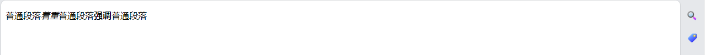

# CSS

## CSS基础

* Cascading Style Sheet的缩写，层叠样式表
* 用来控制网页样式，将样式与内容、结构的配置表
* html发展早期通过元素属性来控制样式，但是结构与样式混用会使网页代码难以维护，逐步从html中解耦出来
* CSS2.1之后，标准分模块制定，进展差异很大，所以放弃版本控制，采用定期发布标准
* 浏览器会忽略不存在的属性和无效的属性值

### CSS基本语法

* 使用`/*注释*/`注释
* 属性名称和属性值均不区分大小写

#### 行内CSS基本语法

* 在html元素style属性内使用纯文本书写CSS
* 多个属性用分号分割

```html
<h1 style="color: blue;background-color: yellow;border: 1px solid black;">
  Hello World!
</h1>
```

#### 独立CSS基本语法

* 选择器（Selector） + 大括号 + 多条声明组成属性集、规则集、规则
* 大括号内多条声明（Declaration）用分号分割
* 属性（Properties）和属性值（Property value）使用冒号分隔
* 一个属性集使用多个选择器时，使用逗号分隔

<div align="left">

<figure><figcaption></figcaption></figure>

</div>

示例：

```html
<style>
  h1 {
    color: blue;
    background-color: yellow;
    border: 1px solid black;
  }
  p {
    color: red;
  }
</style>
```

### 在HTML中使用CSS的方式

#### 内联样式表（行内式）

* 页面多个元素之间会重复编码
* 不易维护
* 不易阅读
* 无法排版
* 与html结构代码耦合

```html
<!doctype html>
<html lang="zh-CN">
  <head>
    <meta charset="utf-8" />
    <title>我的 CSS 测试</title>
  </head>
  <body>
    <h1 style="color: blue;background-color: yellow;border: 1px solid black;">
      Hello World!
    </h1>
    <p style="color:red;">这是我的第一个 CSS 示例</p>
  </body>
</html>
```

#### 内部样式表（嵌入式）

* 多个页面之间会重复编码，不易维护

```html
<!doctype html>
<html lang="zh-CN">
  <head>
    <meta charset="utf-8" />
    <title>我的 CSS 测试</title>
    <style>
      h1 {
        color: blue;
        background-color: yellow;
        border: 1px solid black;
      }
      p {
        color: red;
      }
    </style>
  </head>
  <body>
    <h1>Hello World!</h1>
    <p>这是我的第一个 CSS 示例</p>
  </body>
</html>
```

#### 外部样式表

* css保存在独立文件，产生额外一次http请求

示例：

```html
<link rel="stylesheet" href="styles.css" />
```

完整示例：

```css
/* styles.css */
h1 {
  color: blue;
  background-color: yellow;
  border: 1px solid black;
}
p {
  color: red;
}
```

```html
<!-- index.html -->
<!doctype html>
<html lang="zh-CN">
  <head>
    <meta charset="utf-8" />
    <title>我的 CSS 测试</title>
    <link rel="stylesheet" href="styles.css" />
  </head>
  <body>
    <h1>Hello World!</h1>
    <p>这是我的第一个 CSS 示例</p>
  </body>
</html>
```

## CSS选择器

### 原子选择器

#### 元素选择器（类型选择器、标签选择器、标签名选择器）

示例：

```css
h1 {
}
```

#### 全局选择器

```css
* {
    margin: 0;
}
```

```css
/* 全局选择器特殊用途，区别自带选择器和伪类选择器： */

/* 
    artical元素选择器与:first-child中间有一个空格
    表示选择artical元素的后代的第一个元素
*/
article :first-child {
}
/*
    artical元素选择器与:first-child中间无空格
    表示选择artical作为其他元素的第一个子元素
*/
article:first-child {
}
/*
    使用*:first-child可以与伪类选择器显著区别
*/
article *:first-child {
}
```

#### 类选择器

* 使用点加类名表示选择器
* 不同html元素可以设置相同class
* 一个html元素可以设置多个class类，使用空格分开

示例：

```css
.highlight {
    background-color: yellow;
}
```

* html多个元素分类设置属性，而飞每个元素设置所有属性是一种解耦的思想

示例：

```html
<!doctype html>
<html lang="en">
    <head>
        <meta charset="utf-8" />
        <title>CSS</title>
        <style>
            /* 按元素设置css属性存在耦合 */
            #p1 {
                color: green;
                font-size: 20px;
            }
            #p2 {
                color: green;
                font-weight: bold;
            }
            #p3 {
                font-weight: bold;
                font-size: 20px;
            }

            /* 先将样式封装成类别，再设置给元素，将样式从元素解耦 */
            .green {
                color: green;
            }
            .big_font {
                font-size: 20px;
            }
            .bold_font {
                font-weight: bold;
            }
        </style>
    </head>
    <body>
        <p id="p1">id选择器第1行</p>
        <p id="p2">id选择器第2行</p>
        <p id="p3">id选择器第3行</p>
        <hr/>
        <p class="green big_font">class选择器第1行</p>
        <p class="green bold_font">class选择器第2行</p>
        <p class="big_font bold_font">class选择器第3行</p>
    </body>
</html>
```

#### id选择器

* 使用井号加类名表示选择器
* html元素id页面唯一

示例：

```css
#unique {
}
```

#### 标签属性选择器

根据标签上属性是否存在选择：

```css
a[title] {
}
```

根据标签上属性的值选择：

```css
a[href="https://example.com"] {
}
```

#### 伪类、伪元素选择器

[https://developer.mozilla.org/zh-CN/docs/Learn/CSS/Building\_blocks/Selectors/Pseudo-classes\_and\_pseudo-elements](https://developer.mozilla.org/zh-CN/docs/Learn/CSS/Building\_blocks/Selectors/Pseudo-classes\_and\_pseudo-elements)

* 伪类
  * 选择元素的某个状态
  * 使用单冒号

```css
a:hover {
}
```

* 常见伪类：
  * :first-child
  * :last-child
  * :only-child
  * :invalid
* 连接伪类
  * `a:link` 没有被访问过时
  * `a:visited` 访问过时
* 用户行为伪类
  * `a:hover` 鼠标悬浮时
  * `a:active` 鼠标按住时
  * `a:focus`&#x20;
* 伪元素
  * 选择元素的某个部分，或者某个位置
  * 使用双冒号
* 常用伪元素：
  * ::first-line
  * ::before，特殊伪元素
  * ::after，特殊伪元素

### 关系选择器（关系，Combinator，组合选择器）

#### 组合选择器（官方文档中不认为是关系选择器的一种）

* 多个选择器之间使用逗号分隔
* 官方建议多个选择器之间换行排版
* 官方认为只是将多个相同定义的选择器合并写在一起的一种写法

```css
/* 分开写法 */
h3 {
    color: gray;
    font-size: 14px;
}
span {
    color: gray;
    font-size: 14px;
}

/* 合并写法 */
h3,
span {
    color: gray;
    font-size: 14px;
}
```

#### 交集选择器（官方文档中不认为是关系选择器的一种）

* 多个原子选择器紧挨着书写
* 由于没有分隔符，所以元素选择器只能在第一位
* 由于一个html元素只有自身一种类型，所以元素选择器只能出现一次
* 由于一个html元素只能设置一个id，所以id选择器只能出现一次
* 由于一个html元素能设置多个class，所以class选择器可以出现多次

```css
/* 元素交类 */
p.active {
}

/* 元素交id */
p#pid{
}

/* 过滤多个类都存在的元素 */
.class1.class2{
}
```

#### 后代选择器

* DOM树中元素的后代元素（支持多层嵌套，不必是直接孩子，包含子代）
* 使用空格分隔原子选择器

```
// Some code
```

#### 子代关系选择器

* DOM树中元素直接孩子元素
* 使用大于号>分隔原子选择器

```markup
```

#### 邻接兄弟选择器

* DOM树中元素的邻接兄弟元素
* 使用加号+分隔原子选择器

```
// Some code
```

#### 通用兄弟选择器

* DOM书中元素的兄弟元素（可不邻接）
* 使用波浪号\~分隔原子选择器

```
// Some code
```

## CSS继承、层叠、优先级

### 继承

* 某些css属性会被内部元素集成，如font-size，font-wight，color
* 某些css属性不会被内部元素继承，如width、margin、padding、border
* 浏览器对部分标签的部分属性有特定设置，优先级较高，不会继承自父元素，如a，h1

```html
<!-- h1标签和p标签均继承了body的color属性  -->
<!-- h1标签有单独的font-size设置，body的font-size设置只被p继承 -->
<!-- h1标签的font-size是2em，em单位的基准取自父元素，所以h1的尺寸会同步变大  -->

<!doctype html>
<html lang="en">
    <head>
        <meta charset="utf-8" />
        <title>CSS</title>
        <style>
            body{
                color: blue;
                font-size: 50px;
            }
        </style>
    </head>
    <body>
        <p>paragraph段落</p>
        <div>
            <h1>H1标题</h1>
            <h2>H2标题</h2>
        </div>
    </body>
</html>
```

<div align="left">

<figure><figcaption></figcaption></figure>

</div>

#### 默认值

* 协议中会规定每个属性的默认值（初始值）
* 浏览器（user-agent）为了使得html结构在默认效果下能够区分，给属性设置了一部分默认值

#### 继承控制

* 5个特殊的属性值：
  * `inherit`使子元素属性和父元素相同。开启继承。
  * `initial`设置为该属性的初始值。协议初始。
  * `revert`重置为浏览器的默认样式。在许多情况下，此值的作用类似于 `unset`。
  * `revert-layer` 重置为在上一个层叠层中建立的值。
  * `unset`将属性重置为自然值，也就是如果属性是自然继承那么就是 `inherit`，否则和 `initial` 一样

示例：

```html
<!doctype html>
<html lang="en">
    <head>
        <meta charset="utf-8" />
        <title>CSS</title>
        <style>
            body {
                color: green;
            }
            .my-class-1 a {
                color: inherit;
            }
            .my-class-2 a {
                color: initial;
            }
            .my-class-3 a {
                color: unset;
            }
        </style>
    </head>
    <body>
        <ul>
            <li>Default <a href="#">link</a> color</li>
            <li class="my-class-1">Inherit the <a href="#">link</a> color</li>
            <li class="my-class-2">Reset the <a href="#">link</a> color</li>
            <li class="my-class-3">Unset the <a href="#">link</a> color</li>
        </ul>
    </body>
</html>   
```

效果：

<div align="left">

<figure><figcaption></figcaption></figure>

</div>

说明：

* 浏览器对\<a>标签有默认样式绿色，默认会覆盖继承自父元素\<body>的绿色
* 强制使用inherit属性值，则强制继承父元素\<body>的绿色
* 强制使用initial属性值，color属性的协议默认值为黑色
* 强制使用unset属性值，color属性为自然继承，则继承\<body>元素的绿色

#### 重置所有属性

* 使用all关键字指代所有属性

```css
p {
    all: unset;
}
```

### 优先级（specificity），权重

* 指向更具体的选择器权重越高，如id选择器>类选择器>元素选择器
* 选择器中有一个id选择器，记100分
* 选择器中有一个类选择器，记10分
* 选择器中有一个元素选择器，记1分
* 内联样式记1000分
* 选择器计分累加，但是不进位
* 继承优先级低于所有选择器

HTML：

```html
<p class="special">我是什么颜色的？</p>
```

CSS：

```css
.special {
  color: red;
}

p {
  color: blue;
}
```

以上代码效果为红色，class选择器权重大于元素选择器

#### !important强制优先，尽量避免使用

```css
.better {
    background-color: gray;
    border: none !important;
}
```

### 层叠（cascade）

* 同优先级的选择器，按解析顺序，后出现的属性覆盖先出现的

&#x20; 示例：

```css
/* 效果为绿色，样式存在层叠覆盖，后出现的覆盖先出现的 */
p {
  color: red;
}
p {
  color: blue;
}
```

### 清除浏览器默认样式

[https://meyerweb.com/eric/tools/css/reset/](https://meyerweb.com/eric/tools/css/reset/)

```
/* http://meyerweb.com/eric/tools/css/reset/ 
   v2.0 | 20110126
   License: none (public domain)
*/

html, body, div, span, applet, object, iframe,
h1, h2, h3, h4, h5, h6, p, blockquote, pre,
a, abbr, acronym, address, big, cite, code,
del, dfn, em, img, ins, kbd, q, s, samp,
small, strike, strong, sub, sup, tt, var,
b, u, i, center,
dl, dt, dd, ol, ul, li,
fieldset, form, label, legend,
table, caption, tbody, tfoot, thead, tr, th, td,
article, aside, canvas, details, embed, 
figure, figcaption, footer, header, hgroup, 
menu, nav, output, ruby, section, summary,
time, mark, audio, video {
	margin: 0;
	padding: 0;
	border: 0;
	font-size: 100%;
	font: inherit;
	vertical-align: baseline;
}
/* HTML5 display-role reset for older browsers */
article, aside, details, figcaption, figure, 
footer, header, hgroup, menu, nav, section {
	display: block;
}
body {
	line-height: 1;
}
ol, ul {
	list-style: none;
}
blockquote, q {
	quotes: none;
}
blockquote:before, blockquote:after,
q:before, q:after {
	content: '';
	content: none;
}
table {
	border-collapse: collapse;
	border-spacing: 0;
}
```

## 常用属性

### 字体属性

#### font综合属性

```
// Some code
```

#### font-family

* 字体在用户设备上没有时，使用默认字体
* 可以设置多个备选字体，用逗号分隔

#### font-size

* px，像素，相对设备分辨率
* em，相对字体大小，1em=1倍字体大小
* rem

#### color

* 可使用单词（枚举值）表示法赋值，不用加引号
* rgb(0-255, 0-255, 0-255)，RGB表示法
* rgba(0-255, 0-255, 0-255, 0-1)，RGBA表示法，多一个透明度（alpha）
* \#FFFFFF 16进制表示法

#### font-style

* 常用只有normal和italic
* oblique是正常字体的斜体变形，italic是书写体草书
* bold属于font-weight属性

```css
font-style: normal;
font-style: italic;
font-style: oblique;
```

#### font-weight

* 一般只使用normal和bold两种取值
* 数值取值范围1-1000
* normal=400
* bold=700

```css
font-weight: normal;
font-weight: bold;
font-weight: 1;
font-weight: 1000;
```

### 文本属性

#### text-decoration

* none
* line-through 删除线
* underline 下划线
* overline 上划线

#### text-indent 缩进

* 在每个p元素包裹内容的首行缩进
* 一般使用em，相对字体大小
* 也可以使用px

#### line-height 行高

* 文本正常在中间显示
* 行高不会合并
* 一般使用em，相对字体大小

#### letter-spacing 文字间距，只对文字起作用


#### word-spacing 单词间距


#### text-align 文本对齐方式

* left，默认，水平方向左对齐
* center，水平方向居中对齐
* right，水平方向右对齐


## 盒模型

* `contant box`，内容，设置width和height实际上是设置内容的宽高
* `padding box`，内边距，盒子边框到内容盒子的距离
* `border box`，边框，内边距和外边距之间的线，边框也会占用空间
* `margin box`，外边距，元素边界外侧的空间。
* 元素占用的宽高还要加上padding、border、margin，background
* background填充的是contant、padding、border的部分

<div align="left">

<figure><figcaption></figcaption></figure>

</div>

### padding、margin

* 以padding为例
* margin，bolder-width，border-style，border-color类似

### 外边距折叠，外边距塌陷

* 相邻两个块元素display:block的上下margin会合并取最大值
* 左右margin不会合并

```css
/* 上下左右分别设置 */
padding-top: 1px;
padding-left: 1px;
padding-bottom: 1px;
padding-right: 1px;

/* 
    上下左右：1px 
*/
padding: 1px;

/* 
    上下：1px
    左右：2px
*/
padding: 1px 2px;

/*
    上：1px
    所有：2px
    下：3px
*/
padding: 1px 2px 3px;

/*
    上：1px
    右：2px
    下：3px
    左：4px
*/
padding: 1px 2px 3px 4px;
```

### 盒子居中

* 子盒子宽度不足以填充父盒子时，右填充margin
* 子盒子设置margin-left: auto，左填充margin，右边紧贴父盒子
* 子盒子同时设置margin-left: auto; margin-right: auto; 子盒子水平居中父盒子

```css
margin-left: auto;
margin-right: auto;

/*
    上下margin：0
    左右margin：auto
*/
margin: 0 auto;
```

###

### border，边框

* border-style
  * solid
  * dotted
  * double
  * dashed

```css
border-width: 4px;
border-style: solid;
border-color: green;

/* 合并写法 */
border: 4px solid green;

/* 分别设置四个方向边框 */
border-width: 1px 2px 3px 4px;
border-top-width: 1px;
border-right-width: 2px;
border-bottom-width: 3px;
border-left-width: 4px;

/* border-style, border-color */
border-top-style: solid;
border-top-color: green;

/* 清除边框 */
border: none;
border: 0;
```

### outline，外线

* input 除边框外还有外线
* 外线不占用盒子空间
* 属性与border类似

```css
outline: none;
```

## 布局,排版

### 默认流布局

* 浏览器默认布局
* 块元素垂直方向从上到下依次分布
* 行内元素（块内）水平方向从左到右依次分布
* 使用css修改布局的过程就是逐步改变浏览器默认布局的过程，没有被改变的部分还会按默认布局
* 嵌套在块内的内容，也按照块元素、行内元素的特性进行排版，如块\<ul>中的块\<li>

#### 默认的html元素的布局分类

* display:block，块元素
  * 常见\<div>、\<ul>、\<ol>、\<li>、\<p>、\<h>、\<table>、\<form>默认是块元素
  * 特点：
    * 独占一行
    * 可以设置宽高
    * 不设置宽高时，默认是父元素100%宽度
* display:inline，行内
  * 常见\<a>、\<span>、\<em>、\<strong>、\<label>默认是行内元素
  * 特点：
    * 在一行内依次显示，父容器宽度不够时会显示在下一行
    * 不能设置宽高
    * 宽高为文本内容占据的宽高
* display:inline-block，行内块
  * 常见\<input>、\<image>默认是行内块
  * 特点：
    * 在一行内显示，父容器宽度不够时会显示在下一行
    * 可以设置宽高
* display: none，不显示

#### 修改默认display的用途——排版，为默认inline的元素设置宽高

```css
display: inline-block;

/* 一般inline转为inline-block后，还想让内容居中 */

/* 水平方向居中 */
text-align: center;

/* 垂直方向居中 */
line-height: 与content的height相同;
```

#### 修改默认display的用途——隐藏元素

```css
display: none;
```


### 弹性盒子，Flexbox，display:flex

* 给父元素设置flex布局、排列方式、拉伸，给子元素设置是否伸展

### 网格，Grid，display:grid

* 给父元素设置行列，子元素自动布局
* 也可以给子元素设置在父元素中占据的行列

### 表格布局，display:table

* display:table，table
* display:table-caption，caption
* display:table-row，tr
* display:table-cell，th 或 td
* display:table-row-group，tbody
* display:table-header-group，thead
* display:table-footer-group，tfoot

### 多列布局


## 辅助布局

### 浮动，float

####

<div align="left">

<figure><figcaption></figcaption></figure>

</div>

#### 浮动的文字环绕特性（原始需求）

* 浮动的组件脱离了标准文档流，但是会排开标准文档流中的内容，但是不会排开盒子
* 浮动的组件可以使用margin占用标准文档流的空间，但是标准文档流的组件不能使用margin占用浮动组件的空间

#### 浮动的特性

* 浮动后，盒子不再占用整行，会收缩成内容宽度
* 浮动盒子会紧贴父元素上侧内壁，多个浮动盒子会紧挨着显示
* `float:left`，盒子向左靠拢
* `float:right`，盒子向右靠拢
* `float:none`，默认值，不浮动。
* `float:inherit`，继承父元素的浮动属性。

#### 清除浮动（解决浮动盒子造成父盒子塌陷）

盒子塌陷问题：

```html
<!doctype html>
<html lang="en">
    <head>
        <meta charset="utf-8" />
        <title>CSS</title>
        <style>
            .child1 {
                background-color: gray;
                height: 200px;
                width: 200px;
                /* float: left; */
            }
            .child2 {
                background-color: aliceblue;
                height: 300px;
                width: 300px;
                /* float: right; */
            }
            .parent {
                background-color: yellow;
            }
        </style>
    </head>
    <body>
        <div class="parent">
            <div class="child1">
                child1
            </div>
            <div class="child2">
                child2
            </div>
        </div>
    </body>
</html>
```

不浮动时父盒子高度被子盒子1+子盒子2撑开

<div align="left">

<figure><figcaption></figcaption></figure>

</div>

child1浮动时，child1脱离标准文档流，父盒子高度=child2高度

<div align="left">

<figure><figcaption></figcaption></figure>

</div>

child1、child2都浮动时，child1、child2都脱离标准文档流，父盒子塌陷高度为0

<div align="left">

<figure><figcaption></figcaption></figure>

</div>

方法一：固定高度

* 给父盒子设置固定高度为子盒子高度
* 缺点：不能被子盒子撑开高度，父子元素耦合，不易维护

方法二：内墙法

* 在所有浮动元素之后加一个空的块元素，设置清除浮动的css属性`clear: both;`
* 缺点：结构冗余

代码：

```html
<!doctype html>
<html lang="en">
    <head>
        <meta charset="utf-8" />
        <title>CSS</title>
        <style>
            .child1 {
                background-color: gray;
                height: 200px;
                width: 200px;
                float: left;
            }
            .child2 {
                background-color: aliceblue;
                height: 300px;
                width: 300px;
                float: right;
            }
            .parent {
                background-color: yellow;
            }
            .clearfix {
                clear: both;
            }
        </style>
    </head>
    <body>
        <div class="parent">
            <div class="child1">
                child1
            </div>
            <div class="child2">
                child2
            </div>
            <div class="clearfix">
            </div>
        </div>
    </body>
</html>
```

效果：父盒子高度自动撑开到最大的子元素高度

<div align="left">

<figure><figcaption></figcaption></figure>

</div>

方法三：伪元素内墙

* 使用伪元素给父盒子后面添加文本
* 将文本转换成block
* 设置clear:both;属性

代码：

```html
<!doctype html>
<html lang="en">
    <head>
        <meta charset="utf-8" />
        <title>CSS</title>
        <style>
            .child1 {
                background-color: gray;
                height: 200px;
                width: 200px;
                float: left;
            }
            .child2 {
                background-color: aliceblue;
                height: 300px;
                width: 300px;
                float: right;
            }
            .parent {
                background-color: yellow;
            }
            .clearfix::after{
                content: '';
                display: block;
                clear: both;
            }
        </style>
    </head>
    <body>
        <div class="parent clearfix">
            <div class="child1">
                child1
            </div>
            <div class="child2">
                child2
            </div>
        </div>
    </body>
</html>
```

方法四：overflow:hidden;

* overflow的特性：
  * overflow默认值是visible，含义为内容超出盒子大小后的行为为可见
  * overflow:hidden; 含义为超出盒子大小后内容隐藏
  * overflow:scroll; 含义为超出盒子大小后滚动
  * 除overflow:visible;之外，其余overflow属性值均能形成BFC区域
* 利用overflow实现修复父盒子塌陷：
  * 父盒子设置overflow:hidden;属性后，父盒子及其子盒子形成独立BFC区域
  * 计算BFC高度时，浮动子元素也参与计算

代码：

```html
<!doctype html>
<html lang="en">
    <head>
        <meta charset="utf-8" />
        <title>CSS</title>
        <style>
            .child1 {
                background-color: gray;
                height: 200px;
                width: 200px;
                float: left;
            }
            .child2 {
                background-color: aliceblue;
                height: 300px;
                width: 300px;
                float: right;
            }
            .parent {
                background-color: yellow;
                overflow: hidden;
            }
        </style>
    </head>
    <body>
        <div class="parent">
            <div class="child1">
                child1
            </div>
            <div class="child2">
                child2
            </div>
        </div>
    </body>
</html>
```

#### 为什么不能用div.display = inline-block实现多列布局

* \<div>标签换行会导致inline-block中间出现空格，无法准确计算布局数值
* \<div>连续书写可以解决这个问题，但是代码难以阅读

#### 使用浮动进行列布局

传统布局方式利用浮动实现多栏布局，用于布局的一行盒子会一起浮动

### 定位，position

* **静态定位**（Static positioning）是每个元素默认的属性——它表示“将元素放在文档布局流的默认位置——没有什么特殊的地方”。
* **相对定位**（Relative positioning）允许我们相对于元素在正常的文档流中的位置移动它——包括将两个元素叠放在页面上。这对于微调和精准设计（design pinpointing）非常有用。
* **绝对定位**（Absolute positioning）将元素完全从页面的正常布局流（normal layout flow）中移出，类似将它单独放在一个图层中。我们可以将元素相对于页面的 `<html>` 元素边缘固定，或者相对于该元素的_最近被定位祖先元素_（nearest positioned ancestor element）。绝对定位在创建复杂布局效果时非常有用，例如通过标签显示和隐藏的内容面板或者通过按钮控制滑动到屏幕中的信息面板。
* **固定定位**（Fixed positioning）与绝对定位非常类似，但是它是将一个元素相对浏览器视口固定，而不是相对另外一个元素。这在创建类似在整个页面滚动过程中总是处于屏幕的某个位置的导航菜单时非常有用。
* **粘性定位**（Sticky positioning）是一种新的定位方式，它会让元素先保持和 `position: static` 一样的定位，当它的相对视口位置（offset from the viewport）达到某一个预设值时，它就会像 `position: fixed` 一样定位。


## 背景属性及雪碧图


## 圆角及阴影


## 布局


## 元素居中

