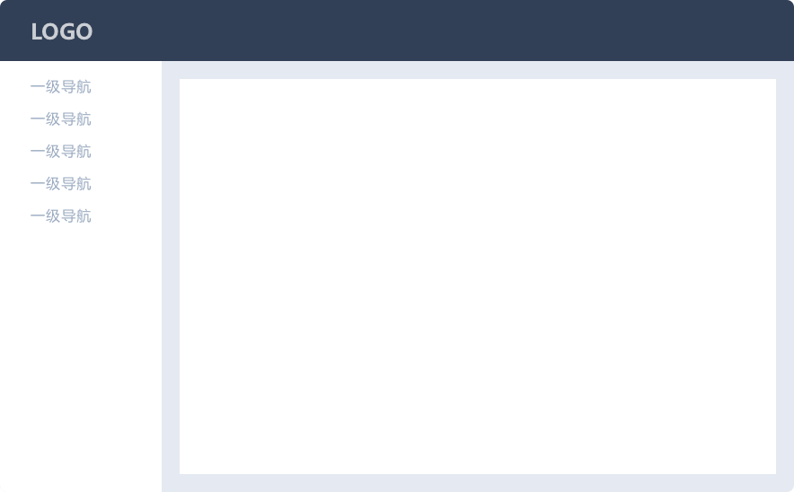
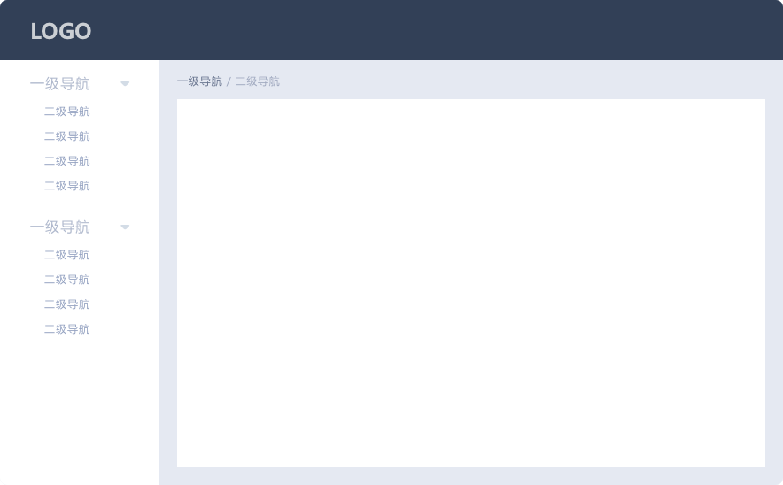

# element ui

## 设计原则

* 一致性，Consistency
  * 与现实生活一致，与现实生活的流程、逻辑保持一致，遵循用户习惯的语言和概念
  * 在界面中一直，所有的元素和结构需保持一致，比如：设计样式、图标和文本、元素的位置等
* 反馈，Feedback
  * 控制反馈，通过界面样式和交互动效让用户可以清晰的感知自己的操作
  * 页面反馈，操作后，通过页面元素的变化清晰地展现当前状态
* 效率，Efficiency
  * 简化流程，设计简洁直观的操作流程
  * 清晰明确，语言表达清晰且表意明确，让用户快速理解进而作出决策
* 可控，Controllability
  * 用户决策，根据场景可给与用户操作建议或安全提示，但不能代替用户进行决策
  * 结果可控，用户可以自由的进行操作，包括撤销、回退和终止当前的操作

## 导航

* 导航可以给用户提供信息，是页面的地图

  * 在哪里
  * 去哪里

* 导航分为侧栏导航和顶部导航，也可以结合使用

  * 侧栏导航
    * 方便在页面时间切换
    * 可以在顶部防止工具，如搜索、帮助、通知
    * 适合中后台的管理、工具型网站

  * 顶部导航
    * 适合从上到下的浏览顺序
    * 但是顶部的宽度会限制导航的数量和文本长度

### 一级类目

* 适用于结构简单的网站：只有一级页面时，不需要使用面包屑
* 面包屑就是当前位置`首页/一级页面/二级页面`



### 二级类目

* 侧栏中最多可显示两级导航；当使用二级导航时，我们建议搭配使用面包屑，方便用户定位自己的位置和快速返回。



### 三集类目

* 适用于较复杂的工具型后台，左侧栏为一级导航，中间栏可显示其对应的二级导航，也可放置其他的工具型选项。


### 顶部导航

* 顺应了从上至下的正常浏览顺序，方便浏览信息；顶部宽度限制了导航的数量和文本长度。


## 入门

### 导入使用

示例：

```html
<!-- 引入vue -->
<script src="https://cdn.jsdelivr.net/npm/vue@2.7.14/dist/vue.js"></script>

<!-- 引入样式 -->
<link
  rel="stylesheet"
  href="https://unpkg.com/element-ui/lib/theme-chalk/index.css"
/>
<!-- 引入组件库 -->
<script src="https://unpkg.com/element-ui/lib/index.js"></script>

<!-- 定义DOM结构 -->
<!-- 使用Element UI组件 -->

<div id="app">
  <!-- 使用el-button组件并绑定事件 -->
  <el-button @click="visible = true">显示对话框</el-button>

  <!-- 使用el-dialog组件并绑定数据 -->
  <!-- 使用.sync修饰符双线绑定组件的props属性 -->
  <el-dialog :visible.sync="visible" title="对话框">
    <p>对话框插槽</p>
  </el-dialog>
</div>

<!-- 使用Vue -->
<script>
  new Vue({
    el: "#app",
    data: function () {
      return {
        visible: false,
      };
    },
  });
</script>
```

效果：


### 编译使用

```js
// 安装
// npm i element-ui -S


```


