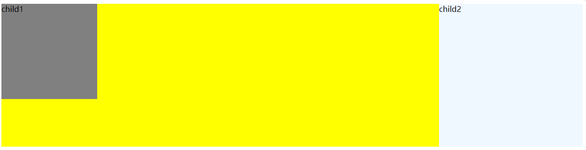

# HTML

## HTML的历史发展过程

* 1993年6月，超文本标记语言第一版
* 1995年11月，HTML2.0
* 1997年01月14日，HTML3.2，W3C推荐版本
* 1999年12月24日，HTML4.01，相对前一版本微小更改
* **2000年05月，HTML4.01严格版（主要流行版本）**
* **2014年10月28日，HTML5（当前标准）**

## HTML是什么

* HyperText Markup Language的缩写，超文本标记语言
* 超文本指的是可以存放、展示图片、音频、视频、链接等
* 标记指的是可以利用标签包裹文本，给文本添加额外属性

## HTML结构规范

### HTML5结构

```html
<!-- 协议版本声明 -->
<!DOCTYPE html>

<!-- html开始结束标签 -->
<html lang="en">

    <!-- 头部声明，非页面内容 -->
    <head>
        <meta charset="UTF-8">
        <title>页面标题</title>
    </head>
    
    <!-- 页面内容 -->
    <body>
    </body>
</html>
```

### HTML4.01文档声明

```html
!<DOCTYPE html PUBLIC "-//W3C//DTD XHTML 1.0 
Transitional//EN" "http://www.w3.org/TR/
xhtml1/DTD/xhtml1-transitional.dtd">
```


## HTML常用标签

### h标签，heading，标题标签

* 不要为了调整大小跳过标签级别使用标签
* 不要利用h标签调整字体大小

#### h标签示例

代码：

````html
```html
<!DOCTYPE html>
<html lang="en">
<head>
    <meta charset="UTF-8">
    <meta name="viewport" content="width=device-width, initial-scale=1.0">
    <title>Document</title>
</head>
<body>
    普通文本
    <h1>标题一</h1>
    <h2>标题二</h2>
    <h3>标题三</h3>
    <h4>标题四</h4>
    <h5>标题五</h5>
    <h6>标题六</h6>
    普通文本
</body>
</html>
```
````

效果：

<figure><figcaption></figcaption></figure>

### p标签，paragraph，段落标签

* 默认多个文本之间的换行、空格会空白折叠，缩减成单个空格
* 使用p标签包裹的内容占据整块布局显示，具有段落间距和首行缩进

#### p标签示例

代码：

````markup
```html
<!DOCTYPE html>
<html lang="en">
<head>
    <meta charset="UTF-8">
    <meta name="viewport" content="width=device-width, initial-scale=1.0">
    <title>Document</title>
</head>
<body>
    普通文本段落一，普通文本段落一，普通文本段落一，普通文本段落一，普通文本段落一，普通文本段落一，普通文本段落一，普通文本段落一，普通文本段落一，普通文本段落一，普通文本段落一，普通文本段落一，普通文本段落一，普通文本段落一，普通文本段落一，普通文本段落一，普通文本段落一，普通文本段落一，普通文本段落一，普通文本段落一，普通文本段落一，普通文本段落一，普通文本段落一，普通文本段落一，普通文本段落一，普通文本段落一
    普通文本段落二，普通文本段落二，普通文本段落二，普通文本段落二，普通文本段落二，普通文本段落二，普通文本段落二，普通文本段落二，普通文本段落二，普通文本段落二，普通文本段落二，普通文本段落二，普通文本段落二，普通文本段落二，普通文本段落二，普通文本段落二，普通文本段落二，普通文本段落二，普通文本段落二，普通文本段落二，普通文本段落二，普通文本段落二，普通文本段落二，普通文本段落二，普通文本段落二，普通文本段落二
    
    <p>
    p标签文本段落一，p标签文本段落一，p标签文本段落一，p标签文本段落一，p标签文本段落一，p标签文本段落一，p标签文本段落一，p标签文本段落一，p标签文本段落一，p标签文本段落一，p标签文本段落一，p标签文本段落一，p标签文本段落一，p标签文本段落一，p标签文本段落一，p标签文本段落一，p标签文本段落一，p标签文本段落一，p标签文本段落一，p标签文本段落一，p标签文本段落一，p标签文本段落一，p标签文本段落一，p标签文本段落一
    </p>
    <p>
    p标签文本段落二，p标签文本段落二，p标签文本段落二，p标签文本段落二，p标签文本段落二，p标签文本段落二，p标签文本段落二，p标签文本段落二，p标签文本段落二，p标签文本段落二，p标签文本段落二，p标签文本段落二，p标签文本段落二，p标签文本段落二，p标签文本段落二，p标签文本段落二，p标签文本段落二，p标签文本段落二，p标签文本段落二，p标签文本段落二，p标签文本段落二，p标签文本段落二，p标签文本段落二，p标签文本段落二，
    </p>
</body>
</html>
```
````

效果：

<figure><figcaption></figcaption></figure>

### strong标签，强调，em标签，emphasis，着重标签

* strong比em标签更加强调
* strong默认使用粗体显示
* em默认使用斜体显示
* strong更加常用
* strong与b标签比较，strong带有逻辑意义，b仅标识物理样式
* em与i标签同上

#### strong，em示例

代码：

```html
<!DOCTYPE html>
<html lang="en">
<head>
    <meta charset="UTF-8">
    <meta name="viewport" content="width=device-width, initial-scale=1.0">
    <title>Document</title>
</head>
<body>
    <p>普通段落<em>着重</em>普通段落<strong>强调</strong>普通段落</p>
</body>
</html>
```

效果：

<figure><figcaption></figcaption></figure>

### br标签，换行

* 文本换行存在空白折叠，多个空格、换行会替换为一个空格，达不到换行效果
* xhtml中规范协作`<br/>`，html5中写作`<br>`

#### br示例

代码：

```html
<!DOCTYPE html>
<html lang="en">
<head>
    <meta charset="UTF-8">
    <meta name="viewport" content="width=device-width, initial-scale=1.0">
    <title>Document</title>
</head>
<body>
    <p>
        第一行
        第二行
        第三行
        第四行
    </p>
    <p>
    第一行<br/>
    第二行<br/>
    第三行<br/>
    第四行<br/>
    </p>
</body>
</html>
```

效果：

<figure><figcaption></figcaption></figure>

### hr标签，horizontal，水平分割线

* 默认样式为水平线，html5标准将hr定义修改为分割结构上主题内容的转换
* 仅效果上的水平分割线应使用css实现

#### hr示例

代码：

```html
<!DOCTYPE html>
<html lang="en">
<head>
    <meta charset="UTF-8">
    <meta name="viewport" content="width=device-width, initial-scale=1.0">
    <title>Document</title>
</head>
<body>
    <p>
        第一行
        <hr>
        第二行
    </p>
    <p>
    第一行
    </p>
    <hr>
    <p>
    第二行
    </p>
</body>
</html>
```

效果：

<figure><figcaption></figcaption></figure>

### ul标签，unordered list，无序列表

* 可以通过css属性list-style-type设置列表前的圆点样式
* ul自身可以无限嵌套
* ul和ol可以交替使用，并无限嵌套

#### ul示例

代码：

```html
<!DOCTYPE html>
<html lang="en">
<head>
    <meta charset="UTF-8">
    <meta name="viewport" content="width=device-width, initial-scale=1.0">
    <title>Document</title>
</head>
<body>
    <ul>
        <li>第一项</li>
        <li>第二项</li>
        <li>第三项</li>
    </ul>
</html>
```

效果：

<figure><figcaption></figcaption></figure>

### ol标签，ordered list，有序列表

#### ol示例

代码：

```html
<!DOCTYPE html>
<html lang="en">
<head>
    <meta charset="UTF-8">
    <meta name="viewport" content="width=device-width, initial-scale=1.0">
    <title>Document</title>
</head>
<body>
    <ol>
        <li>第一项</li>
        <li>第二项</li>
        <li>第三项</li>
    </ol>
</html>
```

效果：

<figure><figcaption></figcaption></figure>

### dl标签，description list，定义列表，描述列表

#### dl示例

代码：

dl示例效果：


## HTML特殊符号

* 空格，`&nbsp;`，不会空白折叠
* 版权，`&copy;`，copyright
* 标准文档：[https://html.spec.whatwg.org/multipage/named-characters.html#named-character-references](https://html.spec.whatwg.org/multipage/named-characters.html#named-character-references)
* 简化文档：[https://tool.chinaz.com/tools/htmlchar.aspx](https://tool.chinaz.com/tools/htmlchar.aspx)


