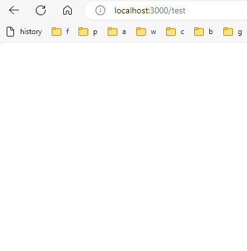

# JavaScript

## 基础

### 简介

#### JavaScript

* 网景公司Navigator浏览器的衍生品
* Brendan Eich，布兰登，艾奇，设计
* 借用Java名气，与Java只有名字有关系

#### ECMAScript

* 微软开发了JScript
* Adobe开发了ActionScript
* ECMA为了统一，组织定制了JavaScript语言的标准，被称为ECMAScript标准
* ECMA（European Computer Manufacturers Association）
* JavaScript是对ECMAScript标准的一种实现，目前是事实标准

#### JavaScript组成

* ECMAScript，语法及内置对象
* DOM，文档对象模型
* BOM，浏览器对象模型

### 在浏览器中使用JS

* 浏览器本地JS安全限制，以file://开头的地址无法执行如联网等JavaScript代码，需要架设一个Web服务器，然后以http://开头的地址来正常执行所有JavaScript代码。

#### 内嵌JS

* 由于html顺序加载，为了不影响页面展示的速度，script一般放在body末尾，html之后

```html
<html>
    <head>
    </head>
    <body>
        <div>
            
        </div>
        <script type="text/javascript">
            alert('Hello, world');
        </script>
        
        <!-- script类型只有一种，type可以省略 -->
        <script>
            alert('Hello, world');
        </script>
    </body>
</html>
```

#### 引用JS

* 解耦
* 可复用

```html
<html>
    <head>
    </head>
    <body>
        <div>
        </div>
        <script type="text/javascript" src="/static/js/abc.js"></script>

        <!-- script类型只有一种，type可以省略 -->
        <script src="/static/js/abc.js"></script>
    </body>
</html>

```

```js
// /static/js/abc.js
alert('Hello, world');
```

#### 在控制台中调试，Console

* chrome按F12
* 查看（View） -> 开发者（Developer） -> 开发者工具（Developer Tools）
* 可以查看输出
* 可以执行js语句

### 语法规则

* 语句以分号;结束，不写分号浏览器会自动不上，但是有时会导致不符合预期的结果
* 语句块用大括号包裹
* `// 注释`单行注释
* `/* 注释 */` 多行注释
* 严格区分大小写

``` js
// 赋值语句
var x = 1;

// 表达式，同时也是语句
'Hello, world';

// 两条语句
var x = 1; var y = 2;

// if分支语句块
if (2>1) {
    x = 1;
    y = 2;
}

// 行注释 

/* 
	块注释
	多行注释
*/
```

### 变量

* 命名规则：大小写英文、数字、$和\_的组合，且不能用数字开头
* 变量名不能包含Javascript关键字，如if、while等
* 一个变量只能用var声明一次，但是可以多次赋值，赋值类型可以不同
* 变量名严格区分大小写
* 习惯使用驼峰命名法，myName

``` js
// 声明一个变量
var a;

// 给变量赋值
a = 1;

// 变量声明并初始化
var a = 1;

// 声明变量示例
var a; // undefined
var $b = 1; // 一般只有jquery包装的变量使用$符号开头
var s_007 = '007'; // 可以使用下划线
var Answer = true;
var t = null; // null
```

#### 变量的strict模式 

* 非严格模式下，没有通过var申明的变量会被声明成全局变量
* 使用var声明的变量在作用域内
* 使用强制模式，没有用var定义则不是变量，抛出ReferenceError错误

``` js
i = 10; // i为全局变量

'use strict';
i = 10; // i为作用域内变量
```

### 基本数据类型

#### 数值，Number 

* Javascript不区分整数和浮点数，只有Number类型
* NaN和Infinity都是Number类型

Number示例

``` js
123; // 整数123
0.456; // 浮点数0.456
1.2345e3; // 科学计数法表示1.2345x1000，等同于1234.5
-99; // 负数
NaN; // NaN表示Not a Number，当无法计算结果时用NaN表示
Infinity; // Infinity表示无限大，当数值超过了JavaScript的Number所能表示的最大值时，就表示为Infinity

0xff000; // 十六进制，0x开头
0110000; // 八进制，0开头
0b11010; // 二进制，0b开头
```

Number运算示例：

``` js
1 + 2; // 3
(1 + 2) * 5 / 2; // 7.5
2 / 0; // Infinity
0 / 0; // NaN

// 求余数
10 % 3; // 1
10.5 % 3; // 1.5
```

#### 布尔值 ，Boolean

* 布尔值只有`true`和`false`

``` js
true;
false;

// 比较运算符的结果是布尔值
2 > 1; // true
2 >= 3; // false

// true数值上等于1
true == 1 // true
true === 1 // false

// false数值上等于0
false == 0 // true
false === 0 // false

// 与
true && true; // true
true && false; // false
false && true && false; // false

// 或
false || false; // false
true || false; // true
false || true || false; // true

// 非（单目运算符）
!true; // false
!false; // true
! (2>5); // true
```

#### 字符串，String

* 字符串是使用单引号或双引号括起来的文本

* 单引号内容可以包含双引号

* 双引号内容可以包含单引号

* 斜杠转义

* ES6新增反点\`\`，可以解释变量，可以表示多行字符串

* 解释变量就是模板字符串

* 字符串不可变，对索引项赋值，但不会改变也不会出现错误。

```js
// 字符串表达式
'abc'
"abc"
`abc`

// 单双引号混用
"I'm OK"

// 转义字符
'\n' // 换行
'\t' // 制表符
'\\' // 一个斜杠
'\x41' // ASCII字符
'\u4ed' // Unicode字符

// 多行字符串
`a
b
c` // 'a\nb\nc'

// 解释变量（模板字符串）
s = 'abc'
`${s}` // 'abc'

// 获取长度
var a = '';
a.length; // 0
''.length; // 0

// 按下标取字符
var s = 'Hello';
s[0]; // 'H'
s[4]; // 'o'
s[5]; // undefined

// 字符串不可变，对索引项赋值，但不会改变也不会出现错误。
s[0] = 'Y';
s; // 'Hello'
```

##### 转大小写

```js
'abc'.toUpperCase(); // 'ABC'
'ABC'.toLowerCase(); // 'abc'

// 国际语言转大小写
String.toLocaleLowerCase();
String.toLocaleUpperCase();
```

##### 获取子串区间，substring

```js
'hello, world'.substring(7);  // world
'hello, world'.substring(0, 5); //hello，前包后不包
```

##### 搜索子串位置，indexOf

* 同Array.indexOf

```js
// 搜索子串开始index找不到返回-1 
'hello world'.indexOf('world') // 6

// 从后向前查找
String.lastIndexOF(subString)
```

##### 根据索引获取字符，charAt

```js
console.log('a'.charAt(0)); // a
console.log('a'.charCodeAt(0)); // 97
```

##### 连接，concate

* 不同于Array，不支持拆数组，传入数组会被转换为字符串

```js
console.log('a'.concat('b')); // ab
console.log('a'.concat('b', 'c')); // abc
```

##### 切片，slice

* 同Array.slice
* String.slice与String.substring参数相同，结束位置不包含，String.substring(startIdx, endIdx)
* String.subsring与String.substr参数不用，String.substr(startIdx. length)。 
* String.substr标记为废弃

##### 清理，trim

```js
// 保留字符串清理空白
console.log(' a \n\t'.trim())
```


#### null 和 undefined

* null表示一个“空”的值
* undefined表示值未定义
* 大多数情况下，应该用null。undefined仅仅在判断函数参数是否传递的情况下有用。

```js
0 === '' // false
0 === null // false
'' === null // false
```

#### 基本数据类型的比较

* `==`，自动转换数据类型再比较，

* `1 == '1' `为真，语言设计糟粕，不明确，不用

* `===`，不会自动转换数据类型，数据类型不一致返回false，一致再比较

* NaN是特殊的Number与所有其他值都不相等，包括它自己

``` js
NaN === NaN; // false
```

* 唯一能判断NaN的方法是通过isNaN()函数：

``` js
isNaN(NaN); // true
```

* 浮点数比较相等有误差：

``` js
1 / 3 === (1 - 2 / 3); // false
```

* 浮点数比较：

``` js
Math.abs(1 / 3 - (1 - 2 / 3)) < 0.0000001; //true
```

#### 检测数据类型

```js
typeof NaN // number
typeof(NaN) // number
typeof(Number(1)) // number
typeof(1) // number
```

#### 类型转换

```js
// 数值会自动转换为字符串
'a' + 1; // 'a1' 
1 + 'a'; // '1a'

// 数值 隐式转 字符串
1 + ""; // '1'

// 数值 显式转 字符串
var a = 1;
a.toString(); // '1'
String(a); // '1'

// 只能使用包装类型调用函数
1.toString() // Uncaught SyntaxError: Invalid or unexpected token

// 字符串转数值
Number('1'); // 1
Number('a'); // NaN
```


### 引用数据类型

#### 数组，Array

* 对长度赋值会改变数组长度，长度超过原来的部分值是undefined，长度低于原来的部分会被截断
* 不要直接修改数组长度，语言糟粕
* 越界赋值，空缺处会自动补undefined，语言糟粕

``` js
// 中括号创建数组（字面量创建方式）
[1, 2, 3.14, 'Hello', null, true];

// 对象创建数组（构造函数创建方式）
new Array(1, 2, 3)

// 判断变量是否是数组
Array.isArray(object)

// 访问数组
// 越界返回undefined
arr[0];
arr[5];
arr[6]; 

// 获取数组长度
[].length; // 0

// 设置数组长度，语言糟粕
var arr = [1, 2, 3];
arr.length; // 3
arr.length = 6;
arr; // [1, 2, 3, undefined, undefined, undefined]
arr.length = 2;
arr; // [1, 2]

// 修改数组内的元素
var arr = [1, 2, 3];
arr[0] = 0;
arr; // [0, 2, 3]

// 越界赋值，空缺处会自动补undefined，语言糟粕
var arr = [1, 2, 3];
arr[4] = 5;
arr; // [1, 2, 3, undefined, 5]

```

##### 队列、栈操作

```js
// push 右入队
// pop 右出队
// unshift 左入队
// shift 左出队

// 右入队，返回新长度
Array.push(newItem);

// 右入队多个
Array.push(newItem1, newItem2);

// 右出队，空Array返回undefined，不报错
Array.pop();

// 左入队，返回新长度
Array.unshift(newItem);

// 左入队多个
Array.unshift(newItem1, newItem2);

// 左删除（全部左移），Array返回undefined，不报错
Array.shift();

// * 左入队多个反直觉
var arr = [2, 3, 4];
arr.unshift(1, 0); // 5
arr; // [1, 0, 2, 3, 4]

var arr = [2, 3, 4];
arr.unshift(1);
arr.unshift(0);
arr; // [0, 1, 2, 3, 4]

```

##### 通过值查找索引，index

```js
// 通过值查找索引
var arr = [10, 20, '30', 'xyz'];
arr.indexOf(10); // 0
arr.indexOf(20); // 1
arr.indexOf('30'); // 2
arr.indexOf(30); // -1

// 从右边查
var a = [0, 1, 2, 3, 3];
console.log(a.indexOf(3)); // 3
console.log(a.lastIndexOf(3)); // 4

// 从指定位置开始查
Array.indexof(value, startIndex);
Array.lastIndexOf(value, startIndex);
```

##### 切片，slice

```js
// 切片
// * 没有步进参数step
// * 同String.substring()

// * 截取startIndex到endIndex,Array
// * slice(startIndex, endIndex); 
// * 前包后不包

// * 截取startIndex到末尾
// * Array.slice(startIndex);

// * 复制数组
// * Array.slice();

[0, 1, 2, 3].slice(1, 3) // [1, 2]
[0, 1, 2, 3].slice(1) // [1, 2, 3]
[0, 1, 2, 3].slice() // [0, 1, 2, 3]

// * 复制的数组不相等：
var arr1 = [0, 1];
var arr2 = arr1.slice();
arr1 == arr2; // false
arr1 === arr2; // false
```

##### 排序，sort

* 默认先转成字符串，按字符串升序

```js
// sort 排序
var arr = ['B', 'C', 'A'];
arr.sort();
arr; // ['A', 'B', 'C']

// sort 默认先转成字符串，按字符串升序
var a = [10, 2]
a.sort();
console.log(a); // [10, 2]

// sort 按数值升序
var a = [10, 2]
a.sort(function (a, b) {
    return a - b;
});
console.log(a); // [10, 2]
```

##### 反转，reverse

```js
// reverse 反转
var arr = ['one', 'two', 'three'];
arr.reverse();
arr; // ['three', 'two', 'one']
```

##### 拼接，splice

```js
// splice 删除并拼接，万能方法
// 从from删除count添加add，返回删除的元素
Array.splice(from, count, add1, add2, addn); 

// 替换，从索引2删除3个元素，再添加两个元素
var arr = [0, 1, 2, 3, 4, 5];
arr.splice(2, 3, 'two', 'three'); // 返回[2, 3, 4]
arr; // [0, 1, 'two', 'three', 5]

// 删除，只删除，不添加
var arr = [0, 1, 2, 3, 4, 5];
arr.splice(2, 2); // 返回['2', '3']
arr; // [0, 1, 4, 5]

// 插入，只添加，不删除
var arr = [0, 1, 2, 3, 4, 5];
arr.splice(2, 0, 'two', 'three'); // 返回[]，删除0个元素
arr; // [0, 1, 'two', 'three', 2, 3, 4, 5]
```

##### 连接，concat

```js
// concat 拼接
// 会自动拆开数组
var arr = ['A', 'B', 'C'];
var arr1 = arr.concat([1, 2, 3]);
arr1; // ['A', 'B', 'C', 1, 2, 3]

var arr = ['A', 'B', 'C'];
var arr2 = arr.concat(1, 2, 3);
arr2; // ['A', 'B', 'C', 1, 2, 3]

var arr = ['A', 'B', 'C'];
var arr3 = arr.concat(1, [2, 3]);
arr3; // ['A', 'B', 'C', 1, 2, 3, 4);

```

##### 字符串拼接，join

```js
// join 连接字符串
// 默认使用逗号连接
var arr = ['A', 'B', 'C', 1, 2, 3];
arr.join(); // 'A,B,C,1,2,3'
arr.join('-'); // 'A-B-C-1-2-3'
```

##### 过滤，filter

* 根据返回的boolean值，判断是否放入新数组

```js
var a = [0, 1, 2, 3, 3]
var b = a.filter(function (value, index, array) {
    return value % 2;
});
console.log(b); // [1, 3, 3]
```

##### 映射，map

* 将每一项的返回值放入新数组

```js
var a = [0, 1, 2, 3, 3]
var b = a.map(function (value, index, array) {
    return value % 2;
});
console.log(a);
console.log(b); // [0, 1, 0, 1, 1]

```

##### 迭代，forEach

* 与map相比，不会将返回值放入新数组

```js
var a = [0, 1, 2, 3, 3]
var b = a.forEach(function (value, index, array) {
    return value % 2;
});
console.log(a);
console.log(b); // undefined;
```


#### 对象，Object

* 对象是无序键值对
* 对象的键只能是字符串
* 对象的键是有效变量时，可以省略引号
* 对象的键不是有效变量时，不能省略引号，也不能用点操作符访问，只能用方括号操作符访问
* 值可以是任意数据类型
* 只不存在时，返回undefined，不报错

``` js
// 创建对象（字面量创建方式）
var person = {
    name: 'Bob',
    age: 20, 
    tags: ['js', 'web', 'mobile'],
    city: 'Beijing',
    hasCar: true,
    zipcode: null
};

// 获取对象的值
person.name; // 'Bob'
person.zipcode; // null

person['name']
person['zipcode']

// 特例
var a = {1: 0}
a.1 // Uncaught SyntaxError: Unexpected number
a[1] // 0
a['1'] // 0

// 特例
var a = {a-a: 0} // Uncaught SyntaxError: Unexpected token '-'
var a = {'a-a': 0}
a.a-a // NaN
a[a-a] // undefined
a['a-a'] // 0

// 添加属性
var a = {};
a.a = 1; // 直接赋值添加属性
a['b'] = 2;
a; // {a: 1, b: 2}

// 删除属性
var a = {a: 1, b: 2};
delete a.a; // true
delete a['b']; // true
a; // {}

// 检测是否包含属性
var a  = {a: 0}
'a' in a // true
'b' in a // false

// 继承的属性也在in识别的范围
var a  = {}
'toString' in a; // true

// 检测私有属性
var a = {}
a.hasOwnProperty('toString');
```

#### 字典，Map（ES6）

* Object只能字符串作为key
* 为了解决这个问题，JS新增Map对象

```js
// Map
var m = new Map([
    ['a', 0],
    ['b', 1],
    ['c', 2]
]);

console.log(m.get('a')); // 0
console.log(m.get('z')); //undefined
console.log(m.set('d', 3)); // Map(4) {size:4, a => 0, b => 1, c => 2, d => 3}
console.log(m.has('d')); // true
console.log(m.has('z')); //false
console.log(m.delete('d')); // true
```

#### 集合，Set（ES6）

* 自动过滤重复元素

```js
var s = new Set([1, 2, 3, 3, '3']);
console.log(s.add(4)); // Set(5) {size: 5, 1, 2, 3, 3, 4}
console.log(s.has(1)); // true
console.log(s.has('z')); // false
console.log(s.delete(4)); // true
```

#### 方法，Function

* 在JavaScript中，方法也是一种数据类型，是Object的子类

### 运算符

#### 比较运算符

* `===`等同于，`!==`不等同于，比较数据类型，且比较值
* `==`，`!=`，把数值转换成字符串

```js
console.log(5 === '5'); // false
console.log(5 !== '5'); // true
console.log(5 == '5'); // true 
console.log(5 != '5'); // false

console.log(1 > 0); // true
console.log(1 >= 1); // true
console.log(1 < 0); // false
console.log(1 <= 0); // false
```

#### 逻辑运算符

```js
// 与
console.log(true && false); // false

// 或
console.log(true || false); // true

// 非
console.log(!true); // false
console.log(!false); // true
```

#### 三元运算符

```js
true ? 'a' : 'b'; // 'a'
false ? 'a' : 'b'; // 'b'
```

#### typeof运算符

```js
typeof 123; // 'number'
typeof NaN; // 'number'
typeof 'str'; // 'string'
typeof true; // 'boolean'
typeof undefined; // 'undefined'
typeof Math.able; // 'function'
typeof null; // 'object'
typeof []; // 'object'
typeof {}; // 'object'
```

### 条件判断，if

* 可以省略花括号，但是可能造成非预期行为，尽量不要，语言糟粕
* null, undefined, 0, NaN, '', false，这些值都是false，其他所有值都为true

```js
// 单if
if (true): {
    console.log('1');
}

// if else
if (false): {
    console.log('1');
} else {
    console.log('2');
}

// if else if else
if (false): {
    console.log('1');
} else if (false): {
    console.log('2');
} else if (false): {
    console.log('3');    
} else {
    console.log('4');
}
```

### 分支，switch

* 不写break会导致case穿透

```js
switch (string) {
    case string1:
        break;
    case string3:
        break;
    case string3:
        break;
    default:
      	break;   
}
```

### 循环，for，while

* for of是ES6新增
* for of只能遍历Iterable

``` js
// 格式
/* 
for (首次执行; 每次执行前执行; 每次执行后执行) {
}
*/


// 无限循环
for(;;) {
}

var i;
for (i=0; i < 3; i++) {
    console.log(i); // 0, 1, 2
}
i; // 3


// 遍历数组
var v = ['a', 'b', 'c'];

// for in 遍历数组（不建议for in遍历数组）
for (var i in v) {
    console.log(i); // 1, 2, 3
    console.log(v[i]); // 'a', 'b', 'c'
}

// for of 遍历数组
for (var i in v) {
    console.log(i); // 'a', 'b', 'c'
}


// 遍历对象
var o = {
    a: 1,
    b: 2,
    c: 3
}

// for in 默认遍历key
for (var k in o) {
    console.log(k); // a, b, c
}

// for in 遍历key
for (var k in Object.keys(o)) {
    console.log(k); // a, b, c
}

// for in 遍历value
for (var v in Object.values(o)) {
    console.log(v); // 1, 2, 3
}

// for in 遍历 key value
for (var k in o) {
    console.log(k, o[k]) // a 1  b 2  c 3
}

// for of 遍历 key value（不能直接遍历Object）
for (var [k, v] of Object.entries(o)) {
    console.log(k, v); // a 1  b 2  c 3
}


// while
var i = 0;
while (i < 3) {
    console.log(i); // 0, 1, 2
    i++;
}
console.log(i); // 3

// do while
var i = 0;
do {
    console.log(i); // 0, 1, 2
    i++;
} while (i < 3)
console.log(i); // 3


// forEach

// forEach 遍历数组
var v = ['a', 'b', 'c'];
v.forEach(function(value, index, array){
    console.log(value, index);
});

// forEach 遍历对象
var o = {
    'a': 0,
    'b': 1,
    'c': 2
};
Object.entries(o).forEach(function(value, index, array){
    console.log(value[0], value[1]);
});
```

#### break、continue

* break，跳出本层循环
* continue，跳过本层本次循环

```js
```


#### for in、for of区别

* for in遍历的是对象的属性名称，Array本质是对象，Array的Index本质是对象的属性

* for in遍历数组会出现缺陷（语言糟粕）

```js
var v = ['a', 'b', 'c'];
v.test = 'test'; // 这种用法也是语言糟粕，不这样用也不会出现问题
for (var i in v) {
    console.log(i); // 0, 1, 2, 'test'
}
```

## 函数

### 定义函数

* 如果没有return语句，则返回undefined
* 参数过多过少都不会报错
* JS在函数内提供arguments关键字，是类Array但不是Array
* arguments.length可以获得参数个数
* ES6新增rest参数

```js
// 命名函数（大括号代码块，可以不带分号）
function abs(x) {}

// 匿名函数（语句、表达式，要带分号）
var abs = function (x) { };

// 参数过多可以正常调用
abs(10, 'xxx', 'dddd');

// 参数过少返回undefined
// abc函数内部收到的参数也是undefined
abs();

// 在函数内使用arguments参数
// 手动获取多余参数
function f(a, b) {
    var rest = [];
    if (arguments.length > 2) {
        for (var i = 2; i < arguments.length; i++) {
            rest.push(arguments[i]);
        }
    }
    console.log(a); // 1
    console.log(b); // 2
    console.log(rest); // 3, 4, 5
}
foo(1, 2, 3, 4, 5);

// 在函数内使用rest参数
// 自动获取多余参数
function foo(a, b, ...rest) {
    console.log(a); // 1
    console.log(b); // 2
    console.log(rest); // 3, 4, 5
}
foo(1, 2, 3, 4, 5);
```

#### return换行问题

* return后换行可能导致自动添加分号（语言糟粕）

```js
// 错误范例
function foo() {
    return
        {name: 'foo'};
}

// 自动加分号结果，造成返回undefined
function foo() {
    return;
        {name: 'foo'};
}

// 正确写法
function foo() {
    return { // 这里不会自动加分号，因为{表示语句尚未结束
        name: 'foo'
    };
}
```

### 变量作用域

* 作用域内的变量只在函数内有效
* 内层作用域可以访问外部作用域的变量，外部作用域不能访问内层作用于的变量

* 查找变量有现在内层作用域内查找，所有同名变量会优先找到内部作用域的变量

* JavaScript变量定义会在函数内提升到最前
* 但不会提升变量赋值，复制在原位置

``` js
// 后定义先使用不会报错，输出'Hello undefined'。
function foo() {
    var x = 'Hello, ' + y;
    alert(x);
    var y = 'Bob';
}

// 等价于
function foo() {
    var y; // 自动提升变量声明，值为undefined
    var x = 'Hello, ' + y;
    alert(x);
    y = 'Bob';
}
```

#### 全局作用域

* 不在任何函数（或模块）内定义的变量具有全局作用域

* 全局作用域等价于window的属性，全局作用域的变量函数会自动绑定在windows对象上

* 传统的html中导入script，不产生单独作用域，相同命名会导致污染和冲突
* ES6新增script.type=module会产生单独作用域

```js
// 使用立即执行函数产生作用域

// 全局作用域
var i = 1;
var func = function() {
    console.log(i);
};

// 产生作用域，私有化i
(function(){
    var i = 1;
    var func = function() {
        console.log(i);
    };
    
    // 只暴露接口到全局作用域
    window.func = func;    
})();
```

* 非严格模式下，不使用var定义的变量，会挂载到全局作用域

```js
// i在作用域内
function a () {
    var i = 1;
    console.log(i);
}
a();
console.log(i); // 报错

// i被自动处理到全局作用域
function a () {
    i = 1;
    console.log(i);
}
a(); // 调用时，作用域被自动提升
console.log(i); // 正常运行
```

* ES6新增let定义变量，会将for函数的变量限制在for函数内

```js
// i可以在for外部访问
for (var i of arr) {
    
}

// i不能在for外部访问
for (let i of arr) {
    
}
```

* const 定义常量（ES6） 

```js
// 传统不支持const特性时，约定使用大写变量名表示常量 
var PI = 3.14; 

// 对常量赋值无效果，有些浏览器不会报错,chrome会报错
const PI = 3.14;
PI = 3.15
```

### 方法

* 对像方法 对像方法可以使用对象属性

``` js
var xiaoming = {
    name: '小明',
    birth: 1990,
    age: function() {
        var y = new Date().getFullYear();
        return y = this.birth;
    }
}
```

* this this指向当前对象 'use strict'; 模式下会触发错误

``` js
// 错误
function getAge() {
    var y = new Date().getFullYear();
    return y - this.birth;
}

var xiaoming = {
    name: '小明',
    birth: 1990,
    age: getAge
};

xiaoming.age(); // this指向xiaoming，返回正常结果
getAge(); // this指向window，返回NaN

var fn = xiaoming.age;
fn(); // this也指向window，返回NaN
```

``` js
// 嵌套错误，嵌套函数内this指向window
var xiaoming = {
    name: '小明',
    birth: 1990,
    age: function() {
        function getAgeFromBirth() {
            var y = new Date().getFullYear();
            return y - this.birth;
        }
        return getAgeFromBirth();
    }
```

``` js
// 正确示范，提前固化this
var xiaoming = {
    name: '小明',
    birth: 1990,
    age: function() {
        var that = this;
        function getAgeFromBirth() {
            var y = new Date().getFullYear();
            return y - that.birth;
        }
        return getAgeFromBirth();
    }
};
```

\### apply 和 call apply和call可以指定this指向 apply和call第一个参数为this指向，其他参数为实际参数 foo.apply(yourthis, Array); foo.call(yourthis, arg1, arg2, ... );

调用对象示例：

``` js
function getAge() {
    var y = new Date().getFullYear();
    return y - this.birth;
}

var xiaoming = {
    name: '小明',
    birth: 1990,
    age: getAge
}

xiaoming.age() // 正确
getAge.apply(xiaoming, []); // 正确
getAge.call(xiaoming); // 正确
```

调用普通函数示例：

``` js
Math.max.apply(null, [3, 5, 4]);
Math.max.call(null, 3, 5, 4);
```

* 装饰器 统计调用次数示例：

``` js
var count = 0;
var oldParseInt = parseInt;

window.parseInt = function () {
    count += 1;
    return oldParseInt.apply(null, arguments);
};

parseInt('10');
parseInt('20');
parseInt('30');
count;
```

### 高阶函数

高阶函数就是让函数的参数能接收别的函数

\### map map是Array的方法

示例1：

``` js
function pow(x) {
    return x * x;
}
var arr = [1, 2, 3, 4, 5, 6, 7, 8 ,9];
arr.map(pow)
```

转化成字符串示例：

``` js
var arr= [1, 2, 3, 4, 5, 6, 7, 8, 9];
arr.map(String);
```

\### reduce reduce是Array的方法 \[x1, x2, x3, x4].reduce(f) = f(f(f(x1, x2), x3), x4)

累加示例：

``` js
var arr = [1, 3, 5, 7, 9];
arr.reduce(function (x, y) {
    return x + y;
});
```

\### filter filter是Array的方法，根据返回值是true还是false决定保留还是丢弃该元素。 filter函数接受三个参数。

删除偶数示例：

``` js
var arr = [1, 2, 4, 5, 6, 9, 10, 15];
var r = arr.filter(function (x) {
    return x % 2 !== 0;
});
```

删除空字符串：

``` js
var arr = ['A', '', 'B', null, undefined, 'C', '   '];
var r = arr.filter(function (x) {
    return s && s.trim();
});
```

三参数示例，去除重复元素：

``` js
var r;
var arr = ['apple', 'strawberry', 'banana', 'pear', 'apple', 'orange', 'orange', 'strawberry'];
r = arr.filter(function (element, index, self) {
    return self.indexOf(element) === index;
});
```

\### sort sort()是Array的方法

sort默认会把Array所有元素转换为String再按ASCII码排序

``` js
// 小写字幕在大写字幕后面
['Google', 'apple', 'Microsoft'].sort(); // ['Google', 'Microsoft', 'apple']

// 先转换为字符串再排序
[10, 20, 1, 2].sort() // [1, 10, 2, 20]
```

sort入参函数根据返回值判断大小，返回值为-1，1，0

``` js
var arr = [10, 20, 1, 2];
arr.sort(function(x, y){
    if (x < y) {
        return -1;
    }
    if (x > y) {
        return 1;
    }
    return 0;
});
```

### 闭包

\### 实现基础：函数可以作为返回值

``` js
// 普通调用
function sum(arr) {
    return arr.reduce(function (x, y) {
        return x + y;
    });
}
sum([1, 2, 3, 4, 5)];

// 延迟调用
function lazy_sum(arr) {
    var sum = function () {
        return arr.reduce(function (x, y) {
            return x + y;
        });
    }
    return sum;
}
var f = lazy_sum([1, 2, 3, 4, 5]);
f();
```

\### 用途：封装私有变量

``` js
function create_counter(initial) {
    var x = initial || 0;
    return {
        inc: function() {
            x += 1;
            return x;
         }
    }
}

var c1 = create_counter();
c1.inc(); // 1
c1.inc(); // 2
c1.inc(); // 3

var c2 = create_counter(10);
c2.inc(); // 11
c2.inc(); // 12
c2.inc(); // 13
```

\### 用途：减少参数个数

``` js
function make_pow(n) {
    return function (x) {
        return Math.pow(x, n);
    }
}

var pow2 = make_pow(2);
var pow3 = make_pow(3);
pow2(5);
pow3(6);
```

\### 循环变量错误

``` js
function count() {
    var arr = [];
    for (var i = 1; i <= 3; i++) {
        arr.push(function () {
            return i * i;
        });
    }
    return arr;
}

var results = count(); // 调用时循环已经完成，i = 4
var f1 = results[0]; // 16，预期1
var f2 = results[1]; // 16，预期4
var f3 = results[2]; // 16，预期9
```

解决方法：

``` js
function count() {
    var arr = [];
    for (var i = 1; i <= 3; i++) {
        arr.push((function (n) {
            return function() {
                return n * n;
            };
        })(i));
    }
}

使用(function(x){return x*x;})(i);函数参数固定循环变量
```

### 箭头函数 # ES6新增

#### 定义

箭头函数相当于匿名函数，简化了函数定义。

```js
x => x * x
// 相当于：
function (x) {
    return x * x;
}
```

包含多条语句和return时，不能省略大括号{}

```js
x => {
    if (x > 0) {
        return x * x;
    } else {
        return - x * x;
    }
}
```

两个参数：

```js
(x, y) => x * x + y * y
```

无参数：

```js
() => 3.14
```

可变参数：

```js
(x, y, ...rest) => {
    var i, sum = x + y;
    for (i=0; i<rest.length; i++) {
        sum += rest[i];
    }
    return sum;
}
```

返回对象错误：

```js
x => {foo:x} # SyntaxError，语法冲突
x => ({foo:x}) # 正确写法
```

#### this作用域区别

总是指向词法作用域，即外层调用obj call和apply绑定this无效

### 生成器 generator # ES6

#### 定义

使用function\*定义 使用return返回 使用yield多次返回

```js
function* foo(x) {
    yield x + 1;
    yield x + 2;
    return x + 3;
}
```

#### 使用

var f = foo(6); # 初始调用 f.next(); # 多次调用，返回 {value: 7, done: false}，使用done判断是否调用结束 for ( var x of foo(6)) {} # for of调用，不需要自行判断done结束


## 内置对象

### 全局对象，终极对象，根对象

* 浏览器中global对象为`window`
* Node中global对象为`global`

### 包装对象

包装对象使用new创建，不建议

```js
var n = new Number(123);
var b = new Boolean(true);
var s = new String('str');
```

不使用new时当作普通函数

```js
var n = Number('123');
typeof n; // 'number'

var b = Boolean('true'); // true
var c = Boolean('false'); // true，字符串非空转换为true
var d = Boolean(''); // false
typeof b; // 'boolean'

var s = String(123.45);
typeof s; // 'string'
```

#### number对象toString

```js
123.toString(); // SyntaxError
(123).toString(); // '123'

// 语言糟粕
// 只有整数可以用两个点
// 小数不能用两个点
123..toString(); // '123'
```

#### 约定

不要使用new Number()，new Boolean()，new String()创建包装对象 用parseInt()或parseFloat()转换任意number 使用String()或调用Object.toString()转换为字符串 typeof可以判断出number、boolean、string、function、undefined 判断Array使用Array.isArray(arr)，typeof array返回'object' 判断null使用 var === null 判断全局变量是否存在使用typeof window.var === 'undefined' 判断函数内部某个变量是否存在使用typeof var === 'undefined' null和undefined没有toString()函数，虽然null是Object

### Number

#### 保留n位小数，toFixed

```js
(1.9999).toFixed(3); // '2.000'
```

### parseInt

```js
// 解析数字
console.log(parseInt('1')); // 1

// 解析小数
console.log(parseInt('1.1')); // 1

// 解析数字开头字符串
// 解析到字符串为止
console.log(parseInt('1a')); // 1

// 对比Number会直接返回NaN
console.log(Number('1a')); // NaN

// 解析非数字开头字符串
console.log(parseInt('a')); // NaN
```

### parseFloat

```js
console.log(parseFloat('1')); // 1
console.log(parseFloat('1.0')); // 1
console.log(parseFloat('1.1')); // 1.1
console.log(parseFloat('1.1.')); // 1.1
console.log(parseFloat('a1.1')); // NaN
```

### isNaN

```js
isNaN(NaN); // true
isNaN(undefined); // true，语言糟粕
isNaN({}); // true，语言糟粕

isNaN(true); // false
isNaN(null); // false
isNaN(37); // false

// strings
isNaN("37"); // false: 可以被转换成数值 37
isNaN("37.37"); // false: 可以被转换成数值 37.37
isNaN("37,5"); // true
isNaN("123ABC"); // true: parseInt("123ABC")是123，Number("123ABC")是NaN
isNaN(""); // false: 空字符串被转换成 0
isNaN(" "); // false: 包含空格的字符串被转换成 0

// dates
isNaN(new Date()); // false
isNaN(new Date().toString()); // true

isNaN("blabla"); // true: "blabla"不能转换成数值
// 转换成数值失败，返回 NaN
```


1、parseInt(), parseFloat(), 
2、Boolean(), Number(), String(),  
3、str - 0, str \* 1


### Date

* 月份用0-11表示，语言糟粕
* 星期用0 - 6标识，0是星期天，语言糟粕

```js
// 对象默认初始化为本地当前时间
var now = new Date(); // Sat Aug 12 2023 21:44:58 GMT+0800 (中国标准时间)

// 年月日初始化
// 月份0 - 11月
new Date(2000, 0, 25); // Tue Jan 25 2000 00:00:00 GMT+0800 (中国标准时间)

// 年月日时分秒初始化
new Date(2000, 0, 25, 1, 1, 1); // Tue Jan 25 2000 01:01:01 GMT+0800 (中国标准时间)

// 获取日，1 - 31
(new Date()).getDate();

// 获取月，0 - 11
(new Date()).getMonth();

// 获取年
(new Date()).getFullYear();

// 获取星期, 0 - 6，0是星期天
(new Date()).getDay();

// 获取小时，0 - 23
(new Date()).getHours();

// 获取分钟，0 - 59
(new Date()).getMinutes();

// 获取秒，0 - 59
(new Date()).getSeconds();
```

#### 内置日期格式化

```js
n = new Date()
console.log(n.toDateString()); // Sat Aug 12 2023
console.log(n.toTimeString()); // 22:03:05 GMT+0800 (中国标准时间)
console.log(n.toLocaleDateString()); // 2023/8/12
console.log(n.toLocaleTimeString()); // 22:03:05
console.log(n.toLocaleString()); // 2023/8/12 22:03:05
console.log(n.toUTCString()); // Sat, 12 Aug 2023 14:03:05 GMT
```

### URI特殊字符编解码

* encodeURI，编码为合法URI，URI中不能包含某些字符，如空格
* decodeURI

* encodeURIComponent，编码为合法QueryString，也用于Cookie

* decodeURIComponent

```js
var eu = encodeURI('https://www.baidu.com:8080/?a=1&b=哈哈');
var euc = encodeURIComponent('?a=1&b=哈哈');
console.log(eu);
console.log(euc);
var du = decodeURI(eu);
var duc = decodeURIComponent(euc);
console.log(du);
console.log(duc);
```

### Math

#### 常量

```js
// e
Math.E

// ln10
Math.LN10

// ln2
Math.LN2

// log2(e)
Math.LOG2E

// 派
Math.PI

```

#### 最大值、最小值，max、min

```js
console.log(Math.max(1, 2, 3)); // 3

// 不能传数组
console.log(Math.max([1, 2, 3])); // NaN

// 使用apply传数组
console.log(Max.max.apply(null, [1, 2, 3])); // 3
```

#### 取整，ceil，floor，round

```js
console.log(Math.ceil(1.1)); // 2
console.log(Math.ceil(1.9)); // 2
console.log(Math.floor(1.1)); // 1
console.log(Math.floor(1.1)); // 1
console.log(Math.round(1.1)); // 1
console.log(Math.round(1.9)); // 2
```

#### 随机数

* 第三方库Chance.js，一个用于生成各种随机数据的库，如字符串、数字、日期、布尔值、颜色等
* 第三方库Random.js，一个用于生成加密安全的随机数的库，支持多种分布和种子

```js
// 随机小数 [0, 1)
console.log(Math.random()); // 2

// 随机整数 [min, max)（没有内置，需要自己实现）
function randint(min, max) {
    return Math.floor(Math.random() * (max - min) + min);
}

// 随机取数组元素（没有内置，需要自己实现）
function choice(arr) {
    return arr[randint(0, arr.length)]
}
var a = ['a', 'b', 'c', 'd']
console.log(choice(a))

```


## 浏览器对象模型，BOM

### window

* 常用属性

  * alert，弹出警告框

  * confirm，弹出确认框，返回布尔值

  * prompt，弹出输入框，返回输入值，或null

  * setInterval，间隔回调，时间单位毫秒

  * setTimeout，定时回调，时间单位毫秒
  * clearInterval，清除间隔回调
  * clearTimeout，清除定时回调

```js
// 弹出警告框
alert('Hello Alert.');

// 弹出确认框，返回true、false
var r = confirm('Are you OK?');
console.log(r); // true or false

// 弹出输入框，返回输入值，或null
var r = prompt('Are you OK?');
console.log(r); // 输入值或null

// 定时回调，Node中定时回调完成后退出
setTimeout(function(){
    console.log(new Date());
}, 1000);

// 间隔回调，Node中程序不会退出
setInterval(function(){
    console.log(new Date());
}, 1000);

// 执行10次后停止定时器
var count = 0;
var i = setInterval(function(){
    count++;
    console.log(count);
    if (count >= 10) {
        clearInterval(i);
        return;
    }
}, 1);
```

### location

* 常用属性

  * host，含冒号端口号
  * hostname，不含冒号端口号
  * href，完整地址栏

  * hash，页内id

* searchParam解析

  * location不是的类型不是URL，可以构造URL对象后使用searchParam属性
  * url解析见内置对象`URL.searchParam.get`

* 修改location

  * 对location.href赋值，会导致页面跳转
  * 调用location.replace，也会导致页面跳转，但不会产生历史记录
  * 调用location.reload，刷新页面

```js
// "https://t.com:8888/query?a=1&b=2#xxx";

// 解析href
l = location
console.log(l.href); // 'https://t.com:8888/query?a=1&b=2#xxx'
console.log(l.protocol); // https:
console.log(l.host); // t.com:8888
console.log(l.hostname); // t.com
console.log(l.port); // 8888 (blank - https assumes port 443)
console.log(l.pathname); // '/query'
console.log(l.search); // '?a=1&b=2'
console.log(l.hash); // #xxx
console.log(l.origin); // 'https://t.com:8888'

// 解析search param
var u = new URL(t.href);
console.log(t.searchParams.get('a')); // 1
console.log(t.searchParams.get('b')); // 2

// 对location.href赋值，会导致页面跳转
location.href='http://www.baidu.com';

// 调用location.replace，也会导致页面跳转，但不会产生历史记录
location.replace('http://www.baidu.com');

// 调用location.reload，刷新页面
location.reload();
```

### navigator

* plugins，插件类数组，PluginArray类型
* PluginArray类型同时具有数组和字典的特性，即可以使用数组索引访问，也可以使用插件名称访问

```js
// 获取插件名称
for (var plugin of navigator.plugins) {
    console.log(plugin.name);
}

navigator.plugins['Chrome PDF Viewer']

```

### screen

* 常用属性

```js
```

### history

* 常用属性
  * go

```js
// 刷新网页
history.go(0)

// 前进1
history.go(1)
```

## 文档对象模型，DOM

* 将页面html构造成树状结构
* 根是html
* 节点的父类是Node
* 节点分为三种
  * 元素节点，element node，html元素在DOM中是元素节点
  * 文本节点，text node，html元素包裹的文本在DOM中是文本节点
  * 属性节点，attribute node，html元素的属性在DOM中是属性节点
  * 注释节点，comment node，没意义
  * 文档节点，即document自身，没意义

### 获取节点

* 获取元素节点对象
  * 根据ID获取对象，`document.getElementById(id)`

  * 根据Tag获取对象，`document.getElementsByTagName(tagName)`

  * 根据class获取对象，`document.getElementsByClassName(tagName)`

* 获取属性节点对象
  * 获取属性对象，element.getAttribute(attributeName)

  * 设置属性对象，element.setAttribute(attributeName, attributeValue)

* 获取文本节点对象

```html
<div id="el" class="c1" title="attribute">text</div>
<div id="el1" class="c1 c1" title="attribute">text</div>
<div id="el2" class="c2 c1" title="attribute">text</div>
<div id="el3" class="c3" title="attribute">text</div>
<div id="el4" class="c4" title="attribute">text</div>
<script>
    // 获取元素节点

    // 根据ID获取
    var el = document.getElementById('el');
    console.log(el);
    console.log('')

    // 根据tag查找
    // 返回的是类数组
    var ell = document.getElementsByTagName('div');
    for (el of ell) {
        console.log(el);
    }
    console.log('')

    // 根据class查找
    // 返回类数组
    // 去重
    var ell = document.getElementsByClassName('c1');
    for (el of ell) {
        console.log(el);
    }
    console.log('')


    // 获取属性节点
    var t1 = el.getAttribute('title');
    console.log(t1);
    var t2 = el.getAttribute('titlex');
    console.log(t2); // null

    // 修改节点属性
    el.setAttribute('titlex', 'value');
    var t3 = el.getAttribute('titlex');
    console.log(t3); // value
</script>
```

### 节点属性

* 每个节点有三个重要属性
  * nodeName，节点名称，只读
  * nodeValue，节点的值
  * nodeType，节点的类型
* nodeName
  * 元素节点的nodeName是标签名，例如`DIV`
  * 属性节点的nodeName是属性名，例如`title`
  * 文本节点的nodeName是`#text`
  * 文档节点的nodeName是`#document`
  * 注释节点的nodeName是`#comment`
* nodeValue
  * 元素节点的nodeValue是null
  * 文本节点的nodeValue是文本
  * 属性节点的nodeValue是属性值
* nodeType
  * 元素节点，1
  * 属性节点，2
  * 文本节点，3
  * 注释节点，8
  * 文档节点，9

### DOM树关系属性

* Node.childNodes属性，所有孩子
* Node.firstChild属性，第一个孩子
* Node.lastChild属性，最后一个孩子
* Node.parentNode属性，父节点
* Node.nextSibling属性，下一个兄弟
* Node.previousSibling属性，上一个兄弟

### 操作节点

* 创建节点
  * `document.createElement()`，创建元素节点
  * `document.createTextNode()`，创建文本节点
  * 只创建不插入
* 插入节点
  * `parentNode.appendChild()`
  * `document.insertBefore(newNode, node)`
  * 对`node.innerHTML`赋值，创建并插入，可能插入文本节点，甚至元素子树
  * 对`node.innerText`赋值，创建并插入文本
* 删除节点
  * `parentNode.removeChild(childNode)`
* 替换节点
  * `document.replaceChild(newNode, node)`

### 操作样式

* 获取node样式对象，node.style
* 设置样式，直接赋值
  * node.style.backgroundColor = 'black'
  * node.style.color = 'white'
  * node.style.width = '250px'
  * node.style.height = '250px'
* 设置attribute class
  * node.setAttribute('class', 'className')

### 设置事件

* 常用的事件
  * onclick，鼠标单击
  * onmouseover，鼠标经过
  * onmouseout，鼠标移开
  * onchange，文本框内容改变（改变之后）
  * oninput，文本框内容改变（改变中）
  * onselect，文本框内容选中
  * onfocus，光标聚焦
  * onblur，光标失焦
  * onload，网页加载事件

```html
<script>
  window.onload = function () {
    var o = document.getElementById("el");
    o.onclick = function () {
      console.log("on click");

      // this指向Node节点
      this.style.color = "red";
    };

    var o = document.getElementById("el1");
    o.onmouseover = function () {
      this.style.backgroundColor = "yellow";
    };
    o.onmouseleave = function () {
      this.style.backgroundColor = "pink";
    };
  };
</script>
<div id="el">ON CLICK</div>
<div id="el1">ON MOUSE OVER LEAVE</div>
```

## JS操纵DOM示例

### 图片切换


```html
<style>
  #img {
    width: 800px;
    height: 600px;
  }
</style>

<div>
  <button id="btn1">上一张</button>
  <button id="btn2">下一张</button>
</div>
<script>
  var min_id = 1;
  var max_id = 4;
  var cur_id = min_id;

  function get_cur_img_path() {
    return "images/" + cur_id + ".jpg";
  }

  var img = document.getElementById("img");
  img.setAttribute("src", get_cur_img_path());

  function to_prev() {
    cur_id = cur_id - 1;
    if (cur_id < min_id) {
      cur_id = max_id;
    }
    img.setAttribute("src", get_cur_img_path());
  }

  function to_next() {
    cur_id = cur_id + 1;
    if (cur_id > max_id) {
      cur_id = min_id;
    }
    img.setAttribute("src", get_cur_img_path());
  }

  var btn1 = document.getElementById("btn1");
  btn1.onclick = to_prev;

  var btn2 = document.getElementById("btn2");
  btn2.onclick = to_next;
</script>
```

### 显示隐藏图片

```html
<style>
  #img {
    width: 800px;
    height: 600px;
  }
</style>
<div>
  <button id="btn"></button>
</div>

<script>
  var img = document.getElementById("img");
  img.setAttribute("src", "images/1.jpg");
  var btn = document.getElementById("btn");
  btn.innerText = "显示"

  btn.onclick = function () {
    if (btn.innerText == "显示") {
      img.style.visibility = "hidden";
      btn.innerText = "隐藏"
    } else {
      img.style.visibility = "visible";
      btn.innerText = "显示"
    }
  };
</script>
```

### 图片列表切换


```html
<style>
  li {
    list-style: none;
    display: inline-block;
    height: 600px;
  }

  ul > li > img {
    width: 90px;
  }

  #img {
    height: 100%;
  }
</style>

<ul>
  <li>
    
  </li>
  <li>
    
  </li>
  <li>
    
  </li>
  <li>
    
  </li>
  <li>
    
  </li>
</ul>
<script>
  var big_img = document.getElementById("big_img");
  var imgs = document.getElementsByTagName("img");
  for (var img of imgs) {
    if (img.getAttribute("id") != "big_img") {
      img.onmouseover = function (event) {
        big_img.setAttribute("src", event.target.getAttribute("src"));
      };
      img.onmouseout = function (event) {};
    }
  }
</script>
```

### 关闭小广告



```html
<style>
  * {
    padding: 0;
    margin: 0;
  }
  img {
    width: 200px;
  }
  div {
    margin: 100px 100px;
  }
</style>
<div>
  
  <span>X</span>
</div>
<script>
  var div = document.getElementsByTagName("div")[0];
  var span = document.getElementsByTagName("span")[0];
  span.onclick = function () {
    div.style.display = "none";
  };
</script>

```


### 图标切换


### 百度换肤


### tab选项卡

### 发表评论

### 九宫格布局

### 定时器鲜花表白

### 时钟

### 瀑布流

### 轮播图

### 无缝轮播图

### 旋转木马

### 放大镜


## 其他Web API


## Node API


## 第三方库

### serve

* 功能，将本地目录及其中的静态文件对外服务为网站，提供一个目录索引页面
* 官网，<https://github.com/vercel/serve>
* 安装，`npm i -g serve`
* 默认工作在`0.0.0.0:3000`

```bash
# 服务当前目录
serve

# 服务指定目录
server 目录名称

# 指定端口
serve -l 1234

# 指定地址端口
serve -l tcp://hostname:1234
```

