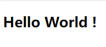
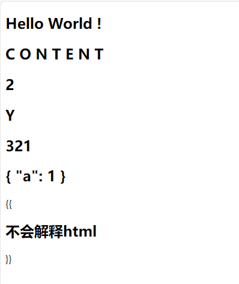
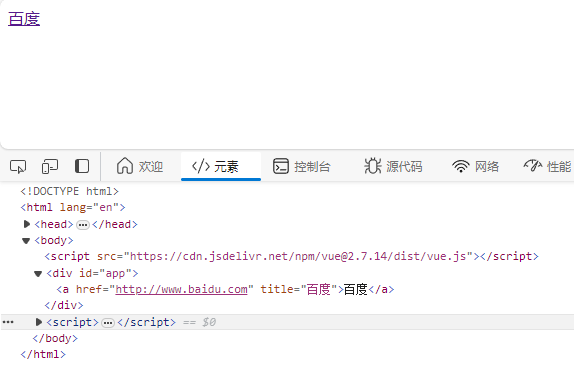

# vue.js.v2

## vue基础

### 导入vue

#### html script导入

开发版：

```html
<!-- 开发环境版本，包含了有帮助的命令行警告 -->
<script src="https://cdn.jsdelivr.net/npm/vue@2/dist/vue.js"></script>
```

生产版本：

```html
<!-- 生产环境版本，优化了尺寸和速度 -->
<script src="https://cdn.jsdelivr.net/npm/vue@2"></script>
```

#### html module导入

```html
<script type="module">
  import Vue from 'https://cdn.jsdelivr.net/npm/vue@2.7.14/dist/vue.esm.browser.js'
</script>
```

#### NPM导入

```bash
# 安装
npm install vue
```

### 完整基础结构

```html
<!doctype html>
<html lang="en">
    <head>
        <meta charset="utf-8" />
        <title>CSS</title>

    </head>
    <body>
        <!-- 被绑定的基础元素 -->
        <div id="app">
            <h2>{{ msg }}</h2>
        </div>

        <!-- 导入 -->
        <script src="https://cdn.jsdelivr.net/npm/vue@2.7.14/dist/vue.js"></script>
        <script>
            const vm = new Vue(
                // 入参是一个对象
                {
                    // 被绑定的元素id
                    el: '#app',
                    // 数据
                    data: {
                        msg: "Hello World!"
                    }
                }
            );
        </script>
    </body>
</html>
```

效果：
<div align="left">
    <figure>
    	
        <figcaption></figcaption>
    </figure>
</div>
### 文本渲染，{{ }}

* 将括号内的表达式解析成文本后替换到标记位置
* v-text指令的“Mustache”语法形式
* 支持解释JavaScript表达式
* 不支持JavaScript语句
* 不会渲染html标签
* 不支持白名单以外的表达式
* 不能访问全局变量

```html
<div id="app">
    <!-- 插入vm绑定的数据 -->
    <h2>{{ msg }}</h2>

    <!-- 插入vm绑定的方法 -->
    <h2>{{ getContent() }}</h2>

    <!-- 插入js表达式 -->
    <h2>{{ 1 + 1 }}</h2>
    <h2>{{ 1 > 0 ? 'Y': 'N' }}</h2>
    <h2>{{ '123'.split('').reverse().join('')  }}</h2>

    <!-- 插入对象（表达式的一种） -->
    <!-- 注意三个大括号不能连着写 -->
    <h2>{{ {a: 1} }}</h2>

    <!-- 不能插入HTML，不会解释html -->
    <div>{{ <h2>不会解释html</h2> }}</div>

    <!-- 这是语句，不是表达式 -->
    <!-- {{ var a = 1 }} -->

    <!-- 流控制也不会生效，请使用三元表达式 -->
    <!-- {{ if (ok) { return message } }} -->
</div>

<script src="https://cdn.jsdelivr.net/npm/vue@2.7.14/dist/vue.js"></script>

<script>
    const vm = new Vue({
            el: '#app',
            data: {
                msg: "Hello World !",
                content: 'C O N T E N T'
            },
            methods: {
                getContent() {
                    return this.content
                }
            }
        }
    )
</script>
```

效果：
<div align="left">
    <figure>
    	
        <figcaption></figcaption>
    </figure>
</div>
### 绑定文本，v-text

* 文本渲染的指令形式
* 不会渲染html标签
* 相当于修改innerText

```html
<div id='app'>
	<h2 v-text='msg'></h2>    
</div>

<script src="https://cdn.jsdelivr.net/npm/vue@2.7.14/dist/vue.js"></script>

<script>
    const vm = new Vue({
        el: '#app',
        data: {
            msg: "Hello World !"
        }
    })
</script>
```

### 绑定HTML，v-html

* 插入html
* 会渲染html标签
* 相当于修改innerHTML

```html
<div id='app'>
    <div v-html="html"></div>
</div>

<script src="https://cdn.jsdelivr.net/npm/vue@2.7.14/dist/vue.js"></script>

<script>
    const vm = new Vue({
        el: '#app',
        data: {
            html: "<h2>HHHHHHHH</h2>"
        }
    })
</script>
```

### 计算属性，computed

* 类似python的property

```html
<div id="example">
  <p>Original message: "{{ message }}"</p>

  <!-- 像使用data数据一样使用计算属性，类似于python property -->
  <p>Computed reversed message: "{{ reversedMessage }}"</p>
</div>

<script src="https://cdn.jsdelivr.net/npm/vue@2.7.14/dist/vue.js"></script>

<script>
  var vm = new Vue({
    el: "#example",
    data: {
      message: "Hello",
    },
    computed: {
      // 计算属性的 getter
      reversedMessage: function () {
        // `this` 指向 vm 实例
        return this.message.split("").reverse().join("");
      },
    },
  });
</script>
```

#### 为什么不使用methods

* 所有computed都可以使用methods实现
* 计算属性是有缓存的，仅当依赖的data发生变化时才重新计算，methods每次都会计算
* 相反，比如获取当前时间`Date.now()`就不应当放在计算属性内

#### 计算属性setter

* computed默认是没有setter的
* 通过setter可以反向更新data中的数据
* setter接受需要一个参数作为输入

计算属性setter示例：

```html
<div id="app">
  <div>FirstName: <input v-model="firstName" /></div>
  <div>LastName: <input v-model="lastName" /></div>
  <div>FullName: <input v-model="fullName" /></div>
</div>

<script src="https://cdn.jsdelivr.net/npm/vue@2.7.14/dist/vue.js"></script>

<script>
  var vm = new Vue({
    el: "#app",
    data: {
      firstName: "Foo",
      lastName: "Bar",
    },
    computed: {
      fullName: {
        get: function () {
          return this.firstName + " " + this.lastName;
        },
        set: function (newValue) {
          var names = newValue.split(" ");
          this.firstName = names[0];
          this.lastName = names[names.length - 1];
        },
      },
    },
  });
</script>
```

### 侦听器，watch

* 侦听器有两种定义方法
  * 可以在vm实例直接定义侦听器
  * 可以通过`vm.$watch`函数，后续再定义侦听器
* 在vm实例中直接定义侦听器需要
  * watch的属性中监听器回调函数的名称与要监听的data属性相同
  * 监听回调函数有两个参数，第一个是改变后的值，第二个是改变前的值

在vm实例中直接定义侦听器示例：

```html
<!-- 
	下面示例演示使用watch监听实现computed的功能
	但是这种做法是没有必要的
-->

<div id="app">
  <div>FirstName: <input v-model="firstName" /></div>
  <div>LastName: <input v-model="lastName" /></div>
  <div>FullName: <input v-model="fullName" /></div>
</div>

<script src="https://cdn.jsdelivr.net/npm/vue@2.7.14/dist/vue.js"></script>

<script>
  var vm = new Vue({
    el: "#app",
    data: {
      firstName: "Foo",
      lastName: "Bar",
      fullName: "Foo Bar",
    },
    watch: {
      // 侦听firstName修改
      firstName: function (newValue) {
        this.fullName = newValue + this.lastName;
      },
      // 侦听lastName修改
      lastName: function (newValue) {
        this.fullName = this.firstName + newValue;
      },
    },
  });
</script>

```

### 条件渲染，v-if，v-show

* `v-if`和`v-show`的区别
  * `v-show`控制是否显示标签,相当于`style="display: none"`
  * `v-if` 则标签不存在DOM元素
  * `v-show`开销较小，性能更好，适合后续还有可能显示的标签

#### v-if

* v-else-if与else if类似
* v-else于else类似

```html
<div id="app">
    <h1 v-if = "getRandom() < 0.3">小于0.3</h1>
    <h1 v-else-if = "0.6 > getRandom() > 0.3">大于0.3小于0.6</h1>
    <h1 v-else>大于0.6</h1>
</div>

<script src="https://cdn.jsdelivr.net/npm/vue@2.7.14/dist/vue.js"></script>

<script>
    const vm = new Vue({
        el: '#app',
        methods: {
            getRandom() {
                return Math.random()
            }
        }
    })
</script>
```

#### v-show

略

#### v-if同时隐藏多个元素

* 可以借用无意义的template标签包裹多个元素
* 渲染结果不会包含template标签

```html
<template v-if="ok">
    <h1></h1>
    <p></p>
    <p></p>
</template>
```

### 列表渲染，v-for

#### 迭代数值

```html
<div>
  <span v-for="n in 10">{{ n }} </span>
</div>
```

#### 迭代数组

示例：

```html
<ul id="example-1">
  <li v-for="item in items" :key="item.message">
    {{ item.message }}
  </li>
</ul>

<script>
var example1 = new Vue({
  el: '#example-1',
  data: {
    items: [
      { message: 'Foo' },
      { message: 'Bar' }
    ]
  }
})
</script>
```

获取当前索引id：

```html
<ul id="example-2">
  <li v-for="(item, index) in items">
    {{ parentMessage }} - {{ index }} - {{ item.message }}
  </li>
</ul>
```

if of 通用，这里并不是JavaScript语法

```html
<div v-for="item of items"></div>
```

#### 迭代对象

* 遍历对象的顺序是按`Object.keys()`的结果

示例：

```html
<ul id="v-for-object" class="demo">
    <!-- 迭代的是object的value -->
    <li v-for="value in object">
    {{ value }}
	</li>
</ul>
<script>
new Vue({
  el: '#v-for-object',
  data: {
    object: {
      title: 'How to do lists in Vue',
      author: 'Jane Doe',
      publishedAt: '2016-04-10'
    }
  }
})
</script>
```

获取key：

```html
<div v-for="(value, name) in object">
  {{ name }}: {{ value }}
</div>
```

获取key和index

```html
<div v-for="(value, name, index) in object">
  {{ index }}. {{ name }}: {{ value }}
</div>
```

#### vue检测数组更新的机制

* 由于JavaScript的限制，Vue不能直接检测数和对象的变化

* vue对数组的以下方法进行了包裹，才能检测到数组的更新，并更新视图
  * `push()`
  * `pop()`
  * `shift()`
  * `unshift()`
  * `splice()`
  * `sort()`
  * `reverse()`

* vue对部分方法进行了增强，使得数组被替换时，无需重新渲染整个DOM
  * `filter()`
  * `concat()`
  * `slice()`

#### 过滤和排序

* 过滤和排序时，无需修改原始数据
* 可以遍历计算属性computed或方法methods返回的数组

```html
<!-- 示例1 -->

<li v-for="n in evenNumbers">{{ n }}</li>

<script>
    data: {
      numbers: [ 1, 2, 3, 4, 5 ]
    },
    computed: {
      evenNumbers: function () {
        return this.numbers.filter(function (number) {
          return number % 2 === 0
        })
      }
    }
</script>

<!-- 示例2: 无法使用计算属性时，可以使用methods -->

<ul v-for="set in sets">
  <li v-for="n in even(set)">{{ n }}</li>
</ul>

<script>
    data: {
      sets: [[ 1, 2, 3, 4, 5 ], [6, 7, 8, 9, 10]]
    },
    methods: {
      even: function (numbers) {
        return numbers.filter(function (number) {
          return number % 2 === 0
        })
      }
    }
</script>
```

#### 在组件上使用v-for

* 在组件上使用v-for时，必须绑定key
* vue为了避免组件与v-for耦合，必须手动绑定v-for的item值到组件

```html
<my-component
  v-for="(item, index) in items"
  v-bind:item="item"
  v-bind:index="index"
  v-bind:key="item.id"
></my-component>
```

* 完整的组件示例

```html
<!--
注意这里的 is="todo-item" attribute。这种做法在使用 DOM 模板时是十分必要的，因为在 <ul> 元素内只有 <li> 元素会被看作有效内容。这样做实现的效果与 <todo-item> 相同，但是可以避开一些潜在的浏览器解析错误。查看 DOM 模板解析说明 来了解更多信息。
-->

<div id="todo-list-example">
  <form v-on:submit.prevent="addNewTodo">
    <label for="new-todo">Add a todo</label>
    <input
      v-model="newTodoText"
      id="new-todo"
      placeholder="E.g. Feed the cat"
    />
    <button>Add</button>
  </form>
  <ul>
    <li
      is="todo-item"
      v-for="(todo, index) in todos"
      v-bind:key="todo.id"
      v-bind:title="todo.title"
      v-on:remove="todos.splice(index, 1)"
    ></li>
  </ul>
</div>

<script src="https://cdn.jsdelivr.net/npm/vue@2.7.14/dist/vue.js"></script>

<script>
  Vue.component("todo-item", {
    template:
      "\
    <li>\
      {{ title }}\
      <button v-on:click=\"$emit('remove')\">Remove</button>\
    </li>\
  ",
    props: ["title"],
  });

  new Vue({
    el: "#todo-list-example",
    data: {
      newTodoText: "",
      todos: [
        {
          id: 1,
          title: "Do the dishes",
        },
        {
          id: 2,
          title: "Take out the trash",
        },
        {
          id: 3,
          title: "Mow the lawn",
        },
      ],
      nextTodoId: 4,
    },
    methods: {
      addNewTodo: function () {
        this.todos.push({
          id: this.nextTodoId++,
          title: this.newTodoText,
        });
        this.newTodoText = "";
      },
    },
  });
</script>
```


### 绑定属性，v-bind

* 属性不能使用双大括号绑定
* 用于绑定属性

v-bind示例：

```html
<div id='app'>
    <a v-bind:href = "res.url" :title = "res.name">{{ res.name }}</a>
</div>

<script src="https://cdn.jsdelivr.net/npm/vue@2.7.14/dist/vue.js"></script>

<script>
	const vm = new Vue({
        el: '#app',
        data: {
            res: {
                url: 'http://www.baidu.com',
                name: '百度'
            }
        }
    });
</script>
```

v-bind效果：
<div align="left">
    <figure>
    	
        <figcaption></figcaption>
    </figure>
</div>
#### 绑定布尔属性

* 布尔类型的属性，如果绑定的属性值为false，则不会出现在html标签属性中

```html
<!-- 
	如果 `isButtonDisabled` 的值是 `null`、`undefined` 或 `false`，
	则 `disabled` attribute 不会被包含在渲染出来的 `<button>` 元素中。 
-->
<button v-bind:disabled="isButtonDisabled">Button</button>
```

### 动态绑定，v-bind:[property]

* 使用中括号包裹变量
* 绑定不特定属性

```html
<a v-bind:[attributeName]="url"> ... </a>

<a v-on:[eventName]="doSomething"> ... </a>
```

* 移除动态参数：

```html
<a v-bind:[null]></a>
```

* 注意事项：

  * 中括号中尽量不要使用表达式

  * 如果有计算需要可以使用计算属性

  * 属性变量不能使用大写，大写会被自动转换为小写在vm数据模板中查找

### 一次性绑定，v-once

* 执行一次插值后，不再更新数据，属性也不会更新

```html
<span v-once> {{ data }} </span>
```

### style和class的绑定增强

* class和style的属性值往往由多个子元素组成，为了避免用户字符串拼接，vue对class和style做了专门的增强，可以使用对象语法和数组语法设置class和style
* 对于原本带有短横线的内部属性，可以使用驼峰写法，vue会自动转换成短横线写法

#### class绑定对象

```html
<h3 v-bind:class="{active: isActive}"></h3>

<!-- isActive为truthiness时，html渲染为 -->
<h3 class="active"></h3>

<!-- isActive为falseness时，html渲染为 -->
<h3></h3>
```

#### class绑定数组

```html
<div v-bind:class="[activeClass, errorClass]"></div>

<script>
/*
data: {
  activeClass: 'active',
  errorClass: 'text-danger'
}
*/
</script>
```

#### class绑定有表达式的数组

```html
<div v-bind:class="[isActive ? activeClass : '', errorClass]"></div>
```

#### class绑定数组结合对象

```html
<div v-bind:class="[{ active: isActive }, errorClass]"></div>
```

#### class与v-bind:class共存

```html
<h3 class="name" v-bind:class = "{active: isActive}"></h3>
```

#### style绑定表达式

```html
<div v-bind:style="{ color: activeColor, fontSize: fontSize + 'px' }"></div>

<script>
data: {
  activeColor: 'red',
  fontSize: 30
}
</script>
```

#### style绑定对象
```html
<div v-bind:style="styleObject"></div>

<script>
data: {
  styleObject: {
    color: 'red',
    fontSize: '13px'
  }
}
</script>
```

#### style数组语法

* 数组元素中对css属性重复设置的，会相互覆盖

```html
<div v-bind:style="[baseStyles, overridingStyles]"></div>
```

### 事件绑定，v-on

#### 在HTML绑定事件的好处

1. 扫一眼 HTML 模板便能轻松定位在 JavaScript 代码里对应的方法。
2. 因为无须在 JavaScript 里手动绑定事件，ViewModel 代码可以是非常纯粹的逻辑，和 DOM 完全解耦
3. 当一个ViewModel 被销毁时，所有的事件处理器都会自动被删除。你无须担心如何清理它们。

#### 绑定事件到表达式

* 使用v-on指令绑定DOM事件名称
* v-on可以缩写为at符号
* 属性值中可以执行JavaScript表达式

```html
<div id="example-1">
  <button v-on:click="counter += 1">Add 1</button>
  <p>The button above has been clicked {{ counter }} times.</p>
</div>

<script src="https://cdn.jsdelivr.net/npm/vue@2.7.14/dist/vue.js"></script>

<script>
  var example1 = new Vue({
    el: "#example-1",
    data: {
      counter: 0,
    },
  });
</script>
```

#### 绑定事件到方法名

* 方法接受一个参数，event对象

```html
<div id="example-2">
  <!-- `greet` 是在下面定义的方法名 -->
  <button v-on:click="greet">Greet</button>
</div>

<script src="https://cdn.jsdelivr.net/npm/vue@2.7.14/dist/vue.js"></script>

<script>
  var example2 = new Vue({
    el: "#example-2",
    data: {
      name: "Vue.js",
    },
    // 在 `methods` 对象中定义方法
    methods: {
      greet: function (event) {
        // `this` 在方法里指向当前 Vue 实例
        alert("Hello " + this.name + "!");
        // `event` 是原生 DOM 事件
        if (event) {
          alert(event.target.tagName);
        }
      },
    },
  });
</script>

```

#### 绑定事件到调用方法的表达式

* 手动调用方法时，在参数中使用`$event`关键字作为方法参数获取原生DOM事件对象

```html
<div id="example-3">
  <button v-on:click="warn('Form cannot be submitted yet.', $event)">
    Submit
  </button>
</div>

<script src="https://cdn.jsdelivr.net/npm/vue@2.7.14/dist/vue.js"></script>

<script>
  new Vue({
    el: "#example-3",
    methods: {
      warn: function (message, event) {
        // 现在我们可以访问原生事件对象
        if (event) {
          event.preventDefault();
        }
        alert(message);
      },
    },
  });
</script>

```

### 事件修饰符

* 事件修饰符产生的目的
  * 方法只有纯粹的数据逻辑，而不是去处理 DOM 事件细节。
* 事件修饰符产生的目的，例如
  * 在事件处理程序中调用 `event.preventDefault()` 或 `event.stopPropagation()` 是非常常见的需求。尽管我们可以在方法中轻松实现这点，但更好的方式是：方法只有纯粹的数据逻辑，而不是去处理 DOM 事件细节。

#### 事件修饰符的使用方法

* 跟在事件名称后

```html
<a v-on:click.stop="doThis"></a>
<form v-on:submit.prevent="onSubmit">...</form>
```

* 串联多个修饰符

```html
<!-- 使用修饰符时，顺序很重要；相应的代码会以同样的顺序产生。因此，用 v-on:click.prevent.self 会阻止所有的点击，而 v-on:click.self.prevent 只会阻止对元素自身的点击。 -->

<a v-on:click.stop.prevent="doThat"></a>
```

* 单独使用修饰符而不绑定事件

```html
<form v-on:submit.prevent></form>
```

#### 通用事件修饰符

##### 阻止单击事件继续传播 .stop

```html
<a v-on:click.stop="doThis"></a>
```

##### 提交事件不再重载页面 .prevent

```html
<form v-on:submit.prevent="onSubmit"></form>
```

##### 绑定事件到捕获阶段 .capture

```html
<!-- 添加事件监听器时使用事件捕获模式 -->
<!-- 即内部元素触发的事件先在此处理，然后才交由内部元素进行处理 -->
<div v-on:click.capture="doThis">...</div>
```

##### 只监听target是自己的事件 .self

```html
<!-- 只当在 event.target 是当前元素自身时触发处理函数 -->
<!-- 即事件不是从内部元素触发的 -->
<div v-on:click.self="doThat">...</div>
```

##### 只触发一次事件 .once

```html
<a v-on:click.once="doThis"></a>
```

#### 按键修饰符增强

##### 绑定特定按键

- `.enter`
- `.tab`
- `.delete` (捕获“删除”和“退格”键)
- `.esc`
- `.space`
- `.up`
- `.down`
- `.left`
- `.right`

```html
<!-- 只有在 `key` 是 `Enter` 时调用 `vm.submit()` -->
<input v-on:keyup.enter="submit">

<input v-on:keyup.page-down="onPageDown">
```

##### 绑定组合键

- `.ctrl`
- `.alt`
- `.shift`

```html
<!-- Alt + C -->
<input v-on:keyup.alt.c="clear">

<!-- Ctrl + Click -->
<div v-on:click.ctrl="doSomething">Do something</div>
```

##### 精确绑定修饰符 .exact

```html
<!-- 即使 Alt 或 Shift 被一同按下时也会触发 -->
<button v-on:click.ctrl="onClick">A</button>

<!-- 有且只有 Ctrl 被按下的时候才触发 -->
<button v-on:click.ctrl.exact="onCtrlClick">A</button>

<!-- 没有任何系统修饰符被按下的时候才触发 -->
<button v-on:click.exact="onClick">A</button>
```

#### 鼠标按键修饰符

- `.left`
- `.right`
- `.middle`

### 双向绑定，v-model

* v-model会忽略表单元素的value、checked、selected的初始值，使用vue实例的数据作为数据来源
* v-model为不同的表单元素映射了不同的，html属性和事件
  * text、textarea使用value属性，input事件
  * checkbox、radio使用checked属性，change事件
  * select使用value属性，change事件

#### 默认绑定

##### 单行文本，input.type="text"

* 监听input事件
* 绑定value到字符串

```html
<!-- 读写 -->
<input v-model="message" placeholder="edit me">

<!-- 只读 -->
<p>Message is: {{ message }}</p>
```

##### 多行文本，textarea

* 监听input事件
* 绑定value到字符串

```html
<!-- 读写 -->
<textarea v-model="message" placeholder="add multiple lines"></textarea>

<!-- 只读 -->
<!-- style作用是将段落元素中的空格和换行符保留，默认会将换行符替换为空格 -->
<p style="white-space: pre-line;">{{ message }}</p>
```

##### 复选框，checkbox

* 监听change事件

* 绑定checked属性
  * 单复选框绑定到布尔值
  * 多复选框绑定到数组


单复选框示例

```html
<!-- 读写 -->
<input type="checkbox" id="checkbox" v-model="checked">

<!-- 只读 -->
<label for="checkbox">{{ checked }}</label>
```

多复选框示例

```html
<!-- 读写 -->
<input type="checkbox" id="jack" value="Jack" v-model="checkedNames">
<label for="jack">Jack</label>
<input type="checkbox" id="john" value="John" v-model="checkedNames">
<label for="john">John</label>
<input type="checkbox" id="mike" value="Mike" v-model="checkedNames">
<label for="mike">Mike</label>

<!-- 只读 -->
<span>Checked names: {{ checkedNames }}</span>
```

##### 单选按钮，radio

* 监听change事件

* 绑定到value属性值到字符串

```html
<!-- 读写 -->
<input type="radio" id="one" value="One" v-model="picked">
<label for="one">One</label>
<input type="radio" id="two" value="Two" v-model="picked">
<label for="two">Two</label>

<!-- 只读 -->
<span>Picked: {{ picked }}</span>
```

##### 选择框，select

* 绑定checked事件

* 绑定value属性值
* 如果 `<option>` 元素没有设置 `value` 属性，则 `value` 值默认为元素中的文本。如果不设置 `value` 属性，则可以使用 `text` 属性来获取选项的文本。

* 单选绑定value到字符串

* 多选绑定value到数组

单选示例

```html
<!-- 读写 -->
<select v-model="selected">
    <option disabled value="">请选择</option>
    <option>A</option>
    <option>B</option>
    <option>C</option>
</select>

<!-- 只读 -->
<span>Selected: {{ selected }}</span>
```

多选示例

```html
<!-- 读写 -->
<select v-model="selected" multiple style="width: 50px;">
    <option>A</option>
    <option>B</option>
    <option>C</option>
</select>

<!-- 只读 -->
<span>Selected: {{ selected }}</span>
```

text和value不相同，结合v-for渲染option示例

```html
<!-- 读写 -->
<select v-model="selected">
  <option v-for="option in options" v-bind:value="option.value">
    {{ option.text }}
  </option>
</select>

<!-- 只读 -->
<span>Selected: {{ selected }}</span>
```

#### 值绑定

##### 单个复选框绑定字符串

* 默认单个复选框绑定checked属性值到布尔值

```html
<input
  type="checkbox"
  v-model="toggle"
  true-value="yes"
  false-value="no"
>

<script>
// 当选中时
vm.toggle === 'yes'

// 当没有选中时
vm.toggle === 'no'
</script>
```

##### 单选按钮绑定变量

* 默认单选按钮绑定value属性值到字符串
* 使用v-bind绑定value到数据模型属性a

```html
<input type="radio" v-model="pick" v-bind:value="a">

<script>
// 当选中时
vm.pick === vm.a
</script>
```

##### 选择框绑定到对象

* 默认单个选择框绑定到字符串
* 使用v-bind解析value值中的JavaScript表达式

```html
<select v-model="selected">
	<!-- 内联对象字面量 -->
	<option v-bind:value="{ number: 123 }">123</option>
</select>

<script>
    // 当选中时
    typeof vm.selected // => 'object'
    vm.selected.number // => 123
</script>
```

#### 修饰符

##### 改为监听input标签的change事件 .lazy

* 默认监听input的input事件

```html
<!-- 在“change”时而非“input”时更新 -->
<input v-model.lazy="msg">
```

##### 自动转换input标签的value为number类型

* 即使在 `type="number"` 时，HTML 输入元素的值也总会返回字符串

```html
<input v-model.number="age" type="number">

```

##### 自动过滤用户输入的空白

```html
<input v-model.trim="msg">
```


### 过滤器，filter


### 缩写

#### v-bind缩写

```html
<!-- 完整语法 -->
<a v-bind:href="url">...</a>

<!-- 缩写 -->
<a :href="url">...</a>

<!-- 动态参数的缩写 (2.6.0+) -->
<a :[key]="url"> ... </a>
```

#### v-on缩写

```html
<!-- 完整语法 -->
<a v-on:click="doSomething">...</a>

<!-- 缩写 -->
<a @click="doSomething">...</a>

<!-- 动态参数的缩写 (2.6.0+) -->
<a @[event]="doSomething"> ... </a>
```

### vue的复用DOM元素机制

* vue会尽可能高效地渲染元素，通常会复用已有元素而不是从头开始渲染

* 复用组件

  * 效率高
  * 输入组件的内容不会被清空
  * 可能造成内容错误

* 不复用组件

  * 效率低

* 如何使用key

  * 如果不设置key，vue会以节点位置作为key，有可能使用错误的节点缓存，
  * key应该在页面中唯一

  * vue中应该使用key管理的情况
    * v-if隐藏的元素
    * v-if和v-else可以共用的元素
    * v-for的item

```html
<!--
	下面情况vue会自动复用html元素
	好处是input的内容不会被清空
-->

<template v-if="loginType === 'username'">
  <label>Username</label>
  <input placeholder="Enter your username">
</template>
<template v-else>
  <label>Email</label>
  <input placeholder="Enter your email address">
</template>

<!--
	给input元素设置key可以避免input元素被复用
	内容每次会被清空
	label没有设置key任然会被复用
-->
<template v-if="loginType === 'username'">
  <label>Username</label>
  <input placeholder="Enter your username" key="username-input">
</template>
<template v-else>
  <label>Email</label>
  <input placeholder="Enter your email address" key="email-input">
</template>
```

* 一般需要结合v-bind动态绑定key属性

```html
<!-- v-bind:key -->
<ul id="example-1">
  <li v-for="item in items" v-bind:key="item.message">
    {{ item.message }}
  </li>
</ul>

<!-- :key -->
<ul id="example-1">
  <li v-for="item in items" :key="item.message">
    {{ item.message }}
  </li>
</ul>
```

### 生命周期


* 创建前，beforeCreate
  * data数据未处理
* 创建后，created
  * data数据已处理
    * 数据初始化
    * 从网络加载数据
* 挂载前，beforeMount
  * dom未挂载
* 挂载后，mounted
  * dom已挂载
* 更新前，beforeUpdate
  * 数据更新前
* 更新后，updated
  * 数据更新后
* 激活的，activated
  * 失活前
  * 缓存在keep-alive中
* 失活的，deactivated
  * 失活后
  * 缓存在keep-alive中
* 销毁前，beforeDestroy
  * 组件未销毁
  * 例如`v-if="false"`后
* 销毁后，destroyed
  * 组件已销毁
  * 例如`v-if="false"`后


## vue组件化开发

### 组件的定义和使用

* 组件的定义和使用
* 组件是Vue复用的方式
* 组件是可复用的 Vue 实例
* 组件注册时需要自定义一个名字，使用时作为自定义html标签名，例如`button-counter`
* 组件注册到Vue类中，才能在后续vue实例中使用，如`Vue.component('button-counter', {...})`
* 由于组件是可复用的，所以组件的data必须以工厂函数形式返回新对象，每个组件实例使用自己的数据，如`data: function () { return {...}; }`
* 组件就是Vue实例，组件与根vue实例的区别是，组件需要定义自建的`template`，而根vue实例要使用`el`绑定html根元素
* 组件名要求
  * 建议遵循W3C规范中的自定义组件名，全小写+短横线连接
  * 组件名如果使用驼峰体，在引用组件时既可以使用原名，也可以使用vue自动转换的全小写+短横线连接的名称，例如`Vue.component('MyComponentName', { /* ... */ })`，Vue会自动支持`<my-component-name>`


```html
<div id="components-demo">
  <button-counter></button-counter>
  <button-counter></button-counter>
  <button-counter></button-counter>
</div>

<script src="https://cdn.jsdelivr.net/npm/vue@2.7.14/dist/vue.js"></script>

<script>
  // 定义一个名为 button-counter 的新组件
  Vue.component("button-counter", {
    data: function () {
      return {
        count: 0,
      };
    },
    template:
      '<button v-on:click="count++">You clicked me {{ count }} times.</button>',
  });

  new Vue({ el: "#components-demo" });
</script>
```

### 动态组件，component + is

* 通过`component`标签指示组件插入的位置，使用`component`的`is`属性指示组件的类型
* 使用`v-bind`指令绑定`is`属性就可以动态指定组件的类型

```html
<component v-bind:is="currentTabComponent"></component>
```

### 使用is规避模板导致的渲染错误

* 有些 HTML 元素，诸如 `<ul>`、`<ol>`、`<table>` 和 `<select>`，对于哪些元素可以出现在其内部是有严格限制的

* 将自定义模板放入上面这些元素中，会被作为无效的内容提升到外部，并导致最终渲染结果出错

* 不会出现这个问题的场景

  * 字符串 (例如：template: '...')
  * 单文件组件 (.vue)
  * `<script type="text/x-template">`

```html
<!-- 导致渲染出错 -->
<table>
  <blog-post-row></blog-post-row>
</table>

<!-- 规避方法 -->
<table>
  <tr is="blog-post-row"></tr>
</table>
```

### 组件注册，component

#### 注册全局组件，Vue.component

* 通过`Vue.component`创建组件的方式是全局注册的
* 全局注册的组件，可以用在任何新创建的 Vue 根实例的模板中
* 全局注册的组件，在组件的子组件中也可以使用
* 组件入门示例中使用的是全局注册方式
* 缺点
  * 全局注册会导致Vue实例变得庞大
  * 降低下载、加载速度
  * 不能支持构建工具按需构建

#### 局部注册组件，components

* 局部注册字符串组件示意

```js
var ComponentA = { /* ... */ }
var ComponentB = { /* ... */ }
var ComponentC = { /* ... */ }

// 在components属性中列出需要注册的组件、组件的自定义名称
new Vue({
  el: '#app',
  components: {
    'component-a': ComponentA,
    'component-b': ComponentB
  }
})
```

* 局部注册字符串组件组件完整示例

```html
<div id="components-demo">
  <button-counter></button-counter>
  <button-counter></button-counter>
  <button-counter></button-counter>
</div>

<script src="https://cdn.jsdelivr.net/npm/vue@2.7.14/dist/vue.js"></script>

<script>
  // 定义一个名为 button-counter 的新组件
  let buttonCounter = {
    data: function () {
      return {
        count: 0,
      };
    },
    template:
      '<button v-on:click="count++">You clicked me {{ count }} times.</button>',
  };

  new Vue({
    el: "#components-demo",
    components: {
      "button-counter": buttonCounter,
    },
  });
</script>
```

* 局部注册的组件，在内部无法使用局部注册的其他组件，如需支持需要明确依赖关系

```js
var ComponentA = { /* ... */ }

var ComponentB = {
  components: {
    'component-a': ComponentA
  },
  // ...
}
```

* 在node中局部注册组件示意

```js
import ComponentA from './ComponentA.vue'

export default {
  components: {
    ComponentA
  },
  // ...
}
```

### 组件数据传递

#### 从外向内传递数据，props

* props是字符串时，只传单一值，例如`props: blog`
* props是数组时，传递多个值，例如`props: [title, content]`
* 使用自定义的props，与设置原生html属性相同
* 每个组件必须只有一个根元素，多个元素可以使用div元素包裹起来

```html
<!-- 定义props -->
<script>
Vue.component('blog-post', {
  props: ['title'],
  template: '<h3>{{ title }}</h3>'
});
</script>

<!-- 使用props -->
<blog-post title="My journey with Vue"></blog-post>
<blog-post title="Blogging with Vue"></blog-post>
<blog-post title="Why Vue is so fun"></blog-post>

<!-- 使用v-bind动态绑定props -->
<script>
new Vue({
  el: '#blog-post-demo',
  data: {
    posts: [
      { id: 1, title: 'My journey with Vue' },
      { id: 2, title: 'Blogging with Vue' },
      { id: 3, title: 'Why Vue is so fun' }
    ]
  }
})
</script>

<blog-post
  v-for="post in posts"
  v-bind:key="post.id"
  v-bind:title="post.title"
></blog-post>
```

#### 从内向外传递数据，$emit

* 定义组件时，在组件内监听事件，调用`$emit`函数，抛出自定义名称事件，
  * 如`<button v-on:click="$emit('enlarge-text')">`
* 使用组件时，在组件外监听事件，绑定组件抛出的事件名称
  * 如`<blog-post v-on:enlarge-text="postFontSize += 0.1">`

```html
<div id="app">
  <div :style="{ fontSize: postFontSize + 'em' }">
    <blog-post
      v-for="post in posts"
      v-bind:key="post.id"
      v-bind:post="post"
      v-on:enlarge-text="postFontSize += 0.1"
    />
  </div>
</div>

<script src="https://cdn.jsdelivr.net/npm/vue@2.7.14/dist/vue.js"></script>

<script>
  // 定义一个名为 button-counter 的新组件
  Vue.component("blog-post", {
    props: ["post"],
    template: `
    <div class="blog-post">
      <h3>{{ post.title }}</h3>
      <button v-on:click="$emit('enlarge-text')">
        Enlarge text
      </button>
      <div v-html="post.content"></div>
    </div>
  `,
  });

  new Vue({
    el: "#app",
    data: {
      posts: [
        { id: 1, title: "My journey with Vue" },
        { id: 2, title: "Blogging with Vue" },
        { id: 3, title: "Why Vue is so fun" },
      ],
      postFontSize: 1,
    },
  });
</script>
```

* `$emit`可以传入参数

```html
<button v-on:click="$emit('enlarge-text', 0.1)">
  Enlarge text
</button>
```

* 在父组件中通过`$event`使用`$emit`传入的参数

```html
<blog-post
  ...
  v-on:enlarge-text="postFontSize += $event"
></blog-post>
```

* 在父组件回调函数中使用`$emit`传入的参数

```html
<blog-post
  ...
  v-on:enlarge-text="onEnlargeText"
></blog-post>

<script>
methods: {
  onEnlargeText: function (enlargeAmount) {
    this.postFontSize += enlargeAmount
  }
}
</script>
```

* 简写emit

```html


```

#### 自定义组件支持，v-model

* v-model指令本质上是v-bind和v-on组合的简写
* 在组件中，通过v-bind组件属性props有外向内绑定数据
* 在组件中，通过v-on向外触发事件
* 在定义组件时，v-bind组件属性props和v-on $emit事件，在使用组件时，v-bind组件属性props和v-on绑定内部$emit的事件，可以实现双向绑定
* 要使组件支持v-model指令，必须满足
  * 组件内v-bind的props，属性名称必须是`value`
  * 组件内v-on的事件名称，必须是`input`

```html
<div id="app">
  <!-- 双向绑定 -->
  <div>
    <componentinput
      v-for="index in 2"
      :key="index"
      :value="roottext"
      @input="roottext = $event"
    />
  </div>

  <!-- 支持v-model的 -->
  <div>
    <componentinput v-for="index in 2" :key="index" v-model="roottext" />
  </div>
</div>

<script src="https://cdn.jsdelivr.net/npm/vue@2.7.14/dist/vue.js"></script>

<script>
  // 定义一个名为 button-counter 的新组件
  Vue.component("componentinput", {
    props: ["value"],
    template: `
      <div>
        <input
          :value="value"
          @input="$emit('input', $event.target.value)" />
      </div>
    `,
  });

  new Vue({
    el: "#app",
    data: function () {
      return {
        roottext: "init text",
      };
    },
  });
</script>

```

#### 全局总线，$root

* 在所有vue实例中，都可以使用`this.$root`访问根实例
* 在事件源发布事件，`this.$root.$emit('')`
* 接受者组件在`created(){}`中订阅事件，`this.$root.$on('eventname', (n)=>{ this.action })`

* 旧版不支持`$root`属性，也可以在new一个Vue对象作为全局总线，`let bus = new Vue()`

* 更高级的专用数据管理方案请学习vuex


#### 多层嵌套组件简历通讯关系，provide、inject


### 组件插槽，slot

* 插槽指的是html标签内包裹的部分，例如在`<p>`标签内包裹的文本和在`<div>`标签中包裹子标签
* 插槽的使用方式与`<p>`标签或`<div>`标签相同
* 插槽可以是匿名插槽，也可以是具名插槽
  * 匿名插槽在定义时使用`<slot>`定义插槽和插入的位置
  * 具名插槽在定义时使用`<template slot="name">`定义该名称插槽插入的位置，在使用时通过名称查找用户内容插入的位置

```html
<div id="app">
  <alert-box> Something bad happened. </alert-box>
</div>

<script src="https://cdn.jsdelivr.net/npm/vue@2.7.14/dist/vue.js"></script>

<script>
  // 定义一个名为 button-counter 的新组件
  Vue.component("alert-box", {
    template: `
    <div class="demo-alert-box">
      <strong>Error!</strong>
      <slot></slot>
    </div>
  `,
  });

  new Vue({
    el: "#app",
  });
</script>
```


#### 匿名插槽，`<slot>`

```html
<slot></slot>
```

#### 具名插槽，`<template slot="name">`

* 按名称调用使用哪个插槽

```html
# 定义
<slot name="xxx"></slot>

# 使用
<template slot="xxx">
</template>
```


#### 作用域插槽

```html
```

### props使用场景及其方法

#### props命名问题

* HTML的attribute名是大小写不敏感的，浏览器会将所有大写字符解释为小写字符
* 定义props时使用camelCase的属性，使用时应使用kebab-case
* 如果使用字符串模板，那么这个限制就不存在了

```html
<script>
// 在 JavaScript 中是 camelCase 的
Vue.component('blog-post', {
  props: ['postTitle'],
  template: '<h3>{{ postTitle }}</h3>'
});
</script>

<!-- 在 HTML 中是 kebab-case 的 -->
<blog-post post-title="hello!"></blog-post>
```

#### 以数组+字符串定义props

```js
props: ['title', 'likes', 'isPublished', 'commentIds', 'author']
```

#### 以对象+类型定义props

```js
props: {
  title: String,
  likes: Number,
  isPublished: Boolean,
  commentIds: Array,
  author: Object,
  callback: Function,
  contactsPromise: Promise // or any other constructor
}
```

#### 静态设置props

```html
<blog-post title="My journey with Vue"></blog-post>
```

#### 动态绑定props

```html
<!-- 动态赋予一个变量的值 -->
<blog-post v-bind:title="post.title"></blog-post>

<!-- 动态赋予一个复杂表达式的值 -->
<blog-post
  v-bind:title="post.title + ' by ' + post.author.name"
></blog-post>
```

#### 给props传入Number

```html
<!-- 即便 `42` 是静态的，我们仍然需要 `v-bind` 来告诉 Vue -->
<!-- 这是一个 JavaScript 表达式而不是一个字符串。-->
<blog-post v-bind:likes="42"></blog-post>

<!-- 用一个变量进行动态赋值。-->
<blog-post v-bind:likes="post.likes"></blog-post>
```

#### 给props传入Boolean

```html
<!-- 包含该 prop 没有值的情况在内，都意味着 `true`。-->
<blog-post is-published></blog-post>

<!-- 即便 `false` 是静态的，我们仍然需要 `v-bind` 来告诉 Vue -->
<!-- 这是一个 JavaScript 表达式而不是一个字符串。-->
<blog-post v-bind:is-published="false"></blog-post>

<!-- 用一个变量进行动态赋值。-->
<blog-post v-bind:is-published="post.isPublished"></blog-post>
```

#### 给props传入Array

```html
<!-- 即便数组是静态的，我们仍然需要 `v-bind` 来告诉 Vue -->
<!-- 这是一个 JavaScript 表达式而不是一个字符串。-->
<blog-post v-bind:comment-ids="[234, 266, 273]"></blog-post>

<!-- 用一个变量进行动态赋值。-->
<blog-post v-bind:comment-ids="post.commentIds"></blog-post>
```

#### 给props传入Object

```html
<!-- 即便对象是静态的，我们仍然需要 `v-bind` 来告诉 Vue -->
<!-- 这是一个 JavaScript 表达式而不是一个字符串。-->
<blog-post
  v-bind:author="{
    name: 'Veronica',
    company: 'Veridian Dynamics'
  }"
></blog-post>

<!-- 用一个变量进行动态赋值。-->
<blog-post v-bind:author="post.author"></blog-post>
```

#### 将外部Object整体映射给props

* `v-bind="Object"`直接赋值为v-bind会自动映射

```html
<script>
    post: {
      id: 1,
      title: 'My Journey with Vue'
    }
</script>

<!-- 整体映射 -->
<blog-post v-bind="post"></blog-post>

<!-- 分别绑定 -->
<blog-post
  v-bind:id="post.id"
  v-bind:title="post.title"
></blog-post>
```

### $emit使用场景及其方法


### $root根实例

* 所有子组件都可以通过`$root`访问到根实例
* 根实例可以用于订阅和发布全局事件
* 使用根实例会导致组件间的耦合


### 异步组件，import


### $refs

#### 给标签添加ref

#### 给子组件添加ref


### 异步更新队列

* 主动调用nexttick立即更新组件

* 


### 动态添加属性，$set，Object.assign


### 混入，mixins

* 属性重复时，vue优先，minin劣后


### 过滤器，filters

* filters是一个处理函数
* 函数入参是处理前的数据
* 过滤器函数通过返回值，输出一个处理后的数据

#### 使用过滤器

```html
<!-- 不带参数的过滤器 -->
<h2> {{ 表达式 | 过滤器名称 }} </h2>

<!-- 带参数的过滤器 -->
<h2> {{ 表达式 | 过滤器名称(参数) }} </h2>
```

#### 全局注册filter

```html
<!-- 不带参数的过滤器 -->
<script>
	Vue.filter("过滤器名称", function (输入) {
        return 输出;
    });
</script>

<!-- 带参数的过滤器 -->
<script>
	Vue.filter("过滤器名称", function (输入, 参数) {
        return 输出;
    });
</script>
```

#### 局部注册filter

```html
<!-- 不带参数的过滤器 -->
<script>
    new Vue({
        filters: {
            过滤器名称: function (输入) {
                return 输出;
            }
        }
    });
</scripts>

<!-- 带参数的过滤器 -->
<script>
    new Vue({
        filters: {
            过滤器名称: function (输入, 参数) {
                return 输出;
            }
        }
    });
</scripts>
```


## vue-cli3单文件组件

### 基础

#### script开发的缺陷

* 组件名称不能重复
* es6引进模板字符串不能自动提示
* 不支持CSS
* 没有构建步骤
  * 不能使用装饰器等语法
  * 不支持.vue单文件组件

#### 安装cnpm淘宝加速镜像

```bash
npm install -g cnpm --registry=https://registry.npm.taobao.org
```

#### 安装vue cli

```bash
cnpm install -g @vue/cli
```

#### 检查vue cli版本

```bash
vue --version
```

#### 快速原型开发

* 使用`vue serve`和`vue build`命令对单个`*.vue`文件开发
* 需要安装插件`cnpm install -g @vue/cli-service-global`
* 使用的是全局包依赖，在不同及其上一致性无法保证
* npm init生成项目

```bash
# 初始化项目目录
npm init

# 填写项目信息

# 生成package.json项目配置


# 安装vue插件
cnpm install -g @vue/cli-service-global

# 编写App.vue

npm run serve
```

```vue

<template>
    <div>
        <h3>{{ msg }}</h3>
    </div>
</template>

<script>
export default {
    data(){
        return {
            msg: "HHHHHHHHHHHHHHHHHHHHHHHHHHHHHHHHHHHHHH#"
        }
    }
}
</script>

<style scoped>
    h3 {
        color: red;
    }
</style>
```

#### vue生成项目

```bash
vue create 项目名称

# 进入vue交互式配置


```


#### 模拟数据，Mock server，webpack devServer

* 编辑vue.config.js

```javascript
module.exports = {
    devServer: {
        // mock数据模拟
        before(app, server) {
            app.get('/api/cartList', ()=>{
                res.json({
                    result: [
                        {id: 1},
                        {id: 2}
                    ]
                })
            })
        }
    }
}
```

#### 使用axios

import axios from 'axios'

Vue.prototype.$http = axios


#### 使用element-ui

* 完整导入

```javascript
// node安装element-ui
// cnpm install element-ui

import ElementUI from 'element-ui'
import 'element-ui/lib/theme-chalk/index.css'

Vue.use(ElementUI);

// vue-cli导入
// vue add element
```

* 按需导入

```javascript
```


## vue-router


## vuex


## Demo

### 音乐播放器

* 功能
  * audio下5个mp3文件
  * 后端提供一个歌曲列表，保存每个歌曲的信息
  * 打开页面后自动播放第一首歌曲
  * 鼠标点击播放列表能切换歌曲
  * 歌曲列表中能看到当前播放的歌曲被特殊标记

### 轮播图

* 功能

  * images目录下5个jpg文件

  * 初始化显示第一张图片

  * 点击按钮可以切换上一张，下一张

```html
<!-- vue绑定的目标根元素 -->
<div id="app">
  <!-- 绑定事件click和处理methods -->
  <button @click="toPrevImg()">上一张</button>
  <button @click="toNextImg()">下一张</button>
  <!-- 绑定img.src属性 -->
  <div>
    
  </div>
</div>
<!-- 导入vue -->
<script src="https://cdn.jsdelivr.net/npm/vue@2.7.14/dist/vue.js"></script>
<script>
  const vm = new Vue({
    // 绑定目标根元素app
    el: "#app",

    // 数据模型
    data: () => {
      return {
        cur_idx: 1,
      };
    },

    // 计算属性根据当前id值计算图片相对路径
    computed: {
      curImgSrc() {
        return `./images/${this.cur_idx}.jpg`;
      },
    },

    // 点击时触发改变id值，越界复位
    methods: {
      toPrevImg() {
        if (this.cur_idx >= 5) {
          this.cur_idx = 1;
        } else {
          this.cur_idx++;
        }
      },
      toNextImg() {
        if (this.cur_idx <= 1) {
          this.cur_idx = 5;
        } else {
          this.cur_idx--;
        }
      },
    },
  });
</script>
```


