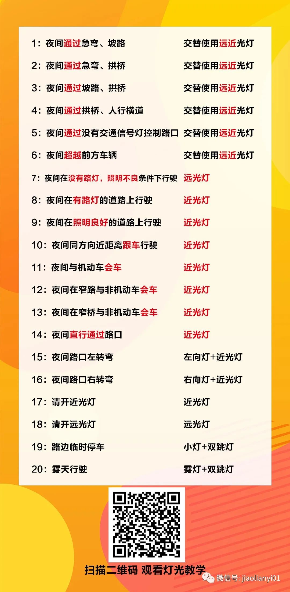

# driving license

## Meta

### 科目二学习顺序

* 入门右出库
* 入门右倒库
* 入门左出库
* 入门左倒库
* 侧方停车（右）
* 侧方停车（右）出库
* 右倒库
* 左出库
* 左倒库
* 右出库
* 半坡停车
* 半坡停车后起步
* 直角转弯
* 曲线行驶

### 科目二考试顺序

* 半坡停车
* 半坡停车后起步
* 直角转弯
* 曲线行驶
* 侧方停车（右）
* 侧方停车（右）出库
* 右倒库
* 左出库
* 左倒库
* 右出库
* 考试结束

### 科目三考试顺序

* 绕车一周
* 夜间灯光模拟
* 起步
* 直线行驶
* 超车左变道
* 超车右变道
* 加减档-加四挡
* 加减档-减三挡
* 路边临时停车
* 路边临时停车后起步
* 右转弯汇入车道
* 左转弯
* 掉头
* 停车
* 考试结束

### 场口考场三四号线地图

## 入门

### 启动

* 停车状态
  * 空档、手刹、熄火
* 调整座位
  * 调整高度（影响前后），最高
  * 调整前后，把刹车踩到底，膝盖距离座舱一拳
  * 调整靠背角度，胳膊伸直，手腕恰好搭在方向盘上
* 调整后视镜
  * 左右后视镜能看到后轮
* 系好安全带
* 首次点火
  * 停车状态，空档点火
  * 钥匙拧到底直到点火完成
* 熄火点火
  * 未拉手刹状态，踩住刹车
  * 切换到空档点火，踩离合点火扣分
  * 钥匙拧到底直到点火完成
* 技巧
  * 打开空调、不容易熄火

### 右出库（入门）

* 点位（根据身高、座位位置确定）
  * 车头到线
  * 车头左角到线，宝来机舱盖左凸起
* 操作要点
  * 速度越慢越好，速度快，方向盘打的迟，点位不准
  * 挂1档，缓抬离合，半联动
  * 直走
  * 车头到线右打死
  * 车头左角到同一根线左回半圈（回平）
  * 车直了左回一圈（回正）
  * 身体过线停
  * 右出库完成

### 右倒库（入门）

* 点位
  * 左后视镜与左车道横线相对位置
  * 右镜内车尾到第三根线
  * 车位右角后边线右30cm点位
  * 左后视镜与库位前端线
* 操作要点
  * 倒挡，缓抬离合，半联动
  * 直倒
  * 左镜角碰车道横线右打死
  * 看右镜内车尾到第三根线左回半圈
  * 看右镜内车尾到车位右角后边线右30cm点位左回一圈
  * 看左镜内车和车位左边线平行（左边距大左微调，做边距小右微调）
  * 后退到左后视镜与库位前端线点位停
  * 右倒库完成

### 左出库（入门）

* 点位
  * 肩过线50公分
  * 左门拉手角过线
* 操作要点
  * 1档，缓抬离合，半联动
  * 直走
  * 肩过线50公分左打一圈1/4
  * 左转弯直到左门拉手角过线停车
  * 左出库完成

### 左倒库（入门）

* 点位
  * 左后视镜看左车尾离右库角10公分
  * 左后视镜看左车尾到倒库前边虚线右起第三根线
* 操作要点
  * 在左出库位置的基础上操作
  * 倒挡，缓抬离合，半联动
  * 左后视镜看左车尾离车位右角10公分左打死
  * 左后视镜看左车尾到车位前边虚线右起第三根线右回半圈
  * 左后视镜看左车尾到车位后边线左30cm点位右回一圈（回正）
  * 看左镜内车和车位左边线平行（左边距大左微调，做边距小右微调）
  * 车和线平行后，继续倒车到停车点位停车
  * 左倒库完成

## 科目二

### 启动

同入门启动

### 半坡停车

* 点位

* 操作要点

  * 一档，缓抬离合，半联动
  * 车道右侧到右门中间右打死
  * 人对坡道中间停字回正
  * 人对停字松点离合器上坡
  * 看左边肩对线刹车停（或者停车杆距离挡风玻璃右边15cm停）
  * 拉手刹立马放手刹

* 考试要求

  * 车头距离停车线前后不超过30cm
  * 车右边距离右边线不超过30cm

  

### 半坡停车后起步

* 点位

* 操作要点

  * 一档，缓抬离合至抖动稳住离合，增强半联动

  * 放脚刹

  * 稳住离合起步（起步缓慢也不要继续抬离合，否则容易熄火）

  * 下坡带刹车踏离合下坡（可以准备直角转弯位置）

  * 平地停车（增加打右转向灯时间时机）

### 直角转弯（右）

* 点位
* 操作要点
  * 开右转向灯
  * 一档，缓抬离合，半联动
  * 车头左角对直角左边线点位进直角（尽量靠左，给右转弯留足空间）
  * 看右门拉手对右边直角横线右打死（打死要快，速度要慢，才能增加转弯角度）
  * 关转向灯
  * 等车直了左回正
* 考试要求
  * 不能停车打方向
  * 车身左右不能压线
  * 打转向灯

### 曲线行驶

* 点位
* 操作要点
  * 车头到线右打一圈（驾校和考场都不用到线，可以提前对准，只要保证直角转弯完成即可）
  * 车头左角对s右边线上点位左回正（进左s）
  * 看车头左角盖右线左打一圈又四分之一（左s转弯）
  * 左角沿右s线走完到左s线右回正（直行）
  * 看右门镜角，出现s右线右打一圈又四分之一（进右s）
  * 等没线方向往左放四分之一的三分之二走完s型（右s转弯）

### 侧方停车（右）准备

* 点位
* 操作要点
  * 看雨刷中间对侧方库位左边线左回正
  * 直行到雨刷中间过侧方库位左边线左一圈
  * 雨刷中间沿线扫过侧方库位左边线直到车回正
  * 人过右边杆子停（考场有棵树）
  * 侧方停车准备完毕

### 侧方停车（右）

* 点位
* 操作要点
  * 倒档，缓抬离合，半联动
  * 看右边杆子到右门的后1/3，右打一圈
  * 看左镜后面横杆，车左后角走完横杆（侧方左后角走到右后角30cm），左回正
  * 伸头看后轮压线（压到线上）左打死
  * 看车直停车（必须保证车左前角进库位内）
  * 保持方向盘不需要回正

### 侧方停车出库（右）

* 点位
* 操作要点
  * 开左灯
  * 一档，缓抬离合，半联动
  * 车头左角到左边线（主干道两车道中线）右回一圈半
  * 再看雨刷中间到同一根线，右打一圈
  * 看前面车直左一圈回正

### 右倒库准备（驾校）

* 操作要点
  * 车头到线左一圈
  * 车头左角盖线右2圈
  * 车直左一圈
  * 左角对前面点位（或者座位中点对准车道虚线左一线中间）
  * 横线到左车门中间停（车要正）

### 右倒库

* 操作要点
  * 挂倒档、缓抬离合、半联动
  * 镜角碰线右打死
  * 右镜内车尾到右段线中间左回半圈
  * 车尾对后面点位左回一圈
  * 看左边车和线要平行（车要直）
  * 左镜角压线停

### 左出库

* 操作要点
  * 一档、缓抬离合、半联动
  * 肩过线50公分左打一圈1/4
  * 走到左门拉手过线停

### 左倒库

* 操作要点
  * 倒档
  * 原方向往后退到库角差点左打死
  * 车尾到第三根线右回半圈
  * 车尾碰后面点位右回正

### 右出库

* 操作要点
  * 

## 科目三

### 准备

* 操作要点
  * 逆时针绕车一周，按车右后方按钮，按车左前方按钮
  * 调整座位
  * 调整后视镜
  * 系好安全带

### 启动

* 同入门启动

### 夜间灯光模拟

### 起步

* 操作要点
  * 左转向灯
  * 鸣笛
  * 踩刹车
  * 松手刹
  * 踩离合
  * 挂一档（挂一档后起步有时间限制，最后挂一档）
  * 缓抬离合，半联动
  * 踩离合，刹车，前方流出50米距离再起步，避免一档、二档长距离行驶
  * 缓抬离合，半联动
  * 踩油门、15kmph挂二档、25kmph挂三档

### 直线行驶

* 操作要点
  * 走在车道中间
  * 盯住远处固定点位
  * 慢速行驶

### 超车

* 操作要点
  * 打左转向灯，保持三秒
  * 无车左变道，有车放弃
  * 打右转向灯，保持三秒
  * 无车右变道，有车放弃

### 加减档

* 操作要点
  * 前方留出200米直线距离
  * 踩油门、35kmph挂四档
  * 行驶100米
  * 轻点踩刹车，减速至25kmph减减三挡
  * 转弯时必须三档，需要注意选择时机

### 路边临时停车

* 操作要点
  * 看到地上线停车（考场有水泥柏油接缝），增加操作时机
  * 打右转向灯
  * 换一档，缓抬离合，半联动
  * 驾驶员对准地上白点直走，车正了停车
  * 换空档
  * 拉手刹
  * 打双闪

### 路边临时停车后起步

* 操作要点
  * 前方留出50米举例
  * 关双闪
  * 打左转向灯
  * 鸣笛
  * 松手刹
  * 挂一档，缓抬离合，半联动
  * 离合联动后，踩油门、15kmph挂二档、25kmph挂三档，避免一二档长距离行驶

### 汇入车道

* 操作要点
  * 根据行驶方向提前打转向灯
  * 道路不畅通则停车，避免一二档长距离行驶
  * 预判车道没车时，缓抬离合、半联动、起步后踩油门、15kmph挂二档
  * 直到汇入车道
  * 道路不畅通则停车，避免一二档长距离行驶
  * 道路畅通、踩油门、25kmph挂三档，避免一二档长距离行驶

### 右转弯

* 操作要点
  * 打右转向灯
  * 驾驶员肩过路角右打死（右转弯角度小）
  * 转过头后方向盘回正
  * 踩油门、15kmph挂二档、25kmph挂三档，避免一二档长距离行驶

### 左转弯

* 操作要点
  * 打左转向灯
  * 踩油门、15kmph挂二档（左转弯距离长，需要二档过弯，避免一档长距离行驶）
  * 驾驶员肩过两车道中线左打一圈（左转弯角度大，不需要左打死）
  * 车正后、踩油门、25kmph挂三档，避免二档长距离行驶

### 掉头

* 点位
* 操作要点
  * 打左转向灯
  * 路口停车线前先停一次车，避免长距离2档行驶，增加步骤作为换挡时机
  * 挂一档
  * 身体过线50cm左打死
  * 车正了方向回正
  * 踩油门15kmph挂二档，踩油门25kmph挂三档，避免长时间一二档行驶

### 摇头

* 操作要点
  * 听到会车、看到学校、看到公交车站，需要左右摇头
  * 左右摇头有视频拍摄，需要扭转到位

### 等红绿灯

* 操作要点
  * 看到红灯时，轻点刹车减速
  * 踩离合、滑行、匀速刹车
  * 注意换一档、踩离合、踩刹车等红灯
  * 起步注意缓抬离合、半联动、松刹车、松离合联动
  * 踩油门15kmph挂二档，踩油门25kmph挂三档，避免长时间一二档行驶
