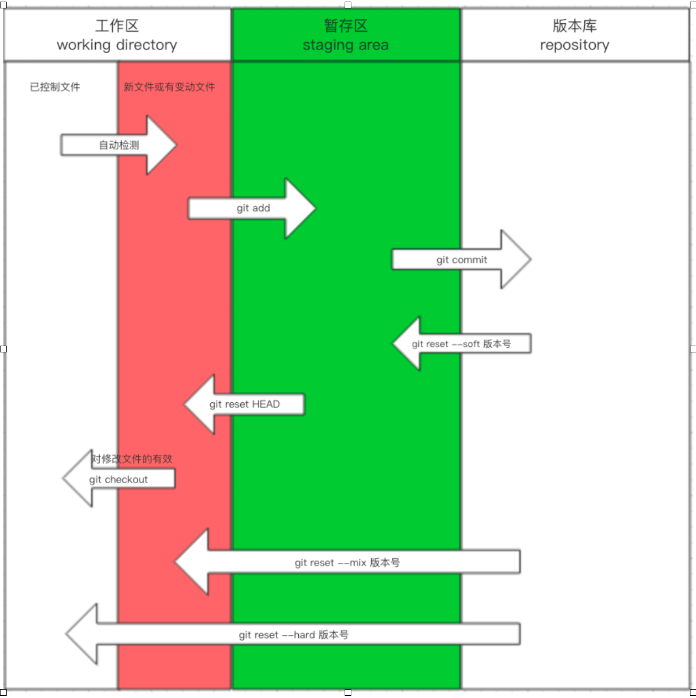

# git

## git简介

* 分布式
* 版本控制

### 版本控制发展历程

1. 保存多份文件
2. 本地版本控制
3. 集中式版本控制（Server），只有服务器保存全部版本
4. 分布式版本控制，每个节点都保存全部版本

## git本地使用方法

###  首次使用版本库

```bash
# 个人信息配置
git config --global user.email "your@email.com"
git config --global user.name "your name"

# 初始化目录

# 在目标目录执行
git init

# 初始化目标目录为git管理目录
# 生成.git隐藏目录，存放版本信息
```

### 查看当前目录中文件的状态

* 进入目标目录
* `git status`，文件三种状态
  * new file，绿色，
  * untracked files，未追踪且未忽略的文件，modified，已追踪已修改但是未提交的文件，红色，
  * 已追踪未被修改
* 三个区域
  * 工作区，用户可见的目录，通过`git add` 提交到暂存区
    * 已管理
    * 新文件，已修改的
  * 暂存区，通过`git commit`提交到版本库
  * 版本库



### 管理文件

* `git add file` 添加file为管理文件
* `git add .` 添加所有未追踪的文件为管理文件

### 提交版本

`git commit -m '提交信息'`

### 查看提交记录

```bash
git log

# 带分支图的提交记录
git log --graph

# 简化分支图的提交记录
# %h 哈希值
# %s 提交说明
git log --graph --pretty=format:"%h %s"
```

### 回滚到之前版本

```bash
git log # 查找版本后
git reset --hard 之前版本号
```

### 回滚到之后版本

```bash
git reflog
git reset --head

```

### 撤销工作区的修改

```bash

git checkout
git checkout -- file

# 自修改后还没有被放到暂存区，撤销修改就回到和版本
# 已经添加到暂存区后，又作了修改，撤销修改就回到添加到暂存区后的状态。

# 将暂存区恢复到未追踪
git reset HEAD

```

### 删除文件

```bash
git rm file

```


## git分支使用方法

### 查看所有分支（及当前所在分支）

```bash
git branch
```

### 创建分支

```bash
git branch 分支名称
```

### 切换到分支

```bash
git checkout 分支名称
```

### bug合并到主干

```bash
# 先切换到主干
git checkout master
# 主干合并分支
git merge 分支名称

# 无冲突时，git merge 分支名称 已经合并成功
# 有冲突时，手动处理冲突文件后再commit，才能完成合并
git add .
git commit -m '合并'
```

### 删除分支

```bash
git branch -d 分支名称
```

### fast-ford

* 默认分支合并都会使用fast-forward模式
* 当要合并的分支超前于当前分支并且没有冲突时，当前分支直接指向合并分支的记录节点
* 使用 -no-ff 参数可以关闭 fast-forward模式
* 关闭fast-forward模式时，一定会创建新的节点，所以需要配合使用 -m 关键字

### 暂存工作区（git stash）

* **当checkout时，工作区和暂存区都会被覆盖**
* 如果想保留，应使用`git stash`

```bash
# 保存工作区
git stash

# 查看工作区
git stash list

# 恢复工作区
git stash apply

# 删除工作区
git stash drop

# 恢复并删除工作区（apply + drop）
git stash pop

# 恢复特定工作区
git stash pop stash@{0}
```

### 合并特定提交（bug修复）

```bash
git cherry-pick sha1
```

## 代码托管使用方法

### 上传到托管

```bash
# 在托管新建仓库后

# 在本地执行

# 如果代码不是从托管下载的，是在本地新建的，则需要先关联远程仓库
git remote add origin 远程仓库地址

# 重设远程地址
git remote set-url origin [url]

# 删除远程仓库
git remote rm origin

# 如果远程仓库比本地新，则需要先同步远程仓库，先进行merge
# -u 为保存记录提交到 origin  master
# -u 等同于 --set-upstream
git pull -u origin master
git pull --set-upstream origin master
git push -u origin master
git push --set-upstream origin master

# 下次仅需使用
git pull
git push

# 不保存upstream，每次执行需要
git pull origin master
git push origin master

# 设置代理
git config --global http.proxy http://127.0.0.1:10809
```

### 管理远程库

```bash
# 查看当前添加的远程库
git remote

git remote -v

# 添加远程库
git remote add origin 远程仓库地址

# 重设远程地址
git remote set-url origin [url]

# 删除远程仓库
git remote rm origin

```


### 从托管下载

```bash
git clone https://github.com/yingxuanxuan/learning_notes.git
# 下载后只显示master分支
# 虽然看不到，但是可以直接进行切换
```

### 将dev分支更新到master最新

```bash
git merge master
```

### 拉取代码冲突

```bash
# 拉取代码时，本地和远程可能同时修改了dev分支
git pull origin dev
# 拉取时会自动合并
# 无法合并的会merge confilict

git pull origin dev
# 命令等同于
git fetch origin dev # +
git merge origin/dev

```

## 变基（rebase）

* 可以使提交记录变得简洁

### 合并一个分支的多条记录

* 只合并本地记录，尽量不要合并已经提交到远程的记录

```bash
# 合并三条记录

git rebase Head~3
# 在交互界面中，编辑合并过程，修改为s
# 在交互界面中，编辑合并记录
```

### 合并开发分支避免master分叉

* 可能丢失提交过程的细节

```bash
# 在branch rebase
git checkout dev

# 将dev变基到master
git rebase master

# 在master merge
git checkout master

# 将dev merge 到master
git merge dev
```

### 合并一个分支的同一记录产生的两个记录（拉取代码冲突）

```bash
git pull 

git fetch origin dev
git rebase origin/dev
```


### rebase冲突

```bash
git rebase

# 手动解决冲突
git status # 可以看到 rebase 进行中

# 解决冲突后继续rebase
git add .
git rebase --continue

```


## 配置beyond compare

```bash
# 设置冲突软件名称为bc3
git config --global merge.tool bc3

# 设置冲突软件路径
git config --global mergetool.path 'C:\Program Files (x86)\Beyond Compare 3\BCompare.exe'

# 关闭保存原始文件
git config --global mergetool.keepBackup false

# 打开软件
git mergetool
```


## tag推送

```bash
# 在当前分支当前提交打标签
git tag v1

# 给特定提交打标签
git tag v2 提交sha1

# 删除本地标签
git tag -d v2

# 查看所有标签
git tag

# 查看标签详细信息
git show v1

# 推送所有标签到远程仓库
git push origin --tag

# 推送特定标签到远程仓库
git push origin v1
```


## 个人仓库协同开发


## 组织仓库协同开发

* 邀请

* 修改权限


## 分支规则设置（review）


## 分支间提交pull request


## 仓库间提交pull request

* fork
* 修改
* pull request

## 配置文件

三个配置文件

## git免密

### 方法一：url

```bash

git remote add origin https://用户名:密码@github.com/xxx/xx.git
```

### 方法二：私钥

```bash
ssh-keygen

# 生成
# 公钥：id_rsa.pub
# 私钥：id_rsa

# 将公钥保存至github
git remote add origin git@github.com

```

### 方法三：自动管理凭证


