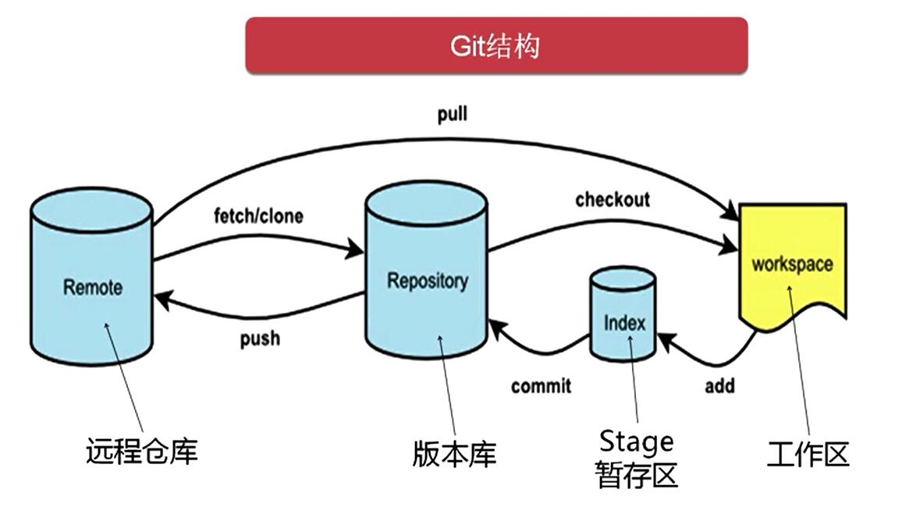
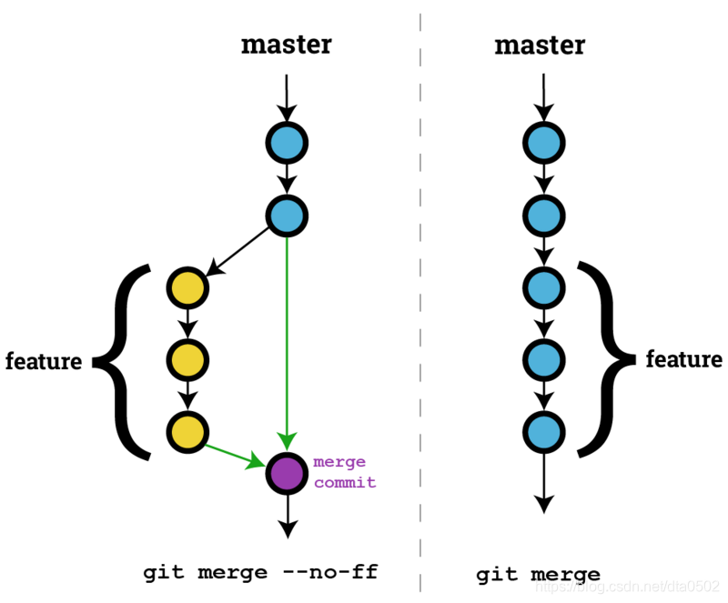

# git


## 概念

* git是什么
  * 分布式
  * 版本控制
  * 软件


* 版本控制发展历程
  * 人工版本控制，保存多份文件
  * 本地版本控制
  * 集中式版本控制（Server），只有服务器保存全部版本
  * 分布式版本控制，每个节点都保存全部版本


* 为什么要做版本控制
  * 统一管理版本
  * 保存版本变更历史，追踪缺陷和新功能的变更
  * 多人协作防止和解决冲突
  * 管理权限和流程


## 安装

* git-scm
  * git官方
  * 依赖于mingw
  * <https://git-scm.com/>
  
* GitHub Desktop
  * github官方
  * 


## git本地使用场景


### windows下快速打开git-scm

* 使用要点
  * 在目录中点击右键
  * 在弹出菜单中选择`git bash here`


###  首次使用版本库

```bash
# 个人信息配置
git config --global user.email "your@email.com"
git config --global user.name "your name"

```


### 初始化本地仓库

* 使用要点
  * 初始化目标目录为git管理目录
  * 生成`.git`隐藏目录，存放版本信息

```sh
# 在目标目录执行
git init
```


### 查看当前目录中文件的状态

* 操作要点
  * 在目标目录执行`git status`


* 文件三种状态
  * new file，绿色，
  * untracked files，未追踪且未忽略的文件，modified，已追踪已修改但是未提交的文件，红色，
  * 已追踪未被修改


* 三个区域
  * 工作区，用户可见的目录，通过`git add` 提交到暂存区
    * 已管理
    * 新文件，已修改的
  * 暂存区，通过`git commit`提交到版本库
  * 版本库




* 状态迁移
  * `git add`，提交到暂存区
  * `git commit`，提交到版本库（生成一个新版本）
  * `git reset --soft 版本号`，恢复版本到暂存区
  * `git reset HEAD`，将暂存区状态恢复到工作区
    * `git reset` 命令的默认模式是 `--mixed`，也就是说，如果不指定模式，`git reset`将重置暂存区的文件与上一次提交保持一致，但工作区文件内容保持不变
    * `git reset`功能为切换（重置）到某版本，此处使用HEAD（或省略，默认HEAD）代表当前版本
  * `git checkout`，恢复工作区状态到当前版本（即HEAD）
    * `git checkout`原本用于切换工作区分支，此处效果为清除新文件或有变动的文件
  * `git reset 版本号`，恢复指针到指定版本，重置暂存区，==工作区内容保持不变==
    * `git reset` 命令的默认模式是 `--mixed`，也就是说，如果不指定模式，`git reset` 将重置暂存区的文件与上一次提交保持一致，但工作区文件内容保持不变
  * `git reset --hard 版本号`，恢复指针到指定版本（默认HEAD），重置暂存区，==工作区内容也重置==
    * `git reset --hard` 命令将撤销工作区中所有未提交的修改内容，并将暂存区与工作区都回到上一次提交的版本


### 管理文件

* `git add file` 添加file为管理文件
* `git add .` 添加所有未追踪的文件为管理文件


### 提交版本

```bash
git commit -m '提交信息'
```


### 查看提交记录

```bash
git log

# 带分支图的提交记录
git log --graph

# 简化分支图的提交记录
# %h 哈希值
# %s 提交说明
git log --graph --pretty=format:"%h %s"
```


### 回滚到之前版本

```bash
# 查看版本号
git log

# 切换版本
git reset --hard 版本号
```


### 回滚到之后版本

* 操作要点
  * 回滚之后，当前版本之后的版本号会消失，使用`git reflog`查看版本号

```bash
# 查看版本号
git reflog

# 切换版本
git reset --head 版本号
```


### 撤销工作区的修改

```bash
git checkout
git checkout -- file

# 自修改后还没有被放到暂存区，撤销修改就回到和版本
# 已经添加到暂存区后，又作了修改，撤销修改就回到添加到暂存区后的状态。

# 将暂存区恢复到未追踪
git reset HEAD

```


### 删除文件

```bash
git rm file

```


## git分支使用场景


### 概念

* 什么是分支
  * 分支是一个软件版本库中的一条独立的开发线，可以让用户从开发主线上分离开来，在不影响主线的同时继续工作


* 为什么使用分支
  * 允许您在同一代码库中同时开发多个功能或修复不同的问题，而不会影响主分支的稳定性
  * 在没有分支的情况下，所有开发人员都必须在同一代码库中工作，这可能会导致代码冲突和不稳定性。使用分支，每个开发人员都可以在自己的分支上工作，而不会影响其他开发人员的工作。这使得团队能够更轻松地协作，同时保持代码库的稳定性
  * 分支还允许您在不影响主分支的情况下进行实验性开发。如果您想尝试一些新功能或更改，但不确定它们是否会影响主分支的稳定性，您可以在自己的分支上进行实验，而不会影响其他开发人员的工作


* 分支的使用场景
  * 功能开发分支，dev
  * 问题修复分支，bugfix
  * 版本发布，master
  * 多人协作，`git clone`


### 查看所有分支（及当前所在分支）

```bash
git branch
```


### 创建分支

```bash
git branch 分支名称
```


### 切换到分支

```bash
git checkout 分支名称
```


### 合并分支

```bash
# 先切换到主干
git checkout master

# 主干合并分支
git merge 分支名称

# 无冲突时，git merge 分支名称 已经合并成功
# 有冲突时，手动处理冲突文件后再commit，才能完成合并
git add .
git commit -m '合并'
```


### 删除分支

```bash
git branch -d 分支名称
```


### 合并的fast-forward模式

* 什么是fast-forward模式
  * 当要合并的分支超前于当前分支并且没有冲突时，当前分支直接指向合并分支的记录节点
  * 默认分支合并都会使用fast-forward模式


* 打开关闭fast-forward模式的对比





* 关闭fast-ford模式
  * 使用 -no-ff 参数可以关闭 fast-forward模式
  * 关闭fast-forward模式时，一定会创建新的节点，所以需要配合使用 -m 关键字


* fast-ford模式的优点
  * 线性历史
    * 快进合并会将要合并的分支的更改直接应用到目标分支上，从而创建一个线性的提交历史。目标分支的提交历史是连续的，没有分叉。这种线性历史对于跟踪更改、查看提交历史以及理解项目的演进非常有用。
  * 单人项目或个人工作流程
    * 如果只有一个人在项目上工作，可以轻松地将功能分支的更改合并到主分支上，而不会创建额外的合并提交，这样的线性历史对于个人项目或小规模项目来说更清晰。


* 关闭fast-ford模式的优点
  - 保留合并历史
    - `--no-ff` 创建的合并提交保留了分支的历史信息，更容易理解和追踪
  - 防止丢失信息
    - 如果只使用快进更新，那么在主干上看不到看不到分支的存在，这可能导致信息丢失


## 分支管理策略

* 常见的分支策略有以下三种
  * GitFlow
  * GitHubFlow
  * GitLabFlow


### GitFlow

* GitFlow通常包含五种类型的分支：Master分支、Develop分支、Feature分支、Release分支以及Hotfix分支。

  - Master分支：主干分支，也是正式发布版本的分支，其包含可以部署到生产环境中的代码，通常情况下只允许其他分支将代码合入，不允许向Master分支直接提交代码（对应生产环境）。

  - Develop分支：开发分支，用来集成测试最新合入的开发成果，包含要发布到下一个Release的代码（对应开发环境）。

  - Feature分支：特性分支，通常从Develop分支拉出，每个新特性的开发对应一个特性分支，用于开发人员提交代码并进行自测。自测完成后，会将Feature分支的代码合并至Develop分支，进入下一个Release。

  - Release分支：发布分支，发布新版本时，基于Develop分支创建，发布完成后，合并到Master和Develop分支（对应集成测试环境）。

  - Hotfix分支：热修复分支，生产环境发现新Bug时创建的临时分支，问题验证通过后，合并到Master和Develop分支。


* 开发过程示例
  * 从Develop分支拉取一条Feature分支，开发团队在Feature分支上进行新功能开发
  * 开发完成后，将Feature分支合入到Develop分支，并进行开发环境的验证
  * 开发环境验证完成，从Develop分支拉取一条Release分支，到测试环境进行SIT/UAT测试
  * 测试无问题后，可将Develop分支合入Master分支，待发版时，直接将Master分支代码部署到生产环境。


.png)


* 优点
  * 每个分支都有明确的定义，严格按照GitFlow管理项目代码的话，很难出现代码混乱


* 缺点
  * 如果特性分支过多的话很容易造成代码冲突，从而提高了合入的成本；由于每次提交都涉及多个分支，所以GitFlow也太不适合提交频率较高的项目。


### GitHubFlow

* 什么是
  * 来源于GitHub团队的工作实践。当代码托管在GitHub上时，则需要使用GitHubFlow。
  * GitHubFlow通常只有一个Master分支是固定的，而且GitHubFlow中的Master分支通常是受保护的，只有特定权限的人才可以向Master分支合入代码。
  * 在GitHubFlow中，新功能开发或修复Bug需要从Master分支拉取一个新分支，在这个新分支上进行代码提交；功能开发完成，开发者创建Pull Request（简称PR），通知源仓库开发者进行代码修改review，确认无误后，将由源仓库开发人员将代码合入Master分支。

.png)


* 提交代码通常是commit或者push，拉取代码才是pull，为什么GitHubFlow中提交代码提出的是“Pull Request”。
  * 因为在GitHubFlow中，PR是通知其他人员到你的代码库去拉取代码至本地，然后由他们进行最终的提交，所以用“pull”而非“push”。


* 优点
  * 是相对于GitFlow来说比较简单，相比GitFlow而言，GitHubFlow没有那么多分支


* 缺点
  * 是因为只有一条Master分支，万一代码合入后，由于某些因素Master分支不能立刻发布，就会导致最终发布的版本和计划不同。

 

### GitLabFlow

* 什么是
  * GitLabFlow是开源工具GitLab推荐的做法。
  * GitLabFlow支持GitFlow的分支策略，也支持GitHubFlow的“Pull Request”（在GitLabFlow中被称为“Merge Request”）。
  * 相比于GitHubFlow，GitLabFlow增加了对预生产环境和生产环境的管理，即Master分支对应为开发环境的分支，预生产和生产环境由其他分支（如Pre-Production、Production）进行管理。在这种情况下，Master分支是Pre-Production分支的上游，Pre-Production是Production分支的上游；
  * GitLabFlow规定代码必须从上游向下游发展，即新功能或修复Bug时，特性分支的代码测试无误后，必须先合入Master分支，然后才能由Master分支向Pre-Production环境合入，最后由Pre-Production合入到Production。
  * GitLabFlow中的Merge Request是将一个分支合入到另一个分支的请求，通过Merge Request可以对比合入分支和被合入分支的差异，也可以做代码的Review。

.png)


## github使用场景

* github中新建仓库，有两种方式
  * 方式一：在github上初始化项目
    * 操作
      * 在github上创建有内容的仓库
      * 在本地`git clone`这个仓库
    * 优点
      * 操作简单
    * 缺点
      * 仅在新项目时操作简单
      * 仅适用于新项目
  * 在本地初始化项目，与github上的空项目绑定
    * 操作
      * 在github上创建空仓库
      * 在本地新建仓库（或已有仓库）
      * 在本地添加远程仓库
      * 在本地推送分支到远程仓库
    * 优点
      * 适用于已有代码或已有仓库的情况


### 方式一：在github上初始化项目

* 使用要点
  * 在想要建立仓库的本地目录执行


* 注意事项
  * 下载后只显示master分支
  * 虽然看不到，但是可以直接进行切换

```bash
# 进入本地目录执行
# 或使用参数指定
git clone https://github.com/yingxuanxuan/learning_notes.git
```


### 方式二：在github上新建空仓库

* 操作要点
  * 在github上新建新仓库，获取仓库地址
  * 在本地新增远程仓库
  * 推送本地分支到远程仓库


* 注意事项
  * 由于代码不是从托管下载的，是在本地新建的，则需要先关联远程仓库

```py
# git remote add origin 远程仓库地址
git remote add origin https://github.com/yingxuanxuan/test.git

# 推送本地分支到远程仓库
git push -u origin master
```


### 同步远程与本地仓库

* 操作要点
  * 首先拉取并合并分支，pull
  * 然后推送本地分支，push


* pull无冲突的操作
  * 无需操作，已经形成一个无冲突的新的提交
  * 推送到远程


* pull有冲突的情况
  * 手动处理冲突文件
  * 提交手动合并的版本`git commit -m`
  * 推送到远程


* 注意事项
  * 如果远程仓库比本地新，则需要先同步远程仓库，先进行merge

```bash
# 拉取并合并
git pull -u origin master
# 或
git pull --set-upstream origin master


# 推送主干
git push -u origin master
# 或
git push --set-upstream origin master


# 推送分支
git push origin dev
```


* 保存默认推送仓库
  * `-u` 为保存 `pull` / `push` 默认操作参数为 `origin  master`
  * `-u` 是 `--set-upstream` 的简写

```bash
# 不保存upstream，每次执行需要
git pull origin master
git push origin master

# 保存upstream，下次仅需使用
git pull
git push
```


* 理解pull

  * `pull = fetch + merge`
  * 远程和本地同步相当于两个分支之间合并，只是合并前多一步下载操作

  * 先拉取，后自动合并

  * 合并默认会形成一个新的提交

```bash
# git pull 命令等同于 git fetch + git merge
git pull origin dev

git fetch origin dev # +
git merge origin/dev
```


* 为什么会产生拉取代码冲突
  * 拉取代码时，本地和远程可能同时修改了dev分支，拉取时会自动合并
  * 无法合并的会导致`merge confilict`


### 管理远程库

```bash
# 查看当前添加的远程库
git remote

git remote -v

# 添加远程库
git remote add origin 远程仓库地址

# 重设远程地址
git remote set-url origin [url]

# 删除远程仓库
git remote rm origin

# 设置代理
git config --global http.proxy http://127.0.0.1:10809
```


## 变基，rebase

* 可以使提交记录变得简洁


* 三种使用场景
  * 合并一个分支的多条提交记录，隐藏开发过程
  * 分支合入主干前变基到主干，避免主干分叉
  * 本地同步远程时变基到远程，避免分支分叉


### 合并一个分支的多条提交记录

* 场景说明
  * 管理员只需要看到最终结果，隐藏程序员开发过程


* 注意事项
  * 尽量不要合并已经提交到远程的记录，只合并本地记录


* 操作要点
  * 选择要合并的提交记录区间
  * 设置提交记录的合并方式
  * 编辑合并后的提交记录的comment

```bash
# 切换到需要合并的分支
git rebase Head~3
# 在交互界面中，设置提交记录的合并方式。将需要合并的提交记录标记，修改为s。
# 在交互界面中，编辑合并后的提交记录的comment
```


### 分支合入主干前变基到主干

* 场景说明
  * 避免主干分叉


* 注意事项
  * 可能丢失提交过程的细节


```bash
# 切换到分支
git checkout dev

# 在分支 rebase
# 将 dev 变基到 master
git rebase master

# 切换到主干
git checkout master

# 在主干 merge
# 将 dev 合并到 master
git merge dev
```


### 本地同步远程时变基到远程

* 场景说明
  * 避免分支分叉


* 操作要点
  * 不能直接执行`git pull`，需要拆分执行
  * `git fetch`后，变基到远程仓库的版本

```bash
git fetch origin dev
git rebase origin/dev
```


### 查看提交记录分叉

```bash
# 图形化提交记录
git log --graph

# 图形化提交记录，并简化内容
git log --graph --pretty=format:"%h %s"
```


### 手动处理rebase冲突

* 注意事项
  * `rebase`合并后，就不需要`merge`了

```bash
git rebase

# 手动解决冲突
git status # 可以看到 rebase 进行中

# 解决冲突后继续rebase
git add .
git rebase --continue
```


## 暂存工作区，git stash

* **当checkout时，工作区和暂存区都会被覆盖**
* 如果想保留，应使用`git stash`

```bash
# 保存工作区
git stash

# 查看工作区
git stash list

# 恢复工作区
git stash apply

# 删除工作区
git stash drop

# 恢复并删除工作区（apply + drop）
git stash pop

# 恢复特定工作区
git stash pop stash@{0}
```


## 合并特定提交（bug修复）

```bash
git cherry-pick sha1
```


## git配置冲突处理软件


### beyond compare

```bash
# 设置冲突软件名称为bc3
git config --global merge.tool bc3

# 设置冲突软件路径
git config --global mergetool.path 'C:\Program Files (x86)\Beyond Compare 3\BCompare.exe'

# 关闭保存原始文件备份
git config --global mergetool.keepBackup false

# 打开软件
git mergetool
```


## tag与tag推送

```bash
# 在当前分支当前提交打标签
git tag v1

# 给特定提交打标签
git tag v2 提交sha1

# 删除本地标签
git tag -d v2

# 查看所有标签
git tag

# 查看标签详细信息
git show v1

# 推送所有标签到远程仓库
git push origin --tag

# 推送特定标签到远程仓库
git push origin v1
```


## github协同开发


### 个人仓库协同开发

* 创建个人仓库
* 邀请其他成员


### 组织仓库协同开发

* 在github中创建组织

* 邀请组织成员

* 修改成员在组织中的权限


### 分支规则设置（review）


### 分支间提交pull request


### 仓库间提交pull request

* fork
* 修改
* pull request


### github免密


#### 方法一，在url中拼接用户名和密码

```bash
git remote add origin https://用户名:密码@github.com/xxx/xx.git
```


#### 方法二，公钥私钥

```bash
ssh-keygen

# 1. 生成公钥私钥
# 公钥：id_rsa.pub
# 私钥：id_rsa

# 2. 将公钥保存至github

# 3. 在本地添加远程地址，使用git地址
git remote add origin git@github.com
```


#### 方法三，自动管理凭证


## 配置文件

* 三级配置文件
  * git有三级配置文件
    * local，项目配置
    * global，全局配置
    * system，系统配置
  * 配置项优先级，local > global > system


* 三级配置路径
  * local，在`项目/.git/config/`下
  * global，在`~/.gitconfig`下
  * system，在`/etc/.gitconfig`下


* 命令行使用三级配置示例
  * 默认使用`--local`

```bash
# 查看所有配置
git config --list
git config --local --list
git config --global --list
git config --system --list

# 查看某个配置
git config --get user.name

# 添加配置
git config --add user.name "John Doe"

# 移除配置
git config --unset user.name
```


## 不再管理某些文件，.gitignore


### .gitignore的作用

* 确保某些不被 Git 跟踪的文件保持未跟踪状态


### .gitignore是什么

* `.gitignore` 文件是一个文本文件，每行包含一个要忽略的文件或目录的模式
* 通常放置在项目文件夹的根目录下
* 也可以将它放在存储库中的任何文件夹中，一个项目可以有多个 `.gitignore` 文件
* 想停止跟踪当前已经被跟踪的文件，可以使用 `git rm --cached` 命令将该文件从索引中删除。然后将该文件名添加到 `.gitignore` 文件中


### 总结好的.gitignore

* <https://github.com/github/gitignore>


### 示例

```py
# 忽略后缀名为`.h`的文件
*.h

# 排除忽略名为`a.h`的文件
!a.h

# 忽略目录
files/

# 排除后缀名为`.pyc`、`.pya`、`.pyd`的文件
*.py[c|a|d]
```

