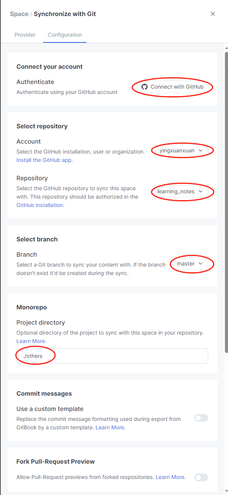
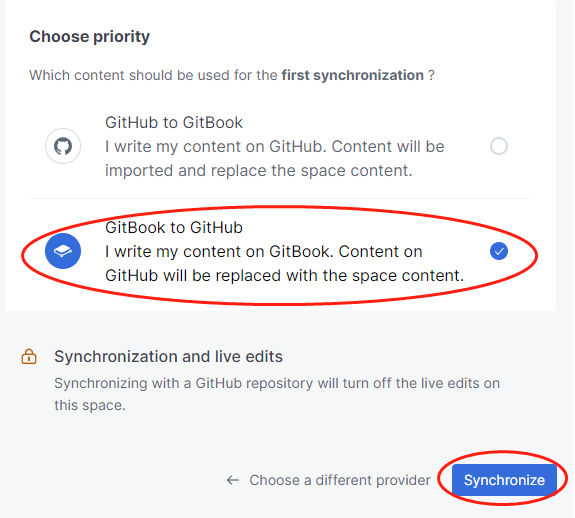

# gitbook.com使用问题记录

## gitbook space与github同步

* 打开gitbook右上角菜单栏，配置当前space
* 点击`Synchronize with Git`
* `Provider`选择`Github`，点击`Configure`
* `Authenticate`点击`Connect with GitHub`（弹出窗口连接账户）
* 下拉菜单选择`Account`
* 下拉菜单选择`Repository`（仓库需要提前在GitHub中创建）
* 下拉菜单选择`Branch`（新建空Repository首次提交需要手动输入默认branch名称）
* 选择`Project directory`（需要手动输入，留空为仓库根目录）
* 选择首次连接时同步方向（空`GitHub Repository`选择`GitBook to GitHub`）

<figure><figcaption></figcaption></figure>

<figure><figcaption></figcaption></figure>

## gitbook第一个page问题

* gitbook中创建的第一个page在git目录中保存为README.md
* 自动保存的README.md会阻碍在git目录中创建group和subpage目录
* 打开outline功能会自动生成一个SUMMARY.md作为space目录，gitbook会自动维护该目录

## gitbook中使用heading标签

* page名称在markdown中会保存为h1标签
* gitbook中使用的h1标签在markdown中会降级为h2标签

## gitbook中代码换行设置

* github不支持gitbook的代码换行设置

## gitbook中内容折叠

* github支持gitbook中的内容折叠设置
* gitbook使用html标签实现内容折叠

```html
<details>
    <summary>概要<summary>
    折叠的内容
</details>
```
